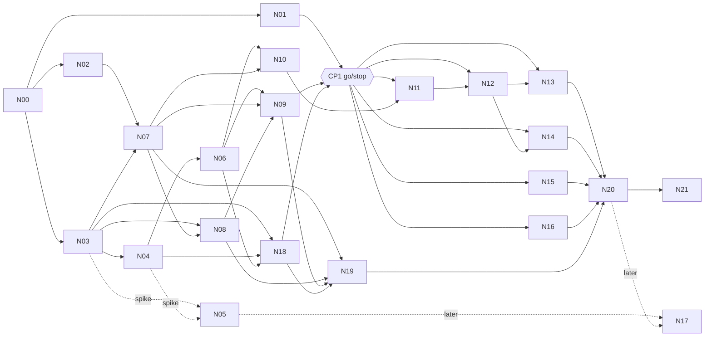
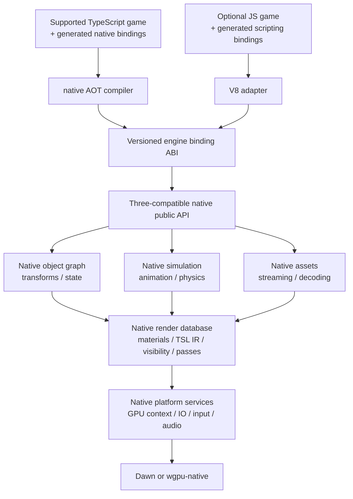

# ThreeNative Native Engine — Implementation Proposal

**Status:** Proposed architecture and delivery plan; not an implementation or a claim of benchmarked performance.  
**Prepared:** 4 October 2026.  
**Repository reference:** `ThreeNativeHQ/threenative`, `develop` commit `15adf350da53addfa33675c2b3f0e2722e086e37`.  
**Compatibility baseline:** workspace-pinned `three@0.185.1`, including ThreeNative’s current patch.  
**Audience:** Engineering owner and agents preparing individual PRDs.

All new package names, configuration fields, ABI names, status markers, and work-package identifiers below are proposals. They do not describe existing commands or published packages.

## PRD index

**Batch status: IN PROGRESS — 208/238 phase boxes (87%) as of 2026-10-06, on `feat/native-engine` (PR #438).** This file is the batch index and the source proposal; the PRDs below carry the boxes. Work packages too large for one PRD (at most 3 phases, about 8 boxes) are a folder with its own `README.md` and child PRDs. The batch moves to `done/` whole only when every PRD in it is finished.

### Progress

Generated from the PRD files' boxes; a PRD is done when every box is ticked.

| PRD | Work package | Boxes | State |
| --- | --- | --- | --- |
| [PRD-497](../done/native-engine/PRD-497-n00-architecture-decision-and-compatibility-inventory.md) | Architecture decision, scope and compatibility inventory (N00) | 6/6 | done |
| [PRD-498](PRD-498-n01-baseline-and-differential-fixture-runner.md) | Baseline and differential fixture runner (N01) | 3/4 | in progress |
| [PRD-499](PRD-499-n02-the-host-links-without-a-js-engine.md) | The host links and runs without a JS engine (N02) | 7/8 | in progress |
| [PRD-500](../done/native-engine/PRD-500-n03-api-catalog-binding-abi-and-version-protocol.md) | API catalog, binding ABI and version protocol (N03) | 7/7 | done |
| [PRD-501](N04-lifetime-and-numerics/PRD-501-n04a-math-matches-the-pinned-reference.md) | Math matches the pinned reference (N04a) | 4/5 | in progress |
| [PRD-502](../done/native-engine/N04-lifetime-and-numerics/PRD-502-n04b-handles-keep-identity-and-aliases.md) | Handles keep identity and aliases (N04b) | 5/5 | done |
| [PRD-503](../done/native-engine/N04-lifetime-and-numerics/PRD-503-n04c-unreachable-cycles-are-reclaimed.md) | Unreachable cycles are reclaimed (N04c) | 7/7 | done |
| [PRD-504](../done/native-engine/N04-lifetime-and-numerics/PRD-504-n04d-buffers-cross-the-abi-with-an-owner.md) | Buffers cross the ABI with an owner (N04d) | 7/7 | done |
| [PRD-505](../done/native-engine/N05-native-typescript-qualification/PRD-505-n05a-the-language-corpus-compiles-on-linux-x64.md) | The language corpus compiles on Linux x64 (N05a) | 6/6 | done |
| [PRD-506](../done/native-engine/N05-native-typescript-qualification/PRD-506-n05b-three-imports-bind-natively-and-callbacks-are-reclaimed.md) | Three imports bind natively and callbacks are reclaimed (N05b) | 6/6 | done |
| [PRD-507](N05-native-typescript-qualification/PRD-507-n05c-the-same-corpus-runs-on-android-arm64.md) | The same corpus runs on Android arm64 (N05c) | 0/4 | not started |
| [PRD-508](../done/native-engine/PRD-508-n06-native-scene-graph-transforms-cameras-geometry.md) | Native scene graph, transforms, cameras and geometry (N06) | 7/7 | done |
| [PRD-509](../done/native-engine/PRD-509-n07-gpu-resources-presentation-and-device-loss.md) | GPU resources, presentation and device loss (N07) | 8/8 | done |
| [PRD-510](../done/native-engine/N08-native-tsl-and-shader-packages/PRD-510-n08a-a-typed-shader-ir-with-ordered-effects.md) | A typed shader IR with ordered effects (N08a) | 4/4 | done |
| [PRD-511](../done/native-engine/N08-native-tsl-and-shader-packages/PRD-511-n08b-shader-packages-not-wgsl-text.md) | Shader packages, not WGSL text (N08b) | 6/6 | done |
| [PRD-512](../done/native-engine/N08-native-tsl-and-shader-packages/PRD-512-n08c-standard-pbr-and-deformation-that-shadows.md) | Standard PBR and deformation that shadows (N08c) | 5/5 | done |
| [PRD-513](../done/native-engine/N08-native-tsl-and-shader-packages/PRD-513-n08d-compute-multipass-and-a-dynamic-graph.md) | Compute, multipass and a dynamic graph (N08d) | 6/6 | done |
| [PRD-514](../done/native-engine/PRD-514-n09-native-renderer-and-standard-materials.md) | Native renderer and standard materials (N09) | 8/8 | done |
| [PRD-515](../done/native-engine/PRD-515-n10-native-gltf-cooked-assets-and-decoders.md) | Native glTF, cooked assets and decoders (N10) | 7/7 | done |
| [PRD-516](../done/native-engine/N11-native-animation/PRD-516-n11a-animation-mixer-semantics-in-native.md) | AnimationMixer semantics in native (N11a) | 6/6 | done |
| [PRD-517](../done/native-engine/N11-native-animation/PRD-517-n11b-morph-targets-and-property-tracks.md) | Morph targets and property tracks (N11b) | 4/4 | done |
| [PRD-518](../done/native-engine/N11-native-animation/PRD-518-n11c-skinning-palettes-and-pose-history.md) | Skinning palettes and pose history (N11c) | 7/7 | done |
| [PRD-519](PRD-519-n12-native-batching-visibility-lod-gpu-scene.md) | Native batching, visibility, LOD and GPU scene (N12) | 6/7 | in progress |
| [PRD-520](../done/native-engine/N13-native-streaming-and-world/PRD-520-n13a-bounded-streaming-admission-and-io-events.md) | Bounded streaming admission and IO events (N13a) | 5/5 | done |
| [PRD-521](../done/native-engine/N13-native-streaming-and-world/PRD-521-n13b-worldcells-and-worldtiles-run-native.md) | WorldCells and WorldTiles run native (N13b) | 6/6 | done |
| [PRD-522](../done/native-engine/N13-native-streaming-and-world/PRD-522-n13c-a-world-loads-walks-and-unloads-without-growth.md) | A world loads, walks and unloads without growth (N13c) | 4/4 | done |
| [PRD-523](../done/native-engine/N14-native-render-chain-and-advanced-visuals/PRD-523-n14a-the-render-graph-owns-passes-and-history.md) | The render graph owns passes and history (N14a) | 7/7 | done |
| [PRD-524](../done/native-engine/N14-native-render-chain-and-advanced-visuals/PRD-524-n14b-virtual-shadows-run-native.md) | Virtual shadows run native (N14b) | 5/5 | done |
| [PRD-525](../done/native-engine/N14-native-render-chain-and-advanced-visuals/PRD-525-n14c-probes-run-native.md) | Probes run native (N14c) | 5/5 | done |
| [PRD-526](N14-native-render-chain-and-advanced-visuals/PRD-526-n14d-post-effects-and-render-chains-run-native.md) | Post effects and render chains run native (N14d) | 4/5 | in progress |
| [PRD-527](../done/native-engine/N14-native-render-chain-and-advanced-visuals/PRD-527-n14e-particles-and-fluids-run-native.md) | Particles and fluids run native (N14e) | 4/4 | done |
| [PRD-528](../done/native-engine/PRD-528-n15-framework-loop-rapier-sync-input-services.md) | Framework loop, Rapier sync, input and services (N15) | 7/7 | done |
| [PRD-529](../done/native-engine/PRD-529-n16-native-playtest-inspection-telemetry.md) | Native playtest, inspection and telemetry (N16) | 6/6 | done |
| [PRD-530](PRD-530-n17-strict-native-typescript-game-packaging.md) | Strict native-TypeScript game packaging (N17) | 4/7 | in progress |
| [PRD-531](PRD-531-n18-v8-game-runtime-adapter.md) | V8 game runtime adapter (N18) | 7/8 | in progress |
| [PRD-532](../done/native-engine/PRD-532-n19-webassembly-native-core-browser-port.md) | WebAssembly native-core browser port (N19) | 8/8 | done |
| [PRD-533](PRD-533-n20-platform-qualification-performance-default-promotion.md) | Platform qualification, performance and default promotion (N20) | 2/9 | in progress |
| [PRD-534](PRD-534-cp1-the-native-engine-earns-the-port.md) | The native engine earns the port (CP1) | 2/5 | in progress |
| [PRD-535](PRD-535-n21-the-js-engine-is-deleted.md) | The JS engine is deleted (N21) | 0/7 | not started |

**CP1 (PRD-534), historical functional reading (2026-10-05), not the verdict:** `pnpm bench:engines --arms current,native-v8,native-cpp --workload heterogeneous` at 4,096 cubes (Xvfb and headless Dawn) measured hot path p50 10.26 ms for current ThreeNative, 23.60 ms through V8 and 13.28 ms from C++. That prototype preceded N12 native batching. The physical-desktop and Pixel 8 verdict runs remain open; these early timings do not describe the current engine.

**Current performance boundary (2026-10-07):** the overnight optimization search reached its bounded engineering ceiling for the frozen 64k browser workload: median paired Three/Perry gain 1.30×, with zero pixel mismatches. This is neither an absolute upper bound nor the required 2× default-promotion proof. N20 qualification and its failed 18× scaling gate remain open. The measured trials, rejected candidates and stopping criterion are in [PRD-533](PRD-533-n20-platform-qualification-performance-default-promotion.md#execution-phases); work now continues on the remaining compatibility and PR checks.

### Owner decisions (2026-10-04)

Full text and rationale: [PRD-497 § Decisions](../done/native-engine/PRD-497-n00-architecture-decision-and-compatibility-inventory.md#decisions). **Where these differ from the proposal below, these win.**

1. **The engine is JS-free.** Every engine system runs in C++ on every target. Gate E is mandatory.
2. **Speed first.** Game code ships on V8 through generated bindings: [N18](PRD-531-n18-v8-game-runtime-adapter.md) is the first game runtime, no longer optional. Gate T ([N05](N05-native-typescript-qualification/README.md), [N17](PRD-530-n17-strict-native-typescript-game-packaging.md)) is a later milestone; the N05 spike still runs early and blocks nothing.
3. **Early perf checkpoint.** [CP1](PRD-534-cp1-the-native-engine-earns-the-port.md) measures native against current ThreeNative after N06 + N09. If it fails, N11–N15 do not start.
4. **One engine everywhere.** The web runs the C++ core in Wasm ([N19](../done/native-engine/PRD-532-n19-webassembly-native-core-browser-port.md) is mandatory), so the core is Wasm-safe from day one. The legacy engine, the TS systems and upstream Three.js at runtime are deleted ([N21](PRD-535-n21-the-js-engine-is-deleted.md)).
5. **Accepted agent calls:** the game API stays vanilla Three.js, measured from what templates import; `ctx.renderer.raw` survives as the compatible renderer; one binding catalog serves several VMs; bulk paths only where CP1 shows crossing cost; legacy is deleted one release after promotion.

### Execution order

| Wave | Start when | PRDs (parallel within a wave) |
| --- | --- | --- |
| 1 | now | N00 [PRD-497](../done/native-engine/PRD-497-n00-architecture-decision-and-compatibility-inventory.md), N01 [PRD-498](PRD-498-n01-baseline-and-differential-fixture-runner.md), N02 [PRD-499](PRD-499-n02-the-host-links-without-a-js-engine.md), N03 [PRD-500](../done/native-engine/PRD-500-n03-api-catalog-binding-abi-and-version-protocol.md) |
| 2 | N02 + N03 land | N04a–d, N07 [PRD-509](../done/native-engine/PRD-509-n07-gpu-resources-presentation-and-device-loss.md), N08a [PRD-510](../done/native-engine/N08-native-tsl-and-shader-packages/PRD-510-n08a-a-typed-shader-ir-with-ordered-effects.md); N05 spike alongside, off the critical path |
| 3 | N04 + N07 land | N06 [PRD-508](../done/native-engine/PRD-508-n06-native-scene-graph-transforms-cameras-geometry.md), N08b–d, N10 [PRD-515](../done/native-engine/PRD-515-n10-native-gltf-cooked-assets-and-decoders.md), N18 phases 1–2 [PRD-531](PRD-531-n18-v8-game-runtime-adapter.md) |
| 4 | N06 + N08 land | N09 [PRD-514](../done/native-engine/PRD-514-n09-native-renderer-and-standard-materials.md), then **CP1 [PRD-534](PRD-534-cp1-the-native-engine-earns-the-port.md) — go/stop** |
| 5 | CP1 passes | N11, N12, N13, N14, N15, N16, N18 phase 3; N19 may start at wave 4 because CP1 does not gate it |
| 6 | wave 5 done | N20 [PRD-533](PRD-533-n20-platform-qualification-performance-default-promotion.md) promotion, then N21 [PRD-535](PRD-535-n21-the-js-engine-is-deleted.md) one release later |
| later | after N20 | Gate T: N17 [PRD-530](PRD-530-n17-strict-native-typescript-game-packaging.md) on top of the N05 result |

| Key | PRD | Depends on |
| --- | --- | --- |
| N00 | [PRD-497 — Architecture decision, scope and compatibility inventory](../done/native-engine/PRD-497-n00-architecture-decision-and-compatibility-inventory.md) | — |
| N01 | [PRD-498 — Baseline and differential fixture runner](PRD-498-n01-baseline-and-differential-fixture-runner.md) | N00 |
| N02 | [PRD-499 — The host links and runs without a JS engine](PRD-499-n02-the-host-links-without-a-js-engine.md) | N00 |
| N03 | [PRD-500 — API catalog, binding ABI and version protocol](../done/native-engine/PRD-500-n03-api-catalog-binding-abi-and-version-protocol.md) | N00 |
| N04 | [Lifetime and numerical foundation](N04-lifetime-and-numerics/README.md) | N03 |
| N04a | ↳ [PRD-501 — Math matches the pinned reference](N04-lifetime-and-numerics/PRD-501-n04a-math-matches-the-pinned-reference.md) | N03 |
| N04b | ↳ [PRD-502 — Handles keep identity and aliases](../done/native-engine/N04-lifetime-and-numerics/PRD-502-n04b-handles-keep-identity-and-aliases.md) | N03 |
| N04c | ↳ [PRD-503 — Unreachable cycles are reclaimed](../done/native-engine/N04-lifetime-and-numerics/PRD-503-n04c-unreachable-cycles-are-reclaimed.md) | N04b |
| N04d | ↳ [PRD-504 — Buffers cross the ABI with an owner](../done/native-engine/N04-lifetime-and-numerics/PRD-504-n04d-buffers-cross-the-abi-with-an-owner.md) | N04b |
| N05 | [Native TypeScript compiler qualification](N05-native-typescript-qualification/README.md) | N03 + minimal N04 |
| N05a | ↳ [PRD-505 — The language corpus compiles on Linux x64](../done/native-engine/N05-native-typescript-qualification/PRD-505-n05a-the-language-corpus-compiles-on-linux-x64.md) | N03 |
| N05b | ↳ [PRD-506 — Three imports bind natively and callbacks are reclaimed](../done/native-engine/N05-native-typescript-qualification/PRD-506-n05b-three-imports-bind-natively-and-callbacks-are-reclaimed.md) | N05a, N04b, N04c |
| N05c | ↳ [PRD-507 — The same corpus runs on Android arm64](N05-native-typescript-qualification/PRD-507-n05c-the-same-corpus-runs-on-android-arm64.md) | N05a |
| N06 | [PRD-508 — Native scene graph, transforms, cameras and geometry](../done/native-engine/PRD-508-n06-native-scene-graph-transforms-cameras-geometry.md) | N04 |
| N07 | [PRD-509 — GPU resources, presentation and device loss](../done/native-engine/PRD-509-n07-gpu-resources-presentation-and-device-loss.md) | N02, N03 |
| N08 | [Native TSL and shader packages](N08-native-tsl-and-shader-packages/README.md) | N03, N07 |
| N08a | ↳ [PRD-510 — A typed shader IR with ordered effects](../done/native-engine/N08-native-tsl-and-shader-packages/PRD-510-n08a-a-typed-shader-ir-with-ordered-effects.md) | N03 |
| N08b | ↳ [PRD-511 — Shader packages, not WGSL text](../done/native-engine/N08-native-tsl-and-shader-packages/PRD-511-n08b-shader-packages-not-wgsl-text.md) | N08a, N07 |
| N08c | ↳ [PRD-512 — Standard PBR and deformation that shadows](../done/native-engine/N08-native-tsl-and-shader-packages/PRD-512-n08c-standard-pbr-and-deformation-that-shadows.md) | N08b |
| N08d | ↳ [PRD-513 — Compute, multipass and a dynamic graph](../done/native-engine/N08-native-tsl-and-shader-packages/PRD-513-n08d-compute-multipass-and-a-dynamic-graph.md) | N08b, N05b |
| N09 | [PRD-514 — Native renderer and standard materials](../done/native-engine/PRD-514-n09-native-renderer-and-standard-materials.md) | N06, N07, N08 |
| CP1 | [PRD-534 — The native engine earns the port](PRD-534-cp1-the-native-engine-earns-the-port.md) | N01, N06, N09, N18 phases 1–2 |
| N10 | [PRD-515 — Native glTF, cooked assets and decoders](../done/native-engine/PRD-515-n10-native-gltf-cooked-assets-and-decoders.md) | N06, N07 |
| N11 | [Native animation, morphs and skinning](N11-native-animation/README.md) | CP1, N06, N08, N10 |
| N11a | ↳ [PRD-516 — AnimationMixer semantics in native](../done/native-engine/N11-native-animation/PRD-516-n11a-animation-mixer-semantics-in-native.md) | N06 |
| N11b | ↳ [PRD-517 — Morph targets and property tracks](../done/native-engine/N11-native-animation/PRD-517-n11b-morph-targets-and-property-tracks.md) | N11a, N08 |
| N11c | ↳ [PRD-518 — Skinning palettes and pose history](../done/native-engine/N11-native-animation/PRD-518-n11c-skinning-palettes-and-pose-history.md) | N11a, N10 |
| N12 | [PRD-519 — Native batching, visibility, LOD and GPU scene](PRD-519-n12-native-batching-visibility-lod-gpu-scene.md) | CP1, N09, N11 |
| N13 | [Native streaming and world systems](N13-native-streaming-and-world/README.md) | CP1, N10, N12 |
| N13a | ↳ [PRD-520 — Bounded streaming admission and IO events](../done/native-engine/N13-native-streaming-and-world/PRD-520-n13a-bounded-streaming-admission-and-io-events.md) | N10 |
| N13b | ↳ [PRD-521 — WorldCells and WorldTiles run native](../done/native-engine/N13-native-streaming-and-world/PRD-521-n13b-worldcells-and-worldtiles-run-native.md) | N13a, N12 |
| N13c | ↳ [PRD-522 — A world loads, walks and unloads without growth](../done/native-engine/N13-native-streaming-and-world/PRD-522-n13c-a-world-loads-walks-and-unloads-without-growth.md) | N13b |
| N14 | [Native render chain and advanced visuals](N14-native-render-chain-and-advanced-visuals/README.md) | CP1, N08, N09, N12 |
| N14a | ↳ [PRD-523 — The render graph owns passes and history](../done/native-engine/N14-native-render-chain-and-advanced-visuals/PRD-523-n14a-the-render-graph-owns-passes-and-history.md) | N09 |
| N14b | ↳ [PRD-524 — Virtual shadows run native](../done/native-engine/N14-native-render-chain-and-advanced-visuals/PRD-524-n14b-virtual-shadows-run-native.md) | N14a, N12 |
| N14c | ↳ [PRD-525 — Probes run native](../done/native-engine/N14-native-render-chain-and-advanced-visuals/PRD-525-n14c-probes-run-native.md) | N14a |
| N14d | ↳ [PRD-526 — Post effects and render chains run native](N14-native-render-chain-and-advanced-visuals/PRD-526-n14d-post-effects-and-render-chains-run-native.md) | N14a |
| N14e | ↳ [PRD-527 — Particles and fluids run native](../done/native-engine/N14-native-render-chain-and-advanced-visuals/PRD-527-n14e-particles-and-fluids-run-native.md) | N14a, N08d |
| N15 | [PRD-528 — Framework loop, Rapier sync, input and services](../done/native-engine/PRD-528-n15-framework-loop-rapier-sync-input-services.md) | CP1, N06, N11, N02 |
| N16 | [PRD-529 — Native playtest, inspection and telemetry](../done/native-engine/PRD-529-n16-native-playtest-inspection-telemetry.md) | N02, N03, N06 |
| N17 | [PRD-530 — Strict native-TypeScript game packaging](PRD-530-n17-strict-native-typescript-game-packaging.md) (later milestone, gate T) | N05, N20 |
| N18 | [PRD-531 — V8 game runtime adapter](PRD-531-n18-v8-game-runtime-adapter.md) | N03, N04, N06; phase 3 also N09 |
| N19 | [PRD-532 — WebAssembly native-core browser port](../done/native-engine/PRD-532-n19-webassembly-native-core-browser-port.md) (mandatory) | N03, N07–N09, N18 |
| N20 | [PRD-533 — Platform qualification, performance and default promotion](PRD-533-n20-platform-qualification-performance-default-promotion.md) | CP1, N00–N16, N18, N19 |
| N21 | [PRD-535 — The JS engine is deleted](PRD-535-n21-the-js-engine-is-deleted.md) | N20 + one release, N19 |



## 1. Executive decision

Build a C++20 engine implementation that owns scene state, transforms, animation, materials, shader graphs, visibility, streaming, and rendering. Preserve the supported Three.js/ThreeNative programming contract through generated language bindings. Reuse ThreeNative’s existing platform services and GPU context. Retain Dawn and wgpu-native rather than replacing the graphics backends.

Do not implement the engine in JavaScript. Do not retain upstream Three.js as an internal runtime dependency of the new engine. Do not define completion as a C++ renderer underneath a JavaScript scene graph.

The TypeScript-to-LLVM project is a candidate for compiling **game-authored TypeScript and generated binding stubs**, not the implementation language or architectural foundation of the engine. Qualify it in an early, isolated compiler experiment. A research fork is acceptable for demonstrably necessary fixes; production adoption is conditional on evidence. Do not create a general-purpose compiler from scratch.

Keep the current engine operational as a separately selected legacy backend while the replacement develops. No automatic fallback from a strict native artifact to the legacy JS engine.

### Two mandatory completion gates

**E — Native engine:** A native application creates a scene, runs engine systems, and renders with no dependency on V8, QuickJS, JavaScriptCore, Hermes, an engine JS bundle, or a WebView. A C++ test driver can establish this gate.

**T — Native TypeScript application:** A representative supported TypeScript game using the familiar imports and APIs compiles into native code, runs on that same engine, and requires no JavaScript interpreter or JIT. This is a separate gate; passing E is not passing T.

Both gates belong in the program. The compiler gate runs early rather than becoming an unpleasant discovery after the engine rewrite.

## 2. Product contract and exclusions

### 2.1 What “JS-free” means

The native engine’s public object model, engine algorithms, shader-graph processing, and render loop run in native code. Build tools, binding generation, asset cooking, documentation, and reference tests may use Node.js or TypeScript.

A fully native application may link native support libraries for allocation, exceptions, scheduling, or compiled-language features. Native AOT is not a promise of no garbage collection or no supporting runtime libraries. It is a promise of no JavaScript engine executing the shipped application.

Optional JS scripting is a separate distribution profile. It uses the same C++ engine through bindings; it must not introduce JavaScript implementations of animation, traversal, batching, or materials. It never satisfies gate T.

A WebView UI also contains a separate browser runtime. A strict native application disables it or uses a native UI implementation. A native engine with React/WebView UI must be labeled accurately, not called an entirely JS-free application.

### 2.2 Intended developer experience

Supported game code keeps names and patterns such as:

```ts
import { Scene, Mesh, BoxGeometry, MeshStandardMaterial } from "three";
import { WebGPURenderer } from "three/webgpu";
import { positionLocal, time } from "three/tsl";

const scene = new Scene();
const mesh = new Mesh(
  new BoxGeometry(1, 1, 1),
  new MeshStandardMaterial({ color: 0xff8844 })
);
scene.add(mesh);
mesh.position.x += 1;
```

The native build resolves those imports to the compatibility implementation. An upstream reference build resolves them to the pinned original package. Constructors must not split into incompatible identities across `three`, `three/webgpu`, addons, and framework packages.

Preserving this source interface does not imply that every JavaScript package, dynamic feature, addon, or renderer-private field is supported. Publish a precise capability manifest. Do not describe an arbitrary percentage of compatibility without a denominator.

### 2.3 Non-goals

No new Vulkan/Metal/D3D12 backend, universal ECMAScript compiler, mandatory ECS programming model, replacement physics engine, complete browser/DOM implementation, or unrelated editor rewrite. No iOS qualification in the initial program. No promise of Unreal-level visuals merely from changing implementation language. No promise of deterministic cross-platform simulation from AOT alone.

Desktop Windows/macOS/Linux and physical Android hardware are the primary native qualification targets. Browser support is retained through the upstream path during migration, with a later WebAssembly build of the C++ core as a separate qualification milestone.

## 3. Existing architecture and migration constraints

The current native package explicitly describes itself as a host, not a renderer, with upstream `WebGPURenderer` primary. It also documents Mystral-derived internal naming, platform WebView UI, and a JS-owned scene and renderer. The same document currently rules out a custom C++ renderer and native GLTF replacement. This program intentionally changes those product rules; record an architecture decision before implementation. [R1]

The existing GPU context exposes device, queue, surface, presentation, headless targets, capture, timestamps, and Android surface rebuilding. It also contains a `BindingsState` reference, so it is not safe to assume that linking this context today already produces a JS-independent host. Audit and remove scripting-specific dependencies from the core service boundary. [R2]

The current renderer interface already covers compilation, compute, readback, rendering, overlays, output graphs, and timing. Preserve these behaviors in a native interface and make the existing TypeScript interface a binding consumer. Its `.raw` escape hatch must be inventoried, not assumed portable. [R3]

Current profiling identifies costs inside both Three.js and ThreeNative’s own systems. The Machinefall record includes per-object refresh, WorldCells streaming, and shadow work; some measurements are browser/Xvfb experiments. Reproduce relevant workloads on the native host before treating their timings as native baselines. [R4]

Existing projection-skinned code preserves authored objects while rendering compatible rigs through palette instancing. Port the tested compatibility rules and visual invariants. Do not discard the accumulated knowledge because its implementation is currently TypeScript. [R5]

## 4. Technology and dependency choices

| Area | Decision | Boundary |
|---|---|---|
| Engine implementation | C++20 | Native libraries; no scripting headers in public core APIs. |
| Native GPU access | Existing WebGPU context, Dawn/wgpu-native | Thin backend adapter; no new general graphics abstraction. |
| Native game-language compiler | Perry (pinned; owner decision 2026-10-05) | Compile game code and the generated facade only, through a small Perry adapter over the versioned C ABI; qualified separately. |
| Existing JS runtime | Optional compatibility adapter | Not linked into strict native artifacts. |
| Three.js source | Pinned reference, tests, selectively ported algorithms | No imported Three.js engine bundle in native implementation. |
| glTF parsing | cgltf | Parser only; scene creation, extensions, decoding, and lifetime remain owned. |
| Mesh processing | meshoptimizer where needed | Reuse existing native copies before adding another dependency. |
| Animation acceleration | Native compatible evaluator first; ozz later if justified | Do not replace AnimationMixer semantics with an unrelated scheduler. |
| Physics | Existing native Rapier | Preserve existing behavioral and backend conformance. |
| Browser native-core route | Emscripten + Emdawnwebgpu | Separate platform build, not native Dawn inside the browser. |
| Build | Existing CMake/Ninja and dependency provisioning | Cached native SDK artifacts; no LLVM rebuild per game. |

C++ is chosen for integration fit, not a claim that Rust would be slow. The current native build already uses C++20 with V8, but falls back to C++17 without V8. The new core explicitly requires C++20 independently of any scripting selection. [R6]

Dawn supplies WebGPU and shader infrastructure, not Three-compatible scenes or materials. cgltf provides parsing, not a complete GLTFLoader implementation. meshoptimizer and ozz are subsystem libraries rather than renderer foundations. [R7–R10]

Do not adopt threepp as the whole foundation: its documented Three.js API baseline is mostly r129 with selective updates, and its renderer/platform model differs from the current WebGPU/TSL contract. Filament is a viable renderer for a different compatibility tradeoff, but adapting the existing TSL and render-system semantics to it would become another major translation project. [R11–R12]

## 5. Separate native architecture from language bindings



The C++ engine also has a direct native API for tests, internal systems, and non-TS applications. Internal C++ code need not route every operation through the cross-language ABI.

Dependencies point inward toward native interfaces. The engine never reaches upward into a V8 global to discover its renderer, load resources, dispatch a tick, or initialize a shader system.

There is one host GPU context, one presentation owner, and one authoritative public object graph. Renderer-specific derived records are allowed; a second independently mutable JavaScript scene is not.

## 6. Native public object model and numerical contract

### 6.1 State ownership

Implement the supported Three-shaped scene classes in C++: Object3D, Scene, Group, cameras, renderable objects, lights, transforms, geometry descriptors, materials, textures, animation objects, and shader nodes.

Preserve public identities and aliasing. `mesh.position` returns the same logical vector object across repeated access. A retained vector reference remains valid when internal storage grows. Internal optimization cannot make it refer to a different mesh.

Use stable logical handles with type/context identity and generation checking at external boundaries. Hot native loops resolve handles into dense execution data outside their innermost iteration. Do not expose raw pointers to movable storage.

### 6.2 Native state and packed execution data

Use stable native API records for public identity, plus packed arrays for transforms, bounds, draw records, material instances, and animation work. This is not a mechanical object-by-object translation of JavaScript storage.

The render database is derived from the public object graph through explicit native invalidation. It does not poll a JavaScript scene and it does not define a competing source of truth.

Begin with a correct scalar implementation and explicit change tracking. Add SIMD or specialized kernels after conformance exists. Avoid global template-heavy redesigns or a new ECS dependency unless they remove measured work.

### 6.3 Numerical behavior

Use binary64 for Three-compatible public number-valued math where required by the reference behavior. Convert to packed float32 for GPU/storage paths where that is part of the contract. Do not silently replace public Matrix4 or Vector3 semantics with float32 everywhere.

Specify matrix layout, multiplication order, handedness, quaternion conventions, Euler orders, singular matrices, NaNs/infinities, and signed-zero behavior where observable. Optimized fast-math modes are not the default conformance mode.

### 6.4 Mutation and synchronous queries

Support property writes, method calls, aliases, manual matrices, hierarchy changes, and synchronous matrix queries according to the pinned reference. Preserve `matrixAutoUpdate`, `matrixWorldAutoUpdate`, and explicit update methods; do not make every read eagerly refresh state if the reference leaves it stale. [R13]

Native setter operations may dirty data immediately, while deferred work executes when the relevant public call or render boundary requires it. `AnimationMixer.update()` remains observably synchronous. Engine-managed scheduling must not evaluate an explicitly updated mixer a second time.

Multiple render calls per display frame may observe different state. Track simulation ticks, render invocations, and presented frame identifiers separately.

Direct array access is a special compatibility obligation. Public `.elements`, attribute arrays, indexed writes, iteration, identity, and Array-versus-TypedArray behavior must be tested. A native-backed view is not automatically equivalent to every original JavaScript array. Exposed-array synchronization belongs to an explicit adapter contract; hidden copies and stale aliases are failures.

## 7. Lifetime, memory, and concurrency

### 7.1 Lifetime contract

`scene.remove(mesh)` detaches a mesh; it does not automatically destroy an object still held by game code. GPU resource disposal is also distinct from destroying its public object. Shared materials and geometry remain shared.

Use generational handles, reusable storage, explicit resource leases, and deferred GPU destruction. Do not use strong reference counting for both parent and child edges and expect cycles to disappear.

The public native object graph needs a reachability/lifetime layer capable of representing its observable references. Active scenes, native owners, language wrappers, and pending callbacks supply roots; parent, child, and other observable object links are graph edges. Reclaim unreachable cycles at defined safe points. Resource destruction occurs at defined safe points after unreachability has been established and GPU use is complete; this is not a promise of immediate collection.

The binding adapters must participate in this lifetime protocol. Opaque callbacks capturing wrappers create cross-language cycles; simply rooting every callback forever is not acceptable. The compiler qualification must prove a rooting/tracing or equivalent reclamation mechanism for these cases. A compiler lacking that support is not qualified for this compatibility profile.

This lifetime system is not a claim of a GC-free engine. Its accounting and pause/work budgets are benchmarked. It can be simpler than a JS runtime because it traces a known engine object schema, but it still must be implemented and tested.

### 7.2 Buffer ownership

Use explicit owner, length, stride, scalar type, mutability, and lifetime for buffers crossing the ABI. Pin or lease backing storage while views or jobs reference it. Validate offsets and overflow before access.

Preserve BufferAttribute update/version semantics. Native writes to visible attributes must be observable through supported retained views. Do not repurpose a submitted upload buffer before its ownership contract allows it.

Start with safe copies where necessary. Add zero-copy only after the owner and synchronization rules are demonstrated.

### 7.3 Threading

One thread owns public mutation and game callback dispatch. Jobs operate on native snapshots or exclusively owned partitions. Publish completed work at deterministic engine boundaries.

Start with single-threaded native execution. Parallelize animation batches, bounds, visibility, decoding, and suitable preparation work only after measurements identify worthwhile tasks.

Callbacks that mutate state during rendering require explicit barriers and a compatible execution path. Neither dropping callbacks nor invoking them concurrently is a valid optimization.

Deterministic scheduling and RNG can be provided, but floating-point differences, physics, and GPU execution remain separate determinism concerns.

## 8. Language bindings and TypeScript authoring

### 8.1 One contract catalog

Create an owned machine-readable API catalog covering classes, constructors, inheritance, fields, methods, overloads, defaults, enum values, lifetime annotations, mutability, async behavior, callback signatures, and capability status.

Generate public TypeScript declarations, native-AOT binding wrappers, optional V8 bindings, documentation, and ABI conformance tests. Generation does not implement algorithms or infer all semantics from `.d.ts` files; reference behavior and fixtures remain necessary.

The published type surface and runtime capabilities must agree. Do not claim support by pointing the package at all upstream type declarations while implementing only a small subset.

### 8.2 Binding ABI

Use a versioned C-compatible boundary with fixed-width fields, opaque typed handles, explicit buffer descriptors, callback-plus-context pairs, status codes, and owned diagnostic strings. No STL containers or C++ exceptions cross it.

Public JS numbers must not silently carry arbitrary 64-bit handles. The scripting adapter can use internal fields or a lossless representation. Native code can use the full handle directly.

Separate engine ABI version, compatibility-contract version, serialized-scene version, and shader-package version. Reject mismatches before starting a game.

### 8.3 No hidden JS engine in generated wrappers

Wrappers adapt names, overloads, imports, argument shapes, lifetime, and return values. They do not evaluate animation, compute matrices, walk scenes, generate shader code, or perform rendering decisions.

In a native-AOT application the wrappers compile too. A property assignment can still involve a native function call and validation; do not advertise every expression as a direct C++ field write. Cross-module inlining is a later measured optimization, not a foundation assumption.

### 8.4 Compiler selection and fork policy

**Owner decision, 2026-10-05: Perry is the native-TS compiler** (decision 11 in [NATIVE-ENGINE-DECISION.md](../../architecture/NATIVE-ENGINE-DECISION.md)). It compiles the game and the generated Three-compatible facade, not the engine. Perry targets Linux, Windows, macOS, iOS and Android from one codebase, and its native-library system already provides linked native functions, opaque handles, buffer-plus-length arguments, promises, closures, GC roots and event-pump integration. [R14]

ASDAlexander77/TypeScriptCompiler, the first candidate, is dropped: its pinned v0.0-pre-alpha87 segfaults compiling its default library for any non-host target, and alpha89 and alpha90 fail the same way, so no Android arm64 library resolves its runtime. Its Linux x64 results stay recorded in PRD-505..507 as history.

The engine knows nothing of Perry's value representation, closures or GC: a small Perry adapter over the versioned C ABI owns them, so a later compiler change is a new adapter. Perry, its runtime and the adapter are pinned as one version (its 0.5.x FFI changed without a major bump). Strict builds use Perry's strict controls so `eval`, `new Function` and dynamic import fail at compile time, and the artifact audit still runs. Perry's weak references retain their targets and its finalizers do not run, so engine resource lifetimes are explicit and repeated load/unload is an acceptance test. Perry's TSX is not React's reconciler: a game's React HUD is qualified under Perry before that game is called strict native. [R15]

Change Perry only for a reduced failing case needed by the approved language/binding contract, each with a minimized reproduction, semantic test, native target test and upstreamable change. If Perry needs broad redesign to pass the gameplay and HUD corpus, stop expanding it and try the same C ABI with another compiler; never fall back to V8 silently in a strict build.

The first qualification corpus includes classes, inheritance, getters/setters, constructors with object options, enums/unions, ordinary imports including cycles used by the fixtures, typed arrays, closures, native callbacks, exceptions, native resource lifetime, and asynchronous loading/compilation behavior required by the first game.

Require the same tests on at least Linux x64 and Android arm64 early. An LLVM target triple alone does not establish a working platform runtime, linker, standard library, ABI, or packaging path.

Its documented memory modes include Boehm GC, reference counting with cycle limitations, and a mode that frees nothing. Use the correctness-oriented default for initial game-language experiments; do not select non-freeing mode for a long-running game. Native engine buffers/resources keep their own ownership protocol. GC interoperability must be proven. [R15]

Static Hermes is not a drop-in substitute for a strict no-JS-runtime target: its native compilation participates in the Hermes runtime and native/interpreter/JIT modes can coexist. It may be evaluated for a separately labeled compatibility product, but cannot silently replace the strict target. [R16]

**Compiler stop rule:** If supporting the agreed fixture corpus requires broad compiler/runtime redesign, stop that integration before expanding the engine rewrite. Do not quietly replace TS authoring with C++ or declare V8 the completed solution. Reassess the language profile or another qualified AOT candidate explicitly. The independent C++ core remains reusable.

## 9. Native TSL, materials, and shader execution

TSL compatibility is an early architectural gate. Do not postpone it until after porting hundreds of simpler classes.

### 9.1 Native shader representation

Implement a typed native shader IR containing constants, inputs, uniforms, attributes, arithmetic, swizzles, functions, conditionals/loops, assignments, texture operations, storage buffers, compute operations, and stage-specific builtins. Distinguish pure expressions from ordered effects; a graph is not merely a DAG of arithmetic nodes.

Provide native operations corresponding to supported TSL authoring functions. In a strict native application, an authored `Fn` callback is compiled native code constructing or specializing native IR. It is not interpreted JavaScript.

Use build-time specialization for static graphs, and support native graph construction for supported dynamic graphs. Unsupported graph features produce named diagnostics. Do not bake arbitrary runtime-dependent user code while claiming identical behavior.

### 9.2 Complete shader packages

Generate WGSL together with entry points, vertex layouts, resource/binding layouts, material variants, uniform data layouts, update schedules, pass dependencies, and temporal-history requirements. WGSL text by itself is insufficient to execute a material.

Use Dawn/Tint or the selected backend’s existing shader pipeline for validation and target compilation. Do not build new SPIR-V/MSL/HLSL compilers. [R7]

Standard camera/object/material/time updates execute natively from known data sources. Custom update callbacks in strict builds are compiled callbacks; uncommon behavior can disable batching while remaining correct.

### 9.3 Compatibility policy

Pin PBR equations, lighting units, color conversions, tonemapping, environment filtering, alpha behavior, normal handling, and material defaults against the chosen reference. Improving visual defaults is a separate opt-in change, not part of the parity comparison.

Port common PBR materials first, followed by the physical features required by the representative games. Preserve explicit unsupported status for remaining advanced materials rather than silently mapping them to a simpler shader.

### 9.4 Early proof

Before broad migration, prove: standard lit PBR; TSL vertex deformation that affects shadows correctly; storage-buffer compute feeding a draw; and a multi-pass effect using a render target. At least one graph is constructed dynamically by compiled game code. These tests run without upstream Three.js inside the application.

## 10. Native renderer and retained optimizations

The renderer reads native state and maintains persistent renderable/material/resource records. Use revision-based invalidation, not repeated discovery of unchanged state.

The first path covers correct opaque, alpha-masked, and transparent rendering; camera/layer selection; ordinary shadows; geometry/material updates; resize; and readback. Add packing and batching with explicit eligibility tests.

Port existing ThreeNative rules for static/instanced/skinned batching, uniform differences, culling, LOD, negative scale, custom vertex deformation, callbacks, and transparency. Preserve fallback **within the native renderer** to compatible unbatched draws. Do not use “fallback” to mean executing the old JS renderer inside a strict build.

The native render graph owns pass dependencies, render targets, compute ordering, transient resources, and history invalidation. Camera cuts, resize, new objects, skeleton reuse, and LOD transitions invalidate or seed history explicitly.

Existing JS WebGPU command serialization/replay is not part of native-renderer-owned submission. Retain it only in the legacy backend or an explicitly enabled scripting/raw-WebGPU adapter.

Keep the backend wrapper small. Dawn and wgpu-native revisions need explicit adapter qualification rather than an assumption of interchangeable headers or binary compatibility. Device limits, enabled features, and resource lifetimes remain backend-specific facts.

## 11. Assets, animation, and ThreeNative systems

### 11.1 Native asset path

Use cgltf to parse glTF/GLB; implement the corresponding scene/material/animation construction in C++. Add only qualified native image/mesh/texture decoders. Preserve the current package’s decoder refusals until the exact installed artifact and hardware path pass tests. Existing disabled native glTF files are references, not assumed production code. [R1, R8]

Retain build-time asset cooking. Produce versioned native-readable packages with manifests, hashes, decoder requirements, upload sizes, and bounded streaming admission. Loading a cooked package must not instantiate a JS GLTFLoader at runtime.

Keep callback/async semantics in the language adapter. Native IO completions enter an engine event queue and are delivered at specified game-thread boundaries. Async GPU compilation/readback follows the same rule; no Promise implementation in the engine core is required.

### 11.2 Native animation

Implement the supported AnimationMixer/Action behavior, track binding, interpolation, looping, weighting, additive behavior, fades/warps, and events. Include animated non-skeletal properties and morph targets, not only bones.

Begin with exact compatible evaluation. Use ozz selectively later for qualified packed skeletal workloads, while keeping the public scheduler and event semantics owned by ThreeNative. The same pose/time tests must pass both implementations. [R10]

Move palette generation, previous-pose data, and compatible skinned batching into native execution. Verify animation update frequency separately from render-pass frequency.

### 11.3 Port the framework, not just Three.js

Inventory `packages/core/src` and all reachable engine modules. Classify every module as native engine logic, binding glue, build-time tooling, game-specific code, or an unsupported feature with a named owner.

WorldCells/WorldTiles/GPU-scene streaming, render chains, virtual shadows, probe systems, LOD, particles, fluid systems, scheduling, and physics synchronization cannot remain hidden TypeScript engine implementations in a strict build. Port required systems and replace their TS packages with bindings.

Physics uses the existing native Rapier integration. Keep the current fixed-step/interpolation and observable contact semantics. Do not add another physics library.

### 11.4 UI and playtesting

Keep WebView UI optional and outside native-engine independence claims. A strict native application uses native UI or no UI; full React/Tailwind parity belongs to its own program.

Provide native playtest commands, scene inspection, deterministic input injection, telemetry, screenshots, and state snapshots. A Node-based test driver outside the application is fine. A JS mailbox implementation required inside the strict player is not.

## 12. Frame and error contracts

An ordinary engine-controlled frame processes platform input, runs fixed-step native simulation and compiled game callbacks, delivers appropriate events, resolves required native transforms/animation state, admits bounded streaming work, builds a consistent render snapshot, executes passes, presents, and publishes telemetry.

This schedule does not override public explicit calls. A synchronous matrix query or mixer update resolves immediately according to the compatibility contract. Multiple renders inside one tick get distinct render IDs and see intervening mutations.

Errors contain a stable code, subsystem, source location when available, handle/resource identity, and recovery classification. C++ exceptions never cross the C ABI. Unsupported features fail during build or scene preparation where discoverable; dynamically encountered unsupported features fail visibly rather than disappearing.

Device loss has an explicit state machine: running → lost → recovering or failed. Surface recreation and device recreation are different operations. Rebuild resources from CPU-owned descriptors or cooked assets; never reuse handles from a dead device generation. Preserve or visibly reset game state according to the documented recovery path.

Async operations support cancellation/abandonment without freeing resources still in use. Completion callbacks do not run after their owning world/runtime is destroyed.

## 13. Repository layout and packaging

Keep the native tree inside `packages/runtime-native`, consistent with the existing repository boundary. Split targets inside it rather than introducing a second native runtime tree. [R1]

```text
packages/runtime-native/
  include/threenative/
    engine/                 native public interfaces
    abi/                    generated C binding surface
  src/
    engine/
      foundation/
      scene/
      animation/
      assets/
      world/
      shader/
      renderer/
    host/                   extracted JS-independent services
    adapters/
      native-game/
      v8/                   optional
      webgpu/
  tests/native-engine/

packages/three-native/
  api/                      compatibility catalog
  generated/                declarations and binding adapters
  tests/compatibility/

packages/create-threenative/
  existing CLI + native profile resolution and packaging

tools/native-typescript/    isolated compiler qualification tools
docs/architecture/          decisions and ABI/ownership contracts
docs/verification/          existing performance record + conformance evidence
```

Native targets should be separable: foundation, scene, animation, assets/world, shader, renderer, host services, ABI, and optional scripting. No target below a scripting adapter includes VM headers or links its libraries.

Artifact identity includes engine revision, ABI revision, compatibility revision, shader-package revision, compiler/runtime identity for AOT game modules, target architecture, GPU backend, and capabilities. Produce checksum-verified prebuilt SDK/runtime artifacts by platform.

Separate configuration dimensions for engine implementation, game runtime, and UI. Reject contradictory combinations. A strict artifact requires native engine + native-AOT/C++ game + native/disabled UI and prohibits dynamic loading of JS runtime components.

## 14. Web strategy

During migration, web continues to use pinned upstream Three.js. Run differential tests against it. That preserves a working web product; it does not prove native-core browser support.

Later compile the C++ engine to WebAssembly and use Emdawnwebgpu against the browser WebGPU API. Browser bootstrapping and binding glue may be JavaScript; engine algorithms remain in compiled Wasm. This is not shipping native Dawn in the browser and it is not removing the browser’s own JavaScript engine. [R17]

Qualify async initialization, memory growth and retained views, WebGPU callbacks, SIMD availability, threading/cooperative fallback, assets, and browser restrictions. Do not block initial desktop work on full browser parity, but keep platform dependencies behind interfaces from the start.

No automatic WebGL2 promise for the replacement: retain the upstream fallback or specify that compatibility as a later separate project.

## 15. Conformance, performance, and evidence

### 15.1 Conformance layers

1. Public object semantics against the pinned reference: aliasing, hierarchy, identity, defaults, events, matrices, arrays, cloning, disposal, and resource sharing.
2. Animation and numerical fixtures with documented tolerances and edge cases.
3. Shader and material fixtures, including generated layout validation and semantic render comparisons.
4. Render integration: transparency, shadows, multiple cameras, temporal history, compute/readback, and GPU resource lifetime.
5. Framework fixtures: streaming, physics, LOD, effects, input, UI composition where selected, and packaged playtests.
6. Native-language qualification: same supported TS fixture through scripting/reference and native AOT.

Upstream unit tests are valuable but not a complete specification. Test assertions adapted to native harnesses must preserve their original intent. Missing tests are blocked, not passed.

### 15.2 JS-free verification

Use the build dependency graph, linker maps/symbol inspection, packaged-resource inventory, and runtime module inspection together. Exercise loading, animation, custom materials, streaming, and recovery in that inspected artifact.

A filename scan for `.js` is insufficient. A binary can contain a VM or embedded script data. Conversely, optional build-time JS outside the shipped artifact is allowed.

Run the native-engine fixture with scripting adapters excluded from the build. Run the strict TS fixture with no interpreter/JIT dependencies. Both produce an evidence manifest naming the exact tested binary and capabilities.

### 15.3 Benchmark design

Compare against current optimized ThreeNative, including projection and batching—not vanilla Three.js alone. Also compare native C++ driver versus native-AOT game driver to isolate binding/compiler cost.

Use representative workloads: heterogeneous renderables, moving/skinned crowds, streaming Machinefall content, and a GPU-heavy visual holdout. Keep assets, resolution, quality, shaders, camera path, and actual presented workload comparable.

Measure frame p50/p95/p99, CPU stage time, GPU timestamps and age, startup, peak/steady memory, allocations, input latency, scene load/unload, shader compilation, binary size, build time, and adapter overhead. Separate cold and warm cache states. Long frames need attribution, not just an average.

Use physical hardware for performance claims. Software adapters and virtual displays are functional-test tools, not device-performance evidence.

### 15.4 Proposed investment gates

These are targets, not forecasts:

- Approximately 2× lower CPU cost in the identified engine hot paths on at least two representative CPU-heavy workloads.
- Approximately 20% or better end-to-end frame-time improvement on a CPU-bound real-game workload, beyond run-to-run noise.
- No unexplained material GPU-time or visual regression; use a practical 5% investigation threshold only where measurement noise is smaller.
- No sustained memory growth across repeated bounded scene load/unload cycles; publish CPU and GPU allocation accounting.
- AOT binding and callback overhead measured explicitly, with the native C++ fixture retained as its control.

A performance win cannot waive a failed compatibility or JS-free gate. If architecture changes fail to deliver material benefit, stop expanding them and investigate before making native the default.

## 16. Work packages for later PRD slicing

Identifiers below are work-package keys. Their allocated PRDs are in the [PRD index](#prd-index) at the top of this file.

| ID | Deliverable | Main dependency | Required acceptance evidence |
|---|---|---|---|
| N00 | Architecture decision, scope, compatibility inventory | None | Approved native/strict definitions; pinned reference; legacy rollback preserved. |
| N01 | Baseline and differential fixture runner | N00 | Reproducible reference outputs and physical native baselines. |
| N02 | VM-independent host and target split | N00 | Native window/headless fixture links and runs without JS engine. |
| N03 | API catalog, binding ABI, version/capability protocol | N00 | Generated declarations; mismatch rejection; ABI test fixture. |
| N04 | Native object lifetime and numerical foundation | N03 | Alias, cycle, resource, manual-matrix, and buffer-lifetime tests. |
| N05 | Native TS compiler qualification | N03 + minimal N04 fixture | Same Three-shaped TS fixture runs native on x64 and Android arm64; callback/rooting proof. |
| N06 | Native scene graph, transforms, cameras, geometry | N04 | Upstream-derived semantics and synchronous query tests. |
| N07 | GPU resource and presentation integration | N02, N03 | Upload/readback, resize, surface lifecycle, safe destruction. |
| N08 | Native TSL IR and shader package proof | N03, N07 | PBR, deformation, compute, multipass, dynamic native graph. |
| N09 | Native renderer and standard materials | N06–N08 | Matched lit scene, alpha paths, shadows, multiple cameras. |
| N10 | Native glTF/cooked assets and decoder qualification | N06, N07 | Packaged assets load without JS; malformed-data and decoder matrix tests. |
| N11 | Native animation, morphs, skinning | N06, N08, N10 | Mixer semantics, pose parity, event ordering, palette history. |
| N12 | Native batching, visibility, LOD, GPU scene | N09, N11 | Eligibility parity, correct unbatched path, measured cost reduction. |
| N13 | Native streaming and world systems | N10, N12 | World-load/walk/unload fixture, budgets, failure/recovery behavior. |
| N14 | Native render-chain and advanced visual systems | N08, N09, N12 | Required VSM/probe/temporal/effect fixtures with history correctness. |
| N15 | Native framework loop, Rapier sync, input/services | N06, N11, host services | Fixed-step, contacts, callbacks, service behavior without JS core. |
| N16 | Native playtest/inspection/telemetry endpoint | N02, N03, N06 | External test driver controls strict player without injected engine JS. |
| N17 | Strict native-TS game packaging | N05 + required engine packages | Representative TS game ships without JS VM/WebView; exact artifact manifest. |
| N18 | Optional V8 compatibility adapter | N03, N04, N06 | Same C++ engine; no JS algorithm duplication; whole-runtime lifetime tests. |
| N19 | WebAssembly/native-core browser port | N07–N09, N03 | Browser parity, async/memory tests; no native-driver assumptions. |
| N20 | Platform qualification, performance, default promotion | Required N00–N17 packages | Desktop/Android artifacts pass; no blocked mandatory capability; explicit rollback. |

N05 and N08 are early risk gates. Do not finish a large engine rewrite before discovering whether TS authoring or TSL compatibility can meet the agreed contract.

Split oversized work packages—especially lifetime, shader IR, animation, streaming, and advanced visuals—into smaller PRDs with independent fixtures. Each PRD names native state ownership, API semantics, unsupported cases, dependencies, files/targets, tests, artifact evidence, performance criteria where relevant, and rollback.

## 17. Execution order, agents, and CI

Start N00/N01/N02/N03. Use a tiny native object fixture to begin N04/N05 early. In parallel, establish N07/N08 with a small scene. Expand feature coverage only after these architectural gates pass.

Keep one owner for the API/ABI/lifetime design. Agents can implement separate tested modules after those boundaries stabilize. Do not assign disconnected teams to invent alternative handle, callback, or material models.

Keep no-VM and optional-scripting artifacts distinguishable in startup telemetry and crash reports.

Most tests should run without a GPU: math, graph behavior, lifetime, binding contracts, shader-package validation, and scene serialization. GPU fixtures and physical performance runs form separate targeted stages.

Preserve narrow change scopes. Game-code edits rebuild the game module and affected assets, not Dawn, the engine, or LLVM. Shader changes rebuild affected packages/pipelines, not unrelated C++. Cached compiler and native SDK artifacts are provisioned by pinned checksum.

Avoid mandatory full-repository native compilation for TypeScript-only legacy changes. Native changes get the relevant native compile/test closure. Full platform qualification remains a release/merge policy decision grounded in coverage, not a duplicated every-PR release build.

Use address/undefined-behavior sanitizers where available, thread checks for job boundaries, fuzzing for asset/ABI inputs, and native resource leak tests. A large successful code-generation run does not replace runtime evidence.

## 18. Risks and stop conditions

| Risk | Containment | Stop condition |
|---|---|---|
| Same names but different semantics | Pinned behavioral corpus and capability manifest | Representative game requires silent behavior changes. |
| Compiler expands into a second product | Early N05, bounded fork patches, ABI isolation | Broad runtime redesign before the supported fixture works. |
| TSL remains runtime JS | Native IR and dynamic native graph test | New player needs upstream JS nodes to render required materials. |
| Cross-language lifetime leaks | Explicit roots/edges/callback protocol, repeated unload tests | Cycles or retained views cannot be reclaimed safely. |
| Ported framework still executes JS | Module classification and strict artifact inspection | Any required engine subsystem falls back to TS implementation. |
| Native rewrite is slower | Current-TN baseline, native driver control | Benefits disappear after binding, synchronization, or added work. |
| Device path differs from desktop | Early Android AOT/ABI/shader proof | Hardware execution fails despite desktop/emulator success. |
| Compatibility target keeps moving | Pinned baseline and deliberate upgrade batches | Continuous upstream chasing prevents finishing qualification. |
| CI becomes an LLVM/platform rebuild | Prebuilt SDK/compiler, scoped tests | Routine gameplay changes rebuild toolchains. |

## 19. Definition of completion

The replacement is complete for a declared capability profile only when its supported Three.js interface operates over native-owned state, all required engine and framework systems execute natively, native materials/TSL work without an engine JS bundle, and a representative authored TypeScript game runs through the qualified AOT path.

The inspected strict artifact includes neither a JS interpreter/JIT nor a WebView. It uses the existing host GPU/platform foundation. It passes functional, visual, lifetime, platform, and performance gates against current ThreeNative.

Unsupported features are documented and rejected. Legacy upstream remains an explicitly selected reference/compatibility product until it is safe to retire; it is never a hidden dependency of native execution.

**First implementation objective:** native scene ownership + native PBR/TSL + a native-compiled Three-shaped TypeScript fixture, inside the existing host, with no JS runtime. That proves the requested architecture rather than another halfway renderer replacement.

## Reference notes

The repository files below were inspected through the connected GitHub source at the commit stated at the top. Public library documentation was checked on 4 October 2026. These references establish current components and documented limitations; the architecture and targets above are proposals, not results reported by those sources.

- R1: ThreeNative `packages/runtime-native/AGENTS.md`: current host contract, UI, JS ownership, non-goals, native tree boundary, decoder qualification.
- R2: ThreeNative `packages/runtime-native/include/mystral/webgpu/context.h`: GPU context and binding-state coupling.
- R3: ThreeNative `packages/core/src/renderer.ts`: renderer interface and behavior requirements.
- R4: ThreeNative `docs/verification/runtime-perf-state.md`: scoped measurements and benchmark cautions.
- R5: ThreeNative `packages/core/src/projection-skinned.ts`: current palette batching and retained scene semantics.
- R6: ThreeNative `packages/runtime-native/CMakeLists.txt`; `pnpm-workspace.yaml`: native build switches and pinned Three baseline.
- R7: Dawn README.
- R8: cgltf README.
- R9: meshoptimizer README.
- R10: ozz-animation README.
- R11: threepp README.
- R12: Filament README.
- R13: Three.js Object3D documentation; pinned source/tests remain the actual compatibility oracle.
- R14: Perry README and platforms guide; native-library (FFI) documentation.
- R15: Perry documentation on strict dynamic-code controls, weak references and finalizers, and TSX semantics.
- R16: Static Hermes compilation/runtime modes and typed-language documentation.
- R17: Emscripten WebGPU support documentation.

Canonical source locations:

```text
https://github.com/ThreeNativeHQ/threenative/tree/15adf350da53addfa33675c2b3f0e2722e086e37
https://github.com/google/dawn/blob/main/README.md
https://github.com/jkuhlmann/cgltf
https://github.com/zeux/meshoptimizer
https://github.com/guillaumeblanc/ozz-animation
https://github.com/markaren/threepp
https://github.com/google/filament
https://threejs.org/docs/pages/Object3D.html
https://github.com/PerryTS/perry/blob/main/README.md
https://perryts.github.io/perry/platforms/overview.html
https://github.com/facebook/hermes/blob/static_h/doc/blog/2025-11-02-hermes-compilation-runtime-modes.md
https://github.com/facebook/hermes/blob/static_h/doc/TypedLanguage.md
https://emscripten.org/docs/porting/multimedia_and_graphics/WebGPU-support.html
```
