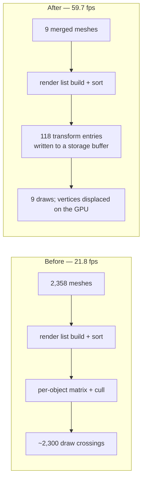

# Handoff — make native match web without the game writing a line of it

**Filed 2026-08-10.** For whoever picks this up next. Everything below was executed on a
physical Pixel 8 (`shiba`, serial `37251FDJH0037Z`, arm64-v8a, Android 17) unless it says
otherwise. Nothing here is an iOS result.

## The one-sentence goal

**Same source, same behaviour, same picture, on web and on Android — with no game-side code.**
The performance problem is solved. The way it is currently solved is not acceptable, because it
lives in the game and it changes what the game looks like.

---

## 1. What is already proved

The fox platformer (`~/projects/fox-native`, 2,755 scene objects / 2,358 meshes) went from
**21.758 fps to 59.72 fps** on the physical Pixel 8.

```
TN_FOX_NATIVE_GPU_TRANSFORM_MERGE:sourceMeshes=2362;dynamicRoots=118;transformEntries=118;mergedMeshes=9
frames=1100 elapsed=18.42s -> 59.72 fps
```

Measured live, sustained over 1,100 frames, from the real game frame callback. The APK that
produced it is
`~/projects/fox-native/artifacts/probe/prd066-real-game-storage-root-only/installed.apk`; its
logcat is beside it. Roughly 30 sibling directories hold the rest of the sweep, each with its
own APK and logcat, and their frame rates run from 16.9 to 58.6 fps.

**Why it works.** PRD-068 measured the JS→C++ render-command boundary at ~2% of a CPU-bound
frame and ruled it out; the remaining ~98% is JavaScript executing as QuickJS bytecode with no
JIT — Three.js render-list build and sort, node and binding refresh, per-object matrix update
and culling, over 2,358 objects. The fix does not make that JavaScript faster. It removes it:



Static geometry is baked into world space and merged by material key. Anything that moves keeps
one `mat4` in a `StorageBufferAttribute`; each vertex carries a `tnObjectId` and the vertex
shader looks its transform up. Three.js then walks 9 objects per frame instead of 2,358.

**This is the right mechanism.** Keep it. The problem is only where it lives and what it breaks.

---

## 2. Why this is unacceptable as it stands

It is ~600 lines inside `~/projects/fox-native/src/scenes/Play.ts`, a game file, alongside a
dozen dead experiment variants (`PROBE_AGGRESSIVE_MERGE_SCENE`, `PROBE_INSTANCE_SCENE`,
`PROBE_STATIC_MERGE_SCENE`, `PROBE_FLATTEN_DYNAMIC`, `PROBE_BATCH_DYNAMIC`, …). The game also
has to hand-annotate its own scene graph for the optimiser to work:

- `src/fox/fox.js` — `userData.threeNativeTransformOwner = true` on body, head, each arm, each
  leg, tail and every tail segment
- `src/fox/level.js`, `src/fox/sky.js` — `userData.threeNativeDynamic = true` on waterfalls,
  windmill, ship, question blocks, flag, clouds
- `src/scenes/Play.ts:833` — the same flag on the fox root

**A game should not know any of this exists.** By the repo's own rule, plumbing every game
repeats and no game should write belongs in `packages/core/src/`. The 20-line rule does not
protect this: nobody writes a GPU transform-buffer scene collapser in under 20 lines, and every
Three.js game shipping to Android needs it.

Two collateral costs of it living in the game: the bundle carries ~552 KB of dormant experiment
code, and the last experiment in the sweep now fails the game's own fail-closed guard
(`TN_ANDROID_JS_FOX_MESH_COUNT_MISMATCH:expected=2358;actual=2286`), so the current source tree
cannot rebuild the good APK.

---

## 3. The visual parity defects, with causes

Compare `~/projects/fox-native/artifacts/prd068/fox-baseline-pixel8.png` (correct, 21.8 fps)
against a screenshot of the fast build. Four things differ. All four are the optimiser's fault,
not the game's.

### 3.1 The HUD disappears — hearts, coin counter, gem counter, timer, touch controls

`src/render/hud.ts:231` parents the HUD group to the camera, deliberately, so it renders in the
same pass on desktop and Android. `gpuTransformMergeScene(scene, new Set([camera]))` passes the
camera as excluded — but `excluded` is consulted **only** when picking dynamic roots, never in
the mesh traverse or in the source-removal pass. So every HUD mesh is baked into world space at
its merge-time position and its original removed.

**Fix:** an excluded object's whole subtree must be skipped, in both passes.

### 3.2 The sky and clouds turn white

`src/fox/sky.js:33` and most of `src/fox/level.js` use `vertexColors: true` — the GLSL sky was
rebaked into a per-vertex colour attribute precisely so it would render under
`WebGPURenderer`. The merge deletes every attribute except `position`, then repaints all
vertices from the flat `material.color`. For the sky that is white, so the gradient and every
cloud vanish into a white background.

**Fix:** when the source material has `vertexColors === true` and the geometry carries a
`color` attribute, copy it instead of repainting.

### 3.3 The fox is stuck — it slides, its limbs never animate

The rig is a `Group` hierarchy, and each animated joint is already marked
`threeNativeTransformOwner`. The installed 59.72 fps APK reports
`transformEntries=118` for `dynamicRoots=118` — exactly one entry per root, so no joint ever got
its own transform and the whole fox shares the root matrix.

Note: that APK's marker string lacks the `matrixEntries=` field that the current
`Play.ts` emits, so **the good APK predates the current source**. The per-joint path may already
work in the current tree. Verify before writing code — do not assume this defect is live.

### 3.4 The app is locked to portrait; it is a landscape game

`packages/runtime-native/android/app/src/main/AndroidManifest.xml:35` already declares
`android:screenOrientation="landscape"`. The APKs in the sweep are portrait because
`fox-native/android-play.sh` patches a **stale** `app/build/outputs/apk/debug/app-debug.apk`
that predates that line, deliberately bypassing Gradle (the comment explains why: a Gradle build
regenerates the JS asset from `examples/native-smoke` and would silently ship the smoke example
instead of the game).

**Fix:** rebuild the debug APK from the current manifest, and fix the underlying reason
`android-play.sh` has to bypass Gradle — a packager that overwrites the project's own bundle is
a framework bug in its own right.

---

## 4. Diagnostic edits already in the tree — throw them away

Four edits were made to `~/projects/fox-native/src/scenes/Play.ts` to confirm 3.1 and 3.2. They
were **never rebuilt and never run**, so they are unverified, and they are in the wrong place by
the argument in §2. Use them as a description of the fix, then revert them:

1. an `isExcluded()` helper walking parents against `excluded`
2. `if (isExcluded(object)) return;` in the merge traverse
3. capturing the geometry's `color` attribute before the attribute-deletion loop and preferring
   it when `material.vertexColors === true`
4. skipping excluded meshes in the `sourceToRemove` pass

`fox-native` is not a git repository, so there is no `git checkout` to undo them.

---

## 5. The task

Move the mechanism into the framework, behind zero game-side API, and make it preserve
behaviour exactly.

1. **Land the collapser in `packages/core/src/`** as a renderer-side pass over the scene graph.
   One file, one public class or function, shared by web and native — not swapped by the
   `threenative-native` export condition, because two copies is a fork.
2. **Derive what moves; do not have the game declare it.** `threeNativeDynamic` and
   `threeNativeTransformOwner` must not survive into the shipped design. A node whose local
   matrix changes between frames is dynamic; everything else is static. Detecting that
   automatically — a first-frames observation pass, a dirty-matrix hook, or `matrixAutoUpdate`
   plus an explicit static marker the framework sets, not the game — is the core design problem
   of this task, and the reason it is not a 20-line change.
3. **Preserve behaviour or refuse to run.** Vertex colours, camera-parented subtrees, per-joint
   transforms, transparency and material side must survive the collapse. A scene the pass cannot
   collapse without changing the picture must be left alone, loudly — never collapsed anyway.
   A backend that cannot honour an option throws at construction; the same principle applies here.
4. **Delete the probe code from the game.** After the framework owns it, `fox-native` runs the
   same `src/game.ts` on web and Android with none of §2's annotations, and the ~552 KB of
   dormant experiment code goes.
5. **Fix the Android packager** so `android-play.sh` no longer has to bypass Gradle, and the
   landscape manifest actually reaches the APK.

---

## 6. Acceptance criteria

Each is checkable by re-running a command, not by reading code.

1. [ ] `fox-native` renders at **≥ 55 fps sustained over 300+ frames** on serial
       `37251FDJH0037Z`, observed from the real game frame callback, across at least three fresh
       launches, with minimum and mean reported.
2. [ ] A screenshot from that run is **visually equivalent** to
       `artifacts/prd068/fox-baseline-pixel8.png`: sky gradient, clouds, hearts, coin counter,
       gem counter, timer and touch controls all present.
3. [ ] The fox's limbs and tail animate — provable from a two-frame screenshot diff over the
       fox's bounding box, not by eye.
4. [ ] The app launches **landscape** on the device.
5. [ ] `fox-native/src/` contains **no** `PROBE_*` constant, no `threeNativeDynamic`, no
       `threeNativeTransformOwner`, and no merge, batch or instancing code.
6. [ ] The same `src/game.ts` runs on web and Android with no branch, and a playtest scenario
       asserts the same behaviour on both.
7. [ ] `pnpm typecheck && pnpm lint && pnpm test && pnpm budgets` passes, and no native
       toolchain enters the default repository gate.
8. [ ] A unit test in `packages/core/__tests__/` covers the collapser: vertex colours survive,
       excluded subtrees survive, per-joint transforms survive, and a scene it cannot collapse
       safely is left uncollapsed.

## 7. Negative controls

| Control | Change | Expected |
|---|---|---|
| `collapse-disabled` | run the same build with the pass off | frame rate returns to ~21.8 fps. An unmoved number means the pass is not running |
| `hud-parented` | parent a mesh to the camera | it stays parented and tracks the camera after collapse |
| `vertex-coloured` | collapse a `vertexColors: true` mesh | its per-vertex colours are unchanged |
| `animated-joint` | animate a joint under a dynamic root | the joint moves independently of its root |
| `uncollapsible` | hand the pass a scene it cannot collapse safely | it declines and says why; it never collapses anyway |

## 8. Not claimed

No iOS result — no Apple hardware is attached to this repository and the hosted `macos-15`
runner produces simulator-class evidence only. No mobile-readiness claim. No threshold: PRD-058
owns those. The engine swap stays PRD-068's, and it is not needed to reach 60 fps here — the
collapse alone did it.

## 9. Related

- `docs/PRDs/native-performance-fixes/PRD-066-*` — the frame-rate problem and the `-O2` fix
- `docs/PRDs/native-performance-fixes/PRD-068-android-javascript-engine.md` — the 2% boundary
  measurement that pointed at JavaScript execution, and the engine spike
- `docs/PRDs/native-performance-fixes/PRD-069-per-draw-cost.md` — demoted by the same measurement
- `docs/verification/android-js-engine-spike-2026-08-10.md` — candidate engine viability gates
