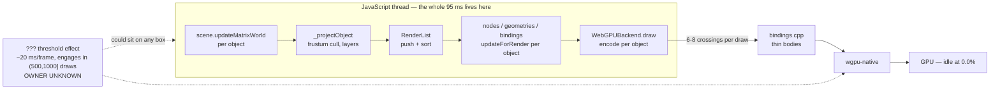
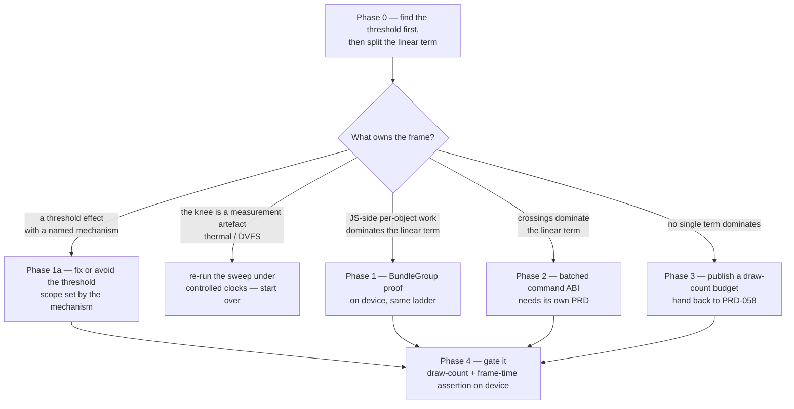

# PRD-069 — Per-draw cost: make each submitted draw cheaper, whatever engine is running

**Status: PHASE 0 ANSWERED FOR THE SHIPPED ENGINE, 2026-08-21; levers reassessed.** The §2.2
"knee" does not exist under the shipped engine: re-measured on the same Pixel 8 under V8, frame
time is flat ~4.0 ms from 100 through 1,000 scene objects and rises at ≈0.70 µs/object into
2,000 (4.71 ms) — no threshold step anywhere. The historical knee was an artifact of two stacked
facts: it was measured under QuickJS, which PRD-130 replaced as the Android default, and its
subject was frustum-culled (250 "draws" submitted 4 `drawIndexed`/frame), so its x-axis was
never draws. The shipped Pixel 8 frame decomposes as ~2.6–3.5 ms of object-scaling JavaScript +
~1.2–1.4 ms true native floor (submit+poll ~0.52 across ~4 submits, one present ~0.7 ms); the
previously reported "~3.4 ms fixed native wall" was a present-per-submit double-count in the
instrument, now fixed. Full method, corrections and ladder:
`docs/verification/prd-069-phase-0-v8-draw-ladder-2026-08-21.md`.
§3.1's BundleGroup lever additionally measured dead for moving geometry on three 0.185.1
(static bundles freeze moved children; static=false still refreshes at most one render object
per material per frame) — see the same record. What remains open in this PRD is the linear JS
term itself (~0.7 µs/object across projectObject/render-list/nodes/bindings), whose attack is
now ordinary optimisation rather than threshold hunting. The 2026-08-10 numbers below were
executed on a physical Pixel 8 (`shiba`, serial `37251FDJH0037Z`, arm64-v8a, Android 17,
Mali-G715) on 2026-08-10 and are reused here, not re-derived. **The attribution of those
numbers to a cause is not measured**, and Phase 0 exists to measure it before anything is
built. No iOS result is claimed anywhere in this document. Nothing here says mobile-ready.

**The headline finding, added after a draw-count sweep on the same device:** frame time is
**not linear in draw count**. There is a knee between 500 and 1,000 submitted draws where
marginal cost per mesh jumps roughly 5.6× and then partially falls back. **A per-command FFI
tax cannot produce that shape** — a per-crossing cost does not change with how many crossings
came before it. So "per-command JS→C++ FFI is the top bottleneck", the top-ranked row of
`NATIVE-PERF-BOTTLENECKS.md`, is treated throughout this PRD as **UNCONFIRMED**, and finding
the threshold is now this PRD's first-class objective (§2.3, Phase 0 measurement 1).

**Reconciled 2026-08-23:** acceptance criteria 1–3 above are written against the §2.2 knee model that this PRD's own Phase 0 refuted under the shipped engine (no threshold exists under V8); read them as answered-by-verdict rather than pending, with criterion 1's fine-sweep obligation reduced to the two UNMEASURED rungs (500, 4000). Those rungs were attempted 2026-08-22 and recorded unmeasured — device cool enough but charging over USB — in `docs/verification/prd-175-present-instrument-2026-08-22.md`, which also landed the present-counting instrument fix this PRD's evidence relied on hand-corrections for.

**Complexity: 8 → HIGH mode.** One instrumentation phase that has to land before any decision,
an unexplained threshold with six candidate mechanisms and no owner, three candidate levers
with very different costs, and a framework/game boundary that is easy to get wrong in the
direction the repository forbids.

**Blast radius (candidate, phase-gated).** Phase 0 touches
`packages/runtime-native/scripts/`, `packages/runtime-native/src/webgpu/bindings.cpp`,
`packages/core/src/renderer.ts`, `packages/runtime-native/docs/G5-profiling.md`,
`docs/verification/`. Phases 1a–4 each name their own paths and none of them is authorised by
this PRD alone — each needs its Phase 0 number first.

**Depends on:** PRD-066, which measured the device numbers and forked the road into *swap the
engine*, *cut per-draw JS work*, and *accept and budget*. This PRD owns the **second** branch
and is engine-independent: every win here also applies after an engine swap, and is worth more
on any target that never gets a JIT. PRD-068 owns the engine swap; the two are complements and
neither is a substitute for the other. PRD-058 owns performance thresholds — this PRD produces
raw numbers and sets no budget.

**Reads as background, not as authority:** `docs/architecture/NATIVE-PERF-BOTTLENECKS.md`,
which opens by saying nothing in it is measured. Its top-ranked row — per-command JS→C++ FFI —
is the specific hypothesis §2.3 of this PRD refutes as a complete explanation.

## 1. Why this exists

After PRD-066's `-O2` fix, `fox-native` runs at 24.8 fps on the Pixel 8 and roughly 24 ms of
every 40 ms frame disappears when meshes stop being drawn. The GPU is idle throughout. So the
frame is CPU-bound in the render submission path, and the question this PRD answers is
**which part of that path**, because the candidate fixes cost a day, a week, and a month
respectively and only one of them can be the right first move.

A draw-count sweep run after this PRD was first drafted (§2.2) then found something none of the
candidates predicted: **cost is not linear in draw count.** There is a knee between 500 and
1,000 submitted draws that no per-command tax can explain. So the question above now has a
prior question in front of it — *what is the threshold* — and answering it may be worth more
than any of the three levers, because a scene held below the knee wins the step and the linear
term at the same time.

The framework rule that shapes every answer below: **anything a screenshot shows, and every
gameplay-shaped choice like instancing a particular prop, is the user's source in
`src/render/` — never package code.** A good chunk of the available win is on the user's side
of that line, and this PRD says so explicitly rather than quietly moving it into a package.

## 2. What is measured, and what is inference

### 2.1 Measured on the Pixel 8, 2026-08-10

| Subject | Meshes | Build | Frame time | Rate |
|---|---|---|---|---|
| `fox-native` | 2,358 | native runtime `-O2` | 40.3 ms | 24.8 fps |
| `fox-native` | 2,358 | native runtime `-O0` | 223 ms | 4.5 fps |
| `examples/native-smoke` | 2 | `-O0` | — | 61 fps |
| `examples/native-smoke` | 2,000, all visible | `-O2` | 95.2 ms (28,555 ms / 300 frames) | 10.5 fps |

Visibility ladder, `fox-native` at `-O2`, traversal and game logic held identical:

| Visible meshes | 100% | 50% | 25% | 0% |
|---|---|---|---|---|
| Frame time | 40.3 ms | 23.4 ms | 17.5 ms | 16.7 ms (vsync floor) |

CPU state during the slow frames: one `SDLThread` at 106–120% in state `R`; every `mali-*`
thread at 0.0%. Game logic costs 0.43 ms of the 40.3 ms.

### 2.2 The draw-count sweep — the most informative measurement so far

Same device, native runtime at `-O2`, subject `examples/native-smoke` with N extra all-visible
boxes **sharing one geometry and one material**, 300-frame windows, subject counts
gate-verified:

| Extra meshes | fps | ms/frame | Marginal cost of the preceding step |
|---|---|---|---|
| 100 | 60.38 | 16.56 | — (vsync-clamped) |
| 250 | 59.82 | 16.72 | — (vsync-clamped) |
| 500 | 49.77 | 20.09 | 13.5 µs/mesh (understated — previous row is clamped) |
| 1,000 | 17.16 | 58.28 | **76.4 µs/mesh** |
| 2,000 | 10.51 | 95.18 | 36.9 µs/mesh |

**Caveats, which travel with these numbers wherever they are quoted.** The 100 and 250 rows sit
on the 60 Hz vsync floor, so their true uncapped frame time is lower than measured and the
250→500 marginal is therefore *understated*, not overstated. The boxes are 0.08 units in a
lattice, so overdraw is an unlikely explanation. This is **one device and one subject shape**.

**The subject is also the cheapest possible case, which matters for how far it generalises.**
Every box shares one geometry and one material, so pipeline reuse, bind-group reuse and
buffer reuse are all maximal. `fox-native` has distinct geometries and materials, so its
per-draw cost is very unlikely to match this curve. The two subjects calibrate each other only
loosely.

### 2.3 Three inferences that must be labelled as inferences

**(a) The ladder does not isolate the FFI.** Setting `object.visible = false` makes
`Renderer._projectObject` return at `Renderer.js:3082` before the object is pushed to the
render list. So a hidden mesh skips render-list push *and* sort *and* node/binding refresh
*and* command encoding *and* the FFI crossings. The 24 ms the ladder recovers is the sum of
all of those, not the FFI alone. Calling it "draw submission" is fair; calling it "the
boundary cost" is not.

**(b) The sweep's shape refutes a pure per-crossing model.** A per-command FFI tax is a
*constant* cost per crossing, so it predicts a roughly constant marginal cost per mesh. The
measurement shows 13.5, then 76.4, then 36.9 µs/mesh. **Nothing about the 3,001st boundary
crossing is more expensive than the 3,000th.** Whatever produces the knee is a threshold
effect — a resize, an eviction, a limit, a collector — and it is not a per-call tax. The FFI
may still be a real linear term underneath; it cannot be the thing that makes 1,000 draws
3.5× worse than 500.

**(c) One two-parameter model fits every unclamped point, and it is worth testing precisely
because it is so under-determined.** Take a constant rate `r` per submitted draw, a fixed
per-frame baseline `a`, and a **one-time step `S`** that switches on somewhere in (500, 1000]:

| Term | Value implied by the three unclamped rows |
|---|---|
| `r` — cost per submitted draw | **36.9 µs**, the same above and below the knee |
| `a` — fixed per-frame baseline | **1.64 ms** |
| `S` — one-time step at the threshold | **19.7 ms per frame** |

| Draws | Model | Measured | Consistent? |
|---|---|---|---|
| 100 | 5.33 ms | 16.56 ms | ✅ predicted below the 16.7 ms vsync floor |
| 250 | 10.86 ms | 16.72 ms | ✅ predicted below the floor |
| 500 | 20.09 ms | 20.09 ms | exact — see caveat |
| 1,000 | 58.28 ms | 58.28 ms | exact — see caveat |
| 2,000 | 95.18 ms | 95.18 ms | exact — see caveat |

**The caveat is fatal to treating this as evidence, and is stated first: three unclamped points
and three free parameters means zero degrees of freedom. The model fits exactly because it was
solved from those points, not because it was tested against them.** It is a hypothesis with an
appealing property, nothing more.

The appealing property is that it reads the "partial recovery" from 76.4 to 36.9 µs/mesh as
**not a recovery at all**: the per-draw rate was ~37 µs the whole time, and a fixed ~20 ms
per-frame penalty switches on at the threshold. And it makes a **sharply falsifiable
prediction**: at 750 draws the model says **29.3 ms if the step has not yet engaged, 49.1 ms if
it has.** Those are 20 ms apart and impossible to confuse. A fine sweep across the knee settles
it in an afternoon, which is why it is Phase 0's first measurement.

**Withdrawn.** An earlier draft of this PRD derived "roughly 500 submitted draws" for
`fox-native` from a flat ~47 µs/draw average. The sweep refutes the flat-rate assumption that
derivation rested on, and the shared-geometry confound above makes cross-subject calibration
unsound anyway. `fox-native`'s submitted draw count is **unknown and must be observed**, not
computed — which is exactly why exposing `renderer.info` (§3.1) is a Phase 0 deliverable rather
than a nicety. **Draw count, not object count, is the variable every gate below is written
against.**



Every box inside the subgraph is JavaScript this PRD can attack. Only the labelled arrow is
what a batched ABI removes. **The dashed box is the biggest single term in the fox-relevant
range and nobody yet knows which box it attaches to** — that is the honest state of this
investigation, and it is why no lever below is authorised before Phase 0.

### 2.4 The threshold — candidate causes, none verified

Named as hypotheses to test, in the order they are cheapest to falsify. Each row needs a
result, not an argument.

| # | Hypothesis | Cheapest way to test it on this device |
|---|---|---|
| 1 | **QuickJS GC pressure** above a live-object count | Log GC count and heap size per frame across the sweep; then raise the GC threshold and re-run. If the knee moves or flattens, GC is implicated. Cheapest test on the list |
| 2 | **Uniform/storage buffer pool resize** crossing a size boundary | Instrument buffer creation and `writeBuffer` sizes per frame; a one-time reallocation should show as a spike at the threshold frame, then steady state |
| 3 | **Bind-group cache eviction or thrashing** above a live count | Count live bind groups and cache hits/misses per frame. Three's per-render-object bind groups make live count scale directly with draw count |
| 4 | **A wgpu-native internal limit** on live bind groups or bind-group layouts per pass | Dump the adapter's reported limits at startup and check for validation warnings at the threshold. A hard limit should also produce a diagnostic, not just slowness |
| 5 | **Thermal or DVFS confound** — not in the render path at all | The 2,000-draw window is ~28 s of sustained load; a governor step or thermal throttle would look like a threshold. Test by running the 2,000 row cold and again after sustained load, and by logging CPU frequency and thermal zones. **Cheap, and it would invalidate the whole curve if true — so it runs first alongside #1** |
| 6 | **Android memory pressure** at higher live object counts | Sample RSS across the sweep. A step in RSS coinciding with the step in frame time is suggestive |

Hypothesis 5 is this PRD's addition rather than a render-path theory, and it is deliberately
ranked early: **a measurement artefact has to be ruled out before a mechanism is hunted.** If
the knee is thermal, every conclusion in §2.3 dissolves and the sweep needs re-running under
controlled clocks.

## 3. The levers, and which side of the line each falls on

**Read this section knowing that a fix aimed only at per-draw cost may miss the cliff
entirely.** Every lever below reduces the *number* of submitted draws or the *cost* of each
one. If the ~20 ms step in §2.3(c) is real, then dropping a scene from 1,000 draws to 400 wins
the step **and** the linear term at once — a cliff-edge win, far larger than proportional. If
instead the cost is smoothly super-linear, the same change wins much less. **The levers do not
change; how much they are worth changes by a factor of several, and only Phase 0 says which.**

### 3.1 Render bundles — `BundleGroup` for static geometry

**Where it lives: mostly the game's `src/render/`. A little of it is framework.**

Upstream `three@0.185.1` already ships `BundleGroup`, and this repository's host already binds
everything it needs: `device.createRenderBundleEncoder` at `bindings.cpp:4490`,
`renderPass.executeBundles` at `bindings.cpp:3326`. No new C++ is required to try it.

What makes it the strongest candidate is that it does **not** just remove crossings. When a
`BundleGroup` is static and its version has not changed, `Renderer._projectObject` pushes the
cached bundle and **returns without descending into the group's children at all**
(`Renderer.js:3176–3224`). Every child skips frustum culling, render-list push, render-list
sort, and command encoding. On the cached path `_renderBundle` walks the recorded render
objects only to refresh nodes and bindings where `needsRefresh` is true
(`Renderer.js:1319–1341`), and the frame issues one `executeBundles` call instead of thousands
of crossings. **This is the only lever on the list that removes JS work and FFI work at once.**

Cost:
- A bundled subtree is **not frustum-culled**, and the sweep makes this trade much sharper than
  it first looked. `fox-native` is cheap partly because most of its 2,358 meshes are culled and
  never submitted. Bundling them naively submits **all 2,358** every frame — which, if the
  threshold in §2.3 is real, pushes the scene from below the knee to well above it. **Bundling
  the wrong set could make the fox dramatically slower, not marginally slower.** Bundle what is
  reliably on screen; never bundle a scene's entire static set on the assumption that removing
  JS work must be a win. Phase 1 measures this rather than trusting it.
- A bundle is frozen: adding or removing a child requires `needsUpdate = true` and a re-encode.
  Gameplay that spawns and despawns inside a bundle pays the re-encode every time it changes.
- Whether per-object uniforms (model matrix and friends) still update on the cached path is
  **unverified here**. The `needsRefresh` branch suggests bindings can still be written, but
  the observable question — *does a bundled object that moves actually move on screen on this
  host* — has not been run and is a Phase 1 gate, not an assumption.

Risk: none to the standing constraints. This is upstream Three.js used as upstream intends it.

**Framework's share:** exactly two things, both small and both about being able to see the
result rather than about producing it —
1. a conformance/playtest row proving `BundleGroup` renders identically native and browser, and
2. the `renderer.info` exposure named in PRD-066 §7 as unowned, without which no game can count
   its own draws. Today `packages/core/src/renderer.ts:8–12` exposes
   `domElement, kind, raw, compute, dispose, render, setOutputNode, setSize` and not `info`.
   Under the 20-line rule this is a contract fix on a wrapper the framework already owns, not a
   new abstraction — but it is a judgement call and it is flagged here rather than assumed.

**Game's share:** deciding *what* to bundle. That is a look-and-content decision and it stays
in `src/render/`. No `defineGame` option, no auto-bundler, no package heuristic that decides a
game's static set for it.

### 3.2 A batched render-command ABI, modelled on the physics precedent

**Where it lives: entirely the framework, in `runtime-native`.**

The physics precedent is real and is the right shape to copy: `PhysicsSimulation` meets the
native side at `step()` and `readVisibleTransforms(Float32Array)`
(`packages/physics/src/native/host.ts:245–253`), one coarse crossing per frame with typed
arrays, never per-object. The rendering equivalent: the object Three receives from
`commandEncoder.beginRenderPass()` is **ours** — the host constructs it at
`bindings.cpp:3074–3090` — so command buffering can be added without touching Three.js at all.

Shape: assign each pipeline, bind group and buffer a stable integer id at creation; the JS-side
pass object appends `(opcode, args…)` into a preallocated `Int32Array`; one `flush(buffer,
count)` crossing per pass decodes and replays. Three.js sees an ordinary
`GPURenderPassEncoder`.

Cost:
- The JS side must be JavaScript in the host prelude, not C++ closures. If the appenders are
  native functions, the crossings are still there and nothing was saved.
- A handle table for every GPU object, with a lifetime story. Getting that wrong is a
  use-after-free rather than a wrong pixel.
- Opcode coverage must be complete or fail loudly. Partial coverage that silently drops a
  command is exactly the fail-open failure this repository was built to avoid.
- Native LOC. The review trigger stood at 61,617 against 50,000 as of PRD-064, so every line
  needs its justification here.

Risk to the constraints: **none, if it stays a WebGPU-shaped shim.** It becomes a custom C++
renderer the moment it starts deciding *what* to draw rather than replaying what it was told.
That line must be written into the implementing PRD.

**A pre-existing defect this lever would inherit — now owned by PRD-071 §3.4, so that it is
fixed before anything inherits it.** `renderPass.setBindGroup` at
`bindings.cpp:3107–3126` carries `// TODO: Support dynamic offsets` and passes `0, nullptr`,
silently discarding any offsets it is given — while the bundle-encoder path at
`bindings.cpp:4584–4604` honours them. The repository rule is that a backend which cannot
honour an option **throws at construction**; this one discards quietly. It is not known
whether `WebGPURenderer` at the catalog version ever passes dynamic offsets on this path, so
this is recorded as a finding to settle, not as a live bug. Any batched ABI must not carry the
asymmetry forward.

**Measured 2026-08-21 (browser WebGPU hardware, three 0.185.1): both gates of this lever fail.**
With `BundleGroup` defaults, `NodeMaterialObserver.needsRefresh` returns false for every object
in a static bundle, so a moved child never reaches the screen; with `static=false`, the
per-frame `renderId` check refreshes only the first render object per shared material observer,
so a 4,096-mesh bundle still froze teleported meshes. The cached path is genuinely cheap
(1,024 all-moving meshes: 0.10 ms vs 3.60 ms independent, 1 draw vs 1,025) — but it is only
correct for scenery that never moves. Evidence and the teleport motion gate:
`docs/verification/prd-069-phase-0-v8-draw-ladder-2026-08-21.md`. What remains of this lever is
a game-side static-scenery option with a correctness cliff, not a framework feature.

**Honest ranking note, revised after the sweep.** This is the *most* expensive lever, and the
sweep weakened rather than strengthened the case for it. A batched ABI removes crossings; the
knee in §2.3 cannot be made of crossings. So even a perfect batched ABI leaves the ~20 ms step
untouched, and its ceiling is whatever the linear term's FFI share turns out to be. It should
not be started until Phase 0 has both priced a crossing **and** identified the threshold — and
if the threshold turns out to own most of the fox-relevant frame, this lever may not be worth
building at all.

### 3.3 Less per-object matrix and culling work

**Where it lives: almost entirely the game's `src/render/`.**

Three.js updates world matrices per object per frame and frustum-culls per object per frame,
and both scale with scene object count on whatever engine is running. The levers are ordinary
Three.js ones and every one of them is a content decision:

| Lever | Whose file | What it buys | What it costs |
|---|---|---|---|
| `InstancedMesh` for repeated props | game `src/render/` | N draws collapse to 1 | per-instance material variation is gone |
| `BundleGroup` around static set | game `src/render/` | see §3.1 | culling is gone for that subtree |
| `matrixAutoUpdate = false` on static objects | game `src/render/` | skips per-frame matrix compose | moving one later needs an explicit update |
| Merged geometry for static scenery | game `src/render/` | fewer objects entirely | per-object visibility is gone |
| `frustumCulled = false` on always-visible cheap objects | game `src/render/` | skips a sphere test | pointless unless the object is genuinely always visible |
| LOD | game `src/render/` | fewer triangles and draws far away | authoring cost |

**Framework's share here is close to zero, and that is the correct answer.** The one thing the
framework legitimately owes is diagnosability — a game that cannot read its own draw count
cannot apply any row of that table on evidence. That is the same `renderer.info` item as §3.1
and it is counted once.

What the framework must **not** do: ship an auto-instancer, a static-scene analyser, or a
`defineGame` performance option. Each of those decides for the user what their scene contains,
and that is the user's to write. The template may *demonstrate* these techniques in its
generated `src/render/` — that is generated user source and the user is free to delete it.

### 3.4 Cheaper crossings — the same ABI, minus the per-call allocation

**Where it lives: entirely the framework, in `runtime-native`. Cheapest lever on the list.**

§3.2 makes the crossings *fewer*. This makes each one *cost less*, and it is worth separating
because the two have wildly different prices and the second is a strict prerequisite for
pricing the first honestly. Every binding in this host goes through one universal signature:

```cpp
// include/mystral/js/engine.h:32
using NativeFunction =
    std::function<JSValueHandle(void* ctx, const std::vector<JSValueHandle>& args)>;
```

So a `drawIndexed` crossing pays, before `wgpu-native` is reached at all: a `std::function`
indirect call, a heap-allocated `std::vector` of boxed handles, one boxing per argument on the
engine side, a `toNumber` per numeric argument, and a `getPrivateData` lookup per GPU object.
`bindings.cpp:3096–3230` is that shape for `setPipeline`, `setBindGroup`, `draw` and
`drawIndexed`. **None of that is the boundary. All of it is our own convenience layer sitting
inside the hottest loop in the system.**

A second, smaller finding on the same path: `beginRenderPass` **rebuilds the encoder wrapper
every call** — one `newObject` plus 13 `newFunction` closures, each `setProperty`'d onto it, at
`bindings.cpp:3087–3330`. That is per pass, per frame, and it is pure garbage handed to the
collector that §2.4 hypothesis 1 already suspects. It is far too small to be the ~20 ms step on
its own; it is cheap to cache and it is the kind of allocation that should not be in a frame at
all.

Shape of the fix: a fixed-arity native entry point for the six hot commands — scalars passed as
scalars, GPU objects reached through an integer handle rather than `getPrivateData` on a boxed
object, no vector, no `std::function`. Hoist the render-pass wrapper out of `beginRenderPass`.

Cost:
- **It is an interface change, not a local edit.** `NativeFunction` is the one signature every
  adapter implements, so a fixed-arity path has to be added to `quickjs_engine.cpp`,
  `v8_engine.cpp` and `jsc_engine.mm` or it is a fork. That is the real price and it is why
  this is 🟢-to-🟡 rather than an afternoon.
- Two calling conventions coexisting is a divergence risk of its own; the fixed-arity path must
  be a narrow, enumerated list, not a second general mechanism.

**Why it ranks ahead of §3.2 despite winning less.** It needs no handle-lifetime story spanning
a frame, no complete-or-throw opcode contract, and it carries no fail-open failure mode — the
three things that make the batched ABI expensive and risky. And it changes what §3.2 is worth:
Phase 0 measurement 2 prices a crossing *as currently marshalled*, so if that number comes back
high, **the first question is whether the boundary is expensive or whether our marshalling is**,
and only the second answer justifies a month of batched ABI. Phase 0 must therefore price both
shapes, not one.

**What it cannot do:** exactly what §3.2 cannot do. It attacks the linear term only. If the
~20 ms step owns the fox-relevant frame, this lever is worth a few milliseconds and no more.

**Superseded by measurement, same day: PRD-072 owned this lever and is CLOSED UNIMPLEMENTED.**
PRD-068 §1.2 instrumented the six bindings on the device and found all time inside them is ~2% of
a CPU-bound frame. Fixed-arity marshalling can recover only a slice of that 2%, which does not
fund a second calling convention across three engine adapters. The reasoning above still
describes the code accurately; it just describes something too small to schedule. **The per-frame
wrapper allocation named above survives as PRD-071 §3.3**, because it is a simplification that
needs no measurement to justify it — and it is landed as a cleanup, not as a performance fix.

### 3.5 Things that are not on the list, and why

`three-mesh-bvh` was considered and **ruled out for this problem.** It accelerates raycasting
and intersection, lives behind `packages/core/src/picking.ts`, and the native-smoke subject
does no picking at all yet still runs at 10.5 fps. It is the wrong tool; recording that here
stops it being re-proposed.

Three further ideas were proposed in review, are individually reasonable, and are ruled out
here so they are not re-proposed without new evidence:

| Proposed | Why not, on this evidence |
|---|---|
| **A native render-submission thread** — JS records frame N+1 into an arena while a native thread submits frame N | The whole 95 ms is on the JS thread and the GPU sits at 0.0%. Moving native encode off-thread hides only the native share, which measurement 3 of Phase 0 exists to size and which every reading so far says is small. It also cannot start before §3.2 exists, since there is no frame packet to hand across. Revisit only if Phase 0 shows native-side work is a large term — and note the thread model is an owed G4 gate anyway, not an optimization this PRD should smuggle in |
| **A GPU-driven path** — transforms, culling and LOD in compute, drawn with `drawIndirect` | This is the line §3.2 draws, on the wrong side of it. The moment the host decides *what* to draw it is a custom C++ renderer with its own culling semantics, and a scene that renders differently native versus browser is exactly the fork this repository forbids. If GPU-driven culling belongs anywhere it is upstream in Three.js, where both targets inherit it |
| **An auto-optimizer** — `optimizeScene(scene)` that instances, bundles or freezes transforms on the user's behalf | Ruled out by §3.3: deciding what a scene contains is the user's. **The read-only half of that proposal is not ruled out** — a diagnostic that reports "847 meshes share one geometry and material" or "this group has not changed in 4,000 frames" decides nothing and only tells the user what §3.3's table already tells them to look for. That belongs on the existing playtest `diagnostics` surface, not in a new package, and it is worth nothing until `renderer.info` lands and Phase 0 says which table row matters |

## 4. Phases



**Phase 0 gates everything.** No line of any later phase may be written before Phase 0's
numbers exist. This is the same discipline PRD-066 applied to the engine fork, and the reason
is identical: branches with order-of-magnitude different costs cannot be chosen by argument.

### Phase 0 — find the threshold, then split the linear term

All on serial `37251FDJH0037Z`, subject `examples/native-smoke` with the same shared-geometry
lattice used for the sweep, 300-frame windows.

1. **Locate the knee, and rule out the artefact.** This is now the first and most important
   measurement in the PRD.
   - Sweep 500 → 1,000 draws at ~50-draw granularity. **The model in §2.3(c) predicts 29.3 ms
     at 750 draws if the step has not engaged and 49.1 ms if it has** — a 20 ms gap that a
     single point resolves. A near-discontinuity supports the step model; a smooth ramp refutes
     it and means the cost is genuinely super-linear.
   - **Before believing any of it, run hypothesis 5 from §2.4**: log CPU frequency and thermal
     zones throughout, and run the 2,000-draw row both cold and after sustained load. If the
     knee is thermal or DVFS, the curve is an artefact and the sweep is re-run under controlled
     clocks before anything else proceeds.
   - Work down §2.4's remaining hypotheses until one is confirmed or all six are excluded.
     **"All six excluded" is a real and publishable outcome** — it means the mechanism is
     something nobody has thought of yet, and that is worth knowing before spending weeks.
2. **Cost of one crossing — in both shapes, because the difference is the whole of §3.4.** Bind
   a no-op native function shaped exactly like `drawIndexed` — same
   `std::vector<js::JSValueHandle>` marshalling, same `toNumber` count, empty body — and time
   100,000 calls in a loop on device. Then bind a second no-op that takes its six arguments as
   fixed-arity scalars with no vector and no `std::function`, and time it identically. Report
   nanoseconds per call **for each**. The gap between them is what §3.4 can recover; the
   fixed-arity number is the floor §3.2 would be competing against. Pricing only the first
   shape would attribute our own marshalling to "the boundary" and buy a batched ABI on it.
3. **Cost of the encode path with the crossings removed.** Replace the render-pass command
   functions with no-op JS functions for one instrumented build, and re-run the 2,000-mesh
   subject. The delta from the real build is the FFI's true share; the remainder is Three.js
   JS-side work.
4. **Draw count, observed.** Expose `renderer.info` and record `render.drawCalls` per frame for
   both subjects, so every later claim is per submitted draw rather than per scene object.
5. **Boundary and allocation counters, per frame, by name.** A generic CPU profile will say
   `renderer.render()` is expensive, which is already known. What is not known is the shape of
   the traffic: FFI calls per frame broken out per binding (`setBindGroup`, `setPipeline`,
   `drawIndexed`, `writeBuffer`), bytes copied across the boundary per frame, JS heap size, **GC
   count and pause per frame**, and live GPU-object count. The GC and live-count rows are not
   extras — they are hypotheses 1, 3 and 6 of §2.4 measured directly, so this item is how three
   of the six threshold candidates get tested rather than argued. Counters ship behind the same
   instrumented build as measurement 3 and must not survive into a release path.

**Deliverable:** a row in `packages/runtime-native/docs/G5-profiling.md` — which is currently
`NOT STARTED` — plus one dated file in `docs/verification/`. Both must state the target,
hardware serial, subject, build type, sample duration, the threshold's location and mechanism
(or the list of hypotheses excluded), and the measured split in milliseconds. **The sweep's
vsync-clamped rows must be labelled as clamped wherever they are reproduced.**

**Falsifiable up front, both directions:**
- If the 500→1,000 fine sweep shows a smooth ramp rather than a near-discontinuity, the step
  model in §2.3(c) is **wrong** and this PRD records that it was wrong.
- If measurement 2 returns a per-crossing cost above ~2 µs, the FFI is a bigger linear term
  than §2.3(b) allows, the batched ABI moves up the queue, and this PRD says so in writing
  rather than quietly re-ranking.
- If measurement 2's two shapes come back close together, **§3.4 is dead** — the marshalling
  was never the cost — and it is recorded as dead rather than left on the list. If they come
  back far apart, §3.2's ceiling is the *fixed-arity* number, not the current one, and the case
  for a month of batched ABI shrinks by whatever §3.4 recovers for a fraction of the price.

### Phase 1a — the threshold, once it has a name

Conditional on Phase 0 identifying a mechanism. Scope cannot be written before the mechanism is
known, and inventing it now would be exactly the speculative work this repository rejects. Two
things are fixed regardless: the fix must be measured on the same sweep that found the knee,
and if the mechanism turns out to live in upstream Three.js rather than in the host, the answer
is to **avoid the threshold by submitting fewer draws** — not to patch or fork `three`.

### Phase 1 — prove `BundleGroup` on the device, or find out it does not help

Conditional on Phase 0 showing JS-side per-object work dominant in the linear term.

- Add a `BundleGroup` arm to the native-smoke subject and run it **across the same draw-count
  sweep**, not at a single point. The question is not only "is bundling faster at 2,000 draws"
  but **"does bundling move, soften or remove the knee"** — and only a sweep answers that.
- Run the same visibility ladder against a bundled `fox-native` arm, so the culling trade in
  §3.1 is measured rather than argued. **Expect the possibility that it is slower**: bundling
  defeats culling and can push a scene from below the threshold to above it.
- **Answer the unverified question:** move one bundled object and confirm it moves on screen on
  the native host. If bundled objects freeze, that is a finding that constrains where bundles
  can be used and it gets written down, not worked around.
- Conformance: one row asserting a `BundleGroup` scene matches its browser reference.

Nothing in this phase adds package code beyond the conformance row and the `renderer.info`
exposure. The bundling itself is scene source.

### Phase 2 — batched command ABI (needs its own PRD; not authorised here)

Conditional on Phase 0 showing crossings dominant **in the linear term** *and* the threshold
being either fixed or shown not to dominate the fox-relevant range. Scope deliberately unspecified — the design
sketch in §3.2 is a sketch, and it does not become a plan until a number justifies it. Its PRD
must carry the handle-lifetime story, the complete-or-throw opcode contract, the dynamic-offset
resolution from §3.2, and a native-LOC justification against the standing review trigger.

### Phase 3 — if neither dominates, publish the budget honestly

If Phase 0 shows the cost spread evenly across matrix updates, culling, render-list sort,
binding refresh and encoding with no single dominant term, then there is no cheap fix on this
branch. The honest output is a **draw-count budget measured on this device**, handed to
PRD-058 as raw numbers, and a plain statement that reaching 60 fps at this draw count on this
engine needs PRD-068's branch instead. **Recording that is a valid outcome of this PRD, not a
failure of it.**

**The budget must be stated as a curve, not a single number.** A scene at 500 draws holds
20.09 ms on this subject while one at 1,000 draws costs 58.28 ms — nearly triple for double the
draws. A flat "N draws" ceiling would hide exactly the cliff a game author most needs to see.
If the threshold survives Phase 0, the budget's most useful sentence is *"stay below the
knee"*, with the measured knee location named.

### Phase 4 — a gate that fails closed

Whatever Phase 1a–3 lands, the win is only real if a later change cannot silently undo it.

- Extend the device playtest path so a scenario asserts a **draw-count ceiling** and a
  **frame-time floor** over a named frame window on a named physical serial. Draw count is the
  primary assertion — it is deterministic where frame time is noisy.
- An emulator serial is **blocked**, never passed, matching how the physics and multitouch
  device paths already refuse to substitute an emulator for hardware.
- A missing or malformed frame or draw-count observation is a **failure, never a skip**.
- This overlaps PRD-066 Phase 4 by design. If PRD-066 Phase 4 lands first, this phase extends
  it with the draw-count assertion instead of building a second gate.

## 5. Integration ledger

Filled with real non-test `file:line` during implementation. A `TBD` at phase end means the
phase is incomplete.

| # | Thing built | Live caller (non-test) | What it replaces | May claim green when | Negative control |
|---|---|---|---|---|---|
| 0 | Fine draw-count sweep across the knee + clock/thermal logging | device probe script under `packages/runtime-native/scripts/` | a five-point curve with an unexplained 5.6× knee | the threshold is located to within ~50 draws **and** the thermal confound is excluded | hold draw count fixed and re-run — frame time must not step, or the harness is measuring load rather than draws |
| 1 | No-op crossing benchmark | device probe script under `packages/runtime-native/scripts/` | the unmeasured guess in §2.3(b) | a nanosecond figure exists from serial `37251FDJH0037Z` | run it against a *real* `drawIndexed` — the two figures must differ, or the harness is measuring nothing |
| 2 | `info` on the renderer wrapper | `packages/core/src/renderer.ts:59` `wrapRenderer` | a game that cannot count its own draws | a game reads a non-zero `drawCalls` on device | a renderer kind with no `info` must throw like `setOutputNode` does, not return `undefined` |
| 3 | Bundled arm of `examples/native-smoke` | the native-smoke build the device script already runs | a single unbundled measurement | both arms measured on device, same 300-frame protocol | unbundle the arm → the frame time must return to the unbundled figure |
| 4 | `BundleGroup` conformance row | `conformance/run-conformance.mjs` | no bundle coverage on either target | browser and native agree within the row's tolerance | break the bundle path → row red, not blocked and not omitted |
| 5 | Draw-count assertion | device playtest scenario + runner | no draw-count gate anywhere | it fails on an emulator serial **and** on a missing observation | ceiling of 1 draw → exit non-zero naming the measured count |
| 6 | G5 rows + dated verification file | `G5-profiling.md`, `docs/verification/` | `G5` reading `NOT STARTED` | after a device run on a recorded serial | an emulator or simulator input cannot satisfy the row |

## 6. Acceptance criteria

Consumer-scoped: each is about a build someone could tell apart, not about code that exists.

1. **The knee between 500 and 1,000 draws is located to within ~50 draws on serial
   `37251FDJH0037Z`, and the step model of §2.3(c) is recorded as confirmed or refuted in
   writing.** The 750-draw point alone decides it: ~29 ms means the step has not engaged,
   ~49 ms means it has, and anything in between refutes the model.
2. **The thermal/DVFS confound is excluded with logged CPU frequency and thermal-zone data**,
   or the sweep is re-run under controlled clocks and the original curve is retracted.
3. Either a **named mechanism** for the threshold is confirmed, or all six hypotheses in §2.4
   are recorded as excluded — with the "none of them" outcome written down rather than
   replaced by a seventh guess.
4. `G5-profiling.md` no longer reads `NOT STARTED`, and carries a measured **millisecond split**
   of the linear term between JS-side per-object work and FFI crossings, on serial
   `37251FDJH0037Z`, naming subject, build type and sample duration.
5. A **nanoseconds-per-crossing** figure exists for this device, and §2.3(b)'s claim that the
   FFI cannot produce the knee is recorded as confirmed or refuted **in writing**, with the
   branch order updated to match.
6. Every frame-time claim in this PRD's evidence is stated **per submitted draw**, with the
   draw count read from `renderer.info` — never per scene object — and every vsync-clamped
   measurement is labelled as clamped.
7. A game can read `renderer.info.render.drawCalls` through the framework's renderer handle
   without reaching into `.raw`, and `fox-native`'s **actual** submitted draw count is observed
   rather than derived.
8. If Phase 1 runs: the bundled and unbundled arms are measured **across the sweep, not at one
   point**, and the answer to "does bundling move or remove the knee" is recorded — including
   if the answer is that bundling makes `fox-native` slower.
9. If Phase 1 runs: whether a bundled object can still move on screen on the native host is
   **answered with an observation**, either way.
10. A device gate asserts a draw-count ceiling on a named physical serial; an emulator serial
    exits blocked; a missing observation fails rather than skips; the negative control was
    **observed red with its exit code recorded**.
11. No package ships an auto-instancer, a static-scene analyser, or a `defineGame` performance
    option. Instancing, bundling and matrix flags appear only in generated `src/render/` source
    the user can delete.
12. Upstream `WebGPURenderer` at the catalog `three@0.185.1` is still the primary renderer, with
    no patch, no fork, and no vendored copy.
13. `pnpm typecheck && pnpm lint && pnpm test && pnpm budgets` passes, and no native toolchain
    becomes part of the default gate.

## 7. Negative controls

| Control | Change | Expected | Status |
|---|---|---|---|
| `fixed-draw-count` | hold draw count constant and vary only run duration | frame time must **not** step; if it does, the sweep is measuring sustained load, not draws | not built |
| `thermal-cold-vs-hot` | run the 2,000-draw row cold, then after sustained load | the two agree; a difference means §2's curve is a thermal artefact and is retracted | not built |
| `noop-vs-real-crossing` | time the no-op binding and the real `drawIndexed` | the two figures differ; identical figures mean the harness measures nothing | not built |
| `unbundle` | remove the `BundleGroup` from the bundled arm | frame time returns to the unbundled figure | not built |
| `bundle-conformance-break` | corrupt the bundle path | conformance row goes **red**, never blocked, never omitted | not built |
| `emulator-serial` | pass `emulator-5554` to the draw-count gate | blocked, exit 2, before any measurement | not built |
| `impossible-draw-ceiling` | assert a ceiling of 1 draw | exit non-zero naming the measured count | not built |
| `missing-draw-observation` | remove the `renderer.info` observation | failure, never a skip | not built |
| `renderer-info-absent` | a renderer kind with no `info` | throws like `setOutputNode` does; returning `undefined` is a fail-open | not built |

## 8. Out of scope, and why

- **The engine swap.** PRD-068 owns it. Every win here is engine-independent and stacks with
  it; neither replaces the other.
- **Performance thresholds.** PRD-058 owns them. This PRD hands over raw numbers and must not
  set, tune or waive a threshold.
- **A custom C++ renderer, a Three.js fork, or a patched `three`.** Off the table. If any
  proposal here starts to need one, that is a finding to report — not a thing to do quietly.
- **Bytecode precompilation and the pipeline cache.** Both are real, both are in the bottleneck
  doc, and neither is per-draw cost: one is launch time, the other is first-frame hitches.
- **Threading and the JobSystem.** An owed G4 gate, not an optimization this PRD may spend.
- **iOS.** No Apple hardware is attached to this work. Nothing here is an iOS result. The one
  thing worth stating: an interpreter-only target benefits from this branch **more** than
  Android does, because no engine swap is available to it — but that is a reason to do the
  work, not evidence that it worked.
- **The `parseAndroidConsole` attribution weakness** recorded in PRD-066 §9. Unchanged here.

## 9. Verification commands

| What | Command | Expected |
|---|---|---|
| Device smoke still green | `node packages/runtime-native/scripts/verify-android-first-proof.mjs --device 37251FDJH0037Z` | exit 0, 300 frames, non-blank screenshot |
| Device physics parity still green | `node packages/runtime-native/scripts/verify-android-physics-parity.mjs --device 37251FDJH0037Z` | exit 0, zero-delta comparison |
| Optimization still reaching the compiler | `grep -c '\-O2' packages/runtime-native/android/app/.cxx/Debug/*/arm64-v8a/build.ninja` | non-zero |
| Native/browser agreement, incl. the bundle row | `node packages/runtime-native/conformance/run-conformance.mjs` | exit 0; no row silently blocked |
| Repository gates | `pnpm typecheck && pnpm lint && pnpm test && pnpm budgets` | exit 0 |
| Native LOC review trigger | `pnpm budgets` | reported, with any crossing justified in this PRD |

Phase 0's own probe command does not exist yet; naming it is part of Phase 0's deliverable, and
it must be runnable by anyone with the device attached rather than living in a shell history.

## 10. Kill switch — the outcome this PRD must be willing to reach

If Phase 0 shows the cost spread evenly across matrix updates, culling, list sorting, binding
refresh and encoding, with no threshold and no dominant term, then **there is no cheap win on
this branch**, the batched ABI is not worth its weeks, and this PRD's honest output is a
measured draw-count curve plus the sentence *"reaching 60 fps at this draw count on this engine
requires PRD-068's branch."*

The failure this PRD exists to prevent is spending a month building a batched command ABI
because a ranked hypothesis document put it at the top of a list, and discovering afterwards
that it recovered 3 ms of a 95 ms frame while the ~20 ms step nobody investigated stayed
exactly where it was. **The sweep has already shown that the top-ranked hypothesis cannot
explain the dominant feature of the data.** Phase 0 costs days. Build it first.

There is a second failure mode now worth naming: **treating §2.3(c)'s step model as established
because it fits perfectly.** It fits perfectly because it was solved from the only three points
that constrain it. If the fine sweep shows a smooth ramp, this PRD says the model was wrong,
deletes it, and re-plans — it does not keep the model and requalify the data.
