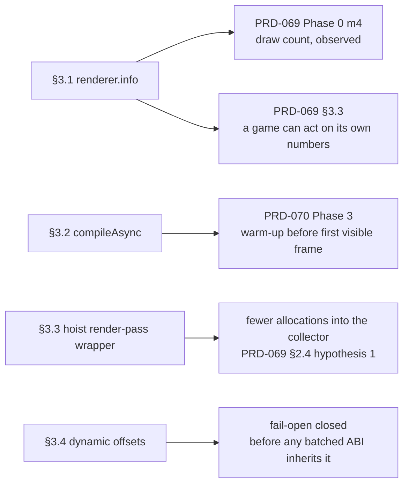
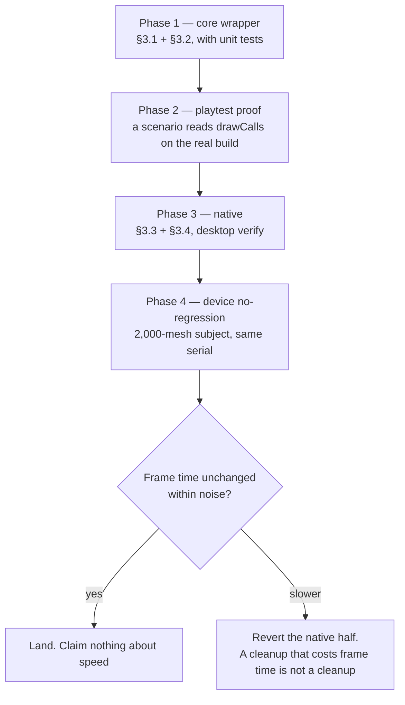

# PRD-071 — The cheap bundle: make the frame observable, and stop paying for what nothing uses

**Status: OPEN, filed 2026-08-10. Nothing here is implemented.** Four small changes that share
one property: **none of them is a performance bet, so none of them waits on a profile.** Two are
contract fixes on a wrapper the framework already owns, one closes a fail-open defect, and one
deletes allocations that nothing needs. They are bundled because they are individually too small
to carry a PRD each and because three of the four are prerequisites for the measurements that
PRD-069 and PRD-070 are blocked on.

**This PRD claims no frame-time improvement anywhere.** If any item here is later described as
having made a game faster, that description is wrong unless a device number says so.

**It survives the measurement that closed its sibling.** PRD-068 §1.2 measured the render-command
boundary at ~2% of frame, which closed PRD-072 and demoted the batched ABI. Nothing here was
justified by the boundary being expensive: two items buy evidence, one buys correctness, one is a
simplification. That is the property that made them worth bundling in the first place.

**Complexity: 3 → LOW-MEDIUM mode.** Four independent changes, no shared state between them, one
of which touches a signature the whole host uses.

**Blast radius: ~6 repository paths.** `packages/core/src/renderer.ts`,
`packages/core/__tests__/renderer.spec.ts`, `packages/runtime-native/src/webgpu/bindings.cpp`,
one playtest scenario, `packages/runtime-native/docs/G5-profiling.md`, `docs/verification/`.

**Depends on:** nothing. **Unblocks:** PRD-069 Phase 0 measurement 4 (draw count, observed),
PRD-070 Phase 3 (warm-up before the first visible frame). Both currently name a missing surface
as the reason they cannot proceed cleanly, and §3.1 and §3.2 below are that surface.

**Siblings:** PRD-068 owns the Android engine, PRD-069 owns per-draw cost, PRD-070 owns launch
time and hitches. **This PRD owns only the four items listed in §3** and must not grow to hold
anything that needs a measurement to justify it.

---

## 1. Why these four, and why now

PRD-069's central finding is that frame time is not linear in draw count, and its Phase 0 is a
measurement programme rather than a fix. That programme is stuck on something embarrassing:
**a game running on this framework cannot read its own draw count**, so every claim about
per-draw cost is currently made against *object* count, which is the wrong denominator. PRD-070
has the same shape of problem — it wants a warm-up pass before the first visible frame, and the
only way to reach `compileAsync` today is to reach around the framework's own renderer wrapper.

The other two items are debts on the native side that cost nothing to clear and get more
expensive to clear later: a fail-open code path, and a per-frame allocation that exists only
because a wrapper is rebuilt instead of cached. Clearing them now means the batched-ABI work in
PRD-069 §3.2, if it ever happens, does not inherit them.



---

## 2. What is measured here, and what is not

**Measured:** nothing. This PRD introduces no performance number and reuses none.

**Verified by reading the tree on 2026-08-10, and each is checkable in one command:**

| Claim | Where |
|---|---|
| `RendererLike` exposes `domElement, kind, raw, compute, render, setOutputNode, setSize, dispose` and **not** `info` or `compileAsync` | `packages/core/src/renderer.ts:6–15` |
| The WebGPU renderer keeps an `Info` with a per-frame `render.drawCalls` | `three@0.185.1` `build/three.webgpu.js:59418`, counter at `:31481` and `:31569` |
| The WebGL renderer's equivalent counter is named `render.calls`, **not** `drawCalls` | `three@0.185.1` `build/three.module.js:4475` |
| The WebGPU renderer exposes `compileAsync(scene, camera, targetScene?)` | `build/three.webgpu.js:60065` |
| `beginRenderPass` builds a fresh wrapper object plus 13 closures on every call | `packages/runtime-native/src/webgpu/bindings.cpp:3087–3330` |
| `renderPass.setBindGroup` carries `// TODO: Support dynamic offsets` and passes `0, nullptr` | `bindings.cpp:3107–3126` |
| The render-**bundle** encoder on the same host honours dynamic offsets | `bindings.cpp:4584–4604` |
| Upstream `three@0.185.1` never passes dynamic offsets on the render-pass path — every call site is `setBindGroup(index, group)` | `build/three.webgpu.js:75710, 75824, 85336, 85469, 85702` |

**That last row matters and is stated rather than buried: §3.4 is not fixing a wrong pixel
anybody has seen.** It is closing a path that discards an argument silently, in a repository
whose rule is that a backend which cannot honour an option fails loudly. It becomes a live bug
the day upstream starts passing offsets, and nobody would connect the symptom to this code.

---

## 3. The four items

### 3.1 Expose `info` on the renderer wrapper

**Where it lives: `packages/core/src/renderer.ts`. Framework, and it is a contract fix rather
than a new abstraction.**

Add `readonly info: unknown` to `RendererLike`, forwarded from the underlying renderer. That is
it — no normalisation, no wrapper type, no computed statistics.

**Why passthrough and not a tidy shape.** The two backends genuinely disagree: WebGPU counts
`info.render.drawCalls`, WebGL counts `info.render.calls`. Inventing a third name that means
both is exactly the vocabulary invention this repository forbids, and normalising would make the
framework own a surface Three.js already owns. **The cost of passthrough is that a portable
draw-count assertion must branch on `kind` first, and that cost is documented rather than
designed away.**

Size: about six lines including the interface member. Well inside the 20-line rule, and it is
a hole in a wrapper the framework already ships rather than a new capability.

Test: a unit test in `packages/core/__tests__/renderer.spec.ts` asserting the wrapper forwards
the object identity it was given, for both backends' fakes.

### 3.2 Expose `compileAsync` on the renderer wrapper

**Where it lives: `packages/core/src/renderer.ts`. Same argument as §3.1.**

Add `compileAsync(scene, camera): Promise<void>`, forwarded. Both backends implement it, so
unlike `compute` and `setOutputNode` this one does **not** throw on `webgl2`.

Without it, PRD-070's warm-up pass has to be written as `(renderer.raw as WebGPURenderer)
.compileAsync(...)` in generated user source. Reaching `.raw` is supported and documented, but a
game that cannot warm up without a cast is a framework gap, not a user choice — and the warm-up
call itself stays in the template's generated source and in `examples/native-smoke`, exactly
where PRD-070 puts it. **This PRD adds the reachability, not the warm-up.**

Size: about four lines. Test: same file, both fakes, plus one asserting the returned promise is
propagated rather than swallowed.

### 3.3 Hoist the render-pass wrapper out of `beginRenderPass`

**Where it lives: `packages/runtime-native/src/webgpu/bindings.cpp`. Framework, native.**

Every `beginRenderPass` call currently allocates a JS object and 13 JS closures and does 13
`setProperty` calls, then throws all of it away when the pass ends. That is per pass, per frame,
for the lifetime of the process.

The fix is a prototype-shaped one: build the command functions **once**, resolve the target
encoder from the wrapper's private data at call time instead of capturing it in each closure,
and hand out a cheap object per pass. The host already keeps `g_encoderRenderPassMap`, so the
per-pass state that the closures capture today has a home already.

**Sized honestly: this is a handful of allocations per frame, not thousands.** It is nowhere
near the ~20 ms step PRD-069 is hunting and this PRD does not pretend otherwise. It is worth
doing because it is *less* code than what it replaces, and because per-frame garbage in a host
whose collector is a live suspect (PRD-069 §2.4 hypothesis 1) should not be there by accident.

**If the change turns out to be more code than it replaces, it is abandoned.** That is the kill
switch and it is not negotiable — this item's entire justification is that it is a
simplification that happens to allocate less.

### 3.4 Honour dynamic offsets in `renderPass.setBindGroup`

**Where it lives: `bindings.cpp`. Framework, native, and it is a correctness fix.**

Read the offsets array and pass it through, exactly as the bundle-encoder path at
`bindings.cpp:4584–4604` already does. Copying an implementation that exists ten lines away in
the same file is the whole change.

**Why implement rather than throw.** The repository rule is that a backend which cannot honour
an option throws at construction rather than discarding it — but here the host *can* honour it,
and does so on a sibling path. Throwing would be choosing to keep a limitation that costs ten
lines to remove, and would break the day upstream passes offsets. **Implement, and the rule is
satisfied without a limitation to declare.**

Test: a native-side scenario that passes non-zero dynamic offsets through
`renderPass.setBindGroup` and asserts the rendered result matches the bundle-encoder path given
the same inputs. If that scenario cannot be written against this host today, the fallback gate
is a unit-level assertion that the offsets reach `wgpuRenderPassEncoderSetBindGroup` with the
count and pointer the caller supplied — **and the PRD says which of the two was actually run.**

---

## 4. Phases



### Phase 1 — the two wrapper surfaces

`renderer.info` and `renderer.compileAsync`, forwarded, with unit tests for both backends'
fakes in `packages/core/__tests__/renderer.spec.ts`. `pnpm typecheck && pnpm lint && pnpm test`
green, including each package's `publint`, since this changes an exported interface.

### Phase 2 — prove it on a real build, not on a fake

A playtest scenario against `abyss-framework` that reads a draw count off the running renderer
and asserts it is a positive integer that changes when the scene changes. **A unit test against a
fake renderer proves the forward; only a playtest proves the surface exists on the thing games
actually run.** The scenario branches on `kind` and reads `drawCalls` or `calls` accordingly —
which is §3.1's documented cost, demonstrated rather than described.

### Phase 3 — the two native items

`§3.3` and `§3.4`, then `pnpm native:build && pnpm native:verify:desktop` — 300 frames plus a
non-blank screenshot. A blank screenshot after a change to the render-pass wrapper is the
expected failure mode of §3.3 and the reason that gate is not optional.

### Phase 4 — no-regression on the device

Re-run the 2,000-mesh `examples/native-smoke` subject on serial `37251FDJH0037Z`, 300-frame
window, `-O2`, and compare against PRD-069's recorded 95.18 ms. **The bar is "not slower".**
Any improvement is reported as an observation with its sample size and explicitly not as this
PRD's purpose. If the number moves more than run-to-run noise in either direction, that is
interesting and belongs in PRD-069's ledger, not in a victory claim here.

---

## 5. Integration ledger

| Item | Surface | Who consumes it | Risk if wrong |
|---|---|---|---|
| §3.1 `info` | `RendererLike`, exported from `@threenative/core` | PRD-069 Phase 0 m4; any game tuning its own scene | An added optional member is additive; a wrong forward silently reports zeros, which the Phase 2 playtest is written to catch |
| §3.2 `compileAsync` | same | PRD-070 Phase 3 warm-up; template generated source | A swallowed promise turns a warm-up into a no-op that still looks warm — asserted against directly |
| §3.3 wrapper hoist | native only, no JS-visible change | every native frame | A stale captured encoder renders to the wrong target or crashes. Desktop verify is the gate |
| §3.4 dynamic offsets | native only, no JS-visible change today | upstream Three.js, the day it passes offsets | Wrong offsets are wrong pixels, not a crash — which is why the bundle-encoder path is the reference implementation to copy rather than a fresh one to write |

**Web/native parity:** §3.1 and §3.2 are pure JS in `packages/core` and behave identically on
both targets by construction. §3.3 and §3.4 are native-only fixes to a shim whose observable
behaviour must not change at all — that is what "no JS-visible change" means above, and the
desktop verify plus the device no-regression run are how it is checked rather than assumed.

---

## 6. Acceptance criteria

- [ ] `RendererLike` exposes `info` and `compileAsync`; `pnpm typecheck`, `pnpm lint` and
      `pnpm test` are green, with `publint` passing on the changed export map.
- [ ] Unit tests cover both backends' fakes for both new members, including promise propagation
      for `compileAsync`.
- [ ] A playtest scenario reads a draw count from the running `abyss-framework` build and
      asserts it responds to a scene change. **Not a fake. Not a unit test.**
- [ ] The playtest scenario branches on `kind`, and a comment names why the counter has two
      names — so the next reader does not "fix" it into a single invented name.
- [ ] `pnpm native:build && pnpm native:verify:desktop` passes with a non-blank screenshot after
      §3.3 and §3.4.
- [ ] The 2,000-mesh device run on serial `37251FDJH0037Z` is **not slower** than 95.18 ms, and
      the recorded row states target, serial, subject, build type and sample duration.
- [ ] §3.4 has either the render-comparison scenario or the argument-level assertion, and the
      verification row **names which one was run**.
- [ ] No item in this PRD is described anywhere as a frame-rate improvement.

---

## 7. Negative controls

| Control | What it does | Expected | Status |
|---|---|---|---|
| `info-forward` | replace the forwarded `info` with a frozen empty object | the Phase 2 playtest **fails** — it asserts the count changes with the scene, so a constant cannot pass | not built |
| `compile-swallow` | make `compileAsync` return `Promise.resolve()` without calling through | the unit test **fails** on propagation | not built |
| `pass-hoist` | keep the hoisted wrapper but resolve the encoder from the wrong pass | desktop verify **fails** with a blank or wrong-target screenshot | not built |
| `offsets-discard` | restore `0, nullptr` in `setBindGroup` | the §3.4 gate **fails**. If it passes, the gate asserts nothing and must be rewritten before this PRD closes | not built |

The `offsets-discard` row is the one that matters most: this repository's defining failure was a
harness that reported pass while asserting nothing, and a gate for a preventive fix is exactly
where that can happen unnoticed.

---

## 8. Out of scope, and why

- **A batched command ABI.** PRD-069 §3.2, gated on its Phase 0. Nothing here moves toward it.
- **Fixed-arity bindings.** PRD-072, **closed unimplemented** on PRD-068 §1.2's 2% measurement.
  §3.3 deliberately stops at hoisting the wrapper and does not touch the `NativeFunction`
  signature — which is why it survives the measurement that closed PRD-072: it is a
  simplification, not a bet on the boundary being expensive.
- **Any normalised or invented statistics surface.** `info` is forwarded, not designed.
- **The warm-up call itself.** PRD-070 Phase 3 owns it; this PRD only makes it reachable.
- **A performance claim of any kind.** See the header, and see §4 Phase 4.

## 9. Verification commands

```sh
pnpm typecheck && pnpm lint && pnpm test
pnpm --filter @threenative/playtest build
node packages/playtest/dist/runner/cli.js playtests/draw-count.playtest.json \
  --url http://127.0.0.1:5173 --server-command "pnpm --filter abyss-framework dev" \
  --browser-recipe webgpu
pnpm native:build && pnpm native:verify:desktop
```

The device row in Phase 4 runs the existing Android lane on serial `37251FDJH0037Z`; it is a
manual run and its output belongs in `docs/verification/` with the date and the serial.

## 10. The outcome this PRD must be willing to reach

**That §3.3 gets abandoned.** If hoisting the wrapper turns out to need more code than the
closures it replaces, or if it costs a millisecond on the device run, it is dropped and the
other three items land without it. An allocation cleanup that makes the file harder to read has
lost its only argument, and this PRD would rather record that than keep it for having been
written.
