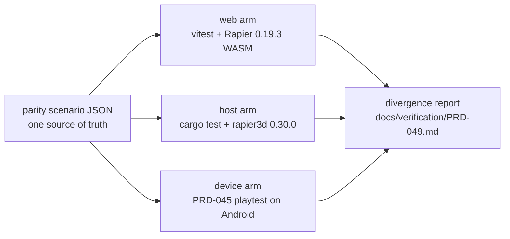

# PRD-049 — physics web/native parity, verified

**Status: PROPOSED (2026-08-08). Not started.**

PRD-046 built the native physics binding and proved it *runs*. This PRD proves it
**agrees with web**, and closes the eight divergences an inspection of
`packages/physics/src/**` and `packages/runtime-native/native/physics/src/lib.rs` found
between the two arms.

**This PRD does not add a feature.** It converts an unverified claim ("the same Godot-shaped
nodes behave the same on both backends") into a measured one, and deletes or fixes what the
measurement exposes. If the parity harness in Phase 0 shows the arms already agree, the
later phases shrink to their smallest true form — they do not run for their own sake.

**Complexity: 10 → HIGH mode.** (10+ files +3, cross-language state/ordering logic +2,
multi-package +2, native ABI + device transport +2, no new schema +1 for the C ABI change.)
HIGH means an automated checkpoint after every phase, and a manual checkpoint on every phase
with simulation behaviour.

**Depends on:** PRD-046 (the binding under test), PRD-045 (the device playtest lane this
measures through). **Blocks:** any claim that a game written against `@threenative/physics`
behaves the same on device as in the browser.

**Charter authority:** `CHARTER.md` §7 (native physics is the single most valuable artifact,
therefore the most dangerous one to ship unproven) and §10 (native LOC review trigger, which
Phase 5 pays back down).

**Area:** `OPPORTUNITY-AREAS.md` #7.

---

## 1. Context

**Problem:** the only automated gate that claims two-backend physics conformance compares the
web backend against itself, so no test in the repo has ever compared Rapier `0.19.3` (web,
WASM) against Rapier `0.30.0` (native, Rust) through the shipping ABI.

### Files analyzed

`packages/physics/src/simulation.ts`, `src/native/host.ts`, `src/native.ts`, `src/web.ts`,
`src/plugin.ts`, `src/handles.ts`, `src/proof.ts`, `src/proof-contract.ts`,
`src/native/proof.ts`, `__tests__/native-contract.spec.ts`, `__tests__/proof.spec.ts`;
`packages/runtime-native/native/physics/src/lib.rs`,
`packages/runtime-native/src/physics/native_bindings.cpp`,
`packages/runtime-native/include/threenative/physics_native.h`;
`examples/native-smoke/src/physics.ts` and its three playtest scenarios;
`docs/PRDs/native/PRD-046-physics-native.md`, `docs/verification/PRD-046.md`.

### Current behaviour

- The shared Godot nodes are genuinely unified. One source file per node, backend selected
  by the `threenative-native` export condition, `PhysicsSimulation` the only seam. **That
  part of PRD-046 is done and this PRD does not reopen it.**
- The Rust ABI fails closed on buffer capacity (`tn_physics_read_*` return `-1` rather than
  truncating) and on non-finite scalars, wrong typed-array classes, unknown ids, and
  degenerate quaternions. The C++ layer re-validates argument types before crossing.
- The web adapter validates in TypeScript with its own messages; the native adapter forwards
  to the host and inherits the host's.
- Device evidence is one dynamic cube resting on one floor, on an x86_64 emulator, plus
  three negative controls. Character movement, areas, one-way layers, kinematic platforms and
  collision-event ordering have **no device evidence at all**.

### 1.1 What the inspection found

Eight rows. Severity is "what a game does wrong because of it", not "how ugly it looks".

| # | Divergence | Web | Native | Severity |
|---|---|---|---|---|
| **D1** | The two-backend conformance gate compares web to web | `native-contract.spec.ts:212` builds the "native" arm as `createNativePhysicsSimulation(new NativeHostOverWeb(webSimulation()), "0.30.0")`, and `NativeHostOverWeb` delegates every method to `createWebPhysicsSimulation` | same Rapier `0.19.3` WASM on both sides; the `"0.30.0"` version string is a literal, not the backend | **Critical** — this is a textbook self-comparison. It can only catch adapter-shape bugs, never a simulation divergence, which is the failure mode §0 of PRD-046 says is invisible |
| **D2** | Character state and area intersections are only fresh after `readVisibleTransforms()` | `simulation.ts:470-501` computes both on demand, per call | `native/host.ts:169-203` captures both *inside* `readVisibleTransforms` and serves cached values afterwards | **High** — a game that reads `readCharacterState(id)` without calling `readVisibleTransforms` gets live state on web and `undefined` on device. The conformance test always calls them in the lucky order, so the contract is undocumented and unenforced |
| **D3** | `removeBody` with an unknown id | `simulation.ts:360` returns silently | `native_bindings.cpp:281` throws `removeBody received an unknown id` | **High** — the same teardown code path crashes on one backend only |
| **D4** | `setBodyTransform` side effects | `simulation.ts:371` sets translation and wakes the body | `lib.rs` additionally sets the next kinematic translation and clears `grounded` / `ground_collider` | **Medium** — after a teleport, a character reports grounded on web and not-grounded on device for at least one frame |
| **D5** | Collision-event derivation | Rapier's own event queue, broad-phase driven, pair order is Rapier's collider order | `lib.rs` rescans **every ordered pair of bodies** each step (`entries.iter()` nested over `entries.iter().skip(index+1)`) and emits `(lower_id, higher_id)` | **Medium** — O(n²) narrow-phase lookups per step on the platform the binding exists to make fast, plus a different pair order in the public `drainCollisionEvents` output |
| **D6** | Quadratic event/intersection buffers | `plugin.ts:53` allocates `bodyCount² × 4` `Uint32Array` | `native/host.ts:187` allocates `bodyIds.size² × 2` on top of it | **Medium** — 300 bodies is a 1.4 MB allocation on each grow, on a mobile heap |
| **D7** | Removing a body while it overlaps another | Rapier's own removal-event behaviour (unmeasured) | `lib.rs` `remove_body` drops the pair from `colliding` **without emitting a stopped event** | **Medium, unmeasured** — Phase 0 must measure it before it is called a bug; if web does emit, a despawn loses its `bodyExited` on device only |
| **D8** | Dead proof-only surface | `src/proof.ts` (117 lines) + `src/proof-contract.ts` + `src/native/proof.ts` | `tn_physics_proof_create/step/read/drain/destroy` in `lib.rs` + its `createProofSimulation` C++ block | **Low, but it is the LOC debt** — caller census finds **zero non-test consumers**. PRD-046 §Phase 2 already says the acceptance subject goes through the normal public API, so this path is the superseded incumbent that was never removed. Native LOC currently sits **373 lines over** its 50,000 review trigger |

### 1.2 The verification gap, stated plainly

`examples/native-smoke/playtests/physics.playtest.json` is run on the device lane. The
identical scenario is **never run on the web arm and diffed against it**. So the repo has:

- a web arm proven against sealed browser proofs,
- a device arm proven against a hand-written resting height,
- and **nothing that compares the two**.

`native:physics:measure` is the closest thing, and it compares a Rust *example binary*
against a web snapshot — not the shipping ABI, not the shared nodes, not the plugin frame
path. Its zero-position-delta result is real and load-bearing for §1.1 of PRD-046; it is not
parity evidence for anything a game calls.

---

## 2. Solution

Four moves, in dependency order:

- **Measure first.** A parity harness that drives one scenario through both arms and prints a
  divergence table. The first run is expected to be **red on some rows**; that output is the
  deliverable, not a failure.
- **Make the differential real.** Replace the self-comparing conformance gate with one whose
  two sides resolve to genuinely different simulators — web Rapier `0.19.3` under vitest
  against Rust `rapier3d 0.30.0` compiled for the host — and assert the identity of each side
  so it cannot silently collapse back into a self-comparison.
- **Close each measured divergence at the seam it belongs to**, sharing validation instead of
  duplicating it, and stating any ordering contract in the type that owns it.
- **Pay back the LOC.** Delete the proof-only path, which is the superseded incumbent of the
  general ABI and has no live caller.

### 2.1 Parity is a tolerance, not an equality

Rapier `0.19.3` and `0.30.0` are different solvers. Bit-identity is not the target and
claiming it would repeat exactly the overclaim PRD-046 §1.1 exists to prevent.

The contract this PRD asserts is:

| Class | Tolerance | Rationale |
|---|---|---|
| Resting position after settling | `≤ 0.02` per axis | already the device gate's tolerance |
| Character displacement over N steps | `≤ 0.05` cumulative | controller sweep differences are legitimate |
| `grounded` / `groundCollider` | **exact** | boolean state, no solver excuse |
| Area membership set | **exact** | set equality; a body is inside or it is not |
| Collision event set (unordered, by id pair) | **exact** | ordering may differ, membership may not |
| Error class for each rejected input | **exact** | fail-closed behaviour is not solver-dependent |

**A row that cannot state its tolerance does not go in the harness.** "Close enough" is the
shape of a validator that asserts nothing.

### 2.2 Architecture



The web and host arms run on this Linux machine today, every commit. The device arm runs on
the emulator lane and is the slow gate. Three arms, one scenario file, one report.

### 2.3 Explicitly rejected

- **Making the arms bit-identical** by pinning the same Rapier version on both. Web WASM
  Rapier `0.30.0` is a separate upgrade with its own regression surface, and native `0.19.3`
  is not buildable as a `staticlib` from the same source tree. Version divergence is a
  documented, bounded fact — not a bug to hide behind an alignment.
- **Deleting the failing assertions to get green.** Named here because `AGENTS.md` names it.
  A red parity row is closed by fixing an arm or by writing the tolerance down with its
  reason, never by narrowing the scenario.
- **A second physics API for device.** Closed by PRD-046 §2.3 and not reopened.
- **Fixing D5's O(n²) scan before Phase 0 measures it.** If the scan is not on any real
  frame budget, replacing it is speculative work the 20-line rule forbids.

---

## 3. Integration Ledger

Filled with real `file:line` during implementation. A `TBD` at phase end means the phase is
incomplete.

| # | New thing | Live caller (non-test `file:line`) | Replaces | Old path removed? | Negative control |
|---|---|---|---|---|---|
| 1 | `physics-parity.scenario.json` | `packages/physics/__tests__/parity.spec.ts`, `native/physics/tests/parity.rs`, and the device lane in `scripts/verify-android-physics-parity.mjs` — the scenario is data, its callers are the three arms | ad-hoc inline scenarios in `native-contract.spec.ts` | those inline bodies deleted in Phase 1 | perturb one scenario step → all three arms report a different table |
| 2 | Rust host-target parity test | `packages/runtime-native/package.json` script `native:physics:parity`, invoked by the package `test` script | `NativeHostOverWeb` fake in `native-contract.spec.ts` | fake deleted in Phase 1 | assert the two sides' Rapier versions differ; the test fails if both resolve to `0.19.3` |
| 3 | `requirePhysicsStepInput` shared validators | `simulation.ts` web adapter **and** `native/host.ts` native adapter | duplicated checks in the web adapter only | web-only copies deleted in Phase 3 | pass a `Float64Array` → both adapters throw the same error class |
| 4 | Freshness contract on `PhysicsSimulation` | `plugin.ts` frame path documents and depends on it | undocumented ordering coupling in `native/host.ts` | coupling removed or enforced in Phase 2 | read character state before any `readVisibleTransforms` → both arms agree |
| 5 | `docs/verification/PRD-049.md` | the round ledger and this PRD's acceptance audit | nothing | n/a | delete the report and re-run → it regenerates or the gate fails loudly |
| 6 | *(deletion)* proof-only path removed | n/a — this row removes code | `src/proof.ts`, `src/proof-contract.ts`, `src/native/proof.ts`, `tn_physics_proof_*`, `createProofSimulation` | deleted in Phase 5 | `pnpm budgets` native LOC drops; `pnpm test` still green without them |

### Reachability

**How is this reached?** `pnpm test` (web + Rust host arms, every commit) and the PRD-045
Android device lane (the emulator gate). Pre-existing files edited to call it:
`packages/physics/package.json`, `packages/runtime-native/package.json`,
`packages/physics/__tests__/native-contract.spec.ts`.

**User-facing?** No. The consumer is the next agent that writes a physics game and needs to
know whether the browser result predicts the device result.

**What does it replace?** `NativeHostOverWeb` (a fake that cannot fail), and the proof-only
ABI (an incumbent with no callers). Both are deleted, not left beside the new path.

---

## 4. Execution phases

### Phase 0 (proving phase) — measure the divergence before changing anything

**No production code changes.** Deliverable is a number table.

**Proof subject — the hardest real one, not a falling cube.** One scenario containing, in a
single world: a fixed floor, a dynamic box dropped onto it, a kinematic moving platform, a
`CharacterBody3D` walking onto that platform with autostep and snap-to-ground configured, a
one-way layer the character passes upward through, an `Area3D` whose mask admits the box and
excludes the character, and a mid-run `removeBody` on a body that is overlapping something.

This subject exercises every row in §1.1. A cube on a floor exercises D5 and nothing else.

**Files (max 5):**

- `packages/physics/__tests__/fixtures/physics-parity.scenario.json` — NEW: the scenario
- `packages/physics/__tests__/parity.spec.ts` — NEW: web arm, writes observations to JSON
- `packages/runtime-native/native/physics/tests/parity.rs` — NEW: host arm, same scenario
- `packages/runtime-native/package.json` — EDIT: `native:physics:parity` script
- `docs/verification/PRD-049.md` — NEW: the divergence table

**Wiring:** the scenario file is read by both arms; neither arm hardcodes the steps. The
Rust arm links the same `Simulation` type the ABI exports, not a re-implementation.

**Tests required:**

| Test | Assertion | Negative control (must be observed red) |
|---|---|---|
| `should read the same scenario file on both arms` | both arms report the same scenario sha256 | edit the JSON by one byte → both hashes change together; edit one arm's path → the test fails |
| `should resolve two different Rapier versions` | web `RAPIER.version()` ≠ Rust `rapier3d` version, both printed | force both to the same source → the test fails |
| `should report every divergence row with a number` | each §2.1 row has a measured delta, never `undefined` | drop a row from the observation set → the harness fails rather than printing a short table |

**Gate:** the report states, for every row in §1.1 and §2.1, a measured number or an explicit
`NOT REPRODUCIBLE ON THIS HOST`. **A phase that cannot state its deltas has failed** — same
rule as PRD-046 Phase 0.

**Manual checkpoint:** read the table. Rows that come back inside tolerance shrink their
phase below; rows outside it set that phase's real scope.

---

### Phase 1 — kill the self-comparison (D1)

**Files (max 5):**

- `packages/physics/__tests__/native-contract.spec.ts` — EDIT: delete `NativeHostOverWeb`,
  point the conformance assertions at the Phase 0 fixture
- `packages/runtime-native/native/physics/tests/parity.rs` — EDIT: assert the recorded web
  observations from the fixture, within §2.1 tolerances
- `packages/runtime-native/package.json` — EDIT: `test` script runs `native:physics:parity`
- `packages/physics/AGENTS.md` — EDIT: state that the conformance gate's two sides must
  resolve to different Rapier builds, and why
- `docs/verification/PRD-049.md` — EDIT: record the pass with its control

**Wiring:** the Rust parity test must be *collected*. Confirm the runner's reported test
count changes, not just its exit code — an uncompiled test file is the silent-pass mechanism
this phase exists to remove.

**Revert check:** rename `Simulation` in `lib.rs` → the parity test fails to build.
Re-introduce a web-backed fake → the version-identity assertion fails.

**Gate:** the conformance gate is red when either arm is perturbed, and red today for every
row Phase 0 measured outside tolerance. A gate that is green on the unmodified tree at this
phase has not been shown to measure anything.

---

### Phase 2 — the freshness contract (D2)

**Files:**

- `packages/physics/src/simulation.ts` — EDIT: `PhysicsSimulation` documents that
  `readCharacterState` and `areaIntersections` reflect the last `step()`, not the last
  `readVisibleTransforms()`
- `packages/physics/src/native/host.ts` — EDIT: move the character-state and
  area-intersection reads out of `readVisibleTransforms` so the two are independent
- `packages/physics/__tests__/parity.spec.ts` — EDIT: add the out-of-order read
- `packages/runtime-native/native/physics/tests/parity.rs` — EDIT: same
- `docs/verification/PRD-049.md` — EDIT

**Preferred fix:** the native adapter refreshes its caches lazily on first read after a
`step()`, so call order stops mattering on both arms. Keeping the coupling and documenting it
is the fallback, and only if Phase 0 shows the lazy refresh costs a measurable per-frame
crossing — in which case the plugin's fixed order becomes the enforced contract and the
adapter throws when read out of order rather than returning stale data.

**Negative control:** call `readCharacterState` before any `readVisibleTransforms` on both
arms. Before the fix, native returns `undefined` and web returns a state — the test is red.
After, they agree. **Observe that red.**

---

### Phase 3 — fail-closed symmetry (D3, D4, and the validators)

**Files:**

- `packages/physics/src/simulation.ts` — EDIT: extract `requirePhysicsStepInput`,
  `requirePhysicsRenderBuffer`, `requirePhysicsEventBuffer` from the web adapter
- `packages/physics/src/native/host.ts` — EDIT: call the same validators before crossing
- `packages/runtime-native/native/physics/src/lib.rs` — EDIT: `set_body_transform` stops
  clearing character grounded state (or the web adapter starts clearing it — Phase 0's D4
  measurement picks which arm is wrong; the losing arm changes)
- `packages/runtime-native/src/physics/native_bindings.cpp` — EDIT: `removeBody` on an
  unknown id becomes a no-op, matching web
- `packages/physics/__tests__/parity.spec.ts` — EDIT: one row per rejected input

**Wiring:** the extracted validators must be the *only* copy. Grep for the old inline checks;
any survivor is the additive-migration smell and fails the checkpoint.

**Negative controls:** for each of `Float64Array` input, non-finite delta, oversized
`kinematicCount`, undersized render buffer, unknown kinematic id, unknown `removeBody` id —
both arms must produce the same outcome (same error class, or the same silent no-op).
Each was observed differing before the change.

---

### Phase 4 — the O(n²) scan and the quadratic buffers (D5, D6, D7)

**Runs only on Phase 0's numbers.** If the pairwise scan is under budget at the body counts
the templates actually reach, this phase is one documentation line and the LOC stays deleted
instead of added. Write that outcome down rather than optimising to feel thorough.

**Files if it does run:**

- `packages/runtime-native/native/physics/src/lib.rs` — EDIT: derive collision events from
  the narrow phase's own contact/intersection events instead of rescanning all pairs; emit a
  stopped event when a body is removed mid-overlap (D7), if Phase 0 shows web does
- `packages/physics/src/native/host.ts` — EDIT: size the intersection buffer from the
  measured pair count with geometric growth, not `n²`
- `packages/physics/src/plugin.ts` — EDIT: same for the event buffer
- `packages/runtime-native/native/physics/tests/parity.rs` — EDIT: the event-set row becomes
  a set-equality assertion, order-independent, plus the mid-overlap removal case
- `docs/verification/PRD-049.md` — EDIT: before/after step cost at 10, 100 and 300 bodies

**Negative control:** the event-set assertion must go red when one arm's emission is
suppressed, and the buffer-growth assertion must go red when growth is disabled and the
scenario exceeds the initial capacity — never silently truncate.

---

### Phase 5 — delete the proof-only path (D8) and pay back the LOC

**Files:**

- `packages/physics/src/proof.ts`, `src/proof-contract.ts`, `src/native/proof.ts` — DELETE
- `packages/physics/__tests__/proof.spec.ts` — DELETE
- `packages/runtime-native/native/physics/src/lib.rs` — EDIT: remove `tn_physics_proof_*`
- `packages/runtime-native/src/physics/native_bindings.cpp` and
  `include/threenative/physics_native.h` — EDIT: remove `createProofSimulation`
- `packages/physics/package.json` — EDIT: drop the `./proof` export if one exists

**Caller census, pasted before deleting** (this is the evidence, not the intent):

```sh
grep -rn "createPhysicsProof\|createProofSimulation\|tn_physics_proof" \
  --include='*.ts' --include='*.cpp' --include='*.rs' --include='*.mjs' . \
  | grep -v node_modules | grep -v '\.spec\.' | grep -v '/tests\?/'
```

**Expected: zero hits outside the definitions themselves.** If a hit appears, the path is
live and this phase does not run — it becomes a migration onto the general ABI instead.

**Gate:** `pnpm budgets` reports native LOC back **under** 50,000 with no trigger to justify,
`pnpm test` green, and PRD-046 §6's recorded +373 trigger is annotated as repaid in
`docs/verification/PRD-046.md`.

---

### Phase 6 — the device parity playtest

The web-and-host arms prove the simulators agree. This phase proves the **shipped game**
agrees, through the real bundle, on the real emulator, using the harness the repo already
trusts.

**Files:**

- `examples/native-smoke/playtests/physics-parity.playtest.json` — NEW: the Phase 0 scenario
  as a playtest, asserting the same tolerances against the same observations
- `examples/native-smoke/src/physics.ts` — EDIT: the subject scene builds the Phase 0
  scenario through the normal public API, driven by the scenario JSON
- `packages/runtime-native/scripts/verify-android-physics-parity.mjs` — NEW: runs the
  scenario on the web build and on `emulator-5554`, diffs the two observation sets
- `packages/runtime-native/package.json` — EDIT: `native:physics:parity:device` script
- `docs/verification/PRD-049.md` — EDIT: the three-arm table

**Run shape** (headless Linux; screenshots are not the instrument here, resources are):

```sh
pnpm --filter @threenative/playtest build
node packages/playtest/dist/runner/cli.js \
  examples/native-smoke/playtests/physics-parity.playtest.json \
  --url http://127.0.0.1:5173 --server-command "pnpm --filter native-smoke dev" \
  --browser-recipe webgpu
pnpm --filter @threenative/runtime-native native:physics:parity:device
```

**Negative controls, each observed red on the device before the pass counts:**

| Control | Expected |
|---|---|
| Tighten one tolerance to `0` | the parity diff fails; proves the diff is computed, not asserted |
| Flip gravity on the device arm only | the diff fails on position rows and on the area-membership row |
| Point both arms at the web build | the version-identity assertion fails — the self-comparison cannot come back through the device lane either |
| Delete the device observation file and re-run | regenerates or fails loudly; never passes on the stale copy |

**Emulator caveat, restated in the result:** `x86_64` only. A pass proves ABI plumbing and
simulation agreement. It proves nothing about `arm64` codegen or performance, and the report
says so — PRD-046 acceptance criterion 8 stays open, not quietly closed by this PRD.

---

## 5. Acceptance criteria — consumer-scoped

1. A game scene containing a character, a moving kinematic platform, a one-way layer, an
   area and a mid-run despawn produces the **same observable outcomes** in the browser and on
   the Android emulator, within §2.1's stated tolerances, proven by a playtest that has been
   shown to fail when either arm is broken.
2. The conformance gate's two sides resolve to different Rapier builds, asserted in the test
   itself, and the gate is red when either arm is perturbed.
3. Reading character state or area membership without first reading visible transforms
   returns the same answer on both backends.
4. Every input the web adapter rejects, the native adapter rejects with the same error class,
   and every input web accepts silently, native accepts silently.
5. `docs/verification/PRD-049.md` states a measured number for every row in §1.1 — including
   the rows that turned out to be within tolerance and needed no change.
6. `pnpm budgets` reports native LOC under the 50,000 review trigger with the proof-only path
   removed, and no new package.
7. The cross-version replay limitation from PRD-046 §1.1 is **not** weakened by anything in
   this PRD's docs. Parity within tolerance is not portability, and the report says so at the
   table, not only here.
8. `arm64`, physical hardware and per-frame cost stay recorded as **open** unless Phase 4
   measured them.

---

## 6. Kill conditions

- **Phase 0 cannot build the Rust arm for the host target** → the differential is not
  runnable on this machine and the whole PRD collapses to the device lane, which is a
  materially weaker plan. Stop and say so rather than re-introducing a JS fake.
- **A parity row is closed by widening a tolerance without a stated physical reason** → the
  harness has become a validator that asserts nothing, which is the exact v1 failure
  `AGENTS.md` opens by naming. Revert the widening.
- **The scenario is narrowed to get green** → the divergence is real and the scenario was
  the instrument. Fix the arm.
- **Phase 4 adds native lines while the LOC trigger is still unpaid** → Phase 5 runs first,
  or Phase 4's optimisation is justified in this PRD with its measurement and its kill-switch
  pass.
- **The proof-only path turns out to have a live caller** → Phase 5 does not delete it; it
  migrates that caller to the general ABI, and the LOC repayment claim is withdrawn.

---

## 7. What this PRD deliberately does not do

- It does not touch navigation. `recast-navigation` is WASM and therefore equally dead on
  QuickJS; that is PRD-046 Phase 5's open gate and it needs its own PRD, not a paragraph here.
- It does not unify Rapier versions across arms.
- It does not add trimesh, convex hull or heightfield to the native ABI. Those throw during
  construction today, which is the correct fail-closed behaviour; adding them is a scope
  decision with its own LOC cost and its own proof burden.
- It does not close PRD-046's iOS or clean-machine criteria. Those are blocked on hardware
  and on PRD-048 respectively, and nothing here changes either.
