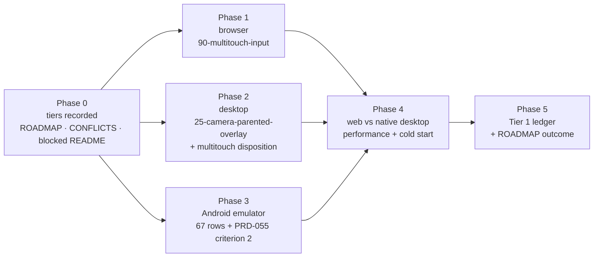

# PRD-064 — Tier 1 native reliability: finish what a device-free machine can prove

**Status: TIER 1 NOT REACHED, 2026-08-10.** Evidence: `docs/verification/tier-1-2026-08-10.md`.
The executed target split is Browser `67/0/0/0`, Desktop Linux `65/1/1/1`, and Android
emulator `27/40/0/1`; the three Phase 4 controls are **UNVERIFIED** with exit `254`. This PRD
makes no mobile-readiness claim. Every phase below is executable on this host. No physical
device, no Apple identity, no release credential, no CI minute is required.

**Complexity: 6 → MEDIUM mode.** Two red conformance rows, one blocked row decision, one
unrun emulator matrix, one same-hardware performance proof, one ledger.

**Blast radius: ~11 repository paths.** `packages/runtime-native/conformance/`,
`packages/runtime-native/scripts/`, `packages/runtime-native/tests/`,
`packages/create-threenative/templates/platformer/`, `docs/strategy/ROADMAP.md`,
`docs/strategy/CONFLICTS.md`, `docs/PRDs/BLOCKED/README.md`,
`docs/verification/tier-1-<date>.md`.

**Depends on:** PRD-047 (absorbed runtime), PRD-053 (multitouch), PRD-054 (the parity gate and
its 67-row registry), PRD-055 (generated HUD), PRD-058 (the authoritative performance budgets
and its Phase 5 spec). All five exist; none is re-specified here.

The device matrix and the five-minute stranger test define the readiness boundary;
`docs/product/PERFORMANCE-BUDGETS.md` owns the numbers.

## 1. Why this exists

The owner's bar is a Three.js TypeScript game that runs **reliably on web, desktop and
Android**, with iOS deferred. "Reliably" was never defined as something anyone can run, so the
native lane has been spending its effort on PRDs whose every criterion needs hardware this
machine does not have — eight of nine PRDs are in `BLOCKED/`, and nine of the last
fifteen commits touched zero package files.

This PRD defines reliability as five runnable dimensions, splits them into what this host can
prove (**Tier 1**) and what only a phone can prove (**Tier 2**), and finishes Tier 1.

## 2. What "reliable" decomposes into

| # | Dimension | Instrument that already exists | Tier 1 reachable here |
|---|---|---|---|
| 1 | It renders the same everywhere | `conformance/registry.json`, 67 rows, 3 targets | ✅ browser, Linux desktop, Android emulator |
| 2 | Controls work | row `90-multitouch-input`; PRD-055 criterion 2 touch playability | ✅ emulator |
| 3 | UI works | rows `30-screen-space-text`, `31-hud-readout-updates`, the glyph-count contract | ✅ already passing; held, not re-proved |
| 4 | Same performance | `PERFORMANCE-BUDGETS.md` via PRD-058 Phase 5 | ⚠️ **web + native desktop only.** Mobile fps is device-gated |
| 5 | It does not crash over time | PRD-058 soak | ⚠️ **desktop only.** Device soak, ANR and tombstones are device-gated |

**Three dimensions close completely here. Two close on desktop and stop at the emulator
boundary.** That boundary is the exact thing one physical Android device buys, and it is why
Tier 2 exists rather than being wished away.

**An emulator result is never a device result.** No phase below licenses a frame-rate,
GPU-driver or arm64 claim, and the ledger must repeat the same device-versus-emulator distinction.

## 3. The two tiers, and what reopens Tier 2

**Tier 1 — the shipping bar.** Dimensions 1–3 green on browser, Linux desktop and the Android
emulator; dimensions 4–5 green on web and native desktop. Licenses exactly this sentence:
*"runs on browser WebGPU, desktop Linux/macOS/Windows, and the Android emulator; iOS builds
and packages."* It licenses no other sentence.

**Tier 2 — deferred, not dropped.** PRD-056 physical qualification, PRD-057 physical audible
rows, PRD-058 device soak and mobile fps, PRD-060 promoted distribution, iOS device
reliability.

**Reopen trigger:** Tier 2 restarts when
a stranger has played a ThreeNative game for five minutes — concretely, the first external
user who installs the framework and asks for a device build. A physical Android device
arriving earlier reopens the Android half alone; it does not reopen iOS.

## 4. Integration ledger

Filled with real non-test `file:line` during implementation. A `TBD` at phase end means the
phase is incomplete.

| # | New thing | Live caller (non-test) | Replaces | Negative control |
|---|---|---|---|---|
| 1 | Tier 1/Tier 2 decision rows | `ROADMAP.md` Open table; `BLOCKED/README.md` header; `CONFLICTS.md` row 9 | the standing "blocked, revisit each batch" wording | TBD |
| 2 | `90-multitouch-input` fix | `conformance/run-conformance.mjs` browser target | the currently red row | drop one pointer → row red |
| 3 | `25-camera-parented-overlay` fix | `conformance/run-conformance.mjs` desktop target | the currently red row | remove the resize → `TN_CONFORMANCE_RESIZE_NOT_APPLIED` |
| 4 | desktop-multitouch disposition | `conformance/registry.json` `exclusions[]` with owner + reason | the silent `blocked` cell | an excluded row claimed as pass → runner exits non-zero |
| 5 | `platformer/playtests/performance.playtest.json` | copied by the existing scaffold, driven by the existing runner | none — PRD-058 Phase 5 row 5 | slow the render path → `TN_PROD_PERFORMANCE_BUDGET`, exit 1 |
| 6 | `docs/verification/tier-1-<date>.md` | `ROADMAP.md` beta-bar rows 4 and 5 | the non-green aggregate citation | schema test fails on a missing gate cell |

## 5. Phases

Phases 1, 2 and 3 are independent of each other and may run in any order or in parallel.

### Phase 0 — the tiers are recorded where the lane reads them

**Files (3, all pre-existing):** `docs/strategy/ROADMAP.md` — EDIT: Tier 1/Tier 2 rows and the
reopen trigger; also repair the stale `production-readiness/` pointer for PRD-057…060.
`docs/strategy/CONFLICTS.md` — EDIT: new row 9, the device-matrix tension.
`docs/PRDs/BLOCKED/README.md` — EDIT: each blocked PRD carries its tier and unlock
condition.

**Why it is not a charter edit:** the mobile promise is *staged*, not deleted. `CONFLICTS.md`
is the file this repo already uses for a strategy/charter tension, so the tension is recorded
rather than resolved by an unauthorised amendment.

### Phase 1 — simultaneous stick and jump moves the player in the browser

**Files (≤4):** `conformance/scenes/shared/multitouch-input.js`, `conformance/multitouch-proof.mjs`,
`packages/core/src/` input path if the root cause is there, `tests/conformance-runner.test.mjs` — EDIT.

**Root cause first.** `prd-054-aggregate-rerun-2026-08-10.md` records the row red and states it
did **not** establish a cause. Nothing may be changed until the cause is written down. If the
cause turns out to be the scene rather than the runtime, that is a finding and the row still
has to go green.

**Negative control:** with the fix live, drop one of the two pointers before dispatch — the row
must go red, not merely stop moving the player.

### Phase 2 — the desktop overlay renders, and desktop multitouch stops being a silent blank

**Files (≤4):** `conformance/overlay-anchor.mjs`, `conformance/scenes/shared/camera-parented-overlay.js`,
`conformance/registry.json` — EDIT, `packages/runtime-native/src/` render path as the cause requires.

Two outcomes, both acceptable, neither silent:

1. `25-camera-parented-overlay` goes green with the observed GPU validation errors resolved.
2. Desktop multitouch — native injection is unsupported — moves into `registry.json`'s
   existing `exclusions[]` with an owner and a reason, exactly as `react-dom-tailwind-hud`
   and `rapier-wasm-mobile` already are. **A `blocked` cell that nobody has dispositioned is
   the thing this phase deletes.**

**Negative control:** an excluded row claimed as a pass must make the runner exit non-zero.

### Phase 3 — the Android matrix produces a real number for the first time

**Files (≤3):** `conformance/run-conformance.mjs` — EDIT: fail with the AVD name it looked for;
`scripts/build-android-conformance.mjs` — EDIT if the aar path needs it; PRD-055's touch
scenario.

The 2026-08-10 run reported Android `0 pass / 0 fail / 67 blocked` for two environmental
reasons, both fixable here: no AVD was booted (four exist, including `threenative_api35`), and
the run executed inside a worktree where untracked `third_party/` deps are absent by charter.
Run from the main working tree with `~/Android/Sdk/emulator/emulator` up.

**The result is whatever it is.** If rows fail on their merits, they are recorded as failures
and owned; a retry loop until green is forbidden. PRD-055 criterion 2 is closed in this phase
or explicitly is not.

**Negative control:** with no AVD online the runner must report `TN_PARITY_ANDROID_DEVICE_BLOCKED`
and exit non-zero — never 67 silent passes, never a skipped target counted as green.

### Phase 4 — the unmodified platformer holds its budget on web and is not slower natively

This is **PRD-058 Phase 5, executed unchanged** — same files, same gates, same budgets. It is
listed here because it is the only part of PRD-058 that needs no device, and PRD-058 as a whole
stays blocked.

Budgets, from `PERFORMANCE-BUDGETS.md` via PRD-058: web desktop ≥ 60.0 fps mean and p99 ≤ 33.0 ms
at 1920×1080; native desktop no slower than web on mean/p50/p95/p99 on one identified host;
cold start p95 ≤ 5,000 ms over five independent launches.

**Negative controls, all three required red before any pass is recorded:** slow the web render
path → `TN_PROD_PERFORMANCE_BUDGET`; slow only the native arm → parity failure with *different*
resolved process and artifact identities; delay the first non-blank frame → `TN_PROD_STARTUP_BUDGET`.
The identity check is what stops the parity gate comparing the browser against itself.

### Phase 5 — the ledger says what Tier 1 licenses, and what it does not

**Files (2):** `docs/verification/tier-1-<date>.md` — NEW; `docs/strategy/ROADMAP.md` — EDIT:
beta-bar rows 4 and 5 state the measured outcome and cite this ledger.

The ledger records per-target pass/fail/blocked counts, every negative control observed red,
the gates table (`pnpm typecheck`, `pnpm lint`, `pnpm test`, `pnpm budgets` as actually run),
and the sentence Tier 1 licenses. **Including "Tier 1 not reached" if that is the result.**

## 6. Acceptance criteria

Consumer-scoped: each is about a build someone could tell apart, not about code that exists.

1. Dragging the stick and pressing jump at the same time **moves the player and fires the jump**
   in the browser build; dropping one pointer turns the row red.
2. The camera-parented overlay **is visible in the desktop capture** within tolerance, or
   desktop multitouch appears in `registry.json`'s `exclusions[]` with an owner and reason —
   no row remains a silent `blocked`.
3. `pnpm parity` reports Android as **executed** — a real pass/fail split over 67 rows, from a
   booted emulator, with the device-blocked path proven to exit non-zero.
4. **The platformer a user scaffolds** holds the web budget and is no slower natively on one
   identified host, with web and native resolving to different process and artifact identities.
5. All three Phase 4 negative controls and both Phase 1–3 controls were **observed red** and
   are recorded with their exit codes. A pass with no observed red is written `UNVERIFIED`.
6. `docs/verification/tier-1-<date>.md` exists, its schema test passes, and `ROADMAP.md` beta
   rows 4 and 5 cite it — **including a "not reached" outcome.**
7. `ROADMAP.md`, `CONFLICTS.md` and `BLOCKED/README.md` carry the tier split and the
   five-minute stranger reopen trigger, and no document claims mobile readiness.

## 7. What this deliberately does not do

No physical device, no iOS beyond the packaging that already exists, no promoted distribution,
no PRD-058 phase other than 5, and no work on PRD-056, 057, 059 or 060. **No package source is
added to make a row pass** — a row goes green because the runtime is right, or it is recorded
red. The 20-line rule and the kill switch apply unchanged; the native LOC review trigger is
tracked in §9, so any line added here needs its justification in this PRD.

## 8. Kill switch — the outcome this PRD must be willing to reach

If Phase 3 shows the Android emulator failing rows on their merits rather than environmentally,
Tier 1 is **not** reached, the roadmap says so, and the owner's "reliable on Android" bar moves
from "days away" to "needs a device and real work." Recording that is the point of the PRD. The
failure mode this exists to prevent is a Tier 1 declared green by narrowing what Tier 1 meant.

## 9. Native LOC review trigger — the justification this PRD owes

§7 said any line added here needs its justification in this PRD, and this is it. The historical
snapshot for this section was 61,617 lines when it was written and the later recorded snapshot was
**68,396**, against a 50,000 review trigger. The
merge that landed the night batch moved it from 64,489 to 68,035; the rest is the launch
inspector added afterwards.

`packages/runtime-native` grew by **4,078 lines against 121 removed** since `553b9d0`. Where they
went, largest first:

| Lines | File | Why it is not game or framework code |
| --- | --- | --- |
| 1,471 | `scripts/profile-production.mjs` | Drives a packaged build on a device and records a production profile. Reachable from `pnpm profile:production`, covered by `tests/production-profile.test.mjs`, shipped in the package manifest |
| 528 | `tests/production-profile.test.mjs` | The tests for the above |
| 304 | `tests/android-packaging.integration.test.mjs` | Asserts a real APK's manifest and identity |
| 293 | `scripts/inspect-launch.mjs` | Classifies every frame of a launch recording. Added because a one-frame visual defect is invisible to `screencap` sampling and to every gate in this repo |
| 286 | `scripts/production-evidence.mjs` | The evidence writer the profiler imports |
| 250 | `scripts/package-android.mjs` | Game-declared identity, orientation and icon, from PRD-067 |

**The kill-switch pass, run over what was added.** Every file above is reachable and exercised:
`profile-production.mjs` and `production-evidence.mjs` are npm scripts, imported by tests, and
listed in the package `files` array with `tests/distribution.test.mjs` asserting they survive
packing; `inspect-launch.mjs` is an operator tool whose first run found the loading surface
letterboxed. None is dead, and none of it is a framework abstraction a game could have written in
twenty lines — it is measurement apparatus for a runtime that had none.

**What the number still means.** None of this growth is renderer or engine surface, and none of it
ships in a game's bundle: scripts and tests are host-side apparatus. That does not retire the
trigger. The honest reading is that the trigger counts a directory holding two different things —
a C++ host and the harness that measures it — and it has been crossed since well before this PRD.
Splitting the count so the host and its apparatus are reported separately would make the number
mean something again; that is a budget change and belongs to whoever owns `check-budgets.ts`, not
to a line item here. **Until then the trigger stays crossed and reported, never silenced.**

### 2026-08-19 continuation — current native residual (PRD-161)

PRD-161's opening snapshot names **78,266 / 50,000** and a **+28,266** overshoot. The current
re-runnable walk in `scripts/check-budgets.ts` measures **78,289 / 50,000**, a **+28,289-line
residual**. The [refreshed native census](../../verification/native-runtime-census-2026-08-16.md)
records the counted areas, owners, live proof or caller, plain alternative, and KEEP verdict. The
limit and trigger text are unchanged; this is an owner record, not a budget-limit decision.

The 2026-08-09 `53,851` value is a prose snapshot in `docs/PRDs/OPPORTUNITY-AREAS.md`, not a
re-runnable census with a comparable file walk or an ancestry that can be replayed from this tree.
Therefore the PRD-161 prose's **24,415-line** subtraction (`78,266 - 53,851`) cannot honestly be
assigned to individual commits from current evidence. The first comparable exact census is
`61,617` in `docs/verification/native-loc-trigger-2026-08-10.md`; the current walk is `78,289`.
That reproducible growth is **+16,672 lines**, with the area deltas below. The unassignable gap
between the historical prose value and the first exact census remains stated as unassigned rather
than being invented as authored runtime growth; the 23-line difference between the PRD-161 snapshot
and the current walk is likewise recorded as snapshot drift.

| Counted area | 2026-08-10 | 2026-08-19 | Change | Role and platforms served |
| --- | ---: | ---: | ---: | --- |
| `src/` | 37,179 | 38,822 | +1,643 | Shared host, rendering seams, physics ABI, lifecycle, desktop and Android runtime; iOS host plumbing where present |
| `conformance/` | 5,613 | 6,331 | +718 | Executable parity registry and runners for browser, Linux desktop, Android emulator, and iOS simulator lanes |
| `tests/` | 4,962 | 9,468 | +4,506 | Fail-closed native/runtime contracts, packaging and device-lane evidence on the host |
| `scripts/` | 4,827 | 12,158 | +7,331 | Build, package, launch, desktop, Android, iOS-simulator, and evidence orchestration |
| `include/` | 3,550 | 3,816 | +266 | Shared C/C++ ABI consumed by the host and physics bindings |
| `android/` | 1,738 | 1,973 | +235 | Android lifecycle, packaging, transport, and emulator execution |
| `native/` | 1,590 | 3,276 | +1,686 | Rust native physics backend used by the native targets |
| Root `CMakeLists.txt` | 1,579 | 1,673 | +94 | Reproducible native host and binding build configuration |
| `cmake/` | 280 | 280 | 0 | Shared platform/build modules |
| `CMakePresets.json` | 137 | 140 | +3 | Declared Linux/native build presets |
| `ios/` | 98 | 134 | +36 | iOS packaging and simulator lifecycle; no physical iOS run claimed |
| `package.json` | 54 | 63 | +9 | Opt-in native build, parity, and verification command contract |
| `vitest.config.ts` | 10 | 10 | 0 | Runtime-native test collection |
| `tools/` | 0 | 145 | +145 | Linux `uinput` touch injector used by the desktop conformance lane |
| **Total** | **61,617** | **78,289** | **+16,672** | **No area rejected by the kill switch** |

The rows serve the owned C++ host, shared ABI and physics backend, desktop Linux execution, Android
packaging and emulator execution, iOS packaging/simulator execution, and their executable proof.
They do not claim a phone, arm64 hardware, mobile frame rate, or physical iOS result. The plain
alternative would make each game own a native host, ABI, physics backend, platform lifecycle,
packaging path, build configuration, and parity/device evidence, or would delete the proof. That
duplicates unportable platform plumbing or removes evidence, so every row remains **KEEP**.

The current counter has **0 vendored-but-tracked dependency lines**: `third_party/` is absent and
the census gate reports no tracked files there. It also has **0 counted generated Android bundle
lines**: `main.js` and its `.meta.json` are excluded by the exact budget walk and absent in this
tree. One tracked generated input remains counted — `src/raytracing/shaders/rt_shaders_spirv.h`,
189 budget-counted lines — so the honest total is not presented as authored-only. No limit is raised,
no native source is deleted, and no mobile or physical-device proof is claimed.
