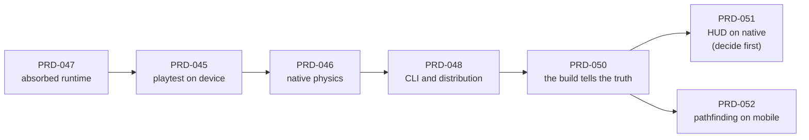

# Native / mobile PRDs — the sequence

**Status (2026-08-09):** Linux and Android-emulator starter artifact parity is proven.
[GitHub run 31313092745](https://github.com/jonit-dev/threenative/actions/runs/31313092745)
also executed iOS simulator/no-Xcode consumer, macOS and Windows successfully on current SHA
`e38439c`. Release run `31314171195` then passed all three desktop builders but failed the
Android clean-source build before publication; the missing SDL Java dependency is fixed and
locally re-proven at `aecd0a5`. Published prebuilt consumer distribution remains open.

Apple simulator evidence now exists through the hosted runner. Physical Apple hardware, real
mobile GPU/arm64 execution and performance evidence still do not. Do not turn simulator proof
into a physical-device or release-readiness claim.

| Proven | Open |
|---|---|
| Desktop framework absorption, 300 frames + screenshot on Linux/macOS/Windows | Published prebuilt desktop consumer distribution |
| Android framework-version parity at catalog Three 0.185.1 | Published runtime assets/checksum lock and clean-machine consumer build |
| Android device playtest with all fail-closed controls | Physical mobile hardware: no GPU, arm64 execution or frame-rate evidence |
| Normal public native physics API: Android + iOS simulator and negative controls; both Android ABIs compile | Physical arm64 hardware/performance |
| Web CLI parity plus all 25 packed-template scenarios | — |
| Scaffolded starter artifact: declared entry, texture + GLB on Linux and Android emulator | — |
| Current iOS simulator + macOS + Windows run on `e38439c` | — |
| Native HUD decision: no framework abstraction; game-authored Three.js source only | — |
| Platformer steering: browser, Linux desktop, and Android emulator | Navmesh pathfinding remains browser-only; no native backend |

Evidence: `docs/verification/PRD-047.md`, `docs/verification/PRD-045.md`,
`docs/verification/PRD-046.md`, `docs/verification/PRD-049.md`,
`docs/verification/PRD-050.md`, `docs/verification/PRD-051.md`, and
`docs/verification/PRD-052.md`. **Never summarize this folder as "mobile works" while the
right column has rows in it.**

**Roadmap position:** `ROADMAP.md` **Phase 3**. That work has already started and produced the
executed rows above; the remaining gates are the explicit physical-device and
published-distribution rows, not the old calendar phase label.

## The active sequence

| # | PRD | What it buys | State |
|---|---|---|---|
| 1 | [PRD-047](../done/PRD-047-mystral-runtime-absorption.md) | The runtime, absorbed as `packages/runtime-native`; render/lifecycle integration | **done** — Phases 0–5 closed on current cross-platform evidence; 6 split out |
| 2 | [PRD-045](../done/PRD-045-playtest-on-device.md) | The app can be *proven*, not just seen | **simulator/emulator pass** — physical mobile hardware remains open |
| 3 | [PRD-046](../done/PRD-046-physics-native.md) | Native Rapier behind a coarse host-neutral ABI | **in progress** — implementation contract repaired; PRD-048 owns the clean consumer gate |
| 4 | [PRD-048](../done/PRD-048-native-distribution.md) | A user with no C++ toolchain ships a game | **in progress** — web/Linux/source-Android proven; prebuilt consumer + Apple/Windows open |
| 5 | [PRD-049](../done/PRD-049-physics-parity-verification.md) | Measured web/host/device agreement through the shared physics API | **done** — browser, linked Rust, and Android x86_64 observable parity proven; broader platform claims remain open |
| 6 | [PRD-050](../done/PRD-050-native-build-parity.md) | The native artifact is the game the author wrote, or it refuses to build | **done** — Linux desktop + Android emulator executed; iOS packaging-only |
| 7 | [PRD-051](../done/PRD-051-native-ui-layer.md) | A decision on how a HUD reaches native at all | **done** — candidate A failed; D binds, so no native HUD abstraction ships |
| 8 | [PRD-052](../done/PRD-052-navigation-on-mobile.md) | The navmesh gate PRD-046 opened and nobody owned | **done** — template steering passes browser + Android device playtests; navmesh stays browser-only |
| — | [PRD-044](../done/PRD-044-native-render-adapter.md) | Superseded React Native host/package proposal | **archived** — do not execute |

**PRD-050 closed the fail-open artifact divergences.** Native builds now use a declared
portable entry, reject unsupported graphs, and stage `public/` on every target. The durable
proof is the scaffolded starter on Linux and the Android emulator, with missing-asset
controls. PRD-051 deliberately closed without a native HUD system. PRD-052 deliberately
keeps Recast browser-only and gives the shipped platformer a proved portable steering path.

**PRD-048 is last in the diagram but not gated behind PRD-046.** It depends on PRD-047
Phases 2 and 5, not on physics. Its Phase 0 — deleting 1,159 lines of dead Mystral demo
tooling — is the cheapest item in this folder and frees native LOC headroom that PRD-046
will need, so it is a reasonable thing to run first regardless of sequence.

**PRD-047 Phase 4 and PRD-046 describe the same native-physics work.** PRD-047 is the
summary and the authority; PRD-046 is the executable spec. If they disagree, PRD-047 wins.

**Why physics is last, not first.** It is the most valuable artifact and the most dangerous
to ship unproven: its failure mode is a subtly wrong simulation, invisible to a screenshot.
PRD-045 builds the instrument before PRD-046 builds the thing that most needs measuring.
PRD-044 took a deliberate, time-boxed exception to the playtest rule because rendering
failures *are* visible, and PRD-047 Phase 2 inherits it; that exception does not extend to
physics.

**Why 0a is not a PRD.** `CHARTER.md:364` — a Phase 0 spike ships "no template, no CLI, no
docs, no framework." It is a throwaway app outside the repo and only its answer merges.
Keeping that framing costs zero charter amendments and zero package slots.

## Decisions now binding

1. **The package boundary.** Private examples are reported separately. **Reversed
   2026-08-08:** the runtime is absorbed as `packages/runtime-native/`, taking framework
   packages 5 → 6. It is the only new package — there is no `@threenative/native`, and the
   ten-package split proposed by the runtime's own PRD is rejected under rule 5. Native
   source is excluded from the 15,000-line framework review trigger and measured against
   its own 50,000-line review trigger.
2. **Web is unchanged.** The runtime serves desktop and mobile only. The browser keeps
   Vite + `three/webgpu`.
3. **No hardware exists (2026-08-08).** Android emulator evidence closes JS/runtime
   plumbing only. Real GPU drivers, arm64 physics and phone performance stay OPEN.
4. **No `@threenative/physics-native`.** Native physics is a build-condition backend inside
   the existing `@threenative/physics` package, with the Rust library compiled into
   `packages/runtime-native`. No additional package is justified, and the transport is a
   host-neutral C ABI, not JSI.
5. **Native LOC has its own review trigger.** `nativeRuntimeLoc: 50,000` covers
   `packages/runtime-native` excluding `third_party/`. Crossing it requires PRD
   justification and a kill-switch pass; tracking any `third_party/` file is a hard failure.

## A note on this folder

This subfolder groups one execution sequence; it does not route around a PRD-count limit.
The Charter defines no numerical documentation or active-PRD budget. `pnpm budgets` reports
the direct `docs/PRDs/` file count for visibility only.
