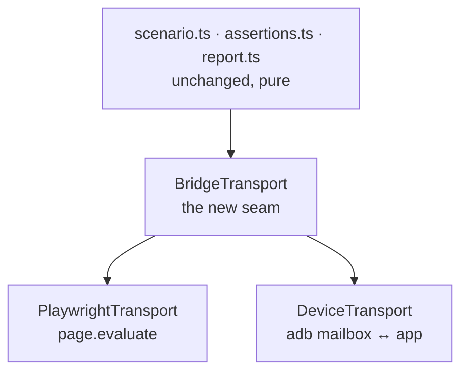

# PRD-045 — Playtest on device

**Status: DONE — 2026-08-11.** All eight criteria MET. Phase 4's executed iOS simulator
evidence is run
[`31446340434`](https://github.com/jonit-dev/threenative/actions/runs/31446340434) on
`iPhone 17 Pro` / `SimRuntime.iOS-26-2`; see `docs/verification/PRD-045.md`.

**This is simulator evidence, not device evidence.** PRD-056 physical qualification is
unaffected, and nothing here licenses an arm64, Metal-driver, thermal or battery claim.

**Correction, 2026-08-10:** an Apple machine *is* available — the free hosted `macos-15`
runner — and it has been executing this scenario and all its controls green since 2026-08-09.
It selected an **Apple Vision Pro (visionOS)** simulator, so the evidence does not satisfy a
criterion that says *iOS* simulator. The block is no longer "no Apple machine"; it is "the
executed simulator was not an iOS one." PRD-065 Phase 0 fixed the selection; criterion 7 closes
on the first post-fix report whose `simulator.runtime` names `SimRuntime.iOS-*`.

**Operator hardware limitation (2026-08-08): no Apple machine is available.** No Xcode, no
`xcrun`, no simulator, no physical iOS device. This blocks *execution evidence only* — iOS
implementation work continues normally and merges on its contract tests. Android and Linux
lanes are unaffected and keep their executed-evidence requirement. Do not mark criterion 7
or Phase 4 closed, and do not soften the requirement to fit the hardware; the evidence is
deferred until an Apple machine exists, not waived.
The transport targets the absorbed `packages/runtime-native` runtime rather than React Native;
its fail-closed scenario semantics and negative controls are unchanged.

`docs/verification/PRD-045.md` records the emulator run: `device-smoke.playtest.json` passes
unchanged in Chromium and on `emulator-5554` over the adb mailbox transport, and all three
Phase 3 negative controls plus the unsupported-network control produce their required non-zero
exits. The wrong-value control found a real `present`/`minProjectedPixels` evaluator bug before
it passed, which is the control doing its job. The iOS driver and fail-closed contract tests
exist, but **no simulator execution evidence exists on this Linux host.**

**The emulator is fully sufficient for this PRD, unlike PRD-044.** Everything here is a
JS-environment and host-tooling question: can the runner reach the bridge, does an
assertion evaluate, does a broken assertion fail. None of it depends on the GPU driver, so
the caveat PRD-044 §0 carries does not apply. `adb` behaves identically against an emulator
and a phone. **Say this explicitly in the result** rather than letting a reader assume the
PRD-044 caveat leaked down the chain.

**Complexity: 8 → HIGH mode.** (new transport abstraction +2, external tooling — `adb` and
`xcrun simctl` +2, cross-process/async lifecycle +2, touches the one package whose whole
value is fail-closed correctness +2.) HIGH means an automated checkpoint after every phase.

**Depends on:** PRD-047 (the app must run on the absorbed runtime before it can be observed);
PRD-033 (playtest semantic depth — the assertion surface this carries across).
**Blocks:** PRD-046 (native physics must not ship without a device proof mechanism).
**Charter authority:** `CHARTER.md` §3 (win criterion 3, "ships to iOS"), `AGENTS.md`
"Verification honesty, and how you prove it" — **the fail-closed rule is the entire subject
of this PRD**. No new package: this extends `packages/playtest`. No §10 amendment needed.
**Area:** `OPPORTUNITY-AREAS.md` #2 "Agent self-verification", score **90** — the
highest-scored area in the document, and the one the doc says *"is not where the remaining
effort has gone."*

---

## 0. Why this comes before physics, not after

The instinct is to build `physics-native` first — it is the crown jewel (`CHARTER.md` §7)
and the only thing nobody else ships. **Build the observer first anyway.**

`physics-native` is 4–8 weeks of numerical binding work across two platforms, where the
failure mode is not a crash but a *subtly wrong simulation*: drift, tunnelling, a mismatched
timestep, a transform buffer read one frame stale. Those are invisible to a screenshot and
invisible to a frame counter. Shipping it with manual-only proof reproduces exactly the
failure `AGENTS.md` opens with — v1's harness reporting green while asserting nothing.

PRD-044 §4 took a deliberate, time-boxed exception to the playtest rule because rendering
failures *are* visible to a screenshot; PRD-047 Phase 2 inherits that exception for its
screenshot-gated render proof. Physics failures are not visible. **This PRD closes the
exception before the exception becomes the norm.**

| Roadmap axis | Expected movement | Why |
|---|---|---|
| Ships working | **0 on the pair** | §3 gives the harness to the vanilla arm too. It wins no comparison — a scoring artifact, not a reason to underinvest (`OPPORTUNITY-AREAS.md` #2) |
| Does what vanilla can't | **+small** | No vanilla Three.js project can assert what its game did on a phone |
| Survives the platform | **+2–4** | Turns "it launched" into "it behaved" |

---

## 1. Context

**Problem:** the assertion surface already works. The *transport* is Playwright, and
Playwright does not exist on a phone.

### Files analyzed

`packages/playtest/src/three/bridge.ts`, `packages/playtest/src/runner/bridgeClient.ts`,
`packages/playtest/src/runner/browser.ts`, `packages/playtest/src/runner/runner.ts`,
`packages/playtest/src/runner/cli.ts`, `packages/playtest/src/runner/config.ts`,
`packages/playtest/src/protocol.ts`, `packages/playtest/src/scenario.ts`,
`packages/playtest/src/diagnostics.ts`, `packages/core/src/playtest.ts`.

### 1.1 What already ports for free

The bridge installs a global on `globalThis` (`three/bridge.ts:44`) and nothing about it is
DOM-dependent. Scenario parsing, `rejectUnknownKeys`, the fail-closed validators, the
assertion evaluators and the report format are all pure. **The semantic assertions —
`movement`, `camera`, `visibility`, `states` — are the valuable half and they port
unchanged.**

### 1.2 What does not

| Concern | Today | On device |
|---|---|---|
| Reaching the bridge | `page.evaluate` (`bridgeClient.ts:215`) | no page, no evaluate |
| Waiting for install | `page.waitForFunction` (`bridgeClient.ts:62`) | same problem |
| Launching the app | Playwright + `--server-command` | `adb shell am start` / `xcrun simctl launch` |
| Console capture | CDP | `adb logcat` / `os_log` |
| Screenshots | `page.screenshot` | `adb exec-out screencap` / `simctl io screenshot` |
| Network assertions | CDP | **out of scope — say so, do not fake it** |

---

## 2. Solution

Extract the transport behind an interface. Playwright becomes one implementation; a device
transport becomes the second. Everything above the transport is untouched.

The app side is a small addition to the existing bridge: when a `TN_PLAYTEST_ENDPOINT` is
present, it serves the same call surface the `page.evaluate` path serves today. Same
protocol, same `protocol.ts`.

**The Android transport is an `adb` mailbox, not a socket.** The shipped driver polls a
request/response mailbox over `adb` rather than opening a WebSocket, because it needs no
listening port inside the app and no host-reachable network on the emulator. The seam is
unchanged; only this implementation differs from the sketch above. The HTTP transport
remains for hosts that can reach the app directly, and the Android HTTP client is still a
stub — say so rather than implying two working paths.

### 2.1 Explicitly rejected

- **A second scenario format for device.** One scenario file runs on both, or this PRD has
  failed. A device-only dialect is how two harnesses drift into one lying.
- **Relaxing an assertion because device makes it hard.** `TN_PLAYTEST_BRIDGE_MISSING`
  failing closed is the harness being right (`AGENTS.md`). Network assertions that cannot
  be observed on device must **fail with an explicit unsupported-on-this-target error**,
  never silently skip. A skipped assertion that reports pass is the exact v1 failure.
- **Device execution in CI.** Out of scope. Say so in the docs rather than implying it.

---

## 3. Phases

### Phase 0 — the transport seam, web unchanged — **CLOSED**

Extract `BridgeTransport` from `bridgeClient.ts`. Playwright implementation only.
**Gate:** every existing playtest scenario in the repo passes byte-identically, including
the four sealed genre proofs and the platformer consumer gate. Zero behaviour change is the
phase.

### Phase 1 — device transport, app side — **CLOSED**

`TN_PLAYTEST_ENDPOINT` support in `three/bridge.ts` and `core/src/playtest.ts`.
**Gate:** a unit test drives the device transport against an in-process fake and gets
identical observations to the evaluate path. `device-playtest.spec.ts` (5 tests) and
`device-transport.spec.ts` (3 tests) pass.

### Phase 2 — Android driver — **CLOSED (emulator)**

`adb`-based launch, logcat console capture, `screencap` screenshots.
**Gate:** a scenario file that passes in Chromium passes unmodified on the Android emulator,
and the run is recorded dated in `docs/verification/`. Met on `emulator-5554` with a nonblank
1080×2400 screenshot; physical hardware remains open and is PRD-047's debt, not this PRD's.

### Phase 3 — the negative controls, which are the point — **CLOSED (emulator)**

**Gate — all three must hold on device, not just on web:**

1. A scenario asserting a deliberately wrong value **fails**, exit code 1.
2. A scenario run against a build with the bridge removed fails
   `TN_PLAYTEST_BRIDGE_MISSING`, exit code 2 — it does not pass with zero assertions.
3. A scenario containing a misspelled assertion key is **rejected**, not dropped
   (`rejectUnknownKeys`, `scenario.ts`).

A device harness that cannot fail is worse than no device harness. All three produced their
required exits on `emulator-5554`, alongside `TN_PLAYTEST_UNSUPPORTED_ON_TARGET` for the
network assertion. Scenario files: `examples/native-smoke/playtests/device-smoke*.json`.

### Phase 4 — iOS — **IMPLEMENTED; EXECUTION BLOCKED ON HARDWARE**

`xcrun simctl` for the simulator, physical device via `devicectl`. Simulator is acceptable
evidence here because the question is JS-environment behaviour, not GPU driver behaviour —
**state that distinction explicitly in the result, since it is the opposite of the rule
0a applies to rendering.**

The operator has no Apple machine as of 2026-08-08, so nothing here can be run. Keep
changing the iOS driver and its fail-closed contract tests as the work requires; the only
thing that waits is the executed simulator run. When an Apple machine becomes available,
this phase is one command against an already-implemented driver.

### Phase 5 — docs and CLI surface — **CLOSED**

`--target android|ios|browser` on the CLI. Document plainly that network assertions are
unsupported on device targets and that CI does not run device lanes.

The CLI routes all three targets, the public playtest documentation names the unsupported
device assertions, and default CI excludes device execution. Focused driver/CLI tests are
recorded in `docs/verification/PRD-045.md`.

---

## 4. Verification strategy

**Primary negative control: the browser arm.** Phase 0 changes the transport under every
existing scenario. If a single browser assertion result changes, the extraction is wrong.

**Cross-target equivalence is the acceptance test.** The same scenario file, the same
starter, run on Chromium and on Android, must produce the same pass/fail verdict for every
semantic assertion. A divergence is either a real device bug — valuable — or a harness bug —
critical. Both must be recorded, neither may be waved through.

**Honesty note for whoever files this:** it is trivially easy to make a device harness that
reports green. Every phase gate above is a *failure* the harness must produce on demand.
If you cannot make it fail, you have not proven it can pass.

---

## 5. Acceptance criteria — consumer-scoped

State on 2026-08-08, evidence in `docs/verification/PRD-045.md`:

| # | Criterion | State |
|---|---|---|
| 1 | One scenario file, unmodified, passes on Chromium and on the Android emulator; both runs dated in `docs/verification/` | **MET** |
| 2 | All three Phase 3 negative controls produce the correct non-zero exit code **on device** | **MET** |
| 3 | Every pre-existing browser playtest passes unchanged, no baseline edited | **MET** |
| 4 | Network assertions on a device target fail with an explicit unsupported error; no code path skips an assertion and reports pass | **MET** |
| 5 | `pnpm budgets` green with **no new package** and no hard invariant violated | **MET** — `runtime-native` is PRD-047's package, not this one's |
| 6 | `pnpm typecheck && pnpm lint && pnpm test` green | **MET** after commit `51af406` serialized the workspace test command |
| 7 | The same scenario file passes on the iOS simulator, with the same three negative controls | **MET, 2026-08-11** — run `31446340434`, `iPhone 17 Pro` / `SimRuntime.iOS-26-2`, unchanged scenario plus four controls at their exact exit codes. An earlier green lane had run on visionOS; PRD-065 Phase 0 pinned the runtime and this is the first post-fix run |
| 8 | `--target android\|ios\|browser` on the CLI, with device-unsupported assertions and CI exclusion documented | **MET** — Phase 5 |

Criterion 7 was the whole remaining scope and is now met on an executed iOS simulator; PRD-046's Android gate reads criteria 1–4, which are met, so its
Android physics work is not blocked on iOS.

---

## 6. Kill conditions

- The device transport cannot reach the bridge without modifying scenario semantics → stop;
  a second dialect is not an acceptable fallback.
- Phase 3 cannot produce all three failures on demand → the harness is not fail-closed and
  must not ship. Record it as unresolved.
- The seam extraction changes any browser result → revert; PRD-047's web-unchanged rule
  applies here identically.

## Budget justification

2026-08-10: PRD-045 owns the Android device-observer and playtest-transport slice of the
native `android/`, `scripts/`, and `tests/` areas. The current lane measurement is recorded in
`docs/verification/native-loc-trigger-2026-08-10.md`. The kill switch keeps these lines because
they are the fail-closed mechanism that observes the real APK and its negative controls; the
plain alternative is an unproven native claim. No native gesture abstraction or second input
model was added, and the 50,000-line trigger remains unchanged.
