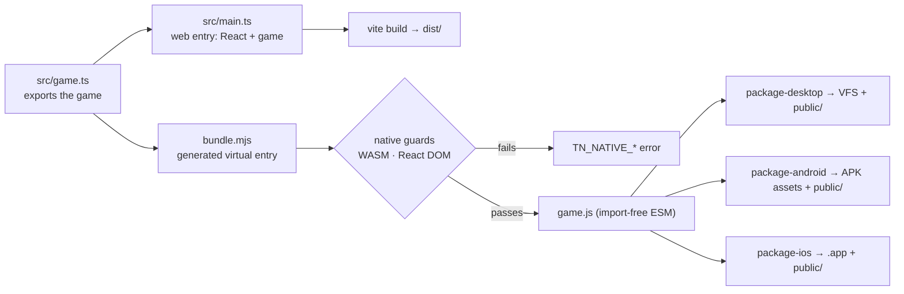

# PRD-050 — the native build tells the truth: entry contract, no silent drops, assets everywhere

**Status: DONE (2026-08-09).** Linux desktop and the Android x86_64 emulator executed;
iOS remains packaging-and-contract only. Evidence: `docs/verification/PRD-050.md`.

PRD-047 proved the runtime executes our bundle. PRD-048 built the path from that bundle to a
shipped artifact. Neither asked the question this PRD asks: **is the thing the native build
produces the same game the author wrote?**

It is not. Three divergences, found by inspecting `packages/runtime-native/scripts/bundle.mjs`,
`packages/create-threenative/src/build.ts` and the three shipped templates, mean an author
who follows the starter template gets a native build that silently differs from the web build
they tested. **All three fail open** — no error, no warning, no gate — which is the exact
failure mode `/AGENTS.md` names as the most dangerous one in this repo.

**This PRD does not add a UI system and does not add native navigation.** It makes the native
build either produce the author's game or refuse to build. What a HUD looks like on native is
PRD-051; what pathfinding does on mobile is PRD-052. Those exist because this PRD refuses to
smuggle a design decision into a build fix.

**Depends on:** PRD-047 Phase 2 (the import-free ESM bundle), PRD-048 Phases 1–2 (the
`threenative build` CLI and the template scripts that call it).
**Blocks:** any claim that ThreeNative is write-once. Today "the same source runs on web and
native" is false for every template that ships a HUD or an asset.

**Charter authority:** `CHARTER.md` §6a (`--target` stays a flag on `build`; this PRD adds no
command), §10 (budgets — Phase 3 is the only phase that can move native LOC).
**Area:** `OPPORTUNITY-AREAS.md` #7.

**Complexity: 7 → HIGH mode.** (10+ files +3, multi-package +2, new mobile asset subsystem
spanning JS packagers and the C++ hosts +2.) HIGH means an automated checkpoint after every
phase and a manual checkpoint on Phases 3 and 4, which change what is on screen.

---

## 1. Context

**Problem:** `threenative build --target desktop|android|ios` produces an artifact that is
missing code and data the same source produces on web, and reports success.

### Files analyzed

`packages/runtime-native/scripts/bundle.mjs`, `scripts/package-desktop.mjs`,
`scripts/package-android.mjs`, `scripts/package-ios.mjs`, `scripts/install-prebuilt.mjs`;
`packages/create-threenative/src/build.ts`, `__tests__/build.spec.ts`;
`packages/create-threenative/templates/{minimal,starter,platformer}/src/main.ts` and their
`package.json`; `packages/core/src/game.ts`, `src/renderer.ts`, `src/assets.ts`;
`packages/ui/src/GameCanvas.tsx`; `packages/runtime-native/src/cli/main.cpp`,
`src/runtime.cpp`, `src/platform/android_main.cpp`, `include/mystral/vfs/embedded_bundle.h`,
`android/app/build.gradle.kts`; `examples/native-smoke/src/`;
`docs/PRDs/native/done/PRD-047-mystral-runtime-absorption.md`,
`PRD-048-native-distribution.md`, `docs/verification/PRD-048.md`.

### 1.1 What the inspection found

Severity is "what the author ships without knowing", not "how ugly the code is".

| # | Divergence | Web | Native | Severity |
|---|---|---|---|---|
| **D1** | The bundler **truncates the author's entry file** at a string literal | `src/main.ts` mounts React at `const root = document.getElementById("root");` and renders `App` — HUD, menus, pause screen | `bundle.mjs:203-205` does `nativeSource.slice(0, indexOf('const root = document.getElementById("root");'))`. Everything from that line to EOF is deleted from the build | **Critical** — the entire UI layer is absent from every native artifact, silently. The author's own `pnpm test` (web playtests) still passes |
| **D2** | The game's start call is found by **string match**, not by contract | the React mount calls `game.start()` via `GameCanvas` (`packages/ui/src/GameCanvas.tsx:20`) | `bundle.mjs:211-217` replaces the literal `void game.start();`, else appends a start call only when `/^const game = defineGame/m` matches and no `game.start(` appears | **Critical** — rename the variable, write `await game.start()`, or split `main.ts` in two, and the native artifact either never starts or keeps a React DOM call. Both fail open |
| **D3** | `public/` assets never reach mobile | Vite serves `public/**` at `/**`; `createAssetLoader` resolves `/models/x.glb` | desktop passes `--assets <cwd>/public` (`build.ts:127`) into the embedded VFS. **Android copies only `main.js`** (`package-android.mjs:42`); **iOS stages only the bundle** (`package-ios.mjs:56`) | **Critical** — a game with one texture works on desktop and renders an empty scene on both phones |
| **D4** | Desktop asset delivery is implemented but **never proved** | — | `main.cpp:560` `makeBundlePath` normalizes include-dir-relative paths into the VFS; `runtime.cpp:1498` serves them to `fetch`. `examples/native-smoke` loads **no asset of any kind**, so no gate has ever read a texture or a GLB out of a native artifact | **High** — D3's fix has no reference implementation to copy until this row is closed |
| **D5** | The WASM guard runs on mobile only | — | `build.ts:150` calls `assertMobileBundleCompatible` for `ios`/`android` only; the desktop path skips it, and no check exists for React DOM on any target | **Medium** — after D1 is fixed the React mount no longer disappears, so something must fail the build instead of shipping a bundle that calls `createRoot` into a stub |

### 1.2 Why the existing gates did not catch any of it

- `packages/create-threenative/__tests__/build.spec.ts:74` asserts each template's
  `package.json` **contains the string** `"threenative build --target desktop"`. It never runs
  a native build.
- Template `test` scripts are web playtests against `127.0.0.1:4173`. No template runs a
  playtest against a native artifact.
- `examples/native-smoke` is the only subject any native gate has ever built. It has no UI and
  no assets, so it cannot observe D1, D3 or D4.

**This is the "toy proof" anti-pattern with a name and a line number.** The capability
(`build a shipped game for native`) has only ever been proved on the one input that needs none
of it.

---

## 2. Solution

**Approach:**

- **Delete source surgery entirely.** The bundler stops reading and rewriting the author's
  file. The native entry becomes a declared module that **exports the game**; the bundler
  generates a two-line virtual entry that imports it and starts it.
- **Split the templates the way the platforms already are.** `src/game.ts` defines and
  exports the game (portable, both targets). `src/main.ts` becomes the *web* entry: it imports
  `src/game.ts` and mounts React. Native never enters the React module graph, so nothing has
  to be dropped.
- **Fail closed on anything left that cannot run natively.** One guard, on every native
  target, extending the existing `assertMobileBundleCompatible` shape: WASM (mobile only, as
  today), plus React DOM / `document.getElementById` mounts (all native targets), each with a
  named `TN_NATIVE_*` code that tells the author where to move the code.
- **Ship `public/` to every target.** Desktop already does; Android and iOS get the same
  directory staged into their asset containers, and the hosts resolve `/path` fetches out of
  them exactly as the desktop VFS does.
- **Prove it on a real template, not on `native-smoke`.** The proving subject is the scaffolded
  **starter** — React HUD, physics, a texture and a GLB in `public/` — built for desktop and
  run for 300 frames with a playtest that asserts the asset is on screen.

**What is deliberately not solved here:** the HUD does not render on native after this PRD.
It fails the build with `TN_NATIVE_WEB_ONLY_UI` and a message pointing at PRD-051. That is a
worse experience than today's silence for exactly one person — the one who would otherwise
have shipped a HUD-less binary and not known.



**Key decisions:**

- [x] **The native entry is `src/game.ts`, overridable via `"threenative": { "nativeEntry": ... }`
      in the project `package.json`.** Missing file → `TN_NATIVE_ENTRY_MISSING`. No default
      fallback to `src/main.ts`: a silent fallback is how D1 happened.
- [x] **The entry must default-export a started-capable game.** The generated entry is
      `import game from "<nativeEntry>"; void game.start().catch(...)`. A module with no default
      export fails at build time, not at frame 1.
- [x] **The `nativePrelude` banner stays.** It shims `document.getElementById` for Three.js and
      emits the `TN_NATIVE_SMOKE_*` markers PRD-047's gates read. It is a runtime shim, not
      source rewriting, and removing it breaks existing green gates.
- [x] **No new package, no new CLI command, no new C++ tree.** Phase 3 adds host code inside
      `packages/runtime-native/src/`, which is where the budget already accounts for it.
- [x] **Reuse, do not reinvent:** `assertMobileBundleCompatible` becomes
      `assertNativeBundleCompatible` with a target argument; `makeBundlePath`/`normalizeBundlePath`
      are the path rules mobile copies rather than inventing a second convention.

**Data changes:** one optional `threenative.nativeEntry` field in the project `package.json`.
No schema, no migration.

---

## 3. Sequence flow

```mermaid
sequenceDiagram
    participant U as author
    participant CLI as threenative build
    participant B as bundle.mjs
    participant P as package-<target>.mjs
    participant H as native host
    U->>CLI: pnpm build:desktop
    CLI->>CLI: read package.json → nativeEntry (default src/game.ts)
    alt entry missing
        CLI-->>U: TN_NATIVE_ENTRY_MISSING: src/game.ts
    end
    CLI->>B: bundle(project, nativeEntry)
    B->>B: generate virtual entry (import + start); no source rewriting
    B-->>CLI: game.js
    CLI->>CLI: assertNativeBundleCompatible(game.js, target)
    alt react-dom / DOM mount present
        CLI-->>U: TN_NATIVE_WEB_ONLY_UI → see PRD-051
    else WASM present and target is mobile
        CLI-->>U: TN_NATIVE_WASM_ON_MOBILE → see PRD-052
    end
    CLI->>P: --bundle game.js --assets public --output …
    P->>P: stage bundle + public/** into the target container
    P-->>U: artifact
    U->>H: run artifact
    H->>H: fetch("/textures/x.png") → VFS / APK assets / .app resources
```

---

## 4. Integration Ledger

Filled with real `file:line` during implementation. A `TBD` at phase end means the phase is
incomplete.

| # | New thing | Live caller (`file:line`, non-test) | Replaces | Old path removed? | Negative control |
|---|-----------|-------------------------------------|----------|-------------------|------------------|
| 1 | generated virtual native entry in `bundle.mjs` | `create-threenative/src/build.ts:104-126` `bundleNative()` — every native target | source truncation + `void game.start();` match | yes | renamed `arena` fixture still builds and starts |
| 2 | `nativeEntry` resolution + `TN_NATIVE_ENTRY_MISSING` | `create-threenative/src/build.ts:86-101,138` | implicit `--entry src/main.ts` | yes | missing `src/portable.ts` returns the named code |
| 3 | `src/game.ts` in all three templates | each `src/main.ts` imports it; each manifest declares it | monolithic `src/main.ts` | yes | three web output trees are byte-identical |
| 4 | `assertNativeBundleCompatible(bundle, target)` | `create-threenative/src/build.ts:56,141` | mobile-only helper | yes | portable `react-dom/client` fixture returns `TN_NATIVE_WEB_ONLY_UI` |
| 5 | `--assets` in all packagers + host resolution | `create-threenative/src/build.ts:151,168,184`; `runtime.cpp:1537,1589` | desktop-only delivery | n/a | final starter renders both assets on desktop/Android; omitted assets reject startup |
| 6 | scaffolded-starter desktop verifier and Linux lane | starter `test:native`; `.github/workflows/native-platforms.yml` `starter-linux` | toy-only native proof | n/a | one-color/missing-cyan controls and no-assets artifact fail closed |
| 7 | template native gate `templates-native.spec.ts` | `pnpm test` in `packages/create-threenative` | manifest string check as behavioral proof | yes | detached pre-change bundle lost its start path and mount |

### Reachability

**How is this reached?** Entry point: `pnpm build:desktop|android|ios` in a scaffolded
project → `create-threenative/dist/threenative.js` → `build.ts` → `bundle.mjs` →
`package-<target>.mjs` → the host binary. Pre-existing files edited: `build.ts`,
`bundle.mjs`, both mobile packagers, all three templates.

**User-facing?** YES for D1/D3 (what is on screen) — manual checkpoints on Phases 3 and 4.

**Full flow:** author runs `pnpm build:desktop` → CLI reads the declared native entry →
bundler emits an import-free ESM file with no source rewriting → guards run → packager stages
bundle + `public/` → the artifact starts, loads its texture, and either renders the HUD
(after PRD-051) or refused to build.

**Replaces:** `bundle.mjs:203-217` (string surgery) and `assertMobileBundleCompatible`; both
removed or reduced to delegation inside the phase that replaces them.

---

## 5. Phases

### Phase 0 — the gate that proves the bug, observed red

**Outcome:** the detached pre-change bundler was observed to remove the web mount, omit a
reliable start path and reject its own output for a runtime import. The durable fixture now
asserts the portable graph, generated start, UI exclusion and asset propagation.

**Files (max 5):**
- `packages/create-threenative/__tests__/templates-native.spec.ts` — NEW: scaffolds `starter`
  without install, runs `bundleNative` against it, asserts the bundle contains the HUD module
  and that `public/**` is staged.
- `packages/create-threenative/__tests__/build.spec.ts` — EDIT: the manifest-string assertion
  at line ~74 stays but is labelled as manifest-shape only, so it stops reading as coverage.
- `packages/create-threenative/templates/starter/public/` — EDIT: add the one texture the
  render layer already expects, so an asset exists to lose.

**Implementation:**
- [x] Assert the native bundle contains the portable marker and excludes the web-only marker.
- [x] Assert every packager receives `public/`.
- [x] Run the detached pre-change bundler and paste the observed red into the evidence record.

**Wiring:** the spec runs under the package's existing `test` script — no new runner.

**Tests required:**

| Test file | Test name | Assertion | Negative control (observed red) |
|---|---|---|---|
| `templates-native.spec.ts` | `keeps the portable graph and generated start while excluding the web entry` | portable/start markers present; UI marker absent | pre-change bundle had no reliable start path |
| `templates-native.spec.ts` | `passes public assets to every native packager` | packager arg list includes `public` for desktop, android and ios | pre-change Android/iOS calls omitted `--assets` |

**Revert check:** n/a — this phase exists to observe red. A phase-0 gate that passes on the
unmodified tree is a failed phase and must be rewritten, not accepted.

**User verification:** run `pnpm --filter create-threenative test`; two tests fail, and their
messages describe D1 and D3 in plain words.

---

### Phase 1 — the entry contract replaces the string surgery

**Outcome:** the native bundle contains everything the declared entry imports, and nothing is
deleted from any source file.

**Files (max 5):**
- `packages/runtime-native/scripts/bundle.mjs` — EDIT: delete the truncation and the
  `void game.start();` match; generate a virtual entry module instead.
- `packages/create-threenative/src/build.ts` — EDIT: read `threenative.nativeEntry`
  (default `src/game.ts`), throw `TN_NATIVE_ENTRY_MISSING`, pass it to the bundler.
- `packages/create-threenative/templates/starter/src/game.ts` — NEW: `defineGame` + `export default`.
- `packages/create-threenative/templates/starter/src/main.ts` — EDIT: import the game, keep
  only the React mount.
- `packages/create-threenative/templates/starter/package.json` — EDIT: add
  `"threenative": { "nativeEntry": "src/game.ts" }`.

Minimal and platformer repeat this split in the same phase only if they stay inside the
five-file cap; otherwise they are Phase 1b with the identical checklist.

**Implementation:**
- [x] `nativeEntryPlugin` keeps only the prelude banner; its `transform` hook is deleted.
- [x] The generated entry is `import game from "<abs entry>"; void game.start().catch(e => console.error("TN_NATIVE_START_FAILED:" + …))`.
- [x] A module with no default export fails the build with `TN_NATIVE_ENTRY_NO_DEFAULT`.

**Wiring:**
- [x] Caller edited: `build.ts` `bundleNative()` passes the resolved entry.
- [x] Old path: `bundle.mjs:203-217` **deleted**, not left behind a flag.
- [x] Ledger rows filled: #1, #2, #3.

**Tests required:**

| Test file | Test name | Assertion | Negative control |
|---|---|---|---|
| `templates-native.spec.ts` | `should start the game when the entry renames its game variable` | bundle contains a start call | rename to `const arena =` → still green; on `origin/main` the same fixture produces a bundle with no start call |
| `templates-native.spec.ts` | `should fail with TN_NATIVE_ENTRY_MISSING when the declared entry is absent` | rejects with the code | delete `src/game.ts` → red |
| `build.spec.ts` | existing web tree comparison | `cli-dist` still equals `vite-dist` for all three templates | patch one byte of the web entry → red |

**Revert check:** restore the truncation → `should keep the HUD in the native bundle` (Phase 0)
goes red again.

**User verification:** scaffold a starter, rename `game` to `arena` in `src/game.ts`,
`pnpm build:desktop` — the artifact still starts.

---

### Phase 2 — one fail-closed guard, on every native target

**Outcome:** a native build that cannot run the author's code says so, with a code and a
next step, instead of producing an artifact.

**Files (max 5):**
- `packages/create-threenative/src/build.ts` — EDIT: `assertMobileBundleCompatible` →
  `assertNativeBundleCompatible(bundle, target)`, called for desktop too.
- `packages/create-threenative/__tests__/build.spec.ts` — EDIT: extend the existing
  WASM-rejection test to the new signature.
- `packages/create-threenative/__tests__/templates-native.spec.ts` — EDIT: add the UI case.
- `docs/PRDs/native/PRD-051-native-ui-layer.md` — EDIT: record that the error points here.

**Implementation:**
- [x] Codes: `TN_NATIVE_WASM_ON_MOBILE` (today's message, renamed), `TN_NATIVE_WEB_ONLY_UI`
      (matches `react-dom`, `createRoot(`, `document.getElementById` outside the prelude).
- [x] Each message names the file to move the code into and the PRD that owns the gap.
- [x] The guard runs on the **produced bundle**, not on source, so it cannot be fooled by
      formatting.

**Wiring:** caller edited `build.ts` `buildNative()`, all four targets. Old path: the
mobile-only helper is deleted, not kept as an alias.

**Tests required:**

| Test file | Test name | Assertion | Negative control |
|---|---|---|---|
| `build.spec.ts` | `should reject a desktop bundle that mounts React` | rejects `/TN_NATIVE_WEB_ONLY_UI/` | a bundle with no React passes; observed by running both fixtures |
| `build.spec.ts` | `should still reject WASM on mobile` | rejects `/TN_NATIVE_WASM_ON_MOBILE/` | pre-existing behavior; must stay red for the WASM fixture |

**Revert check:** disable the guard → the React fixture builds an artifact, and the new test
goes red.

**User verification:** import `./ui/App.js` into `src/game.ts`, run `pnpm build:desktop`, read
the error, move it back, build succeeds.

---

### Phase 3 — `public/` reaches Android and iOS

**Outcome:** a game with a texture and a GLB renders them on desktop **and** on the Android
emulator, from the packaged artifact, with no network.

**Files (max 5):**
- `packages/runtime-native/scripts/package-android.mjs` — EDIT: accept `--assets`, stage
  `public/**` under `android/app/src/main/assets/game/`.
- `packages/runtime-native/scripts/package-ios.mjs` — EDIT: accept `--assets`, copy into the
  staged `.app`, and record the file list + per-file SHA-256 in the existing report JSON.
- `packages/create-threenative/src/build.ts` — EDIT: pass `--assets <cwd>/public` for android
  and ios, as desktop already does at line ~127.
- `packages/runtime-native/src/platform/android_main.cpp` (or the fetch resolver it shares in
  `src/runtime.cpp`) — EDIT: resolve a leading-slash fetch path to `asset://game/<path>` using
  the same normalization as `vfs::normalizeBundlePath`.
- `packages/runtime-native/tests/native-platform-workflow.test.mjs` — EDIT: assert the staged
  asset list for both mobile packagers.

**Implementation:**
- [x] Path rule stated once: `public/textures/x.png` → fetch `/textures/x.png` → VFS key
      `textures/x.png` on every target. No second convention.
- [x] A missing `public/` is not an error; an unreadable one is.
- [x] iOS stays packaging-only — no execution is claimed (no Apple hardware; see §6).

**Wiring:** caller edited `build.ts`; both packagers now receive what desktop receives.
Ledger row #5.

**Tests required:**

| Test file | Test name | Assertion | Negative control |
|---|---|---|---|
| `native-platform-workflow.test.mjs` | `should stage every public file into the APK assets` | staged list equals the `public/**` walk | remove one file from `public/` → red |
| `ios-packaging.test.mjs` | `should record a checksum per staged asset` | report lists each file with a SHA-256 | corrupt a staged file → checksum differs → red |
| `native-smoke` playtest | `should load a texture out of the packaged artifact` | the rendered frame is non-blank **and** the texture-loaded marker is logged | delete the staged asset from the artifact → the run fails rather than falling back |

**Revert check:** stop passing `--assets` → the desktop texture scenario (Phase 3's own gate,
which passes today only on desktop) goes red on Android.

**Manual checkpoint (HIGH):** screenshot the Android emulator run showing the texture.
Attach to `docs/verification/PRD-050.md`.

---

### Phase 4 — the proof runs on the real subject, not on `native-smoke`

**Outcome:** the scaffolded **starter** — the template a user actually gets — builds for
desktop, runs 300 frames, and a playtest asserts its assets are on screen.

**Files (max 5):**
- `packages/runtime-native/scripts/verify-starter-desktop.mjs` — NEW.
- `packages/create-threenative/templates/starter/package.json` — EDIT: `test:native` script.
- `.github/workflows/native-platforms.yml` — EDIT: add the Linux desktop template lane.
- `packages/runtime-native/docs/G1-desktop-host.md` — EDIT: record the new gate row.
- `docs/verification/PRD-050.md` — NEW: the evidence record.

**Implementation:**
- [x] Subject declaration, per the "hardest real subject" rule:
      **Proof subject:** scaffolded `starter` — React HUD (guarded), Rapier physics, one
      texture, one GLB.
      **Requirements this subject does NOT exercise:** native HUD rendering (PRD-051),
      navigation (PRD-052), arm64 GPU drivers and frame rate (open, no hardware).
- [x] The scenario asserts a movement or visibility fact, not just a non-blank frame.

**Wiring:** the lane runs in the existing native workflow; the template's own `test:native`
is what a user runs.

**Tests required:**

| Test file | Test name | Assertion | Negative control |
|---|---|---|---|
| `starter-desktop.test.mjs` + verifier | `should render the packaged starter for 300 frames` | exact markers + non-blank screenshot + cyan asset visible | no-assets artifact emits `TN_NATIVE_START_FAILED`; blank/missing-cyan fixtures reject |

**Revert check:** revert Phase 1 → this lane fails at the missing HUD guard or the missing
start call, not at a screenshot diff.

**Manual checkpoint (HIGH):** side-by-side of the web `pnpm dev` frame and the desktop
artifact frame at the same seed.

---

### Phase 5 — the record, and the contract other agents read

**Outcome:** the repo's own docs stop implying native parity that does not exist.

**Files (max 5):**
- `packages/runtime-native/AGENTS.md` — EDIT: the host-surface section gains the entry
  contract and the two `TN_NATIVE_*` codes.
- `docs/PRDs/native/README.md` — EDIT: table row for this PRD; move nothing to Proven that
  did not execute.
- `/AGENTS.md` — EDIT: the "Web and native are one codebase" section names `src/game.ts` as
  the portable entry.
- `docs/verification/PRD-050.md` — EDIT: final results, each gate with its observed red.
- `pnpm sync:agents` regenerates every `CLAUDE.md`.

**Wiring:** `pnpm sync:agents --check` in CI is the caller. Ledger rows #6, #7 closed.

---

## 6. Verification strategy

**Repo gate, every phase:** `pnpm typecheck && pnpm lint && pnpm test && pnpm budgets`.

**Negative controls — the table this PRD is judged on.** A pass with no observed red is
recorded UNVERIFIED.

| Gate | Observed red by |
|---|---|
| HUD present in the native bundle | running it on `origin/main` (Phase 0) |
| entry contract | deleting `src/game.ts`; renaming the game variable |
| web-only guard | a fixture importing `react-dom/client` |
| WASM guard | the existing `rapier_wasm` fixture |
| mobile asset staging | removing one file from `public/` |
| desktop/Android asset load | deleting the staged asset from the built artifact |
| template native lane | building without `--assets` |
| web output unchanged | patching one byte of the web entry |

**Integration proof (not satisfied by any test above), pasted, not summarized:**

```sh
# 1. Caller census — no orphan modules
grep -rn "assertNativeBundleCompatible\|nativeEntry" packages --include=*.ts --include=*.mjs \
  | grep -v "__tests__\|/tests/\|\.spec\.\|\.test\."

# 2. The string surgery is gone, not flagged off
grep -n "getElementById(\"root\")\|void game.start();" packages/runtime-native/scripts/bundle.mjs
# Expected: no hits

# 3. Every native target stages assets
grep -n -- "--assets" packages/create-threenative/src/build.ts packages/runtime-native/scripts/package-*.mjs
# Expected: desktop, android and ios

# 4. Revert check
git stash && pnpm --filter create-threenative test   # Phase 0 gates must go red
```

**Platform honesty.** Desktop Linux and the Android emulator execute. **iOS is
packaging-and-contract only — no Apple hardware exists (2026-08-08, unchanged).** Windows and
macOS desktop lanes stay open exactly as PRD-048 leaves them. No row in
`docs/PRDs/native/README.md` moves to Proven on the strength of this PRD alone.

---

## 7. Acceptance criteria

Consumer-scoped. Each one is false today.

- [x] A scaffolded starter built with `pnpm build:desktop` **starts and renders its packaged
      texture**, proved by a playtest against the artifact, not by a bundle grep.
- [x] An author who renames the game variable, uses `await game.start()`, or splits the entry
      across files **still gets a working native artifact** — or a named error, never a silent
      one.
- [x] An author who imports web-only UI into the portable entry **cannot produce a native
      artifact**; the error names the file and PRD-051.
- [x] A game whose `public/` holds a texture and a GLB **shows both on the Android emulator**.
- [x] The web build output for all three templates is **byte-identical to today's**.
- [x] Nothing in the repo claims iOS execution, arm64 GPU behavior, or frame-rate parity.

**Integration gates (unchecked = not done):**

- [x] Integration Ledger has zero `TBD` cells; every live caller is a non-test `file:line`
- [x] Caller census pasted; every new symbol has a non-test consumer
- [x] Revert check passed: reverting Phase 1 turns a pre-existing gate red
- [x] `bundle.mjs`'s truncation and start-string match are **deleted**; no behavior has two
      live implementations
- [x] Every gate in §6 has an observed red recorded in `docs/verification/PRD-050.md`
- [x] The capability was proved on the scaffolded starter; the gaps it does not exercise are
      listed with the PRD that closes each

---

## 8. Out of scope, with owners

| Gap | Why not here | Owner |
|---|---|---|
| A HUD that renders on native | a UI system is a design decision, not a build fix; smuggling it in here is how PRDs stop being reviewable | **PRD-051** |
| Pathfinding on mobile | `recast-navigation` is WASM; the fix is a native library or a mobile-safe template path | **PRD-052** |
| Published prebuilt runtime, clean-machine consumer build | already owned and already open | PRD-048 Phase 3 |
| Physics web/native behavioral parity | already owned | PRD-049 |
| iOS execution, physical hardware, frame-rate parity | blocked on hardware, not on work | PRD-045 / PRD-048 |

---

## 9. Budget review and kill switch

`pnpm budgets` reports every hard budget green and the existing native-runtime review
trigger at 53,020/50,000 LOC (+3,020). The trigger is not routed around or raised.

The kill-switch pass kept only code reached by the executed starter proof: asset staging and
resolution for each packager, the entry/start contract, and the V8/QuickJS/WebGPU/audio host
fixes required for that unchanged starter to reach 300 frames. Temporary diagnostics were
removed. The old source-truncation and start-string paths were deleted, no second runtime or
package was added, and the platformer template was reduced to the hard 1,200-LOC ceiling.
