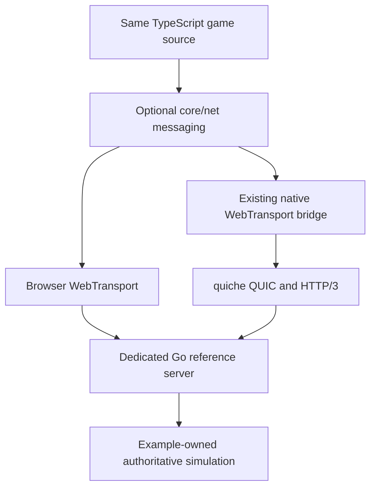

# PRD-359 — players on every platform share one multiplayer transport

**Status: NOT STARTED — READY FOR EXECUTION, 2026-09-05.** Implementation not started.
The owner selected shared protocol/conformance tests with thin language adapters.
The reference backend is Go; Node/Rust adapters are deferred. Execute
[EXECUTION.md](./EXECUTION.md) in order using [PROTOCOL.md](./PROTOCOL.md).
Product acceptance and the iOS exception below remain binding.
**Complexity: 10 → HIGH mode:** 10+ files (+3), new messaging module (+2),
asynchronous lifecycle/backpressure (+2), multiple packages (+2), external server (+1).
**Owner layer:** engine transport mechanisms in `packages/runtime-native` and
`packages/core`; example gameplay and authoritative simulation remain example source.

## Decision and product outcome

Use **WebTransport over HTTP/3 for both browser and native clients**. Keep quiche as
the native QUIC backend and repair the existing host bridge. Offer a small optional
`@threenative/core/net` subpath with one portable TypeScript implementation. That export
is proposed here; it does not exist today. Do not create `@threenative/net` or
`@threenative/netcode`: there is no new client dependency boundary requiring either.

A player joins a dedicated server and sees another player move and perform a reliable
action, regardless of whether either client is browser, Windows, macOS, Linux, Android,
or iOS. The same game source handles connection, movement messages, events and shutdown.
Networking is opt-in and adds no connection or frame work to an offline game.

Use a pinned Go `github.com/quic-go/webtransport-go` reference server. Its dependencies
remain in the example server, never in client npm dependencies. This is a dedicated Go
application, not a Node.js package or a universal server SDK. The browser uses built-in
WebTransport; native clients reuse quiche; neither inherits a Go runtime.

The application wire contract is language-independent. Node.js and Rust servers can
implement it, but official Node/Rust adapters are deferred and do not block this PRD.
Do not install three server stacks into one game. Do not claim an untested backend is
supported merely because it implements WebTransport. Each future adapter must pass the
same byte vectors, malformed-input, lifecycle and browser/native interoperability tests.
The cost of Go is that reference server gameplay is Go, not shared TypeScript simulation.
The framework promises portable client source, not portable gameplay across server languages.

Pin compatible Go, webtransport-go, quic-go and native quiche revisions after the first
live handshake. Record licenses, checksums and draft compatibility in the evidence.
The Go upstream currently targets WebTransport draft-16, while native source contains
older draft framing: the first task must prove compatibility before API implementation.

**Closure exception authorized by the owner, 2026-09-05:** iOS devices are unavailable.
iOS native, iOS simulator, Safari on iOS and Android+iOS cross-play verification are
non-blocking for moving this PRD to `done/`. Retain iOS-compatible implementation and
record outstanding iOS artifacts and verification as deferred work, with status
`unverified — deferred by owner`; never count those rows as passing. This exception
applies to all phases, checkpoints and acceptance criteria below.

Browser outside iOS, Windows, macOS, Linux and physical Android remain mandatory closure
lanes. Missing evidence or unsupported behavior on those lanes leaves this PRD open.
No browser substitute may satisfy a native row. Closure may claim only the platforms
actually verified; iOS readiness requires later execution evidence.

## Exploration and incumbent census

| Existing owner inspected | Finding and consequence |
| --- | --- |
| `packages/runtime-native/include/mystral/webtransport/webtransport.h`; `src/webtransport/webtransport.cpp` | Native client already uses quiche, HTTP/3 framing and a raw UDP socket. Reuse this path; do not build a second UDP/reliability stack. |
| `packages/runtime-native/src/runtime.cpp:636`, `:1330` | Bindings are installed during startup and `processEvents()` runs in the real host loop. Extend this live path. |
| `packages/runtime-native/src/runtime-scripts/webtransport-polyfill.js` | Exposes datagrams/streams; `maxDatagramSize` is fixed at 1200, constructor options are not applied, and datagram writes ignore the native return status. Audit and implement the documented subset honestly. |
| `packages/runtime-native/tests/webtransport/webtransport.test.ts` | Live tests expect `packages/runtime-native/examples/webtransport/server`, absent during exploration. `TN_REQUIRE_LIVE_WEBTRANSPORT_FIXTURE=1` already provides a required-fixture mode; reuse it. |
| `packages/runtime-native/CMakeLists.txt`; `scripts/download-deps.mjs` | quiche can silently become a refusing stub when dependencies are absent. iOS simulator ARM64 is selected by CMake but absent from the downloader's variant map. Provision and verify the real release artifacts. |
| `scripts/not-owned-capabilities.ts`; `packages/core/package.json`; `tsup.config.ts` | Discovery currently says the framework owns no networking. No core net subpath exists. Update the source of that advice when the portable transport becomes public. |
| `packages/runtime-native/src/webtransport/webtransport.cpp:354` | DNS uses synchronous `getaddrinfo` and takes the first result. Connection setup must not stall rendering, and IPv4/IPv6 failures must be tested. |

The local `docs/realtimecommunication.md` path mentioned by CMake is also absent.
Fix stale references in touched code; do not infer a working feature from comments.
Native outgoing streams already buffer partial writes in `pumpStream`; preserve that
mechanism and test its bounds/error propagation instead of rewriting it.

Exploration ran a Node VM with the actual polyfill and stubbed native bridge:

```text
PROBE: native datagram send returned -1; JS write still resolved
PROBE: maxDatagramSize before any handshake = 1200
```

This establishes current JS behavior, not packet delivery failure on real hardware.
Datagrams may legally drop; the requirement is honest local admission/error reporting,
bounded queues and observable drops, never a promise that every datagram arrives.

The initial root Vitest invocation found no files because its include glob excludes this
package's `tests/` layout. Using the package config collected the intended tests:

```sh
cd packages/runtime-native
pnpm exec vitest run --config vitest.config.ts tests/webtransport/peer-verification-contract.test.mjs
```

```text
Test Files  1 passed (1)
     Tests  4 passed (4)
```

These are source-contract tests, not a live TLS handshake. No browser, native executable,
phone, server load test or impaired-network test was executed during planning.
The commands, probe reproduction and limits are retained in the
[exploration record](../../verification/prd-359-networking-exploration-2026-09-05.md).

## Alternatives and decision boundary

| Alternative | Decision |
| --- | --- |
| Renet2 | Useful game channels and multi-transport support, but requires client bindings and a compatible browser client. Reconsider if the first spike shows our bounded framing layer growing into transport reliability or a platform cannot interoperate. |
| geckos.io / WebRTC | Appropriate for a deliberate Node/WebRTC product. Would introduce another native transport integration here; not the default for this dedicated-server scope. |
| GameNetworkingSockets | Good native candidate, but does not supply our common browser path. P2P/Steam integration is outside this PRD. |
| Raw UDP or bare QUIC | Do not implement reliability/congestion/encryption ourselves. Bare QUIC alone is not browser WebTransport interoperability. |
| WebSocket fallback | Deferred. It cannot preserve datagram behavior under loss; adding it now expands the parity surface before the primary path is proven. |

No automatic fallback in v1. An unsupported browser or UDP-blocked network gets a bounded
connection failure and an actionable message. No transport works through every network policy.
The release browser matrix is current stable Chrome, Edge, Firefox and Safari at qualification,
including Chrome on Android; Safari on iOS is deferred under the closure exception.
Safari on macOS remains required. Record exact versions and OS versions.
Older browsers are not silently represented as supported.

Sources checked during planning: [WebTransport browser support and delivery modes](https://developer.mozilla.org/en-US/docs/Web/API/WebTransport_API),
[negotiated datagram limit](https://developer.mozilla.org/en-US/docs/Web/API/WebTransportDatagramDuplexStream/maxDatagramSize),
[Renet2](https://github.com/UkoeHB/renet2), [geckos.io](https://github.com/geckosio/geckos.io),
[GameNetworkingSockets](https://github.com/ValveSoftware/GameNetworkingSockets),
[webtransport-go](https://github.com/quic-go/webtransport-go),
[Node WebTransport](https://github.com/fails-components/webtransport), and
[Rust wtransport](https://github.com/BiagioFesta/wtransport).
Pinning, draft interoperability, malformed-input testing and upgrade qualification are
required; library availability is not evidence that our clients interoperate with it.

## Architecture and scope



The client owns framing, connection lifecycle, admission bounds and cleanup. QUIC owns
retransmission, congestion control and cryptographic transport. The game owns serialization
of gameplay, ticks, snapshot freshness, interpolation and authority rules. A reference game
shows these rules without promoting them into a generic replication engine.
No database, matchmaking, P2P, relay service, account system, persistence, arbitrary RPC,
rollback, delta compression or production hosting control plane is included.

## Public behavior contract

The proposed surface is `connect`, `INetworkConnection` and `INetworkOptions` from
`@threenative/core/net`. Exact signatures, byte layout and lifecycle are fixed in PROTOCOL.md; implement them without redesign.
Avoid exposing future capabilities with no live caller.

| Operation | Required behavior |
| --- | --- |
| `connect(url, options)` | HTTPS endpoint; required application protocol version; cancellation and a finite connection deadline (10 seconds by default, named `connectTimeoutMs` override). Resolves only after application authentication and channel agreement, not merely QUIC readiness. |
| `send(channel, Uint8Array)` | Explicit local admission result; no JSON requirement. Channel delivery is fixed at connection setup: `unreliable` or `reliable-ordered`. Reliable-unordered is deferred. Acceptance never means peer/application acknowledgement. |
| `poll()` | Returns messages and lifecycle events queued since the previous drain, within configured bounds. The game calls it once per simulation update; asynchronous callbacks never mutate gameplay directly. |
| `close()` | Idempotent; pending work settles, readers/writers release and native sessions free. Sending after close fails. Reconnect creates a new session; no implicit replay of reliable gameplay actions. |
| Connection diagnostics | Actual transport, state, negotiated maximum payload, queued bytes and locally observed drops. RTT only when measured; unavailable metrics are explicitly unavailable, never zero. |

Use one stream per reliable channel per session and datagrams for unreliable messages.
The versioned binary envelope contains channel ID and bounded payload length; reliable
streams must decode split and coalesced frames. Publish exact byte order, widths, limits and
golden vectors consumed independently by Go and TypeScript. Do not add ACK/retransmission
logic on datagrams. Large reliable messages use QUIC streams, not custom UDP fragmentation.

Maximum datagram payload is derived from the negotiated transport limit minus the actual
application header. Do not promise 1200 bytes everywhere. Reject oversized messages before
allocation/send; a peer advertising no datagram capability cannot satisfy this API.
Explicit resource safety defaults are 64 KiB per reliable message, 1 MiB queued reliable
bytes per connection, and 256 queued datagrams per connection. Named overrides are
`maxReliableMessageBytes`, `maxQueuedReliableBytes`, and `maxQueuedDatagrams`; validate them,
negotiate peer receive limits and report effective values. These are resource ceilings,
not author-tuned estimates of network performance. Queue saturation rejects reliable sends
and discards oldest queued unreliable data with a counter. Bound native and JS buffers too.

Networking continues transport progress independently of game polling, but game delivery
is drained at the simulation boundary. Initially retain the host's existing main-thread
transport poll. Bound work per turn and profile it; move DNS off-thread. Introduce a
transport worker/batched native bridge only if the measured budget requires it. Never
block the render loop on DNS, handshake, socket reads or application backpressure.

Application authentication uses a short-lived, single-use join credential sent on the
initial reliable control stream after TLS verification, never in URL query strings or logs.
The reference server supplies a development issuer, not an account service. Validate
expiry, session binding and replay; limit unauthenticated sessions and reject game messages
before authentication. Authenticate native clients independently of browser Origin;
validate browser origins against an explicit deployment allowlist. Development TLS bypass
must not enter packaged release builds. Test trusted certificates, hostname mismatch,
expired certificates, unavailable trust roots and rejected origins on actual clients.

On suspension, bounded timeout or server restart, transition visibly to disconnected and
clear pending gameplay state. Rejoining requests a fresh authoritative snapshot. The
reference game displays Connecting, Connected or Disconnected with a retry action, plus
remote player movement and an acknowledged action counter. A local button increment cannot
stand in for server acceptance. Duplicate actions across reconnect are rejected by the
example server's action IDs; transport reliability alone does not provide exactly-once effects.

## Integration ledger

Planned callers below are implementation targets. Replace each with actual `file:line`
after the owning phase; no phase can complete with only a test consumer.

| New or repaired thing | Live caller / wiring target | Replaces | Removal/delegation | Negative control |
| --- | --- | --- | --- | --- |
| Required server fixture | Existing `tests/webtransport/webtransport.test.ts` starts it; example clients join it | Missing referenced fixture | Restore one canonical fixture in Task 1a | Remove server executable: required lane exits nonzero |
| Native limits/lifecycle | Existing `runtime.cpp:1330` → `processEvents`; polyfill writers | Hardcoded/ignored bridge behavior | Repair in place, Tasks 2a–2c | Clamp datagram capacity; oversized send must fail |
| Native artifact coverage | Existing downloader → CMake → platform packagers | Stubbed networking release artifacts | Release qualification refuses stubs, Task 3a | Remove target quiche library: qualification fails |
| Core net exports | `examples/native-smoke/src/game.ts` imports and drains net; package exports/tsup publish it | No portable messaging incumbent | New optional subpath, Tasks 4b–5a | Remove net module: multiplayer scene cannot build/run |
| Authoritative multiplayer reference | Existing native-smoke game selects explicit multiplayer mode and joins fixture | Echo-only proof | Echo retained for transport tests; gameplay uses authoritative mode, Task 5b | Drop outbound client input: remote motion assertion fails |
| Lifecycle/security handling | Native-smoke retry flow and server control stream | Unauthenticated echo-only path for game | Game path requires auth, Tasks 4d–4e and 6b | Replay join token: connection rejected |
| Cross-platform proof | Existing native platform workflow invokes the existing playtest runner through the networking orchestrator | Optional/skip-only evidence | Required release matrix, Tasks 7a–7c | Missing required peer observation or hardware row prevents aggregate pass; deferred iOS stays explicitly unverified |
| Discovery/docs | Manifest generator consumes updated not-owned guidance; template instructions point to portable example | Blanket not-owned networking answer | Narrow to out-of-scope netcode, Tasks 8a–8b | Capability query must resolve published net import |

```mermaid
sequenceDiagram
    participant G as Game update
    participant C as Shared client
    participant T as Browser or native WebTransport
    participant S as Authoritative server
    G->>C: connect endpoint
    C->>T: verified TLS session
    C->>S: version, channels, join credential
    alt rejected or timed out
        C-->>G: bounded failure and retry state
    else accepted
        S-->>C: session identity and initial snapshot
        G->>C: send input; poll received messages
        C->>S: unreliable input
        S-->>C: authoritative state and reliable action acknowledgement
        C-->>G: queued state/events on next poll
    end
```

## Execution phases

Each phase is a user-testable slice and edits an existing live path. Before adding files
under `src/` or `packages/`, run `engine_search_capabilities` and read every hit with
`engine_capability_detail`; record reuse constraints. Read the closest AGENTS instructions.
Each implementation task in EXECUTION.md names at most five files. Generated mirrors
land with their source updates. If another file is required, amend the task with a
bounded follow-on slice before editing; do not silently expand ownership.

[EXECUTION.md](./EXECUTION.md) contains the ordered tasks, exact file lists, commands,
test names and stop conditions. Do not execute an earlier revision's Rust fixture or phase table.
The reference game remains `examples/native-smoke`; the reference server is restored at
the previously referenced fixture directory, now with Go sources and Go build commands.

After each phase, run a fresh reviewer checkpoint: caller census, incumbent removal,
recorded negative controls, actual test collection and phase-specific live evidence.
Use an available review agent if the skill's named reviewer is not installed. A green
unit suite alone does not pass. Record human observation of the real two-player flow
at the gameplay and final platform checkpoints. Scope here authorizes writing this PRD,
not executing these implementation phases or publishing packages.

## Required platform and workload matrix

| Lane | Mandatory evidence |
| --- | --- |
| Browser | Stable Chrome, Edge, Firefox and Safari on desktop; mobile Chrome/Android; Safari/iOS deferred; exact versions. Real browser implementations, not a WebTransport mock or a WebKit label standing in for shipping Safari. |
| Desktop native | Windows x64, Linux x64, macOS ARM64 and x64; additional release architectures if advertised. Run shipped JS engine/backend with packaged quiche. |
| Android native | Physical ARM64 phone plus x86_64 emulator; default V8 and advertised QuickJS rollback. Verify shipped ABI/page-size requirements rather than claiming a desktop build proves Android. |
| iOS native — deferred, non-blocking | Later verification requires physical ARM64 iPhone with JSC plus ARM64 simulator; x64 simulator if still shipped. Real release signing/trust behavior on the device. |
| Cross-play and server | Every client lane shares the same Linux reference server protocol/build. Browser+native and Android+desktop-native concurrent pairs are mandatory. Android+iOS is deferred and non-blocking. Server has 32 connected clients for a 10-minute soak, including at least two real game clients; synthetic clients cover load only. |

Record supported OS minimums from actual packaging manifests at implementation start;
test each advertised minimum separately or explicitly narrow the release support statement.
Do not silently remove a required platform to close this PRD.

For every required client lane run clean LAN and an externally imposed 100 ms RTT / 20 ms jitter /
2% packet-loss profile. Record impairment commands, direction and achieved measurements.
Run blocked UDP, IPv4-only, IPv6-only, invalid TLS, server restart, 30-second network loss,
slow consumer and suspend/resume cases. Browser API availability alone is insufficient.

Acceptance thresholds are measured on the reference game's 60 Hz input / 20 Hz snapshot
workload: clean-LAN applied-state age p95 ≤150 ms, impaired p95 ≤350 ms; reliable action
acknowledgement p99 ≤2 seconds while connected. Use receiver-side monotonic probes or a
recorded clock-offset/error method; never subtract unsynchronized client/server clocks.
The existing game frame budget still applies; networking CPU p95 ≤1 ms per client frame
on each named qualification device, measured against the same scene offline. On native
this includes separately measured host transport and JS work; on browser it measures
JS work only because browser transport-thread CPU is opaque. Whole-frame budgets remain
mandatory for both. EXECUTION.md specifies sample producers and conservative clock-error
bounds; missing measurements cannot pass. No frame
may block on DNS or handshake. After 100 reconnects, live session/reader/stream counts
return to baseline and queue sizes stay within negotiated bounds. Retain all failures;
do not weaken thresholds after a run without a separately justified decision.

## Verification and completion

Use existing playtest CLI `--target browser|desktop|android|ios` and its existing observers.
Expose gameplay observations through the existing playtest bridge; do not require browser
CDP network assertions on native. Task 7 orchestrates peers without inventing another
scenario language. Doctor commands diagnose unavailable lanes before declaring them blocked.
Do not use `xvfb-run`; WebGPU evidence names the adapter and uses the documented recipe.

Run `pnpm typecheck`, `pnpm lint`, `pnpm test`, relevant package-native tests with their own
config, `pnpm build`, `pnpm budgets`, `pnpm test:playtest`, and `pnpm test:templates` for
affected runtime/template behavior before shipping. `pnpm sync:agents` regenerates mirrors.
These are future implementation gates, not claims that planning executed them.

Store each execution record in `docs/verification/`, with this PRD linking the exact file.
Each record includes commit and bundle/server/native hashes, platform/ABI/JS engine,
browser/device versions, commands and exit codes, selected test count, certificate mode,
observed peer/session IDs, input/action/state observations, latency/queue/frame results,
negative-control output and explicit unexecuted rows. Required lanes cannot skip to green.

- [ ] One unchanged client implementation drives real cross-play on every required lane.
- [ ] Native limits, errors, authentication, backpressure and lifecycle pass recorded red/green tests.
- [ ] Packaged consumers and capability searches reach the API; offline games remain transport-free.
  The required [sandbox game](./SANDBOX.md) at `../sandbox/networking-proof` passes local
  browser/browser and browser/native tests with installed tarballs and negative controls.
- [ ] Impairment, security, reconnect, load and frame thresholds pass with independent observations.
- [ ] Every required phase ledger has actual callers, checkpoint review and linked non-iOS platform evidence. List deferred iOS artifacts/tests and their later qualification steps explicitly in the closure record; they do not prevent moving the batch to `done/`.

## Risks and stop conditions

If Task 1 cannot establish compatible, verified WebTransport sessions with browser and
native quiche, keep the PRD proposed/partial and document the wire-level cause before
expanding the public API. If repair requires owning transport reliability or maintaining
a broad protocol fork, compare a bounded Renet2 integration against the measured repair
cost. A switch must retain this platform matrix and one portable client implementation.
After three failed fixes, stop and name the doubtful assumption as the repository requires.

The existing quiche dependency is already Rust behind C; this proposal does not eliminate
Rust. It avoids adding a second client networking core without evidence. Missing iOS
artifacts and device access are explicitly deferred, non-blocking work under the owner
exception. Keep their exact gaps in the closure record; do not claim iOS or all-platform
readiness until later qualification passes. Delivering this PRD completes planning only.
