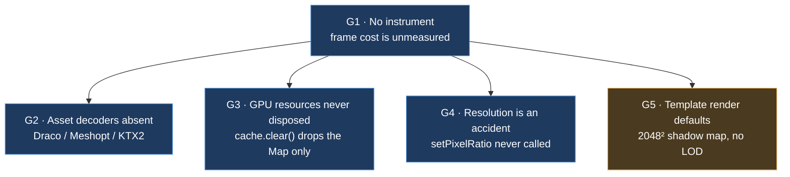

# PRD-073 — Performance shipped by default: build the instrument, then close the gaps that are the framework's to close

**Status: SCOPING, 2026-08-10. NOTHING IN THIS PRD IS IMPLEMENTED, AND NOTHING IN IT IS
MEASURED.** Every finding in §2 and §3 is a **code read** of this working tree at commit
`ac6fed9`, quoted with `file:line`. No frame was timed, no scene was profiled, and no
before/after exists. That is the finding, not an omission: **no gate in this repository
measures the frame cost of a framework game on any platform**, so "high performance by
default" is currently an unverified claim. Phase 0 exists to stop it being one.

No mobile-readiness claim, no iOS claim, no physical-hardware claim is made anywhere in this
document.

**Complexity: 7 → HIGH mode.** An instrument that does not exist and has to land before any
optimisation is authorised; one decoder question whose obvious web answer is forbidden on
native by the no-WASM rule; one resource-lifetime bug; and a framework/game boundary that,
got wrong, would have the framework owning the look.

**Blast radius (candidate, phase-gated).** Phase 0: `packages/core/src/playtest.ts`,
`packages/core/src/game.ts`, `packages/playtest/src/assertions.ts`,
`packages/playtest/src/scenario.ts`, `packages/playtest/src/three/observations.ts`. Phase 1:
`packages/core/src/assets.ts`. Phase 2: `packages/core/src/assets.ts`,
`packages/runtime-native/src/`. Phase 3: `packages/core/src/renderer.ts`,
`packages/core/src/viewport.ts`. Phase 4:
`packages/create-threenative/templates/*/src/render/`. Each phase after 0 is authorised only
by a Phase 0 number, not by this document.

**Depends on and does not overlap:**

- **PRD-069** owns per-draw JS and FFI cost inside the native runtime. **PRD-070** owns cold
  start and one-off hitches. **PRD-068** owns the Android JavaScript engine. All three are
  native-runtime PRDs. **This PRD owns what a framework game gets for free on every
  platform** — the measurement channel, the asset pipeline, resource lifetime, and the
  resolution decision — and owns none of their subject matter.
- **PRD-058** (`docs/PRDs/native/blocked/`) owns performance thresholds. This PRD produces
  numbers and an instrument; it must not set, tune, or waive a threshold.
- **PRD-056** already shipped accelerated ray queries. §2 records that as closed, not open.

## 1. Why this exists

The framework's promise is that the same source runs on web and native and that the plumbing
every game repeats is shipped rather than rewritten. Performance is plumbing by that test —
every game pays for asset decoding, GPU resource lifetime, and render resolution, and no
game should have to discover those costs itself.

Two things are true at once today:

1. **Some of it is already shipped, and shipped well.** §2 lists what a scaffolded game gets
   without asking, with evidence. Anyone about to add a BVH or a frustum-culling pass should
   read that section first and then not write it.
2. **The parts that are missing are missing quietly.** A game that loads a Draco-compressed
   glTF from the asset MCP fails at runtime. A game that transitions scenes a hundred times
   leaks every texture it ever loaded. A game running at 22 fps passes every gate in this
   repository. None of these announce themselves.

The reason they stay quiet is the same in all three cases: **there is no instrument.**
`ctx.fps` exists and one example prints it (`examples/abyss-framework/src/scenes/Abyss.ts:240`),
but nothing observes it, no assertion reads it, and `renderer.info` — draw calls, triangles,
GPU memory — is not referenced anywhere in `packages/`. So a performance regression is
invisible to CI and to a playtest, which means it is invisible full stop.

That ordering is the whole shape of this PRD. **Phase 0 builds the instrument. Nothing else
in this document is authorised to start until Phase 0 produces a number**, because every
remaining phase is a trade whose value is unknown without one, and this repository has a
standing rule against claiming a gate it did not run.

### Naming the layer

Per the repo rule that every defect is either an engine bug or a game bug: **G1–G4 in §3 are
engine bugs** — the framework is wrong or absent, and the fix lives in `packages/`. **G5 is a
game-side observation**, and its fix lives in the generated template source, because
anything a screenshot shows is the user's to own. Getting that boundary backwards is the
specific failure mode this PRD is most at risk of: an auto-instancing pass or a
`performance: 'high'` option would buy a fast screenshot and take the look away from the
user permanently. §5 forbids both by name.

## 2. What is already shipped — do not rebuild these

Checked by reading this tree. Each row is closed; reopening one needs a measurement, not an
argument.

| Optimisation | Status | Evidence |
| --- | --- | --- |
| **`three-mesh-bvh` accelerated ray queries** | **Shipped.** `ScenePicker` builds a `MeshBVH` on first use, caches per-geometry in a `WeakMap`, rebuilds on a position-attribute version change, and falls back to stock `three` for skinned/instanced/batched/morphed meshes where a rest-pose hierarchy would report hits in the wrong place. No `three` prototype is patched; a game that never calls `ctx.raycast` never builds a tree. | `packages/core/src/picking.ts:10,32-56,101-108`; asserted un-patched at `packages/core/__tests__/picking.spec.ts:75`; PRD-056 |
| **View-frustum culling** | **Shipped by Three.js, on by default**, per object, every frame. There is nothing for the framework to add and adding a second culling pass would cost more than it saves. | `Object3D.frustumCulled` defaults `true` upstream |
| **Deliberate culling opt-outs** | **Correct as written.** Sky domes and the instanced HUD set `frustumCulled = false` because their bounding spheres are meaningless — a sky dome always intersects, and a 2,048-instance HUD atlas would be culled against its rest bounds. | `templates/*/src/render/sky.ts`, `templates/*/src/render/hud.ts:19`, `packages/core/src/particles.ts:54` |
| **Instancing where it is generic** | **Shipped as user source.** The HUD is a single `InstancedMesh` of 2,048 quads in every template, and the scaffold test asserts it survives generation. | `templates/*/src/render/hud.ts:17`; `packages/create-threenative/__tests__/template.spec.ts:155` |
| **Fixed-step decoupled update/render** | **Shipped.** Accumulator loop with a `maxSteps` spiral guard, so a slow frame degrades render rate instead of compounding simulation debt. | `packages/core/src/loop.ts:68-89` |
| **Coalesced UI state** | **Shipped.** `ctx.state.set()` is called at loop rate and flushed on a 100 ms interval, so React never re-renders at 60 Hz. | `packages/core/src/state.ts`; core `AGENTS.md` |
| **Bulk native physics transport** | **Shipped.** The native physics ABI is coarse (`step`, `readVisibleTransforms`) and never makes per-object per-frame calls. | `packages/physics/src/native/`; root `AGENTS.md` |

**Read this table as the answer to "are we already doing this".** For BVH and frustum
culling specifically: yes, and correctly. The gaps are elsewhere.

## 3. The gaps

Ranked by what a user pays for them. G1 gates the rest.



Blue is an engine bug, fixed in `packages/`. Amber is a game-side default, fixed in the
generated template source.

### G1 — Nothing measures frame cost. Engine gap, and it blocks everything else.

`FixedStepLoop` computes a smoothed fps (`packages/core/src/loop.ts:80-86`) and `game.ts:361`
hands it to games as `ctx.fps`. From there it goes nowhere:

- `packages/core/src/playtest.ts` never mentions fps — the bridge does not report it.
- `packages/playtest/src/assertions.ts` has no performance assertion. The full assertion
  vocabulary covers movement, camera, visibility, physics, console, network, and pixels.
  Frame cost is absent.
- `renderer.info` — draw calls, triangles, GPU memory — is not referenced anywhere under
  `packages/`. Neither the framework nor a game can see its own draw count.

Consequence: a change that halves the frame rate of every scaffolded game passes
`pnpm test`, `pnpm test:browser`, `pnpm test:playtest`, and `pnpm test:templates`. The
repository's stated rule is that a check reporting green while asserting nothing is its most
dangerous failure. This is that, for performance.

There is already a home for the fix: `runtimeDiagnosticsSeries`, the per-frame observation
channel used by `visual.entityVisible.throughoutFrames`
(`packages/playtest/src/assertions.ts:583-587`). A frame-cost series belongs in the same
channel, not in a new one.

### G2 — The asset loader cannot open a compressed asset. Engine gap.

`createAssetLoader` constructs a bare `GLTFLoader` (`packages/core/src/assets.ts:60-61`) and a
bare `TextureLoader` (`:73-74`). `DRACOLoader`, `KTX2Loader` and `MeshoptDecoder` do not
appear anywhere in this repository.

Two costs, both paid by every game:

1. **Draco and Meshopt glTF fail at runtime**, with an upstream Three.js error rather than a
   framework diagnostic. Both are standard output from ordinary asset tooling, and the asset
   MCP the templates pin is a discovery surface for exactly such assets.
2. **Every texture is uploaded uncompressed.** A KTX2/Basis texture stays compressed in VRAM;
   a PNG does not. On a mobile GPU that is the difference between fitting in memory and not,
   and it is a cost no game can opt into today without replacing the loader.

This is squarely framework plumbing: it is well over 20 lines, every game repeats it
identically, and none of it is anything a screenshot shows.

**The complication that makes this a HIGH-mode phase:** the standard decoders are WASM, and
**this repository does not run WASM on native** — Android runs QuickJS and the native bundle
is one import-free ESM file, so a decoder cannot be dynamically imported there either. A
decoder wired the obvious web way is a native break that no current gate would catch. §4
Phase 2 treats this as the design question it is and refuses to pick an answer before Phase 0
says what the win is worth.

### G3 — The asset cache never releases GPU memory. Engine bug.

```
packages/core/src/assets.ts:56   clear: () => cache.clear(),
packages/core/src/assets.ts:63   release: (kind, path) => cache.delete(`${kind}:${resolvePath(basePath, path)}`),
```

Both drop a `Map` entry. Neither calls `.dispose()` on the `Texture`, nor walks a loaded glTF
to dispose its geometries and materials. JavaScript will collect the wrapper object; the GPU
allocation behind it is freed only by an explicit `dispose()`.

So a game that loads assets in `Scene.load` and transitions scenes repeatedly accumulates GPU
memory for the life of the process. `stop()` is documented to fully reverse `start()` — this
is the one resource it does not reverse. The symptom is not a slow frame; it is a browser tab
or an Android process that grows until it is killed, which is the worst possible way for a
user to find out.

This is the cheapest fix in the PRD and the only one with no design question attached.

### G4 — Render resolution is an accident nobody chose. Engine gap.

`addResizeHandling` reads CSS pixels and calls `setSize(width, height, false)`
(`packages/core/src/renderer.ts:98-108`, `41-46`). `setPixelRatio` is never called anywhere in
`packages/` or `examples/`. The drawing buffer therefore matches CSS pixels — an effective
device pixel ratio of 1 on every platform.

That is not necessarily wrong. On a phone at DPR ~2.6 it is roughly a 6.8× reduction in
fragment work, which is very likely the right default for a game. **The problem is that it is
undocumented, untested, and unadjustable.** No comment records it as a decision, no test
pins it, a user who wants a crisp 2× render has no supported way to ask, and there is no
channel through which a game could trade resolution for frame rate under load. An implicit
default that happens to be fast is one refactor away from becoming an implicit default that
happens to be slow, with nothing to catch it.

### G5 — Template render defaults are untuned, and that is the user's file. Game-side.

All three templates enable soft shadows at 2048×2048 from a single directional key, with a
hand-tuned 18-unit shadow camera extent
(`templates/starter/src/render/lighting.ts:20-44`, and the platformer and minimal
equivalents). Nothing uses `THREE.LOD` and nothing sets `matrixAutoUpdate = false` on static
geometry.

None of that is a framework defect and **none of it may be fixed in `packages/`**. Lighting
and shadows are things a screenshot shows, so they ship as generated source the user owns and
edits. What is missing is not framework code but **an informed default plus the comment that
makes the trade visible** — the same treatment `shapes.ts:130` already gives triangle count
("128 × 24 is 6,144 triangles. The old 500 × 100 mesh pushed 100k triangles"). That comment
is the model for what G5's fix looks like.

## 4. Solution, phased

### Phase 0 — The instrument. Gates every phase below it.

Frame cost becomes an observed, assertable quantity on both halves of the codebase.

1. The playtest bridge reports a per-frame cost sample — at minimum frame milliseconds from
   the loop, plus `renderer.info` draw calls and triangles where the active renderer exposes
   them — into the existing `runtimeDiagnosticsSeries` channel.
2. A `performance` assertion family joins the vocabulary in
   `packages/playtest/src/assertions.ts`, with bounds phrased as maxima a scenario opts into
   (`maxFrameMsP95`, `maxDrawCalls`, `maxTriangles`). Fail closed: a scenario asking for a
   performance assertion with no samples in the report **fails**, exactly as a semantic
   assertion against a missing bridge fails `TN_PLAYTEST_BRIDGE_MISSING`. An empty series is
   never a pass.
3. One scenario per template records the current numbers on desktop web. Those numbers are
   **recorded, not enforced** — this PRD does not set a threshold, because PRD-058 owns
   thresholds.

The `--target android|ios` path the same runner already supports means the same scenario
produces device numbers without new harness work. Whether it is run here is an operator
call, not this PRD's claim.

**Exit criterion:** a deliberately regressed scene — one that draws visibly more than the
template ships — fails a performance assertion that the unmodified template passes. Until
that is demonstrated, the instrument is not proven and Phases 1–4 stay closed.

### Phase 1 — Dispose what was loaded. Authorised on G3's code read alone.

`release()` and `clear()` dispose the GPU resources they drop: `Texture.dispose()` for
textures, and a traversal disposing geometries, materials, and material-held textures for a
loaded model. Unit test in `packages/core/__tests__/`, node environment with a stub asserting
`dispose` was called exactly once per resource and that a double `release` does not
double-dispose.

This phase does not need a Phase 0 number — an unfreed GPU allocation is a defect at any
frame rate — but it lands after Phase 0 so its effect is visible.

### Phase 2 — Compressed assets, without breaking native. Needs a Phase 0 number.

Design question first, code second. The decoders are WASM; native has no WASM and no dynamic
import. Candidate answers, none chosen here:

- **Web-only decoders behind the existing `AssetLoaderOptions` hooks**, with native throwing
  a named diagnostic at load. Honest and small; leaves native games unable to consume the
  compressed assets the tooling produces.
- **Decoders compiled into `runtime-native`**, reached through the same coarse typed-array
  ABI physics uses. Correct and expensive.
- **Decompress at build time** in the native bundling step, so the device only ever sees
  formats it can open. Cheapest, costs bundle size — and PRD-071 already owns bundle size, so
  this option needs its agreement, not just this PRD's.

Whichever wins, the framework rule stands: **a backend that cannot honour an option throws at
construction.** Silently loading an uncompressed fallback on one platform is a gameplay bug
that only appears on that platform.

### Phase 3 — Make resolution a decision. Needs a Phase 0 number.

Record the current DPR-1 behaviour as an intentional default — comment, test, and one line of
documentation — and expose a single resolution scale on the renderer config so a game can
ask for more or less. **No adaptive-resolution controller ships in this phase.** A
frame-rate-driven feedback loop is a tuning system, and tuning systems are how v1 died; if
Phase 0's numbers argue for one it gets its own PRD and its own evidence.

### Phase 4 — A measured pass over the template render layer. Needs a Phase 0 number.

With draw calls and frame milliseconds visible, revisit shadow map size, shadow camera
extent, and static-transform flags in each template's `src/render/`, and write the trade into
the comment the way `shapes.ts:130` does. Every line stays generated user source. The
deliverable is a better starting point plus a sentence explaining what it costs — not a
framework knob.

## 5. What this must not become

Each of these is refused here so a later reader does not have to relitigate it.

1. **No `performance: 'high' | 'low'` option on `defineGame`.** It would be a preset system,
   and preset systems are closed with evidence. It would also decide things a screenshot
   shows, which the framework never owns.
2. **No automatic instancing or batching pass.** Which props to instance is a gameplay and
   art decision, and PRD-069 says so for native in the same words. The framework's job is to
   make the draw count visible; the user's job is to decide what to do about it.
3. **No LOD wrapper.** `THREE.LOD` is upstream and usable in well under 20 lines. Wrapping it
   fails the 20-line rule and the kill switch on the same day.
4. **No adaptive-resolution controller in this PRD.** See Phase 3.
5. **No threshold set here.** PRD-058 owns thresholds. This PRD may record numbers and must
   not gate on them.

Anything added under this PRD gets a kill-switch pass before it lands: if it costs more code
than the plain Three.js a competent developer would write, it is deleted regardless of the
work spent.

## 6. Verification

Following the repository's fail-closed rule everywhere.

- **Units.** `packages/core/__tests__/assets.spec.ts` for disposal, including the
  double-release case. `packages/playtest/__tests__/` for the new assertion family, including
  the empty-series case, which must fail rather than vacuously pass.
- **The game.** One playtest scenario per template asserting the performance family against
  the real build, re-run on every later change to the render or asset path.
- **The negative control.** The regressed-scene scenario from Phase 0's exit criterion is
  kept as a permanent test. Without it, an assertion that stopped observing anything would
  keep reporting green — the precise v1 failure this repository exists to avoid.
- **What will not be claimed.** No result from this PRD says mobile-ready. Web and desktop
  results say what they are; a device number is claimed only where a device executed it, on
  named hardware, with the run pasted.

## 7. Open questions

1. **What does a frame actually cost today?** Unknown on every platform, for every template.
   Phase 0 answers it, and until it does, the ranking in §3 is reasoning from code, not from
   measurement, and may be wrong about which gap matters most.
2. **Is DPR 1 the right default?** It is currently an accident that is probably correct.
   Phase 0 plus Phase 3 turn it into a decision either way.
3. **Which Phase 2 answer?** Blocked on Phase 0 and on PRD-071's bundle-size position.
4. **Does `pnpm test:browser`'s headless environment produce frame timings worth asserting
   on?** WebGPU already needs `xvfb` for non-blank output here. If headless timing proves too
   noisy to gate, the performance assertions may have to be recorded-only in CI and enforced
   only on a named machine — which would be a real limitation and would be written down as
   one, not worked around.
