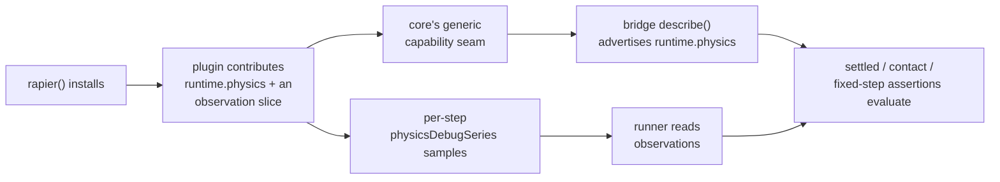

# PRD-081 — A user who ships physics cannot assert physics: the framework's 0→1 capability and its strongest capability do not compose

**Status: PROPOSED, 2026-08-12. Nothing here is executed.** §1 and §2 are a code read of the
tree at commit `5a5604e` plus `grep` output taken 2026-08-12. No run has been performed for
this document. No mobile-readiness, device or iOS claim is made.

**The user-facing half of [PRD-079](../PRD-079-phase-2-exit-criteria.md), extracted so it can
ship without waiting on an owner decision about Phase 2's exit gate.** PRD-079 mixes an engine
bug with a roadmap rewrite; only the engine bug costs a user anything today. Nothing in this
PRD touches `ROADMAP.md`, the round ledger, or any gate wording. If PRD-079 Phases 2–3 are
never executed, everything here still pays.

**What a user hits.** They scaffold the platformer, build a game with `RigidBody3D`, write the
assertion the docs advertise — `settled` — and get:

```
TN_PLAYTEST_CAPABILITY_MISSING: runtime.physics
```

Their options are to hand-roll a capability declaration and an observation channel into their
own game code, or to delete the assertion. The repository's rule forbids the second
(*"Install the bridge or narrow the scenario; never delete the assertion to get green"*) and
the first is plumbing every physics game repeats and no game should write. **That is the
definition of package code, and it is missing.**

**Confirmed still open at `5a5604e`:**

```
$ grep -rn "runtime.physics" packages/*/src
packages/playtest/src/capabilities.ts:20:  | "runtime.physics"
packages/playtest/src/capabilities.ts:53:  capability("runtime.physics", "Samples bounded application-owned physics observations.")
packages/playtest/src/assertions.ts:80:    requiredCapabilities: ["runtime.fixedStep", "runtime.physics"]
packages/playtest/src/assertions.ts:379:    requiredCapabilities: ["runtime.physics"]
packages/playtest/src/assertions.ts:393:    requiredCapabilities: ["runtime.physics"]
# Three consumers. Zero producers. No hit anywhere in packages/physics/src.

$ grep -rn "physicsDebugSeries" packages/*/src | grep -c "packages/physics"
0
# The protocol field (protocol.ts:109) has readers in playtest/ and no writer in packages/.
```

`packages/core/src/playtest.ts` auto-advertises exactly two capabilities — `runtime.audio` and
`runtime.world`. A plugin cannot contribute a third.

**Complexity: 5 → STANDARD mode.** One generic seam in core, one producer in the physics
plugin, one template scenario. The hazards are narrow and named: core must not learn what
physics is, and the observation must be bounded with the overflow **reported**, never silently
truncated.

**Blast radius (candidate, phase-gated).**
Phase 0: `packages/core/src/playtest.ts`, `packages/physics/src/plugin.ts`,
`packages/core/__tests__/`, `packages/physics/__tests__/`.
Phase 1: `packages/create-threenative/templates/platformer/`,
`scripts/verify-template-playtests.ts`, `docs/verification/`.

**Depends on:** nothing. **Unblocks:** the physics half of axis 3 in
[VALUE-PROPOSITION.md](../../strategy/VALUE-PROPOSITION.md); optionally PRD-079 Phase 2, which
this PRD does not require and does not authorise.

---

## 1. The evidence

Round 4 ran both benchmark arms and both exited `1` with `0/1` and the same error —
`TN_PLAYTEST_CAPABILITY_MISSING` for `runtime.physics` — while a **no-op control with no
gameplay at all** reached assertion evaluation and failed on the merits
([round-4-2026-08-10.md](../../verification/round-4-2026-08-10.md)). Two working physics games
got less far than an empty one.

That was read at the time as a benchmark result. It is a defect report: neither builder knew
to hand-roll the bridge, because a user should not have to.

The four facts that produce it:

| Fact | Location |
|---|---|
| Core advertises two capabilities and offers no way to add a third | `packages/core/src/playtest.ts:142-146` |
| Three assertion kinds require `runtime.physics` | `packages/playtest/src/assertions.ts:80`, `:379`, `:393` |
| The physics package contains no reference to `playtest`, `bridge`, `capabilities` or `describe` | `packages/physics/src/` |
| `physicsDebugSeries` is read by the runner and written by nothing in `packages/` | read at `runner/runner.ts:319`, declared at `protocol.ts:109` |

## 2. Why this is worth a night

Axis 3 — *"my game is asserted, not eyeballed"* — is the framework's strongest claim at
**18/20**. Physics is its 0→1 capability, the one area scored as having no ceiling because
vanilla Three.js ships nothing. The two do not meet. A user gets the strongest thing here and
the most valuable thing here and cannot use them together.

This is an **engine bug**: the framework is wrong. Fixing it in game code buys one green
screenshot and leaves every other physics game broken.

## 3. Solution



**Key decisions:**

- [ ] The capability is advertised by **`rapier()`**, not by `playtest()` in core. Core must
      not gain a physics dependency; that is what the package boundary is for.
- [ ] The seam core gains is **generic** — a plugin contributes capability names and an
      observation slice. Core never learns the word "physics".
- [ ] Samples keep the existing protocol shape `{label, snapshot, tick}`
      (`protocol.ts:109`). A second shape is a fork.
- [ ] The snapshot is **bounded and JSON-safe**, and excess is **reported**, never silently
      dropped. Silent truncation is the failure mode this repository fails builds over.
- [ ] The framework observes; it does not decide what the game's physics is. No option, no
      preset, nothing a screenshot shows.

**Data changes:** none. Both `runtime.physics` and `physicsDebugSeries` already exist. This
PRD supplies the missing producer.

## 4. Integration Ledger

| # | New thing | Live caller (`file:line`, non-test) | Replaces | Old path removed? | Negative control |
|---|---|---|---|---|---|
| 1 | Generic plugin capability seam in core | `packages/core/src/playtest.ts:142` capability assembly, reached by every `defineGame` with `playtest()` | nothing — no seam existed | n/a, an absence | hardcode `runtime.physics` in core → the boundary test goes red |
| 2 | `rapier()` contributes `runtime.physics` | `packages/physics/src/plugin.ts` `rapier()`, installed by every physics game | hand-rolled declarations in game code | the platformer template's, if any, is deleted | disable the contribution → `settled` returns `TN_PLAYTEST_CAPABILITY_MISSING`, exactly as round 4 did |
| 3 | `physicsDebugSeries` producer | the plugin's per-step hook, reached by the frame loop; read at `runner/runner.ts:319` | nothing — the field had no writer | n/a, an absence | stop emitting → `settled` fails with no samples and `assertions.ts:1248`'s physics-evidence check goes false |
| 4 | Platformer physics scenario | `packages/create-threenative/templates/platformer/playtests/`, run by `pnpm test:templates` | no template asserts its own physics today | n/a | remove `rapier()` from the template's `defineGame` → the scenario **fails**, not skips |

**A test is not a caller.** Row 2's caller is `rapier()` inside a scaffolded game's
`defineGame`; row 3's is the frame loop; row 4's is `pnpm test:templates`.

### Reachability

**How is this reached?** A user writes `defineGame({ plugins: [rapier(), playtest()] })` and a
scenario with a `settled` or `contact` assertion. Today that errors.
**Pre-existing files edited:** `packages/core/src/playtest.ts`,
`packages/physics/src/plugin.ts`, `packages/create-threenative/templates/platformer/`.
**User-facing?** Yes — a physics assertion that evaluates instead of erroring.
**What does it replace?** The bridge code a physics game must hand-roll today.

## 5. Execution phases

### Phase 0 — Physics and playtest compose

**Outcome:** a game that installs `rapier()` can assert `settled` with zero bridge code.

**Files (max 5):**

- `packages/core/src/playtest.ts` — EDIT: plugins may contribute capability names and an
  observation slice through the existing `addRuntimeCapabilities` seam
- `packages/physics/src/plugin.ts` — EDIT: `rapier()` contributes `runtime.physics` and emits
  bounded `physicsDebugSeries` samples per labelled step
- `packages/physics/__tests__/playtest-capability.spec.ts` — NEW
- `packages/core/__tests__/playtest.spec.ts` — EDIT: the seam, and the boundary guard
- `packages/playtest/src/capabilities.ts` — **READ ONLY.** The registry entry at `:53` is
  correct; this phase fails if its description changes

**Implementation:**

- [ ] Widen the plugin-hook contract generically. Core stays physics-ignorant.
- [ ] `rapier()` writes `{label, snapshot, tick}` matching `protocol.ts:109`.
- [ ] Bound the snapshot by body count, JSON-safe, with the excess **reported** in the sample.
- [ ] Do not touch `capabilities.ts`.

**Tests required:**

| Test file | Test name | Assertion | Negative control (must be observed red) |
|---|---|---|---|
| `physics/__tests__/playtest-capability.spec.ts` | `should advertise runtime.physics when rapier is installed` | `describe()` capabilities include `runtime.physics` | remove `rapier()` → absent, and `settled` returns `TN_PLAYTEST_CAPABILITY_MISSING` |
| `physics/__tests__/playtest-capability.spec.ts` | `should emit one physicsDebugSeries sample per labelled step` | one sample per label, monotonic `tick` | freeze the tick source → the monotonic assertion goes red |
| `physics/__tests__/playtest-capability.spec.ts` | `should report rather than silently truncate beyond the body bound` | over-bound input produces an explicit overflow report | delete the report → the test passes on a silent truncation, proving the report is what holds it |
| `core/__tests__/playtest.spec.ts` | `should not advertise runtime.physics without a contributing plugin` | capabilities are exactly `runtime.audio` + `runtime.world` + declared | hardcode `runtime.physics` in core → red, protecting the package boundary |

**Revert check:** remove the contribution → Phase 1's scenario fails with the round-4 error.

### Phase 1 — Prove it where a user meets it

**Outcome:** the scaffolded platformer asserts its own physics, with no hand-rolled bridge
code anywhere in the generated project.

**Files (max 5):**

- `packages/create-threenative/templates/platformer/playtests/physics.playtest.json` — NEW
- `packages/create-threenative/templates/platformer/src/game.ts` — EDIT if `rapier()` and
  `playtest()` are not already installed together
- `scripts/verify-template-playtests.ts` — EDIT: include the new scenario
- `docs/verification/physics-playtest-composition-2026-08-12.md` — NEW

**Proof subject:** the platformer template as generated — the only template that ships physics
gameplay.
**What this exercises that a unit test cannot:** a real frame loop, the scaffolded dependency
graph, and the `playtest()`/`rapier()` install order a user actually writes.

**Negative control (required, observed red):** scaffold the platformer, delete `rapier()` from
`defineGame`, run the scenario. It must **fail** with `TN_PLAYTEST_CAPABILITY_MISSING` — not
skip, not pass.

**User verification:**

- Action: `pnpm create threenative demo --template platformer`, then
  `npx @threenative/playtest playtests/physics.playtest.json`
- Expected: exit `0`, physics assertions evaluated. Today: a capability error.

On headless Linux, prefix screenshot or `visual` runs with
`xvfb-run -a -s '-screen 0 1600x900x24'`.

## 6. Verification strategy

```sh
# 1. Producer census — the capability has a producer outside its own tests
grep -rn "runtime.physics" packages/physics/src packages/core/src
# Expected: a contribution in physics/src/plugin.ts. Today: zero hits in either directory.

# 2. Writer census — physicsDebugSeries is written, not only read
grep -rn "physicsDebugSeries" packages/*/src
# Expected: a writer in physics/src alongside the existing readers.

# 3. Boundary check — core did not learn about physics
grep -rn "rapier\|Rapier\|RigidBody" packages/core/src
# Expected: no hit.

# 4. Revert check — delete the contribution, run pnpm test:templates
# Expected: the platformer physics scenario FAILS. If it skips, the assertion is not load-bearing.
```

**Evidence required:**

- [ ] `pnpm typecheck && pnpm lint && pnpm test` green
- [ ] `pnpm test:templates` green, including the new scenario
- [ ] `pnpm budgets` green; the framework LOC trigger reported, never silenced
- [ ] Every gate has an observed negative control recorded red with its command
- [ ] `TN_PLAYTEST_CAPABILITY_MISSING` reproduced on purpose before Phase 0, absent after

## 7. Acceptance criteria

Consumer-scoped.

- [ ] **A user who scaffolds the platformer and writes a `settled` assertion sees it
      evaluated**, with no bridge code in the generated project.
- [ ] **Deleting `rapier()` from a scaffolded game makes its physics scenario fail**, not skip
      — proved by running it.
- [ ] **`packages/core` contains no reference to Rapier, `RigidBody3D`, or physics of any
      kind.** The seam is generic or the phase is rejected.
- [ ] An over-bound snapshot **reports** its overflow; a test proves a silent truncation would
      have passed without the report.
- [ ] No genre sweep, no arm rerun, no roadmap or gate edit was performed by this PRD.

**What this PRD may not claim:** that Phase 2 of the roadmap is green, that round 4's tie was
resolved, or that the framework beat vanilla on anything. It fixes a defect a user hits.
