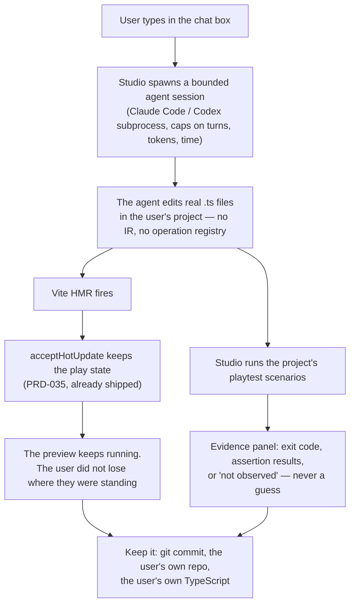

# PRD-084 — ThreeNative Studio: chat, watch the game change, keep the code — and the charter closed this question using the sibling project's own Studio as the evidence

**Status: APPROVED, 2026-08-12 — the owner decision is recorded at the foot of this file.
Nothing here is executed yet.** §1–§3 are a read of `~/projects/threejs-to-bevy` at its working tree on 2026-08-12, of this
repository at commit `5a5604e`, and of `wc -l` output taken the same day. No spike has been
run. No mobile-readiness, device or iOS claim is made.

**Two things make this PRD different from every other file in the night batch, and both are
recorded in tracked documents, not invented here.**

1. **It adds a package.** `@threenative/studio`, as the owner asked. Rule 5 governs whether it
   may exist, and §4 argues it against that rule rather than around it.
2. **It reopens a closed question.** `CHARTER.md`'s closed list contains *"An editor — not in
   v1. **The Studio dogfood found Share and Export did literally nothing.**"* That sentence
   points at `~/projects/threejs-to-bevy/docs/audits/studio-dogfood-keep-my-work-2026-07-31.md`
   — **the dogfood of the exact product this PRD is asked to build here** (untracked in this
   repository; the path is on this machine). And
   [CONFLICTS.md](../../strategy/CONFLICTS.md) row 1 states the gate in one line: *"Studio
   starts only after a stranger has played a game for five minutes."*

The repository's rule for that situation is explicit: **reopening a closed question needs new
evidence, not a new argument.** So this PRD does not argue. Phase 0 is a throwaway spike that
produces a number, and every phase after it is blocked until an owner reads that number and
decides.

**The product loop, stated the way a user would:**

> Describe a change in a chat box. Watch it happen in the running game without losing where
> you were standing. See proof it still works. Keep the TypeScript.

**Complexity: 9 → HIGH mode.** A new package, a closed charter question, a subprocess that
writes to the user's source tree, a UI whose entire failure mode is lying about state, and a
sibling implementation that cost **60,105 non-test lines** and failed its own dogfood on three
major findings. Every one of those is a reason to spike before building.

**Blast radius (candidate, phase-gated).**
Phase 0: `docs/spikes/` and the scratchpad only. **No package, no `packages/` edit, no
dependency added.**
Phase 1: `packages/studio/` (new), root `package.json`, `pnpm-workspace.yaml`,
`scripts/check-budgets.ts` if the package census needs it.
Phase 2: `packages/studio/src/` evidence surface; no change to `@threenative/playtest`.
Phase 3: `packages/studio/src/` ownership surface.
**Phases 1–3 do not execute without a recorded owner decision. Phase 0 does not need one.**

**Depends on:** [PRD-080](../PRD-080-five-minute-stranger-test.md) for Phases 1+, by
CONFLICTS row 1. **Unblocks:** the Studio surface in
[POSITIONING.md](../../strategy/POSITIONING.md), currently *"Barely — `DebugOverlay` and
`window.__THREENATIVE__.snapshot()`."*

---

## 1. What the target project actually built

`~/projects/threejs-to-bevy` ships a working Studio: `packages/editor` with
`src/studio/StudioApp.tsx`, a chat transcript, a plan/apply cycle, a live preview iframe, an
evidence dock, a history drawer, an asset browser and a project manager. Its program is that
project's `docs/PRDs/live-editor/` — nine PRDs, four done, with a stated promise:

> *Describe a game, watch verified changes become playable, inspect what changed, restore an
> earlier state, and export the same source project.*

**That promise is the right one, and this PRD adopts it verbatim.** What does not port is the
shape underneath it.

**Measured on 2026-08-12, non-test `src/` lines:**

| Package there | Lines | What it is |
|---|---:|---|
| `authoring` | 32,680 | the mutation contract: operation registry, atomic plan/apply, plan hash, recovery journal |
| `editor` | 14,070 | the React shell, of which `src/studio/` is 1,453 |
| `authoring-client` | 11,328 | the browser half of the mutation contract |
| `project-workspace` | 1,129 | hosted project CRUD |
| `project-history` | 505 | revisions and drafts |
| `model-gateway` | 393 | OpenRouter client, redaction, image generation |
| **Studio stack total** | **60,105** | |
| *(substrate it sits on)* `ir` + `compiler` | *46,904* | the IR bundle and its compiler |

This repository's framework review trigger is **15,000 lines**, and `pnpm budgets` reports
**8,560** today. **A straight port is a 7× breach of a trigger the kill switch exists to
enforce.** Reporting that is the point of reading the target project rather than admiring it.

### Why it costs 60,105 lines there and need not here

**Because that project has an IR, and this one closed the IR question with evidence.**

Over there the agent may not touch source directly: it emits operations against a registry,
which plan/apply against a validated IR bundle, which compiles to two runtimes. `authoring` +
`authoring-client` is 44,008 lines of making an agent's intent safe to apply to a structured
document. That is a real cost of a real decision, and it is the decision this repository
already declined.

Here, the agent edits **plain TypeScript files a user owns**, because that is all there is.
The mutation contract is the filesystem and git. **The 44,008-line layer has no counterpart in
this design, and if a phase of this PRD starts building one, that phase is wrong and stops.**

## 2. What this repository already ships that the target project had to build

This is the part that makes the PRD interesting rather than ambitious.

| The Studio loop needs | Here, today | There, built for the Studio |
|---|---|---|
| **Live preview** | `pnpm dev` — Vite, already every template's dev command | `previewCoordinator` + `PreviewHost` iframe + a bespoke session protocol |
| **Change without losing play state** | **`acceptHotUpdate(game, import.meta.hot)`** — one line in the user's entry, shipped and leak-controlled by [PRD-035](../done/PRD-035-hot-reload-state-preservation.md), proved over ten reloads | `PRD-008 Incremental Preview Updates`, which existed only to stop the iframe remounting on every build |
| **Proof the change did not break the game** | `@threenative/playtest` — drives the real build, fails closed, `TN_PLAYTEST_ASSERTION_TRIVIAL` on a pre-satisfied assertion | an evidence dock built on a run protocol |
| **History, restore, export** | git, which the user already has and already owns | `project-history` (505) + `project-workspace` (1,129) + PRD-007 |
| **The agent** | Claude Code or Codex, as a subprocess the user already runs | `model-gateway` (393) + `tools/agent-session` (568) |

**Read the column widths.** The expensive halves of the loop are already shipped here, gated,
and scored — hot reload with state preservation is `80/100` on the opportunity list, and the
harness is the framework's highest-scoring axis at `18/20`. **The thing that does not exist is
the surface that puts them in one window.**

That is the hypothesis Phase 0 tests, and it is falsifiable: **a Studio here is small, or it
is not worth building.**

## 3. What the dogfood found, and the rule it buys

The audit the charter cites recorded three findings, all severity major, and all the same
failure:

| Finding | What the user saw |
|---|---|
| `share-export-silent-without-checkpoint` | Two enabled buttons that produced no request, no dialog, no message. Silent no-ops. |
| `no-way-to-save-on-purpose` | A checkpoint endpoint existed server-side; nothing in the UI reached it. Work was preserved only as a side effect of an agent run succeeding. |
| `build-evidence-contradicts-live-preview` | The Build panel said no artifact existed while the preview strip said `LIVE` with a bundle hash. Two surfaces, same session, contradicting. |

**None of those is a hard problem. All three are the same problem: a surface that reports
state it did not observe.** This repository has a name for the opposite of that, and it is the
rule the whole verification story rests on — **fail closed**: malformed input throws, a missing
observation fails, an empty assertion set is a failure.

**So the Studio's binding rule, and it is an acceptance criterion in every phase:**

> **No control may be enabled and inert, and no panel may state a fact it did not observe.**
> A Studio that does not know says it does not know. A button that cannot act is disabled with
> a visible reason.

That rule is worth more than any feature in this PRD, and it is the one thing the sibling
project's evidence unambiguously teaches.

## 4. The package, argued against rule 5

**Rule 5:** *a package exists only when it carries a dependency the others must not inherit.*

`@threenative/studio` carries three, and each fails the inheritance test on its own:

| Dependency | Who must not inherit it | Why |
|---|---|---|
| A **child-process agent session** (`node:child_process`, spawning Claude Code or Codex) | `core`, `physics`, `playtest`, `ui` | it is a Node host capability in packages that must run in a browser and on QuickJS |
| A **local HTTP/WS dev server** with **write access to the user's source tree** | all of them | a rendering package that can write files is a supply-chain surface nobody asked for |
| A **React chat application** | `core`, `physics`, `playtest` | `ui` already carries React, but as a 22-line HUD binding with `react` as a *peer*. A studio app is a different dependency class and must not be reachable from a game's bundle |

**It cannot be a subpath export of anything.** `@threenative/core/studio` would put a
file-writing Node server behind an import that a browser game resolves.

**Budget position, measured 2026-08-12:** `pnpm budgets` reports *"6 framework packages, 4
example workspaces, 8,560/15,000 framework LOC."* Package count is no longer a number to argue
with — rule 5 replaced the numeric cap — so the question is only whether the dependency
argument above holds. **If the owner judges it does not, the answer is that Studio ships as a
separate repository on its own release lane, like `threenative-asset-mcp`, and this PRD is
rewritten to that shape rather than shrunk into an existing package.**

## 5. Solution



**Key decisions:**

- [ ] **No IR, no scene format, no operation registry, no mutation contract.** The agent edits
      files. Any phase that starts building `authoring` is stopped, not scoped down.
- [ ] **No property inspector that writes a scene.** Reading and displaying scene state is
      inspection, which `DebugOverlay` and `snapshot()` already do. Writing a scene through a
      GUI is the editor the charter closed, and this PRD does not sneak it in as a panel.
- [ ] **The agent is a subprocess the user already has, not a model we own.** No API keys held
      by the framework, no `model-gateway`, no provider registry. If the user has no agent
      installed, Studio says so and does nothing — it does not silently degrade.
- [ ] **The project on disk is a normal scaffolded ThreeNative project.** Closing Studio leaves
      a repository that `pnpm dev`, `pnpm test` and `git log` work on. **There is no Studio
      project format**, so there is no dead end.
- [ ] **History is git.** Not `project-history`. A checkpoint is a commit; restore is a
      checkout; export is the directory. The user already owns all three.
- [ ] Fail closed, per §3, in every panel.

## 6. Integration Ledger

| # | New thing | Live caller (`file:line`, non-test) | Replaces | Old path removed? | Negative control |
|---|---|---|---|---|---|
| 1 | Spike result: does the loop hold together at all | `docs/spikes/studio-loop-2026-08-12.md`, read by the owner decision in §7 Phase 0 | nothing — the question has never been measured here | n/a | the spike's own reload assertion inverted → it must fail |
| 2 | `@threenative/studio` package | its bin, invoked by a user; workspace member in `pnpm-workspace.yaml` | nothing | n/a | remove the package → nothing else in the repo fails to build, proving it is additive and deletable |
| 3 | Chat → agent-session → file edit | the Studio server's chat handler | the user running the agent in a second terminal | no — the terminal path keeps working and is the fallback | kill the agent binary → Studio reports the absence and disables send; it does not spin |
| 4 | Hot-preview binding | `acceptHotUpdate` in the scaffolded project's entry, already generated | nothing | n/a | delete `acceptHotUpdate` from the project → Studio must report a full reload happened, not claim state was preserved |
| 5 | Evidence panel over `@threenative/playtest` | `packages/studio/src/`, spawning the existing CLI | eyeballing the preview | no | make the scenario exit `2` → the panel says **not observed**, never "passed" |

**A test is not a caller.** Row 3's caller is a user typing a sentence; row 5's is the Studio
server spawning the playtest CLI the repository already ships.

### Reachability

**How is this reached?** A user runs the Studio bin inside a scaffolded project and types a
sentence.
**Pre-existing files edited:** `pnpm-workspace.yaml`, root `package.json`. No package source
outside `packages/studio/`.
**User-facing?** Entirely.
**What does it replace?** Nothing is removed. The terminal workflow — `pnpm dev` in one window,
an agent in another, `playtest` in a third — keeps working and stays the fallback.

## 7. Execution phases

### Phase 0 — The spike, and the only phase runnable tonight

**Outcome:** one document that says whether the loop holds together **using only what ships
today**, with no package created and no dependency added.

**Files (max 5):**

- `docs/spikes/studio-loop-2026-08-12.md` — NEW
- scratchpad scripts, which are **not committed**

**The spike, end to end, in a scaffolded project:**

1. `pnpm create threenative studio-spike --template starter`
2. Start `pnpm dev`. Confirm `acceptHotUpdate` is in the entry.
3. Drive an agent **as a subprocess** — the one already installed on this machine — with one
   concrete instruction that changes a visible gameplay value.
4. **Measure the thing the whole product depends on:** after the edit lands and HMR fires, did
   the play state survive? Read it from the game's own state, not from a screenshot.
5. Run the project's playtest scenario against the still-running dev server and record the
   exit code.
6. Time the loop end to end: sentence typed → change visible → proof recorded.

**The three numbers Phase 0 must produce, and the owner decision hangs on them:**

| Number | Why it decides |
|---|---|
| **State survived the agent's edit? yes/no** | If HMR cannot survive an agent rewriting a file — as opposed to a human saving one — the product's core promise is unbacked and Phases 1+ do not start. |
| **Seconds from sentence to visible change** | If it is minutes, this is a chat wrapper around a terminal, not a Studio. |
| **Lines of glue the spike needed** | The §2 hypothesis is that a Studio here is small. If the spike needs thousands of lines of glue, the hypothesis is dead and the honest outcome is to say so. |

**Negative controls (required, observed red):**

- Delete `acceptHotUpdate` from the project entry and repeat step 4. State **must** be lost.
  If it survives both ways, the measurement is not measuring reload.
- Point the spike at a project with no playtest bridge. It must report
  `TN_PLAYTEST_BRIDGE_MISSING` and record **not observed** — never a pass.

**Fail-closed condition:** WebGPU renders blank in headless Chromium on this host. Any capture
step runs under `xvfb-run -a -s '-screen 0 1600x900x24'`; a run that never reaches its
assertions exits `2` and the spike records **unmeasured**, never "fine".

**Phase 0 may conclude that this should not be built.** That is a successful night, it costs
one spike, and it is written down with its numbers.

### Phase 1 — The package and the loop — BLOCKED

**Blocked on:** an owner decision recorded in this file, covering both the closed-question
reopening and the package. Also blocked on
[PRD-080](../PRD-080-five-minute-stranger-test.md) by CONFLICTS row 1 — *"Studio starts only
after a stranger has played a game for five minutes"* — unless the owner amends that gate,
in writing, with a date.

**Outcome:** `@threenative/studio` runs in a scaffolded project: chat, preview, hot-reloaded
change, and nothing else.

**Files (max 5):** `packages/studio/package.json`, `packages/studio/src/server.ts`,
`packages/studio/src/app.tsx`, `packages/studio/__tests__/`, `pnpm-workspace.yaml`.

**Not in Phase 1:** evidence dock, assets, inspector, checkpoints, sharing, export, hosted
projects, auth, billing. Each is a later phase or a later PRD, and naming them here is how
they stay out.

### Phase 2 — The evidence panel — BLOCKED

Spawns the existing `@threenative/playtest` CLI and reports exit code and assertion results.
**Reports `not observed` whenever the runner did not reach assertions.** No new assertion
kinds, no change to `packages/playtest`.

### Phase 3 — Ownership, which is git — BLOCKED

Checkpoint is `git commit`; restore is `git checkout`; export is the directory that is already
there. **If a phase proposal here starts describing a revision store, it has become
`project-history` and it stops.**

## 8. Verification strategy

```sh
# 1. No IR, no scene format, no operation registry entered the repo
grep -rn "operationRegistry\|planHash\|applyPlan\|sceneFormat" packages/
# Expected: no hits, in every phase, forever.

# 2. Studio is additive and deletable
rm -rf packages/studio && pnpm typecheck && pnpm test
# Expected: green. If anything else needs Studio, the boundary is wrong.

# 3. No game-facing package learned about Studio
grep -rn "studio" packages/core/src packages/physics/src packages/playtest/src packages/ui/src
# Expected: no hits.

# 4. The framework LOC trigger is reported, never silenced
pnpm budgets
# Expected: the trigger line printed with Studio's contribution visible.
```

**Evidence required:**

- [ ] Phase 0's three numbers, with the commands that produced them
- [ ] Both Phase 0 negative controls observed red
- [ ] For any later phase: `pnpm typecheck && pnpm lint && pnpm test` green, `pnpm budgets`
      with the LOC trigger reported and justified in this PRD
- [ ] A dated file in `docs/verification/` per executed phase

## 9. Acceptance criteria

Consumer-scoped, and Phase 0's are the only ones reachable tonight.

**Phase 0:**

- [ ] **A document states whether play state survives an agent's edit**, with the command, and
      with the `acceptHotUpdate`-deleted control observed red.
- [ ] **It states the sentence-to-visible-change time in seconds** and the glue LOC the spike
      needed.
- [ ] **It states a recommendation, including "do not build this"**, and the owner decision is
      recorded in this file beneath it.
- [ ] **No package was created, no dependency added, and `git status` shows changes only under
      `docs/spikes/`.**

**Phases 1–3, when unblocked:**

- [ ] **A user types a sentence, sees the game change, and does not lose where they were
      standing** — proved by a scenario, not a screenshot.
- [ ] **No control in the Studio is enabled and inert, and no panel states a fact it did not
      observe.** Proved by an adversarial pass over every button and panel, in the shape of the
      dogfood that closed this question.
- [ ] **Closing Studio leaves a normal ThreeNative project** on which `pnpm dev`, `pnpm test`
      and `git log` work. There is no Studio-only file format anywhere in it.
- [ ] **`rm -rf packages/studio` leaves the repository green.**
- [ ] **The framework LOC trigger is reported with Studio counted**, and if crossed, justified
      here with a kill-switch pass over what was added.

**What this PRD may not claim:** that the charter's editor question is reopened — only an owner
can do that; that Studio is on the roadmap; or that the sibling project's Studio works, since
its own dogfood recorded three major findings and this PRD is partly built on them.

---

## Owner decision — unrecorded

| Question | Decision | Date |
|---|---|---|
| Reopen the closed "an editor" question, on Phase 0's evidence? | — | — |
| Admit `@threenative/studio` as a package, or send it to its own repository? | — | — |
| Amend or hold the CONFLICTS row 1 gate — *"Studio starts only after a stranger has played a game for five minutes"*? | — | — |

**Until all three rows are filled, only Phase 0 may run.**
