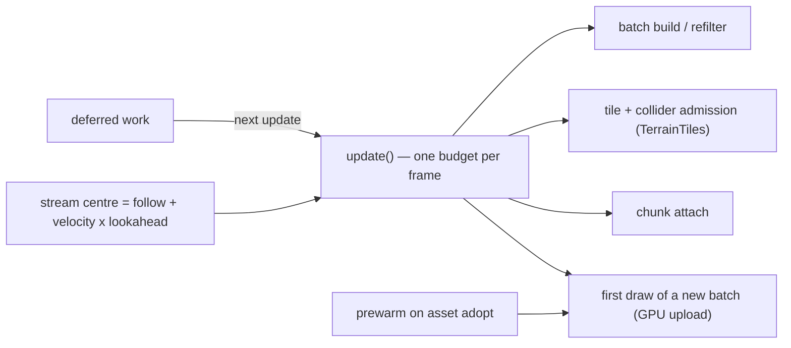

# PRD-459 — Smooth streaming: one admission budget per frame, prefetched ahead of the camera

**Status:** NOT STARTED
**Priority:** P1 — Measured 92 ms streaming-window p95; per-frame admission budget and prefetch unbuilt.
**Complexity:** 6 (MEDIUM); risk override: none. About 8 implementation files across `core` and `playtest`, one new per-frame budget, and an admission queue that resumes across frames.
**Owner:** unassigned (drafted by Claude, 2026-09-26)
**Depends on:** None. Landed prerequisites, already on `feat/world-cells-scatter-lod`: `aded4a85a` (per-instance package `lods` + rebuild skip and the `rebuildsPerUpdate` cap) and `f7164f850` (terrain seam/LOD thrash that cost ~39 ms/frame).

## Context

Machinefall's map-walk playtest (flyover at 60 m/s, RTX Turing WebGPU) is the measured case: a 2 km
package of 218 assets and 128,233 placements over 256 cells of 128 m, streamed with 25 resident
cells at ring 2. Loads never fail — **the hitch is admission cost, not streaming**:

| Window | Frame time |
| --- | --- |
| Steady, nothing streaming | ~10 ms |
| Whole walk, p95 | 92 ms |
| Windows while cells stream in, p95 | 50–200 ms |
| Worst single frame | ~700 ms |

Three of the four admission paths have no time ceiling at all. Verified in this tree:

| Cost | Where | Bounded by |
| --- | --- | --- |
| Model loads | `ModelLoadLimiter` — `packages/core/src/world-cells.ts:360`, default 6 (`:490`, `packages/core/src/streaming.ts:132`) | loads in flight |
| Chunk attach | `addInSlices` — `packages/core/src/world-cells.ts:997`, 256 objects/frame (`packages/core/src/streaming.ts:131`) | object count, not ms |
| Cell-asset batch build | `#buildBatch` — `packages/core/src/world-cells.ts:825`: one `InstancedBatch` per level (`:835`), a synchronous pass over **every** placement in the run (`:837`), `build()` in the same call (`:859`) | nothing |
| `InstancedBatch.build` | `packages/core/src/instanced-batch.ts:173`: `new InstancedMesh` (`:178`), one `setMatrixAt` per instance (`:180`), `needsUpdate` (`:183`), `computeBoundingSphere` (`:188`) | nothing |
| Refilter | `#updateMaxDistance` — `packages/core/src/world-cells.ts:936` | `rebuildsPerUpdate`, a count (16 by default, `:485`) |
| Terrain tile + collider admission | `packages/core/src/world-tiles.ts:1700`: every level built (`:1707`), `LOD` assembled (`:1714`), the game's `createCollider` called for **every** resident tile (`:1724`) | nothing |
| GLB parse / KTX2 transcode | inside `assets.model` (`packages/core/src/assets.ts:917`) | loads in flight only; the cost lands on the adopting frame, `#admit` → `#acquire` (`packages/core/src/world-cells.ts:691`, `:706`) |
| First-use pipeline compile | `prewarm` (`packages/core/src/renderer.ts:67`) and `warmUpScene` (`packages/core/src/warmup.ts:798`) cover startup and transient effects; a streamed asset's material is adopted per cell long after both | nothing |

Two more reasons the same frames are expensive. The ring is centred on the follow point
(`packages/core/src/world-cells.ts:590`, `:651`), and `IWorldCellsFollow` carries a position and
nothing else (`:34`) — so a 60 m/s camera discovers each cell on the frame it needs it. And a
material first drawn by a cell that streamed in after warm-up pays its pipeline creation on that
frame, which is what the census in `packages/core/src/pipeline-census.ts` exists to attribute.

## Solution

One millisecond budget per frame, shared by every admission path, plus a stream centre that leads
the camera and a warm-up that runs before the first draw.

1. **A shared admission budget.** `WorldCells.update` opens one budget per call from
   `admissionBudgetMs` (default 2) and every admission path draws on it: batch builds, refilters,
   terrain tile + collider creation, chunk attach, and the first draw of a newly attached batch
   (the GPU upload). Work that does not fit is left in a per-cell queue and resumed on the next
   `update`; nothing is dropped, and `stats()` reports the backlog, the deferred count and the
   milliseconds spent. `TerrainTiles.process` takes the same budget as an optional argument, so a
   tile it could not afford is simply not admitted this pass — the `wanted` scan is already
   re-run every step (`packages/core/src/world-tiles.ts:1505`).
2. **Prefetch ahead of the motion.** The stream centre is `follow.position + velocity ×
   lookaheadSeconds`, with velocity measured from successive follow positions and smoothed; a
   stationary follow point yields no lookahead and costs nothing. Residency, the refilter gates
   and the terrain follow point all read the same centre, so the budget, the ring and the terrain
   cannot disagree about where the player will be.
3. **Warm the pipelines a streamed material needs.** On adopting an asset, the shared
   `prewarm` is called for its levels' surfaces once per asset (refcounted with the asset, not per
   cell), so the first frame that draws the batch finds its pipeline in the cache.

**Non-goals:** ring size, `maxDistance` and `lods` semantics; anything about how a cell looks;
AutoLOD, GPU-driven culling or impostors (see the folder README's *Later* list); and any
performance claim for the private 2 km map, whose own PRD owns that run.

**Risks:**
- A budget can starve: a player who outruns the backlog sees cells arrive late. The backlog count
  in `stats()` is the honest signal, and the pressure caps still refuse rather than queue forever.
- Deriving velocity from successive follow positions is wrong for a teleporting follow target; the
  derived speed is clamped to a sane maximum per update and an explicit override exists.
- Mobile does not transcode compressed textures at all
  (`packages/runtime-native/AGENTS.md:88`), so the parse cost this PRD slices is smaller there and
  no mobile frame claim is made without a device run.

## Acceptance Criteria

- [ ] AC-1 [local; actor: agent]: with a deliberately slow unit of admission work, no `update` spends more than `admissionBudgetMs` plus one unit, the deferred work is admitted on later frames, and `stats()` reports the backlog and the milliseconds spent — proof: `pnpm --filter @threenative/core test world-cells-admission` — Evidence: pending.
- [ ] AC-2 [local; actor: agent]: a scripted constant-velocity follow path admits cells before the follow point reaches them, and a stationary follow point admits nothing ahead of itself — proof: `pnpm --filter @threenative/core test world-cells-prefetch` — Evidence: pending.
- [ ] AC-3 [local; actor: agent]: a streamed asset's pipelines are created before the first frame that draws its batch; the pipeline census records no creation attributable to a streamed batch after warm-up — proof: `pnpm --filter @threenative/core test world-cells-admission` plus `pnpm --filter abyss-framework playtest:world` — Evidence: **measured 2026-10-04, not met.** The Machinefall map-walk census carries **8** creations attributable to a streamed batch after `startup.compileSettledMs` in each of 5 runs on `origin/develop` (7 main pass, 1 shadow caster half; device service 1.1–1.6 ms). They are `#dressGpu`'s fresh objects: a key dressed after the prewarm gate cannot be re-dressed in place, so its first draw builds the node. `TN_WORLD_PREWARM shadowPrewarmed=0 castersUnbuilt=182` says the same about the prewarm — three's `getDrawParameters()` returns `null` at `count === 0`, so a prewarmed empty batch is never submitted and its "wait for a draw" plan cannot build anything. Two attempts to close it with the engine's `compileAsync` seam both failed on the walk itself: deferring the swap to the compile hangs a live renderer (900 s timeout, `.afk/scratch/walk-a7-r2-1`), and doing it behind the loading gate serialises ~200 key compiles behind `prewarmed` and does the same (`walk-a7b-r2-1`, aborted at 10 min). AC-3 needs a preparation seam that does not borrow the renderer's frame, which is [PRD-387](../performance/critical/PRD-387-shader-variants-are-prepared-off-frame-and-bounded.md)'s open Phase 1; see the runbook's "Where we stand".
- [ ] AC-4 [local; actor: agent]: the `world-flythrough` playtest holds frame p95 ≤ 16.7 ms and max frame ≤ 33 ms while cells stream, on the dev machine's named WebGPU adapter — proof: `node packages/playtest/dist/runner/cli.js examples/abyss-framework/playtests/world-flythrough.playtest.json --url … --browser-recipe webgpu` — Evidence: pending.
- [ ] AC-5 [local; actor: agent]: the same run keeps its residency assertions and reports 0 failed loads, with the new `maxFrameMs` performance key failing when the ceiling is exceeded (red control at 1 ms) — proof: `pnpm --filter @threenative/core test` + the playtest above — Evidence: pending.
- [ ] AC-6 [local; actor: agent; needs a built desktop host]: the same scenario runs `--target desktop` with matching residency counts and 0 failures; the frame ceiling is not claimed for the native lane — proof: `node packages/playtest/dist/runner/cli.js examples/abyss-framework/playtests/world-flythrough.desktop.playtest.json --target desktop --executable <pkg>` — Evidence: pending.

## Integration Ledger

| Capability | Reachable consumer/trigger | Replaces / disposition | Evidence |
| --- | --- | --- | --- |
| Admission budget | A game adds `WorldCells` to its scene; the loop calls `update(renderer)` once per rendered frame (`processCadence: "render"`) | Unbounded per-frame admission; `rebuildsPerUpdate` stays as a secondary count cap | AC-1, AC-4 |
| Stream centre | The same `update`, reading the same `follow` object the game already passes | Ring centred on the follow point (`world-cells.ts:590`) | AC-2 |
| Streamed-material warm-up | Asset adoption inside the same `update` path, through the existing `prewarm` export | First-use compile on the first streaming frame | AC-3 |
| `assert.performance.maxFrameMs` | Any playtest scenario JSON through `packages/playtest/src/scenario/` | New key; `maxFrameMsP95` and `maxPhaseMsP95` unchanged | AC-5 |

## Execution Phases

#### Phase 1: One shared admission budget

**Status:** NOT STARTED
**Files:** `packages/core/src/world-cells.ts` (budget, queue, `stats()`), `packages/core/src/world-tiles.ts` (optional budget argument on `process`), `packages/core/__tests__/world-cells-admission.spec.ts`.
**Implementation:** a budget object created per `update` and threaded to the terrain call; batch build, refilter and chunk attach stop at the deadline and leave a resumable queue; a deferred cell keeps its residency slot so budgets are not spent on work that will be thrown away; `stats().admission` reports `spentMs`, `deferred` and `backlog`. The clock is injectable the way `IAddInSlicesOptions.yieldFrame` already is, so the spec proves the ceiling instead of hoping.
**Verification:** `pnpm --filter @threenative/core test world-cells-admission world-cells` — AC-1, and the existing residency/cancellation suites must stay green.
- [ ] budget ceiling + resumable queue, red first against an unbounded build. proof: `pnpm --filter @threenative/core test world-cells-admission`
- [ ] terrain tile/collider admission draws on the same budget. proof: `pnpm --filter @threenative/core test world-tiles`
- [ ] `stats().admission` reported and the existing world suites green. proof: `pnpm --filter @threenative/core test world`

**Checkpoint:** pending

#### Phase 2: Prefetch and warm-up

**Status:** NOT STARTED
**Files:** `packages/core/src/world-cells.ts` (stream centre, `lookaheadSeconds`, `prewarm` on adopt), `packages/core/src/renderer.ts` (only if `prewarm` cannot reach an adopted level's surface), `packages/core/__tests__/world-cells-prefetch.spec.ts`, `examples/abyss-framework/src/scenes/WorldProbe.ts` (report the new counters).
**Implementation:** measure velocity from successive follow positions with a clamp and an explicit override; one stream centre feeds residency, refilter gates and the terrain follow point; `prewarm` each asset's level surfaces once per asset.
**Verification:** `pnpm --filter @threenative/core test world-cells-prefetch` — AC-2; the census assertion in `world-cells-admission` covers AC-3.
- [ ] stream centre leads the follow point by velocity × lookahead, clamped. proof: `pnpm --filter @threenative/core test world-cells-prefetch`
- [ ] adopted asset surfaces prewarmed once per asset, not per cell. proof: `pnpm --filter @threenative/core test world-cells-admission`
- [ ] probe reports the new counters for the playtest. proof: `pnpm --filter abyss-framework build`

**Checkpoint:** pending

#### Phase 3: The measured gate

**Status:** NOT STARTED
**Files:** `packages/playtest/src/scenario/schema-base.ts`, `packages/playtest/src/scenario/generated-assertion-validators.ts`, `packages/playtest/src/evaluators/render-evidence.ts` (new `maxFrameMs` key), `examples/abyss-framework/playtests/world-flythrough.playtest.json`, `world-flythrough.desktop.playtest.json`.
**Implementation:** add the absolute-max frame key next to `maxFrameMsP95`, with its own red-green; set the ceilings from the measured baseline, not from the target.
**Verification:** the playtest runs below — AC-4, AC-5, AC-6.
- [ ] `assert.performance.maxFrameMs` exists, fails closed, and has a red control. proof: `pnpm --filter @threenative/playtest test`
- [ ] web run: p95 ≤ 16.7 ms, max ≤ 33 ms, 0 failures, adapter named. proof: `node packages/playtest/dist/runner/cli.js examples/abyss-framework/playtests/world-flythrough.playtest.json --url 'http://127.0.0.1:5181/?world' --browser-recipe webgpu`
- [ ] desktop-native run: matching residency, 0 failures. proof: `node packages/playtest/dist/runner/cli.js examples/abyss-framework/playtests/world-flythrough.desktop.playtest.json --target desktop --executable <pkg>`

**Checkpoint:** pending
