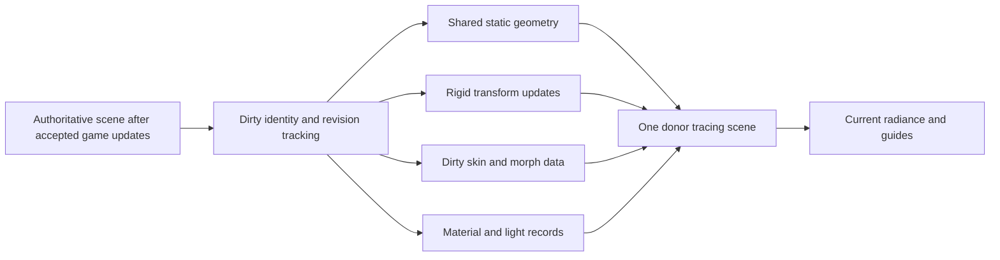

# PRD-dynamic-path-tracing-scene — Keep traced materials and geometry synchronized with the game

**Status:** NOT STARTED
**Priority:** P2 — Moving, deformed and off-camera scene content is not yet qualified in the tracing consumer.
**Progress:** 0%
**Owner:** ThreeNative rendering implementation agent
**Depends on:** `PRD-webgpu-path-tracing` frame-packet/consumer contract; its installed integration must pass before this PRD closes.
**Complexity:** 6 (MEDIUM); 6–10 implementation files + new scene adapter + asynchronous revision state.
**Risk override:** HIGH for geometry identity, deformation correctness and stale GPU resource use.
**Planning baseline:** `develop@a683fcff3b598acdd3fd47760b1be2dfd64f914e`, inspected 2026-10-06.

## Context

`packages/core/src/gpu-scene-bvh.ts` explicitly takes a static world-space snapshot until
`rebuild()`. It flattens instances and reconstructs a CPU SAH BVH. That is a useful query
mechanism, not an incremental tracing scene. Its positions/normals/indices/material-group
ranges are not a complete PBR material database. Mesh-group material numbers alone cannot
uniquely identify the materials of different source objects.

ThreeNative already owns animation, instance projection and previous-pose mechanisms. The
tracer must consume the same authored state, not introduce another animation controller,
scene graph or physics authority. The donor's dynamic-scene mechanisms should be adapted
before independently rebuilding equivalent BVH packing code.

## Goal and non-goals

The same ordinary game scene that rasterizes after a transform, skeletal animation, morph,
material/light edit or object removal must trace that accepted state. Rigid motion and lighting
edits must not force full static-scene repacking every frame. Off-camera objects needed by
secondary rays must remain represented while resident.

Out of scope: unlimited open-world residency, arbitrary shader displacement/TSL compilation,
meshlets, full-scene GPU BVH construction from scratch, replacing `GPUSceneBVH` for existing
query consumers, a new persistent scene format, and native hardware RT. Deformed foliage driven
by unsupported custom shader code must be explicitly refused, not traced as an unmoving proxy.

## Solution

Extend the adopted donor scene representation with a thin game-owned adapter. Investigate its
current update APIs first; do not require a TLAS/BLAS implementation when bounded donor refit
already meets the measured outcome. Prefer local-space shared geometry and transform instances
when available. Otherwise use bounded dirty-region repacking/refit with measured costs and a
written reason. Retain one authoritative map from source Three object/material identity to
GPU indices. Do not create both a donor tracing BVH and an unrelated `GPUSceneBVH` copy for the
same transport work.

A source object has stable identity across transform/material changes. Replacement/removal
changes a generation so a reused slot cannot validate old history. Triangle reordering must
carry the matching material/surface mapping. Track separately topology, vertex/deformation,
transform, material, light and environment revisions. These are in-memory adapter metadata,
not a user-authored scene schema or parallel global history service.

### Frame and update semantics

Use the existing per-draw scheduling boundary after the final fixed update. Ensure writes
permitted by `Scene.render`/`ctx.beforeRender` are included before tracing; audit actual order
rather than assuming these hooks are interchangeable. Trace geometry and guide outputs use
the same current pose and camera. Publish revision n atomically with all resources needed to
trace n. Never combine a new material table with an old reordered index buffer.

Rigid transforms update instance data/bounds without rebuilding unchanged triangle topology.
Skinned/morph geometry uses the renderer's accepted pose: morph then skin according to the
actual Three deformation order, bind/inverse transforms included. World normals must reflect
that deformation and nonuniform transforms; reading an undeformed normal attribute is not
sufficient. Preserve mirrored winding/face rules or reject by name. Avoid frame-sized GPU
readback of deformation. A bounded CPU path is allowed only if it meets the cost gate; do not
claim GPU refit because shader traversal is on the GPU.

An asynchronous rebuild belongs to a source generation/revision. Coalesce superseded work;
late completion cannot publish into a removed/replaced scene. If a required topology update
cannot be ready, explicitly hold or show the configured fallback and mark the traced frame
invalid. Never draw the stale geometry while reporting the new revision as current. Measure
latency and memory of overlapping builds; their allocations remain inside the parent's cap.

### Materials and visibility

Keep a global, object-qualified material table including UV transforms, texture identity and
colour space, normal maps, roughness/metalness, emissive parameters, alpha cutoff and supported
physical transmission/IOR/thickness. Preserve per-triangle materials after BVH reordering and
instancing. Support ordinary standard/physical materials; other paths require explicit adapters
or named rejection. Unsupported material changes must not leave an old surface silently active.

Do not equate the raster projection's frustum-culling output with the ray-visible scene.
Authored removal/visibility and explicit trace-inclusion policy remain authoritative; ordinary
camera culling alone cannot remove a reflection/GI participant. Alpha-tested geometry needs
its texture/UV-aware visibility evaluation, not opaque triangles. Broad transparent layering
and camera-dependent billboards may be refused if donor semantics cannot represent them.

Changing lights/environment invalidates illumination history even when every motion vector
is zero. Publish that fact in the parent frame packet; the reconstruction consumer decides
how to reject/reuse history. This adapter does not allocate its own radiance history.

## Integration Ledger

| Capability | Consumer/trigger | Replaces / disposition | Proof owner |
|---|---|---|---|
| Rigid/deformed tracing | Accepted game writes -> proposed example `src/render/traceScene.ts` -> donor update | Donor static setup remains; per-frame full rebuild is eliminated for supported updates | P1, P3 |
| Material identity | `ctx.assets` loaded meshes/materials -> same tracing scene | No second material source or stale group-index shortcut | P4 |
| Ray-visible residency | Authoritative scene inclusion -> tracing snapshot | Raster projection remains unchanged and is not ray visibility | P5 |
| Revision publication | Async build completion -> current GPU frame packet | Superseded generations discarded; no competing history owner | P2 |

## Execution Phases

### Phase 1: Rigid edits and topology changes are coherent

**Status:** NOT STARTED
**Files:** proposed `examples/path-tracing/src/render/traceScene.ts`,
`traceRevisions.ts`, parent `pathTracing.ts` and targeted donor patch only if necessary.
Use the parent consumer and packet. Keep identity/state tests focused on the actual adapter.

- [ ] P1 [shared; actor: rendering agent on hardware browser runner]: A moving rigid instance changes its traced hit positions in the next accepted draw without a full unchanged-geometry BVH rebuild. proof: planned `pnpm --filter threenative-path-tracing test:rigid:web` (E1).
- [ ] P2 [local; actor: implementation agent]: Add/remove/topology changes publish one complete scene revision and discard late superseded completions, including slot reuse and scene disposal. proof: planned `pnpm exec vitest run examples/path-tracing/__tests__/trace-revisions.spec.ts` (E2).

**Checkpoint:** pending. Pair a real changing hit-position observation with update/build counters;
a counter alone cannot prove the new transform reaches the tracer.

### Phase 2: Deformation and surface data follow the same pose

**Status:** NOT STARTED
**Files:** same adapter plus proposed `src/render/traceDeformation.ts`,
`traceMaterials.ts`, `src/world/animatedShowcase.ts`; reuse existing animation/public loaders.

- [ ] P3 [shared; actor: hardware browser runner]: A skeletal root-motion rig and a morphing object have matching current traced positions/normals and raster guides, within 0.5 source pixel for non-edge primary hits. proof: planned `pnpm --filter threenative-path-tracing test:deformation:web` (E3).
- [ ] P4 [shared; actor: hardware browser runner]: Multiple objects with colliding local group indices retain their own textures/PBR properties after BVH reordering, material edits and alpha testing. proof: planned `pnpm --filter threenative-path-tracing test:materials:web` (E4).

**Checkpoint:** pending. Include nonuniform parent transforms, bound skeletons, two instances of
one mesh with distinct source materials and a textured cutout. The guide exclusion mask is fixed
from independent geometry coverage, not chosen from candidate errors.

### Phase 3: Secondary visibility and update cost survive animation

**Status:** NOT STARTED
**Files:** same example and proposed `playtests/dynamic-tracing.playtest.json`; extend the
parent observation/measurement path rather than create another harness.

- [ ] P5 [shared; actor: hardware browser runner]: Turning the camera away from a still-resident object preserves its mirror appearance and bounced-light contribution, while actual removal updates both. proof: planned `pnpm --filter threenative-path-tracing test:secondary-visibility:web` (E5).
- [ ] P6 [shared; actor: hardware browser runner]: The frozen dynamic fixture updates under <=2 ms p95 CPU submission and <=4 ms p95 GPU deformation/BVH work, with no geometry rebuild on settled or light-only frames. proof: planned `pnpm --filter threenative-path-tracing bench:dynamic:web` (E6).

**Checkpoint:** pending. Budgets are proposed acceptance limits, not measured performance.
Count any CPU donor refit in CPU cost and all GPU refit/deformation in GPU cost; asynchronous
work is not free merely because it completes after the sampled callback.

## Acceptance Criteria

- [ ] A1 [shared; actor: rendering agent on the Linux native host]: The installed dynamic scene passes the same rigid/deformation/material/secondary-visibility scenario using its native GPU output. proof: planned `pnpm --filter threenative-path-tracing test:dynamic:desktop` (E7).
- [ ] A2 [shared; actor: hardware browser runner]: Fifty add/remove/rebuild cycles preserve stable surviving-object identities and return tracing-owned allocations to the settled baseline without stale result publication. proof: planned `pnpm --filter threenative-path-tracing test:dynamic-lifecycle:web` (E8).

## Verification contract

Extend the parent 100k–250k-triangle showcase with 32 moving rigid instances, two animated rigs
(up to 64 bones each; 20k–40k total deforming triangles) and one morphing mesh. Freeze counts,
assets, current/previous poses and camera before comparisons; do not reduce the workload to
pass. Keep the same fixed 1280x720/one-SPP/four-bounce tracing settings for cost comparisons.
Use 300 warm-up and 1,800 measured draws, three paired trials with a settled-scene control,
on an identified RTX 2080 hardware browser runner. Report distributions and contention; a
noisy/invalid trial is retained as invalid, not selectively dropped to create a passing result.

E3 compares primary-hit projection with independently produced raster guides and CPU Three
pose samples; secondary visibility uses high-SPP pose references from the parent protocol.
Do not demand low-SPP radiance equality before reconstruction exists. A stopped/deformation-
update-disabled control must fail the actual moving-hit assertions. Other unchanged regression
checks need no manufactured failures. Unsupported content must fail by object/material name.

## Dependencies and execution order

The parent integration may be developed in parallel until the frame contract stabilizes;
combined-source browser/native evidence is required before closure. PR #398 remains the owner
of authored previous-transform motion history; do not duplicate it here. This PRD supplies
current tracing geometry and revisions, not temporal AA or completed motion-history repairs.

## Blocked on

Parent installed integration and access to the existing browser/Linux GPU lanes gate the
corresponding tests. Native execution is required for closure; other platforms and open-world
streaming are not claimed. If donor update mechanisms cannot meet the bounded cost limit,
record the actual bottleneck and keep the unmet box open rather than silently weaken the limit
or turn this task into an unlimited BVH rewrite.

## Execution and evidence rules

This filing authorizes documentation only. All implementation, GPU, performance and platform
results are pending. Proposed files and commands below do not yet exist; the implementation
must wire them into the existing example/package scripts and playtest runner before citing a
pass. Do not build a second scenario runner, composer, scene format or application loop.

Use the repository's capability search/detail before executable changes. Keep appearance in
editable game-owned `src/render/` source; any admitted core change is only shared mechanism.
The charter forbids a replacement framework renderer: this is an ordinary game's use of a
third-party Three.js rendering library, not a new core rendering backend. Dependencies stay
out of ordinary scaffold/runtime imports. No change to default tiers is authorized.

Each checkbox below is one required outcome and one evidence owner. Phase boxes P1–P6 and
acceptance boxes A1–A2 are the complete eight-item checklist; do not duplicate them in another
completion ledger. Every runtime claim needs actual pixels/state through the consumer, not
just a mock, shader compile, draw count or registration. Keep exact source/dependency/config,
asset and runner identities with the existing playtest result. Temporary negative controls
must be isolated, restored and never shipped. Do not substitute SwiftShader for hardware cost.

After each substantive phase, self-review the changed boundary and its evidence; use one
independent reviewer when available, otherwise label self-review. Only rerun checks invalidated
by a change. Reuse the existing GPU/capture lease and coordinate CPU/GPU contention; no parallel
benchmark arms on one device. Documentation gates are `pnpm check:docs` and the root
AGENTS.md prose-only Vitest lane. Run `pnpm prd:progress <this-file>` before implementation and
after each phase. No new per-feature workflow, release, merge, paid compute or auto-merge is
authorized. Missing required evidence keeps the PRD open, even when implementation is present.

## Sources

- [Static GPU snapshot](https://github.com/ThreeNativeHQ/threenative/blob/a683fcff3b598acdd3fd47760b1be2dfd64f914e/packages/core/src/gpu-scene-bvh.ts), [public scene lifecycle](https://github.com/ThreeNativeHQ/threenative/blob/a683fcff3b598acdd3fd47760b1be2dfd64f914e/packages/core/src/scene.ts), [dependency cohort](https://github.com/ThreeNativeHQ/threenative/blob/a683fcff3b598acdd3fd47760b1be2dfd64f914e/pnpm-workspace.yaml).
- [Existing motion/history work](https://github.com/ThreeNativeHQ/threenative/pull/398), [instanced skinning work](https://github.com/ThreeNativeHQ/threenative/pull/335).
- [Donor scene/material support](https://github.com/gkjohnson/three-gpu-pathtracer). Select and record an immutable compatible revision through the parent PRD.
