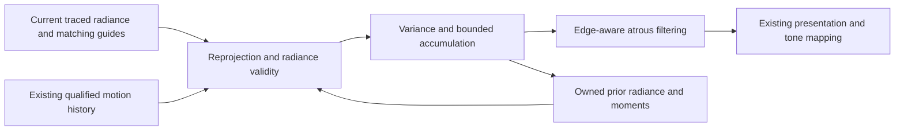

# PRD-low-spp-radiance-reconstruction — Reconstruct moving path-traced lighting without neural weights

**Status:** NOT STARTED
**Priority:** P2 — Low-sample moving lighting is not yet reconstructed into a qualified interactive result.
**Progress:** 0%
**Owner:** ThreeNative rendering implementation agent
**Depends on:** `PRD-webgpu-path-tracing`; `PRD-dynamic-path-tracing-scene` for the dynamic acceptance corpus; PRD-269 motion-history outcomes owned by PR #398 for required moving guides.
**Complexity:** 7 (HIGH); 11+ implementation files + new reconstruction module + GPU temporal state.
**Risk override:** None; correctness, memory and full-frame performance are explicitly qualified.
**Planning baseline:** `develop@a683fcff3b598acdd3fd47760b1be2dfd64f914e`, inspected 2026-10-06.

## Context

The generated WorldEnvironment has spatial denoising for SSGI/GTAO. It is not a qualified
low-SPP path-radiance denoiser. PR #398 consolidates authored motion history and temporal
AA/reconstruction, remains draft/unmerged at the inspected checkpoint, and retains open
image-quality/performance/platform gates. A valid surface motion vector does not establish
that old illumination is still valid: a moving light can change radiance with zero geometry
motion, and moving reflections can disagree with first-surface reprojection.

Use a classical variance-guided temporal/spatial baseline before a neural model. The SVGF paper
provides the algorithmic reference, not a promise about our performance. This PRD adds
radiance-specific reconstruction, while reusing the existing motion owner and resource lifecycle.

## Goal and non-goals

The installed path-tracing example renders stable moving diffuse/glossy lighting from one
fresh path per pixel with bounded disocclusion and lighting-change lag, on browser and Linux
native. It must beat matched raw and spatial-only controls at the agreed quality/cost points.

Out of scope: neural training/inference, frame generation, speculative 64–256-SPP-equivalence
claims, dynamic-resolution policy replacement, default-tier rollout, perfect glass/caustic
reconstruction, unlimited scenes, and closing PRD-455 on behalf of #398. This slice reconstructs
at equal 1280x720 input/output resolution to isolate denoising; temporal upscaling stays with
PRD-455. The optional neural successor cannot block this baseline's completion.

## Solution and ownership

Keep the chosen filters and thresholds in editable game-owned render source. Use one existing
RenderChain. The parent packet supplies noisy unexposed linear HDR and current geometry;
qualified #398 motion supplies current-to-previous mapping. Record coordinate origin, units,
y-axis sign, jitter treatment and source dimensions explicitly, and test them in the installed
consumer. A missing motion source is a named unsupported temporal mode, not valid zero motion.

The denoiser owns radiance/moment ping-pong targets only. It must not create another transform,
bone, instance or camera history system. Reuse #398's existing scheduling/reset contract; where
a shared mechanism needs repair, change its canonical owner and reference the exact integrated
revision. The full temporal-upscaling PRD need not be finished to prototype static radiance,
but every consumed motion property needs its own current combined-source proof before closure.

### Data and numerical contract

Use stable source surface identity, linear depth, normalized world normal, linear base colour,
roughness, hit/miss validity and matching draw-frame id. Separate diffuse/specular signals and
specular hit distance when the donor can expose them without doubling the trace. If not,
explicitly record a combined-radiance mode and conservatively reject glossy history; do not
invent nonexistent auxiliary buffers. Material/light/environment revisions participate in
history validation. A glass first-hit guide cannot falsely validate the refracted background;
use labelled current-frame/spatial treatment for unqualified transmission paths.

History is pre-exposure scene-linear radiance. Apply exposure/tone mapping downstream once;
changes to exposure alone must not act as changes to scene lighting. Initial/missing/invalid
history uses current data, zero history length and finite moments. Track first/second luminance
moments, variance and confidence; cap effective history to 32 frames in the initial preset.
Clamp invalid negative radiance only according to a documented signal policy and report
nonfinite outputs. No epsilon should hide a broken buffer or divide by zero.

Reproject with motion and validate the whole bilinear footprint against identity/depth/normal.
Reject invalid pixels, camera cuts, resize, scene replacement, dropped/reordered generations
and disocclusions. Start with full radiance-history invalidation on changed analytic-light or
environment revision; any later local retention must pass the same light-change response test.
Variance and neighbourhood clipping must not preserve stale light merely because geometry
matches. Use separate roughness/hit-distance-aware rejection for specular history; spatial-
only fallback on those pixels is preferable to a falsely stable trail.

After temporal accumulation, use edge-aware multiscale filtering guided by depth/normal,
variance and material boundaries. Start with three atrous steps (1, 2, 4 texels), measured
rather than assumed sufficient. Add iterations only under the frame/memory limit. Diffuse
albedo demodulation/remodulation is permitted with a documented near-zero-albedo policy;
metallic/specular energy must not be divided by diffuse base colour.

### Scheduling and failure behavior

Trace -> produce guides -> reproject/accumulate -> spatial filter -> present occurs once per
actual draw. Commit radiance history only after the corresponding outputs are valid. No stale
frame publication, steady-state CPU image readback, blocking per-frame GPU wait, second
composer or hidden sample accumulation. Toggle-off detaches history targets without leaving
unused MRT attachments. Keep pending retirement accounted under the parent's 768 MiB cap.
Device loss cannot produce a successful quality/cost observation.

## Integration Ledger

| Capability | Reachable consumer | Replaces / disposition | Proof owner |
|---|---|---|---|
| Radiance reconstruction | Parent example attachment -> proposed `src/render/radianceReconstruction.ts` -> same RenderChain | Raw mode retained as explicit control; no extra SSGI denoiser over beauty | P1, P4 |
| Motion input | Existing #398 authored motion -> parent matching frame packet | One transform-history owner; no copied VelocityTracker | P2 |
| Lighting validity | Scene light/material revisions -> radiance reject/reset | Geometric stability alone no longer accepts old lighting | P3 |
| Interactive quality/cost | Existing installed example and playtest FrameBudget | No new benchmark engine or resolution policy | P5, A1, A2 |

## Execution Phases

### Phase 1: The real consumer has ordered, valid temporal inputs

**Status:** NOT STARTED
**Files:** proposed example `src/render/radianceReconstruction.ts`, `radianceHistory.ts`,
parent `framePacket.ts`, and existing #398 integration surfaces only where necessary.

- [ ] P1 [local; actor: implementation agent]: The actual attachment rejects mismatched frame/dimensions/coordinates, initializes finite history and retires only owned targets on cut/resize/toggle. proof: planned `pnpm exec vitest run examples/path-tracing/__tests__/radiance-history.spec.ts` (E1).
- [ ] P2 [shared; actor: rendering agent on hardware browser runner]: Rigid/instanced/skinned current-to-previous mapping reaches the active denoiser at the traced pose with <=0.5 source-pixel non-edge reprojection error. proof: planned `pnpm --filter threenative-path-tracing test:radiance-guides:web` (E2).

**Checkpoint:** pending. A zero/stale-motion control must fail the moving-footprint observation;
reuse an already observed valid red rather than manufacture equivalent controls.

### Phase 2: Radiance is reconstructed, not merely blurred

**Status:** NOT STARTED
**Files:** proposed `src/render/radianceTemporal.ts`, `radianceSpatial.ts`, game-owned
`radianceQuality.ts` and the parent's full-beauty term routing.

- [ ] P3 [shared; actor: hardware browser runner]: Revealed surfaces and a changed light with stationary geometry satisfy the response limits below rather than reusing stale radiance. proof: planned `pnpm --filter threenative-path-tracing test:radiance-response:web` (E3).
- [ ] P4 [shared; actor: hardware browser runner]: Temporal plus variance-guided filtering beats the paired raw/spatial-only image controls under the frozen quality metrics below. proof: planned `pnpm --filter threenative-path-tracing test:radiance-quality:web` (E4).

**Checkpoint:** pending. All arms consume identical captured noisy inputs, guides and sample
seeds for quality comparison; live cost uses separately identified real trace executions.

### Phase 3: Bounded integration remains stable in the running game

**Status:** NOT STARTED
**Files:** existing example scenarios/observations plus proposed `playtests/radiance.playtest.json`.
Reuse the same measurement protocol for browser/native; do not create a feature workflow.

- [ ] P5 [shared; actor: hardware browser runner]: The live dynamic showcase meets the interactive-30 quality/cost point below with one fresh SPP, four bounces and no hidden scaling or frame duplication. proof: planned `pnpm --filter threenative-path-tracing bench:radiance:web` (E5).
- [ ] P6 [shared; actor: hardware browser runner]: Fifty scene/camera/size/toggle cycles restore owned resources after retirement and display no history from an earlier generation. proof: planned `pnpm --filter threenative-path-tracing test:radiance-lifecycle:web` (E6).

**Checkpoint:** pending. Inspect actual animated sequences; aggregate image error alone cannot
qualify motion. A clean still after the camera stops is not an acceptable substitute.

## Acceptance Criteria

- [ ] A1 [shared; actor: rendering agent on the Linux native host]: The same installed consumer meets the same radiance response/quality and interactive-30 limits using native GPU output. proof: planned `pnpm --filter threenative-path-tracing test:radiance:desktop` (E7).
- [ ] A2 [local; actor: implementation agent]: A fresh installed recipe enables this classical reconstruction through the existing render chain without neural/model dependencies or changes to ordinary templates. proof: planned `pnpm --filter threenative-path-tracing test:consumer` (E8).

## Frozen quality and performance protocol

The parent owns asset/camera/reference generation; this PRD extends that same fixture with
camera pan, subpixel fence/cutout edges, moving rigid/glossy content, skeletal root motion,
object reveal, moving light on static geometry, environment change and camera cuts. Freeze
sequences and semantic masks before optimizing. Glass remains visible and is scored separately
under its declared spatial-only limitation; difficult pixels may not disappear from the report.

Use reference radiance from independent high-SPP RNG streams at each exact animated pose,
converged under the parent's doubling test. Fixed signal transform is `c(x)=max(x,0)/(1+max(x,0))`
per RGB channel, before display grading. Spatial error is mean absolute RGB error in c-space.
Temporal error is RMS of consecutive-frame *reference residual differences*, not raw image
change (which would reward a frozen frame). Edge/disocclusion masks come from the reference
geometry, not the candidate. Record every sequence; no best-frame selection.

Required quality: aggregate spatial MAE <=75% of raw one-SPP MAE, no sequence worse than raw;
temporal residual RMS <=80% of spatial-only; edge MAE <=110% of spatial-only. Within two new
frames after reveal, least-squares projection of the error onto the stale-versus-current
reference difference must be <=0.10 in the changed ROI. Denominator-negligible pixels are
reported separately, not scored as zero; the fixture must contain a meaningful changed ROI.
The stationary-geometry light-step ROI must reach spatial-only-reference MAE +0.02 or better
within two new frames. A history-free control identifies legitimate current-frame filter lag.
These are proposed acceptance limits, not measurements of the current engine or another demo.

**Interactive-30 required point:** RTX 2080 hardware, 1280x720 input=output, one fresh SPP,
four bounces, frozen parent dynamic scene, 300 warm-up and 1,800 measured draws, three paired
trials. Whole tracing/reconstruction/presentation GPU p95 <=28 ms; CPU frame submission p95
<=4 ms; mean actual presentation interval <=34 ms and p95 <=40 ms on a controlled display path.
Measure the whole frame, not only the filter, and include dynamic-scene update work. The
incremental 768 MiB cap includes this history and all simultaneously resident donor resources.
An invalid/noisy trial stays recorded as invalid; explain before a coordinated rerun.

A 60 FPS profile is a non-gating stretch, requiring its own measured full-frame evidence and
unchanged quality rubric. Never relabel a 30 FPS pass as 60 FPS. Optional user resolution/tier
overrides remain explicit; this acceptance point disables automatic scaling. Any subsequent
upscaling must use the existing ResolutionScaler/PRD-455 ownership, not an independent policy.

## Blocked on

Required parent dynamic-scene and #398 motion outcomes must be available in the combined
candidate. Static/no-motion filter prototyping can proceed independently; it cannot close
moving-content criteria. Browser and Linux GPU access is through existing shared runner/host
lanes. Native performance is not established by a browser run or a native bundle build.
No model, hardware-RT backend, Windows/macOS/mobile run or completion of optional neural work
is required or claimed by this bounded experiment.

## Execution and evidence rules

This filing authorizes documentation only. All implementation, GPU, performance and platform
results are pending. Proposed files and commands below do not yet exist; the implementation
must wire them into the existing example/package scripts and playtest runner before citing a
pass. Do not build a second scenario runner, composer, scene format or application loop.

Use the repository's capability search/detail before executable changes. Keep appearance in
editable game-owned `src/render/` source; any admitted core change is only shared mechanism.
The charter forbids a replacement framework renderer: this is an ordinary game's use of a
third-party Three.js rendering library, not a new core rendering backend. Dependencies stay
out of ordinary scaffold/runtime imports. No change to default tiers is authorized.

Each checkbox below is one required outcome and one evidence owner. Phase boxes P1–P6 and
acceptance boxes A1–A2 are the complete eight-item checklist; do not duplicate them in another
completion ledger. Every runtime claim needs actual pixels/state through the consumer, not
just a mock, shader compile, draw count or registration. Keep exact source/dependency/config,
asset and runner identities with the existing playtest result. Temporary negative controls
must be isolated, restored and never shipped. Do not substitute SwiftShader for hardware cost.

After each substantive phase, self-review the changed boundary and its evidence; use one
independent reviewer when available, otherwise label self-review. Only rerun checks invalidated
by a change. Reuse the existing GPU/capture lease and coordinate CPU/GPU contention; no parallel
benchmark arms on one device. Documentation gates are `pnpm check:docs` and the root
AGENTS.md prose-only Vitest lane. Run `pnpm prd:progress <this-file>` before implementation and
after each phase. No new per-feature workflow, release, merge, paid compute or auto-merge is
authorized. Missing required evidence keeps the PRD open, even when implementation is present.

## Sources

- [Current spatial effects/composition](https://github.com/ThreeNativeHQ/threenative/blob/a683fcff3b598acdd3fd47760b1be2dfd64f914e/packages/create-threenative/templates/minimal/src/render/worldEnvironment.ts), [quality tiers](https://github.com/ThreeNativeHQ/threenative/blob/a683fcff3b598acdd3fd47760b1be2dfd64f914e/packages/create-threenative/templates/minimal/src/render/quality.ts).
- [Canonical motion/temporal work #398](https://github.com/ThreeNativeHQ/threenative/pull/398), [ordinary GI planning #426](https://github.com/ThreeNativeHQ/threenative/pull/426). These owners are referenced, not closed or duplicated here.
- [SVGF primary publication](https://research.nvidia.com/labs/rtr/publication/schied2017spatiotemporal/). Algorithmic reference only; no borrowed performance claim.
