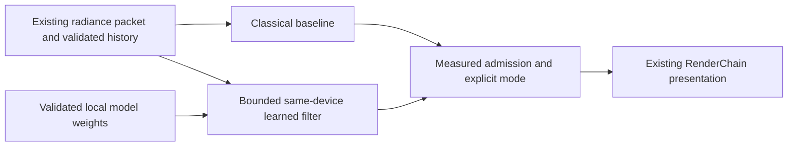

# PRD-neural-radiance-denoising — Admit a learned denoiser only when it improves the classical baseline

**Status:** NOT STARTED
**Priority:** P3 — Optional learned reconstruction has no measured advantage over a working classical baseline yet.
**Progress:** 0%
**Owner:** ThreeNative rendering implementation agent
**Depends on:** `PRD-low-spp-radiance-reconstruction` qualified packet, corpus and classical baseline; no upstream PRD depends on this one.
**Complexity:** 7 (HIGH); 11+ implementation files + learned filter integration + asynchronous GPU/model lifetime.
**Risk override:** HIGH additionally for untrusted model data and borrowed GPU resource ownership.
**Planning baseline:** `develop@a683fcff3b598acdd3fd47760b1be2dfd64f914e`, inspected 2026-10-06.

## Context

Closed/unmerged PR #380 implemented an experimental snapshot integration. Its reported
successful hardware fixture swaps red/blue channels; it does not qualify learned enhancement.
Its adapter relies on an already prepared application-owned network, while safe loading,
actual model quality and complete native qualification remained unfinished. The current
core export map does not expose that branch's `./webgpu` subpath.

This new scope is **live path-radiance denoising with measured admission**, not reopening,
replacing or claiming completion of the snapshot/OpenDLSS experiment. Recover only useful
same-device/resource-retirement mechanisms after reconciling them against the current renderer.
Do not create another provider registry or require OpenDLSS, proprietary weights, or a model
claimed to reproduce Castellano's unknown network.

## Goal and non-goals

A legally usable small model can process the same noisy HDR/guide inputs as the classical
baseline on the existing device, through the same render chain, without CPU image transport.
It is exposed in the installed experiment only when a predeclared quality/performance decision
justifies it. A well-supported NO-GO is a valid experiment result; an unrun model is not.

Out of scope: frame generation, generic ML framework development, photo/style enhancement,
OpenRouter or remote inference, extracting proprietary model weights, Tensor Core promises,
new native RT backends, training-service purchases, default enablement and universal model
loading. A shader channel-swap remains an interop control, never neural-quality evidence.

## Solution

Reuse the classical frame-packet semantics, surface/radiance validity, reference corpus,
quality metrics and presentation. Keep a game-owned single-model attachment and explicit
`classical` / `neural` / `raw` diagnostic selection. The real-time neural result must be for
the current accepted frame/generation; a frozen or delayed snapshot cannot be labelled live.
The output is denoised unexposed scene-linear radiance, followed by the same grading once.

Prefer a deliberately small trained filter over a large generic runtime. Begin with a fixed
operator graph and shapes that can be dispatched with bounded WGSL compute. A shallow CNN
predicting residuals or filter weights is a candidate, not a predetermined winner. Perform
fusion only after numerical parity and profiling show it matters. Evaluate a licensed existing
model first; otherwise train with authored/redistributable scenes on already authorized local
compute. No paid resource or data upload is implicit in this PRD.

### Model and training contract

Train/validate using the same signal definitions as inference: linear HDR, normal/depth,
base colour, roughness, current-frame noise and any explicitly validated history features.
Keep training scenes, camera trajectories and RNG seeds disjoint from held-out qualification;
individual adjacent frames are not an adequate train/test split. Include camera cuts, moving
lights on static geometry, disocclusion, thin geometry, glossy content and the declared glass
fallback. Use high-SPP targets converged by the parent's protocol, not outputs of the classical
filter. Preserve dataset/model licenses, generator revision, split identities and trained
weight hash. Do not copy private/public-demo video frames as ground-truth training radiance.

A versioned data-only model manifest names feature semantics/order, fixed operator allowlist,
shapes, dtype, normalisation, padded dimensions, output interpretation, weight bytes/hash,
and an allocation plan. The attachment actually consumes and validates these fields. Reject
unknown operators, dimensions, NaNs, truncated data, digest mismatches, integer overflow and
unbounded shape products before device allocation. No executable/shader code from a manifest.
Precompute weights, scratch and simultaneous retirement allocations before allocating.
Initial hard limits: weights <=8 MiB, additional model scratch <=128 MiB, while the entire
tracing experiment remains within the existing 768 MiB incremental live/retiring-resource cap.

Load only from explicit application-owned asset origins/local paths using the current loader
seam; byte and timeout limits apply before buffering. Cancellation, resize or scene replacement
invalidates completion and cannot publish new resources into a newer generation. A digest
mismatch is a refusal, not a silently regenerated digest. Do not expose a broad user-supplied
model marketplace. Licensed prepared model data must be available before a model pass is claimed.

### Inference and failure behavior

Borrow the actual renderer device and GPU textures/buffers. Respect the existing command
ordering and fences; no per-frame device creation, GPU-to-CPU tensor copy, duplicate camera/
transform history, backend-private access in generated game source or `device.destroy()`.
Put any necessary guarded backend/resource bridge in the existing core mechanism seam, with
native proof, rather than leaking native/Dawn internals into the game. Reconcile #380's narrow
bridge with current mechanisms and keep its license notice where code is adopted.

Use same-frame scheduling after the trace and before presentation. Model inference uses the
same accepted history validity as the baseline; invalid radiance history cannot become a hidden
neural input. A temporal model may keep bounded feature history only when its reset/validity
follows this same owner; it does not take over motion tracking. Swapping models flushes feature
history. Fixed-shape kernels must handle padded boundaries without writing outside valid pixels.

Before model readiness, after rejection, or when an explicit capability check fails, the
classical path remains visible with a reason and the failed/pending model is not counted as
applied. Never wait synchronously for inference completion in a frame or substitute an old
neural result. Post-device-loss recovery follows the renderer's generation, not a replacement
GPU device created by the plugin. Detach graph references and safely retire owned resources;
preserve borrowed scene textures, model owners and the device.

## Integration Ledger

| Capability | Reachable consumer | Replaces / disposition | Proof owner |
|---|---|---|---|
| Model admission | Explicit example model asset -> proposed `src/render/neural/model.ts` -> GPU allocation | Single bounded model, not a provider registry or arbitrary executable manifest | P1 |
| Actual inference | Parent live packet -> proposed `src/render/neural/denoise.ts` -> existing chain | Replaces classical stage only in admitted explicit neural mode | P3, P4 |
| Safe lifecycle | Scene/model/size generation -> existing renderer retirement | Reuse #380 seam only after current-source validation; no snapshot claim | P5 |
| Product decision | Same frozen benchmark -> GO/NO-GO -> installed experiment | Classical baseline remains independently usable; optional neural cannot block it | P6, A1, A2 |

## Execution Phases

### Phase 1: A real licensed model fits the existing signal and allocation contract

**Status:** NOT STARTED
**Files:** proposed example `src/render/neural/model.ts`, `modelContract.ts`,
a local-only training recipe under the example, and model provenance in the owning PRD/asset
metadata. Do not add a separate evidence-report framework or commit large training corpora.

- [ ] P1 [local; actor: implementation agent]: The consumer rejects malformed/oversized/mismatched model data before allocation and handles cancel/replace without accepting stale weights. proof: planned `pnpm exec vitest run examples/path-tracing/__tests__/neural-model.spec.ts` (E1).
- [ ] P2 [local; actor: implementation agent]: A licensed prepared or locally trained model has a reproducible feature contract and disjoint held-out sequence set matching the actual tracing input/target definitions. proof: planned `pnpm --filter threenative-path-tracing test:model-data` (E2).

**Checkpoint:** pending. No weights are supplied by this filing. If local authorized training
or a compatible licensed model is unavailable, report that dependency under Blocked on;
a channel-swap fixture cannot satisfy P2.

### Phase 2: Same-device inference produces real denoised radiance

**Status:** NOT STARTED
**Files:** proposed `src/render/neural/denoise.ts`, `kernels.ts`, parent attachment;
a narrow optional core interop seam only when current capability inspection proves it absent.

- [ ] P3 [shared; actor: rendering agent on hardware browser runner]: Actual model GPU output matches the held-out reference inference within RMS 0.002 and max 0.02 in bounded c-space, with finite unexposed HDR output. proof: planned `pnpm --filter threenative-path-tracing test:neural-parity:web` (E3).
- [ ] P4 [shared; actor: hardware browser runner]: The installed live scene presents current-generation neural radiance without steady-state CPU image readback, duplicate presentation or delayed snapshot substitution. proof: planned `pnpm --filter threenative-path-tracing test:neural-live:web` (E4).

**Checkpoint:** pending. Reference inference may run offline on CPU for parity only. Capture
readback belongs to qualification instrumentation and must be distinguishable from the
rendering data path. A bypassed/zero-residual model control must alter the output assertions.

### Phase 3: Lifecycle and measured admission decide whether it ships

**Status:** NOT STARTED
**Files:** same example and proposed `playtests/neural-denoising.playtest.json`; reuse the
classical benchmark and resource/capture observations.

- [ ] P5 [shared; actor: hardware browser runner]: Fifty load/cancel/model-switch/resize/scene-exit cycles preserve the classical fallback and restore owned model/history allocations after retirement. proof: planned `pnpm --filter threenative-path-tracing test:neural-lifecycle:web` (E5).
- [ ] P6 [shared; actor: hardware browser runner]: The frozen held-out benchmark produces a supported GO or NO-GO under the admission rule below, from real model and classical executions. proof: planned `pnpm --filter threenative-path-tracing bench:neural:web` (E6).

**Checkpoint:** pending. A NO-GO is not a learned-rendering success. It must preserve the
measured reason, remove ordinary runtime reach to the rejected provider and leave the classical
consumer intact. Retain only explicitly experimental/reference code justified by the decision.

## Acceptance Criteria

- [ ] A1 [shared; actor: rendering agent on the Linux native host]: The same installed model/consumer executes the real neural path and independently reports native numerical parity plus GO or NO-GO under the same quality/cost rules. proof: planned `pnpm --filter threenative-path-tracing test:neural:desktop` (E7).
- [ ] A2 [local; actor: implementation agent]: The installed recipe enforces the recorded per-target decision: GO exposes explicit neural mode, NO-GO excludes promotion, and the independent classical baseline works without loading weights. proof: planned `pnpm --filter threenative-path-tracing test:consumer` (E8).

## Admission rule and verification

Use exactly the classical PRD's held-out dynamic corpus, fixed 1280x720, one fresh SPP, four
bounces, resource cap, warm-up/sample counts, paired-trial protocol and error metrics. For
quality replay, both methods receive identical noisy packet sequences. For cost, execute real
trace/model/classical work; do not compare cached neural frames against live classical work.
Report per-sequence errors and whole-frame CPU/GPU/presentation cost, not only network time.

GO requires all safety, parity, response, lifecycle and interactive-30 criteria, then either:

**Quality route:** aggregate spatial MAE at least 10% below classical, no sequence/edge/temporal
metric more than 2% worse, and whole-frame GPU p95 no more than 2 ms above classical while
remaining <=28 ms.

**Speed route:** whole-frame GPU p95 at least 10% below classical, with spatial/edge/temporal
metrics no more than 2% worse on any sequence and every classical response bound preserved.

For both routes, denoiser GPU p95 must be <=3 ms at the fixed source dimensions. These are
proposed engineering limits, not Castellano's timings or a prediction of attainable speed.
An unqualified trial, missing weights, missing native run or mock inference is not a NO-GO
experiment completion; it is missing evidence. Apply decisions per tested target. Do not
average a regression on one platform away with a win on another. A rejected model does not
stop completion of the classical PRD or make that earlier work dependent on this experiment.

## Blocked on

A qualified classical baseline and legal compatible model/training data are required before
comparison. Local training may use only already authorized resources; any need for paid
training/remote inference requires separate approval and is not an autonomous phase step.
Existing browser/Linux GPU lanes must be reachable for P3–P6/A1. Native/model proof remains
completion-blocking when unavailable. Neither this PRD nor #380 authorizes proprietary weight
extraction, a model license assumption, a production rollout or a claim of DLSS support.

## Execution and evidence rules

This filing authorizes documentation only. All implementation, GPU, performance and platform
results are pending. Proposed files and commands below do not yet exist; the implementation
must wire them into the existing example/package scripts and playtest runner before citing a
pass. Do not build a second scenario runner, composer, scene format or application loop.

Use the repository's capability search/detail before executable changes. Keep appearance in
editable game-owned `src/render/` source; any admitted core change is only shared mechanism.
The charter forbids a replacement framework renderer: this is an ordinary game's use of a
third-party Three.js rendering library, not a new core rendering backend. Dependencies stay
out of ordinary scaffold/runtime imports. No change to default tiers is authorized.

Each checkbox below is one required outcome and one evidence owner. Phase boxes P1–P6 and
acceptance boxes A1–A2 are the complete eight-item checklist; do not duplicate them in another
completion ledger. Every runtime claim needs actual pixels/state through the consumer, not
just a mock, shader compile, draw count or registration. Keep exact source/dependency/config,
asset and runner identities with the existing playtest result. Temporary negative controls
must be isolated, restored and never shipped. Do not substitute SwiftShader for hardware cost.

After each substantive phase, self-review the changed boundary and its evidence; use one
independent reviewer when available, otherwise label self-review. Only rerun checks invalidated
by a change. Reuse the existing GPU/capture lease and coordinate CPU/GPU contention; no parallel
benchmark arms on one device. Documentation gates are `pnpm check:docs` and the root
AGENTS.md prose-only Vitest lane. Run `pnpm prd:progress <this-file>` before implementation and
after each phase. No new per-feature workflow, release, merge, paid compute or auto-merge is
authorized. Missing required evidence keeps the PRD open, even when implementation is present.

## Sources

- [Closed snapshot experiment #380](https://github.com/ThreeNativeHQ/threenative/pull/380), [current core exports](https://github.com/ThreeNativeHQ/threenative/blob/a683fcff3b598acdd3fd47760b1be2dfd64f914e/packages/core/package.json), [current render composition](https://github.com/ThreeNativeHQ/threenative/blob/a683fcff3b598acdd3fd47760b1be2dfd64f914e/packages/create-threenative/templates/minimal/src/render/worldEnvironment.ts).
- [Motion owner #398](https://github.com/ThreeNativeHQ/threenative/pull/398).
- [SVGF classical baseline reference](https://research.nvidia.com/labs/rtr/publication/schied2017spatiotemporal/). This experiment compares learned output against our qualified baseline, not paper-reported timings.
