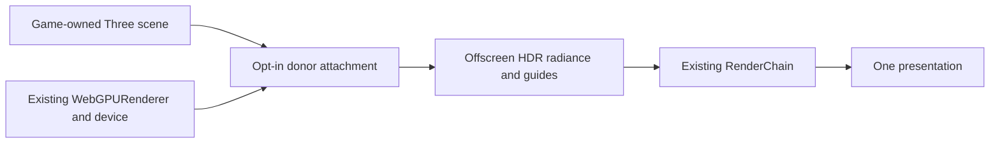

# PRD-webgpu-path-tracing — Opt-in path tracing through the existing renderer

**Status:** NOT STARTED
**Priority:** P2 — A packaged game cannot yet exercise this scoped path-traced beauty pipeline.
**Progress:** 0%
**Owner:** ThreeNative rendering implementation agent
**Depends on:** None for the static-scene slice; motion reconstruction is deliberately downstream.
**Complexity:** 6 (MEDIUM); 6–10 implementation files + new integration + GPU lifetime state.
**Risk override:** HIGH for borrowed-device lifetime and compatibility with the maintained Three patch.
**Planning baseline:** `develop@a683fcff3b598acdd3fd47760b1be2dfd64f914e`, inspected 2026-10-06.

## Context

The source audit found real scene/render-chain infrastructure, but no connected low-sample
path-traced beauty path. `GPUSceneBVH` is a static snapshot rebuilt by CPU SAH construction,
not a complete material transport system. The inspected native Vulkan RT shader renders
barycentric colours and its WebGPU texture output handoff is unfinished. Neither is a reason
to replace the engine or make native hardware RT a prerequisite.

The upstream `three-gpu-pathtracer` README now describes WebGPU compute and
`new WebGPUPathTracer(existingRenderer)`. Its inspected repository manifest says version
0.0.26, exports `three-gpu-pathtracer/webgpu`, requires Three >=0.185.0 and BVH >=0.9.15,
and also declares an `xatlas-web` peer. This is repository-source evidence, not a claim that
an equivalent npm release is available. ThreeNative pins patched Three 0.185.1 and BVH 0.9.14.
Upstream documents standard/physical materials only, analytic-light restrictions around MIS,
and no emissive MIS. Verify the exact selected revision and installed package contents.

The motivating Castellano clip is a visual target category, not a specification of his source,
sample count, model, backend, frame time or quality. No claim of exact reproduction is made.

## Goal and non-goals

A developer follows one opt-in recipe, opens an ordinary ThreeNative game and sees a genuine
path-traced room on browser WebGPU and Linux native, using the existing device and presentation.
The same game can explicitly select its ordinary raster view for diagnosis. Both modes report
which path actually executed. A static integration pass does not claim real-time reconstruction.

Out of scope: neural weights, temporal reuse, dynamic-deformation acceleration, meshlets,
ReSTIR, special caustics algorithms, native DXR/Vulkan/Metal integration, a native-engine rewrite,
a new package or engine-wide rendering option, default SSGI changes, and universal TSL support.
Glass transmission is in scope; fast, clean caustics at one SPP are not promised.

## Solution

Use a pinned donor rather than write an integrator. First inspect the actual WebGPU export,
its side-effect shims, scene generator, update methods and offscreen-output ownership. Adopt a
published package only when its contents match the tested source; otherwise use a reproducible
commit-pinned source dependency with preserved MIT notice. Record which route was selected.
Resolve the BVH peer deliberately and rerun the affected BVH and Three-patch checks. Determine
whether `xatlas-web` is required by the import closure; satisfy or isolate it, never ignore an
unsatisfied peer or install a second identity of Three. Donor imports must remain opt-in.

**Consumer:** ordinary `defineGame` -> example scene `enter` -> game-owned attachment module
borrowing `ctx.renderer.raw` -> existing per-draw scheduling -> donor offscreen radiance ->
existing `createRenderChain()` presentation. No extra `requestAnimationFrame`, GPU device,
canvas, hidden WebView or renderer instance. The donor's convenience sample method must not
present directly or clear the application's target. If no safe offscreen seam exists, add the
smallest attributable upstream patch or record the integration as blocked, not silently fall
back to a separate display path. Do not assume the old #380 PassNode hook works natively.

Full beauty is the only initial transport mode. It supplies the surface-lighting result, so
SSGI, SSR, extra ambient fill, raster direct light and artistic AO are not added again. Optional
bloom/exposure/tone mapping follow reconstruction exactly once. A raster guide pass is allowed
only when required and measured; it must not secretly supply the beauty result. A future hybrid
mode needs a separate explicit term-ownership decision, not an additional checkbox here.

### Scene, sampling and buffer contract

The bounded showcase uses ordinary Three meshes plus at least one glTF loaded through
`ctx.assets`: a textured room, material swatches, a mirror/glossy surface, transmissive glass,
three supported analytic lights and an HDR environment. Freeze 100k–250k resident triangles,
50–150 mesh instances and asset hashes before scoring; no licensed asset purchase is required.
Use authored/redistributable data. A separate small analytic fixture localizes transport faults;
it cannot replace this representative scene.

Expose game-owned choices for fixed 1/2/4 fresh SPP, 2/4 bounce budgets, raster/trace mode and
explicit source resolution. Default this example to one SPP and four bounces at 1280x720;
raw noise is expected until reconstruction lands. Keep a separate labelled progressive-reference
mode. Camera/scene changes reset its accumulation before the next image. Do not report total
historical samples as fresh per-frame SPP. Reference mode pauses simulation at an exact pose.

The GPU frame packet contains scene generation/revision, draw-frame id, actual dimensions,
camera matrices and jitter, fresh SPP, bounce limit, unexposed scene-linear HDR radiance,
linear depth, world-space normal, linear base colour, roughness, metalness and stable surface
identity. Motion is explicitly unavailable in this slice, not silently a valid zero buffer.
Document miss/background, sky and transmissive-guide validity. Image consumers cannot sample
retired generations. Format choices and every live/pending resource allocation count toward a
768 MiB incremental tracing budget, including donor allocations and worst-case resize overlap.
Reject unaccountable/unbounded allocation rather than report a partial total as complete.

Unsupported materials, missing textures, software adapters, WebGL fallback and size/budget
failures have named reasons. Raster fallback is allowed only as the visible requested fallback;
qualification requires `trace` to execute and fails on any fallback. Preserve borrowed scene,
materials, textures, renderer and device on failure/dispose. Clear graph references before
retiring owned resources; never await GPU completion in the steady frame loop.

## Integration Ledger

| Capability | Consumer/entry | Incumbent disposition | Proof owner |
|---|---|---|---|
| Path-traced beauty | `Scene.enter` in `packages/core/src/scene.ts`; proposed `examples/path-tracing/src/scenes/PathTracing.ts` | Raster mode remains explicit; trace mode replaces its beauty only | P1, P4 |
| Render composition | Existing generated `WorldEnvironment.apply`, `target.baseColour` and `createRenderChain` | One presentation; no duplicated lighting terms or tone curve | P4, A1 |
| Portable installation | Proposed opt-in recipe under `packages/create-threenative/agent-docs/examples/path-tracing/` | Ordinary templates/import graphs unchanged | A2 |

Proposed paths are implementation targets, not existing public APIs. Inspect actual render-order
and attachment seams before coding and fill their final locations on these owning rows.

## Execution Phases

### Phase 1: A supported installed consumer reaches the donor

**Status:** NOT STARTED
**Files:** proposed example `package.json`, `src/game.ts`, `src/scenes/PathTracing.ts`,
`src/render/pathTracing.ts`; edit catalogue/lock only for the qualified peer resolution.
Implement initialization, explicit capability refusal and a single renderer identity first.

- [ ] P1 [local; actor: implementation agent]: An installed public-import consumer resolves the pinned donor and exactly one patched Three/BVH cohort, with incompatible inputs rejected before attachment. proof: planned `pnpm --filter threenative-path-tracing test:consumer` (E1).
- [ ] P2 [local; actor: implementation agent]: Unsupported material/backend/resource requests return named refusal without replacing the last valid presentation or destroying borrowed objects. proof: planned `pnpm exec vitest run examples/path-tracing/__tests__/attachment.spec.ts` (E2).

**Checkpoint:** pending. Validate source reachability and affected peer/patch regressions once.

### Phase 2: The actual scene produces path-traced HDR

**Status:** NOT STARTED
**Files:** proposed example `src/render/framePacket.ts`, `src/world/showcase.ts`,
`src/render/pathTracing.ts`, scenario and targeted assertions in the existing playtest path.
Freeze the scene, support matrix and camera poses; retain a donor high-SPP reference and a
separate analytic transport check. Export guides from the actual traced state, not stale assets.

- [ ] P3 [shared; actor: rendering agent on the existing hardware browser runner]: Captured material/depth/normal/identity guides describe the rendered showcase surfaces at the same pose and dimensions, including textured glTF and glass validity. proof: planned `pnpm --filter threenative-path-tracing test:guides:web` (E3).
- [ ] P4 [shared; actor: same runner]: Full beauty has real indirect lighting, off-camera reflected content and transmission, without raster/SSGI/SSR double counting. proof: planned `pnpm --filter threenative-path-tracing test:transport:web` (E4).

**Checkpoint:** pending. E4 uses a one-bounce/indirect-disabled control and an off-camera
reflector-content control, plus an analytic diffuse-energy test; registration alone cannot pass.

### Phase 3: Resource-safe measured browser integration

**Status:** NOT STARTED
**Files:** same attachment, installed recipe, and proposed `playtests/path-tracing.playtest.json`.
Use the existing runner/FrameBudget, not new timing infrastructure. Restore normal rendering
when detached. Measure baseline costs without labelling them a real-time result.

- [ ] P5 [shared; actor: hardware browser runner]: Twenty attach/resize/camera-cut/detach cycles return owned live and pending-retirement allocations to baseline after retirement, with the shared renderer still usable. proof: planned `pnpm --filter threenative-path-tracing test:lifecycle:web` (E5).
- [ ] P6 [shared; actor: hardware browser runner]: The fixed showcase records actual fresh samples, BVH/transport/composition CPU and GPU costs, allocation peaks and converged-reference image error without hidden resolution/sample changes. proof: planned `pnpm --filter threenative-path-tracing bench:static:web` (E6).

**Checkpoint:** pending. GPU timestamp availability and adapter identity must be observed;
absent GPU timings are unknown, not zero or CPU substitutes.

## Acceptance Criteria

- [ ] A1 [shared; actor: rendering agent on the existing Linux native host]: The same installed source and static scenario produce path-traced pixels through the native renderer/device and satisfy E3/E4 fidelity controls rather than the raster fallback. proof: planned `pnpm --filter threenative-path-tracing test:static:desktop` (E7).
- [ ] A2 [local; actor: implementation agent]: A fresh generated consumer follows the shipped opt-in recipe with no workspace imports, while an ordinary scaffold does not install/import the tracer or acquire tracing resources. proof: planned `pnpm --filter threenative-path-tracing test:consumer` (E1, installed execution and dependency-absence assertions).

## Verification contract

E1/E2 cover installation/refusal; E3/E4 actual pixels and term ownership; E5 lifetime; E6 measured
cost; E7 native execution. New example scripts are proposed aliases over existing build/playtest
commands and must declare their actual scenario, target and executable. Do not invent CLI flags.

Freeze references with independent RNG seeds and the exact pose. Increase reference SPP until
the bounded RGB transform `x/(1+x)` changes by mean absolute error <=0.002 when sample count
doubles; retain both identities. The donor reference checks integration, not independent
physical correctness; the separate diffuse-energy fixture must agree within 5% with its analytic
expectation. Reference input/GPU hashes may not alias the tested candidate image. No performance
floor is imposed by this foundation PRD; the reconstruction PRD owns the interactive budget.

## Dependencies, order and blocked work

The next independent documents are `PRD-dynamic-path-tracing-scene`,
`PRD-low-spp-radiance-reconstruction`, and the optional `PRD-neural-radiance-denoising`.
This PRD does not depend on their completion or on #398. Existing PRD-267 remains the owner of
ordinary screen-space/probe GI. The closed/unmerged #380 is a source reference for a narrow
interop seam, not an installed dependency. PR #438's native-engine rewrite is not a prerequisite.

## Blocked on

Actual hardware execution is not performed by this planning session. The implementation actor
must use the repository's reachable hardware browser/Linux host lanes; inability to acquire a
lane must be recorded with an attempted command/result. Required native evidence blocks closure.
Windows/macOS/mobile hardware RT and default-tier qualification are outside this experiment,
not silently passed platform claims. Recheck upstream source availability before installation.

## Execution and evidence rules

This filing authorizes documentation only. All implementation, GPU, performance and platform
results are pending. Proposed files and commands below do not yet exist; the implementation
must wire them into the existing example/package scripts and playtest runner before citing a
pass. Do not build a second scenario runner, composer, scene format or application loop.

Use the repository's capability search/detail before executable changes. Keep appearance in
editable game-owned `src/render/` source; any admitted core change is only shared mechanism.
The charter forbids a replacement framework renderer: this is an ordinary game's use of a
third-party Three.js rendering library, not a new core rendering backend. Dependencies stay
out of ordinary scaffold/runtime imports. No change to default tiers is authorized.

Each checkbox below is one required outcome and one evidence owner. Phase boxes P1–P6 and
acceptance boxes A1–A2 are the complete eight-item checklist; do not duplicate them in another
completion ledger. Every runtime claim needs actual pixels/state through the consumer, not
just a mock, shader compile, draw count or registration. Keep exact source/dependency/config,
asset and runner identities with the existing playtest result. Temporary negative controls
must be isolated, restored and never shipped. Do not substitute SwiftShader for hardware cost.

After each substantive phase, self-review the changed boundary and its evidence; use one
independent reviewer when available, otherwise label self-review. Only rerun checks invalidated
by a change. Reuse the existing GPU/capture lease and coordinate CPU/GPU contention; no parallel
benchmark arms on one device. Documentation gates are `pnpm check:docs` and the root
AGENTS.md prose-only Vitest lane. Run `pnpm prd:progress <this-file>` before implementation and
after each phase. No new per-feature workflow, release, merge, paid compute or auto-merge is
authorized. Missing required evidence keeps the PRD open, even when implementation is present.

## Sources

- [ThreeNative lifecycle](https://github.com/ThreeNativeHQ/threenative/blob/a683fcff3b598acdd3fd47760b1be2dfd64f914e/packages/core/src/scene.ts), [BVH snapshot](https://github.com/ThreeNativeHQ/threenative/blob/a683fcff3b598acdd3fd47760b1be2dfd64f914e/packages/core/src/gpu-scene-bvh.ts), [render composition](https://github.com/ThreeNativeHQ/threenative/blob/a683fcff3b598acdd3fd47760b1be2dfd64f914e/packages/create-threenative/templates/minimal/src/render/worldEnvironment.ts), [dependency pins](https://github.com/ThreeNativeHQ/threenative/blob/a683fcff3b598acdd3fd47760b1be2dfd64f914e/pnpm-workspace.yaml).
- [Native RT output](https://github.com/ThreeNativeHQ/threenative/blob/a683fcff3b598acdd3fd47760b1be2dfd64f914e/packages/runtime-native/src/raytracing/vulkan_rt.cpp), [closest-hit shader](https://github.com/ThreeNativeHQ/threenative/blob/a683fcff3b598acdd3fd47760b1be2dfd64f914e/packages/runtime-native/src/raytracing/shaders/closesthit.rchit), [binding charter](https://github.com/ThreeNativeHQ/threenative/blob/a683fcff3b598acdd3fd47760b1be2dfd64f914e/docs/architecture/CHARTER.md).
- [Donor README](https://github.com/gkjohnson/three-gpu-pathtracer), [inspected manifest](https://github.com/gkjohnson/three-gpu-pathtracer/blob/main/package.json). Upstream links are moving references; record an immutable selected revision in phase 1.
