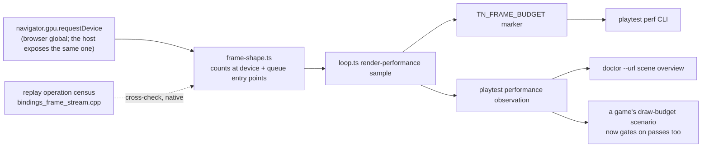

# PRD-331 — The frame's shape is a first-class meter: passes, encoders, command buffers, submits

**Status:** PROPOSED, filed 2026-09-02 against `8d680023`. Planning only. Nothing here is
implemented.

**Complexity:** +2 (6–10 files) + 2 (new module: a portable counter installed on a browser
global) + 2 (multi-package: `core`, `playtest`, `runtime-native`) = **6 → MEDIUM mode**.
Automated checkpoint after every phase; add a manual checkpoint after Phase 3 (device/desktop
A/B).

**Owner:** unassigned.

**Lane note:** `docs/PRDs/performance/critical/` is owned by another lane as of 2026-09-02. This
PRD **does not edit that folder's README**, `NATIVE-PERF-BOTTLENECKS.md`, or
`runtime-perf-state.md` outside its own Phase 4 append. Whoever runs the critical queue decides
where this row sits relative to PRD-328/327/329; this PRD does not insert itself there.

**This PRD is an instrument, not a lever.** It claims no frame-time improvement anywhere. The
standing ≥ 2 ms pre-registration rule applies to levers; instruments (PRD-305, PRD-308, PRD-328)
are filed on what they make visible. If any item here is later described as having made a game
faster, that description is wrong unless a device number says so.

**Source:** [`docs/verification/replay-decomposition-2026-08-28.md`](../../verification/replay-decomposition-2026-08-28.md)
(the measured replay model), `docs/verification/runtime-perf-state.md` §1.3.1–§1.3.2 (the
780 → 492 → 315 → 232 draw collapse), and an external architecture review of 2026-09-02 whose
one unfiled recommendation was *"measure passes/frame, encoders/frame, command buffers/frame,
queue.submit calls/frame"*.

---

## 1. Context

**Problem:** the only per-frame count any game, gate, agent or record in this repository can read
is **draw calls**. The replay decomposition measured a second term of the same order and nothing
reports it.

The model, measured on desktop across two arms:

```text
replay ≈ passes × ~120 us  +  draws × ~0.7 us
```

**At that scale a render pass costs what ~170 draws cost.** Bayview's dynamic shadow map is a
whole pass. Every pass, encoder and submit count in this repository — the "4 render passes, 4
submit operations" that the whole decomposition rests on — was read from a
`-DTN_ANDROID_JS_PROFILE=ON` desktop build of `examples/native-smoke`, a build no game ships and
no gate runs. A game that adds a pass, or a post chain that adds four, is invisible to every
meter we have until the frame rate moves.

**Files analyzed:**

- `packages/core/src/game.ts:391-410` — `rendererPerformanceMetrics` reads `info.render.drawCalls`
  and `info.render.triangles` from three's `Info`, and `:412-419` resets it per frame. These two
  numbers are the entire per-frame count surface.
- `node_modules/.pnpm_patches/three@0.185.1/src/renderers/common/Info.js:66-73` — three's
  `info.render` is `{calls, frameCalls, drawCalls, triangles, points, lines, timestamp}`. **There
  is no pass, encoder, command-buffer or submit count in it**, so the surface cannot come from
  `renderer.info` without patching three, which the graveyard forbids as a perf fork.
- `packages/core/src/frame-budget.ts:34` — `FRAME_BUDGET_PHASES` and the `TN_FRAME_BUDGET` marker;
  `:404-437` builds the per-window summary. This is the marker the `perf` CLI already reads on
  web, desktop and device.
- `packages/core/src/loop.ts:67, 257-259` — `drawCalls` travels from the loop's render-performance
  samples into the playtest bridge.
- `packages/playtest/src/protocol.ts:160, 217` and `src/three/observations.ts:32-72` — the
  `performance` observation is `{drawCalls?, triangles?}`; `src/runner/sceneOverview.ts:219,
  298, 407` renders it in `doctor --url`.
- `packages/runtime-native/src/runtime-scripts/frame-op-stream.js:408, 484, 553` — the production
  recorder already wraps `beginRenderPass`, `createCommandEncoder`, `finish` and `queue.submit` in
  **JavaScript**, installed from `packages/runtime-native/src/webgpu/bindings.cpp:2067-2078` at
  `requestDevice` against the `device` and `queue` entry points. The counts this PRD wants already
  cross that code on native; nothing keeps them.
- `packages/runtime-native/src/webgpu/bindings_frame_stream.cpp:907` — the replay's operation
  census (`fail("operation census mismatch")`), which is an independent second count of the same
  ops and therefore the cross-check this PRD uses as its negative control.

**Current behaviour:**

- A game can gate on `drawCalls` (`playtests/draw-budget.playtest.json` does) and on nothing else
  about the frame's shape.
- Pass counts appear in exactly two places in the repository: prose in
  `replay-decomposition-2026-08-28.md`, and a profiling build's stdout. Neither is reachable from
  a game, a gate, `doctor`, or the `perf` CLI.
- Consequence, already paid: the coalesced-submit arm in the replay decomposition was designed,
  implemented, measured and reverted, and the thing it needed to know first — how many submits a
  real game issues per frame, on a device — was never available. It was read off an 800-mesh
  synthetic on desktop.

### Incumbent census

| Existing thing | Overlap | Boundary |
| --- | --- | --- |
| `renderer.info` passthrough (PRD-071 §3.1, landed via PRD-172) | Same consumer chain, same marker | It carries three's counts. This PRD adds counts three does not have, through a different source, and merges them at the same seam |
| `TN_HOST_GAP` segments (`runtime.cpp`) | Reports `frameReplay` as one number | Native-only, and a *duration*, not a shape. This PRD explains what that duration was spent on |
| PRD-308 / PRD-311 (architecture board, tasks 5 and 8) | Per-pass **GPU time** on the phone, then in `diagnostics` | Those measure how long each pass takes on the GPU. This measures how many there are, on the CPU side, portably, and is a prerequisite: a per-pass GPU table with no pass count in the shipped meter cannot be checked against a game |
| `ProfiledRenderCommand` (`bindings_frame_stream.cpp`) | Counts and times the same ops | Behind `TN_ANDROID_JS_PROFILE`, native-only, not in any shipped build. Becomes this PRD's cross-check, not its source |

**Nothing here replaces anything.** The `Replaces` column of the ledger is empty by design and the
profiling build stays exactly as it is.

---

## 2. Solution

**Approach:**

- Count at the **WebGPU device and queue entry points**, in JavaScript, the same surface the
  native recorder already proved is the stable one — `createCommandEncoder`, `beginRenderPass`,
  `beginComputePass`, `encoder.finish`, `queue.submit` and the submitted command-buffer count.
- Install the counter by wrapping **`navigator.gpu.requestDevice`** in `@threenative/core` before
  the renderer initialises. `navigator.gpu` is a browser global, so under the charter's first
  question the framework owns this at any size; and because the native host exposes the same
  global, **one implementation covers web and native** with no fork of three.js and no second
  code path.
- **Fail closed.** No `navigator.gpu` (WebGL fallback, a stubbed test environment), or an install
  that lands after the device was already created, reports **nothing** — never zero. The frame
  budget already has this contract: *"a phase that was never measured reports zero samples so a
  consumer asserting on it fails"* (`frame-budget.ts:20`).
- Ride the existing seam: counts join `drawCalls` in the render-performance sample, the
  `TN_FRAME_BUDGET` marker, the playtest `performance` observation and `doctor`'s scene overview.
  No new transport, no new marker, no new CLI.
- Prove the counter honest by **two independent mechanisms agreeing** — the JS counter against the
  replay's own operation census on native — which is the standard the desktop ablation and
  `commandNs` met at 0.09 ms and the only reason those numbers are believed.



**Key decisions:**

- [ ] **Wrap the global, not three.** Patching `Info.js` would put a perf-motivated fork in
      `patches/`, which the graveyard closed ("Forking three.js or optimising its internals in our
      host"). The existing three patch is a batched-velocity **correctness** fix and is not a
      precedent for this.
- [ ] **Count only entry points that are already few.** Bayview's frame is ~4 passes, ~4 submits,
      a handful of encoders — tens of increments per frame against ~800 draws. The counter must
      never wrap a per-draw method; `drawIndexed` counting stays three's job.
- [ ] **Integer counters, no allocation.** `hot-path mutation` rules apply: no per-frame object,
      no closure per call, one preallocated record reset at frame boundary. The ordinary-frame
      allocation gate (PRD-189) is the standing bar.
- [ ] **Overhead is a gate, not an assumption.** Phase 3 pays for the counter with a same-session
      desktop pair; anything over 0.2 ms `render.p50` fails the phase.

**Data changes:** none. One new optional field group on an existing observation.

---

## 3. Integration Ledger

| # | New thing | Live caller (`file:line`, non-test) | Replaces | Old path removed? | Negative control |
|---|---|---|---|---|---|
| 1 | `installFrameShapeCounter` (`packages/core/src/frame-shape.ts`) | TBD — `packages/core/src/game.ts`, before renderer init | nothing | n/a | uninstall the wrapper: the marker's shape fields disappear (report **nothing**, not zero) |
| 2 | `IFrameShapeCounts` on the render-performance sample | TBD — `packages/core/src/loop.ts` sample assembly | nothing | n/a | a scene with one pass and a scene with two produce different `renderPasses`; equal counts fail |
| 3 | `renderPasses` / `computePasses` / `commandEncoders` / `commandBuffers` / `queueSubmits` in `TN_FRAME_BUDGET` | TBD — `packages/core/src/frame-budget.ts` window emit | nothing | n/a | delete the emit: `perf --file` prints the counts as absent and the CLI's own assertion reds |
| 4 | `performance.renderPasses` playtest observation + assertion | TBD — `packages/playtest/src/three/observations.ts` | nothing | n/a | assert `lte 3` on a 4-pass scene → red; `lte 4` → green |
| 5 | Replay census export (`frameOpStreamPassCount` etc.) | TBD — `packages/runtime-native/src/webgpu/bindings_frame_stream.cpp` | nothing | n/a | contract test forces a mismatch by dropping one recorded `beginRenderPass` → the cross-check throws |
| 6 | Scene-overview line in `doctor --url` | TBD — `packages/playtest/src/runner/sceneOverview.ts` | nothing | n/a | run `doctor` against a page with no WebGPU: the line reads "not observed", never "0 passes" |

**Reachability:**

- Entry point: the frame loop. Every game frame goes through `loop.ts`, and every WebGPU game
  goes through `navigator.gpu.requestDevice` exactly once at boot.
- Pre-existing files edited: `game.ts`, `loop.ts`, `frame-budget.ts`, `protocol.ts`,
  `observations.ts`, `sceneOverview.ts`, `bindings_frame_stream.cpp`.
- Full flow: game boots → core wraps `requestDevice` → three creates the device it always
  creates → each frame the counter tallies entry-point calls → `loop.ts` samples them alongside
  `drawCalls` → they reach `TN_FRAME_BUDGET`, the playtest bridge and `doctor`.
- Observable in: `pnpm exec playtest perf --file <log>`, `doctor --url`, and a scenario assertion
  a game can fail on.

---

## 4. Execution Phases

#### Phase 1: The counter exists and the browser reports the frame's shape

**Files (max 5):**

- `packages/core/src/frame-shape.ts` — NEW: installs on `navigator.gpu.requestDevice`, counts at
  device and queue entry points, resets per frame, reports `undefined` when it could not install.
- `packages/core/src/game.ts` — EDIT: install before the renderer initialises; merge counts into
  the render-performance metrics beside `drawCalls`.
- `packages/core/src/loop.ts` — EDIT: carry the counts on the sample.
- `packages/core/src/frame-budget.ts` — EDIT: emit them in the window marker.
- `packages/core/__tests__/frame-shape.spec.ts` — NEW.

**Wiring:** caller edited (`game.ts`); no registration surface; old path n/a; ledger rows 1–3.

**Tests required:**

| Test file | Test name | Assertion | Negative control (observed red) |
|---|---|---|---|
| `frame-shape.spec.ts` | `should count one render pass per beginRenderPass when the device is wrapped` | `counts.renderPasses === 2` for a two-pass stub frame | stub that opens one pass → 1, not 2; hard-coded 2 fails it |
| `frame-shape.spec.ts` | `should report nothing when navigator.gpu is absent` | counts are `undefined`, not `0` | return `0` instead → red |
| `frame-shape.spec.ts` | `should allocate nothing on an ordinary frame` | PRD-189's existing allocation harness | add one per-frame object literal → red |
| `frame-budget.spec.ts` (EDIT) | `should carry frame-shape counts into the window marker` | marker JSON has `renderPasses` | remove the emit → red |

**Revert check:** rename `installFrameShapeCounter` → the edited `frame-budget` spec and the
`game.ts` metrics test fail.

**User verification:** run any template's dev server; the `TN_FRAME_BUDGET` console line names a
non-zero `renderPasses`.

---

#### Phase 2: A game can gate on the frame's shape

**Files (max 5):**

- `packages/playtest/src/protocol.ts` — EDIT: extend `IPlaytestPerformanceObservation`.
- `packages/playtest/src/three/observations.ts` — EDIT: read the counts, fail closed when absent.
- `packages/playtest/src/runner/sceneOverview.ts` — EDIT: one line in `doctor --url`.
- `packages/playtest/__tests__/observations.spec.ts` — EDIT.
- one in-repo example scenario — EDIT: add a `renderPasses` assertion.

**Wiring:** callers edited; ledger rows 4 and 6.

**Tests required:**

| Test file | Test name | Assertion | Negative control (observed red) |
|---|---|---|---|
| `observations.spec.ts` | `should expose renderPasses when the counter reported` | observation carries the count | drop the field → red |
| `observations.spec.ts` | `should fail an assertion on renderPasses when the counter did not install` | throws, not `0` | return `0` → the assertion passes → red by design |
| example scenario | `settled frame stays within its pass budget` | `lte <measured>` | `lte <measured − 1>` observed red first, pasted |

**Revert check:** remove the observation field → the scenario's assertion fails as an unknown key
(the harness fails closed on unknown assertion kinds; that behaviour is itself asserted).

**User verification:** `doctor --url http://127.0.0.1:5173 --text` prints passes/encoders/submits
next to draw calls.

---

#### Phase 3: Native agrees with itself, and the counter is paid for

**Files (max 5):**

- `packages/runtime-native/src/webgpu/bindings_frame_stream.cpp` — EDIT: export the replay's
  per-frame op census as pass/encoder/command-buffer/submit counts.
- `packages/runtime-native/tests/frame_op_stream_replay_test.cpp` — EDIT: assert the census
  matches the recorded stream, and that a dropped `beginRenderPass` throws.
- `packages/runtime-native/src/runtime.cpp` — EDIT: surface the census counts on the existing
  `TN_HOST_GAP` line (no new marker).
- `docs/verification/frame-shape-counter-<date>.md` — NEW: the desktop overhead pair.

> **Native coverage digest:** editing anything under `runtime-native/tests/` stales the coverage
> record and the regenerator throws on a missing CTest target. Regenerate in the same commit.

**Wiring:** ledger row 5.

**Tests required:**

| Test file | Test name | Assertion | Negative control (observed red) |
|---|---|---|---|
| `frame_op_stream_replay_test.cpp` | `should report the same pass count the stream recorded` | census == recorded | drop one recorded pass → throws |
| overhead pair (harness, not a unit test) | `counter costs < 0.2 ms render.p50` | same-session interleaved control/candidate, ≥ 3 runs per arm | if the spread exceeds the difference, the arm reports **unresolved**, never a pass |

**Method rules, binding here:** every A/B is a same-session pair; discard the first two whole runs
and the first two windows of each kept run; desktop is judged on `render.p50`, never fps (the
private Xvfb present segment is a FIFO throttle). Use
`packages/runtime-native/scripts/measure-desktop-frame-pair.mjs`.

**Revert check:** disable the census export → the replay contract test fails.

**Manual checkpoint:** required. Paste both arms' raw windows, not the medians alone.

---

#### Phase 4: The numbers exist for a real game, in the record

**Files (max 5):**

- `docs/verification/runtime-perf-state.md` — EDIT: **append one dated section only.** That file
  is contended; do not restructure it, and rebase before committing.
- `docs/PRDs/performance/PRD-331-*.md` — EDIT: check the criteria.

**What must land:** the frame-shape row for (a) a scaffolded template and (b) one real
Bayview-class game, on the browser and on the Pixel 8, in the shape the external review asked for:

```text
TN FRAME — <subject>, <platform>, <window>
Draws            232
Render passes      ?
Compute passes     ?
Command encoders   ?
Command buffers    ?
queue.submit       ?
```

Then one sentence of verdict against the measured model (`passes × ~120 µs + draws × ~0.7 µs`):
does the pass term explain any of the frame, or is it below the standing 2 ms bar? **Either answer
closes this PRD.** A pass count that turns out irrelevant is a result, and it belongs in the
graveyard rather than in another lever.

**Do not** edit `NATIVE-PERF-BOTTLENECKS.md` or `docs/PRDs/performance/critical/README.md` from
this lane while the critical queue is owned elsewhere; hand the row over instead.

---

## 5. Acceptance Criteria

Consumer-scoped. Each is checkable only by a build a user could tell apart from the previous one.

- [ ] A game's playtest scenario **fails** when a render pass is added to its scene and **passes**
      when it is removed, with both runs pasted. (Not: "the counter is implemented".)
- [ ] `doctor --url` on a running game prints passes, encoders, command buffers and submits beside
      draw calls; on a page with no WebGPU it prints "not observed" and never `0`.
- [ ] `playtest perf --file <native log> --text` prints the same four counts for a native window.
- [ ] On native, the JS counter and the replay's independent op census agree exactly on the same
      frame, and a deliberately dropped record makes the cross-check throw (pasted).
- [ ] The counter costs < 0.2 ms `render.p50` in a same-session desktop pair, ≥ 3 runs per arm,
      with the raw windows pasted; an unresolvable spread is recorded as unresolved, not as a pass.
- [ ] An ordinary frame still allocates nothing (PRD-189's gate, re-run green).
- [ ] The frame-shape table exists for a template and for one real game, on browser and Pixel 8,
      in `runtime-perf-state.md`, with the verdict sentence written.
- [ ] Integration Ledger has zero `TBD` cells; every row names a non-test `file:line`.
- [ ] Every gate above has an observed negative control recorded red before it was recorded green.
- [ ] `pnpm typecheck && pnpm lint && pnpm test` green, pasted. `pnpm test:templates` green for the
      lane that has a GPU.

## 6. What would make this PRD wrong

1. The counter cannot install on native because the host creates the device without going through
   a JS-visible `navigator.gpu.requestDevice`. **Check this in Phase 1 before writing Phase 3** —
   `bindings.cpp:2067` installs the recorder at `requestDevice`, which is evidence it does, but
   evidence is not a run.
2. Wrapping the entry points perturbs the frame more than 0.2 ms. Then the counter ships
   **off by default** behind the same switch shape as `frameBudget` and the acceptance moves to
   "on when asked, honest when on".
3. A real game turns out to issue 4 passes and 1 submit, exactly as the synthetic did, and the
   pass term is < 2 ms everywhere it is measured. Then the meter is still worth its 0.2 ms — it
   is what lets the *next* proposal be refused with a number — but no lever follows it, and the
   PRD says so rather than inventing one.
