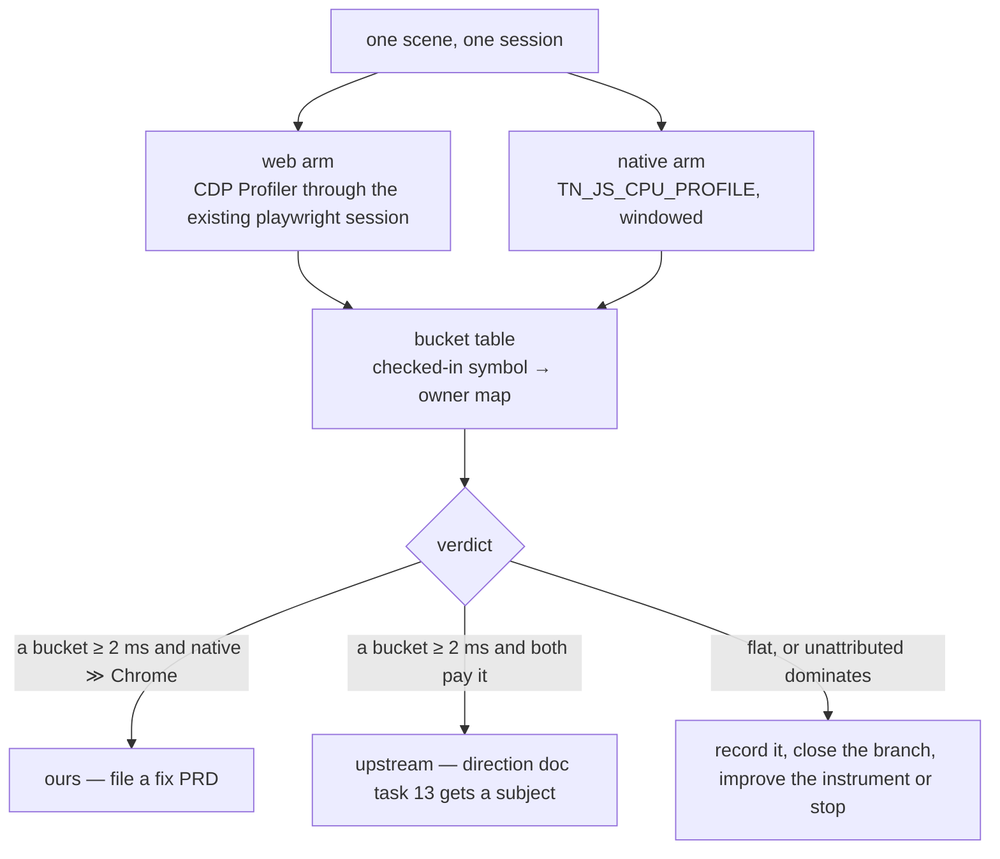

# PRD-332 — The JavaScript render term is named, on the engine that ships

**Status:** PROPOSED, filed 2026-09-02 against `8d680023`. Planning only. Nothing here is
implemented.

**Complexity:** +1 (1–5 files) + 2 (a new measurement arm across two runtimes) + 2 (multi-package:
`playtest`, `runtime-native`) + 1 (device lane) = **6 → MEDIUM mode**. Automated checkpoint after
every phase; manual checkpoint after Phase 2.

**Owner:** unassigned.

**Lane note:** `docs/PRDs/performance/critical/` is owned by another lane as of 2026-09-02. This
PRD does not edit that folder, `NATIVE-PERF-BOTTLENECKS.md`, or the critical README. Its only
shared-record write is a dated append to `runtime-perf-state.md` in Phase 3.

**This PRD is an instrument, not a lever.** It optimises nothing and predicts no milliseconds. It
exists so that the next optimisation can be refused or funded by name.

**Source:** [`docs/architecture/NATIVE-RENDER-TRANSPORT.md`](../../architecture/NATIVE-RENDER-TRANSPORT.md)
— *"**Not measured:** what the remaining JavaScript term is made of"* — plus PRD-069's open
remainder (*"the linear JS term itself (~0.7 µs/object across projectObject/render-list/nodes/
bindings)"*), and `FUTURE-ARCHITECTURE-DIRECTION.md` Band 3 task 13, which proposes upstream
three.js fixes for an **11.3 µs vs Godot's 5.3 µs** per-object gap that no record attributes to a
function.

---

## 1. Context

**Problem:** the largest single CPU term in this repository's model of the frame is *"JavaScript +
non-bridge render-thread work — 14.77 ms, 61.8 %"*, derived **by subtraction** (`work − bridgeNs`).
Everything around it has been measured and mostly closed. It has not.

What that costs, concretely, three times over:

- The direction document's only **permanent** lever — pushing per-object submission cost upstream
  to three.js, which pays on web and native forever — is filed with *no schedule* and owned by
  nobody, because an upstream issue that says "your renderer is 2× Godot per object" is not a
  patch. An upstream issue that says "`X` in `RenderList.js` is 38 % of a 315-draw frame under a
  sampling profile on two runtimes" is one.
- Two levers have already been designed, built, measured and reverted against this term without
  ever seeing inside it (F12 batched render pass: predicted −4 %, measured **+5 % slower**;
  PRD-227 Change 2 fixed-shape wrappers: predicted −8.9 ms on device, measured **worse than
  baseline**). Both were priced off a subtraction.
- The one thing the second failure *did* establish — that the megamorphic inline caches belong to
  three's node-material graph and that Chrome pays them too — came from an IC profile taken after
  the change failed. It is the only structural fact known about the term, and it was learned the
  expensive way.

**Files analyzed:**

- `packages/runtime-native/src/js/v8_engine.cpp:191-210` — `TN_JS_CPU_PROFILE=1` starts a V8
  `CpuProfiler` at a 200 µs sampling interval, gated behind the **`TN_ANDROID_JS_PROFILE` build
  flag**. `:216-264` — `dumpCpuProfile()` flattens the sampled tree to **self time per (function,
  script:line)** and prints the top 60 as `TN_JS_CPU_PROFILE:<hits>\t<pct>\t<name @ file>\t
  <file:line>`, with the script path truncated to its basename.
- `packages/playtest/src/runner/androidBrowserRunner.ts:3, 17-23, 171` — the runner already holds
  a `playwright` `chromium.connectOverCDP` session against Chrome on the phone; `playwright` is an
  optional peer dependency (`packages/playtest/package.json:70-81`). The web half of a matched
  profile needs no new dependency, only `Profiler.enable` / `start` / `stop` on a session that
  already exists.
- `packages/core/src/frame-budget.ts:34, 404-437` — the `render` phase whose duration this PRD
  decomposes, and the window boundaries that define "steady state".
- `docs/architecture/NATIVE-PERF-BOTTLENECKS.md` — the 37.7 ms Pixel 8 split
  (10.1 ms *"JavaScript actually running three.js"* + 12.8 ms *"V8 machinery around it"*),
  inherited from one symbolized simpleperf profile of a Bayview build that is not today's.

**Current behaviour:**

- **Native:** a V8 sampling profiler exists, is behind a build flag no shipped binary sets,
  flattens by function name, and truncates the script path to a basename — which for a bundled
  game collapses three.js, the framework and the game source into one filename.
- **Web:** no profile is ever taken by any harness. Everything known about the browser arm comes
  from hand-driven DevTools sessions that left no artifact.
- **Neither side is windowed to steady state.** The one time this was tried on adjacent evidence,
  the finding was that a load-time compile burst read as per-frame churn: *V8 IC log transitions
  are not executions; PRD-227's node-system megamorphism is a load-time burst, `build()` = 0/frame
  steady.* An un-windowed profile of this term will make the same mistake in the same place.

### Incumbent census

| Existing thing | Overlap | Boundary |
| --- | --- | --- |
| PRD-069 (per-draw cost) | Owns the **lever** on the linear JS term | PRD-069 Phase 0 is answered; its remainder is an optimisation with no named owner. **This PRD names the owner and stops.** It proposes no optimisation and must not grow one |
| PRD-226 (frame budget by ablation) | Produced the 14.77 ms figure by subtraction | Ablation says how big; this says what of. No ablation arm is re-run here |
| PRD-227 (the frame crosses once) | Closed the seam around the term | Closed. This PRD must not re-propose a transport, wrapper, backend or GC lever — the critical README forbids it without a new measurement, and this PRD's output *is* that measurement, produced before any lever is written |
| `TN_JS_CPU_PROFILE` (`v8_engine.cpp`) | The native instrument | Becomes this PRD's native half, made runnable and windowed. Not rewritten |
| PRD-331 (frame-shape counters) | Sibling instrument | Counts the frame's shape; this decomposes its CPU time. Independent; either can land first |

**Replaces:** nothing. The profiling build stays; this PRD makes its output attributable and adds
the missing web arm.

---

## 2. Solution

**Approach:**

- **Do not fork three.js and do not hand-instrument its internals.** Both are closed
  (graveyard #15). The instrument is a **sampling profiler on both runtimes**, which is
  attribution without modification and is the only method that can compare native against Chrome
  at all.
- **Window it to steady state.** Start the profile after the same settle point the frame budget
  uses, stop it at a fixed frame count, and discard everything before. A profile that spans load
  is the known false-positive generator on this exact subject.
- **Bucket by owner, from a checked-in table**, not by reading a top-60 list by eye. Symbols map
  to: `sceneTraversal`, `matrixWorld`, `culling`, `renderListBuildSort`, `nodesAndBindings`,
  `pipelineAndBindGroup`, `commandEncoding`, `gameUpdate`, `framework`, `gc`, `unattributed`.
  **`unattributed` is a first-class bucket and its size is part of the result** — a decomposition
  that hides its remainder is the instrument this repository already got burned by (PRD-068 §1.2
  timed six handler interiors and missed everything around them).
- **Same scene, same session, both runtimes.** The verdict is a comparison, not an absolute:
  native's buckets against Chrome's on the same phone and the same content. Chrome runs the same
  three.js, so any bucket where native is disproportionately heavy is **ours**, and any bucket
  where both are heavy is **upstream's**. That split is the whole deliverable.

**Key decisions:**

- [ ] **Self time, not total time.** The existing native dump already flattens to self time so a
      shared helper is not credited to its callers and the totals stay additive. The web arm must
      match, or the two tables cannot be compared.
- [ ] **Names must survive the bundle.** The native path truncates the script to a basename and a
      packaged game is one `.js` file. Phase 0 either keeps function names and a source map
      through the game's build, or the PRD declares the native arm attributable only to function
      name and says so in every table it prints. **This is checked in Phase 0, before any run.**
- [ ] **The subject is a real game, not `native-smoke`.** The hardest real subject rule: a
      Bayview-class scene at its settled draw count. `native-smoke` with N synthetic meshes has no
      node-material graph, which is the one structure already known to own part of this term.
- [ ] **A 200 µs sampling interval on a ~16 ms frame gives ~80 samples per frame.** Windows must
      be long enough that the smallest bucket claimed has ≥ 200 samples; anything thinner is
      reported as *below resolution*, not as a small number.

**Data changes:** none.

---

## 3. Integration Ledger

| # | New thing | Live caller (`file:line`, non-test) | Replaces | Old path removed? | Negative control |
|---|---|---|---|---|---|
| 1 | `profile` subcommand / flag on the playtest CLI (web arm, CDP) | TBD — `packages/playtest/src/runner/cli.ts` | nothing | n/a | run it against a page that never renders: the table must be empty or `unattributed`-dominated, never a plausible-looking split |
| 2 | Steady-state window control for `TN_JS_CPU_PROFILE` (start/stop at frame N/M) | TBD — `packages/runtime-native/src/js/v8_engine.cpp` + its existing `g_startCpuProfile` call site | ad-hoc whole-run profiling | old whole-run mode kept as an explicit flag | profile a window that contains load: the `unattributed`/compile buckets must visibly differ from the steady window, and the record must show both |
| 3 | `scripts/bucket-js-profile.ts` + `docs/verification/js-render-term-buckets.json` (the symbol → owner map) | TBD — invoked by the CLI in row 1 and by the native reader | nothing | n/a | mislabel one symbol in the map → the bucket table changes and a map-integrity test reds |
| 4 | The bucket table itself, both runtimes | TBD — `docs/verification/runtime-perf-state.md` dated section | the 14.77 ms subtraction as the only description of the term | the subtraction stays as a total; the split supersedes prose guesses | the two runtimes' totals must each reconcile to their measured `render.p50` within a stated band; if they do not, the run is void |

**Reachability:** entry point is the playtest CLI on web and the profiling host binary on native —
both already exist and both already run in this repository's lanes. Pre-existing files edited:
`cli.ts`, `v8_engine.cpp`, `runtime-perf-state.md`.

**Full flow:** an operator runs one scenario against one game → the runner starts a profile at the
settle point and stops it at a fixed frame → the raw samples are bucketed by the checked-in map →
a table lands in the record with a verdict sentence → an upstream issue or a fix PRD is written
against a named function, or the branch is closed.

---

## 4. Execution Phases

#### Phase 0: The instrument runs, and its names survive — no numbers claimed

**Files (max 5):**

- `packages/runtime-native/src/js/v8_engine.cpp` — EDIT: window the profile (start at frame N,
  stop at frame M) instead of whole-run; keep whole-run behind an explicit value.
- `packages/playtest/src/runner/cli.ts` — EDIT: a `--js-profile` flag that drives CDP `Profiler`
  on the session the runner already opens.
- `packages/playtest/src/runner/browserSession.ts` — EDIT: expose the CDP session for it.
- `packages/playtest/__tests__/jsProfile.spec.ts` — NEW.
- `docs/verification/js-render-term-instrument-<date>.md` — NEW: the feasibility record.

**What Phase 0 must answer before Phase 1 starts, in writing:**

1. Do three.js function names survive the game's production bundle on **both** arms? Paste ten
   real symbol names from each. If they do not, either the build keeps names for profiling runs or
   this PRD stops here and says so — a bucket table built on `t`, `n` and `e` is a fabrication.
2. Does the native profiler run in a build a game actually ships, or only under
   `TN_ANDROID_JS_PROFILE`? If only the latter, every native number carries that caveat in its
   table caption, permanently.
3. What is the profiler's own cost? Same-session pair, `render.p50`. If it perturbs the frame more
   than it resolves, the arm reports shares only and never absolutes.

**Tests required:**

| Test file | Test name | Assertion | Negative control (observed red) |
|---|---|---|---|
| `jsProfile.spec.ts` | `should collect samples only between the start and stop frames` | first sample ≥ window start | widen the window to include load → red |
| `jsProfile.spec.ts` | `should fail when the profiler returned no samples` | throws | return `[]` and expect a pass → red by design |
| `v8_engine` contract | `should not start the profiler when the window is not reached` | no `[V8] CPU profiler started` line | start at frame 0 → red |

**Revert check:** remove the window control → the windowing test fails.

---

#### Phase 1: The bucket map exists and is falsifiable

**Files (max 5):**

- `docs/verification/js-render-term-buckets.json` — NEW: symbol/pattern → owner bucket.
- `scripts/bucket-js-profile.ts` — NEW: reads either arm's raw samples, emits the table.
- `scripts/__tests__/bucket-js-profile.spec.ts` — NEW.
- `packages/playtest/src/runner/cli.ts` — EDIT: print the bucketed table, not the raw top-60.

**Implementation notes:** every mapped symbol carries the file it was seen in; an unmapped symbol
goes to `unattributed` and is **listed**, not silently absorbed. The script fails closed on a
malformed profile.

**Tests required:**

| Test file | Test name | Assertion | Negative control (observed red) |
|---|---|---|---|
| `bucket-js-profile.spec.ts` | `should attribute a known three.js symbol to its bucket` | `renderListBuildSort` non-zero | remove the map entry → it moves to `unattributed` |
| `bucket-js-profile.spec.ts` | `should list every unattributed symbol rather than dropping it` | the remainder's names are in the output | drop them → red |
| `bucket-js-profile.spec.ts` | `should throw on a malformed profile` | throws | swallow it and return an empty table → red |

**Revert check:** delete the map file → the CLI's table command fails loudly rather than printing
one bucket.

---

#### Phase 2: The matched pair, on the real subject

**Files (max 5):**

- `docs/verification/js-render-term-decomposition-<date>.md` — NEW: the run record.
- one scenario in the subject game — EDIT: the profiled run's driver.

**The run:** one Bayview-class game at its settled draw count, one session:

| Arm | Runtime | Where |
| --- | --- | --- |
| A | Chrome on the Pixel 8, CDP profiler | `androidBrowserRunner` |
| B | The native host on the same Pixel 8, `TN_JS_CPU_PROFILE` windowed | device lane |
| C | Desktop native, same build, as a shape cross-check | Xvfb lane |

Both device arms preflighted (`device-preflight.mjs`: unplugged, thermal `NONE`, Battery Saver
off, refresh rate recorded), both windowed to steady state, both discarding the first two runs and
the first two windows of each kept run.

**Manual checkpoint required.** Paste the raw bucket tables, not a summary.

**Result gate:** each arm's bucket total must reconcile with that arm's measured `render.p50`
within a band stated *before* the run. **A run that does not reconcile is void** and is recorded
as void — the ledger has two entries that looked like wins and were session drift, and this is the
same failure mode.

---

#### Phase 3: The verdict, and what it funds

**Files (max 5):**

- `docs/verification/runtime-perf-state.md` — EDIT: **append one dated section.** Contended file;
  rebase before committing; do not restructure.
- `docs/PRDs/performance/PRD-332-*.md` — EDIT: check the criteria.
- Optionally: one new PRD or one upstream three.js issue draft, filed by whatever the table says.

**The verdict is one of exactly three sentences, written before anyone proposes anything:**

1. *"Bucket `X` is ≥ 2 ms/frame and native pays N× what Chrome pays for it"* → it is ours; a fix
   PRD is filed against a named function, and it goes to the critical queue's owner, not into
   `critical/` from this lane.
2. *"Bucket `X` is ≥ 2 ms/frame and both runtimes pay it equally"* → it is three.js's; direction
   document task 13 finally has a subject, and the deliverable is an upstream issue with this
   table attached.
3. *"No bucket clears 2 ms, or `unattributed` dominates"* → the term is diffuse or the instrument
   is too coarse. Record it, close the branch, and **do not fund another lever against this term**
   until a better instrument exists. This is a legitimate outcome and it must not be talked out of.

---

## 5. Acceptance Criteria

Consumer-scoped: satisfied only by a table a reader can act on, never by an instrument existing.

- [ ] A single command produces a bucketed CPU table for a running game **on the browser**, and
      the same command shape produces one **on the native host**, with the raw invocations pasted.
- [ ] Ten real three.js symbol names from each arm are pasted in the Phase 0 record, proving names
      survived the bundle — or the PRD states plainly that they did not and what it did instead.
- [ ] The bucket table exists for one Bayview-class game on Chrome-on-Pixel-8 and native-on-
      Pixel-8, same session, steady-state windowed, with `unattributed` shown as its own row.
- [ ] Each arm's buckets reconcile to that arm's measured `render.p50` within the pre-registered
      band; a non-reconciling run is recorded as void.
- [ ] The verdict is one of the three sentences above, written verbatim, with the number in it.
- [ ] Every gate has an observed negative control recorded red before green — including the
      load-window control, which must visibly differ from the steady window.
- [ ] Integration Ledger has zero `TBD` cells.
- [ ] `pnpm typecheck && pnpm lint && pnpm test` green, pasted.
- [ ] **Nothing in this PRD optimised anything.** If a phase produced a speed change, it was out
      of scope and belongs in its own PRD.

## 6. What would make this PRD wrong

1. **Names do not survive the bundle on either arm** and cannot be made to. Then a sampling
   profiler cannot attribute this term and the honest output is a one-paragraph record saying so —
   which is still worth having, because it retires "profile it first" as an answer.
2. **The profiler perturbs the frame more than the smallest bucket it resolves.** Then shares are
   reportable and absolutes are not, and every table says so.
3. **The term turns out to be mostly `unattributed`.** The most likely single outcome, given that
   the previous instrument's own remainder was 18 %. Phase 1 makes that visible instead of
   flattering; outcome 3 above is written for exactly this case.
4. **The phone is GPU-bound anyway**, so no CPU bucket changes any frame rate. That does not make
   the measurement wrong — the CPU term still owns the web arm, the desktop arm, and the only
   permanent lever the direction document names — but it does mean **no device fps claim may be
   attached to this PRD's result**, and none is.
