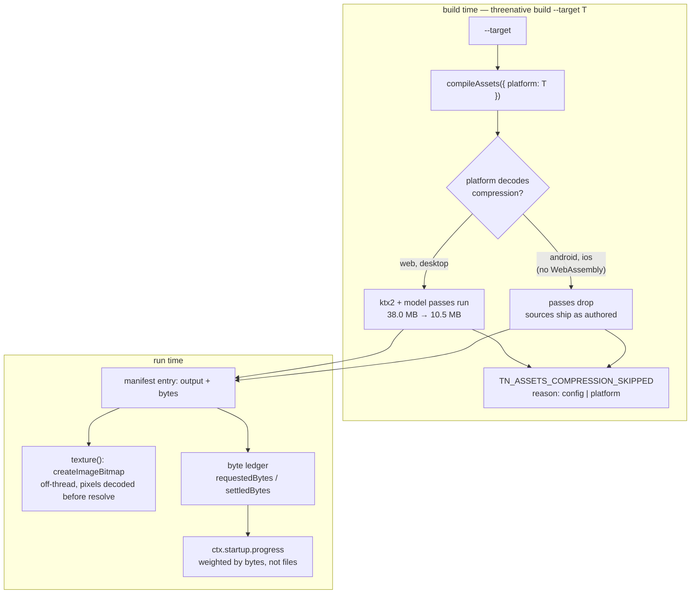
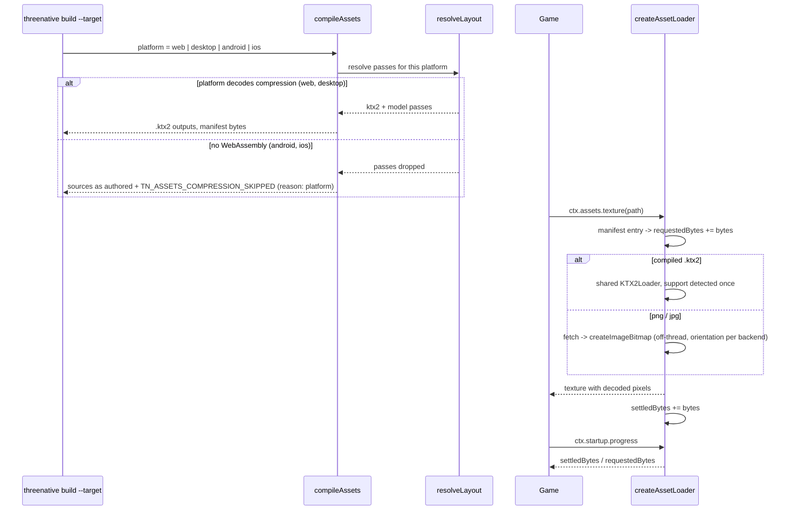

# PRD-339 — The loading screen is bytes, not files

**Status:** PARTIAL, filed 2026-09-03 from a measured probe of the asset path. Phases 1, 2, 4 and 5
are implemented in the filing branch with negative controls observed red. Phase 3 (`preload`) is
scoped and **deliberately not built** — the measurement says fan-out is not the lever; see §6.

**Complexity:** +2 (6–10 files) + 2 (multi-package: `core`, `assets`, `create-threenative`)
+ 2 (concurrency) = **6 → MEDIUM mode**.

**Owner:** unassigned

**Source:** a question from the owner — *"on wildwood we had to parallelise asset loading because
it was taking too long… maybe this should be on the engine side?"* — and the probe that answers it,
recorded in `docs/verification/asset-loading-probe-2026-09-03.md`.

**Outcome:** the framework, not the game, owns asset fan-out, off-thread decode and a progress
number that tracks bytes; and an asset pipeline switched off still reports what it would have
saved.

---

## 1. Context

### The answer to the question that prompted this is "yes, but parallelism is not the lever"

Wildwood hand-wrote ~180 lines of loading orchestration in
`sandbox/wildwood/src/scenes/Valley.ts` — a 70-line `AssetLease` lifetime wrapper, a critical/detail
tier split, six `Promise.all`/`allSettled` fan-out sites, manual progress accounting, and
stale-generation cancellation. The framework offers none of it, so the game wrote it.

It bought less than it looks. Measured on 16 real wildwood textures (38.0 MB on disk, 125.8 MB
decoded RGBA) and 10 real wildwood GLBs, headless Chromium, three passes per arm, means:

| what the game changed | serial | fanned out | win |
| --- | ---: | ---: | ---: |
| textures, through `ctx.assets.texture()` | 436 ms | 397 ms | **9 %** |
| models, through `ctx.assets.model()` | 85 ms | 87 ms | **none** |

And on a throttled link — 40 Mbps down, 20 ms latency, the case a player actually has — fan-out
stops mattering entirely, because the pipe is the bottleneck:

| arm, 16 textures / 38.0 MB | total | first texture ready |
| --- | ---: | ---: |
| every request at once + main-thread decode (**what core does today**) | 7,738 ms | 1,283 ms |
| every request at once + off-thread decode | 7,725 ms | 1,288 ms |
| a pool of 6 + off-thread decode | 7,733 ms | 1,286 ms |

Three strategies, 13 ms apart. **Wildwood's loading screen was long because of bytes, and no
arrangement of promises moves bytes.**

### What does move

Two levers, both owned by the framework and neither reachable from game code.

**Bytes.** The repo's own `texturePass` compresses that same corpus from **38.0 MB to 10.5 MB —
72 % smaller** (default codec choice, mip chains intact). At 40 Mbps that is 7.7 s → **2.1 s**.
Wildwood shipped none of it: its `public/assets.manifest.json` lists 165 entries, 2,003 MB of
output, **53 PNG, 35 JPG and zero `.ktx2`**, because `sandbox/wildwood/threenative.config.ts`
carries `assets: { models: "none", textures: "none" }`, copied verbatim from the starter template
and never revisited as the game grew to 2 GB.

And the template had a real reason for it, which is the part that matters: **Android and iOS run
the native host without WebAssembly**, so they carry no Basis transcoder and no Meshopt decoder,
and `threenative build --target android` fails closed with `TN_NATIVE_KTX2_UNSUPPORTED` on any
compiled `.ktx2`. That red is dated — 2026-08-27, on a starter scaffold that had built clean the
week before, purely because the Basis encoder got installed on the machine in between. The
framework's whole answer to it was a config key, so the author had to choose one constant for four
targets; the error message still says *"Set assets.textures to `"none"` … or keep the compressed
textures on the web target."* Every game that wanted to ship on a phone therefore shipped its web
build uncompressed too. **The build knows its `--target`. It never told the compile step.**

**Where the decode runs.** `packages/core/src/assets.ts` reaches for `createImageBitmap` only when
`Image` is undefined — that is node and the native host. In a browser, every standalone texture
goes through `TextureLoader`, and the pixels are decoded on the main thread:

| arm, same 16 textures, localhost | total |
| --- | ---: |
| `TextureLoader`, load only — *what `await ctx.assets.texture()` returns* | 107 ms |
| `TextureLoader` + the decode the game will pay for anyway | 397 ms |
| `createImageBitmap` — off-thread | **153 ms** |

Two defects in one row. The decode is **2.6× slower** than it needs to be, and `await
ctx.assets.texture()` **resolves 290 ms before the pixels exist** — so that cost does not land on
the loading screen where it is budgeted, it lands during play, at first GPU upload.

three.js already knows better. `GLTFLoader.js:2600–2606` picks `ImageBitmapLoader` whenever
`createImageBitmap` exists, so **the same texture decodes off-thread inside a model and on the main
thread when the game loads it directly.** The framework's own path is the slow one.

### The progress number counts the wrong thing

`packages/core/src/game.ts:934` computes `ctx.startup.progress` from
`assets.progress` = `settled / requested`, a **file count**. Wildwood's manifest holds a 710 MB GLB
and a 4 KB PNG and the bar weights them the same; it reaches 92 % and then sits still for the
entire download. The manifest already carries `"bytes"` on every entry — the denominator exists and
is not read.

### The rule the framework broke on itself

`/AGENTS.md`:

> each with a named override on the same object and honest reporting when overridden. **Turning a
> convention off must not turn its measurement off.**

`textures: "none"` is exactly such an override, and the compile step said nothing when it was set.
Wildwood ran that build 165 assets at a time for weeks and was never told it was shipping 27.5 MB
of avoidable bytes per 38 MB of texture.

And the rule this PRD adds to `/AGENTS.md`, which is the one the knob itself broke:

> **Auto by default, override always available** — if the engine can measure the right value at the
> point of use it decides, and the named override stays for the game that wants it; a knob whose
> default is a constant the author is told to revisit later is a bug, not an option.

**Files analyzed:**

- `packages/core/src/assets.ts` — `createAssetLoader`, the `cached()` fan-out, `texture()`,
  `model()`, `progress`
- `packages/core/src/game.ts:928–940` — `ctx.startup.progress`
- `packages/assets/src/compile.ts`, `passes/texture.ts`, `worker-pool.ts` — the compile step and
  its `min(4, cores − 1)` bound
- `packages/create-threenative/templates/{starter,sailing}/threenative.config.ts` — `"none"`
  defaults
- `sandbox/wildwood/{threenative.config.ts,public/assets.manifest.json,src/scenes/Valley.ts}` — the
  game that paid for all of it
- `node_modules/three/examples/jsm/loaders/GLTFLoader.js:2579–2606` — three's own decode choice

---

## 2. Solution

**Approach**

- `assets.texture()` decodes off the main thread in a browser, the way three's own `GLTFLoader`
  already does — one branch deleted, not a new abstraction.
- `assets.progress` gains `requestedBytes` / `settledBytes` read from the manifest the loader
  already fetches, and `ctx.startup.progress` prefers them.
- **`compileAssets` takes the build's `--target` and drops the passes that platform cannot
  decode.** This is the change that removes the knob: Android and iOS have no WebAssembly and so
  no Basis transcoder and no Meshopt decoder, and the only answer the framework offered was
  `assets.textures: "none"` in the config — one constant for four targets, which is why a game
  that wanted Android shipped its *web* build uncompressed as well.
- The compile step reports what an uncompressed pass cost, in bytes, every build, and says which
  decision caused it — `"config"` (the game asked) or `"platform"` (the engine decided).
- Both templates stop naming `assets` at all. A gate holds them there and proves an Android bake
  of the same config emits no `.ktx2` while the web bake of it does.

**Key decisions**

- [x] **No new package, no new concept.** One option on `compileAssets`, two fields on
      `assets.progress`, one deleted branch in `texture()`. Rule 5 of `/AGENTS.md` — a package
      exists only to carry a dependency — is not in play.
- [x] **`platform` absent means web.** A direct `compileAssets` call, or a project that compiles
      once and serves the result, keeps today's behaviour exactly. Only `threenative build`, which
      always knows its `--target`, narrows it.
- [x] **`assertNativeAssetsCompatible` stays.** It is the fail-closed backstop that produced
      `TN_NATIVE_KTX2_UNSUPPORTED` on 2026-08-27, and it should now never fire. A guard that
      cannot fire is still the thing that proves the seam is wired; removing it would leave a
      mobile bundle's black screen to be discovered on a device.
- [x] **Templates name no `assets` key at all.** The measured reason they carried `"none"` was
      never file size — 150 → 542 bytes on the proof PNG, 624 → 1,324 on the proof GLB, 1.1 KB in
      total — it was the Android target, and the target is now the build's business rather than
      the config's. A first attempt at a per-file *size* heuristic inside `texturePass` is in the
      graveyard: it fought eight existing codec-choice tests and measured the wrong cost.
- [x] **Build concurrency is left alone in this PRD.** `min(4, cores − 1)` leaves 20 of 24 cores
      idle on this machine. A scaling bench was run and **is not reported here**: only the last of
      its four rungs survived in the log, so there is no defensible speedup number. The default
      bound is a code fact; the speedup is unmeasured. Filed as a follow-up in §6.

**Data changes:** none. `IAssetLoader.progress` gains two fields; the manifest schema is unchanged.

---

## 3. Sequence flow

---

## 4. Integration Ledger

| # | New thing | Live caller (`file:line`, non-test) | Replaces | Old path removed? | Negative control (observed red) |
|---|---|---|---|---|---|
| 1 | `loadBitmapTexture` | `packages/core/src/assets.ts` `texture()` — the only path `ctx.assets.texture` has | the `typeof Image === "undefined"` guard | guard deleted, one path remains | restore the guard → all 3 decode/orientation tests fail |
| 2 | `progress.requestedBytes` / `settledBytes` | `packages/core/src/game.ts` `get progress()` | file-count-only ratio | ratio now prefers bytes | make `bytesOf` always return 0 → the weighting test fails |
| 3 | `IAssetCompileOptions.platform` | `packages/create-threenative/src/build.ts` `buildWeb` (`platform: "web"`) and `buildNative` (`platform: target`) | `assets: { models: "none", textures: "none" }` in two templates | both keys deleted from both templates | pin `decodesCompression = true` → the android/web split test and the scaffold mobile gate both fail |
| 4 | `TN_ASSETS_COMPRESSION_SKIPPED` + `result.skippedCompression` | `packages/assets/src/compile.ts` compile result → `threenative build` stdout | nothing — the override was silent | n/a, new reporting | skip the loop unconditionally → the config-reason test fails; drop the `active` guard → the "nothing when running" test fails |
| 5 | growth-aware `deltaLabel` | `packages/assets/src/report.ts`, printed by every compile | a formatter that rendered growth as `(--261.3%)` | replaced in place | shown live: the determinism bake now prints `(+25.0%)` and `GPU … (-81.2%)` |

---

## 5. Execution phases

#### Phase 1 — DONE — A texture is decoded before the game is told it loaded

`packages/core/src/assets.ts` — `texture()` takes `createImageBitmap` whenever it exists, not only
when `Image` does not; `loadBitmapTexture` added. Orientation is carried explicitly: WebGPU flips
at copy (`copyExternalImageToTexture` takes `flipY`) so the bitmap arrives natural and `flipY`
stays true, which is also what the native host has always done; WebGL2 cannot flip an
`ImageBitmap` and ignores `flipY`, so that branch asks the browser to decode it flipped. Getting
this wrong turns every standalone texture upside down with no error anywhere.

Tests in `packages/core/__tests__/assets.spec.ts`:

- `should decode a texture's pixels before resolving it in a browser`
- `should keep a WebGL2 texture in the orientation TextureLoader produced`
- `should let a WebGPU renderer flip the texture at upload`

**Red observed** with the old guard restored: all three fail, 39 passed / 3 failed of 42.

#### Phase 2 — DONE — The loading bar moves with the bytes

`assets.ts` records `entry.bytes` per load into `requestedBytes` / `settledBytes`; `game.ts`
`get progress()` prefers the byte ratio and keeps the file ratio as the no-manifest fallback.
A load's weight joins the denominator one tick after its count, because the size is only knowable
once the manifest lands; a failed load contributes the same weight to both sides.

- `should weight progress by the bytes the manifest records` — one 1 MB and one 100 MB entry, the
  small one settled: the file ratio says 0.5, the byte ratio says 0.0099.
- `should leave the byte ledger at zero when no manifest names a size`

**Red observed** with `bytesOf` blinded to 0: the weighting test fails.

#### Phase 3 — NOT BUILT — `assets.preload()`

Scoped, designed, and **deliberately not built**. The measurement in §1 says a bounded pool wins
484 → 164 ms on a fast link and **0 ms on a throttled one**, and that a game's hand-written
`Promise.all` over textures buys 9%. Building it would add public surface to a file whose own
`AGENTS.md` says *"the API is one page … adding an export is a design decision"*, for the lever the
probe ranks last. It stays here as a design with a number attached rather than as code with a
caller invented for it. Revisit if a game turns up that is latency-bound on many small assets —
that is the shape it would help, and wildwood is not it.

#### Phase 4 — DONE — The build's target decides what compression ships

The knob's real cause, found in the test that documented it: `packages/create-threenative/src/build.ts`
refused `TN_NATIVE_KTX2_UNSUPPORTED` on 2026-08-27 for a starter scaffold, because Android runs the
native host without WebAssembly and therefore without a Basis transcoder or a Meshopt decoder. The
framework's only answer was to pin `"none"` in the config — one constant for four targets — and the
error message still tells the author to *"Set assets.textures to `"none"` … or keep the compressed
textures on the web target"*, a decision the build already had the information to make.

- `IAssetCompileOptions.platform` added; `resolveLayout` drops the texture and model passes when
  the platform is `android` or `ios`.
- `buildWeb` passes `platform: "web"`; `buildNative` passes `platform: target`.
- `ISkippedCompressionRow.reason` distinguishes `"config"` from `"platform"`, so a platform drop
  is not reported as an override the author should reconsider.

Test: `packages/assets/__tests__/compile.spec.ts`
`should drop compression for a platform that cannot decode it, and say which` — android emits
`.png`, web emits `.ktx2`, from the same config — plus the two reporting tests.

**Red observed** with `decodesCompression` pinned true: the platform test fails, and after
rebuilding `packages/assets/dist` so the cross-package spec sees it, the scaffold mobile gate fails
too. *A cross-package spec imports the built `dist`, so a control applied only to `src` passes
silently — the first run of this control was a false green until the rebuild.*

#### Phase 5 — DONE — Both templates stop naming `assets`

`templates/starter` and `templates/sailing` drop `assets: { models: "none", textures: "none" }`.
`scaffold.spec.ts`'s `keeps the starter's shipped assets mobile-shippable` no longer greps the
config text; it compiles the template's real assets twice and asserts an Android bake emits no
`.ktx2` and no `EXT_meshopt_compression` while a web bake of the same config does emit `.ktx2`.
New gate `packages/create-threenative/__tests__/template-assets-compile.spec.ts` refuses a `"none"`
shorthand in any shipped template and compiles every template's assets under the bare default.
Scaffold-tree hashes recomputed for those two templates only — no other template named the key and
no other tree moved.

**Red observed**: putting `"none"` back into sailing fails `sailing should not switch a compile
pass off`.

---

## 6. Acceptance criteria

Consumer-scoped, per the standard:

- [x] A game that calls `ctx.assets.texture()` gets a texture whose pixels are decoded, and pays no
      main-thread decode after the loading screen lifts.
- [x] A game's loading bar spends its travel roughly in proportion to the download rather than in
      proportion to the file count.
- [x] A game that ships to Android gets an uncompressed mobile bundle **and a compressed web one**,
      from one config that names no asset key.
- [x] A build that ships bytes as authored prints how many, and why, every time.
- [ ] A game loads a list of assets with one framework call, bounded and ordered — Phase 3, not
      built by decision.

### Gates run

| gate | result |
| --- | --- |
| `pnpm typecheck` | pass |
| `pnpm lint` | 3 errors, all `noExcessiveCognitiveComplexity` in `examples/quarry/` — untouched here and red on the base commit |
| root `vitest run` (3,659 tests) | 3,656 pass, 2 skipped, 1 pre-existing flake (`determinism.spec.ts` concurrency bake; green in isolation) |
| `pnpm budgets` | ok |
| `pnpm sync:agents` | 19 mirrors in sync |
| `pnpm test` (whole workspace) | **not green, and not this change** — `packages/runtime-native` fails 6 tests, all `… is not built. Run: cmake --build build/tn-linux --target …`. A fresh worktree has no native build and nothing here touches C++. Unverified. |

### Integration gates

- [x] Integration Ledger has zero `TBD` cells
- [x] Every gate has a negative control that was observed failing
- [x] The old `typeof Image === "undefined"` branch is deleted, not left beside the new one
- [x] Both `Replaces` rows' old paths are gone: `"none"` removed from both templates

### Graveyard — measured and rejected, do not re-propose

| Lever | Measured | Verdict |
| --- | --- | --- |
| One shared `GLTFLoader` instead of one per model | 84 ms vs 87 ms over 10 GLBs | **no win.** The per-load construction is free. |
| Fanning models out instead of loading them serially | 87 ms vs 85 ms | **no win** at this size. Wildwood's model fan-out bought nothing. |
| A bounded pool as a *throughput* lever | 7,733 ms vs 7,738 ms at 40 Mbps | **no win** when bandwidth-bound. Its only measured win is on a fast link (484 → 164 ms), where the cost is a memory spike and a 367 ms main-thread stall, not throughput. |
| A per-file size heuristic in `texturePass` — ship whichever output is smaller below a negligible-GPU threshold | 8 existing codec-choice tests went red on 32–128 px fixtures | **rejected.** It optimised the wrong cost — the templates' total growth is 1.1 KB — and invented a threshold to work around a constraint that was really about the Android target. The platform seam replaced it. |
| Flipping templates to `textures: {}` while one config still served all four targets | `TN_NATIVE_KTX2_UNSUPPORTED`, dated 2026-08-27 | **rejected as stated.** Correct only once the compile step is per-target, which is Phase 4. |

### Ranked follow-ups, not in this PRD

1. **A game switching targets re-encodes everything.** Both bakes write `public/`, so an Android
   build overwrites the web build's compressed output and the next web build re-encodes it. No
   worse than before — one output root always held one build — but per-target output roots would
   make the seam free rather than merely correct.
2. **The native host has no Basis transcoder.** Every mobile bundle now ships uncompressed *by
   design* because of it. That is the largest remaining asset-size lever, on the two targets that
   can least afford it, and it is the thing that would let Phase 4's branch collapse.
3. **Build concurrency is capped at `min(4, cores − 1)`** — 4 of 24 cores here, and the texture
   encode is CPU-bound. A scaling bench ran but kept only its last rung, so there is no number;
   measure before proposing a value.
4. **No `Cache-Control: immutable` on content-addressed output.** Outputs are already hashed
   (`SM_BoughGroup01.0d77b429.glb`); nothing sets the header, so every launch re-validates.
5. **`texturePass` cannot be given a codec except through a glob override** —
   `ITexturePassOptions` has `maxSize`, `overrides`, `quality`, and no top-level `codec`.

---

## 7. Verification evidence

Recorded in full in `docs/verification/asset-loading-probe-2026-09-03.md`. Implementation evidence
is appended there as each phase lands.
