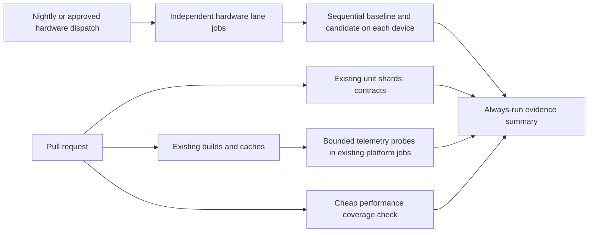

# PRD-358 — Performance regressions produce actionable CI failures on every platform

**Status:** PROPOSED — discovery and harness probes executed 2026-09-05; implementation not started.
**Complexity:** +3 for more than 10 implementation files, +2 concurrency/resource scheduling,
+2 multi-package integration = **7 → HIGH mode**. Checkpoint after every phase.
**Layer:** engine verification and CI infrastructure. Game fixtures supply representative work;
this does not change rendering defaults or move appearance decisions into packages.
**Owner:** implementing engineer owns integration; repository maintainer owns baseline approval and
required-check configuration; hardware-lane operator owns runner availability and calibration.

## Problem and intended result

A change can pass today's CI while increasing frame cost, startup time, or memory on a shipping
platform. Make existing measurement tools a maintained regression gate, without duplicating native
builds or turning each PR into a device soak. This is regression prevention; PRD-222 retains the
absolute performance targets and PRD-058 retains production reliability/soak acceptance.

Success means a deliberate slowdown in a real loop fails its applicable lane, identifies the
workload, metric, baseline and candidate, and cannot be hidden by missing observations, retrying
until green, a different GPU, a reduced workload, or a skipped platform.

## Discovery and evidence

Inspected at `d4635c2a96a8ffb2a2cfd6d3c0ab2b1d63fbaa3e`; checkout already had an unrelated
PRD README deletion. Executable probes and their limits are recorded in
[`runtime-perf-state.md`](../../verification/runtime-perf-state.md#performance-regression-strategy-discovery-2026-09-05).

| Existing path inspected | What it does now | Decision |
| --- | --- | --- |
| `.github/workflows/ci.yml:721`, `benchmark.playwright.config.ts`, `examples/abyss-framework/tests/viewport.playtest.ts` | `benchmark` runs LOC/scorer tests and the viewport-resize playtest; no frame-time comparison | Preserve these checks; add an explicitly named performance contract step/job |
| `packages/playtest/src/evaluators/render-evidence.ts`, `__tests__/performance.spec.ts`, `src/runner/perf.ts` | Existing real-loop observations, frame/phase p95, derived FPS, draw/triangle bounds; native log windows | Reuse evaluators and collection; distinguish actual presentation intervals from CPU work and simulation ticks |
| `scripts/engine-load-test/{cli,report,browser}.ts`, `examples/engine-load-test/src/{game,workload}.ts` | Opt-in ladder, moving-work validation, Android phone/emulator baselines, +25% cliff tolerance; unrecognized baseline returns undefined; browser disables vsync | Keep diagnostic use; explicit required-baseline mode for CI; label this throughput, never presented FPS |
| `packages/runtime-native/scripts/{profile-production,production-evidence,device-preflight}.mjs`, `tests/production-profile.test.mjs` | Production workload, startup/soak/resource evidence, fixture controls and platform provenance | Reuse lifecycle and evidence rules; do not implement another production profiler |
| `.github/workflows/native-platforms.yml`, `scripts/__tests__/ci-structure.spec.ts` | Existing native builds/caches; macOS/Windows matrix; iOS simulator; expensive Android/Linux parity conditional on PR label | Attach collection to existing builds; retain existing correctness coverage and distinguish advisory checks from merge gates |

Other incumbents: PRD-194 owns template performance scenarios; PRD-074 owns collapse/draw-folding
proof; PRD-222 owns floors and native/web parity; PRD-058 owns physical two-hour reliability proof.
This PRD consumes those contracts. It does not mark those PRDs complete or replace their thresholds.
Read current executable scenarios before relying on their historical status prose.

Observed CI run `33981507785`: success, 17:36:53–17:49:43 UTC (770 seconds).
`benchmark` occupied 49 seconds; `test-native` occupied 330 seconds; build occupied 35 seconds but
started 250 seconds after workflow creation. These are one-run measurements, not p95 or an estimate
of queue delay alone. Existing workflow comments also report runner-pool contention. More matrix
rows alone do not establish lower wall time. Collect at least 20 comparable runs before promotion.

Local discovery: Chromium and display available; Android online, 80% battery, discharging,
thermal NONE, battery 32.8 °C. iOS unavailable (`xcrun` absent on Linux). No hardware FPS,
startup, sustained-memory or noise calibration was measured in this discovery. Device availability
is not physical performance proof, and the phone exceeded the historical 31.5 °C cool-run limit.

## Scope and platform coverage

| Lane | PR behavior | Scheduled/release behavior | Evidence class |
| --- | --- | --- | --- |
| Browser WebGPU | Required contracts, workload invariants and software-compatible smoke on hosted Linux | Pinned physical GPU browser runs; Linux, Windows and macOS references paired with native | Software CI cannot certify player FPS; browser/version and backend explicit |
| Native Linux | Reuse `test-native` binary for bounded contract/telemetry probe | Dedicated Linux GPU paired baseline comparison | Hosted software smoke separate from hardware Vulkan/Dawn performance |
| Native Windows and macOS | Short smoke/telemetry checks in existing desktop matrix after build | Dedicated Windows GPU and Apple hardware comparisons, separately keyed | V8/Dawn; OS, architecture and GPU are distinct lanes |
| Native Android | Existing emulator lane gets bounded telemetry/engine canary whenever it runs | Physical Android plus Chrome on same device; nightly and release | Emulator never substitutes for phone; V8 default checked |
| Native iOS | Existing simulator job gets JSC telemetry/workload smoke | Signed physical iOS device; native Metal/JSC performance, browser comparison only if measured/supported | Simulator never substitutes for physical iOS |

“All platforms” requires every row to be represented; each physical lane remains UNVERIFIED until
provisioned and calibrated. No fallback green. Android QuickJS rollback is a separately identified
compatibility lane, not a baseline substitute. Baselines key architecture explicitly; additional
shipping architectures need their own scheduled row before claiming performance coverage.

## Design and measurement policy

1. **Fast deterministic protection.** Collect the existing allocation, traversal, batching,
   moving-owner, draw/triangle and engine-selection contracts in normal test shards. Add a cheap
   required coverage test that ensures every requested lane/workload/metric has a consumer and
   negative control. Hosted rendering only gates correctness, observation completeness, and exact
   workload costs such as draws; hosted timing starts advisory and never claims physical FPS.
2. **Representative runtime coverage.** First hardware proof uses the scaffolded platformer
   production workload and the existing moving 16,384-object L2/L3 ladder. Platformer exercises
   physics, animation and HUD while the ladder exposes draw submission and JS engine cliffs.
   Add the remaining template scenarios through PRD-194; startup/streaming/shader-first-use,
   particles and UI churn must be assigned workload rows, never inferred from an idle cube.
3. **Comparable measurements.** Freeze seed, input path, camera, workload/assets, resolution/DPR,
   quality, object/moving-part counts, render stages, build mode and refresh/present policy. Check
   nonblank output, ready state, input-driven movement, no runtime errors and work counters before
   evaluating timings. Lowering resolution or stopping animation invalidates a faster result.
4. **Separate clocks and windows.** Startup starts at process/activity/navigation launch and ends
   at the first nonblank workload frame. Steady state begins after explicit readiness and complete
   sample reset (or documented buffer overwrite), with at least 1,000 actual frames and 30 seconds,
   whichever is longer. Measure wall intervals and CPU phase costs separately; never use fixed dt
   as FPS. Report p50/p95/p99, mean FPS from total intervals, worst frame and count above 33.3 ms.
5. **Resources and validity.** Record memory high-water and comparable post-warmup growth,
   compilation/pipeline counts, and available CPU/GPU phase costs. Unsupported optional GPU timing
   is explicit, not zero. Required missing metrics fail validation. Hardware runs require adapter
   identity, foreground/presentation control, no competing renderer, power/thermal preflight and
   end-of-run validation. Use OS presentation evidence on mobile; do not equate JS render calls
   with displayed frames. Long thermal and memory-soak requirements delegate to PRD-058.

### Baselines, thresholds and verdicts

New manifest `scripts/performance-regression/lanes.json` (proposed) names lane, workload, required
metrics, executable producer, baseline provenance, policy revision and evidence class. Baseline
identity includes source SHA, bundle/native binary hashes, workload/assets hash, instrumentation
revision, OS/arch, JS runtime, graphics backend, GPU/driver, browser, resolution and present mode.
Candidate SHA must differ for a regression comparison; calibration explicitly allows same-source
independent launches and labels them A/A, never release proof. Identical report hashes are rejected.

Calibrate each physical workload using ten independent A/A pairs across at least three sessions.
Proposed initial threshold for frame/phase p95 is **both +10% and +1 ms**, startup p95 **both +15%
and +250 ms**, memory high-water **both +10% and +16 MiB**. These are design starting points,
not measured tolerances. Retain PRD-222 absolute floors as an independent gate. Exact invariants
(e.g. expected moving count) have no statistical tolerance. Track p99 and hitch counts from day one;
promote their lane-specific limits only after calibration rather than guessing a tail threshold.

For every timed comparison, run three alternating baseline/candidate pairs on the same idle
hardware, reversing initial order by run. Compare per-launch statistics, not pooled frames.
A metric fails when the median paired delta breaches both limits and at least two of three pairs
breach both. Absolute floors evaluate candidate runs independently. Require five cold launches
per arm for startup p95 (nearest-rank is effectively the worst with five). Invalid thermal or
presentation runs yield BLOCKED; allow at most one invalid-pair replacement with every attempt
retained. Never retry a valid failing measurement into a pass. If A/A noise breaches proposed limits,
keep that metric advisory and improve isolation/sample duration; no automatic threshold widening.

Use the existing production verdict meanings: PASS/0, regression FAIL/1, invalid or missing
required evidence BLOCKED/2. Aggregation treats FAIL and BLOCKED as non-success for required lanes;
it displays SKIPPED and UNVERIFIED distinctly. An absent baseline in required mode is BLOCKED,
including `checkPerformance()` returning undefined. Baseline changes require a reviewed diff with
old/new values, source/artifact identities, calibration and justification. Candidate PRs cannot
approve their own baseline. Never regenerate baselines as part of the normal gate run.

### CI topology and resource budget

Propose a named `performance-contracts` check, with a maximum two-minute total job budget,
only if its CI topology/coverage work is not already covered by the unit shards. Do not rerun the
same tests there. Physical timings live in a dedicated `performance-regression.yml` workflow;
this is the dedicated performance lane, and it has no dependency on the long golden-path matrix.
Platform probes reuse the current job's binaries, not a second full native compile. Artifact
handoffs verify SHA, platform, toolchain and hashes; caches accelerate builds but never certify
measurement or baseline freshness.

| Budget | Acceptance target, to be measured in Phase 6 |
| --- | --- |
| PR aggregate increase | At most 6 runner-minutes and p95 end-to-end increase at most 120 seconds across 20 comparable warm-cache PR runs |
| Per existing native job | At most 45 seconds added warm execution; no extra native build; timeouts retain raw output |
| Hardware quick suite | At most 15 minutes per platform excluding documented device cooling; maximum 2 concurrent hardware jobs initially |
| Device access | One measurement per physical GPU/device across workflows; baseline/candidate serial; OS lanes parallel on separate machines |
| Heavy workload rotation | Quick representative suite nightly; full template set weekly; two-hour soak on release/manual through PRD-058, outside PR path |

Capture cold-cache cost separately and publish job compute, queue delay, critical path and total
runner-minutes. If budgets fail, reduce duplicate setup or rotate diagnostic workloads; do not
weaken required assertions or hide a failed lane. Hardware concurrency uses a resource-specific
lease that survives workflow boundaries and cleans up on timeout. Superseded PRs may cancel;
accepted main/release evidence must finish or explicitly report cancellation.

Hardware execution of untrusted PR code must use an isolated disposable worker, no signing or
release credentials, and explicit trusted dispatch; never use `pull_request_target` to run PR code
on the owner's phone. Required hosted contracts run on every PR. Hardware timings become required
for relevant trusted changes only after calibration and runner capacity are established. Before
that, summaries say “hardware regression protection advisory”; releases require all claimed
physical lanes and PRD-058 proof rather than treating advisory green as release acceptance.

## Integration Ledger

Line references below name current callers or planned call sites; replace planned wiring with
actual non-test `file:line` in each phase. A test-only caller does not close a row.

| # | New or changed thing | Live entry/caller to edit | Replaces / old path disposition | Negative control |
| --- | --- | --- | --- | --- |
| 1 | Required baseline validation | `scripts/engine-load-test/cli.ts` → `report.ts:405` | Optional baseline remains for diagnostics; required mode rejects undefined | Remove selected lane baseline → exit 2 |
| 2 | Lane policy and paired comparison | Existing benchmark CLI invokes proposed `scripts/performance-regression/compare.ts` | Historical Android cliff tables stay explicit legacy inputs, not universal defaults | +50 ms real-loop delay → exit 1; cross-device input → exit 2 |
| 3 | Reusable workload collection | `profile-production.mjs:155` and benchmark CLI entry | Reuse collectors; production default durations unchanged | Missing marker/short window/stopped workload rejected |
| 4 | Hosted platform probes and hardware workflow | `.github/workflows/ci.yml` and `native-platforms.yml` invoke collectors; new scheduled workflow invokes paired runs | Existing benchmark viewport/LOC coverage retained | Remove collector invocation/artifact → CI summary non-success |
| 5 | Evidence summary and baseline approval | Existing CI `run-summary` job and new workflow summary invoke comparison report | No independent status database; reuse existing artifact/status conventions | Stale SHA or empty platform result set cannot pass |

No product UI, public game API, new package, database, renderer optimization, or external service
integration is required. Observable output is check status, GitHub job summary and downloadable
raw evidence. Store raw artifacts for 14 days on success and 30 days on failure; keep accepted
baseline inputs for their lifetime plus one rollback generation. Version policy/summary in git,
not megabytes of frames. Consolidate performance findings in the existing runtime performance
record. Each report carries exact commands, sample durations/counts, units, thresholds and reasons.

## Execution phases

Each phase has at most five implementation files, includes a pre-existing caller edit and ends in
an automated checkpoint. Evidence updates to the shared runtime record accompany the phase.
All named NEW paths below are proposals, not commands or files already shipped.

### Phase 1 — Missing or incompatible baselines cannot clear a requested gate

**Files (4):** EDIT `scripts/engine-load-test/cli.ts`, `scripts/engine-load-test/report.ts`,
`scripts/__tests__/engine-load-test.spec.ts`; NEW `scripts/performance-regression/lanes.json`.

- [ ] Add explicit required-baseline CLI mode and lane identity validation; preserve opt-in diagnostics.
- [ ] Declare every platform row, required producer/metric and evidence class; unavailable baseline is explicit.
- [ ] Wire CLI to validation, fill ledger #1, and keep one comparison owner.

**Tests:** existing engine-load spec: `should reject a required missing baseline`, `should reject
cross-device or empty-rung evidence`, `should preserve optional diagnostic mode`. Run real CLI
against retained reports with a baseline removed; expect exit 2. Restore compatible input for green.
**Revert check:** removing required-mode wiring must make that CLI proof fail its expected exit.
**Checkpoint/user action:** inspect one report; it names missing lane and recovery, not PASS.

### Phase 2 — The production workload supplies trustworthy short-run observations

**Files (4):** EDIT `packages/runtime-native/scripts/profile-production.mjs`,
`packages/runtime-native/scripts/production-evidence.mjs`,
`packages/runtime-native/tests/production-profile.test.mjs`, `scripts/engine-load-test/cli.ts`.

- [ ] Add explicit regression collection profile with bounded duration and reusable built artifacts;
      retain existing production/soak defaults and artifact identity checks.
- [ ] Use platformer and high moving-object workload first. Validate readiness, actual clocks,
      complete warmup reset, minimum duration/count, moving work and pixels before evaluating.
- [ ] Wire ledger #3. Missing physical tools leave the named lane open; no simulator substitution.

**Tests:** production-profile spec rejects stale binary, fixed-tick FPS, startup-contaminated
samples, fewer than 1,000 frames/30 seconds, frozen motion and absent marker. Happy collection
uses independent process launches on real web/native desktop. Existing playtest scenario must
still prove physics/input/HUD behavior alongside measurement.
**Red/green:** remove the native timing marker in a test build, execute the actual collector,
observe nonzero, restore and rerun. Synthetic fixture control alone does not close this phase.
**Revert check:** disable regression profile collector invocation; existing CLI flow must fail.
**Checkpoint:** manually inspect gameplay capture and timing identity before accepting numbers.

### Phase 3 — Paired comparisons detect regressions without comparing unrelated machines

**Files (4):** NEW `scripts/performance-regression/compare.ts`,
`scripts/__tests__/performance-regression.spec.ts`; EDIT `scripts/engine-load-test/cli.ts`,
`scripts/engine-load-test/report.ts`.

- [ ] Implement pure paired policy evaluation and structured summary using existing report parsing;
      validate finite positive timings, units, pairs, hashes, identity and all requested metrics.
- [ ] CLI calls comparator and preserves exit semantics; fill ledger #2. Legacy cliff evaluation
      delegates shared validation where appropriate; no duplicate percentile implementation.
- [ ] Calibrate provisional limits with the declared A/A sample protocol and retain raw results.

**Tests:** boundary/equality, absolute+relative limits, two-of-three agreement, invalid replacement
limit, unknown metric, missing baseline, identical artifacts, unrelated devices, candidate-only
baseline promotion, absolute floor independent of relative pass.
**Red/green:** inject +50 ms into the real measured update/render loop, observe failing paired
comparison, restore and observe green on the same device. Test +250 ms startup and bounded memory
controls separately when those metrics are promoted. Record control detection and A/A false alarms.
**Revert check:** bypass comparator → existing CLI expected-failure integration fails.
**Checkpoint:** inspect all six run identities and confirm no retry-to-green.

### Phase 4 — Existing platform CI reports bounded performance-contract evidence

**Files (4):** EDIT `.github/workflows/ci.yml`, `.github/workflows/native-platforms.yml`,
`scripts/__tests__/ci-structure.spec.ts`; NEW `scripts/performance-regression/ci-summary.ts`.

- [ ] Reuse compiled artifacts in current Linux, Windows/macOS, Android emulator and iOS simulator
      jobs; execute only bounded telemetry/invariant smoke, not the physical 30-second timed suite.
- [ ] Keep old benchmark checks and preserve native PR-label conditions. Coverage summary names
      intentionally unscheduled legs; required contracts do not claim those legs executed.
- [ ] Always upload failure artifacts and aggregate FAIL/BLOCKED/skips explicitly. Wire ledger #4/#5.

**Tests:** CI-structure checks actual workflow invocations/dependencies, all matrix entries,
no duplicate native build, timeout/concurrency budgets, `always()` evidence and no permissive
`continue-on-error` around required performance checks. Test summary on failed, missing, cancelled
and stale-SHA artifacts, including an empty matrix.
**Red/green:** remove one collector invocation in a workflow fixture; structure check fails.
Run an actual workflow probe with missing telemetry; check status fails with retained artifact.
**Revert check:** new code removal breaks pre-existing workflow/summary invocation.
**Checkpoint:** inspect a real CI run, not YAML tests alone; paste durations and output.

### Phase 5 — Independent hardware lanes compare reviewed baseline and candidate

**Files (4):** NEW `.github/workflows/performance-regression.yml`,
`scripts/performance-regression/run.ts`; EDIT `scripts/performance-regression/lanes.json`,
`scripts/__tests__/ci-structure.spec.ts`.

- [ ] Wire scheduled/manual workflow to existing collectors and comparator; isolated source checkouts
      live inside their owning repository's ignored `.worktrees/` directory and are built separately.
- [ ] Provision Linux/Windows/macOS hardware, Android phone and signed iOS phone; serialize each
      device, alternate paired order, validate thermal state and artifact identity before each arm.
- [ ] Publish coverage for all lanes; weekly workload rotation and release soak call existing tools.

**Tests:** lease collision and timeout cleanup, cancelled run cannot publish PASS, wrong APK/binary
hash, untrusted dispatch restrictions, requested-but-unprovisioned lane and simulator-as-phone.
**Red/green:** contention refuses a second measurement; +50 ms slow loop fails each physical lane;
restored candidate passes its calibrated baseline. Physical iOS remains unchecked until executed.
**Revert check:** remove workflow runner call; coverage check rejects missing lane outputs.
**Checkpoint:** hardware operator verifies each device identity, signed iOS capture and thermal
record. All provisioned platform rows need independent observed red and green.

### Phase 6 — Protection is promoted only after accuracy and CI cost are measured

**Files (4):** EDIT `scripts/performance-regression/lanes.json`, `.github/workflows/ci.yml`,
`.github/workflows/performance-regression.yml`, `scripts/__tests__/ci-structure.spec.ts`.

- [ ] Collect 20 unchanged-source calibration runs per proposed required timing lane; zero false
      regression failures and all intentional material regressions detected under declared policy.
- [ ] Compare 20 comparable PR runs before/after: publish total runner-minutes, queue time,
      critical path and cache state; meet the 6-minute/120-second incremental budgets.
- [ ] Maintainer enables calibrated required checks in repository settings and records exact names;
      unprovisioned/advisory rows stay explicit. Baseline updates remain reviewed separately.

**Tests:** changed policy without calibration rejected; stale/absent baseline rejected; required-check
coverage contains all promoted rows. Observe intentional slowdown blocking a test PR, then restore.
**Revert check:** deleting performance job must leave the required check unsatisfied.
**Checkpoint:** inspect actual check protection and raw run costs; do not infer enforcement from YAML.

## Verification, completion and rollback

Before each implementation checkpoint run phase tests and applicable real playtest, then
`pnpm typecheck`, `pnpm lint`, `pnpm test`, `pnpm budgets`, and `git diff --check`.
Search capabilities and read relevant package guidance before package changes. A reviewer agent
must audit real callers, incumbent disposition, negative controls, source identity and the revert
check; no phase passes on tests alone. Manual hardware review supplements automated review.
After three failed fixes, stop and name the doubtful assumption. Paste executed outputs in the
runtime performance record; unexecuted commands are UNVERIFIED.

- [ ] Every shipping platform/architecture has a declared lane; every claimed physical lane has
      calibrated current-source red/green evidence, with simulation/software provenance separate.
- [ ] Real-loop slowdown, missing sample, frozen work, changed pixels, stale artifact, missing
      baseline and lease contention controls produce the specified non-success outcomes.
- [ ] Required hosted contracts and promoted hardware checks run through existing CI flows;
      branch protection is observed, and every ledger row has actual non-test file:line wiring.
- [ ] False-alarm, sensitivity and CI-cost targets pass on measured samples; baseline updates are
      reviewed and never silently ratchet with regressions.
- [ ] PRD-222 floors and PRD-058 release/soak obligations retain their owners; no missing iOS
      hardware, unresolved workload or advisory-only platform is counted as complete.

Rollback reverts CI wiring and comparison policy together, keeps existing viewport/unit/native
correctness checks, preserves baseline/history artifacts and marks regression coverage reduced.
Do not loosen a threshold to repair a red gate. Fix the regression or approve a documented product
budget change. Archive this PRD only after implementation and all acceptance boxes are complete.

**First implementation action (under two minutes):** run
`pnpm exec vitest run scripts/__tests__/engine-load-test.spec.ts`, then start Phase 1's missing-baseline control.
