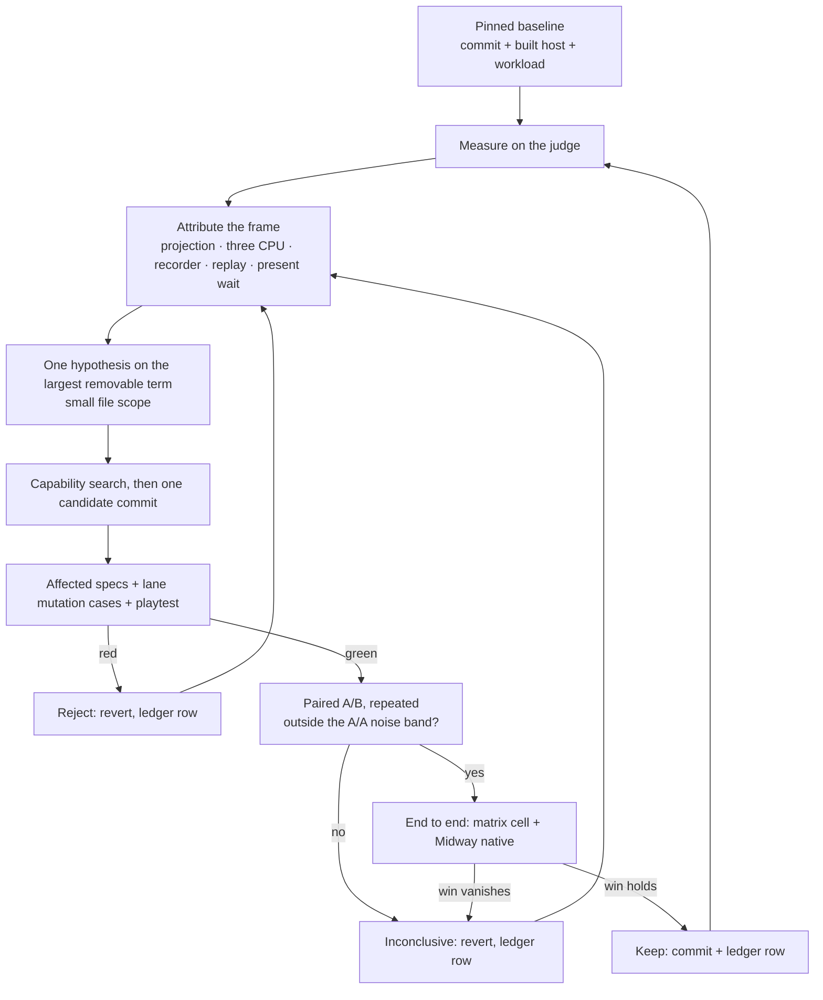

# PRD-400 — The frame gets cheaper one measured, removable cost at a time

**Status:** IN PROGRESS
**Progress:** 0/5 phases (Phase 1: skill and judge plumbing landed; live baseline pending)
**Complexity:** 7 → HIGH; 11+ implementation files across core, the three.js patch, the native
recorder and the C++ replay (+3), retained projection and command-plan state (+2), crosses the native
host build (+2); risk override: none.
**Owner:** Engine performance agent, executing through the `perf-loop` skill Phase 1 creates.
**Depends on:** nothing to start. Absorbs, never repeats: [PRD-388](critical/PRD-388-an-automatic-optimizer-must-price-its-own-cost.md)
(projection prices its own cost), [PRD-389](critical/PRD-389-the-frame-budgets-instruments-do-not-lie.md)
(instrument honesty), PRD-395/396 (render-phase attribution, branch-only), and
[native compiled frame plans](../PRD-native-compiled-frame-plans.md) (recorder transport). Hands lanes
4–6 to their owning PRDs (see *Out of scope*).
**Source:** a code-informed prioritization the owner supplied on 2026-09-22, inspected at
`develop@fac2f7149`. It ranked systems from reading code; it measured nothing.

## Outcome

Games get faster without doing anything: same scene, same pixels, same settings, less CPU per frame
on native and in the browser. The work runs as a loop — measure, attribute, change one thing, prove
nothing broke, keep or reject on a repeated A/B — instead of a string of one-off optimizations whose
effects never add up in a real game.

The loop is a skill, `perf-loop`, and it outlives this PRD. This PRD is its first campaign: build the
judge, then work lanes 1–3 in order — scene projection → three.js CPU bookkeeping → frame recording
and native replay. That chain decides how much work reaches the GPU and what each unit of it costs.

## What is already known — start here, do not rediscover

| Fact | Number | Source |
| --- | --- | --- |
| Midway native desktop is CPU-bound | 1280×720, `sampleCount 4`: 38.7–41.3 fps, frame p50 21.4–22.9 ms, render p50 17.1–18.3 ms, GPU 2.1–2.7 ms | `docs/verification/runtime-perf-state.md`, 2026-09-17 |
| The render phase is per-draw work | 87% per-draw loop, 14% traversal, 1% sort; **8.9 µs/draw**, **0.87 µs/object**; `bindings.updateForRender` is 26% of render | PRD-395 on `fix/native-perf-followups@203663671`, not on develop |
| Traversal is a small prize | static-transform freeze recovers 0.009 ms on 1,561 objects; the whole traversal prize is ≤ ~1.4 ms | PRD-396, same branch |
| Predicted draws misprice the projection | on Midway it cost 1.378× callback time and +4.2–5.1 ms of reconcile; draws fell 527 → 194 while shadow/reflection cameras could no longer cull its batches | PRD-388 |
| Admission still uses the plan, not the frame | `MIN_BATCH_MEMBERS = 4`, `WORTHWHILE_DRAW_RATIO = 0.75`; `drawsPlanned` is documented as optimistic because a `BatchedMesh` issues one `drawIndexed` per visible member on WebGPU | `packages/core/src/projection-plan.ts:38,52`; `renderProjection.ts:96-104` |
| A smaller packet is not a faster game | compiled frame plans cut recorder cost 43–45% and packets 94.8–99.5% on draw-heavy frames | native compiled frame plans PRD |
| `profile:native-cpu` is a browser tool | Playwright Chromium; diagnoses shared costs, never the native verdict | `scripts/profile-native-cpu.ts:6` |

**Already implemented — never a loop proposal:** projection scan-workspace reuse, matrix compares, slot
reuse and growth headroom, and the `renderer.projection = false` opt-out; the three patch's
source-material tracking and previous-frame velocity data; the recorder's retained records,
skip-unchanged, buffer rotation and adaptive plan selection with a 32-frame retry backoff
(`frame-op-stream.js:17`); off-thread image decode (4 workers, 512 queued, 8 completed results,
`async_image_decode.cpp:24-28`); pipeline-cache persistence.

## Solution

### The loop

### The judge — built once, frozen per lane

- **Tool:** `pnpm profile:production`. It already pairs arms, repeats, warms up, cold-starts, records
  source provenance and runs the `--control slow-native` negative control. It only knows the
  scaffolded platformer (`profile-production.mjs:299`), so Phase 1 teaches it to take an existing
  project and scenario. No new benchmark framework.
- **Tuning matrix:** `examples/engine-load-test`, which already runs on web, desktop and Android.
  Phase 1 adds axes: shared vs unique geometry and material, hierarchy depth, visible fraction,
  mutation rate (0, 1% and 10% of objects per frame), shadow-caster share and pass count. The default
  axes reproduce today's scene, so `positionHash` and the Godot port stay equivalent.
- **Representative game:** `sandbox/midway-open-pacific`, native desktop packaged build and browser.
  Reinstall its tarballs after each keep and verify the installed bytes before trusting a number.
- **Holdouts, never tuned against, run only at lane end:** the scaffolded platformer
  (`profile:production`'s default) and one more sandbox game, named in Phase 1 before the first
  candidate and never swapped.
- **Attribution:** five terms per frame — projection reconcile (`timings.reconcileMs` on the
  projection report), three.js CPU, recorder JS, native replay, present/GPU wait. Existing meters
  first (`TN_FRAME_BUDGET`, the projection report, `TN_HOST_GAP`'s replay split, recorder counters,
  `TN_JS_CPU_PROFILE`). Salvage PRD-395's `packages/core/src/profiling/Spans.ts` and `span-probes.ts`
  from `fix/native-perf-followups` only for a term those meters cannot name.
- **Noise band:** an A/A of the same build, per metric and per lane. Every A/B records each arm's
  build hash and asserts the hashes differ.
- **Recorded on every run:** frame p50/p95/p99, render p50, the five terms, measured draws, render
  objects processed, uploaded bytes, allocations/GC, long frames over twice the frame budget.

### Loop rules — the skill carries these verbatim

1. **The candidate cannot change the evaluator.** Frozen per lane: `profile-production.mjs`,
   `production-evidence.mjs`, `examples/engine-load-test/src/workload.ts`, the scenarios, playtest
   assertions and budgets. `git diff --name-only <baseline>..HEAD -- <frozen paths>` must be empty for
   a candidate. Changing the judge is its own commit and re-baselines the lane.
2. **No quality moves.** Resolution, `resolutionScale`, `sampleCount`, content, quality tier, post
   chain and shadow maps stay fixed. A change beyond the visual noise floor is rejected.
3. **A local win must survive end to end.** Microbenchmarks and span deltas diagnose. Keep needs the
   matrix cell and Midway native to move outside noise, with no other recorded metric regressing
   outside noise.
4. **The loop rejects its own work.** Neutral or noisy is `inconclusive`: recorded, reverted, next.
5. **Two failures with the same cause** → stop editing, re-attribute, re-plan.
6. **Lane stop:** move on when three consecutive candidates in a lane are rejected or inconclusive
   and no single removable term in it exceeds the noise band, or when the lane's term falls below 10%
   of the frame.
7. **Layer:** every change is mechanism in `packages/` or the three patch — never game code, never
   `src/render/`. A path both runtimes share is measured on both.
8. **Capability search before any new file under `packages/`** (engine `AGENTS.md`, rule 1).
9. **Commit per candidate** in the lane's worktree, revert a rejected one with `git revert`, and stage
   by path: the shared checkout carries other agents' WIP.

### Cadence — what runs when

| When | Runs |
| --- | --- |
| Every candidate | affected `<package>/__tests__` specs; the lane's mutation cases; paired A/B on one native desktop matrix cell |
| Every keep | the lane's playtest; Midway native desktop steady state via the `measure-steady-state-fps` skill; the same cell in the browser on a real adapter (`--browser-recipe webgpu`, `adapter.info` checked) |
| Every third keep, and at lane end | `pnpm typecheck && pnpm lint && pnpm test`; `pnpm test:playtest`; `pnpm test:templates`; `pnpm parity` when `runtime-native` changed; `pnpm visuals:ab`; both holdouts |
| Lane end | Android: Pixel 8 for any FPS verdict, the emulator for correctness only |
| Campaign end | `native-platforms.yml` dispatched on the PR head (iOS, macOS, Windows correctness) |

### Ledger

One section in `docs/verification/runtime-perf-state.md`, *Performance loop — PRD-400*, because
runtime/core performance findings update that file in place (owner policy, 2026-08-27). One row per
candidate, rejected ones included: id (`L1-03`), hypothesis, files, target metric
baseline → candidate with its noise band, other metrics, verdict, commit. Boxes below cite row ids.

### Lane 1 — scene projection

`packages/core/src/renderProjection.ts`, `projection-plan.ts`, `projection-apply.ts`.

It changes *how much* work three.js receives, not how cheaply each piece runs, so it goes first. First
experiment: an unchanged 10,000-object cell against the same cell with 1% mutating per frame; split
the remaining cost into classification, matrix propagation, mirror updates, renderer traversal and
draws, and attack only the largest. Then the cost-model question: does `drawsPlanned` predict the work
that actually disappears, counting the shadow and reflection passes? With per-draw work at 87% of
render and batches drawing per member, expect admission to need the measured frame — PRD-388's rule —
but the numbers decide. A keep that implements PRD-388 ticks PRD-388's boxes too.

Mutation acceptance: spawn, despawn, material swap, reparent, capacity growth, a batch culled by the
shadow camera, background/environment rotation.

### Lane 2 — three.js CPU bookkeeping

`patches/three@0.185.1.patch`, applied through `pnpm-workspace.yaml:33`.

Hold object count constant; vary material diversity, shadow-caster mix and pass count; diff CPU
profiles. The starting mass is `bindings.updateForRender` at 26% of render. The question: which render
decisions are recomputed while their inputs have not changed? Changes stay narrow, shared by web and
native, and never suppress updates wholesale. Acceptance: material replacement, alpha-tested shadows,
skinned animation and velocity/TRAA previous-frame state — a static screenshot cannot catch the last.

### Lane 3 — frame recording and native replay

`packages/runtime-native/src/runtime-scripts/frame-op-stream.js`,
`src/webgpu/bindings_frame_stream.cpp`, `src/webgpu/bindings_commands.cpp`.

Measure recording, plan maintenance and replay separately, optimize their sum. Command shapes: stable,
changing transforms, changing bindings, frequent resource creation, upload-heavy. Compare the v1/v2
reference transport with automatic plan selection. The first experiment answers whether the remaining
cost is JavaScript recording or native replay, which decides where the next change goes. Protect the
`mapAsync` safe-submission boundaries, readbacks and resource lifetime.

### Out of scope — lanes 4–6

Resources, uploads and pipeline compilation (PRD-368, PRD-370, PRD-387), asset loading and decode
completion (PRD-360), native scheduling and presentation (PRD-222). They need their own scorecards —
startup, first-use stalls, long frames, input latency — which average frame time does not measure.
The loop re-profiles after every keep; when the dominant removable term moves into one of these, it
records the number and hands it to the owning PRD instead of following it. A warm-cache startup win
is never reported as a steady-state win.

## Acceptance criteria

- [ ] AC-1 [local; actor: agent]: A fresh subagent given only the `perf-loop` skill and this PRD runs
  one full iteration unassisted and writes a valid ledger row — Evidence: pending.
- [ ] AC-2 [local; actor: agent]: Midway native desktop at 1280×720, `sampleCount 4`, identical
  content: frame p50 at least 20% below the pinned Phase 1 baseline, outside the A/A noise band, p95
  no worse — Evidence: pending.
- [ ] AC-3 [local; actor: agent]: Midway in the browser on a real WebGPU adapter: frame p50 no worse
  outside noise, improvement recorded — Evidence: pending.
- [ ] AC-4 [local; actor: agent; needs the Pixel 8 attached]: the engine-load-test matrix cell on
  Pixel 8 via its Android runner: steady-state frame p50 no worse outside noise, improvement
  recorded — Evidence: pending.
- [ ] AC-5 [local; actor: agent]: both holdouts — the platformer through `profile:production` (web
  and `desktop-pair`) and the named sandbox game — no worse outside noise — Evidence: pending.
- [ ] AC-6 [local; actor: agent]: nothing broke on the final head: `pnpm typecheck && pnpm lint &&
  pnpm test`, `pnpm test:playtest`, `pnpm test:templates`, `pnpm parity`, `pnpm visuals:ab` within
  its noise floor, and every lane playtest green — Evidence: pending.
- [ ] AC-7 [shared; actor: agent dispatches, CI runs]: `native-platforms.yml` green on the final PR
  head for iOS, macOS and Windows correctness (not performance) — Evidence: pending.

## Integration Ledger

| Capability | Reachable consumer/trigger | Replaces / disposition | Evidence |
| --- | --- | --- | --- |
| Judge measures any project | `pnpm profile:production` with a project and scenario → `profile-production.mjs` argument parser | extends; the scaffolded platformer stays the default | Phase 1 |
| Workload matrix | engine-load-test browser/desktop/Android runners → `examples/engine-load-test/src/workload.ts` | extends; default axes reproduce today's scene | Phase 1 |
| Projection changes | the game frame → `SceneRenderProjection.reconcile()` at `packages/core/src/game.ts:1016,1354,1623` | in place | AC-2, Phase 2 |
| three.js bookkeeping | `pnpm install` applies `patches/three@0.185.1.patch` → three's renderer | in place | AC-2, AC-3, Phase 3 |
| Recording and replay | native frame boundary → `frame-op-stream.js` → `bindings_frame_stream.cpp` | in place; v1/v2 stays the automatic fallback | AC-2, Phase 4 |
| The loop | an agent invokes `/perf-loop` | new skill | AC-1 |

## Execution Phases

Work runs in `.worktrees/prd-400-perf-loop/`, branched from `develop`, with one draft PR to
`develop` opened before Phase 1. Run `pnpm prd:progress` on this file before starting and after each
phase.

### Phase 1 — The judge and the skill exist before any optimization

**Status:** IN PROGRESS
**ACs:** AC-1
**Files:** `.claude/skills/perf-loop/SKILL.md` (new) and its `.agents/skills/perf-loop` link;
`packages/runtime-native/scripts/profile-production.mjs` (project and scenario input);
`examples/engine-load-test/src/workload.ts`, `game.ts` (matrix axes); the ledger section in
`docs/verification/runtime-perf-state.md`; salvaged span files only if the attribution box needs them.
**Verification:** `pnpm check:docs` plus the instruction-budget and `sync-agent-docs` specs for the
skill; the engine-load-test equivalence spec for `positionHash`; the judge's own sensitivity controls.

- [ ] Judge accepts matrix cells and Midway; `positionHash` unchanged at the default axes.
- [ ] Five-term attribution closes to at least 95% of the native desktop frame on one matrix cell and
  on Midway.
- [ ] A/A noise band and pinned baseline recorded as ledger rows `L0-*`: matrix cells, Midway native
  and browser, both holdouts named and measured.
- [ ] Judge sensitivity: `--control slow-native` and a resolution-cut candidate both come back
  `reject`.
- [x] Skill written and linked; docs, instruction-budget and `sync-agent-docs` checks green —
  `.claude/skills/perf-loop/SKILL.md`, `.agents/skills/perf-loop` symlink; `pnpm check:docs` (2,199 links),
  `check-doc-links`, `sync-agent-docs`, `evidence-budget` specs 29/29, `instruction-budget` 9/9, 2026-09-22.

**Checkpoint:** Project/scenario staging, workload axes and projection timing markers are on
`perf/prd-400-ac1`; the staged judge preserves the game's automatic resolution and authored UI
renderer. Focused checks passed. The [L0 contract](../../verification/runtime-perf-state.md)
names the frozen judge paths and holdouts. Midway's tracked `c277aee` game source is snapshotted at
`sandbox/.afk/prd400-midway-source` so its separate package changes cannot enter the baseline.
That game needs core's launch-failure and pending-asset API from `acef62180`; the existing engine
implementation is included here so the unchanged snapshot builds against this branch.
Desktop preflight reached the packaged game after fixing its embedded-entry launch, then exposed a
judge-generated browser-only diagnostic assertion; native scenarios now assert supported startup
readiness. The repeated live run reached Midway's flight workload, then native WebGPU rejected a
4-sample depth texture bound to a single-sample layout; the later screenshot failure is secondary.
Native Midway measurements remain blocked while the renderer binding is investigated.
The web preflight initially selected SwiftShader and lost its GPU instance because the judge
launched Chromium headless. Headed WebGPU under the existing private display reached the flight
workload; the playtest runner now excludes only failed POSTs to the judge's exact loopback marker
URL from its network assertion. A one-run preflight then returned `PASS` with 900 frame samples,
startup and all three markers; Chromium `adapter.info` reported `nvidia / turing`. This is a
preflight on a dirty checkout, not a pinned baseline or A/A noise result.
The native generated flight scenario now converts an authored viewport-pixel click into the desktop
pointer transport at the same normalized location; 57 focused judge tests pass. A short native 4x
smoke still fails at pipeline creation: the shader declares a multisampled depth binding while its
layout declares a single-sample binding at group 1, binding 11. Scratch tracing was confined to
the ignored snapshot and removed after capture. Native measurements remain blocked.
The two unpaired 10,000-object desktop matrix arms completed and are recorded as discovery in
the L0 ledger; their run-order difference cannot establish a noise band. `pnpm typecheck`,
`pnpm lint`, and `pnpm test` passed locally (454 files, 5,519 tests; 8 skipped).
Full matrix/Midway baselines, A/A noise, sensitivity controls and AC-1's full iteration remain unverified.

### Phase 2 — Lane 1: scene projection

**Status:** NOT STARTED
**ACs:** contributes to AC-2, AC-3
**Files:** `packages/core/src/renderProjection.ts`, `projection-plan.ts`, `projection-apply.ts`, their
specs, one projection mutation playtest scenario.
**Verification:** each candidate on the cadence table; the mutation scenario on web and native desktop.

- [ ] First experiment recorded (`L1-00`): unchanged vs 1%-mutating 10,000-object cell, the five-term
  split and the projection sub-split.
- [ ] Cost model checked across the matrix (`L1-01`): planned vs measured draws and frame time,
  shadow and reflection passes included.
- [ ] Projection mutation scenario green on web and native desktop, a red observed first for any
  defect it catches.
- [ ] Lane closed by the stop rule, with at least one keep or the evidence that nothing removable
  remains; every keep's end-to-end numbers in the ledger.

**Checkpoint:** pending

### Phase 3 — Lane 2: three.js CPU bookkeeping

**Status:** NOT STARTED
**ACs:** contributes to AC-2, AC-3
**Files:** `patches/three@0.185.1.patch`; the core specs and playtest covering its acceptance cases.
**Verification:** each candidate on the cadence table; `pnpm install --frozen-lockfile` applies the patch cleanly.

- [ ] Attribution at constant object count across material diversity, shadow mix and pass count
  (`L2-00`).
- [ ] Acceptance cases — material replacement, alpha-tested shadows, skinned animation, velocity/TRAA
  previous-frame state — green in specs and a playtest, web and native desktop.
- [ ] Lane closed by the stop rule, with at least one keep or the evidence that nothing removable
  remains; every keep measured on both runtimes.

**Checkpoint:** pending

### Phase 4 — Lane 3: frame recording and native replay

**Status:** NOT STARTED
**ACs:** contributes to AC-2, AC-4
**Files:** `frame-op-stream.js`, `bindings_frame_stream.cpp`, `bindings_commands.cpp`, their specs and
native contract tests; census and coverage records regenerated in the same commit as any
`runtime-native` change.
**Verification:** each candidate on the cadence table; `pnpm parity` and the native contract tests on
every keep.

- [ ] Recording, plan maintenance and replay measured separately on the five command shapes
  (`L3-00`), with a verdict naming where the next change goes.
- [ ] `mapAsync` ordering, readbacks and resource lifetime held: frame-stream specs, native contract
  tests and `pnpm parity` green on each keep.
- [ ] Lane closed by the stop rule, with at least one keep or the evidence that nothing removable
  remains.

**Checkpoint:** pending

### Phase 5 — Campaign verdict

**Status:** NOT STARTED
**ACs:** AC-2 to AC-7
**Files:** the ledger; this PRD.
**Verification:** the acceptance runs on the final head; a fresh judge subagent for the pixels.

- [ ] Final re-profile of the five terms plus the lane 4–6 shares (startup, first-use compile, upload,
  present wait); any dominant term outside lanes 1–3 handed to its owning PRD with its number.
- [ ] A fresh judge subagent compares before/after captures of Midway and two templates and finds
  them identical — the appearance-preserving claim.

**Checkpoint:** pending
