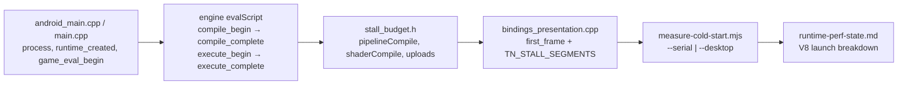

# PRD-328 — Launch is measured on the engine that ships

**Status:** **DESKTOP DONE, PHONE UNVERIFIED** — executed 2026-09-03. Phases 0–3 complete on the
desktop lane, and **Phase 0's phone red is taken on the physical Pixel 8**
(`TN_COLD_START_MARKER_MISSING:compile_begin` from the real reader against a real logcat). The
phone half of Phase 2 and the Phase 3 decision still need an APK built from this branch and a
discharging device at ≥ 50 % battery. Evidence: `docs/verification/runtime-perf-state.md` §5b. This
PRD stays here rather than moving to `done/` until that lane runs — a blocked criterion is not
completion.

**Complexity:** +2 (6–10 files) + 1 (touches the three engine files and the desktop CLI) +
1 (device lane) = **4 → MEDIUM mode**. Checkpoint after every phase.

**Owner:** unassigned

**Source:** the probe session of 2026-09-02 on `packages/runtime-native`, and the launch ledger in
`docs/verification/runtime-perf-state.md` §6 (PRD-218 rows).

**Outcome:** `measure-cold-start.mjs` returns a phase breakdown for a V8 launch on the phone and
for a V8 launch on desktop, and the JavaScript parse-and-compile share under V8 is a number in the
performance record. The "bundle is parsed as source every launch" row of
`docs/architecture/NATIVE-PERF-BOTTLENECKS.md`, which reads *never measured under V8*, is either a
priced lever or a graveyard row by the end of this PRD. No code cache is built here.

---

## 1. Context

**Problem:** the cold-start instrument only fires its compile and execute segments under QuickJS,
which has not been the shipped engine on any platform since 2026-08-16. On V8 (desktop and
Android default) and on JSC (iOS) the launch-phase markers `compile_begin`, `compile_complete`,
`execute_begin` and `execute_complete` are never emitted, so `measure-cold-start.mjs` fails closed
with `TN_COLD_START_MARKER_MISSING:compile_begin` on every shipped configuration, and the desktop
CLI emits no launch markers at all.

**Files analyzed:**

- `packages/runtime-native/include/mystral/cold_start.h` — `coldStartMark(segment)`, the
  `TN_COLD_START:{"segment":…,"atMs":…}` marker (one monotonic clock, one line per segment)
- `packages/runtime-native/src/js/quickjs_engine.cpp:319-353` — the only engine that marks
  `compile_begin`, `compile_complete`, `execute_begin`, `execute_complete`
- `packages/runtime-native/src/js/v8_engine.cpp:351,399,1521` — three `CompileModule` sites,
  none marked, no `ScriptCompiler::CachedData` anywhere (the bundle is compiled from source on
  every launch)
- `packages/runtime-native/src/js/jsc_engine.mm` — no marks
- `packages/runtime-native/src/platform/android_main.cpp:122-269` — marks `process`,
  `asset_begin`, `asset_complete`, `runtime_created`, `game_eval_begin`
- `packages/runtime-native/src/cli/main.cpp` — desktop entry, zero marks
- `packages/runtime-native/src/webgpu/bindings_presentation.cpp:619` — `first_frame`, emitted from
  the present that reached the display, followed by `TN_STALL_SEGMENTS`
- `packages/runtime-native/scripts/measure-cold-start.mjs` — the reader: refuses emulators,
  refuses one launch, refuses a missing marker, reports the build type
- `packages/runtime-native/scripts/verify-desktop-core.mjs` — the desktop gate that already
  spawns the host and reads its stdout; the natural collector for a desktop marker contract
- `docs/verification/cold-start-and-hitches-2026-08-11.md` — the last full breakdown, taken under
  QuickJS: compile 230 ms (8.0 %), first frame 2,500 ms (86.8 %) of a 2,882 ms launch

**Current behaviour:**

- A V8 launch on the phone prints `process … runtime_created … game_eval_begin … first_frame`
  and nothing between `game_eval_begin` and `first_frame` except `TN_STALL_SEGMENTS`. The JS
  compile and top-level execution are inside that unlabelled span.
- A desktop launch prints `first_frame` and `TN_STALL_SEGMENTS` only (observed 2026-09-02:
  `toFirstFrameMs 111.7`, `pipelineCompile 34.9 ms / 3 calls`, residual 69.6 ms — the residual is
  mostly the JS compile and evaluation nobody can see).
- Running the cold-start script against the shipped Android build cannot succeed by construction.
- The one number anyone quotes for JS compile cost (230 ms, 8 %) is a QuickJS number.

### Incumbent census

- `cold_start.h` is the marker owner. This PRD adds call sites, not a second marker shape.
- `measure-cold-start.mjs` is the reader. This PRD adds a desktop lane to it; it does not write a
  second reader.
- `stall_budget.h` attributes the span between the last cold-start segment and `first_frame`. It
  stays as is; the compile and execute segments land *before* it, so `residualMs` there shrinks
  by construction once the JS span is labelled.
- `packages/runtime-native/tests/js-engine-version-skew.test.mjs` pins the engine versions the
  numbers will be recorded against.

## 2. Solution

- Mark the same four segments in the V8 and JSC engines that QuickJS already marks, at the
  entry-module compile and evaluate calls only (the bootstrap scripts go through the same path;
  `game_eval_begin` already brackets the real one, and the reader takes the first occurrence after
  it).
- Give the desktop CLI the same launch markers Android has, so the cold-start script can measure a
  launch without a phone.
- Teach the reader a `--desktop` lane that spawns the built host N times under the repo's private
  Xvfb wrapper and parses the same markers.
- Record the V8 numbers, then decide the code-cache lever on the number with a pre-registered
  threshold — file it or graveyard it.

**Key decisions:**

- Reuse `coldStartMark` verbatim. No new marker, no new clock.
- The desktop lane refuses to report when the host was built without `-O2`-class optimisation,
  exactly as the Android lane does (`TN_COLD_START_OPTIMIZATION_INVALID`).
- No V8 code cache is implemented in this PRD. Phase 3 is a decision with a number, and the
  decision is recorded either way.

**Data changes:** None.

## 3. Integration Ledger

| # | New thing | Live caller (`file:line`, non-test) | Replaces | Old path removed? | Negative control |
| ---: | --- | --- | --- | --- | --- |
| 1 | V8 compile/execute marks | `v8_engine.cpp` entry-module `evalScript` path (TBD line) — runs on every launch | nothing | n/a | delete `compile_complete` mark → reader exits `TN_COLD_START_MARKER_MISSING:compile_complete` |
| 2 | JSC compile/execute marks | `jsc_engine.mm` eval path (TBD) | nothing | n/a | same as row 1 on the iOS simulator lane, or `UNVERIFIED` if that lane is not run |
| 3 | desktop launch marks | `src/cli/main.cpp` before runtime creation and before entry eval (TBD) | nothing | n/a | delete `game_eval_begin` → `verify-desktop-core.mjs` fails naming the marker |
| 4 | desktop marker contract | `scripts/verify-desktop-core.mjs` (TBD), collected by `pnpm native:verify:desktop` | nothing | n/a | run against the pre-PRD binary → fails on the first missing marker |
| 5 | `--desktop` lane in the reader | `scripts/measure-cold-start.mjs` (TBD), invoked by hand and by the record | nothing | n/a | one launch → `TN_COLD_START_LAUNCHES_INVALID` |
| 6 | V8 launch breakdown, phone and desktop | `docs/verification/runtime-perf-state.md` §6 (TBD) | the QuickJS 230 ms figure | superseded row kept, labelled QuickJS | n/a — a record |

## 4. Reachability

**How will this work be reached?**

- Entry points: every native launch (markers); `pnpm native:verify:desktop` (contract); the
  cold-start script (measurement).
- Pre-existing collectors edited: `verify-desktop-core.mjs`, `measure-cold-start.mjs`.
- Result observable in: host stdout / logcat, the script's report, the performance record.

**Is this user-facing?** No. It is the instrument that decides whether a launch-time lever is
worth building.

**What does this replace?** Nothing — it fills a hole; the QuickJS marks stay.

## 5. Execution phases

#### Phase 0: Observe the red — the instrument cannot run on the shipped engine

**Outcome:** two pasted failures, one per lane, proving the gap before any code changes.

**Files (max 5):** none edited; this phase is evidence only.

**Implementation:**

- [ ] Desktop: build or reuse `packages/runtime-native/build/tn-linux/mystral`, then run
  `sh scripts/xvfb.sh packages/runtime-native/build/tn-linux/mystral run examples/native-smoke/dist/native-smoke.js --frames 300`
  from `examples/native-smoke/dist` and grep `TN_COLD_START`. Expected today: exactly one line,
  `first_frame`.
- [ ] Phone (only if the physical Android lane is available; otherwise write `UNVERIFIED`): run
  `node packages/runtime-native/scripts/measure-cold-start.mjs --serial <serial> --launches 3`
  against any installed V8 game. Expected today: `TN_COLD_START_MARKER_MISSING:compile_begin`.
- [ ] Paste both outputs into a new `docs/verification/cold-start-under-v8-2026-09-XX.md` under a
  heading "Phase 0 red".

**Checkpoint:** the two pasted reds exist. Continue.

#### Phase 1: The three engines and the desktop CLI emit the launch segments

**Outcome:** a desktop launch prints the full ordered segment list, and the desktop gate fails when
one is missing.

**Files (max 5):**

- `packages/runtime-native/src/js/v8_engine.cpp` — EDIT: `coldStartMark("compile_begin")` before
  the entry-module `CompileModule` at ~line 351, `compile_complete` after it,
  `execute_begin` before `Evaluate`, `execute_complete` after. Same four marks on the
  `evalWithResult` path at ~line 399 only if that path is what the entry uses (read
  `module_system.cpp` to find which one the entry takes; mark that one, not both).
- `packages/runtime-native/src/js/jsc_engine.mm` — EDIT: the same four marks at the entry eval.
- `packages/runtime-native/src/cli/main.cpp` — EDIT: `coldStartMark("process")` at the top of
  `main`, `runtime_created` after the runtime is constructed, `game_eval_begin` immediately
  before the entry bundle is evaluated. Mirror `android_main.cpp:122-269`.
- `packages/runtime-native/scripts/verify-desktop-core.mjs` — EDIT: after the existing marker
  checks, assert the ordered list `process, runtime_created, game_eval_begin, compile_begin,
  compile_complete, execute_begin, execute_complete, first_frame` appears in stdout with
  monotonic `atMs`; fail with `TN_COLD_START_MARKER_MISSING:<name>` naming the first gap.
- `packages/runtime-native/include/mystral/cold_start.h` — EDIT only if a shared helper is needed
  to keep the four engine call sites identical; otherwise leave it.

**Wiring:**

- [ ] Caller edited: the engine eval path runs on every launch; `verify-desktop-core.mjs` is
  already in `pnpm native:verify:desktop`.
- [ ] Registration: none.
- [ ] Old path: n/a.
- [ ] Ledger rows filled: 1, 2, 3, 4.

**Tests required:**

| Test | Assertion | Negative control (must be observed red) |
| --- | --- | --- |
| `verify-desktop-core.mjs` marker contract | all eight segments present, in order, monotonic | comment out the `compile_complete` mark, rebuild, run: exits non-zero naming `compile_complete` |
| `packages/runtime-native/tests/` marker-shape test (existing cold-start shape test if one exists; otherwise add one beside it) | `TN_COLD_START` line parses and `segment` is one of the known names | feed a marker with a misspelled segment → parse error |

**Revert check:** revert the `v8_engine.cpp` edit alone → `pnpm native:verify:desktop` fails at
`compile_begin`.

**Note on `tests/`:** any file added under `packages/runtime-native/tests/` stales the native
coverage record; regenerate it in the same commit (`pnpm --filter @threenative/runtime-native
native:coverage`) or the suite fails on the digest.

**Checkpoint:** `pnpm --filter @threenative/runtime-native native:verify:desktop` green with the
new assertion, one observed red pasted. Spawn the automated PRD checkpoint with the integration
audit. Continue only on PASS.

#### Phase 2: The reader measures desktop launches, and both lanes are recorded

**Outcome:** `measure-cold-start.mjs --desktop --launches 5` prints a V8 breakdown from the built
host; the same script on the phone prints the same table shape for a V8 APK.

**Files (max 5):**

- `packages/runtime-native/scripts/measure-cold-start.mjs` — EDIT: add `--desktop
  [--bundle <path>]`; spawn `sh scripts/xvfb.sh <mystral> run <bundle> --frames 60` N times from
  the bundle's directory with `SDL_VIDEODRIVER=x11`; parse stdout with the existing marker parser;
  keep every existing refusal; report `buildType` from the binary's CMake cache or refuse.
- `packages/runtime-native/__tests__/measure-cold-start.spec.ts` — EDIT (or NEW beside the
  existing script specs): `--desktop` with one launch refuses; a fabricated stdout with all
  segments produces the expected medians; a missing segment names itself.
- `docs/verification/runtime-perf-state.md` — EDIT §6: a "Launch under V8" table with desktop
  (5 launches) and phone (3–5 launches, or `UNVERIFIED`) rows: host bring-up, runtime creation,
  compile, execute, first frame, total.
- `docs/architecture/NATIVE-PERF-BOTTLENECKS.md` — EDIT the "Cold start" row: replace *never
  measured under V8* with the measured share and the date.

**Wiring:** ledger rows 5 and 6.

**Tests required:** the spec above; negative control: feed a stdout missing `execute_begin` and
assert `TN_COLD_START_MARKER_MISSING:execute_begin`.

**Revert check:** delete the `--desktop` branch → the spec's desktop cases fail.

**Checkpoint:** automated PRD checkpoint. Continue only on PASS.

#### Phase 3: The code-cache lever is priced and either filed or buried

**Outcome:** one paragraph in the performance record that says, with the Phase 2 numbers, whether
a V8 code cache is worth building.

**Files (max 5):**

- `docs/verification/runtime-perf-state.md` — EDIT: the decision, under the Phase 2 table.
- `docs/architecture/NATIVE-PERF-BOTTLENECKS.md` — EDIT: the row moves to *Open, ranked* with a
  price, or to *Levers that were spent* / *Closed, with evidence*.
- `docs/PRDs/performance/critical/README.md` — EDIT: tick this PRD's row and name the outcome.

**Pre-registered rule (do not move it after the numbers arrive):**

- If `compile + execute` on the phone is **≥ 300 ms median** or **≥ 10 % of launch**, file
  `PRD-33X — the bundle is not parsed as source twice` with: `ScriptCompiler::CreateCodeCache`
  after first compile, written to the app's storage root; `kConsumeCodeCache` on later launches;
  cache rejected on V8 version, flags hash or bundle hash mismatch; fail closed to source. Its
  acceptance is the Phase 2 table re-run with the cache warm.
- Otherwise write the graveyard row: "V8 parse+compile is N ms (M %) of launch; the lever cannot
  pay the 2 ms/frame-class bar's launch equivalent; do not re-propose without a bigger bundle."

**Checkpoint:** the record says which branch was taken and quotes the number. Move this PRD to
`docs/PRDs/done/` in the same commit.

## 6. Acceptance criteria

1. **The instrument runs on the shipped engine.** `measure-cold-start.mjs` produces a breakdown on
   a V8 launch (desktop required; phone if the lane is available, otherwise labelled
   `UNVERIFIED`). *Red:* Phase 0's pasted `TN_COLD_START_MARKER_MISSING:compile_begin`.
2. **A missing segment fails the desktop gate.** `pnpm native:verify:desktop` names the first
   missing marker. *Red:* remove one mark, paste the failure.
3. **The V8 compile share is a number in the record**, on desktop and (if available) on the phone,
   with the engine versions from `js-engine-versions.json` quoted beside it.
4. **The code-cache decision is recorded** under the pre-registered rule, and the bottlenecks
   document's cold-start row no longer says *never measured under V8*.

## 7. Out of scope

- Implementing the V8 code cache or a startup snapshot (filed by Phase 3 if the number says so).
- The first-frame pipeline compile stall — that is PRD-327, and it is the larger term by an order
  of magnitude on every record so far.
- iOS on physical hardware.
