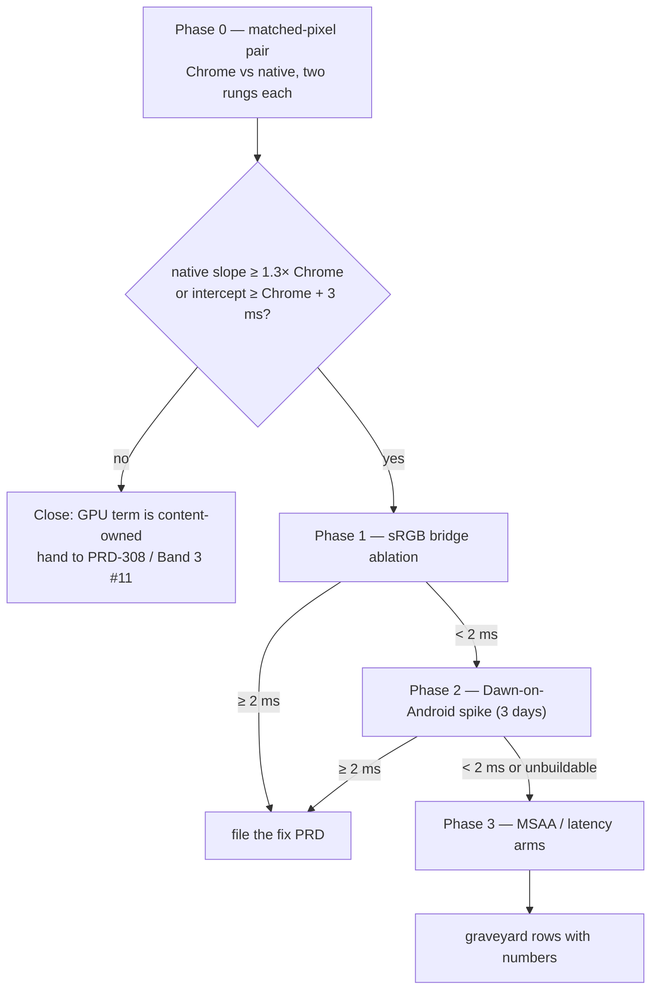

# PRD-329 — The native GPU frame matches Chrome's at matched pixels, or the gap is named and owned

**Status:** PROPOSED, filed 2026-09-02 against `5879799d`. Planning only.

**Complexity:** +1 (1–5 files) + 2 (a new measurement arm across two runtimes on one phone) +
1 (external: Chrome for Android) + 1 (device lane) = **5 → MEDIUM mode**. Checkpoint after every
phase; manual device checkpoint after Phase 0.

**Owner:** unassigned

**Source:** `docs/verification/runtime-perf-state.md` §1.5 (*matched native/Chrome logical-pixel
capture after draw collapse* — untried), §5 (*no matched parity claim remains*), §1.3.2 (the GPU
owns the 720p frame: 18–19 ms against a 16.7 ms budget), and the probe session of 2026-09-02.

**Outcome:** one table, same phone, same game, same drawing-buffer size, two runtimes: presented
p50 and, where the meter is granted, `gpuMs` for native and for Chrome. Either the two agree
within the pre-registered band and the GPU term is declared **content-owned** (handing the frame
to PRD-308 and Band 3 LOD work), or native is slower per pixel and the runtime-owned suspects
below are ablated in order until one moves ≥ 2 ms or all are buried.

---

## 1. Context

**Problem:** every real game measured on the phone is GPU-bound in the native host, and nobody has
checked whether the native host's GPU frame costs more than Chrome's for identical content at
identical pixels. Every earlier native-versus-Chrome comparison mixed pixel counts (native at
2400×1080 physical against Chrome at ~864×303 CSS pixels), so the ledger records *no matched
parity claim*. If native pays a runtime-owned per-pixel tax, every content optimisation is
chasing a number the host inflates; if it does not, the runtime is done with GPU work and the
frame belongs to content.

**Files analyzed:**

- `packages/runtime-native/src/webgpu/bindings_presentation.cpp:550-556, 596-604` — the sRGB
  presentation bridge: when the surface's preferred format is sRGB, the game renders to a linear
  texture and `presentLinearTextureToSrgbSurface` blits a full-resolution quad into the surface
  every frame. Whether Android's preferred format triggers it is not on any record.
- `packages/runtime-native/src/webgpu/context.cpp:1139` — frame latency comment; `:1202-1229`
  — acquire and present.
- `packages/runtime-native/CMakeLists.txt:1466` — Android builds wgpu-native only
  (`ANDROID AND MYSTRAL_USE_WGPU`); Dawn is desktop-only in `download-deps.mjs`. Ledger row A1
  (Dawn ↔ wgpu swap) was flat on desktop and is **untried on device**.
- `packages/core/src/game.ts:800-830` — `renderer.resolutionScale` and the per-window
  `surface: {resolutionScale, sampleCount, drawingBufferWidth, drawingBufferHeight}` report,
  emitted on web and native alike; this is what makes a matched-pixel arm possible without
  touching either runtime.
- `docs/verification/runtime-perf-state.md` §1.3.5 — the native pixel ladder:
  `presented p50 = 9.94 ms/Mpx × pixels + 13.79 ms` (R² 0.992). No Chrome ladder exists.
- `docs/verification/runtime-perf-state.md` §1.3.9 — `sampleCount 4` costs +3.2–4.8 ms on
  native; Chrome's three.js default is also 4× when `antialias: true`, so the arm must pin
  `renderer.antialias` identically on both sides.
- `docs/verification/gpu-meter-on-android-2026-09-01.md` — native `gpuMs` works on the Pixel 8;
  `TN_WEBGPU_FEATURES` shows `texture-compression-bc:false`, `astc:true`, `etc2:true`.
- `packages/runtime-native/scripts/device-preflight.mjs` — thermal, battery, refresh-rate gate.
- `packages/playtest/dist/runner/cli.js perf --logcat <serial>` — the reader for native windows;
  the browser lane reads the same `TN_FRAME_BUDGET` marker from the page console.

**Current behaviour:**

- Native Bayview at 720p mailbox: 53 fps, CPU chain 9.3 ms, GPU 18–19 ms. At 1080p: GPU drain
  ≈ 49 ms.
- Chrome Android Bayview: 59.99 fps at 9.5 ms frame (PRD-222 Phase 0) — at a CSS-pixel buffer
  roughly a tenth of native's physical one. Not comparable, and not compared since.
- Whether Android's surface negotiates an sRGB format (and therefore pays the bridge blit every
  frame) is logged only under `verboseLogging`.

### Incumbent census

- PRD-308 (architecture board, task 5) owns per-pass GPU attribution on the phone. This PRD is
  upstream of it: it decides whether the runtime is a suspect at all. It does not build a
  per-pass meter.
- PRD-222 owns the frame-rate targets and gates; this PRD feeds its Tier 2 (*parity, on a real
  scene*) row with the first matched-pixel number.
- The engine load test (`pnpm bench:engines`, arms `tn-web` / `tn-android`) already runs one
  workload on both runtimes with a scorer-equivalence gate. It is instanced-cube content, not a
  real game, so it is the **control arm** here, not the subject.
- Ledger graveyard rows 6 and 7 (A1, A2) close the backend question **on desktop**. They do not
  close it on Mali; that is why Phase 2 exists and why it is gated behind Phase 0.

## 2. Solution

- **Phase 0 is the whole decision.** Build one Bayview-class game from one commit for web and
  Android; pin `renderer.resolutionScale` and `renderer.antialias` identically; run each side at
  two rungs where both are below 60 fps so fps resolves cost; record presented p50 and the
  surface report; cross-check both with SurfaceFlinger on their own layers; compute a per-side
  slope and intercept.
- **Pre-registered verdict:** native slope ≥ 1.3× Chrome's, or native intercept ≥ Chrome's + 3 ms
  at matched pixels, means a runtime-owned GPU term exists. Anything less closes the question as
  content-owned.
- **Only if the gap is real:** ablate the runtime suspects in this order, each pre-registered
  at ≥ 2 ms per method rule 6: (1) the sRGB presentation bridge; (2) MSAA resolve path; (3)
  Dawn-on-Android (A1 on device); (4) frame-latency / present path. Stop at the first one that
  moves the number by ≥ 2 ms and file its fix; bury the rest with their numbers.

**Key decisions:**

- The engine's own `resolutionScale` contract pins the drawing buffer on both sides; no runtime
  code changes are needed to run Phase 0.
- Chrome's `gpuMs` is not assumed: Chrome for Android grants `timestamp-query` only behind a
  developer flag. Presented p50 at matched pixels plus SurfaceFlinger is the primary meter on
  both sides; `gpuMs` is recorded where granted and labelled where not.
- The verdict thresholds are written here, before any number exists, and may not move.

**Data changes:** None.

## 3. Integration Ledger

| # | New thing | Live caller (`file:line`, non-test) | Replaces | Old path removed? | Negative control |
| ---: | --- | --- | --- | --- | --- |
| 1 | matched-pixel arm recipe + results | `docs/verification/runtime-perf-state.md` §1 (TBD) and the bottlenecks doc's *Where we already stand* table | the mixed-pixel comparison in §5 | superseded row rewritten | swap the two rungs' logs → the slope sign flips; a reader that cannot tell must fail |
| 2 | `TN_SURFACE_FORMAT` marker at surface configure time | `bindings_presentation.cpp` republish path (TBD) and `bindings.cpp` initial configure (TBD) — every launch | verbose-only log line | replaced | remove the marker → `verify-desktop-core.mjs` fails naming it |
| 3 | sRGB bridge ablation switch (diagnostic, default off, never shipped on) | `context.cpp` surface configure (TBD) reading the same property/env shape as `presentUncapped()` | nothing | n/a | with the switch on, `TN_SURFACE_FORMAT` reports a linear format and `presentCount` still advances |
| 4 | Dawn-on-Android build option (spike) | `CMakeLists.txt` Android block + `download-deps.mjs --android` (TBD) | nothing | n/a | the option refused with a named error when the Dawn arm64 archive is absent |
| 5 | verdict + graveyard rows | `docs/architecture/NATIVE-PERF-BOTTLENECKS.md` (TBD) | *no matched parity claim remains* | rewritten | n/a — a record |

## 4. Reachability

**How will this work be reached?**

- Entry points: the device lane (Phase 0); every launch (row 2); the diagnostic property (row 3);
  the build option (row 4).
- Pre-existing collectors edited: `verify-desktop-core.mjs` (marker), the performance record,
  the bottlenecks document.
- Result observable in: `TN_FRAME_BUDGET` windows on both runtimes, SurfaceFlinger, the record.

**Is this user-facing?** No. It is release evidence that decides where the next GPU week goes.

**What does this replace?** The unmatched Chrome-versus-native rows quoted in §5 of the record and
in the bottlenecks document's *Where we already stand*.

## 5. Execution phases

#### Phase 0: The matched-pixel pair on the phone

**Outcome:** a four-row table (2 runtimes × 2 rungs) with presented p50/p95, the surface report,
SurfaceFlinger fps, and a per-side slope/intercept; a one-line verdict under the pre-registered
rule.

**Files (max 5):**

- `docs/verification/runtime-perf-state.md` — EDIT: new section *Matched pixels: native vs
  Chrome — <date>* with the table, the exact commands, APK sha256, Chrome version, preflight
  JSON, and the verdict.
- `docs/architecture/NATIVE-PERF-BOTTLENECKS.md` — EDIT: replace the unmatched rows under *Where
  we already stand* with the matched ones.
- `docs/PRDs/performance/critical/README.md` — EDIT: record the verdict beside this PRD's row.

**Implementation (execute in this order; do not skip a step):**

- [ ] Pick the subject: a Bayview-class sandbox game that runs on both web and Android from one
  commit (PRD-310 notes Bayview's engine symlinks were broken on 2026-08-31; repair or use the
  most recent runnable checkout, and record the commit).
- [ ] Pin in `threenative.config.ts`: `renderer: { resolutionScale: 1.0, antialias: true }` for
  rung A and `resolutionScale: 0.55` for rung B; `display.maxFps: 120`; `ui.renderer` identical on
  both sides. Build web (`vite build`) and Android (`threenative build --target android`) per
  rung. Record each APK's sha256 and each web bundle's hash.
- [ ] Preflight: `node packages/runtime-native/scripts/device-preflight.mjs --serial <serial>`
  with `requireDischarging`, thermal `NONE`, `requireRefreshHz: 120`; Battery Saver off; Smooth
  Display on so both runtimes can exceed 60.
- [ ] Native, per rung: cold launch per method rule 4; capture ≥ 6 windows; discard the first two
  whole runs of the session and the first two windows of each kept run; read with
  `node packages/playtest/dist/runner/cli.js perf --logcat <serial> --text`; then
  `adb shell dumpsys SurfaceFlinger --timestats` on the game's `(BLAST)` layer.
- [ ] Chrome, per rung: serve the built web bundle on the LAN; open it in Chrome for Android on
  the same phone; read `TN_FRAME_BUDGET` from `chrome://inspect` console or the page's own
  overlay; confirm the window's `surface.drawingBufferWidth/Height` **equals** native's for that
  rung (if it does not, adjust nothing in the engine — pin `resolutionScale` on the web side until
  it matches, and record the value); SurfaceFlinger on Chrome's layer.
- [ ] Verify the Chrome adapter is the Mali device, not a software path (`chrome://gpu` on the
  phone; record it).
- [ ] Compute per side: slope `(p50_A − p50_B) / (Mpx_A − Mpx_B)` and intercept. Apply the
  verdict rule. Write it down.

**Negative control (must be observed):** feed the reader rung B's log as rung A → the slope goes
negative; the record's arithmetic must show its inputs so this is checkable. Also: one deliberate
mismatched-pixel pair (Chrome at DPR 1 CSS pixels versus native physical) — paste it as the
"what the old comparisons measured" row so the difference is visible.

**Checkpoint:** automated PRD checkpoint **and** manual: the owner reads the four rows and the
verdict. If the verdict is *content-owned*, go straight to Phase 4.

#### Phase 1: The surface format is on the record, and the sRGB bridge is ablated

**Outcome:** every launch prints the negotiated surface format and whether the bridge is active;
on the phone, one arm with the bridge forced off measures its cost.

**Files (max 5):**

- `packages/runtime-native/src/webgpu/bindings_presentation.cpp` — EDIT at the republish path
  (~550): print
  `TN_SURFACE_FORMAT:{"native":"<fmt>","render":"<fmt>","bridge":true|false,"present":"<mode>"}`
  once per configure; same at the initial configure in `bindings.cpp` (~2757).
- `packages/runtime-native/src/webgpu/context.cpp` — EDIT: a diagnostic switch in the
  `presentUncapped()` shape (`debug.threenative.linear_surface` / `THREENATIVE_LINEAR_SURFACE`)
  that configures the surface with the linear twin format and disables the bridge. Default off.
  If the backend refuses the linear format, fail with a named error rather than silently keeping
  the bridge.
- `packages/runtime-native/scripts/verify-desktop-core.mjs` — EDIT: assert one
  `TN_SURFACE_FORMAT` line is present and parses.
- `packages/runtime-native/tests/` — EDIT the presentation contract test to assert the marker on
  both configure paths (regenerate the coverage digest in the same commit).
- `docs/verification/runtime-perf-state.md` — EDIT: the bridge arm (control vs switch on),
  same session, same rung, presented p50 and `gpuMs`.

**Pre-registered:** the bridge is a full-resolution blit; predicted cost at 2400×1080 on Mali is
1–3 ms. It is filed as a fix only if the measured delta is **≥ 2 ms**; otherwise it is a
graveyard row.

**Negative control:** with the switch on, the screenshot must be pixel-comparable to the control
(a linear surface shown as sRGB is visibly washed out — if the capture is lighter, the switch is
wrong, not the bridge).

**Checkpoint:** automated PRD checkpoint. Continue only on PASS.

#### Phase 2: Dawn on Android, a three-day spike

**Outcome:** either an APK whose host reports `backend: dawn` and a same-session pair against
wgpu-native at one rung, or a dated note saying exactly why the arm64 Dawn build could not be
produced in three days.

**Files (max 5):**

- `packages/runtime-native/scripts/download-deps.mjs` — EDIT: `--android --backend dawn` fetches
  or builds a Dawn arm64 archive (Dawn's upstream CI publishes none for Android; a local build via
  Dawn's `gn`/CMake against the NDK is the expected path — pin the Dawn commit already used on
  desktop, `d14ae3d9`).
- `packages/runtime-native/CMakeLists.txt` — EDIT the Android block: allow
  `MYSTRAL_WEBGPU_BACKEND=dawn` on Android; refuse with a named error when the archive is absent.
- `packages/runtime-native/build-matrix.json` — EDIT: the new Android backend row.
- `docs/verification/runtime-perf-state.md` — EDIT: the pair, or the failure note.

**Timebox:** three working days from the first command. On day three, whatever exists is
recorded and the phase closes. This is the graveyard's A1 row *on device*; it may not be re-run
without a new reason.

**Checkpoint:** automated PRD checkpoint.

#### Phase 3: MSAA resolve and present latency, only if Phases 1–2 left ≥ 2 ms unexplained

**Outcome:** two more same-session pairs at one rung: `sampleCount 4` with an explicit resolve
target versus three's default path; frame latency 1 versus 2 on the mailbox path.

**Files (max 5):** `context.cpp` (the existing `desiredMaximumFrameLatency` infrastructure,
graveyard row 14), the record, the bottlenecks document. No product default changes without a
≥ 2 ms result.

**Checkpoint:** automated PRD checkpoint.

#### Phase 4: Close

**Outcome:** the bottlenecks document names the owner of the phone's GPU frame with the matched
numbers; PRD-222's Tier 2 row cites the table; this PRD moves to `docs/PRDs/done/`.

**Files (max 5):**

- `docs/architecture/NATIVE-PERF-BOTTLENECKS.md` — EDIT: verdict and rows.
- `docs/PRDs/performance/critical/PRD-222-performance-targets-per-platform.md` — EDIT: Tier 2
  cites the matched-pixel table.
- `docs/PRDs/performance/critical/README.md` — EDIT: tick the row.

## 6. Acceptance criteria

1. **The pair exists.** Four rows, one phone, one commit, matched `drawingBufferWidth/Height`
   per rung on both runtimes, SurfaceFlinger beside each. *Red:* the deliberately mismatched
   row is present and visibly different.
2. **The verdict follows the pre-registered rule**, quoted verbatim beside the numbers.
3. **The surface format is a marker**, asserted by the desktop gate. *Red:* remove the marker.
4. **Each ablated suspect has a number ≥ or < 2 ms in the record**, or a dated reason it could
   not be built (Phase 2 only).
5. **No product default changes without a ≥ 2 ms same-session pair** behind it.

## 7. Out of scope

- Per-pass attribution on the phone (PRD-308) and its diagnostics surface (PRD-311).
- Content levers (LOD, materials, shadow maps) — Band 3 #11 and the game's `src/render/`.
- Desktop backend comparisons (closed: graveyard rows 6 and 7).
- iOS.
