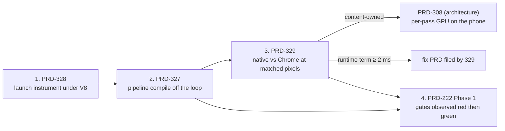

# docs/PRDs/performance/critical

Read `/AGENTS.md`, `docs/PRDs/AGENTS.md`, then `docs/verification/runtime-perf-state.md` §2
(the ledger — do not rebuild anything in it) and §3 (the method rules — binding) before starting
any row here. This folder holds the native-runtime performance work that is worth doing **now**,
in the order it must be done. Everything else under `docs/PRDs/performance/` is either answered,
bounded below the 2 ms bar, or waiting on a row here.

Filed 2026-09-02 against `5879799d` from a probe of `packages/runtime-native` and the two
standing records: `docs/verification/runtime-perf-state.md` and
`docs/architecture/NATIVE-PERF-BOTTLENECKS.md`.

## What the evidence says, in five lines

1. **A scaffolded template already holds 60 fps at full resolution on the phone** (59.99–60.02
   fps, three unplugged captures). The runtime is not slow for light content.
2. **A real game is GPU-bound on the phone** (Bayview 720p: CPU chain 9.3 ms, GPU 18–19 ms;
   1080p: GPU ≈ 49 ms). CPU levers cannot move it until the GPU term drops, and nobody has yet
   checked whether the native host's GPU frame costs more than Chrome's at the same pixels.
3. **Launch is the largest user-visible defect the runtime owns**: 12–14 s frozen behind the
   loading screen, 8.0 s of it 105 synchronous pipeline compiles, because the host's
   `createRenderPipelineAsync` is the synchronous call in a resolved promise and warm-up therefore
   compiles nothing on native.
4. **The launch instrument cannot run on the shipped engine**: the compile/execute cold-start
   markers exist only in QuickJS; V8 and JSC emit none; desktop emits none at all.
5. **The seam is done.** The frame crosses once (PRD-227 Change 1: desktop bridge 9.31 → 0.81
   ms), fixed-shape wrappers made things worse, the backend swap was flat, GC is 0.2 %. Do not
   propose a transport, wrapper, backend or GC lever without a new measurement.

## The order — execute top to bottom, one row at a time

| Step | PRD | Effort | Why this position | Done when |
| ---: | --- | --- | --- | --- |
| 1 | [PRD-328 — Launch is measured on the engine that ships](PRD-328-launch-is-measured-on-the-engine-that-ships.md) | 🟢 **done** 2026-09-03 | Cheapest row; makes every later launch number honest; needs no phone for its desktop half | **Done, both lanes.** V8 launch tables in `runtime-perf-state.md` §5b — desktop: parse+compile 51 ms (9.7 %) of 524 ms; Pixel 8: 54.1 ms (10.4 %) of a 519 ms median over five launches, and runtime creation 1,635 ms (69.1 %) of a cold one. The pre-registered code-cache rule tripped its 10 % limb, so [PRD-335](../PRD-335-the-bundle-is-not-parsed-as-source-twice.md) is filed, ranked below runtime creation |
| 2 | [PRD-327 — First-use pipeline compilation leaves the main loop](PRD-327-first-use-pipeline-compilation-leaves-the-main-loop.md) | 🟡 Phases 0–2 done 2026-09-03; 3–4 open | Biggest owned defect (launch 14 s → ≤ 8 s); closes PRD-218 criteria 1–2 | **Mechanism proven, launch claim unmade.** `createRenderPipelineAsync` is native and holds the main thread 0.27 ms of a 70 ms compile (ratio 0.0038, bar 0.25); `warmUp` is on by default on native. The device acceptance — three cold launches ≤ 8 s median, `pipelineCompile ≤ 500 ms` — did **not** run: phone under the battery floor. PRD-218 criteria 1–2 stay open |
| 3 | [PRD-329 — The native GPU frame matches Chrome's at matched pixels, or the gap is named](PRD-329-the-native-gpu-frame-matches-chrome-at-matched-pixels.md) | 🟡 2–4 days for Phase 0; up to a week if the gap is real | Decides whether the runtime owns any of the phone's GPU frame before anyone spends a week on content LOD | the verdict paragraph exists under the pre-registered rule |
| 4 | [PRD-222 — Every platform has a frame-rate target, and a gate that fails when it is missed](PRD-222-performance-targets-per-platform.md) | 🟡 Phase 1 is days | The acceptance bar for 2 and 3; its Phase 1 gates can be written red-green today because the template lane already meets Tier 1 | Phase 1 gates observed red then green; Tier 2 cites PRD-329's table |
| — | [PRD-218 — the loading screen hides a 12–14 s synchronous stall](PRD-218-fps-framework-native-load-fps-heat.md) | record | The finding PRD-327 executes; keep it open until 327 ticks its criteria 1 and 2 | **Open.** Criteria 1 and 2 are device criteria and the device lane has not run |

Outside this folder but on the same critical path, in this order: **PRD-308** (architecture
board, per-pass GPU time on the phone) runs after step 3's verdict — if step 3 says the GPU term
is content-owned, PRD-308 is the next thing to do; if step 3 finds a runtime term, fix that
first.

## How to run a row (the same procedure every time)

1. Open the PRD. Read §1 Context and the Integration Ledger. Do not start a phase whose ledger
   row you cannot name a live caller for.
2. Run the phase's **negative control first** and paste the red into
   `docs/verification/<topic>-<date>.md` (or into `runtime-perf-state.md` when the PRD says so —
   runtime/core performance records consolidate there).
3. Implement the phase. Max five files. At least one pre-existing file edited.
4. Run the phase's tests, then `pnpm typecheck && pnpm lint && pnpm test`. Paste failures
   verbatim; never summarise a red.
5. Spawn the automated checkpoint (`prd-work-reviewer`) with the integration audit from the
   `prd-creator` skill. Continue only on PASS.
6. Commit path-limited, with the PRD number in the subject, before starting the next phase.
   Another lane may hold this tree.
7. When the last phase passes: `git mv` the PRD to `docs/PRDs/done/`, update this README's row
   and, if the PRD came from the architecture board, tick that board too.

## Lanes and their traps (read before touching a device)

- **Desktop is never an fps verdict.** Under the private Xvfb the present segment is the FIFO
  throttle (a 3 ms frame presents at ~36 fps in the 2026-09-02 probe). Judge desktop by
  `render.p50`, `frame.p50` and the host-gap segments; the phone owns fps.
- **Every A/B is a same-session pair.** Discard the first two whole runs of a session and the
  first two windows of each kept run. Cross-session absolutes mean nothing.
- **Cold launch means** `am force-stop` → `pidof` empty → `am start -W`, on the package id read
  from the game's `threenative.config.ts` (`app.id`), not from the directory name.
- **Verify the binary carries the change** (`strings` the packaged `.so`, grep the staged bundle)
  before trusting a number. A sandbox game installs engine tarballs by constant filename.
- **Preflight every device arm**: `node packages/runtime-native/scripts/device-preflight.mjs`;
  unplugged, thermal `NONE`, Battery Saver off, refresh rate recorded. Cross-check fps with
  `dumpsys SurfaceFlinger --timestats`, never `gfxinfo`.
- **Pre-register every lever** at ≥ 2 ms/frame from a measured call count. Anything predicting
  less is refused before it is written.
- **Read the frame meters with the CLI**, not by eye:
  `node packages/playtest/dist/runner/cli.js perf --file <log> --text`,
  `--logcat <serial> --text`, or `--executable <bin> --host-arg …`.

## Do not do these (already measured; the ledger has the numbers)

- Batched or per-class binding tables, wrapper pooling, fixed-shape wrappers, half of any
  two-part seam change — graveyard rows 1–3, 12, 13.
- Present mode, swapchain depth, frame latency at 1080p, the composited UI overlay, GC or heap
  tuning — rows 5, 10, 11, 9, 14.
- Backend choice on desktop — rows 6 and 7. (On the phone it is PRD-329 Phase 2, gated and
  timeboxed.)
- Smaller shadow maps, softer shadow filters, fewer texture fetches, hiding decals — falsified on
  device in §1.3.2.
- A render thread before the GPU frame drops — the direction document's sequencing rule;
  overlapping threads cannot beat an 18–19 ms GPU frame. File it only after step 3's verdict and
  PRD-308's numbers.
- Re-hunting the "draw-count knee" — refuted under V8 (PRD-069 Phase 0, 2026-08-21): frame time
  is flat to 1,000 objects and linear at ≈ 0.70 µs/object beyond.

## Stale claims you will meet in older documents

- `NATIVE-PERF-BOTTLENECKS.md` still lists *Worker runs worker code on the main thread*. Since
  PRD-250 the polyfill creates a native worker thread (`__tnNativeWorkerCreate`,
  `src/workers/worker_thread.cpp`); treat the row as stale until that document is corrected.
- The same document's draw-count-knee row is refuted (above).
- The 22.2 ms desktop baseline does not reproduce; quote shares, not desktop milliseconds.
- `renderer.antialias` was inert on native until `d476ec36`; any sampling number older than
  2026-08-28 is withdrawn.

## What each row must leave behind

- A dated entry in `docs/verification/runtime-perf-state.md` (performance findings) or a
  one-file-per-run record elsewhere in `docs/verification/`.
- The pasted red and the pasted green for every gate, with the mutation named.
- An updated row in this README, and in `NATIVE-PERF-BOTTLENECKS.md` when a bottleneck row's
  status changed.
