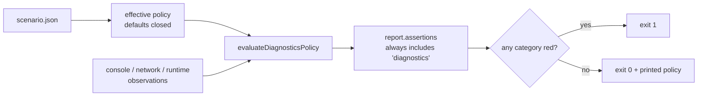

# PRD-110 — A playtest that saw errors cannot report pass

**Status: OPEN — PHASE 0 RE-SCOPED AFTER MIXED-FIXTURE NON-REPRODUCTION, written 2026-08-14.** Sliced from
`docs/strategy/PRODUCTION-READINESS.md` item 1.

**Complexity: 6 → MEDIUM mode.** One package (`packages/playtest/`), one default flip, one
schema addition, one artifact-metadata addition, and a fixture suite whose whole job is to be
observed red.

**LOC:** `packages/playtest/` is a salvage package and is **excluded from the framework LOC
budget** (`scripts/check-budgets.ts:25`). This PRD spends none of the 259-line headroom.

---

## 1. Context

**Problem.** The strategy review reported a generated playtest returning `pass: true` alongside
18 console errors and 18 runtime diagnostics. That report was not reproduced, and round 6's run
did report 19 console errors and correctly failed — so the two observations look contradictory.

They are not. Reading the code reconciles them, and the reconciliation is the bug:

| Line | What it says | Consequence |
| --- | --- | --- |
| `packages/playtest/src/assertions.ts:1969` | `policy?.noConsoleErrors === true && …` | console errors gate **only if the scenario opted in** |
| `packages/playtest/src/assertions.ts:1977` | `policy?.noNetworkErrors === true && …` | network errors gate **only if the scenario opted in** |
| `packages/playtest/src/assertions.ts:942` | `noRuntimeDiagnostics: … ?? true` | runtime diagnostics are the one category that defaults closed |
| `packages/playtest/src/assertions.ts:946` | `if (scenarioAssertions.diagnostics !== undefined \|\| policyDiagnostics.length > 0)` | with no `assert.diagnostics` block, **no `diagnostics` assertion is even recorded** — the report does not say the check was skipped |

Round 6 failed because the sealed proof
(`docs/benchmark/genres/physics-puzzle/proof/physics-puzzle.playtest.json`) carries
`"noConsoleErrors": true, "noNetworkErrors": true`. A scenario a builder writes carries whatever
the builder remembered. The default is open, and the report is silent about it.

This is the exact failure this package exists to prevent. Its own nested `AGENTS.md` states the
rule — *a check that cannot run must fail, never skip* — and the console/network categories are
outside it.

**Second gap: nothing distinguishes a capture failure from a render failure.** `capture-guard.ts`
(blank-frame detection, `TN_CAPTURE_BLANK`) lives in `scripts/`, where it guards the sweep. It is
not reachable from `packages/playtest/`, so a user's visual assertion sees a black PNG and a
scenario run under headless Chromium without `xvfb` reads as a styling bug rather than a GPU
failure.

**Third gap: visual artifacts carry no provenance.** `runner/runner.ts:146-193` writes
`page.screenshot()` PNGs with no sidecar. Browser arguments, GPU adapter, renderer kind, target,
viewport and capture method are not stored, so a screenshot cannot be re-derived or disputed
later.

**Files analysed.**

- `packages/playtest/src/assertions.ts:939-957, 1955-1995` — the diagnostics policy
- `packages/playtest/src/scenario.ts:203-205, 856-895` — the schema and the one existing opt-out
- `packages/playtest/src/runner/runner.ts:99, 146-193, 231` — screenshots and tracing
- `packages/playtest/src/runner/browser.ts:1-10` — the WebGPU recipe args
- `scripts/capture-guard.ts` — blank-frame detection that the package cannot reach

## 2. Approach

Flip the two open defaults closed, make opting out cost a written reason the report prints, record
the effective policy on every run, move blank-capture detection into the package, and write
provenance beside every image.

`runtimeDiagnosticsOptOutReason` (`scenario.ts:860-864`) is the existing shape to copy: a boolean
may be `false` only when a sibling non-empty string explains the bounded exception. Do not invent
a second mechanism.

**Key decisions.**

- Defaults change is **breaking for permissive scenarios, by design**. The starter's ten
  generated scenarios already set `noConsoleErrors`/`noNetworkErrors` explicitly, so the blast
  radius inside this repo is scenarios that were silently ungated.
- The `diagnostics` assertion is recorded on **every** run, pass or fail. A category that was
  waived appears as a waiver with its reason, never as an absence.
- Blank-capture detection moves into `packages/playtest/src/`; `scripts/capture-guard.ts` becomes
  a re-export or is deleted. Two copies of this logic is a fork.

**Data changes.** `IPlaytestScenario["assert"]["diagnostics"]` gains
`consoleErrorsOptOutReason` and `networkErrorsOptOutReason`. `IPlaytestReport` gains
`diagnosticsPolicy` (the resolved policy with reasons) and `capture` (provenance).

## 3. Integration Ledger

| # | New thing | Live caller (`file:line`, non-test) | Replaces | Old path removed? | Negative control |
| --- | --- | --- | --- | --- | --- |
| 1 | closed-by-default policy resolution | `assertions.ts:944` (`evaluateDiagnosticsPolicy` call site) | the `?? true`-for-one-category logic at `assertions.ts:940-943` | replaced in Phase 1 | a scenario with no `assert.diagnostics` and one console error exits 1 |
| 2 | `consoleErrorsOptOutReason` / `networkErrorsOptOutReason` | `scenario.ts` validator beside `:860` | — | n/a, new | `noConsoleErrors: false` with no reason throws at load |
| 3 | unconditional `diagnostics` assertion row | `assertions.ts:946` | the conditional push | replaced in Phase 1 | removing the row fails the report-shape test |
| 4 | `assertCaptureNotBlank` in `packages/playtest/src/` | `runner/runner.ts:~193` | `scripts/capture-guard.ts` | re-export or delete in Phase 3 | an all-black PNG fails `TN_CAPTURE_BLANK`, not the visual assertion |
| 5 | `capture` provenance sidecar | `runner/runner.ts:~189` | — | n/a, new | deleting the sidecar and re-running regenerates it; a run with no adapter info fails rather than writing `unknown` |

**Reachability.** Entry point is `packages/playtest/dist/runner/cli.js`, reached by
`pnpm test:playtest`, `pnpm test:templates`, `scripts/sweep-proof.ts`, and every scaffolded
project's `test` script. No new entry point is created.

## 4. Phases

### Phase 0 — Reproduce the claim, or replace it with the real one (blocking)

**No code.** Build the minimal scenario the review described and run it.

- [ ] Write `packages/playtest/__tests__/fixtures/permissive.playtest.json` — a scenario with a
      real assertion and **no** `assert.diagnostics` block.
- [ ] Point it at a page that logs `console.error` and requests a missing asset.
- [ ] Record the exit code and whether `diagnostics` appears in `report.assertions`.

**Outcome, written into this PRD before Phase 1 starts:** either *"reproduced — exit 0 with N
console errors and no `diagnostics` row"*, or *"not reproduced, and here is what the review
actually hit"*. If it does not reproduce, **stop and re-scope**; do not write the fix from the
report. The strategy document is explicit that this claim outranks everything else in it *if
true*.

**Phase 0 outcome and owner re-scope (2026-08-14).** The mixed fixture was **not reproduced**:
the exact run exited `1`, reported `pass: false`, included a `diagnostics` row, observed two
console errors, one failed request, and two runtime diagnostics, while the movement assertion
passed. The failed request was normalized into runtime diagnostics, so it could not isolate the
permissive console/network policy described by this PRD. Phase 0 is therefore re-scoped to use
an isolated console-error fixture for the baseline reproduction and to cover the network policy
with its own seeded negative fixture in Phase 2. The mixed run remains evidence of the original
failure mode and is not treated as proof of the permissive-pass claim.

### Phase 1 — Console and network errors fail closed

**Files (max 5):**

- `packages/playtest/src/assertions.ts` — EDIT: resolve all three categories with `?? true`; push
  the `diagnostics` row unconditionally
- `packages/playtest/src/scenario.ts` — EDIT: two new opt-out reason fields, validated like
  `runtimeDiagnosticsOptOutReason`
- `packages/playtest/__tests__/fails-closed.spec.ts` — NEW
- `packages/playtest/__tests__/vacuous-assertion.spec.ts` — EDIT: extend the existing pattern

**Wiring:**

- [ ] Caller edited: `assertions.ts:944` consumes the resolved policy
- [ ] Old path: the `?? true`-for-one-category block is deleted, not left beside the new one
- [ ] Ledger rows filled: #1, #2, #3

**Tests required:**

| Test file | Test name | Assertion | Negative control (must be observed red) |
| --- | --- | --- | --- |
| `fails-closed.spec.ts` | `should fail when console errors are captured and the scenario is silent` | exit 1, `diagnostics` row `pass: false` | revert the default → test goes green-with-errors, i.e. red for us |
| `fails-closed.spec.ts` | `should fail when network errors are captured and the scenario is silent` | exit 1 | same |
| `fails-closed.spec.ts` | `should reject noConsoleErrors:false without a reason` | throws `invalidScenario` at load | drop the validator → the scenario loads |
| `fails-closed.spec.ts` | `should record a diagnostics row even when everything is clean` | `assertions` contains `diagnostics`, `pass: true` | delete the row → test fails |

**Revert check:** revert the default flip → the Phase 0 fixture passes again with errors present.

### Phase 2 — Every diagnostic category has a seeded negative fixture

The acceptance gate the strategy document names: *seeded negative fixtures prove each diagnostic
category turns a run red.*

**Files:**

- `packages/playtest/__tests__/fixtures/` — NEW: one page + scenario per category
- `packages/playtest/__tests__/negative-fixtures.spec.ts` — NEW
- `packages/playtest/src/runner/runner.ts` — EDIT: whatever the fixtures prove is missing

One fixture per row, each **run and recorded red before the fix that makes it green**:

- [ ] console error
- [ ] network failure
- [ ] runtime diagnostic
- [ ] unhandled rejection
- [ ] page error
- [ ] restart leak (a scene that grows `worldBodies` across restarts)
- [ ] stale scheduler callback (a timer surviving `sceneExit`)
- [ ] physics mismatch (two runs, one seed, divergent hash)
- [ ] visual-capture failure (all-black PNG)

**A category whose fixture was not observed red is reported UNVERIFIED, not covered.**

### Phase 3 — Capture failure is distinguishable from render failure

**Files:**

- `packages/playtest/src/capture.ts` — NEW: `assertCaptureNotBlank`, lifted from
  `scripts/capture-guard.ts`
- `scripts/capture-guard.ts` — EDIT: re-export from the package, or delete and repoint callers
- `packages/playtest/src/runner/runner.ts` — EDIT: call it around `:189`
- `packages/playtest/__tests__/capture.spec.ts` — NEW

**Wiring:**

- [ ] Old path: `scripts/capture-guard.ts` no longer holds a second copy of the thresholds
- [ ] Ledger row filled: #4

**Negative control:** a black PNG fails with `TN_CAPTURE_BLANK` and the visual assertion reports
*not evaluated*, not *failed*. A blank frame is never valid visual evidence and is never
automatically a game failure.

### Phase 4 — Visual artifacts carry provenance

**Files:**

- `packages/playtest/src/runner/runner.ts` — EDIT: write a `capture.json` sidecar
- `packages/playtest/src/runner/browser.ts` — EDIT: surface the launch args it already owns
- `packages/playtest/src/report.ts` — EDIT: carry `capture` on the report
- `packages/playtest/__tests__/provenance.spec.ts` — NEW

Store, per visual artifact: browser arguments, GPU adapter, renderer kind, target, viewport,
capture method.

**Negative control:** delete `capture.json` and re-run — it regenerates. A run that cannot read
the adapter fails loudly rather than writing `"unknown"`.

## 5. Criteria

| # | Criterion | Met? |
| --- | --- | --- |
| 1 | A scenario that omits `assert.diagnostics` and captures a console error **exits 1** | — |
| 2 | Every run's report contains a `diagnostics` row naming each category as gated or waived-with-reason — no category is silently absent | — |
| 3 | Waiving a category without a written reason throws at scenario load | — |
| 4 | Each of the nine seeded fixtures was **observed red** with its command pasted | — |
| 5 | A blank capture reports `TN_CAPTURE_BLANK` and the visual assertion reports *not evaluated* | — |
| 6 | Every screenshot has a provenance sidecar that regenerates when deleted | — |
| 7 | Repository gates stay green: `pnpm typecheck && pnpm lint && pnpm test` | — |
| 8 | `pnpm test:templates` still passes, or each newly-red template scenario is fixed rather than waived | — |

Criteria are written about what a run does, not about what the code contains. "The policy
defaults to closed" would be satisfiable by a constant nothing reads.

## 6. Evidence

| Gate | Command | Result |
| --- | --- | --- |
| Phase 0 reproduction | *(fill in)* | — |
| New tests | `pnpm exec vitest run packages/playtest/__tests__/fails-closed.spec.ts` | — |
| Negative fixtures | `pnpm exec vitest run packages/playtest/__tests__/negative-fixtures.spec.ts` | — |
| Capture | `pnpm exec vitest run packages/playtest/__tests__/capture.spec.ts` | — |
| Templates | `pnpm test:templates` | — |
| Typecheck / lint / test | `pnpm typecheck && pnpm lint && pnpm test` | — |

## 7. What this does not do

- **It does not add performance budgets.** That is item 7 and depends on this landing first.
- **It does not change device transports.** Android and iOS runners inherit the resolved policy;
  proving the same fixtures red on device is a separate run, and this PRD does not claim it.
- **It does not touch the sealed proof.** The proof already opts in; the naming contract it
  depends on is PRD-113.
