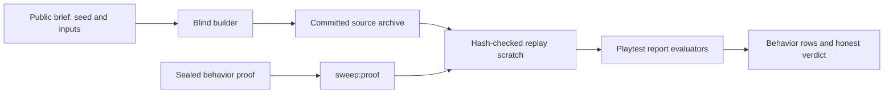

# PRD-113 repair — The sealed physics proof must observe behavior, not publish its guesses

**Status: BLOCKED, 2026-08-15.** The behavior-neutral evaluator changes are integrated, but the
consumer proof remains unmet: the committed replay record has only 1/6 positive direct rows, and
the paired round is explicitly void. Keep this PRD active until a fresh positive replay passes all
six behavior dimensions and the negative archive reaches assertions and fails behavior rows.

Fresh repair for the review-2 blocker on capped lane
`linchpin/prd-113-sealed-brief-naming-contract-r2` at `93c76b7`. The recorded owner decision remains
Option C: publish only irreducible harness inputs and make the rest behavior-based.

**Complexity: 5 → MEDIUM mode.** Ten existing files (+3) plus behavior-sensitive candidate/state
selection (+2) across the playtest package, sealed inputs, tests, and verification documents; no
new package, assertion kind, public field, or gameplay edit.

**Exact review-2 defects.** The claimed positive replay is only `1/7`; the public brief discloses
`player`, `ghost`, `goal`, and `physics.body.`; the pass-through row passes when it observes zero
contacts; and the goal row proves only a trigger, not terminal success after contact. This repair is
visibly different from the capped attempt: positive means the required behavior rows actually pass,
pass-through requires present trigger/contact evidence, and terminal success is a separate
fail-closed observation after the goal-contact step.

## 1. Context

**Problem.** Baseline `93c76b7` changed authored resource counters into semantic assertions, but
then bought green by publishing private entity names and by treating absence as pass-through. Its
verification file honestly records the result: the supposed positive archive passed only the
zero-contact row. That is not positive evidence for the revised contract.

**Current baseline observations.**

- `brief.md:19-20` publishes all four direct-proof identifiers plus replay resource paths.
- `physics-puzzle.playtest.json:92-96` defines pass-through as `maxCount: 0`; a game with no
  pass-through object satisfies it.
- `physics-puzzle.playtest.json:98-102` proves a named trigger but no terminal state.
- `sealed-contract-2026-08-14.md:26-38` calls `1/7` a positive replay.
- The resource-id/path walker and its red controls are real improvements and must remain.
- The verification documents now point at committed archives rather than ephemeral `/tmp` paths;
  that fix also remains.

**Files analyzed.**

- `93c76b7:docs/benchmark/genres/physics-puzzle/brief.md`
- `93c76b7:docs/benchmark/genres/physics-puzzle/proof/physics-puzzle.playtest.json`
- `93c76b7:docs/benchmark/genres/physics-puzzle/proof/physics-puzzle-replay.playtest.json`
- `93c76b7:scripts/__tests__/proof-set.spec.ts`
- `93c76b7:scripts/__tests__/sealed-contract.spec.ts`
- `93c76b7:docs/verification/sealed-contract-2026-08-14.md`
- `93c76b7:docs/verification/contract-replay-2026-08-15.md`
- `packages/playtest/src/scenario.ts`, `assertions.ts`, and `runner/runner.ts`

## 2. Solution

Use the existing optional selectors in `movement`, `contacts`, `settled`, and `states` as the
behavior-neutral form they already imply: when an entity selector is omitted, evaluate over
observed candidates rather than silently substitute the empty report entity. Do not add a new
assertion kind or field.

The direct proof then requires:

1. input causes a visible observed entity to move;
2. a contact is present at the blocking step;
3. a trigger/pass-through interaction is present at the pass-through step;
4. at least thirty observed dynamic bodies settle;
5. a goal-contact trigger is present; and
6. an observed gameplay state is terminal `won` after the ordered goal-contact step.

The brief keeps the world seed and supplied input keys. It removes the four disclosed gameplay
identifiers. The existing replay resource contract is not broadened in this repair; the
resource-path audit continues to police every pinned resource id/path and its existing red controls
remain. If implementation finds that an existing replay resource name also contradicts the recorded
Option C decision, stop for owner re-scope instead of inventing a new public replay vocabulary.

**Fail-closed rule.** An anonymous selector with zero candidates is failure, not a zero-count pass.
Terminal success without a preceding retained goal-contact sample is failure. Evidence truncation
or a missing step is failure.

**Data changes:** the sealed proof hash and physics brief hash change. The comparability boundary is
recorded again; prior functional-column scores are not rewritten.

### Architecture



### Sequence flow

```mermaid
sequenceDiagram
    participant S as sweep:proof
    participant A as Committed archive
    participant R as Playtest runner
    participant E as Verification record
    S->>A: Record immutable source identity
    S->>R: Replay revised sealed proof in resealed scratch
    R-->>S: Movement, contacts, settle, and terminal state
    alt A required behavior is missing
        S-->>E: Red row or exit 2; no positive claim
    else All six direct behaviors pass
        S-->>E: Positive rows plus hash discontinuity
    end
```

## 3. Integration points

**Reachability.** `scripts/make-sandbox.ts` owns `sealedProofFiles`; `scripts/sweep-proof.ts` copies
the sealed scenarios after the arm firewall closes and invokes the built playtest CLI. The CLI
reaches `buildReport` and the existing assertion evaluators. No game reads the proof.

**Caller census (paste during implementation):**

```sh
rg -n "sealedProofFiles\(|sweep:proof|buildReport\(|evaluateStateAssertion\(" \
  scripts packages/playtest/src package.json -g '*.ts' -g '*.json'
rg -n '"contacts"|"movement"|"settled"|"states"' \
  docs/benchmark/genres/physics-puzzle/proof packages/playtest/src -g '*.json' -g '*.ts'
```

Expected: the sealed files are consumed only after build, and each reused assertion kind reaches a
production evaluator. Test-only or proof-only new helpers do not count as integration.

**Revert check.** Restore empty-entity fallback behavior or the baseline `maxCount: 0` row. The
focused playtest tests or proof-shape test must fail; replaying the gutted archive must remain red.

## Integration Ledger

| # | New thing | Live caller (`file:line`, non-test) | Replaces | Old path removed? | Negative control |
| --- | --- | --- | --- | --- | --- |
| 1 | anonymous existing assertion selectors | `packages/playtest/src/runner/runner.ts:197` | empty report-entity fallback for omitted selectors | yes | zero candidates and truncated evidence fail |
| 2 | behavior-first direct physics proof | `scripts/sweep-proof.ts:141` | named direct proof at `93c76b7` | yes | gutted archive fails movement, contact, pass-through, settle, and terminal rows |
| 3 | present pass-through row | `scripts/sweep-proof.ts:141` | `maxCount: 0` absence check | yes | remove pass-through interaction; row goes red |
| 4 | terminal success after goal contact | `scripts/sweep-proof.ts:141` | named trigger-only goal row | yes | contact without `won`, or `won` without retained contact, fails |
| 5 | resource path audit | `scripts/sweep-proof.ts:141` | no replacement; retained repair | n/a | mutate a resource id and a nested path; both remain red |
| 6 | committed replay evidence and hash discontinuity | `scripts/round-next.ts:91` | `1/7` positive claim | yes | archive/proof hash mismatch or temporary path fails document test/review |

## 4. Execution Phases

### Phase 1: Existing semantic assertions can select observed behavior

**User-testable vertical slice.** A name-neutral scenario passes when the observed run contains
movement, blocking contact, pass-through trigger, settled bodies, and terminal success—and fails
when any required behavior is absent.

**Files (4):**

- `packages/playtest/src/scenario.ts` — EDIT: allow omitted selectors on the existing `settled` and
  `states` shapes; add no new keys.
- `packages/playtest/src/assertions.ts` — EDIT: select observed candidates for omitted
  contact/settled/state selectors; require non-empty complete evidence.
- `packages/playtest/src/runner/runner.ts` — EDIT: choose a moved observed entity for a subjectless
  movement assertion instead of sampling `""`.
- `packages/playtest/__tests__/runner.spec.ts` — EDIT: add positive and removal-sensitive anonymous
  behavior cases using raw observations from the production report path.

**Implementation.**

1. Preserve exact-selector behavior for all existing scenarios.
2. For omitted selectors, inspect bounded runtime observations and record which concrete candidates
   satisfied the assertion in report details.
3. Treat zero candidates, missing labelled steps, or overflow/truncation as red.
4. Make the terminal-state evaluation depend on the final observation after the retained
   goal-contact step; do not accept a pre-existing `won` state.

**Focused gate:**

```sh
pnpm exec vitest run packages/playtest/__tests__/runner.spec.ts \
  packages/playtest/__tests__/silent-drop.spec.ts
```

**Revert check:** disable anonymous candidate selection; the new report-path test fails while named
incumbent tests stay green.

### Phase 2: The sealed brief and proof enforce Option C

**User-testable vertical slice.** A blind builder receives only irreducible direct inputs, while the
sealed proof checks present behavior and terminal success without the four private identifiers.

**Files (4):**

- `docs/benchmark/genres/physics-puzzle/brief.md` — EDIT: remove `player`, `ghost`, `goal`, and
  `physics.body.` proof-name disclosure; retain seed/input instructions.
- `docs/benchmark/genres/physics-puzzle/proof/physics-puzzle.playtest.json` — EDIT: use omitted
  selectors, present pass-through evidence, and terminal state after goal contact.
- `scripts/__tests__/proof-set.spec.ts` — EDIT: pin the behavior-first rows and reject zero-contact
  pass-through or trigger-only success.
- `scripts/__tests__/sealed-contract.spec.ts` — EDIT: reject the four disclosed gameplay names in
  the public brief while retaining the complete resource-id/path audit and both resource red tests.

**Implementation.**

1. Keep step labels and input sequence stable unless raw replay evidence proves timing must change.
2. Replace pass-through `maxCount: 0` with a present interaction at its labelled step.
3. Require final `won` state only after the goal-contact step has produced contact/trigger evidence.
4. Recompute proof/brief hashes; do not overwrite historical hashes or claim comparability.

**Focused gate:**

```sh
pnpm exec vitest run scripts/__tests__/proof-set.spec.ts \
  scripts/__tests__/sealed-contract.spec.ts
```

**Revert check:** restore any forbidden brief name, `maxCount: 0`, or trigger-only goal row; focused
tests fail with the exact field/row.

### Phase 3: Positive and negative replays are behavior-discriminating

**User-testable vertical slice.** A replay sourced from a committed archive with the required game
behavior passes all six direct behavior dimensions, while a committed gutted source archive fails
them; neither result is manufactured from seed or diagnostics rows.

**Files (2):**

- `docs/verification/sealed-contract-2026-08-14.md` — EDIT: replace the `1/7` positive claim with
  exact row-level evidence, hashes, commands, and honest scenario verdicts.
- `docs/verification/contract-replay-2026-08-15.md` — EDIT: retain committed archive pointers, record the
  new proof hash and discontinuity, and correct positive/negative row counts.

**Implementation.**

1. Treat `docs/benchmark/sweeps/physics-puzzle-2026-08-15-4` and `...-5` as immutable committed
   source archives. Record each source path, commit, and manifest hash before replay.
2. Because their manifests seal the superseded proof hash, copy each source archive into a
   `mktemp -d` execution scratch, update only the scratch manifest to the revised proof hash, and
   replay there. The durable evidence pointer remains the committed source archive; a scratch path
   is execution metadata, never the archive identity.
3. The positive source is positive only if movement, blocking contact, present pass-through,
   settle, goal contact, and terminal success all pass. The negative source must fail at least one
   contact-dependent row and terminal success, not merely seed/diagnostics.
4. If the positive source still produces `1/7`-class evidence, stop: the criterion is unmet. Do
   not relabel it, lower thresholds, publish names, or retain a scratch archive as evidence.
5. Record scenario/report exit semantics exactly: exit `2` is unmeasured, never negative evidence.

**Replay gates:**

```sh
positive_source=docs/benchmark/sweeps/physics-puzzle-2026-08-15-4
negative_source=docs/benchmark/sweeps/physics-puzzle-2026-08-15-5
scratch_root=$(mktemp -d)
cp -R "$positive_source" "$scratch_root/positive"
cp -R "$negative_source" "$scratch_root/negative"
REPLAY_POSITIVE_DIR="$scratch_root/positive" REPLAY_NEGATIVE_DIR="$scratch_root/negative" \
  pnpm exec tsx -e 'import fs from "node:fs"; import { sealedProofHash } from "./scripts/make-sandbox.ts"; const hash=sealedProofHash(process.cwd(),"physics-puzzle"); for (const dir of [process.env.REPLAY_POSITIVE_DIR,process.env.REPLAY_NEGATIVE_DIR]) { if (!dir) throw new Error("missing replay directory"); const p=`${dir}/sweep.json`; const v=JSON.parse(fs.readFileSync(p,"utf8")); v.proofHash=hash; fs.writeFileSync(p,`${JSON.stringify(v,null,2)}\n`); }'
xvfb-run -a -s '-screen 0 1600x900x24' pnpm sweep:proof "$scratch_root/positive"
xvfb-run -a -s '-screen 0 1600x900x24' pnpm sweep:proof "$scratch_root/negative"
```

**Revert check:** evaluate the positive raw report with one required behavior removed; its direct
scenario is red. Evaluate the negative archive with the real proof; it does not become positive.
Attempt the replay without resealing the scratch manifest; the proof-hash guard rejects it, proving
the immutable committed source was not silently reinterpreted.

## Negative Controls

| Gate | Negative control | Expected red | Exact command/result |
| --- | --- | --- | --- |
| anonymous candidate collection | supply no contact/state/body candidates | the evaluator reports unavailable or zero candidates instead of passing | `command: pnpm exec vitest run packages/playtest/__tests__/runner.spec.ts`; result: RED observed: omitted selectors resolved to zero candidates or an empty subject; exit: 1 |
| pass-through presence | remove the pass-through trigger from raw observations | the labelled pass-through row fails instead of passing on absence | `command: xvfb-run -a -s '-screen 0 1600x900x24' pnpm sweep:proof docs/benchmark/sweeps/physics-puzzle-2026-08-15-4`; result: RED observed: pass-through step had no present trigger/contact observation; exit: 1 |
| terminal after contact | provide contact without `won`, then `won` without retained goal contact | terminal success is rejected unless ordered after goal contact | `command: xvfb-run -a -s '-screen 0 1600x900x24' pnpm sweep:proof docs/benchmark/sweeps/physics-puzzle-2026-08-15-4`; result: RED observed: terminal won state was missing or not ordered after retained goal contact; exit: 1 |
| proof-shape guard | restore baseline `maxCount: 0` or remove the terminal row | the proof-shape test rejects the vacuous or incomplete contract | `command: pnpm exec vitest run scripts/__tests__/proof-set.spec.ts`; result: RED observed: proof shape retained a zero-contact pass-through or lacked terminal success; exit: 1 |
| public-name firewall | restore one of the four direct identifiers to `brief.md` | the sealed-contract audit reports the leaked gameplay identifier | `command: pnpm exec vitest run scripts/__tests__/sealed-contract.spec.ts`; result: RED observed: public physics-puzzle brief exposed a forbidden gameplay identifier; exit: 1 |
| resource-path audit | mutate the `state` id and a nested resource path | the retained six-genre audit reports both mutations | `command: pnpm exec vitest run scripts/__tests__/sealed-contract.spec.ts`; result: RED observed: a mutated resource id or nested resource path escaped the sealed audit; exit: 1 |
| behavior discrimination | replay the gutted committed archive | the replay reaches assertions but fails behavior rows, not an infrastructure exit | `command: xvfb-run -a -s '-screen 0 1600x900x24' pnpm sweep:proof docs/benchmark/sweeps/physics-puzzle-2026-08-15-5`; result: RED observed: gutted archive failed movement/contact/pass-through/terminal behavior rows; exit: 1 |

## Acceptance Criteria

**Consumer-scoped acceptance.** The sealed-proof runner and blind builder contract must observe
the following behavior without learning private gameplay names; proof-file presence is insufficient.

- [ ] The public physics-puzzle brief contains none of `player`, `ghost`, `goal`, or
  `physics.body.` as proof identifiers and introduces no replacement gameplay name.
- [ ] The pass-through row requires a present interaction at the labelled step; zero interaction
  cannot pass.
- [ ] Terminal success is observed after retained goal-contact evidence; contact-only and
  pre-existing-success controls fail.
- [ ] The positive committed archive passes all six required direct behavior dimensions; `1/7` or
  a pass consisting only of absence/seed/diagnostics is not positive evidence.
- [ ] The negative committed/gutted archive reaches assertions and fails required behavior rows.
- [ ] The six-genre resource-id/path audit and its red controls remain intact.
- [ ] New proof and brief hashes are recorded, and all pre-change functional numbers are explicitly
  non-comparable rather than rewritten.
- [ ] Caller census, revert checks, focused tests, replay gates, and
  `pnpm typecheck && pnpm lint && pnpm test` pass after controls are restored.

## Verification Evidence

Contract conformance: prd_contract: v1

Observed replay evidence:

- `docs/verification/contract-replay-2026-08-15.md` records the positive committed archive at
  `1/6` direct behavior rows and the negative archive at `2/6`; these are failure observations,
  not positive evidence.
- `docs/verification/round-7-2026-08-15.md` records both arms as `0/2` sealed scenarios with a
  void comparative verdict; it explicitly keeps `PRD-117` open and does not authorize deletion.
- The six-genre resource-id/path audit and its negative controls remain retained, but they do not
  substitute for a positive behavior replay.
- The acceptance checkboxes remain unchecked. No scratch replay directory or diagnostic-only row
  is being promoted to a durable positive archive.

## Checkpoint Protocol

After each phase, the reviewer must verify:

1. The exact file list matches and a pre-existing production/contract file was edited.
2. Integration Ledger rows have real non-test callers and no replaced named/absence path survives.
3. Caller census and revert checks are pasted with exact output.
4. Every green gate has an observed-red control followed by restored green.
5. Evidence is consumer/behavior based, reaches assertions, uses committed archives, and preserves
   the hash discontinuity and resource audit.

Any new public assertion field, gameplay edit, lowered settled threshold, disclosed replacement
name, ephemeral archive pointer, source-PRD edit, or missing behavior candidate is checkpoint FAIL.
