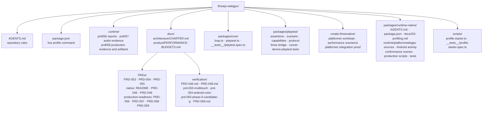

# PRD-058: Performance, Reliability, and Privacy-Safe Observability

**Status:** NOT STARTED  
**Owner:** Runtime and playtest maintainers  
**Goal:** G5 — profiling  
**Committed baseline:** `cb754d9`  
**Complexity: 10 → HIGH mode.**  
**Blast radius: 32 repository files across 4 workspace packages, root command wiring, generated proof source, and native verification documentation.**

## 1. Context

**Problem:** ThreeNative has no fail-closed production gate that measures the real platformer workload across web, native desktop, and physical mobile hardware, or that retains privacy-safe evidence when long runs, crashes, ANRs, JavaScript failures, or WebGPU validation failures occur.

**Files analyzed:** `docs/architecture/CHARTER.md`, `docs/product/PERFORMANCE-BUDGETS.md`, the G1-G5 ledgers, the native README, PRD-046, PRD-048, PRD-053 through PRD-057, PRD-059, their available verification ledgers, and the current core, playtest, platformer-template, Android, iOS, desktop, crash, and WebGPU error paths listed in Project Structure.

**Current behavior:**

- G5 is `NOT STARTED`; the only profiler is a short browser starter diagnostic, not the unmodified platformer or a cross-runtime production gate.
- Playtest rejects unknown assertion kinds, but it has no `performance` assertion or timing observation contract; device `holdFrames` advances deterministic ticks and cannot prove wall-clock pacing.
- Desktop and Android plumbing exists, but the dirty worktree, emulator screenshots, and the older hosted run are not physical-device or same-hardware performance evidence.
- Native crash and WebGPU error paths produce logs, but there is no one classifier, distinct production fail codes, completeness marker, redaction policy, or retained evidence manifest.
- There is no defined startup, memory-growth, thermal, battery, long-soak, crash, ANR, tombstone, JavaScript-error, or WebGPU-error acceptance packet.

**Incumbent census:**

- `scripts/profile-starter.ts` remains a web-only developer diagnostic. This PRD does not silently promote it to production evidence and does not duplicate it.
- PRD-053 owns multitouch implementation and device proof; PRD-054 owns cross-target visual/behavior parity and host-shim error visibility; PRD-055 owns generated HUD/text; PRD-046 owns native physics; PRD-048 owns local native CLI/distribution mechanics.
- PRD-056 owns physical-device acquisition, signing/install provenance, and device readiness. PRD-057 owns audio implementation and audio-specific lifecycle/continuity proof. This PRD consumes their versioned evidence.
- PRD-059 owns dependency provenance, SBOM, and supply-chain release policy. This PRD records artifact hashes only for run identity and does not create another provenance system.

## 2. Solution

**Approach:**

- Add a strict playtest `performance` assertion whose observations come from the real render loop and whose missing, truncated, malformed, or synthetic timing data fails closed.
- Add one local production profiler that runs the generated, unmodified platformer, measures browser and native desktop on the same machine, consumes PRD-056 physical-device evidence for mobile, and emits a versioned local report.
- Measure cold startup, render-frame distribution, one-second frame floors, memory high-water and growth, thermal state, battery state, liveness, and a two-hour soak without introducing cloud telemetry.
- Collect app-scoped JavaScript, WebGPU, native crash, Android ANR/tombstone, and Apple crash evidence; classify each failure with a distinct stable code and require start/first-frame/end markers.
- Retain raw local artifacts by content hash and commit only a privacy-safe verification ledger; do not collect user PII, secrets, unrelated system logs, or globally scoped device data.

**Architecture and sequence:** The existing root command invokes the production profiler. The profiler scaffolds the platformer without modifying its source, records source and artifact identities, launches the existing browser or native entry point, and polls bounded render-loop observations through the playtest bridge. Physical runs first validate PRD-056 evidence and, when audio is claimed, PRD-057 evidence. Target-specific collectors add app-scoped process, memory, thermal, battery, crash, ANR, and GPU diagnostics. The evidence writer validates marker completeness, redacts disallowed fields, hashes raw files, evaluates budgets, and writes one immutable local report plus a repository verification summary. Any unavailable required observation returns `BLOCKED` with exit 2; an executed threshold or diagnostic failure returns a distinct `TN_PROD_*` code with exit 1.

**Key decisions:**

- The platformer template is the production subject because the charter names the unmodified platformer workload; a toy scene or `starter` profile cannot satisfy acceptance.
- Render-frame pacing uses monotonic presentation-loop intervals. Deterministic playtest ticks remain for gameplay assertions and cannot be substituted for wall-clock frames.
- Desktop comparison uses alternating web/native runs on one host and one GPU adapter. It records different process and artifact identities so a self-comparison cannot pass.
- Mobile performance acceptance requires physical hardware from PRD-056. Emulator and simulator runs prove plumbing only; hosted runners prove only the exact host they identify.
- Diagnostics are local, app-scoped, allowlisted, redacted, and opt-in. There is no cloud endpoint, session replay, stable user/device identifier, analytics SDK, or PII field.

**Data Changes:** No database or network service. Add versioned local JSON evidence schemas (`performanceObservationV1` and `productionEvidenceV1`) under ignored `.runtime/prd058/`; only a redacted Markdown summary is repository-tracked.

**Reachability:**

- Entry point: `pnpm profile:production` in the root package.
- Pre-existing callers edited: root and native package scripts, the core frame loop and playtest plugin, browser/device runners, Android activity/native entry, the template test, and the native support/verification documents.
- Trigger: a maintainer runs a declared target command; the existing CLI and frame loop reach the new observation and evidence paths.
- Observable result: `.runtime/prd058/<run-id>/production-evidence.json`, raw content-addressed artifacts, terminal exit/code, and `docs/verification/PRD-058.md`.
- User-facing UI: no. This is an internal release-evidence and diagnostics workflow.

## 3. Project Structure

Exactly the following repository paths are in implementation, caller, dependency, or proof scope. `NEW` and `EDIT` identify planned writes; `READ` and `CONSUME` are immutable inputs owned elsewhere. `.runtime/` entries are ignored generated artifacts, not repository writes.

## Scope Limits and Anti-Scope

**In scope:**

- The unmodified generated platformer; web browser, native desktop, physical Android, and physical iOS targets that the repository claims; app-scoped diagnostics; local retention; explicit budgets and block/fail semantics.
- Exact-source and exact-artifact identity, same-host desktop comparison, physical-device provenance consumption, and conditional audio-evidence consumption.
- Test-only fault controls reachable only through the profiling command and visibly marked as diagnostic artifacts.

**Out of scope:**

- Cloud telemetry, hosted dashboards, crash-upload services, session replay, analytics, user tracking, PII collection, remote alerting, or a new network service.
- Implementing multitouch, cross-target rendering/host shims, generated HUD/text, physics, native CLI/distribution, audio, device acquisition/signing, SBOM, package publication, or consumer promotion.
- Rendering optimizations before the evidence identifies a bottleneck; new engine abstractions, a benchmark scene, gameplay changes, dynamic resolution, or visual-quality reductions.
- Treating emulator, simulator, hosted-runner, dirty-worktree, signed-artifact, published-package, or promoted-consumer evidence as interchangeable.

## Evidence Identity and Budget Semantics

| Evidence class | What it may prove | What it must never claim |
|---|---|---|
| Dirty checkout at `cb754d9` | Local implementation/plumbing observations with a recorded diff hash | A committed, signed, published, or promoted result |
| Committed HEAD `cb754d9` | Exact committed source baseline | That later dirty changes or a different artifact were tested |
| Older hosted CI SHA `e38439c` | Historical runner result for that SHA and host only | Current HEAD, physical-device, same-hardware parity, or release readiness |
| Android emulator | Install/launch/protocol plumbing on the named emulator/GPU | ARM64 physical performance, thermals, battery, or touch-device readiness |
| iOS simulator | Simulator build/launch/protocol plumbing | Physical iPhone/iPad performance, thermals, battery, or signing readiness |
| Hosted runner | The named hosted CPU/GPU/OS result if identity is complete | A local dGPU, physical mobile, or an unspecified consumer machine |
| Physical hardware | The named model class, OS build, SoC/GPU, render size, and run | Any other model, OS, render size, or unsigned/different artifact |
| Signed artifact | That exact content hash/signing identity installed and ran | A package publication or consumer promotion |
| Published package | Registry availability of an exact version/hash, owned elsewhere | That a consumer installed or executed it |
| Promoted consumer | The named consumer used the exact published artifact, owned elsewhere | Other consumers or an unreleased worktree |

The authoritative budgets are:

- Web desktop: unmodified platformer at recorded 1920×1080 render size, mean render rate at least 60.0 fps and p99 render interval at most 33.0 ms after warm-up.
- Native desktop: the same source-tree hash, host, GPU adapter, driver, render size, camera path, and sampling window; each median-of-runs mean, p50, p95, and p99 frame-time statistic is no slower than web. The web and native process and artifact identities must differ.
- Physical mobile: unmodified platformer at a render buffer whose short edge is at least 1080 pixels, refresh rate at least 60 Hz, mean render rate at least 59.4 fps, and every complete one-second window at least 30.0 fps. The 59.4 threshold permits a measured 59.94 Hz display clock; it does not relax the 60 fps target.
- Cold startup: process/activity launch to the first presented non-blank platformer frame, five cold launches, p95 at most 5,000 ms on desktop and 8,000 ms on physical mobile. A warm process, cached first-frame marker, or loading-screen-only frame is invalid.
- Memory: after a five-minute warm-up, the last 15-minute median resident/app memory may exceed the first 15-minute median by no more than the larger of 64 MiB or 10%, and least-squares growth may not exceed 0.25 MiB/min. High-water is always recorded; no unsupported cross-OS absolute high-water comparison is invented.
- Thermal/battery: sample at least every 30 seconds during physical runs. Android severe/critical/emergency or iOS serious/critical thermal state sustained for 60 seconds fails. Start/end percentage, charging state, low-power state, and discharge per hour are required evidence; battery is not assigned a universal cross-device efficiency threshold.
- Long soak: two continuous hours after warm-up for each claimed production target, zero unexpected process exits, ANRs, uncaught JavaScript errors, WebGPU validation/device errors, native crash artifacts, missing markers, dropped timing intervals, or one-second frame-floor violations.

Every timing statistic is computed from monotonic render-loop intervals, excluding the declared warm-up and including stalls. Percentiles use nearest-rank on ascending raw intervals; mean fps is `1000 / arithmetic-mean-frame-ms`; one-second floors use non-overlapping monotonic one-second buckets and count zero-frame buckets as 0 fps. Results with clock regression, observation truncation, sample gaps over 30 seconds, a changed GPU/thermal/battery collection permission, or fewer than the required frames are `BLOCKED`, not imputed.

## Integration Ledger

| # | New thing | Live caller (`file:line`, non-test) | Replaces | Old path removed? | Negative control |
|---|---|---|---|---|---|
| 1 | Strict playtest `performance` assertion | `packages/playtest/src/runner/cli.ts:91` dispatches the real runner; `packages/playtest/src/runner/runner.ts:113` requests the live bridge sample | No incumbent assertion exists | New behavior; unknown-assertion rejection remains | Wrong-typed performance field returns `TN_SCENARIO_INVALID` and exit 2 |
| 2 | Bounded real-render `performanceObservationV1` | `packages/core/src/loop.ts:103` runs every render frame; `packages/core/src/playtest.ts:40` installs the live bridge | No production observation; deterministic ticks are not replaced | New behavior; deterministic gameplay sampling remains separate | Dropping the capability/observation makes the performance scenario fail closed |
| 3 | Wall-clock browser/device sampling | `packages/playtest/src/runner/cli.ts:91` selects the runner; `packages/playtest/src/runner/androidRunner.ts:169` executes hold/tick actions | Device `holdFrames` as a timing proxy | Existing `holdFrames` keeps gameplay semantics and no longer supplies performance timing | Deliberately slow render path breaches the p99/floor gate with `TN_PROD_PERFORMANCE_BUDGET` |
| 4 | `profile-production.mjs` and `productionEvidenceV1` | `package.json:35` exposes the existing profiling command surface; `packages/runtime-native/package.json:41` exposes native verification | `profile-starter` as release evidence | `profile-starter` remains explicitly diagnostic-only; production callers use the new command | Missing first-frame/end marker returns `TN_PROD_MARKER_MISSING` |
| 5 | Same-hardware desktop parity gate | `packages/runtime-native/src/cli/main.cpp:1356` loads the native bundle; `packages/playtest/src/runner/runner.ts:102` drives the browser build | No incumbent production parity gate | New behavior; PRD-054 visual/behavior parity remains authoritative | Slow only the native arm; different identities are recorded and parity exits 1 |
| 6 | App-scoped diagnostic collector and classifier | `packages/runtime-native/src/runtime.cpp:522` installs crash handlers; `packages/runtime-native/src/webgpu/context.cpp:153` emits GPU errors; `packages/runtime-native/src/platform/android_main.cpp:151` evaluates Android game source | Disconnected logs without one verdict | Existing PRD-054 logging channels delegate into the collector; they are not reimplemented | Forced JS error, GPU validation error, native abort, and Android ANR each produce their distinct code and exit 1 |
| 7 | Physical mobile resource and two-hour soak gate | `package.json:35` invokes the profiler; `packages/create-threenative/templates/platformer/src/scenes/Level.ts:130` drives the real workload | No incumbent physical performance/soak gate | New behavior; PRD-056 continues to own device/signing proof | Forced bounded memory growth and a slow render path breach independent gates |
| 8 | Privacy-safe retained verification summary | `docs/PRDs/native/README.md:14` and `packages/runtime-native/docs/G5-profiling.md:4` expose measured support state | Ad hoc local logs as support evidence | Raw logs remain ignored and content-addressed; summaries reference their hashes | Injecting an absolute user path/serial/secret fails redaction; stale SHA evidence cannot mark DONE |

## 4. Execution Phases

### Phase 1: Strict performance assertion contract — Scenario authors get a typed assertion that cannot be ignored or satisfied without observations.

**Files (5):**

- `packages/playtest/src/assertions.ts` - EDIT: register and evaluate `performance` with explicit threshold semantics
- `packages/playtest/src/scenario.ts` - EDIT: parse the exact assertion fields and reject unknown, missing, non-finite, or contradictory values
- `packages/playtest/src/capabilities.ts` - EDIT: add the runtime performance capability without weakening existing capability checks
- `packages/playtest/src/protocol.ts` - EDIT: define bounded `performanceObservationV1` payload types and completeness counters
- `packages/playtest/__tests__/scenario.spec.ts` - EDIT: prove valid parsing, every invalid field, missing observations, and assertion failure text

**Implementation:**

- Add `performance` fields: positive `sampleSeconds`, positive integer `minFrames`, optional finite `minMeanFps`, `minOneSecondFps`, `maxP99FrameMs`, `maxStartupMs`, `maxMemoryGrowthBytes`, and `maxMemorySlopeBytesPerMinute`, plus `requireMemory`, `requireThermal`, and `requireBattery` booleans. Require at least one threshold or required observation.
- Reject negative, zero where prohibited, non-finite, unknown, wrong-typed, or mutually impossible fields during scenario validation with `TN_SCENARIO_INVALID` and runner exit 2.
- Evaluate each declared threshold independently. A missing capability, missing field, insufficient frames, dropped interval, truncated ring, or incomplete required sample is a failed/blocked assertion, never an omitted assertion.
- Emit expected/actual/unit/sample-count/source/complete for every metric; preserve playtest exit 0 for all assertions passed, 1 for executed assertion failure, and 2 for malformed/unreachable/no-assertion execution.

**Wiring:** Caller edited: `packages/playtest/src/runner/cli.ts:91` already reaches scenario validation through the real CLI. Registration: add the assertion to the existing registry at `packages/playtest/src/assertions.ts:27`. Old path: new behavior; unknown assertion rejection remains. Ledger row: 1.

**Tests Required:**

| Gate | Test File | Test Name | Explicit assertion semantics | Negative control required |
|---|---|---|---|---|
| performance-schema | `packages/playtest/__tests__/scenario.spec.ts` | `should accept only a finite performance assertion when thresholds are actionable` | Each legal field round-trips exactly; `NaN`, infinity, zero duration/frames, unknown keys, and wrong types throw `TN_SCENARIO_INVALID` before launch | Set `maxP99FrameMs` to a string and observe exit 2 |
| performance-missing-observation | `packages/playtest/__tests__/scenario.spec.ts` | `should fail when a declared performance metric has no complete observation` | A declared p99 threshold with no p99/sample source returns a failed assertion naming `performance.p99FrameMs`; it never reports pass or skips | Remove the observation from an otherwise valid sample and observe exit 1 |

**Revert check:** Remove `performance` from the registry; the pre-existing scenario validation/runner path must reject the generated platformer performance scenario rather than silently ignore it.

**User Verification:** Run the unit test with one known-false p99 threshold. Expected: one collected performance assertion, actual and expected values printed, `TN_PROD_PERFORMANCE_BUDGET`, exit 1.

### Phase 2: Real render-loop observations — Browser and native games expose bounded, monotonic timing from the frame loop users actually run.

**Files (5):**

- `packages/core/src/loop.ts` - EDIT: record monotonic render intervals, sequence, warm-up origin, first frame, and dropped-ring count
- `packages/core/src/playtest.ts` - EDIT: expose loop observations through the existing playtest installation
- `packages/playtest/src/three/bridge.ts` - EDIT: accept a generic Three.js performance provider and advertise capability only when live
- `packages/core/__tests__/playtest.spec.ts` - EDIT: prove the real loop feeds the installed bridge and bounded snapshots
- `packages/playtest/src/three/bridge.test.ts` - EDIT: prove capability, payload validation, truncation, and absence behavior

**Implementation:**

- Use the loop's monotonic clock and actual render callback at `packages/core/src/loop.ts:103`; never derive frame rate from fixed-step tick count.
- Keep a bounded 4,096-interval ring with monotonically increasing first/last sequence, total frame count, first-frame mark, clock source, and dropped-before-sequence counter. The provider returns immutable copies.
- Make the runner poll frequently enough to avoid ring loss. Any sequence gap not explained by the preceding cursor or any non-positive interval marks the observation incomplete.
- Plain Three.js callers may supply the same provider; absence means no performance capability and fail-closed behavior for a performance assertion.

**Wiring:** Caller edited: the existing render frame callback at `packages/core/src/loop.ts:103` records intervals and `packages/core/src/playtest.ts:40` passes its provider to the existing bridge. Registration: `runtime.performance` joins current capabilities. Old path: new observation; the existing EWMA remains a runtime diagnostic and does not become evidence. Ledger row: 2.

**Tests Required:**

| Gate | Test File | Test Name | Explicit assertion semantics | Negative control required |
|---|---|---|---|---|
| performance-bridge | `packages/core/__tests__/playtest.spec.ts`; `packages/playtest/src/three/bridge.test.ts` | `should sample intervals produced by the installed real frame loop` | Three driven frame callbacks produce two positive intervals, exact sequence/count/source, and advertised capability; a 4,097th interval increments dropped count; no provider advertises no capability | Disable the provider while retaining the assertion and observe a missing-capability failure |

**Revert check:** Disconnect the loop provider from `playtest()`; the pre-existing bridge request used by the platformer scenario must fail its performance capability requirement.

**User Verification:** Run the platformer for 10 seconds and inspect the sample. Expected: frame sequence advances with rendered frames while deterministic tick count remains a distinct field.

### Phase 3: Wall-clock runner sampling — The existing browser and device runners collect complete render timing without changing gameplay tick semantics.

**Files (5):**

- `packages/playtest/src/runner/runner.ts` - EDIT: poll browser timing, measure launch-to-first-frame, and pass complete observations to assertions
- `packages/playtest/src/runner/androidRunner.ts` - EDIT: separate real-time hold duration from fixed-tick advancement and poll observations
- `packages/playtest/src/runner/observationFields.ts` - EDIT: allowlist the performance summary and completeness fields
- `packages/playtest/__tests__/runner.spec.ts` - EDIT: prove browser collection, startup origin, ring cursors, and exit semantics
- `packages/playtest/__tests__/device-playtest.spec.ts` - EDIT: prove device wall-clock sampling and deterministic-tick separation

**Implementation:**

- Add an explicit real-time sampling action used by performance scenarios. Keep `holdFrames`/advance behavior unchanged for deterministic gameplay tests.
- Start cold-start time immediately before process/page launch and end at the first presented non-blank workload marker; reject a stale marker timestamp or first-frame event preceding launch.
- Poll at most every 10 seconds, deduplicate by sequence, preserve stalls, and fail on sequence gaps, ring drops, clock changes, target disconnects, or marker loss.
- Produce raw intervals for the local profiler and a bounded summary for the playtest report. Do not make raw multi-hour samples part of protocol messages.

**Wiring:** Caller edited: `packages/playtest/src/runner/cli.ts:91` dispatches the browser/device runners; `packages/playtest/src/runner/runner.ts:113` and `packages/playtest/src/runner/androidRunner.ts:129` already request bridge samples. Registration: the scenario action/parser selects real-time sampling. Old path: deterministic holds stay intact but no longer masquerade as performance time. Ledger row: 3.

**Tests Required:**

| Gate | Test File | Test Name | Explicit assertion semantics | Negative control required |
|---|---|---|---|---|
| runner-frame-timing | `packages/playtest/__tests__/runner.spec.ts`; `packages/playtest/__tests__/device-playtest.spec.ts` | `should preserve render stalls and reject sequence gaps on browser and device` | A synthetic monotonic interval series yields exact nearest-rank p99/mean/one-second buckets; a two-second stall remains; fixed ticks do not increase render frames; missing sequence returns incomplete and nonzero | Inject a slow render interval into the live provider and observe the budget failure |

**Revert check:** Restore device `holdFrames` as the timing source; the test asserting unchanged render count under tick-only advancement must fail.

**User Verification:** Run the same short scenario with fixed ticks doubled. Expected: gameplay ticks change while wall-clock render-frame statistics do not double.

### Phase 4: Local production evidence pipeline — Maintainers get one versioned, privacy-safe command and fail-closed report.

**Files (5):**

- `package.json` - EDIT: add the live `profile:production` command without changing default CI gates
- `packages/runtime-native/package.json` - EDIT: expose the package-local production profile command
- `packages/runtime-native/scripts/production-evidence.mjs` - NEW: validate, redact, hash, retain, and evaluate `productionEvidenceV1`
- `packages/runtime-native/scripts/profile-production.mjs` - NEW: orchestrate scaffold, target launch, sampling, diagnostics, and final exit
- `packages/runtime-native/tests/production-profile.test.mjs` - NEW: test schema, budgets, identities, retention, redaction, and status classification

**Implementation:**

- Require target, exact source-tree hash, dirty diff hash or clean marker, bundle/application hash, executable/browser identity, OS/driver/GPU, render size/refresh, command, timestamps, markers, metric provenance, and artifact hashes.
- Allowlist report keys and recursively reject access tokens, cookies, authorization headers, email/IP/MAC, user/home names, absolute workstation paths, Android serials, iOS UDIDs, and unrestricted environment/log payloads. Replace PRD-056 device identifiers with an evidence hash plus non-unique model class.
- Write raw app-scoped files under `.runtime/prd058/<run-id>/artifacts/<sha256>` using create-new semantics, then atomically write the manifest. Never overwrite a run id or read a stale result as current.
- Exit 0 only for `PASS`; exit 1 for an executed `FAIL` with one or more `TN_PROD_*` codes; exit 2 for `BLOCKED`, malformed input, missing prerequisites/markers, unexecuted assertions, or incomplete evidence.

**Wiring:** Caller edited: root `package.json:35` gains `profile:production`, which invokes the new orchestrator; native `package.json:41` delegates to it. Registration: package scripts are the user-reachable command. Old path: `profile:starter` remains labeled diagnostic-only and cannot emit `productionEvidenceV1`. Ledger rows: 4 and 8.

**Tests Required:**

| Gate | Test File | Test Name | Explicit assertion semantics | Negative control required |
|---|---|---|---|---|
| evidence-schema | `packages/runtime-native/tests/production-profile.test.mjs` | `should classify only complete current-run evidence` | Complete fixture returns PASS; absent marker/hash/metric source returns BLOCKED exit 2; breached threshold returns FAIL exit 1; a stale run id cannot satisfy a new invocation | Remove `first-frame` from the in-memory control report and observe `TN_PROD_MARKER_MISSING`, exit 2 |
| evidence-redaction | `packages/runtime-native/tests/production-profile.test.mjs` | `should reject disallowed identity and secret fields before retention` | Every disallowed key/value class is rejected before disk write; allowed model/OS/GPU and content hashes remain; no partial report exists | Inject an absolute home path, serial, and authorization token and observe exit 2 |

**Revert check:** Remove the root command or its import of the evidence writer; the command reachability test must fail and no PASS report may be produced.

**User Verification:** Run the fixture-backed command to a temporary run id. Expected: immutable report, content-addressed artifact, no disallowed strings, exact status/code/exit mapping.

### Phase 5: Same-hardware desktop and startup proof — The unmodified platformer proves web budget and native-not-slower parity on one identified machine.

**Files (5):**

- `packages/runtime-native/scripts/profile-production.mjs` - EDIT: add alternating desktop web/native launches and identity checks
- `packages/runtime-native/scripts/production-evidence.mjs` - EDIT: evaluate desktop and cold-start budgets from independent arms
- `packages/runtime-native/tests/production-profile.test.mjs` - EDIT: prove percentile, startup, identity, and self-comparison rejection
- `packages/create-threenative/templates/platformer/playtests/performance.playtest.json` - NEW: generated production workload scenario with real-time sampling
- `packages/create-threenative/__tests__/platformer.spec.ts` - EDIT: assert scaffolds include and collect the production scenario

**Implementation:**

- Scaffold a fresh platformer, make no source/material/camera/gameplay edits, hash its source tree, and build the ordinary web entry plus import-free native entry from that source.
- Run five cold starts per arm and three alternating `web-native-native-web` 10-minute measurement blocks after a 60-second warm-up, at recorded 1920×1080 on one host/GPU/driver. Abort if adapter, driver, render size, power state, or source hash changes.
- Record distinct process executable/browser and artifact hashes. Reject identical resolved identities, copied reports, and a native arm that resolves to the browser artifact.
- Apply the authoritative desktop budgets and report each repetition plus median-of-runs. Do not average web and native together or remove stalls/outliers.

**Wiring:** Caller edited: `profile-production.mjs` is reached by root `profile:production`; the generated scenario is copied by the existing scaffold and driven through the existing runner. Registration: `platformer.spec.ts` asserts the scenario survives scaffolding. Old path: starter profiling remains diagnostic-only. Ledger row: 5.

**Tests Required:**

| Gate | Test File | Test Name | Explicit assertion semantics | Negative control required |
|---|---|---|---|---|
| desktop-web-budget | `packages/runtime-native/tests/production-profile.test.mjs`; `packages/create-threenative/__tests__/platformer.spec.ts` | `should hold the web platformer budget from real render intervals` | Unmodified scaffold identity is present; mean is at least 60.0 fps and nearest-rank p99 at most 33.0 ms for every accepted repetition | Add the profiler's bounded slow-path control to web and observe `TN_PROD_PERFORMANCE_BUDGET`, exit 1 |
| desktop-native-parity | `packages/runtime-native/tests/production-profile.test.mjs` | `should require independent native statistics no slower than web on one host` | Source/host/GPU/render identities match, process/artifact identities differ, and native median mean/p50/p95/p99 frame time is no slower than web | Slow only native; assert different identities and parity failure, exit 1 |
| startup-budget | `packages/runtime-native/tests/production-profile.test.mjs` | `should measure five cold launches through the first non-blank platformer frame` | Exactly five independent process/activity launches produce monotonic first-frame durations; nearest-rank p95 meets the target; stale/loading-only/warm markers are rejected | Delay the first workload frame beyond budget and observe `TN_PROD_STARTUP_BUDGET`, exit 1 |

**Revert check:** Point both arms at one artifact; the independent-identity test must return `TN_PROD_SELF_COMPARISON` and exit 2 before comparing numbers.

**User Verification:** On one dGPU desktop, run the declared desktop-pair command. Expected: exact host/GPU/source plus different web/native identities, individual repetitions, startup samples, budget verdicts, and no claim about other hardware.

### Phase 6: Crash and error diagnostics — A maintainer can force each failure class and recover a distinct app-scoped diagnostic artifact.

**Files (5):**

- `packages/runtime-native/android/app/src/main/java/com/mystral/engine/MystralActivity.java` - EDIT: pass allowlisted diagnostic controls and provide a test-only UI-thread ANR trigger
- `packages/runtime-native/src/platform/android_main.cpp` - EDIT: fail nonzero on game-eval failure and accept the allowlisted JS/native-abort controls
- `packages/runtime-native/src/runtime.cpp` - EDIT: emit versioned start/first-frame/end/crash markers without replacing OS crash artifacts
- `packages/runtime-native/scripts/collect-production-diagnostics.mjs` - NEW: collect and classify app-scoped JS, GPU, crash, ANR, tombstone, and Apple crash evidence
- `packages/runtime-native/tests/production-diagnostics.test.mjs` - NEW: verify each classifier, marker, scope filter, and exit code

**Implementation:**

- Emit `run-start`, `game-evaluated`, `first-workload-frame`, and `clean-end` markers with run id and monotonic time. An expected crash has no clean-end but must have the matching OS crash artifact and crash marker.
- Fix Android game-eval failure to stop the runtime and return nonzero; collect the thrown JS message/stack after path redaction as `TN_PROD_JS_ERROR`.
- Consume PRD-054's WebGPU error callback and invalid GPU validation subject; classify a validation/device error as `TN_PROD_WEBGPU_VALIDATION` without adding a second WebGPU error channel.
- Preserve Android's original fatal signal so the OS produces a tombstone/ApplicationExitInfo; classify forced `SIGABRT` as `TN_PROD_NATIVE_ABORT`. Force Android UI-thread unresponsiveness only in a diagnostic run and require an ANR record as `TN_PROD_ANDROID_ANR`.
- On Apple physical runs, collect only the app's matching crash report when PRD-056 transport exposes it. Missing OS evidence is BLOCKED and cannot be replaced with console text.
- Diagnostic-control artifacts carry `diagnosticControl: true`, a distinct hash, and can never satisfy signed/published/promoted acceptance. No control is exposed to game source or enabled by the ordinary native run command.

**Wiring:** Caller edited: `MystralActivity.java:51` forms Android args; `android_main.cpp:151` evaluates game source; `runtime.cpp:522` installs crash handlers. Registration: the root profiler selects one allowlisted diagnostic control and the collector reads the resulting app-scoped artifacts. Old path: PRD-054 error logging delegates as input; Android eval logging becomes fail-closed. Ledger row: 6.

**Tests Required:**

| Gate | Test File | Test Name | Explicit assertion semantics | Negative control required |
|---|---|---|---|---|
| js-error-capture | `packages/runtime-native/tests/production-diagnostics.test.mjs` | `should classify an uncaught game evaluation error` | Matching run/app marker plus redacted JS name/message/stack yields only `TN_PROD_JS_ERROR`; runtime exits nonzero and has no clean-end | Force a thrown JS error during game evaluation |
| gpu-validation-capture | `packages/runtime-native/tests/production-diagnostics.test.mjs` | `should classify the PRD-054 invalid GPU operation` | PRD-054 validation callback for the matching run yields `TN_PROD_WEBGPU_VALIDATION`; unrelated driver/system logs are excluded | Run the existing invalid-buffer validation subject |
| native-abort-capture | `packages/runtime-native/tests/production-diagnostics.test.mjs` | `should retain the original abort and matching tombstone` | Matching `SIGABRT` plus Android ApplicationExitInfo/tombstone produces `TN_PROD_NATIVE_ABORT`; a substituted clean exit or console-only claim is BLOCKED | Trigger the allowlisted native abort control |
| android-anr-capture | `packages/runtime-native/tests/production-diagnostics.test.mjs` | `should require an OS ANR record for the matching package and run` | UI-thread stall plus OS ANR exit record yields `TN_PROD_ANDROID_ANR`; process delay without OS evidence does not pass | Trigger the allowlisted Android ANR control |
| missing-marker-capture | `packages/runtime-native/tests/production-diagnostics.test.mjs` | `should block when a required lifecycle marker is absent` | Any normal run missing start/first-frame/clean-end returns `TN_PROD_MARKER_MISSING`, BLOCKED, exit 2 | Drop first-frame from the collector's control stream |

**Revert check:** Restore Android eval's log-and-continue behavior; the JS-error test must fail because a clean/zero exit would contradict the expected diagnostic.

**User Verification:** Run each diagnostic control on its supported target. Expected: five separate reports/codes, nonzero exits, OS-native evidence for abort/ANR, and no diagnostic artifact accepted as release evidence.

### Phase 7: Physical mobile resources and long soak — Claimed targets sustain the platformer and retain complete pacing, memory, thermal, battery, and liveness evidence.

**Files (5):**

- `packages/runtime-native/scripts/profile-production.mjs` - EDIT: consume PRD-056/057 inputs and orchestrate physical and two-hour soak runs
- `packages/runtime-native/scripts/production-evidence.mjs` - EDIT: evaluate mobile floor, memory, thermal, battery completeness, and soak liveness
- `packages/runtime-native/tests/production-profile.test.mjs` - EDIT: prove physical provenance, resource math, interruption, and growth/floor failures
- `packages/create-threenative/templates/platformer/playtests/production-soak.playtest.json` - NEW: two-hour real-time workload and liveness scenario
- `packages/runtime-native/docs/G5-profiling.md` - EDIT: declare target matrix, budgets, commands, prerequisites, and evidence states

**Implementation:**

- Require PRD-056 `DONE` evidence for the exact physical target, OS build, signed application hash, install, render size, and run transport. Emulator/simulator evidence returns BLOCKED for physical acceptance.
- When the target support claim includes audio, require the exact-artifact PRD-057 continuity/lifecycle evidence and link its hash; otherwise record `audioClaim: excluded-by-target-support-matrix`. Do not add audio or infer it from silence.
- Run five cold starts then a two-hour soak after five-minute warm-up on each claimed physical mobile target. Also run separate two-hour web and native desktop soaks on the accepted same-hardware pair. A host sleep, debugger pause, app backgrounding not declared by scenario, collector restart, or power/adapter change invalidates the run.
- Sample render timing at most every 10 seconds and memory/thermal/battery at most every 30 seconds. Record exact OS APIs and availability. Missing required physical resource evidence is BLOCKED.
- Apply mobile, memory, thermal, startup, and long-soak budgets. The memory-growth control allocates bounded chunks only in a diagnostic artifact and must breach both the absolute/relative comparison or slope gate without risking host exhaustion.

**Wiring:** Caller edited: root `profile:production` invokes physical/soak modes; the fresh scaffold contains the soak scenario; PRD-056 and conditional PRD-057 reports are validated before launch. Registration: `G5-profiling.md` maps each claimed target to the exact command/evidence. Old path: no incumbent production soak; device/emulator smoke remains plumbing-only. Ledger row: 7.

**Tests Required:**

| Gate | Test File | Test Name | Explicit assertion semantics | Negative control required |
|---|---|---|---|---|
| memory-growth | `packages/runtime-native/tests/production-profile.test.mjs` | `should fail sustained post-warmup memory growth while retaining high-water` | First/last 15-minute medians, larger-of-64-MiB-or-10% allowance, least-squares MiB/min, sample count, and high-water are exact; missing samples BLOCKED | Allocate bounded memory steadily and observe `TN_PROD_MEMORY_GROWTH`, exit 1 |
| mobile-frame-floor | `packages/runtime-native/tests/production-profile.test.mjs` | `should require physical 1080-line pacing and every one-second floor` | Physical provenance, short edge, refresh, mean fps, every one-second bucket, and no interval loss are required; one bucket below 30 fails even if mean passes | Add the deliberately slow render control and observe `TN_PROD_PERFORMANCE_BUDGET`, exit 1 |
| soak-reliability | `packages/runtime-native/tests/production-profile.test.mjs` | `should require two uninterrupted hours and zero runtime failure artifacts` | Monotonic duration reaches 7,200 seconds after warm-up; start/first/end markers match; zero crash/ANR/JS/GPU/liveness/floor failures; interruption BLOCKED | Terminate the controlled app before end marker and observe `TN_PROD_MARKER_MISSING`, exit 2 |
| physical-resource-evidence | `packages/runtime-native/tests/production-profile.test.mjs` | `should require complete physical memory thermal and battery samples` | PRD-056 hash/signed artifact match; memory and 30-second thermal/battery sequences are complete; sustained severe state fails; emulator/simulator provenance BLOCKED | Substitute emulator provenance for a physical run and observe BLOCKED, exit 2 |
| audio-consumption | `packages/runtime-native/tests/production-profile.test.mjs` | `should require PRD-057 evidence only when the target claims audio` | Claimed audio requires matching target/artifact/source and passing lifecycle/continuity hash; excluded claim records the explicit support-matrix reason | Mark audio claimed and omit PRD-057 evidence; observe BLOCKED, exit 2 |

**Revert check:** Bypass PRD-056 provenance or remove the one-second buckets; the physical-resource or mobile-floor test must fail before a performance PASS can be written.

**User Verification:** On each PRD-056 physical device, run the exact soak command. Expected: exact signed artifact and device-class evidence, 7,200 post-warm-up seconds, complete pacing/resources, and a target-scoped verdict only.

### Phase 8: Evidence cutover and support truth — Repository support claims reference current, privacy-safe, binary evidence and G5 can become DONE only when every target is proven.

**Files (4):**

- `docs/verification/PRD-058.md` - NEW: record contract, commands, identities, metrics, observed-red controls, artifact hashes, and blockers
- `packages/runtime-native/docs/G5-profiling.md` - EDIT: replace `NOT STARTED` only after the acceptance matrix is complete
- `docs/PRDs/native/README.md` - EDIT: link measured target-scoped performance/reliability support without broadening platform claims
- `docs/PRDs/production-readiness/PRD-058-performance-reliability-observability.md` - EDIT: record checked acceptance and move only under the repository's done rule

**Implementation:**

- Generate the verification summary from `productionEvidenceV1`; hand edits cannot create PASS. Include content hashes and relative artifact locations, never raw sensitive logs.
- Retain raw local artifacts until 90 days after a newer accepted run supersedes them. The named evidence owner records deletion date and superseding hash; no automatic upload occurs.
- Keep target cells `BLOCKED` with owner, missing prerequisite, last attempted command/date, and recovery action. One PASS target cannot make another target green.
- Change G5 from `NOT STARTED` to `DONE` only when every acceptance item is checked and the PRD moves to `docs/PRDs/done/` in the same implementation commit. If any required physical target is unavailable, leave this PRD and G5 open.

**Wiring:** Caller edited: native README and G5 ledger consume the generated verification summary; the PRD consumes its binary checklist. Registration: the support matrix links exact evidence hashes. Old path: unqualified support prose is replaced with target-scoped measured claims. Ledger row: 8.

**Tests Required:**

| Gate | Test File | Test Name | Explicit assertion semantics | Negative control required |
|---|---|---|---|---|
| evidence-rollup | `packages/runtime-native/tests/production-profile.test.mjs` | `should generate support truth only from current complete evidence` | Summary SHA/source/artifact/target hashes match raw manifests; all mandatory gates and observed-red entries exist; BLOCKED remains visible; no disallowed data appears | Substitute `e38439c` or a dirty report for current committed evidence and observe exit 2 |
| repository-collection | `packages/runtime-native/tests/production-profile.test.mjs` | `should collect the repository verification summary through the package test` | The normal package test discovers this test and rejects a deliberate failing sentinel; generated summary status matches the target matrix | Enable the test sentinel and observe the ordinary package test exit nonzero |

**Revert check:** Delete the generated verification summary while leaving README/G5 claims; the support-truth test must fail instead of accepting prose alone.

**User Verification:** Open the verification summary from each support-matrix row. Expected: exact source/artifact/target scope, retained hashes, current result, and no secret, stable device identifier, or absolute workstation path.

## Negative Controls

These are implementation specifications. No row is claimed observed until its exact command, output, and nonzero exit are copied into `docs/verification/PRD-058.md` during execution.

| Gate | Negative control | Expected red | Exact command/result |
|---|---|---|---|
| performance-schema | Supply a string p99 threshold | Scenario validation rejects before launch | `command: TN_PRD058_CONTROL=bad-performance-schema pnpm exec vitest run packages/playtest/__tests__/scenario.spec.ts`; result: RED observed: maxP99FrameMs string rejected as TN_SCENARIO_INVALID; exit: 2 |
| performance-missing-observation | Remove p99 from a complete sample | Declared metric cannot skip or pass | `command: TN_PRD058_CONTROL=missing-performance-observation pnpm exec vitest run packages/playtest/__tests__/scenario.spec.ts`; result: RED observed: performance.p99FrameMs missing and assertion failed; exit: 1 |
| performance-bridge | Disable the live provider | Capability/observation requirement fails | `command: TN_PRD058_CONTROL=drop-performance-provider pnpm exec vitest run packages/core/__tests__/playtest.spec.ts packages/playtest/src/three/bridge.test.ts`; result: RED observed: runtime.performance capability missing; exit: 1 |
| runner-frame-timing | Inject one two-second render stall | Raw stall breaches the budget | `command: TN_PRD058_CONTROL=render-stall pnpm exec vitest run packages/playtest/__tests__/runner.spec.ts packages/playtest/__tests__/device-playtest.spec.ts`; result: RED observed: preserved 2000ms interval breached p99; exit: 1 |
| evidence-schema | Drop the first-frame marker | Report cannot be complete | `command: pnpm profile:production -- --target fixture --control missing-marker --out .runtime/prd058/nc-missing-marker`; result: RED observed: TN_PROD_MARKER_MISSING status BLOCKED; exit: 2 |
| evidence-redaction | Inject path, serial, and token | Writer rejects before retaining output | `command: pnpm profile:production -- --target fixture --control disallowed-identifiers --out .runtime/prd058/nc-redaction`; result: RED observed: disallowed identity or secret field rejected; exit: 2 |
| desktop-web-budget | Slow the real web render path | Web threshold fails from raw intervals | `command: pnpm profile:production -- --target desktop-web --duration 60 --control slow-path --out .runtime/prd058/nc-web-slow`; result: RED observed: TN_PROD_PERFORMANCE_BUDGET on web p99 or mean; exit: 1 |
| desktop-native-parity | Slow only native in an independent pair | Native is slower while identities remain distinct | `command: pnpm profile:production -- --target desktop-pair --duration 60 --repetitions 1 --control slow-native --out .runtime/prd058/nc-native-slow`; result: RED observed: TN_PROD_PERFORMANCE_BUDGET native slower than independent web arm; exit: 1 |
| startup-budget | Delay the first workload frame | Cold-start p95 exceeds the target | `command: pnpm profile:production -- --target fixture --control slow-startup --out .runtime/prd058/nc-startup`; result: RED observed: TN_PROD_STARTUP_BUDGET; exit: 1 |
| js-error-capture | Throw during game evaluation | Android/runtime stops and classifies JS | `command: pnpm profile:production -- --target android --device "$ANDROID_SERIAL" --control js-error --out .runtime/prd058/nc-js`; result: RED observed: TN_PROD_JS_ERROR with no clean-end; exit: 1 |
| gpu-validation-capture | Run PRD-054 invalid GPU operation | Matching validation error is classified | `command: pnpm profile:production -- --target desktop-native --control gpu-validation --out .runtime/prd058/nc-gpu`; result: RED observed: TN_PROD_WEBGPU_VALIDATION from the PRD-054 validation subject; exit: 1 |
| native-abort-capture | Raise `SIGABRT` in diagnostic run | Original fatal signal and OS artifact are retained | `command: pnpm profile:production -- --target android --device "$ANDROID_SERIAL" --control native-abort --out .runtime/prd058/nc-abort`; result: RED observed: TN_PROD_NATIVE_ABORT with matching tombstone or ApplicationExitInfo; exit: 1 |
| android-anr-capture | Stall Android UI thread | OS ANR record is required | `command: pnpm profile:production -- --target android --device "$ANDROID_SERIAL" --control android-anr --out .runtime/prd058/nc-anr`; result: RED observed: TN_PROD_ANDROID_ANR with matching OS ANR evidence; exit: 1 |
| missing-marker-capture | Remove first-frame from collector stream | Lifecycle completeness blocks | `command: pnpm exec vitest run packages/runtime-native/tests/production-diagnostics.test.mjs -- --control missing-marker`; result: RED observed: TN_PROD_MARKER_MISSING status BLOCKED; exit: 2 |
| memory-growth | Allocate bounded chunks after warm-up | Growth delta or slope breaches | `command: pnpm profile:production -- --target desktop-native --duration 120 --control memory-growth --out .runtime/prd058/nc-memory`; result: RED observed: TN_PROD_MEMORY_GROWTH; exit: 1 |
| mobile-frame-floor | Add deliberate slow path on physical mobile | A one-second bucket falls below 30 fps | `command: pnpm profile:production -- --target android-physical --physical-evidence .runtime/prd056/android/report.json --duration 60 --control slow-path --out .runtime/prd058/nc-mobile-slow`; result: RED observed: TN_PROD_PERFORMANCE_BUDGET one-second floor; exit: 1 |
| soak-reliability | Terminate before clean-end | Incomplete soak is BLOCKED | `command: pnpm profile:production -- --target fixture --duration 120 --control early-exit --out .runtime/prd058/nc-soak`; result: RED observed: TN_PROD_MARKER_MISSING before required duration; exit: 2 |
| physical-resource-evidence | Substitute emulator provenance | Physical acceptance rejects plumbing evidence | `command: pnpm profile:production -- --target android-physical --physical-evidence .runtime/prd056/android/report.json --duration 60 --control substitute-emulator-provenance --out .runtime/prd058/nc-emulator`; result: RED observed: physical provenance required and emulator evidence blocked; exit: 2 |
| audio-consumption | Claim audio without PRD-057 evidence | Exact-artifact prerequisite blocks | `command: pnpm profile:production -- --target fixture --control claimed-audio-missing-evidence --out .runtime/prd058/nc-audio`; result: RED observed: PRD-057 audio evidence missing for claimed target; exit: 2 |
| evidence-rollup | Substitute older CI SHA `e38439c` | Current committed result cannot be inferred | `command: pnpm profile:production -- --target fixture --control stale-source-sha --out .runtime/prd058/nc-stale`; result: RED observed: source SHA does not match required cb754d9/current execution baseline; exit: 2 |
| repository-collection | Enable a deliberate failing sentinel | Ordinary package test must collect the test | `command: TN_PRD058_CONTROL=collection-sentinel pnpm --filter @threenative/runtime-native test`; result: RED observed: production-profile collection sentinel failed in ordinary package test; exit: 1 |

## Acceptance Criteria

- [ ] A freshly scaffolded, unmodified platformer executes the strict `performance` assertion through the real browser and native frame loops; missing, malformed, truncated, or tick-derived observations return nonzero.
- [ ] On one identified desktop, web meets 60.0 fps mean and 33.0 ms p99 at 1920×1080, and independently launched native is no slower for median mean/p50/p95/p99 across three alternating 10-minute repetitions.
- [ ] Five cold launches per accepted target meet the 5,000 ms desktop or 8,000 ms physical-mobile p95 from process/activity launch to the first non-blank workload frame.
- [ ] Each claimed physical mobile target supplied by PRD-056 runs the unmodified platformer for two post-warm-up hours at a 1080-pixel short edge, at least 59.4 fps mean, and at least 30 fps in every complete one-second window.
- [ ] Web desktop, native desktop, physical Android, and physical iOS each complete the required two-hour soak for every platform the support matrix claims, with zero unexpected exits, ANRs, JS/WebGPU/native failures, timing loss, or missing lifecycle markers.
- [ ] Every accepted soak records memory high-water and passes both memory-growth limits; physical runs have complete 30-second thermal/battery samples and no sustained severe/critical thermal interval.
- [ ] Forced JavaScript error, PRD-054 GPU validation error, native abort, Android ANR, missing marker, bounded memory growth, and deliberate slow path each produce the specified distinct code, retained app-scoped artifact, and nonzero exit.
- [ ] Audio-claiming targets link matching PRD-057 evidence; targets that do not claim audio record the explicit support-matrix exclusion without implementing or testing audio here.
- [ ] Every report distinguishes dirty checkout, committed HEAD, old hosted SHA, emulator, simulator, hosted runner, physical hardware, signed artifact, published package, and promoted consumer; no evidence class is promoted to another.
- [ ] Raw evidence is local, immutable, content-addressed, retained under the stated policy, and the tracked summary contains no secret, PII, stable device identifier, unrestricted log, or absolute workstation path.
- [ ] The Integration Ledger has zero pending/TBD cells at delivery, every gate has observed-red evidence, every phase checkpoint passes, and `docs/verification/PRD-058.md` states `Contract conformance: prd_contract: v1`.
- [ ] G5 and this PRD remain open unless every claimed target has current committed, exact-artifact evidence; completion moves the PRD to `docs/PRDs/done/` in the same implementation commit.

**Binary status semantics:**

- `DONE` means every box above is checked with current exact-source/exact-artifact evidence, every negative control was observed red, all required targets passed, and the repository PRD move occurred. A signed artifact alone, a published package alone, or a promoted consumer alone is not DONE.
- `BLOCKED` means a required prerequisite or observation was unavailable or invalid: physical device/signing evidence, audio evidence for a claimed target, timing/resources, OS crash artifact, current SHA/artifact identity, required duration, or marker completeness. BLOCKED uses exit 2, names owner/recovery, leaves boxes unchecked, leaves G5 `NOT STARTED` or in progress, and never degrades to PASS.
- `FAIL` means the target executed with complete evidence and breached a threshold or emitted a runtime failure. FAIL uses exit 1 and one or more distinct `TN_PROD_*` codes.
- Only a complete evaluated pass uses exit 0. `UNVERIFIED`, green-only, stale, interrupted, simulator/emulator substituted for physical, or manual prose is not PASS.

## Checkpoint Protocol

Every HIGH-mode phase stops after its vertical slice. The implementing lane writes a checkpoint packet to `docs/verification/PRD-058.md`; the manager performs the runtime-contract read-only review before the next phase begins. The packet contains:

1. Phase number, exact source SHA, dirty/clean state, diff hash, target/artifact/device class, commands, exit codes, and raw artifact hashes.
2. Unit/integration/playtest outputs with collected test names/counts and explicit actual-versus-threshold semantics; no summarized green-only claim.
3. Integration Ledger caller census with current non-test `file:line`, incumbent disposition, and revert-check output.
4. One exact observed-red command/result for every gate in that phase, followed by the restored green run. A gate without observed red is `UNVERIFIED` and blocks the phase.
5. Manual evidence required for Phases 5-8: exact host/GPU/render identity, physical-device evidence hash, OS diagnostic artifact identity, run duration/resource completeness, privacy scan, and reviewer confirmation still required.

**Automated checkpoint commands:** run the phase-specific tests, then `pnpm typecheck`, `pnpm lint`, `pnpm test`, the applicable playtest/profile command, `pnpm budgets`, `pnpm sync:agents --check`, `"$LINCHPIN_PLUGIN_ROOT/scripts/linchpin.sh" contract docs/PRDs/production-readiness/PRD-058-performance-reliability-observability.md`, and `git diff --check`. Native/physical commands are required only for the phases that claim those targets, but lack of the required target leaves the phase BLOCKED.

**Delivery blocker:** any unchecked acceptance item; missing/redaction-invalid evidence; unobserved negative control; caller without a real non-test line; duplicate incumbent; failed revert check; changed production workload; unsupported platform claim; non-current source/artifact identity; or failed automated/manual checkpoint blocks delivery. Three repeated failures at the same checkpoint require stopping and naming the doubtful assumption before another fix.

## Migration and Cutover

| Owner | From | To | Cutover criteria | Recovery | Rollback |
|---|---|---|---|---|---|
| Playtest maintainer | No `performance` assertion; fixed ticks can be mistaken for timing | Strict real-render `performanceObservationV1` and assertion | Phase 3 tests and observed-red controls pass; existing gameplay assertions remain green | Restore the last complete observation by rerunning; never impute missing timing | Revert assertion/provider/runner wiring together; performance scenarios then fail as unsupported rather than pass |
| Runtime maintainer | Browser-only starter diagnostic and ad hoc native logs | `profile:production` plus `productionEvidenceV1` and diagnostic classifier | Phases 4-6 pass; command is live; distinct identities/codes and redaction are proven | Preserve failed run artifacts, correct collector/input, create a new run id | Remove root/native production command and new scripts; keep `profile:starter` diagnostic-only and make support state NOT STARTED |
| Device evidence owner | PRD-056/057 evidence exists separately | Exact hashes consumed by physical performance/soak report | Exact target/artifact/source match; physical provenance and conditional audio evidence validate | Re-run the owning PRD; do not patch or copy its report | Mark target BLOCKED and retain existing owner documents unchanged |
| Release-evidence owner | G5 `NOT STARTED` and unqualified/ad hoc observations | Target-scoped README/G5/PRD verification matrix | All acceptance boxes, current target evidence, retention manifest, privacy scan, and reviewer confirmation pass | Leave G5/PRD open with owner/recovery/date for each missing cell | Restore prior support wording and `NOT STARTED`; delete only newly generated ignored run artifacts according to retention policy, never owner evidence |

Cutover is local and documentation-scoped. It does not publish a package, sign a new artifact, promote a consumer, push a commit, or deploy anything. Those actions require their owning PRDs and separate authorization.

## Verification Commands

| Purpose | Exact command | Passing result |
|---|---|---|
| Contract | `"$LINCHPIN_PLUGIN_ROOT/scripts/linchpin.sh" contract docs/PRDs/production-readiness/PRD-058-performance-reliability-observability.md` | Exit 0 and contract pass |
| Focused playtest units | `pnpm exec vitest run packages/playtest/__tests__/scenario.spec.ts packages/playtest/__tests__/runner.spec.ts packages/playtest/__tests__/device-playtest.spec.ts packages/playtest/src/three/bridge.test.ts packages/core/__tests__/playtest.spec.ts` | All named tests collected and pass |
| Native profiler units | `pnpm exec vitest run packages/runtime-native/tests/production-profile.test.mjs packages/runtime-native/tests/production-diagnostics.test.mjs` | All schema/classifier/math/redaction tests collected and pass |
| Scaffold proof | `pnpm exec vitest run packages/create-threenative/__tests__/platformer.spec.ts` | Fresh scaffold contains both scenarios and unchanged workload source |
| Desktop production pair | `pnpm profile:production -- --target desktop-pair --duration 600 --warmup 60 --repetitions 3 --cold-starts 5 --render-size 1920x1080 --out .runtime/prd058/desktop-pair` | Exit 0, web budget and independent native-not-slower parity pass |
| Android physical soak | `pnpm profile:production -- --target android-physical --physical-evidence .runtime/prd056/android/report.json --duration 7200 --warmup 300 --cold-starts 5 --out .runtime/prd058/android-physical` | Exit 0 for exact signed physical artifact and all mobile/resource/soak gates |
| iOS physical soak | `pnpm profile:production -- --target ios-physical --physical-evidence .runtime/prd056/ios/report.json --duration 7200 --warmup 300 --cold-starts 5 --out .runtime/prd058/ios-physical` | Exit 0 for exact signed physical artifact and all mobile/resource/soak gates |
| Repository gates | `pnpm typecheck && pnpm lint && pnpm test && pnpm budgets && pnpm sync:agents --check` | Entire chain exits 0; no default gate requires native toolchains/devices |
| Diff hygiene | `git diff --check -- docs/PRDs/production-readiness/PRD-058-performance-reliability-observability.md` | Exit 0 |

Android/iOS soak commands add `--audio-evidence .runtime/prd057/<target>/audio-evidence.json` when that target's support matrix claims audio. Emulator and simulator variants may run with 60-second durations to prove plumbing, but their output must say `plumbing-only` and cannot satisfy the physical commands.

## Verification Evidence

**Planning-time evidence only:** Contract conformance: `prd_contract: v1`. The installed contract validator and diff-hygiene check are run against this authored file before handoff. No implementation, benchmark, soak, hardware, signed artifact, publication, release, or consumer-promotion result is claimed by this plan.

At execution time `docs/verification/PRD-058.md` must record each command and result, current source/diff/artifact identity, environment class, raw artifact hashes, caller/revert/incumbent evidence, observed-red controls, restored green gates, manual confirmations, retention owner/date, and every BLOCKED/FAIL condition. Historical `e38439c`, current committed `cb754d9`, and any dirty worktree run remain separate rows.

## Rollback and Kill Conditions

Rollback the current phase without broadening scope when its caller cannot be made live within five files, a required observation cannot be measured without privileged/global data, the profiler changes the platformer workload, a fault control is reachable from ordinary game/runtime input, or existing playtest/native behavior regresses. Preserve failed evidence and owner PRDs; remove only the phase's new wiring/artifacts through a normal revert.

Kill the proposed abstraction and retain the simplest fail-closed local alternative if it costs more framework code than direct Three.js/native-host measurement, duplicates PRD-053/054/055/046/048/056/057/059, requires cloud telemetry or PII, makes native use WASM, adds a package, or cannot distinguish independent artifacts. Do not optimize rendering inside this PRD; profile evidence may authorize a later scoped change.

## Planning Stop

This prd-creator lane stops after writing and validating this plan. It does not implement code, start workers or reviewers, create a branch/worktree/PR, commit, push, tag, publish, sign, release, deploy, clean/stash/reset the checkout, alter remotes, move this PRD to `done/`, or run destructive fault controls. A separate explicit confirmation is required before execution.
