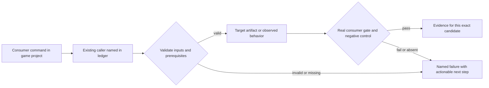
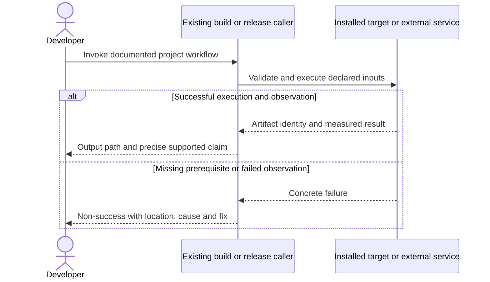

# PRD-060 — One verified public cohort can be safely promoted and shipped

**Status:** PROPOSED — historical credential blockers must be checked at execution; no publication authorized by this plan. Revised 2026-09-08; planning only.
**Complexity:** 10 → HIGH (+3 files, +2 release module/state, +2 promotion/recovery concurrency, +2 multi-package, +1 registry/signing APIs).
**Problem:** Green source and individual artifacts do not prove that the public default install resolves one coherent, playable and distributable non-iOS release.

Batch contract and dependency order: [production-readiness](README.md). Baseline: [the assessment](../../verification/production-readiness-2026-09-08.md), source `912a567e3e7592e6b437e49fe6318a3987d1f7c1`. iOS is outside this batch; no iOS readiness credit is created or removed.

## Integration ledger

| # | New or revised thing | Live caller at planning time | Replaces | Old path removed? | Negative control |
| --- | --- | --- | --- | --- | --- |
| 1 | Staged cohort and candidate-only admission | scripts/release.ts:118 main; .github/workflows/npm-release.yml:89 native release gate | native-promoted-before-npm/public-consumer cycle | Single release path remains; only scoped candidate lane accepts matching prerelease | Wrong-SHA runtime or default promotion before consumer proof is rejected |
| 2 | Public registry-only matrix | .github/workflows/native-release.yml:376 clean-consumer; scripts/verify-registry-install.ts: verifyRegistryInstall | local-tarball consumer used as public proof | Tarball mechanics retained as separate narrower evidence | Inject file/link/workspace protocol or wrong candidate pin; gate fails |
| 3 | Promotion/recovery evidence | .github/workflows/native-release.yml:666 promotion and :681 cleanup; scripts/release.ts | GitHub-only cleanup with untracked npm defaults | One reconciled promotion/revocation flow delegates from both entry points | Interrupt after one dist-tag update; recovery restores prior default state |
| 4 | Store and external-person result | scripts/release.ts final success message gated in phase 4; docs/product/STRANGER-TEST-PROTOCOL.md | build success interpreted as store/player readiness | Success wording derives from actual completed gates | Absent upload receipt or external-player record prevents that claim |

## Current behavior and ownership

Existing npm-release requires a promoted native release before publishing npm, while native-release promotes after local-tarball consumer checks. The report found runtime HTTP404 and old public package contents. Earlier PRD-060 mixed packaging, publisher implementation and broad all-platform claims; packaging now has explicit delegated owners.

Release orchestration only. [PRD-196](../BLOCKED/requires-release-credentials/PRD-196-published-install-is-functional.md) owns package/MCP contents; [PRD-078](../done/PRD-078-toolchain-free-consumer-proof.md)/[PRD-262](PRD-262-the-runtime-native-prebuilt-release-exists.md) hosted/prebuilt delivery; [PRD-221](PRD-221-android-v8-is-16kb-clean.md)/[PRD-212](PRD-212-published-install-builds-android.md) Android compatibility/artifacts; [PRD-217](PRD-217-webview-ui-layer.md)/[PRD-365](PRD-365-consumer-desktop-distribution.md) desktop UI/artifacts; [PRD-153](../done/PRD-153-game-branding-from-launch-to-play.md) brand; [PRD-374](PRD-374-doctor-predicts-the-requested-build-prerequisite.md) diagnosis; [PRD-366](PRD-366-one-consumer-game-proves-supported-platforms.md) actual game qualification. Existing PRD-059 provenance/SBOM, PRD-054 conformance and PRD-080 stranger protocol remain dependencies for their applicable non-iOS evidence. Do not duplicate their implementations or mark their iOS criteria complete.

## Approach and boundaries

Extend the existing release.ts and workflows, not a second publisher. Prepare immutable exact-version npm packages under a non-default candidate dist-tag and publicly downloadable version-matched runtime candidate assets. The candidate lane may explicitly accept that matching native prerelease; normal/default publication must retain strict gating. This breaks the current ordering cycle without using --allow-missing-prebuilt. Promote defaults only after public registry consumers and matching runtime/brand/physical/store evidence. Serialize promotion, snapshot prior tags and reconcile partial failures. Record package/runtime/source identity, dependency provenance/license/SBOM and signatures without secrets. External signing/upload/contact needs existing authorization or a final concrete request after preparation.

Data/migration: no application database migration. New build metadata and evidence extend the existing package/config/artifact contracts; no parallel scene, project or release framework.





## Execution phases

### Phase 1 — The prepared release has one exact candidate and no publication-order cycle

**Progress:**

- [ ] Callers wired and building: `scripts/release.ts`, `.github/workflows/npm-release.yml`, `.github/workflows/native-release.yml` (+1 more)
- [ ] Required test green: `scripts/__tests__/release.spec.ts`
- [ ] Observed red recorded, then restored green
- [ ] User verification performed on the named platform
- [ ] Evidence record written: `docs/verification/prd-060-readiness-phase-1-<date>.md`
- [ ] Independent reviewer returned PASS

**Files (maximum five):**

- EDIT `scripts/release.ts` — candidate staging and source/cohort identity validation.
- EDIT `.github/workflows/npm-release.yml` — candidate-only prerelease admission.
- EDIT `.github/workflows/native-release.yml` — expose candidate runtime assets before public consumers.
- EDIT `scripts/__tests__/release.spec.ts` — candidate/default ordering controls.
- NEW `docs/verification/prd-060-readiness-phase-1-<date>.md` — commands, identities, red/green and reviewer decision.

**Implementation and wiring:** Prepare a new immutable version cohort after package fixes. Build runtime assets with matching version/source and keep them candidate-labelled. Publish candidate npm versions only under a non-default tag once authorized. Every source change invalidates candidate proof and triggers rebuild/requalification. Require existing CI plus native evidence for the same SHA. Candidate path may accept its matching downloadable prerelease; normal release cannot skip binary existence/checksum or invoke --allow-missing-prebuilt. Validate provenance/SBOM from PRD-059; never invent missing records.

**Required test:** `scripts/__tests__/release.spec.ts`: should refuse default promotion when only packed-consumer evidence exists; should reject a candidate runtime manifest from a different SHA/version.

**Observed-red / revert control:** Supply an older green CI run, mismatch runtime/npm versions and request default promotion before registry verification separately; each fails before mutable defaults change.

**Verification commands** (from repository root unless noted; proposed flags are explicitly identified):

```sh
pnpm exec vitest run scripts/__tests__/release.spec.ts scripts/__tests__/check-publish-state.spec.ts
pnpm release
pnpm publish:check
```

**User verification:** Review the exact version list, runtime keys/hashes, source SHA, release jobs and planned registry/tag mutations. This dry-run output is the concrete approval subject when external publication is not already authorized.

### Phase 2 — A public consumer receives exactly the candidate and plays every target

**Progress:**

- [ ] Callers wired and building: `scripts/verify-registry-install.ts`, `scripts/__tests__/verify-registry-install.spec.ts`, `.github/workflows/native-release.yml`
- [ ] Required test green: `scripts/__tests__/verify-registry-install.spec.ts`
- [ ] Observed red recorded, then restored green
- [ ] User verification performed on the named platform
- [ ] Evidence record written: `docs/verification/prd-060-readiness-phase-2-<date>.md`
- [ ] Independent reviewer returned PASS

**Files (maximum five):**

- EDIT `scripts/verify-registry-install.ts` — candidate exact-pin and all-template/manager/target options.
- EDIT `scripts/__tests__/verify-registry-install.spec.ts` — public-only identity and coverage rejection.
- EDIT `.github/workflows/native-release.yml` — checkout-free consumer jobs and promotion dependency.
- NEW `docs/verification/prd-060-readiness-phase-2-<date>.md` — commands, identities, red/green and reviewer decision.

**Implementation and wiring:** Extend existing harness to select exact candidate versions and enumerate current shipped templates/managers/platform rows. A separate job may supply the bundled verifier as a CI artifact; the consumer environment has no engine checkout, no tarball package substitutions and no source/manifest overrides. Verify resolved package URLs/integrities, runtime public URLs and source identity. Mask native compilers on consumer builds, while allowing Android SDK/JDK and platform signing tools. Consume PRD-366 scenario results and PRD-153 brand captures for final containers from PRD-212/365. Baseline package installation/build checks cover every advertised template; deep gameplay uses the named production subjects in PRD-366.

**Required test:** `scripts/__tests__/verify-registry-install.spec.ts`: should reject a public candidate consumer with local protocol dependencies, stale template pins or a missing target result; should reject an empty template census.

**Observed-red / revert control:** Inject local tarball/source override, stale core version and absent Windows/macOS/Android result separately. Each blocks promotion rather than silently narrowing the matrix.

**Verification commands** (from repository root unless noted; proposed flags are explicitly identified):

```sh
pnpm exec vitest run scripts/__tests__/verify-registry-install.spec.ts
# Current invocation; candidate/matrix options are to be implemented in this phase:
pnpm tsx scripts/verify-registry-install.ts
```

**User verification:** From outside the engine repository, install candidate packages, discover MCPs, customize game files, build and play final outputs. Archive full expanded candidate/matrix invocation, per-template outcomes and exact artifact links.

### Phase 3 — Store validation and external users support the final readiness claim

**Progress:**

- [ ] Callers wired and building: `scripts/release.ts`, `scripts/__tests__/release.spec.ts`, `docs/strategy/PRODUCTION-READINESS.md` (+1 more)
- [ ] Required test green: `scripts/__tests__/release.spec.ts`
- [ ] Observed red recorded, then restored green
- [ ] User verification performed on the named platform
- [ ] Evidence record written: `docs/verification/prd-060-readiness-phase-3-<date>.md`
- [ ] Independent reviewer returned PASS

**Files (maximum five):**

- EDIT `scripts/release.ts` — candidate-readiness verdict derives from verified evidence and is consumed by phase 4 promotion.
- EDIT `scripts/__tests__/release.spec.ts` — missing credentialed/human evidence prevents corresponding claim.
- EDIT `docs/strategy/PRODUCTION-READINESS.md` — publish precise current non-iOS support/evidence.
- EDIT `docs/product/STRANGER-TEST-PROTOCOL.md` — include consumer developer task without duplicating player protocol.
- NEW `docs/verification/prd-060-readiness-phase-3-<date>.md` — commands, identities, red/green and reviewer decision.

**Implementation and wiring:** Prepare signed Android AAB, Windows distribution and notarized macOS app with matching hashes; validate licenses/provenance, native symbols, Linux identity-bound archive attestation and install/update behavior. With authorized credentials, upload Android to a Play internal-testing/release-validation route and record platform acceptance or exact rejection; never equate bundletool success with server acceptance. This phase uses the publicly available candidate artifacts; it does not require default promotion first. Confirm Windows/macOS signature/trust on clean user hosts and document tested direct/store-depot handoff without claiming every store. Have an external developer follow install → MCP → branding → build with no engine help, and an external player play for at least five minutes through PRD-080 protocol. Obtain consent/authorization before contact or recording. Failures return to the responsible owner PRD; candidate publication may exist while production-readiness remains PENDING; default promotion is forbidden until this phase passes.

**Required test:** `scripts/__tests__/release.spec.ts`: should withhold store-ready/public-user-ready verdict when the matching upload acceptance or external-user record is absent.

**Observed-red / revert control:** Substitute an unrelated APK hash/upload receipt, omit a human record and supply package-build success instead. The final claim gate rejects each substitution.

**Verification commands** (from repository root unless noted; proposed flags are explicitly identified):

```sh
pnpm exec vitest run scripts/__tests__/release.spec.ts
pnpm publish:check
pnpm check:docs
```

**User verification:** Before phase 4 can promote defaults, review platform upload result, signed artifact trust, developer transcript and five-minute player record. Any missing credential/person is a pending external checkpoint, not an asserted production pass.

### Phase 4 — Promotion, rollback and revocation preserve trustworthy defaults

**Progress:**

- [ ] Callers wired and building: `scripts/release.ts`, `scripts/__tests__/release.spec.ts`, `.github/workflows/native-release.yml` (+1 more)
- [ ] Required test green: `scripts/__tests__/release.spec.ts`
- [ ] Observed red recorded, then restored green
- [ ] User verification performed on the named platform
- [ ] Evidence record written: `docs/verification/prd-060-readiness-phase-4-<date>.md`
- [ ] Independent reviewer returned PASS

**Files (maximum five):**

- EDIT `scripts/release.ts` — serialize/snapshot/reconcile promotion and recovery.
- EDIT `scripts/__tests__/release.spec.ts` — partial update and retry idempotence.
- EDIT `.github/workflows/native-release.yml` — delegate promotion/cleanup to guarded orchestrator.
- EDIT `.github/workflows/npm-release.yml` — serialize with same release identity.
- NEW `docs/verification/prd-060-readiness-phase-4-<date>.md` — commands, identities, red/green and reviewer decision.

**Implementation and wiring:** After phase 3 credentialed artifact/external-user evidence passes, capture prior npm dist-tags and runtime promotion state, update defaults only after exact candidate verification, then run the default-install gate again. Simulate interruption after each mutation in an isolated release test namespace and recover deterministically. Preserve immutable packages and assets needed by pinned consumers; do not delete promoted runtime artifacts as rollback. Failed unpublished candidates may be cleaned under scoped authorization. Test N-1 exact pins, upgrade and downgrade where a prior usable cohort exists. On a first usable native release, explicitly prove no usable native N-1 exists, retain web N-1 proof and test failed-candidate/default restoration; never fabricate native downgrade PASS.

**Promoted revocation and Linux attestation retained:** rehearse withdrawing a previously promoted bad candidate from defaults, not only aborting an unfinished promotion. Snapshot and restore a known-good cohort; deprecate the affected npm versions with an actionable replacement notice when authorized, keep immutable packages/runtime assets usable for explicit pins, and record a candidate-bound revocation/deprecation audit. Repeated revocation must be idempotent. For Linux require an identity-bound release attestation over the exact distributed archive and source/cohort, verified against the expected workflow/publisher identity through the existing PRD-059 provenance chain; an unsigned checksum file is insufficient. Delete or tamper a signature/attestation in a disposable copy and require rejection. Perform these rehearsals in an isolated release namespace before mutating production defaults.

**Required test:** `scripts/__tests__/release.spec.ts`: should restore prior dist-tags when promotion fails after a partial update; should retain immutable artifacts required by pinned consumers during recovery; should revoke a promoted candidate with deprecation and restored defaults; should reject a Linux attestation with the wrong publisher identity or artifact hash.

**Observed-red / revert control:** Interrupt after the first tag mutation, retry cleanup twice and simulate concurrent release attempts. Require one serialized transition and prior/default state reconciliation; stale candidate proof cannot resume promotion. Also revoke a promoted rehearsal candidate twice, verify the deprecation notice/default tag state and reject an attestation from a different publisher.

**Verification commands** (from repository root unless noted; proposed flags are explicitly identified):

```sh
pnpm exec vitest run scripts/__tests__/release.spec.ts
pnpm release
```

**User verification:** Inspect a rehearsal showing old defaults before failure and restored afterward, exact version pins still downloadable, and the public default-install verification executed after successful promotion.

## Verification contract

Each phase edits its named pre-existing caller and includes the phase evidence record within the five-file budget. File lists are bounded implementation assignments, not permission for adjacent cleanup. If investigation needs more files, split the phase before implementing; do not silently widen it. Query `engine_search_capabilities` and inspect every hit before any qualifying package/helper work, as the repository requires.

Run the phase command, its observed-red control, restore the implementation and rerun green. Record exact candidate SHA, package versions/integrities, source and artifact hashes, platform/adapter/session, command, exit code, assertion count and artifact paths. A missing observation, skipped test, stale artifact or zero-assertion run is not PASS. Fixtures/local tarballs may prove mechanics; public-consumer acceptance requires registry packages and public runtime downloads with no engine checkout, source override or injected manifest.

For executable changes run `pnpm typecheck && pnpm lint && pnpm test`, `pnpm budgets`, and the affected real playtest/platform lane. Generate mirrors with `pnpm sync:agents` if AGENTS changes. Use platform-specific hosted runs for Windows/macOS, emulators for Android behavior, and physical Android only for claims that require hardware. Name unexecuted targets. A runtime change needs a real playtest scenario in the same implementation, not only the focused tests named below.

After every phase, an independent reviewer receives this PRD, diff, commands and artifacts and returns PASS / NEEDS CORRECTION / BLOCKED. It checks caller integration, negative controls, removed/delegating incumbent paths and the actual consumer outcome. No phase starts on a self-awarded PASS. Visual phases also require human inspection of captures; credentialed signing/submission and external-person checkpoints remain PENDING until executed. Do all authorized preparation before requesting any missing external authorization. This planning request does not authorize publishing packages, uploading to stores or contacting external people.

## Verification evidence

No implementation gate was run by this planning revision. Every new phase is **NOT RUN**. Write each phase to `docs/verification/prd-<id>-readiness-phase-<n>-<date>.md` (the evidence file listed in each phase); use the existing runtime performance ledger for new performance measurements. Fill actual results and non-test `file:line` callers at implementation time; a phase cannot close with placeholders. Acceptance boxes below remain unchecked until all phase checkpoints pass.

## Acceptance criteria

- [ ] One exact source/version cohort resolves publicly with every advertised template installing/building and all required non-iOS deep consumer rows passing.
- [ ] Candidate staging cannot leak to defaults early; promotion is serialized, wrong/stale evidence fails and partial failures reconcile prior defaults while preserving pins; promoted-version revocation/deprecation and identity-bound Linux attestation are rehearsed and verified.
- [ ] Non-iOS provenance/license/SBOM, real target gameplay, custom branding, signed containers and Android 16 KB/current SDK proof refer to the same artifacts.
- [ ] Android upload validation and clean-player desktop distribution execute; external developer/player records establish the no-engine-source workflow.
- [ ] Final report lists actual supported OS/architecture/session/game envelope and unresolved limits; iOS and arbitrary-game guarantees remain out of scope.

## Prior work retained

Moved from `docs/PRDs/BLOCKED/requires-release-credentials/PRD-060-promoted-consumer-distribution.md` under the owner's 2026-09-08 instruction. This revision replaces the execution scope, not historical test results. [Original plan at the assessed commit](https://github.com/ThreeNativeHQ/threenative/blob/912a567e3e7592e6b437e49fe6318a3987d1f7c1/docs/PRDs/BLOCKED/requires-release-credentials/PRD-060-promoted-consumer-distribution.md) remains the immutable history. Original broad packaging phases are delegated to PRD-212/365, public install to PRD-196, runtime delivery to PRD-262, physical execution to PRD-366 and branding to PRD-153. Provenance, N-1/recovery and same-candidate requirements remain here; none is silently dropped. Old credential/E404 statements must be freshly checked, not copied as current blockers.
