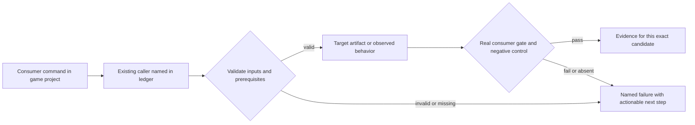
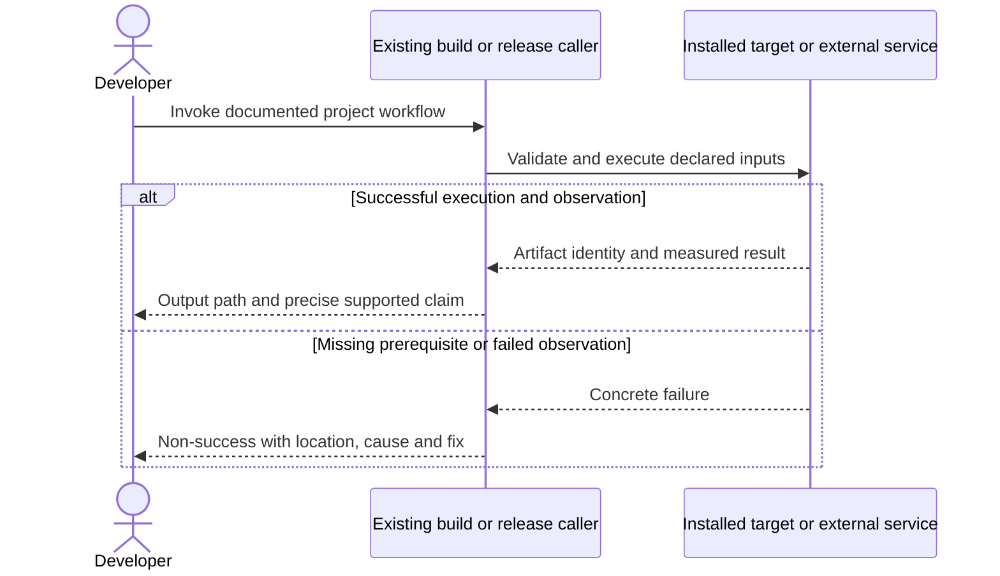

# PRD-078 — Hosted runtime release jobs prove the exact candidate

**Status:** PARTIAL — prior Vulkan/version fixes retained; current hosted candidate proof open. Revised 2026-09-08; planning only.
**Complexity:** 6 → MEDIUM (+2 files, +2 multi-platform integration, +1 external CI API, +1 artifact contract).
**Problem:** Historical hosted release failures must be retried on the current candidate instead of being treated as permanent blockers.

Batch contract and dependency order: [production-readiness](README.md). Baseline: [the assessment](../../verification/production-readiness-2026-09-08.md), source `912a567e3e7592e6b437e49fe6318a3987d1f7c1`. iOS is outside this batch; no iOS readiness credit is created or removed.

## Integration ledger

| # | New or revised thing | Live caller at planning time | Replaces | Old path removed? | Negative control |
| --- | --- | --- | --- | --- | --- |
| 1 | Exact-candidate hosted proof | .github/workflows/native-release.yml: gates/build jobs | historical failure assumptions | Prior gate scripts remain callers; stale diagnosis is replaced by run evidence | Supply a green run from another SHA; candidate validation fails |
| 2 | Release-job failure diagnostics | .github/workflows/native-release.yml: build matrix; native-platforms.yml job invocations | unexplained skipped/deleted release | No second build lane | Suppress a required frame/physics marker; native gate fails |

## Current behavior and ownership

Prior phase evidence proves the Vulkan ICD and runtime-version-stamp fixes. Its later Linux physics, Windows dependency and simulator failures were recorded in August. September CI is green on a different commit; none of that proves the current candidate native-release run.

CI/native-host layer. Owns only actual hosted build/gate defects and their exact-candidate proof. [PRD-262](PRD-262-the-runtime-native-prebuilt-release-exists.md) owns generated runtime artifacts and installation; [PRD-060](PRD-060-promoted-consumer-distribution.md) owns npm/consumer promotion. No separate publisher or second clean-consumer gate is introduced.

## Approach and boundaries

Reuse existing native-release and native-platform workflows and their platform gate scripts. Re-run the named failed job once before diagnosing. Fix only reproduced job failures and keep checksums, native frames and nonblank/behavior assertions. Never substitute green unrelated CI for the release job. Preserve iOS existing gates as a separate scope rather than deleting them to make a non-iOS claim green.

Data/migration: no application database migration. New build metadata and evidence extend the existing package/config/artifact contracts; no parallel scene, project or release framework.





## Execution phases

### Phase 1 — The actual release job distinguishes old evidence from a runnable candidate

**Files (maximum five):**

- EDIT `.github/workflows/native-release.yml` — validate same-SHA prerequisite runs and preserve job output.
- EDIT `packages/runtime-native/tests/native-platform-workflow.test.mjs` — test wrong-SHA and missing-job refusal.
- NEW `docs/verification/prd-078-readiness-phase-1-<date>.md` — commands, identities, red/green and reviewer decision.

**Implementation and wiring:** Inspect latest job logs for the intended source SHA and re-execute historical failed subjects before changing them. Extend only the existing prerequisite/job validation that needs repair. Record each required job result individually; cancelled/skipped is not successful. Hand the run identity to PRD-262 without creating/publishing a release in this phase. Preserve the existing packed Android physics suite and its four controls: wrong-height, collision-mask, mask-with-control-enabled, and wrong-gravity. Their `native-smoke/src/physics.ts` subject remains deliberately separate from the default-starter UI subject; each control must produce its expected specific TN_PLAYTEST_*_ASSERTION_FAILED and exit 1 in the hosted emulator lane. Record all four expanded scenario invocations from native-release.yml and the positive physics control. A generic missing-result test cannot discharge these obligations.

**Required test:** `packages/runtime-native/tests/native-platform-workflow.test.mjs`: should reject release prerequisites when the successful run belongs to a different source SHA.

**Observed-red / revert control:** Substitute the observed successful older CI SHA and remove one required job result; validate refusal before restoring exact-candidate results.

**Verification commands** (from repository root unless noted; proposed flags are explicitly identified):

```sh
gh run list --repo ThreeNativeHQ/threenative --workflow native-release.yml --limit 10
pnpm --filter @threenative/runtime-native exec vitest run --config vitest.config.ts tests/native-platform-workflow.test.mjs
```

**User verification:** Inspect the candidate workflow page: every claimed non-iOS build row links to its actual frame/physics/artifact output. Any reproduced failure becomes an additional bounded phase here, with the exact existing gate file named before editing.

## Verification contract

Each phase edits its named pre-existing caller and includes the phase evidence record within the five-file budget. File lists are bounded implementation assignments, not permission for adjacent cleanup. If investigation needs more files, split the phase before implementing; do not silently widen it. Query `engine_search_capabilities` and inspect every hit before any qualifying package/helper work, as the repository requires.

Run the phase command, its observed-red control, restore the implementation and rerun green. Record exact candidate SHA, package versions/integrities, source and artifact hashes, platform/adapter/session, command, exit code, assertion count and artifact paths. A missing observation, skipped test, stale artifact or zero-assertion run is not PASS. Fixtures/local tarballs may prove mechanics; public-consumer acceptance requires registry packages and public runtime downloads with no engine checkout, source override or injected manifest.

For executable changes run `pnpm typecheck && pnpm lint && pnpm test`, `pnpm budgets`, and the affected real playtest/platform lane. Generate mirrors with `pnpm sync:agents` if AGENTS changes. Use platform-specific hosted runs for Windows/macOS, emulators for Android behavior, and physical Android only for claims that require hardware. Name unexecuted targets. A runtime change needs a real playtest scenario in the same implementation, not only the focused tests named below.

After every phase, an independent reviewer receives this PRD, diff, commands and artifacts and returns PASS / NEEDS CORRECTION / BLOCKED. It checks caller integration, negative controls, removed/delegating incumbent paths and the actual consumer outcome. No phase starts on a self-awarded PASS. Visual phases also require human inspection of captures; credentialed signing/submission and external-person checkpoints remain PENDING until executed. Do all authorized preparation before requesting any missing external authorization. This planning request does not authorize publishing packages, uploading to stores or contacting external people.

## Verification evidence

No implementation gate was run by this planning revision. Every new phase is **NOT RUN**. Write each phase to `docs/verification/prd-<id>-readiness-phase-<n>-<date>.md` (the evidence file listed in each phase); use the existing runtime performance ledger for new performance measurements. Fill actual results and non-test `file:line` callers at implementation time; a phase cannot close with placeholders. Acceptance boxes below remain unchecked until all phase checkpoints pass.

## Acceptance criteria

- [ ] Prior successful fixes remain intact and are not rewritten merely because old blocked prose exists.
- [ ] The selected candidate has current hosted native build/gate evidence; each failed, skipped or unavailable row is named.
- [ ] Wrong-SHA/absent-result controls fail in the existing release entry point.
- [ ] All four packed Android physics negative controls and their positive control execute on the selected candidate. Any new job repair is bounded, reviewed and hands its result to PRD-262; this PRD does not itself establish public installation.

## Prior work retained

Moved from `docs/PRDs/BLOCKED/requires-hosted-run/PRD-078-toolchain-free-consumer-proof.md` under the owner's 2026-09-08 instruction. This revision replaces the execution scope, not historical test results. [Original plan at the assessed commit](https://github.com/ThreeNativeHQ/threenative/blob/912a567e3e7592e6b437e49fe6318a3987d1f7c1/docs/PRDs/BLOCKED/requires-hosted-run/PRD-078-toolchain-free-consumer-proof.md) remains the immutable history. August run 31965691750 and the original observed version/Vulkan repairs remain historical evidence. Do not restore their old defects to production for a control; use an isolated test/candidate.

Historical evidence: [consumer-handoff-2026-08-12.md](../../verification/consumer-handoff-2026-08-12.md).
