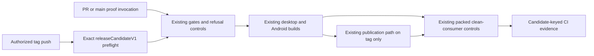
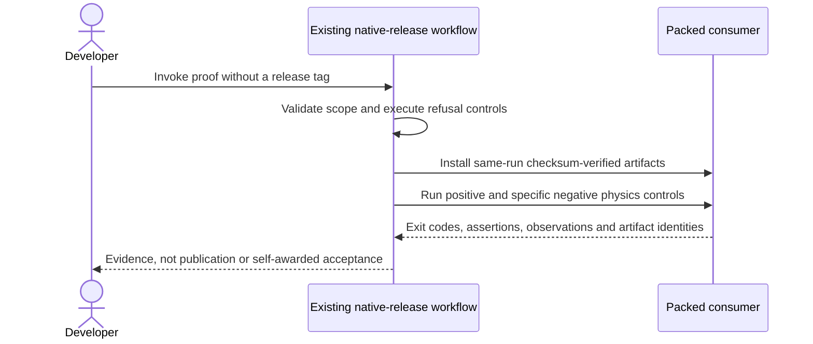

# PRD-078 — Hosted runtime release jobs prove the exact candidate

**Status:** PARTIAL — the non-publishing hosted proof executes end to end on candidate `55b221a3b1e5418dfff022dbcdb2a5048fd0c984` ([run 34593258952](https://github.com/ThreeNativeHQ/threenative/actions/runs/34593258952)), with all six packed Android controls verified. Main-route prerequisite validation and independent acceptance review remain open, and public installation stays blocked on PRD-262 publishing the build tool helper. Revised 2026-09-11.
**Complexity:** 6 → MEDIUM (+2 files, +2 multi-platform integration, +1 external CI API, +1 artifact contract).
**Problem:** Historical hosted release failures must be retried on the current candidate instead of being treated as permanent blockers.

Batch contract and dependency order: [production-readiness](README.md). Baseline: [the assessment](../../verification/production-readiness-2026-09-08.md), source `912a567e3e7592e6b437e49fe6318a3987d1f7c1`. iOS is outside this batch; no iOS readiness credit is created or removed.

## Integration ledger

| # | New or revised thing | Live caller | Replaces | Old path removed? | Negative control |
| --- | --- | --- | --- | --- | --- |
| 1 | Exact-candidate hosted proof | .github/workflows/native-release.yml: gates/build jobs | historical failure assumptions | Existing build and verification scripts remain the only callers | Supply a green run from another SHA or omit a required job; gate refuses |
| 2 | Release-job failure diagnostics | .github/workflows/native-release.yml: build matrix and clean-consumer | unexplained skipped/deleted release | No second build or clean-consumer implementation | Suppress a required frame/physics marker; native gate fails |
| 3 | Non-publishing proof invocation | .github/workflows/native-release.yml: PR, main push and manual triggers | tag/publication prerequisite for testing | Tag publication keeps its exact releaseCandidateV1 preflight; proof reuses the same jobs | PR and manual events cannot enter validate-tag, publish, finalize or release deletion |

## Current behavior and ownership

Prior phase evidence proves the Vulkan ICD and runtime-version-stamp fixes. Its later Linux physics, Windows dependency and simulator failures were recorded in August. Green CI on a different commit is not current-candidate native-release evidence.

CI/native-host layer. Owns only actual hosted build/gate defects and their exact-candidate proof. [PRD-262](PRD-262-the-runtime-native-prebuilt-release-exists.md) owns generated runtime artifacts and installation; [PRD-060](PRD-060-promoted-consumer-distribution.md) owns npm/consumer promotion. No separate publisher or second clean-consumer gate is introduced.

## Approach and boundaries

Reuse existing native-release and native-platform workflows and their platform gate scripts. Re-run named failed subjects before diagnosing. Fix only reproduced job failures and keep checksums, native frames and nonblank/behavior assertions. Never substitute green unrelated CI for the release job. Preserve existing iOS gates as a separate scope rather than deleting them to make a non-iOS claim green.

The existing release entry point now has a proof-only route. Pull requests run its native builds and packed controls at the actual checkout merge SHA and separately record the PR head SHA. PR evidence is explicitly **not main release acceptance**. A relevant push to main, or a manual invocation on main, first requires the completed exact-SHA main CI run and all eleven named prerequisite jobs. Missing, skipped, cancelled, failed and malformed evidence remains refusal, not success.

Proof consumers download runtime artifacts from their own workflow run. The existing checksum-verifying installer reads a loopback manifest through its existing test override; no new installer or public download claim is created. Only a tag push can publish, promote or remove a GitHub release. A manual invocation on a tag cannot publish. PRD-262 receives the accepted main proof's SHA, run/attempt and artifact identities; PRD-060 still owns public-consumer acceptance.

Data/migration: no application database migration. Evidence extends existing package/config/artifact contracts; no parallel scene, project or release framework.





## Execution phases

The nine bounded assignments below are reviewed separately. None is accepted merely because implementation or fixture tests are green. Phases 1 and 2 are the planned work; Phases 3 to 9 each repair one failure the hosted proof reproduced, split out rather than widening an existing assignment. Phases 3-9 record their evidence in Phase 2's record rather than opening three more tracked files, which the evidence budget discourages; each names that record among its own files. The source work from PR #168 is retained, not rewritten to recreate August defects.

### Phase 1 — The actual release job distinguishes old evidence from a runnable candidate

**Progress:**

- [x] Callers wired and building: `.github/workflows/native-release.yml`, `packages/runtime-native/tests/native-platform-workflow.test.mjs`, `scripts/__tests__/ci-structure.spec.ts` — hosted run [34593258952](https://github.com/ThreeNativeHQ/threenative/actions/runs/34593258952) on candidate `55b221a3b1e5418dfff022dbcdb2a5048fd0c984`, landed in #180 (`a3baa7efe`).
- [x] Required test green: `packages/runtime-native/tests/native-platform-workflow.test.mjs` — `tests/native-platform-workflow.test.mjs` green 2026-09-11 (53/53 across the three runtime-native files).
- [x] Observed red recorded, then restored green - local revert control on the workflow spec, recorded in [`prd-078-readiness-phase-1-2026-09-09.md`](../../verification/prd-078-readiness-phase-1-2026-09-09.md) lines 99-111: RED `tests 10; pass 2; fail 8; exit 1` -> GREEN `pass 10; exit 0` -> REVERT RED (same 8 failures) -> RESTORED GREEN, 227 assertions.
- [ ] User verification performed on the named platform
- [x] Evidence record written: `docs/verification/prd-078-readiness-phase-1-2026-09-09.md` — `docs/verification/prd-078-readiness-phase-1-2026-09-09.md`.
- [ ] Independent reviewer returned PASS

**Files (maximum five):**

- EDIT `.github/workflows/native-release.yml` — validate same-SHA prerequisite runs and preserve job output.
- EDIT `packages/runtime-native/tests/native-platform-workflow.test.mjs` — test wrong-SHA, missing-job and Android shell refusal.
- EDIT `scripts/__tests__/ci-structure.spec.ts` — guard the existing workflow rather than require duplicate execution.
- EDIT `docs/verification/native-coverage-2026-08-28.md` — retain the companion digest from the same PR #168 test snapshot; no new native coverage percentage is claimed.
- NEW `docs/verification/prd-078-readiness-phase-1-2026-09-09.md` — retained source-level red/green record.

**Implementation and wiring:** Extend only the existing prerequisite/job validation that needs repair. Record each required job result individually; cancelled/skipped is not successful. Hand the run identity to PRD-262 without creating/publishing a release in this phase. Preserve all four packed Android physics negatives: wrong-height, collision-mask, mask-with-control-enabled, and wrong-gravity. Their `native-smoke/src/physics.ts` subject remains deliberately separate from the default-starter UI subject. Each negative must produce its specific TN_PLAYTEST assertion diagnostic and exit 1 in the hosted emulator lane; the normal and masked positive controls must exit 0.

**Required test:** `packages/runtime-native/tests/native-platform-workflow.test.mjs`: reject release prerequisites when the successful run belongs to a different source SHA.

**Observed-red / revert control:** Substitute successful older CI evidence and remove one required job result; validate refusal before restoring exact-candidate results. Do not restore historical production defects.

### Phase 2 — Execute the existing proof without publishing a release

**Progress:**

- [x] Callers wired and building: `.github/workflows/native-release.yml`, `scripts/__tests__/native-release-proof.spec.ts`, `docs/PRDs/production-readiness/PRD-078-toolchain-free-consumer-proof.md` — hosted run [34593258952](https://github.com/ThreeNativeHQ/threenative/actions/runs/34593258952) on candidate `55b221a3b1e5418dfff022dbcdb2a5048fd0c984`, landed in #180 (`a3baa7efe`).
- [x] Required test green — `scripts/__tests__/native-release-proof.spec.ts` 35/35 green 2026-09-11; the phase itself is the hosted execution, not a unit gate.
- [x] Observed red recorded, then restored green - three controls in [the phase-2 record](../../verification/prd-078-readiness-phase-2-2026-09-10.md): the prerequisite-wait red (lines 59-77), the KVM/35-minute cap red `2 failed` -> `28 passed` (lines 191-210), and the concurrency red (lines 235-250).
- [ ] User verification performed on the named platform
- [x] Evidence record written: `docs/verification/prd-078-readiness-phase-2-2026-09-10.md` — `docs/verification/prd-078-readiness-phase-2-2026-09-10.md`.
- [ ] Independent reviewer returned PASS

**Files (maximum five):**

- EDIT `.github/workflows/native-release.yml` — proof routing, hosted refusal execution, same-run artifact transport and control evidence.
- NEW `scripts/__tests__/native-release-proof.spec.ts` — execute the actual gate and evidence collector; verify event/dependency boundaries.
- EDIT `docs/PRDs/production-readiness/PRD-078-toolchain-free-consumer-proof.md` — make invocation and phase boundaries explicit.
- NEW `docs/verification/prd-078-readiness-phase-2-2026-09-10.md` — commands, candidate/run identities, outcomes and review state.
- GENERATE `docs/benchmark/SCREENSHOT-RETENTION.md` — regenerate the evidence index, never hand-edit it.

**Implementation and wiring:** Add proof triggers to the existing workflow, not another build or consumer implementation. Run wrong-SHA/missing-job controls through the inline gate shell inside the hosted gates job. Fixtures prove refusal mechanics and are labeled as such; real native frames come only from the existing native jobs. Main proof still demands all eleven exact-candidate CI prerequisites. Preserve failed native diagnostics and collect all six packed Android outcomes with actual exits, nonzero observed assertion counts, scenario identities, APK hashes and packed-package SHA-512 integrities. Empty/missing/wrong-scenario reports fail. Retain generated maintenance diagnostics for reproducibility without changing the sources under test.

**Observed-red / revert control:** Restore the original tag-only workflow: proof-routing tests must fail. Remove an Android report, empty its assertions, change its expected failure marker, exit code or scenario: the real evidence collector must refuse and retain the failed row.

**Verification commands** (repository root):

```sh
pnpm exec vitest run scripts/__tests__/native-release-proof.spec.ts
pnpm --filter @threenative/runtime-native exec vitest run --config vitest.config.ts tests/native-platform-workflow.test.mjs
pnpm typecheck && pnpm lint && pnpm test
pnpm budgets
gh run list --repo ThreeNativeHQ/threenative --workflow native-release.yml --limit 10
# On main after its exact-SHA CI finishes, only when an automatic proof is not already running:
gh workflow run native-release.yml --repo ThreeNativeHQ/threenative --ref main
```

**User verification:** Inspect the selected workflow page and retained `release-prerequisites-<SHA>-<attempt>` and `clean-consumer-linux-x64` artifacts. Every claimed platform row must link to its actual frame/physics/artifact output. `proof-consumer-evidence.json` distinguishes same-run artifacts from public installation. Any reproduced platform repair becomes a named bounded correction, not adjacent cleanup.

### Phase 3 — The headless desktop gate reached a runner with no sound card

**Progress:**

- [x] Callers wired and building: `packages/runtime-native/scripts/verify-desktop-core.mjs`, `packages/runtime-native/tests/desktop-core-gate.test.mjs` — hosted run [34593258952](https://github.com/ThreeNativeHQ/threenative/actions/runs/34593258952) on candidate `55b221a3b1e5418dfff022dbcdb2a5048fd0c984`, landed in #180 (`a3baa7efe`).
- [x] Required test green: `packages/runtime-native/tests/desktop-core-gate.test.mjs` — `tests/desktop-core-gate.test.mjs` green 2026-09-11 (53/53).
- [x] Observed red recorded, then restored green - **hosted observed failure, not a local revert control** - run [34543393235](https://github.com/ThreeNativeHQ/threenative/actions/runs/34543393235) failed `ALSA: Couldn't open audio device`; the desktop rows are green on run [34593258952](https://github.com/ThreeNativeHQ/threenative/actions/runs/34593258952). Fix on `main`: `packages/runtime-native/scripts/verify-desktop-core.mjs:327` defaults `SDL_AUDIODRIVER` to `dummy` inside the Linux branch. [Record](../../verification/prd-078-readiness-phase-2-2026-09-10.md) lines 94-105.
- [ ] User verification performed on the named platform
- [x] Evidence record written: `docs/verification/prd-078-readiness-phase-2-2026-09-10.md` - the single record covers phases 2-9; this phase's section is cited on the observed-red line above.
- [ ] Independent reviewer returned PASS

Reproduced in run [34543393235](https://github.com/ThreeNativeHQ/threenative/actions/runs/34543393235), the first Linux execution of `native:verify:desktop` this proof route created.

**Files (maximum five):**

- EDIT `packages/runtime-native/scripts/verify-desktop-core.mjs` — default the Linux SDL audio driver where the video driver is already scoped.
- EDIT `packages/runtime-native/tests/desktop-core-gate.test.mjs` — bind both drivers to the one Linux branch and forbid an unconditional override.
- EDIT `docs/verification/prd-078-readiness-phase-2-2026-09-10.md` — this phase's evidence record.

**Implementation and wiring:** `native-platforms.yml`'s desktop-core matrix is macOS and Windows only, so no Linux run reached this line until the proof route executed it on `ubuntu-24.04`. The audio contract is not weakened: `verify-desktop-audio.mjs` owns it and runs first in the same command, and an explicit `SDL_AUDIODRIVER` still wins.

**Required test:** `packages/runtime-native/tests/desktop-core-gate.test.mjs`: desktop verifier preserves evidence and scopes its SDL drivers to Linux.

**Observed-red / revert control:** Force the driver for every platform, or move it out of the Linux branch; the test must fail.

### Phase 4 — The CLI contract test could not compile its own prerequisite

**Progress:**

- [x] Callers wired and building: `packages/runtime-native/tests/cli_network_fs_test.cpp`, `packages/runtime-native/CMakeLists.txt`, `packages/runtime-native/tests/webtransport-polyfill-prerequisites.test.mjs` — hosted run [34593258952](https://github.com/ThreeNativeHQ/threenative/actions/runs/34593258952) on candidate `55b221a3b1e5418dfff022dbcdb2a5048fd0c984`, landed in #180 (`a3baa7efe`).
- [x] Required test green: `packages/runtime-native/tests/webtransport-polyfill-prerequisites.test.mjs` — `tests/webtransport-polyfill-prerequisites.test.mjs` 6/6 green 2026-09-11 after restoring the guards deleted by `2035e1e25` (fix `585fe61f7`).
- [x] Observed red recorded, then restored green - local compile control - `cli_network_fs_test.cpp:1049:30: error: 'runtime_scripts' has not been declared` EXIT 1 against the CI compile line, then `no diagnostics` EXIT 0 under `-fsyntax-only`. [Record](../../verification/prd-078-readiness-phase-2-2026-09-10.md) lines 133-155.
- [ ] User verification performed on the named platform
- [x] Evidence record written: `docs/verification/prd-078-readiness-phase-2-2026-09-10.md` - the single record covers phases 2-9; this phase's section is cited on the observed-red line above.
- [ ] Independent reviewer returned PASS

Reproduced in run [34546754768](https://github.com/ThreeNativeHQ/threenative/actions/runs/34546754768), where all three desktop rows failed inside `native:verify:desktop`.

**Files (maximum five):**

- EDIT `packages/runtime-native/tests/cli_network_fs_test.cpp` — install Web Streams before `initBindings` through the qualified embedded script table.
- EDIT `packages/runtime-native/CMakeLists.txt` — give that target its generated include directory and script dependency.
- NEW `packages/runtime-native/tests/webtransport-polyfill-prerequisites.test.mjs` — hold the prerequisite under vitest.
- EDIT `docs/verification/prd-078-readiness-phase-2-2026-09-10.md` — this phase's evidence record.

**Implementation and wiring:** `webtransport::initBindings` reads `globalThis.__wtDispatch`, which the polyfill installs only when Web Streams exist, so a bare engine drove the binding outside its documented prerequisite. The test now fails on a missing embedded script and on a false return instead of continuing.

**Required test:** `packages/runtime-native/tests/webtransport-polyfill-prerequisites.test.mjs`, plus the compiled `threenative-cli-network-fs-test` contract target.

**Observed-red / revert control:** Compile the pre-repair source: `cli_network_fs_test.cpp:1049:30: error: 'runtime_scripts' has not been declared`.

### Phase 5 — Release staging asked for an SDL AAR that no longer existed

**Progress:**

- [x] Callers wired and building: `.github/workflows/native-release.yml`, `scripts/__tests__/native-release-android-staging.spec.ts` — hosted run [34593258952](https://github.com/ThreeNativeHQ/threenative/actions/runs/34593258952) on candidate `55b221a3b1e5418dfff022dbcdb2a5048fd0c984`, landed in #180 (`a3baa7efe`).
- [x] Required test green: `scripts/__tests__/native-release-android-staging.spec.ts` — `scripts/__tests__/native-release-android-staging.spec.ts` 1/1 green 2026-09-11.
- [x] Observed red recorded, then restored green - **hosted observed failure** - run [34540703352](https://github.com/ThreeNativeHQ/threenative/actions/runs/34540703352) failed `ENOENT ... SDL3-3.2.8.aar`, green on run [34551637777](https://github.com/ThreeNativeHQ/threenative/actions/runs/34551637777). Fix on `main`: `.github/workflows/native-release.yml:483,497` derive the file name from `SDL3_ANDROID_VERSION`. [Record](../../verification/prd-078-readiness-phase-2-2026-09-10.md) lines 111-132.
- [ ] User verification performed on the named platform
- [x] Evidence record written: `docs/verification/prd-078-readiness-phase-2-2026-09-10.md` - the single record covers phases 2-9; this phase's section is cited on the observed-red line above.
- [ ] Independent reviewer returned PASS

Reproduced on this branch's PR run
[34540703352](https://github.com/ThreeNativeHQ/threenative/actions/runs/34540703352), where `build-android` failed at the step named `Stage Android runtime payloads` before the run was cancelled by the next push. The only tag run in this repository's history (33387137127) died at `gates` with `build-android` skipped, so it never reached the step and is not the reproduction.

**Files (maximum five):**

- EDIT `.github/workflows/native-release.yml` — derive the staged AAR filename from the module that owns the version.
- NEW `scripts/__tests__/native-release-android-staging.spec.ts` — require the derivation, not a matching literal.
- EDIT `docs/verification/prd-078-readiness-phase-2-2026-09-10.md` — this phase's evidence record.

**Implementation and wiring:** `package-android.mjs` moved to SDL3 3.2.30 deliberately, because 3.2.8's 64-bit libraries are not 16 KB `LOAD`-aligned, while the workflow still spelled out `SDL3-3.2.8.aar`. Asserting the literal matches would only detect the next drift; requiring derivation removes the failure mode, and the test also binds `download-deps.mjs` to the same constant.

**Required test:** `scripts/__tests__/native-release-android-staging.spec.ts`: native release stages the SDL3 Android AAR version owned by the packager.

**Observed-red / revert control:** Restore a literal version in the staging step; the test must fail.

### Phase 6 — The native contract lane had no display

**Progress:**

- [x] Callers wired and building: `packages/runtime-native/package.json`, `packages/runtime-native/tests/desktop-core-gate.test.mjs` — hosted run [34593258952](https://github.com/ThreeNativeHQ/threenative/actions/runs/34593258952) on candidate `55b221a3b1e5418dfff022dbcdb2a5048fd0c984`, landed in #180 (`a3baa7efe`).
- [x] Required test green: `packages/runtime-native/tests/desktop-core-gate.test.mjs` — `tests/desktop-core-gate.test.mjs` green 2026-09-11 (53/53).
- [x] Observed red recorded, then restored green - local control - `env -u DISPLAY ...` gave `SDL_Init failed: x11 not available` EXIT 1, and the same command under `scripts/xvfb.sh` EXIT 0. Fix on `main`: `packages/runtime-native/package.json:74`. [Record](../../verification/prd-078-readiness-phase-2-2026-09-10.md) lines 307-340.
- [ ] User verification performed on the named platform
- [x] Evidence record written: `docs/verification/prd-078-readiness-phase-2-2026-09-10.md` - the single record covers phases 2-9; this phase's section is cited on the observed-red line above.
- [ ] Independent reviewer returned PASS

Reproduced on every Linux row of this proof route: runs
[34551637777](https://github.com/ThreeNativeHQ/threenative/actions/runs/34551637777),
[34553793360](https://github.com/ThreeNativeHQ/threenative/actions/runs/34553793360) and
[34555922045](https://github.com/ThreeNativeHQ/threenative/actions/runs/34555922045).

**Files (maximum five):**

- EDIT `packages/runtime-native/package.json` — wrap the contract lane in the Xvfb helper the rest of the chain already uses.
- EDIT `packages/runtime-native/tests/desktop-core-gate.test.mjs` — hold that wrapper in place.
- EDIT `docs/verification/prd-078-readiness-phase-2-2026-09-10.md` — this phase's evidence record.

**Implementation and wiring:** `verify-desktop-core.mjs` wraps itself and `verify-desktop-loading.mjs` is wrapped in the script chain, but `verify-native-contracts.mjs` was wrapped by nothing. `testCliSubsystem` creates a window, so on a runner with no display it fails and takes `threenative-cli-network-fs-test` with it while every other contract target passes. `scripts/xvfb.sh` is a no-op where a display exists, so macOS and Windows are unaffected, and `xvfb-run` is not used — its exit status is its own failing cleanup kill.

**Required test:** `packages/runtime-native/tests/desktop-core-gate.test.mjs`: the native contract lane gets a display like the rest of the desktop chain.

**Observed-red / revert control:** Run the built target with `DISPLAY` unset: exit 1 with `SDL_Init failed: x11 not available` and `testCliSubsystem failed`. The same binary under `scripts/xvfb.sh` exits 0.

### Phase 7 — The scaffolded consumer was missing its entry's siblings

**Progress:**

- [x] Callers wired and building: `.github/workflows/native-release.yml`, `scripts/__tests__/native-release-proof.spec.ts` — hosted run [34593258952](https://github.com/ThreeNativeHQ/threenative/actions/runs/34593258952) on candidate `55b221a3b1e5418dfff022dbcdb2a5048fd0c984`, landed in #180 (`a3baa7efe`).
- [x] Required test green: `scripts/__tests__/native-release-proof.spec.ts` — `scripts/__tests__/native-release-proof.spec.ts` 35/35 green 2026-09-11.
- [x] Observed red recorded, then restored green - **hosted observed failure** - run [34557447467](https://github.com/ThreeNativeHQ/threenative/actions/runs/34557447467) failed `[UNRESOLVED_IMPORT] './networking-game.js' ... './worker-proof.js'`, green on run [34593258952](https://github.com/ThreeNativeHQ/threenative/actions/runs/34593258952). [Record](../../verification/prd-078-readiness-phase-2-2026-09-10.md) lines 366-375.
- [ ] User verification performed on the named platform
- [x] Evidence record written: `docs/verification/prd-078-readiness-phase-2-2026-09-10.md` - the single record covers phases 2-9; this phase's section is cited on the observed-red line above.
- [ ] Independent reviewer returned PASS

Reproduced on the first run that ever reached `clean-consumer`,
[34557447467](https://github.com/ThreeNativeHQ/threenative/actions/runs/34557447467).

**Files (maximum five):**

- EDIT `.github/workflows/native-release.yml` — copy the entry's sibling modules into the consumer.
- EDIT `scripts/__tests__/native-release-proof.spec.ts` — derive the requirement from the entry's own imports.
- EDIT `docs/verification/prd-078-readiness-phase-2-2026-09-10.md` — this phase's evidence record.

**Implementation and wiring:** `Prepare the scaffolded consumer proof` copied `game.ts` alone, while that entry imports `./networking-game.js` and `./worker-proof.js`. The test reads the entry's relative imports rather than naming the two files, so a sibling added later is caught here instead of on a runner.

**Required test:** `scripts/__tests__/native-release-proof.spec.ts`: the scaffolded consumer receives every module its entry imports.

**Observed-red / revert control:** Drop either copy; the test names the missing module. The hosted control is the run above, `UNRESOLVED_IMPORT` on both specifiers.

### Phase 8 — The consumer job could not run what it built

**Progress:**

- [x] Callers wired and building: `.github/workflows/native-release.yml`, `scripts/__tests__/native-release-proof.spec.ts` — hosted run [34593258952](https://github.com/ThreeNativeHQ/threenative/actions/runs/34593258952) on candidate `55b221a3b1e5418dfff022dbcdb2a5048fd0c984`, landed in #180 (`a3baa7efe`).
- [x] Required test green: `scripts/__tests__/native-release-proof.spec.ts` — `scripts/__tests__/native-release-proof.spec.ts` 35/35 green 2026-09-11.
- [x] Observed red recorded, then restored green - **hosted observed failure** - `libwebkit2gtk-4.1.so.0` missing and `Activity class {com.mystral.engine/...} does not exist`. Fix on `main`: `.github/workflows/native-release.yml:775` derives `CONSUMER_APP_ID`, `:909-920` pass it through. [Record](../../verification/prd-078-readiness-phase-2-2026-09-10.md) lines 397-435.
- [ ] User verification performed on the named platform
- [x] Evidence record written: `docs/verification/prd-078-readiness-phase-2-2026-09-10.md` - the single record covers phases 2-9; this phase's section is cited on the observed-red line above.
- [ ] Independent reviewer returned PASS

Reproduced on run [34559147906](https://github.com/ThreeNativeHQ/threenative/actions/runs/34559147906) and on a local replica of the job.

**Files (maximum five):**

- EDIT `.github/workflows/native-release.yml` — install the runtime's shared libraries, derive the consumer's application id, and name it plus the runtime-owned activity on every control.
- EDIT `scripts/__tests__/native-release-proof.spec.ts` — bind all three to the workflow.
- EDIT `docs/verification/prd-078-readiness-phase-2-2026-09-10.md` — this phase's evidence record.

**Implementation and wiring:** `ldd` on the prebuilt this job downloads names WebKitGTK, so the packager died with `Runtime packager exited with code 127` on a runner that had only the Vulkan ICD. Separately, the playtest runner defaults to `com.mystral.engine` and `.MystralActivity`, while a scaffolded consumer's id comes from its own config and its activity is runtime-owned, so every control launched an app that was not installed. The id is read back from the project rather than assumed.

**Required test:** `scripts/__tests__/native-release-proof.spec.ts`: every packed Android control names the consumer's own package and activity; the consumer's application id is derived, never assumed; the clean consumer installs the runtime's own shared libraries.

**Observed-red / revert control:** Drop the package flag and the control reports `Activity class {…} does not exist`; drop the library and the packager exits 127.

### Phase 9 — The consumer could not package what it installed

**Progress:**

- [x] Callers wired and building: `.github/workflows/native-release.yml`, `scripts/__tests__/native-release-proof.spec.ts` — hosted run [34593258952](https://github.com/ThreeNativeHQ/threenative/actions/runs/34593258952) on candidate `55b221a3b1e5418dfff022dbcdb2a5048fd0c984`, landed in #180 (`a3baa7efe`).
- [x] Required test green: `scripts/__tests__/native-release-proof.spec.ts` — `scripts/__tests__/native-release-proof.spec.ts` 35/35 green 2026-09-11.
- [x] Observed red recorded, then restored green - **hosted observed failure** - run [34564200217](https://github.com/ThreeNativeHQ/threenative/actions/runs/34564200217) failed `build tool helper is missing: ... /prebuilt/linux-x64/mystral-tools` / `Runtime packager exited with code 127`. The durable publish fix is PRD-262 phase 3 (PR #193); this proof carries the helper as a same-run artifact. [Record](../../verification/prd-078-readiness-phase-2-2026-09-10.md) lines 447-462.
- [ ] User verification performed on the named platform
- [x] Evidence record written: `docs/verification/prd-078-readiness-phase-2-2026-09-10.md` - the single record covers phases 2-9; this phase's section is cited on the observed-red line above.
- [ ] Independent reviewer returned PASS

Reproduced on run [34564200217](https://github.com/ThreeNativeHQ/threenative/actions/runs/34564200217).

**Files (maximum five):**

- EDIT `.github/workflows/native-release.yml` — stage and upload the build tool helper, and place it beside the installed runtime before the consumer build.
- EDIT `scripts/__tests__/native-release-proof.spec.ts` — bind the upload, the placement and its ordering.
- EDIT `docs/verification/prd-078-readiness-phase-2-2026-09-10.md` — this phase's evidence record.

**Implementation and wiring:** `src/cli/tool_dispatch.cpp:52` dispatches desktop packaging to a `mystral-tools` binary beside the runtime. `native:build` produces it, nothing published it, and `PREBUILT_ASSET_NAMES` declares no such asset, so a consumer installing from a release cannot run `threenative build --target desktop`. Publishing it is PRD-262's contract; this phase carries it as a same-run artifact so the consumer path is exercised, and records that public installation remains blocked until PRD-262 ships it.

**Required test:** `scripts/__tests__/native-release-proof.spec.ts`: the consumer gets the build tool helper the runtime dispatches to.

**Observed-red / revert control:** Remove the placement step and the consumer build fails with `build tool helper is missing` and `Runtime packager exited with code 127`.

## Verification contract

Each phase edits its named pre-existing caller and includes its phase evidence record within the five-file budget. File lists are bounded implementation assignments, not permission for adjacent cleanup. If investigation needs more files, split the phase before implementing; do not silently widen it. Query `engine_search_capabilities` and inspect every hit before qualifying package/helper work, as the repository requires.

Run the phase command, observed-red control, restore the implementation and rerun green. Record exact candidate SHA, package versions/integrities, source and artifact hashes, platform/adapter/session, command, exit code, assertion count and artifact paths. A missing observation, skipped test, stale artifact or zero-assertion run is not PASS. Fixtures/local tarballs may prove mechanics; public-consumer acceptance requires registry packages and public runtime downloads with no engine checkout, source override or injected manifest.

For executable changes run `pnpm typecheck && pnpm lint && pnpm test`, `pnpm budgets`, and the affected real playtest/platform lane. Use hosted Windows/macOS runs, emulators for Android behavior, and physical Android only for hardware-specific claims. Name unexecuted targets. Runtime changes require a real playtest scenario; this assignment changes CI, not runtime behavior.

After every phase, an independent reviewer receives this PRD, diff, commands and artifacts and returns PASS / NEEDS CORRECTION / BLOCKED. It checks caller integration, negative controls, removed/delegating incumbent paths and the actual consumer outcome. No phase starts on a self-awarded PASS. Visual acceptance also requires human inspection of captures. Credentialed signing/submission and external-person checkpoints remain PENDING until executed. This work does not authorize publishing packages, creating releases, uploading to stores or contacting external people.

## Verification evidence

[Phase 1 source evidence](../../verification/prd-078-readiness-phase-1-2026-09-09.md) and [Phase 2 implementation and execution evidence](../../verification/prd-078-readiness-phase-2-2026-09-10.md) distinguish local shell/collector tests, hosted observations and pending independent review. Acceptance boxes remain unchecked until the selected candidate and all phase checkpoints pass. No placeholder or PR-only integration result closes main release acceptance.

## Acceptance criteria

- [x] Prior successful fixes remain intact and are not rewritten merely because old blocked prose exists. The Vulkan ICD and runtime-version-stamp repairs are untouched, and PR #168's gate, tests and evidence are retained rather than rewritten.
- [x] The selected candidate has current hosted native build/gate evidence; each failed, skipped or unavailable row is named. Candidate `55b221a3b1e5418dfff022dbcdb2a5048fd0c984`, [run 34593258952](https://github.com/ThreeNativeHQ/threenative/actions/runs/34593258952), attempt 2: `gates`, all three desktop rows, `build-android` and `clean-consumer` success; `validate-tag`, `publish`, `finalize`, `cleanup-failed-release`, `clean-consumer-ios` and `build-ios-simulator` skipped, as the non-publishing route requires. [Run 34569827906](https://github.com/ThreeNativeHQ/threenative/actions/runs/34569827906) on candidate `6ddf1bc1bc759dd059b2793ca9a2684d565c52b8` is the same green on an earlier head whose `build-android` predates the NDK 28.2 change, and is retained as prior evidence only. No iOS claim is made.
- [x] Wrong-SHA/absent-result controls fail in the existing release entry point. They execute inside the hosted `gates` job, which extracts the workflow's own inline shell and runs it against wrong-SHA, missing-job, skipped-job and malformed-evidence responses; `gates` is success on this candidate and on four earlier runs.
- [x] All four packed Android physics negative controls and their positive control execute on the selected candidate. All six ran on run 34593258952 with `failures: 0`, at observed assertion counts 16, 2, 4, 4, 16, 16 — every row non-zero — each carrying its required marker, across three distinct APK variants (`01edd619…`, `44296795…`, `68af418e…`). Repairs were split into bounded Phases 3-9. The unpublished build tool helper is handed to PRD-262; this PRD establishes the packed-consumer path, not public installation.

**Deliberately not established:** public installation. The runtime payloads and the build tool helper came from the proof's own run, and no release publishes the helper at all. The main-route prerequisite validation — the eleven exact-SHA CI rows — has not been exercised, and the independent acceptance review is **PENDING**.

## Prior work retained

Moved from `docs/PRDs/BLOCKED/requires-hosted-run/PRD-078-toolchain-free-consumer-proof.md` under the owner's 2026-09-08 instruction. This revision replaces execution scope, not historical test results. [Original plan at the assessed commit](https://github.com/ThreeNativeHQ/threenative/blob/912a567e3e7592e6b437e49fe6318a3987d1f7c1/docs/PRDs/BLOCKED/requires-hosted-run/PRD-078-toolchain-free-consumer-proof.md) remains immutable history. August run 31965691750 and the original observed version/Vulkan repairs remain historical evidence. Use isolated controls, not restored production defects.

Historical evidence: [consumer-handoff-2026-08-12.md](../../verification/consumer-handoff-2026-08-12.md).
