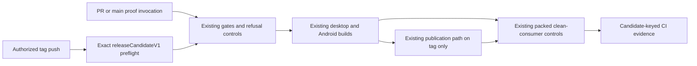
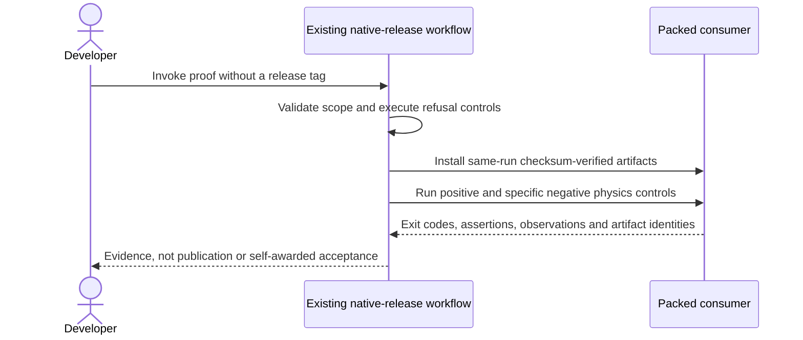

# PRD-078 — Hosted runtime release jobs prove the exact candidate

**Status:** PARTIAL — prior Vulkan/version fixes retained; non-publishing hosted proof implemented, candidate observations and independent acceptance review still required. Revised 2026-09-10.
**Complexity:** 6 → MEDIUM (+2 files, +2 multi-platform integration, +1 external CI API, +1 artifact contract).
**Problem:** Historical hosted release failures must be retried on the current candidate instead of being treated as permanent blockers.

Batch contract and dependency order: [production-readiness](README.md). Baseline: [the assessment](../../verification/production-readiness-2026-09-08.md), source `912a567e3e7592e6b437e49fe6318a3987d1f7c1`. iOS is outside this batch; no iOS readiness credit is created or removed.

## Integration ledger

| # | New or revised thing | Live caller | Replaces | Old path removed? | Negative control |
| --- | --- | --- | --- | --- | --- |
| 1 | Exact-candidate hosted proof | .github/workflows/native-release.yml: gates/build jobs | historical failure assumptions | Existing build and verification scripts remain the only callers | Supply a green run from another SHA or omit a required job; gate refuses |
| 2 | Release-job failure diagnostics | .github/workflows/native-release.yml: build matrix and clean-consumer | unexplained skipped/deleted release | No second build or clean-consumer implementation | Suppress a required frame/physics marker; native gate fails |
| 3 | Non-publishing proof invocation | .github/workflows/native-release.yml: PR, main push and manual triggers | tag/publication prerequisite for testing | Tag publication keeps its exact releaseCandidateV1 preflight; proof reuses the same jobs | PR and manual events cannot enter validate-tag, publish, finalize or release deletion |

## Current behavior and ownership

Prior phase evidence proves the Vulkan ICD and runtime-version-stamp fixes. Its later Linux physics, Windows dependency and simulator failures were recorded in August. Green CI on a different commit is not current-candidate native-release evidence.

CI/native-host layer. Owns only actual hosted build/gate defects and their exact-candidate proof. [PRD-262](PRD-262-the-runtime-native-prebuilt-release-exists.md) owns generated runtime artifacts and installation; [PRD-060](PRD-060-promoted-consumer-distribution.md) owns npm/consumer promotion. No separate publisher or second clean-consumer gate is introduced.

## Approach and boundaries

Reuse existing native-release and native-platform workflows and their platform gate scripts. Re-run named failed subjects before diagnosing. Fix only reproduced job failures and keep checksums, native frames and nonblank/behavior assertions. Never substitute green unrelated CI for the release job. Preserve existing iOS gates as a separate scope rather than deleting them to make a non-iOS claim green.

The existing release entry point now has a proof-only route. Pull requests run its native builds and packed controls at the actual checkout merge SHA and separately record the PR head SHA. PR evidence is explicitly **not main release acceptance**. A relevant push to main, or a manual invocation on main, first requires the completed exact-SHA main CI run and all eleven named prerequisite jobs. Missing, skipped, cancelled, failed and malformed evidence remains refusal, not success.

Proof consumers download runtime artifacts from their own workflow run. The existing checksum-verifying installer reads a loopback manifest through its existing test override; no new installer or public download claim is created. Only a tag push can publish, promote or remove a GitHub release. A manual invocation on a tag cannot publish. PRD-262 receives the accepted main proof's SHA, run/attempt and artifact identities; PRD-060 still owns public-consumer acceptance.

Data/migration: no application database migration. Evidence extends existing package/config/artifact contracts; no parallel scene, project or release framework.





## Execution phases

The two bounded assignments below are reviewed separately. Neither is accepted merely because implementation or fixture tests are green. The source work from PR #168 is retained, not rewritten to recreate August defects.

### Phase 1 — The actual release job distinguishes old evidence from a runnable candidate

**Files (maximum five):**

- EDIT `.github/workflows/native-release.yml` — validate same-SHA prerequisite runs and preserve job output.
- EDIT `packages/runtime-native/tests/native-platform-workflow.test.mjs` — test wrong-SHA, missing-job and Android shell refusal.
- EDIT `scripts/__tests__/ci-structure.spec.ts` — guard the existing workflow rather than require duplicate execution.
- EDIT `docs/verification/native-coverage-2026-08-28.md` — retain the companion digest from the same PR #168 test snapshot; no new native coverage percentage is claimed.
- NEW `docs/verification/prd-078-readiness-phase-1-2026-09-09.md` — retained source-level red/green record.

**Implementation and wiring:** Extend only the existing prerequisite/job validation that needs repair. Record each required job result individually; cancelled/skipped is not successful. Hand the run identity to PRD-262 without creating/publishing a release in this phase. Preserve all four packed Android physics negatives: wrong-height, collision-mask, mask-with-control-enabled, and wrong-gravity. Their `native-smoke/src/physics.ts` subject remains deliberately separate from the default-starter UI subject. Each negative must produce its specific TN_PLAYTEST assertion diagnostic and exit 1 in the hosted emulator lane; the normal and masked positive controls must exit 0.

**Required test:** `packages/runtime-native/tests/native-platform-workflow.test.mjs`: reject release prerequisites when the successful run belongs to a different source SHA.

**Observed-red / revert control:** Substitute successful older CI evidence and remove one required job result; validate refusal before restoring exact-candidate results. Do not restore historical production defects.

### Phase 2 — Execute the existing proof without publishing a release

**Files (maximum five):**

- EDIT `.github/workflows/native-release.yml` — proof routing, hosted refusal execution, same-run artifact transport and control evidence.
- NEW `scripts/__tests__/native-release-proof.spec.ts` — execute the actual gate and evidence collector; verify event/dependency boundaries.
- EDIT `docs/PRDs/production-readiness/PRD-078-toolchain-free-consumer-proof.md` — make invocation and phase boundaries explicit.
- NEW `docs/verification/prd-078-readiness-phase-2-2026-09-10.md` — commands, candidate/run identities, outcomes and review state.
- GENERATE `docs/benchmark/SCREENSHOT-RETENTION.md` — regenerate the evidence index, never hand-edit it.

**Implementation and wiring:** Add proof triggers to the existing workflow, not another build or consumer implementation. Run wrong-SHA/missing-job controls through the inline gate shell inside the hosted gates job. Fixtures prove refusal mechanics and are labeled as such; real native frames come only from the existing native jobs. Main proof still demands all eleven exact-candidate CI prerequisites. Preserve failed native diagnostics and collect all six packed Android outcomes with actual exits, nonzero observed assertion counts, scenario identities, APK hashes and packed-package SHA-512 integrities. Empty/missing/wrong-scenario reports fail. Retain generated maintenance diagnostics for reproducibility without changing the sources under test.

**Observed-red / revert control:** Restore the original tag-only workflow: proof-routing tests must fail. Remove an Android report, empty its assertions, change its expected failure marker, exit code or scenario: the real evidence collector must refuse and retain the failed row.

**Verification commands** (repository root):

```sh
pnpm exec vitest run scripts/__tests__/native-release-proof.spec.ts
pnpm --filter @threenative/runtime-native exec vitest run --config vitest.config.ts tests/native-platform-workflow.test.mjs
pnpm typecheck && pnpm lint && pnpm test
pnpm budgets
gh run list --repo ThreeNativeHQ/threenative --workflow native-release.yml --limit 10
# On main after its exact-SHA CI finishes, only when an automatic proof is not already running:
gh workflow run native-release.yml --repo ThreeNativeHQ/threenative --ref main
```

**User verification:** Inspect the selected workflow page and retained `release-prerequisites-<SHA>-<attempt>` and `clean-consumer-linux-x64` artifacts. Every claimed platform row must link to its actual frame/physics/artifact output. `proof-consumer-evidence.json` distinguishes same-run artifacts from public installation. Any reproduced platform repair becomes a named bounded correction, not adjacent cleanup.

### Phase 3 — The headless desktop gate reached a runner with no sound card

Reproduced in run [34543393235](https://github.com/ThreeNativeHQ/threenative/actions/runs/34543393235), the first Linux execution of `native:verify:desktop` this proof route created.

**Files (maximum five):**

- EDIT `packages/runtime-native/scripts/verify-desktop-core.mjs` — default the Linux SDL audio driver where the video driver is already scoped.
- EDIT `packages/runtime-native/tests/desktop-core-gate.test.mjs` — bind both drivers to the one Linux branch and forbid an unconditional override.
- EDIT `docs/verification/prd-078-readiness-phase-2-2026-09-10.md` — this phase's evidence record.

**Implementation and wiring:** `native-platforms.yml`'s desktop-core matrix is macOS and Windows only, so no Linux run reached this line until the proof route executed it on `ubuntu-24.04`. The audio contract is not weakened: `verify-desktop-audio.mjs` owns it and runs first in the same command, and an explicit `SDL_AUDIODRIVER` still wins.

**Required test:** `packages/runtime-native/tests/desktop-core-gate.test.mjs`: desktop verifier preserves evidence and scopes its SDL drivers to Linux.

**Observed-red / revert control:** Force the driver for every platform, or move it out of the Linux branch; the test must fail.

### Phase 4 — The CLI contract test could not compile its own prerequisite

Reproduced in run [34546754768](https://github.com/ThreeNativeHQ/threenative/actions/runs/34546754768), where all three desktop rows failed inside `native:verify:desktop`.

**Files (maximum five):**

- EDIT `packages/runtime-native/tests/cli_network_fs_test.cpp` — install Web Streams before `initBindings` through the qualified embedded script table.
- EDIT `packages/runtime-native/CMakeLists.txt` — give that target its generated include directory and script dependency.
- NEW `packages/runtime-native/tests/webtransport-polyfill-prerequisites.test.mjs` — hold the prerequisite under vitest.
- EDIT `docs/verification/prd-078-readiness-phase-2-2026-09-10.md` — this phase's evidence record.

**Implementation and wiring:** `webtransport::initBindings` reads `globalThis.__wtDispatch`, which the polyfill installs only when Web Streams exist, so a bare engine drove the binding outside its documented prerequisite. The test now fails on a missing embedded script and on a false return instead of continuing.

**Required test:** `packages/runtime-native/tests/webtransport-polyfill-prerequisites.test.mjs`, plus the compiled `threenative-cli-network-fs-test` contract target.

**Observed-red / revert control:** Compile the pre-repair source: `cli_network_fs_test.cpp:1049:30: error: 'runtime_scripts' has not been declared`.

### Phase 5 — Release staging asked for an SDL AAR that no longer existed

Reproduced historically on the only route that reached the step, a tag push.

**Files (maximum five):**

- EDIT `.github/workflows/native-release.yml` — derive the staged AAR filename from the module that owns the version.
- NEW `scripts/__tests__/native-release-android-staging.spec.ts` — require the derivation, not a matching literal.
- EDIT `docs/verification/prd-078-readiness-phase-2-2026-09-10.md` — this phase's evidence record.

**Implementation and wiring:** `package-android.mjs` moved to SDL3 3.2.30 deliberately, because 3.2.8's 64-bit libraries are not 16 KB `LOAD`-aligned, while the workflow still spelled out `SDL3-3.2.8.aar`. Asserting the literal matches would only detect the next drift; requiring derivation removes the failure mode, and the test also binds `download-deps.mjs` to the same constant.

**Required test:** `scripts/__tests__/native-release-android-staging.spec.ts`: native release stages the SDL3 Android AAR version owned by the packager.

**Observed-red / revert control:** Restore a literal version in the staging step; the test must fail.

## Verification contract

Each phase edits its named pre-existing caller and includes its phase evidence record within the five-file budget. File lists are bounded implementation assignments, not permission for adjacent cleanup. If investigation needs more files, split the phase before implementing; do not silently widen it. Query `engine_search_capabilities` and inspect every hit before qualifying package/helper work, as the repository requires.

Run the phase command, observed-red control, restore the implementation and rerun green. Record exact candidate SHA, package versions/integrities, source and artifact hashes, platform/adapter/session, command, exit code, assertion count and artifact paths. A missing observation, skipped test, stale artifact or zero-assertion run is not PASS. Fixtures/local tarballs may prove mechanics; public-consumer acceptance requires registry packages and public runtime downloads with no engine checkout, source override or injected manifest.

For executable changes run `pnpm typecheck && pnpm lint && pnpm test`, `pnpm budgets`, and the affected real playtest/platform lane. Use hosted Windows/macOS runs, emulators for Android behavior, and physical Android only for hardware-specific claims. Name unexecuted targets. Runtime changes require a real playtest scenario; this assignment changes CI, not runtime behavior.

After every phase, an independent reviewer receives this PRD, diff, commands and artifacts and returns PASS / NEEDS CORRECTION / BLOCKED. It checks caller integration, negative controls, removed/delegating incumbent paths and the actual consumer outcome. No phase starts on a self-awarded PASS. Visual acceptance also requires human inspection of captures. Credentialed signing/submission and external-person checkpoints remain PENDING until executed. This work does not authorize publishing packages, creating releases, uploading to stores or contacting external people.

## Verification evidence

[Phase 1 source evidence](../../verification/prd-078-readiness-phase-1-2026-09-09.md) and [Phase 2 implementation and execution evidence](../../verification/prd-078-readiness-phase-2-2026-09-10.md) distinguish local shell/collector tests, hosted observations and pending independent review. Acceptance boxes remain unchecked until the selected candidate and all phase checkpoints pass. No placeholder or PR-only integration result closes main release acceptance.

## Acceptance criteria

- [ ] Prior successful fixes remain intact and are not rewritten merely because old blocked prose exists.
- [ ] The selected candidate has current hosted native build/gate evidence; each failed, skipped or unavailable row is named.
- [ ] Wrong-SHA/absent-result controls fail in the existing release entry point.
- [ ] All four packed Android physics negative controls and their positive control execute on the selected candidate. Any new job repair is bounded, reviewed and hands its result to PRD-262; this PRD does not itself establish public installation.

## Prior work retained

Moved from `docs/PRDs/BLOCKED/requires-hosted-run/PRD-078-toolchain-free-consumer-proof.md` under the owner's 2026-09-08 instruction. This revision replaces execution scope, not historical test results. [Original plan at the assessed commit](https://github.com/ThreeNativeHQ/threenative/blob/912a567e3e7592e6b437e49fe6318a3987d1f7c1/docs/PRDs/BLOCKED/requires-hosted-run/PRD-078-toolchain-free-consumer-proof.md) remains immutable history. August run 31965691750 and the original observed version/Vulkan repairs remain historical evidence. Use isolated controls, not restored production defects.

Historical evidence: [consumer-handoff-2026-08-12.md](../../verification/consumer-handoff-2026-08-12.md).
