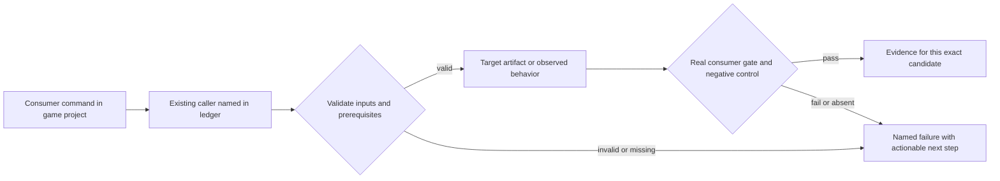
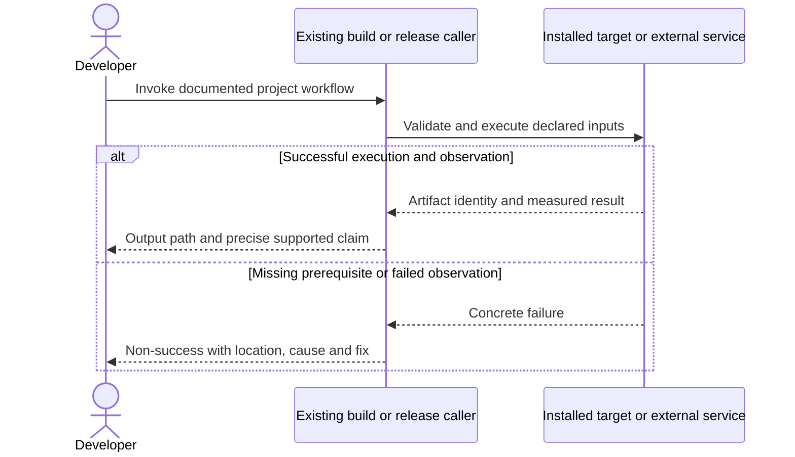

# PRD-196 — The public installation includes its complete authoring toolchain

**Status:** PARTIAL — current implementation exists; refreshed registry/cohort proof is open. Revised 2026-09-08; planning only.
**Complexity:** 8 → HIGH (+3 files, +2 multi-package, +2 release-state coordination, +1 registry integration).
**Problem:** The registry starter trails current source, and an install can omit current MCPs or carry package-boundary and environment failures.

Batch contract and dependency order: [production-readiness](README.md). Baseline: [the assessment](../../verification/production-readiness-2026-09-08.md), source `912a567e3e7592e6b437e49fe6318a3987d1f7c1`. iOS is outside this batch; no iOS readiness credit is created or removed.

## Integration ledger

| # | New or revised thing | Live caller at planning time | Replaces | Old path removed? | Negative control |
| --- | --- | --- | --- | --- | --- |
| 1 | Self-contained published scripts | scripts/check-publish-state.ts: report construction; scripts/release.ts:107 packReleaseSet | undeliverable sibling-source imports | Exclude development-only proof assets or delegate to shipped public exports in phase 1 | Restore VSM sibling import/pack entry; extracted-tarball gate fails |
| 2 | Complete MCP installation | packages/core/scripts/postinstall.mjs:5; packages/core/mcp/servers.mjs:6 | published three-server drift | Common server table remains sole registration source | Remove bundled Blender server or scaffold config entry; registry MCP gate fails |
| 3 | Registry cohort and install matrix | scripts/release.ts:209; scripts/verify-registry-install.ts: verifyRegistryInstall | one-environment installation evidence | Existing gate extended, not duplicated | Inject local dependency specifier or unsupported Node install; gate fails |
| 4 | Complete sandbox package injection | scripts/make-sandbox.ts: main sandbox creation → package install | omitted runtime/MCP inputs in sandbox evidence | Existing sandbox extended in phase 5, no duplicate creator | Remove runtime or capability server; sandbox operation fails |

## Current behavior and ownership

The assessment installed CLI 0.2.3/core 0.3.0: three MCP transports initialized, while current core declares four. Eight existing version numbers have subsequent source changes; the core VSM proof script reaches sibling source outside the tarball. Initial sharp installation failed; an environment override cleared it. These are measured symptoms, not permission to add blanket install-script bypasses.

Engine/package layer. Owns package contents, dependency/install support and automatic MCP wiring. [PRD-262](PRD-262-the-runtime-native-prebuilt-release-exists.md) owns native binary availability; [PRD-264](PRD-264-doctor-answers-all-three-questions-a-game-author-has.md) owns diagnosis; [PRD-060](PRD-060-promoted-consumer-distribution.md) owns public promotion. The older PRD-119 release command remains the incumbent, not a new publisher.

## Approach and boundaries

Reuse `scripts/check-publish-state.ts`, `scripts/release.ts`, `scripts/verify-registry-install.ts`, core MCP shims and the common server table. Preserve user config and editor trust boundaries. Bundle engine/Blender servers as currently intended; install asset/sculpt dependencies transitively. Blender application installation remains an explicit external prerequisite. Support the documented pnpm path plus npm, and either satisfy the declared Node minimum or revise it coherently before release. Do not force-run scripts blocked by package-manager policy. Derive cohort versions from package manifests and validate all scaffold pins.

Data/migration: no application database migration. New build metadata and evidence extend the existing package/config/artifact contracts; no parallel scene, project or release framework.





## Execution phases

### Phase 1 — A packed core installs without reaching engine sibling source

**Files (maximum five):**

- EDIT `packages/core/package.json` — ship only supported self-contained consumer files.
- EDIT `scripts/check-publish-state.ts` — validate extracted tarball imports.
- EDIT `scripts/__tests__/check-publish-state.spec.ts` — prove missing sibling imports fail.
- NEW `docs/verification/prd-196-readiness-phase-1-<date>.md` — commands, identities, red/green and reviewer decision.

**Implementation and wiring:** Keep the VSM development proof in the repository, but exclude its source-dependent directory from published core unless it is explicitly made a supported shipped tool. Retain actual runtime/MCP files. Extend the existing extracted-content preflight and have release.ts continue invoking it; no separate preflight path.

**Required test:** `scripts/__tests__/check-publish-state.spec.ts`: should reject a shipped script when its relative dependency is absent from the extracted tarball; test package contents, not source strings alone.

**Observed-red / revert control:** Reinsert the excluded source-dependent proof into the packed set; the existing publish preflight must name its unresolved import. Restore, pack again and show the finding gone; unrelated current version/prebuilt findings remain failures.

**Verification commands** (from repository root unless noted; proposed flags are explicitly identified):

```sh
pnpm exec vitest run scripts/__tests__/check-publish-state.spec.ts
pnpm publish:check
```

**User verification:** Install the corrected candidate tarball outside the repo and invoke each advertised bin/MCP entry without any sibling checkout.

### Phase 2 — A clean documented install works on supported Node and package managers

**Files (maximum five):**

- EDIT `packages/create-threenative/package.json` — dependency and Node support declaration.
- EDIT `scripts/verify-registry-install.ts` — clean npm/pnpm environment cases.
- EDIT `scripts/__tests__/verify-registry-install.spec.ts` — install-boundary regressions.
- EDIT `packages/create-threenative/README.md` — verified prerequisites and environment repair.
- NEW `docs/verification/prd-196-readiness-phase-2-<date>.md` — commands, identities, red/green and reviewer decision.

**Implementation and wiring:** Trace sharp to its actual transitive owner before changing dependencies. Reproduce on hosts with and without global libvips; prefer supported prebuilt installation and document an explicit user-environment remedy where appropriate. Record the Node >=22 transitive warning and npm audit dependency paths/reachability; fix supported-cohort incompatibility rather than hiding warnings. Any additional package owner edit is a separately bounded phase. Verify default pnpm install policies and npm; do not rely on a warmed global npm cache.

**Required test:** `scripts/__tests__/verify-registry-install.spec.ts`: should fail installation qualification when a declared supported environment cannot install and build; should preserve package-manager script policy when reporting a prerequisite.

**Observed-red / revert control:** Run the reproduced failing environment before the fix; remove the chosen repair and show the same real install fails again. A deliberately unrelated missing binary is not the red for sharp.

**Verification commands** (from repository root unless noted; proposed flags are explicitly identified):

```sh
pnpm exec vitest run scripts/__tests__/verify-registry-install.spec.ts
pnpm tsx scripts/verify-registry-install.ts
```

**User verification:** Run the README sequence in a clean npm environment and a clean pnpm environment at the minimum supported Node version; neither requires editing engine or node_modules.

### Phase 3 — All required MCPs are installed and configured automatically

**Files (maximum five):**

- EDIT `packages/core/mcp/servers.mjs` — sole server/package definitions.
- EDIT `packages/core/mcp/install.mjs` — preserve and populate project host configs.
- EDIT `packages/core/__tests__/mcp-install.spec.ts` — host and script-policy cases.
- EDIT `scripts/verify-registry-install.ts` — initialize and exercise every declared server.
- NEW `docs/verification/prd-196-readiness-phase-3-<date>.md` — commands, identities, red/green and reviewer decision.

**Implementation and wiring:** Use the already bundled engine/Blender servers and transitive asset/sculpt packages. Derive expected servers from the packed table rather than a fixed count. Require initialize, tools/list and one safe real operation per server; engine search must return a capability detail; Blender conversion uses an installed Blender and a small owned input. Verify npm/pnpm scaffold configs even when postinstall is blocked. Do not alter global editor files or silently overwrite malformed project config.

**Required test:** `packages/core/__tests__/mcp-install.spec.ts`: should preserve unrelated host settings when installing every declared server; should fail consumer verification when a configured server cannot initialize. Registry gate exercises an asset operation, a sculpt operation and Blender conversion, not only tools/list.

**Observed-red / revert control:** Remove the Blender bundle, remove one expected host entry, corrupt the engine capability manifest, and simulate malformed user config separately. Each targeted check must fail or report unavailable without claiming all tools ready.

**Verification commands** (from repository root unless noted; proposed flags are explicitly identified):

```sh
pnpm exec vitest run packages/core/__tests__/mcp-install.spec.ts scripts/__tests__/verify-registry-install.spec.ts
pnpm tsx scripts/verify-registry-install.ts
```

**User verification:** Launch an actual supported editor from the trusted game root, discover all servers and use capability search. Record other editor hosts as configuration-tested until actually opened; missing Blender gets installation guidance, not a false conversion PASS.

### Phase 4 — The release cohort contains the repaired authoring path

**Files (maximum five):**

- EDIT `scripts/release.ts` — derive and validate coherent new package cohort.
- EDIT `scripts/__tests__/release.spec.ts` — version/pin/order regression.
- EDIT `.github/workflows/npm-release.yml` — invoke guarded candidate preparation.
- NEW `docs/verification/prd-196-readiness-phase-4-<date>.md` — commands, identities, red/green and reviewer decision.

**Implementation and wiring:** Keep dry-run preparation separate from publication. Prepare version updates using the existing release tooling, splitting manifest edits into named batches of at most four manifests plus evidence. Never republish immutable 0.3.0/0.2.3 artifacts. Validate every generated template dependency and the current server bundle before handing the exact cohort to PRD-262/060; do not promote here. Candidate dist-tag mechanics are exclusively PRD-060.

**Required test:** `scripts/__tests__/release.spec.ts`: should reject an already-published changed package when preparing a candidate; should reject a template pin outside the candidate cohort.

**Observed-red / revert control:** Restore one old template pin or already-published changed version; the existing release preflight rejects that package before publication.

**Verification commands** (from repository root unless noted; proposed flags are explicitly identified):

```sh
pnpm exec vitest run scripts/__tests__/release.spec.ts scripts/__tests__/check-publish-state.spec.ts
pnpm release
```

**User verification:** Inspect the dry-run cohort with package versions, template pins and source SHA; no public registry mutation occurs in this phase.

### Phase 5 — The existing sandbox remains a faithful installed consumer

**Files (maximum five):**

- EDIT `scripts/make-sandbox.ts` — derive the full shipped package injection from the existing workspace package census.
- EDIT `scripts/__tests__/make-sandbox.spec.ts` — reject omitted runtime/MCP package inputs and local unresolved protocols.
- EDIT `scripts/__tests__/verify-registry-install.spec.ts` — distinguish sandbox/tarball mechanics from public registry credit.
- NEW `docs/verification/prd-196-readiness-phase-5-<date>.md` — exact package census, native/MCP execution and observed controls.

**Implementation and wiring:** preserve the original PRD-196 sandbox obligation. `pnpm sandbox` calls `scripts/make-sandbox.ts`; its actual package installation must include every required core/physics/UI/assets/playtest/runtime/scaffolder/MCP package and bundled server using the existing workspace census. Do not create a second hardcoded publish list. Run a default-starter sandbox through desktop build/playtest and engine capability search/detail. Final public install credit remains PRD-060: sandbox local tarballs prove a different boundary.

**Required test:** `scripts/__tests__/make-sandbox.spec.ts`: should reject a sandbox package set when a required runtime or configured MCP dependency is missing. `scripts/__tests__/verify-registry-install.spec.ts`: should reject sandbox package URLs as public-registry proof.

**Observed-red / revert control:** omit runtime-native and then the engine/Blender server payload from disposable sandbox inputs. The real sandbox native/capability operation must fail. Restore each input and rerun with the same scenario; a web build alone cannot pass this phase.

```sh
pnpm exec vitest run scripts/__tests__/make-sandbox.spec.ts scripts/__tests__/verify-registry-install.spec.ts
pnpm sandbox --help
```

**User verification:** capture the actual existing sandbox creation invocation from its help and run it; launch its installed default starter on a supported desktop and query capability detail through its own MCP transport. Record the resolved runtime/package locations outside the engine checkout. No new sandbox CLI vocabulary is introduced.

## Verification contract

Each phase edits its named pre-existing caller and includes the phase evidence record within the five-file budget. File lists are bounded implementation assignments, not permission for adjacent cleanup. If investigation needs more files, split the phase before implementing; do not silently widen it. Query `engine_search_capabilities` and inspect every hit before any qualifying package/helper work, as the repository requires.

Run the phase command, its observed-red control, restore the implementation and rerun green. Record exact candidate SHA, package versions/integrities, source and artifact hashes, platform/adapter/session, command, exit code, assertion count and artifact paths. A missing observation, skipped test, stale artifact or zero-assertion run is not PASS. Fixtures/local tarballs may prove mechanics; public-consumer acceptance requires registry packages and public runtime downloads with no engine checkout, source override or injected manifest.

For executable changes run `pnpm typecheck && pnpm lint && pnpm test`, `pnpm budgets`, and the affected real playtest/platform lane. Generate mirrors with `pnpm sync:agents` if AGENTS changes. Use platform-specific hosted runs for Windows/macOS, emulators for Android behavior, and physical Android only for claims that require hardware. Name unexecuted targets. A runtime change needs a real playtest scenario in the same implementation, not only the focused tests named below.

After every phase, an independent reviewer receives this PRD, diff, commands and artifacts and returns PASS / NEEDS CORRECTION / BLOCKED. It checks caller integration, negative controls, removed/delegating incumbent paths and the actual consumer outcome. No phase starts on a self-awarded PASS. Visual phases also require human inspection of captures; credentialed signing/submission and external-person checkpoints remain PENDING until executed. Do all authorized preparation before requesting any missing external authorization. This planning request does not authorize publishing packages, uploading to stores or contacting external people.

## Verification evidence

No implementation gate was run by this planning revision. Every new phase is **NOT RUN**. Write each phase to `docs/verification/prd-<id>-readiness-phase-<n>-<date>.md` (the evidence file listed in each phase); use the existing runtime performance ledger for new performance measurements. Fill actual results and non-test `file:line` callers at implementation time; a phase cannot close with placeholders. Acceptance boxes below remain unchecked until all phase checkpoints pass.

## Acceptance criteria

- [ ] npm and pnpm clean installs satisfy their documented Node/tool prerequisites; environment-specific limitations are reproduced and actionable, with audit findings triaged.
- [ ] Every advertised shipped script resolves within the installed dependency graph, and all current required MCPs initialize and perform a real operation.
- [ ] User-owned editor configuration survives reinstall; missing external applications and disabled install scripts are reported accurately.
- [ ] New package versions, template pins and bundled tools form one validated cohort; public proof is obtained through PRD-060.
- [ ] The existing sandbox passes its full package/native/MCP obligations as separate intermediate proof. All phase gates and independent reviews pass; no engine checkout, local-link substitution or node_modules patch is accepted as final consumer proof.

## Prior work retained

Moved from `docs/PRDs/done/PRD-196-published-install-is-functional.md` under the owner's 2026-09-08 instruction. This revision replaces the execution scope, not historical test results. [Original plan at the assessed commit](https://github.com/ThreeNativeHQ/threenative/blob/912a567e3e7592e6b437e49fe6318a3987d1f7c1/docs/PRDs/done/PRD-196-published-install-is-functional.md) remains the immutable history. Previously filed under done/ despite a NOT STARTED header. Historical successful transport checks are retained; September publication drift is the new acceptance subject.
