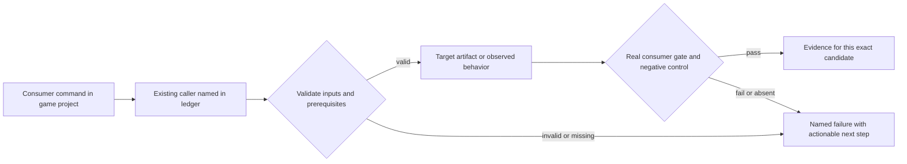
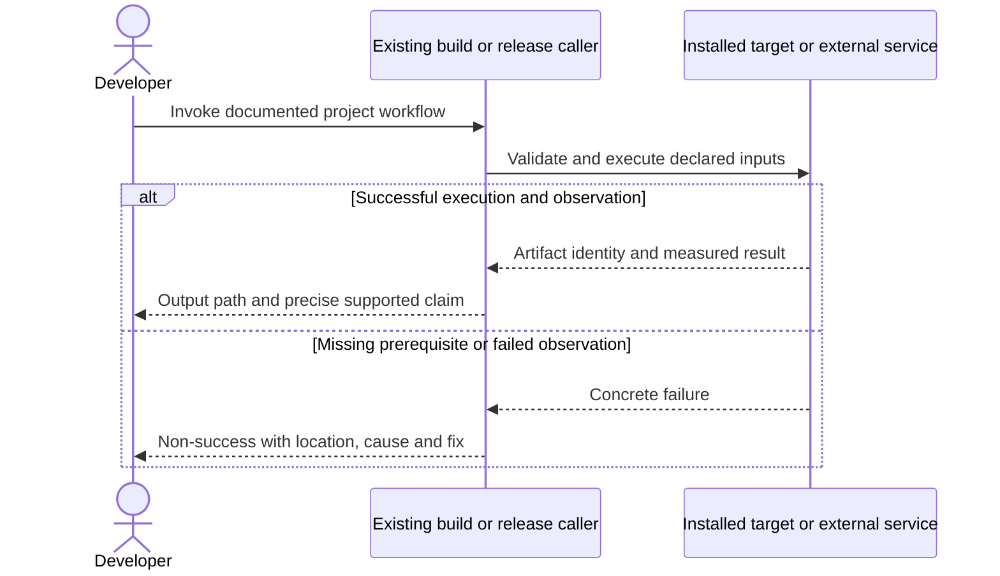

# PRD-212 — A published game builds signed Android release artifacts

**Status:** PARTIAL — existing packaging/import fixes retained; release artifact work open. Revised 2026-09-08; planning only. An API 35 emulator runs locally on KVM as of 2026-09-11, so install, launch and manifest inspection of the built artifact are local checks, not hosted ones.
**Complexity:** 8 → HIGH (+3 files, +2 multi-package, +2 signing/release-state handling, +1 platform tools).
**Problem:** The installed Android path depends on absent runtime assets and currently emits only a debug APK with target SDK 35.

Batch contract and dependency order: [production-readiness](README.md). Baseline: [the assessment](../../verification/production-readiness-2026-09-08.md), source `912a567e3e7592e6b437e49fe6318a3987d1f7c1`. iOS is outside this batch; no iOS readiness credit is created or removed.

## Integration ledger

| # | New or revised thing | Live caller at planning time | Replaces | Old path removed? | Negative control |
| --- | --- | --- | --- | --- | --- |
| 1 | Release APK/AAB selection | packages/create-threenative/src/build.ts:543 parseBuildArgs and :520 build → packageAndroid | unconditional assembleDebug | Retain debug default; release explicitly dispatches one path | Request release; force assembleDebug, expected release artifact assertion fails |
| 2 | Consumer-owned signing | packages/runtime-native/scripts/package-android.mjs:699 Gradle invocation | engine-source/keystore edits | One Gradle signing configuration reads declared environment properties | Missing/incorrect key fails without debug-key fallback |
| 3 | Current SDK and store validation | packages/runtime-native/android/app/build.gradle.kts:288-294; packageAndroid result | SDK35/debug artifacts called releasable | Update existing SDK constants and final validation | Force targetSdk35/debuggable true; release verification fails |

## Current behavior and ownership

Existing phases fixed packed import/specifier mechanics. Current packageAndroid selects assembleDebug and app-debug.apk. App identity, icon and splash already flow from the game config. The report observed JDK 26 locally while supported Android builds need JDK 17; this is a prerequisite to diagnose, not a source-code workaround.

Engine packaging layer. Owns SDK level and release APK/AAB/signing path through the existing build command. [PRD-221](../done/PRD-221-android-v8-is-16kb-clean.md) supplies aligned libraries, [PRD-262](PRD-262-the-runtime-native-prebuilt-release-exists.md) supplies downloads, [PRD-153](../done/PRD-153-game-branding-from-launch-to-play.md) owns brand appearance and [PRD-060](PRD-060-promoted-consumer-distribution.md) owns actual credentialed upload/promotion proof.

## Approach and boundaries

Extend `threenative build --target android` with conventional build flags, not a new top-level command: **proposed** `--mode debug|release` and `--format apk|aab`; omitted flags retain current debug APK behavior. Unsupported combinations fail before work. Signing inputs use Gradle project properties supplied from the game build environment (keystore path, alias, store/key passwords), never engine files or committed secrets. Map game identity/version through existing resolved config. Read secret values only inside the signing subprocess boundary, never serialize them into packaging config or logs. Final signed release output must be non-debuggable and carry native symbols separately.

Data/migration: no application database migration. New build metadata and evidence extend the existing package/config/artifact contracts; no parallel scene, project or release framework.





## Execution phases

### Phase 1 — The game builds against the current Android submission SDK

**Progress:**

- [ ] Callers wired and building: `packages/runtime-native/android/app/build.gradle.kts`, `packages/create-threenative/src/doctor.ts`, `packages/runtime-native/tests/android-manifest-config-changes.test.mjs`
- [ ] Required test green: `packages/runtime-native/tests/android-manifest-config-changes.test.mjs`
- [ ] Observed red recorded, then restored green
- [ ] User verification performed on the named platform
- [ ] Evidence record written: `docs/verification/prd-212-readiness-phase-1-<date>.md`
- [ ] Independent reviewer returned PASS

**Files (maximum five):**

- EDIT `packages/runtime-native/android/app/build.gradle.kts` — compile/target SDK and compatible Android toolchain.
- EDIT `packages/create-threenative/src/doctor.ts` — derive supported Android prerequisites.
- EDIT `packages/runtime-native/tests/android-manifest-config-changes.test.mjs` — inspect packaged target/version fields.
- NEW `docs/verification/prd-212-readiness-phase-1-<date>.md` — commands, identities, red/green and reviewer decision.

**Implementation and wiring:** Confirm current official target-API requirements at implementation; baseline is API36 for ordinary new apps/updates as of the report. Update compileSdk/targetSdk coherently and provision their real SDK in the existing lane as a separately bounded workflow phase if needed. Doctor reads the shipped Android requirement rather than introducing a second literal. Keep minSdk/device claim explicit and test behavior changes on the chosen target.

**Required test:** `packages/runtime-native/tests/android-manifest-config-changes.test.mjs`: should reject the release subject when its packaged target SDK is below the declared submission requirement.

**Observed-red / revert control:** Restore targetSdk35 in an isolated candidate and inspect the built artifact; the manifest-based gate, not only source matching, must reject it.

**Verification commands** (from repository root unless noted; proposed flags are explicitly identified):

```sh
pnpm --filter @threenative/runtime-native exec vitest run --config vitest.config.ts tests/android-manifest-config-changes.test.mjs
# In the installed game with supported JDK and SDK:
pnpm build:android
pnpm exec threenative doctor --text
```

**User verification:** Inspect installed application ID/version/target SDK and run the game on the newer Android platform; JDK/SDK mistakes produce prerequisite guidance before opaque Gradle errors.

### Phase 2 — One build command produces an explicitly selected release artifact

**Progress:**

- [ ] Callers wired and building: `packages/create-threenative/src/build.ts`, `packages/runtime-native/scripts/package-android.mjs`, `packages/runtime-native/android/app/build.gradle.kts` (+1 more)
- [ ] Required test green: `packages/create-threenative/__tests__/build.spec.ts`
- [ ] Observed red recorded, then restored green
- [ ] User verification performed on the named platform
- [ ] Evidence record written: `docs/verification/prd-212-readiness-phase-2-<date>.md`
- [ ] Independent reviewer returned PASS

**Files (maximum five):**

- EDIT `packages/create-threenative/src/build.ts` — parse and dispatch mode/format with existing config.
- EDIT `packages/runtime-native/scripts/package-android.mjs` — choose tasks/output by validated request.
- EDIT `packages/runtime-native/android/app/build.gradle.kts` — release artifact configuration.
- EDIT `packages/create-threenative/__tests__/build.spec.ts` — CLI-to-artifact mode contract.
- NEW `docs/verification/prd-212-readiness-phase-2-<date>.md` — commands, identities, red/green and reviewer decision.

**Implementation and wiring:** Introduce proposed mode/format flags into buildHelp and parsing. Pass the validated request to the existing Android packager; release APK uses assembleRelease and AAB uses bundleRelease. Choose exact expected outputs and fail on missing output. Unsigned output may be inspected during this phase, but cannot be reported as store-ready; signing closure is phase 3. No guessed path accepts app-debug.apk for a release request.

**Required test:** `packages/create-threenative/__tests__/build.spec.ts`: should produce an AAB when release/aab is requested; should reject a debug APK returned for a release request. Assert dispatch plus artifact metadata via the real packaging integration lane.

**Observed-red / revert control:** Force the task back to assembleDebug while requesting release/aab; the gate fails naming wrong/missing artifact. Unknown mode/format also exits nonzero.

**Verification commands** (from repository root unless noted; proposed flags are explicitly identified):

```sh
pnpm exec vitest run packages/create-threenative/__tests__/build.spec.ts
# PROPOSED, available only after this phase, in the game:
pnpm exec threenative build --target android --mode release --format aab
```

**User verification:** The project command prints the actual .aab output path and its unsigned/signed status honestly; debug remains available with no signing credentials.

### Phase 3 — A developer signs a non-debuggable release without editing engine files

**Progress:**

- [ ] Callers wired and building: `packages/runtime-native/scripts/package-android.mjs`, `packages/runtime-native/android/app/build.gradle.kts`, `packages/runtime-native/tests/android-packaging.integration.test.mjs` (+1 more)
- [ ] Required test green: `packages/runtime-native/tests/android-packaging.integration.test.mjs`
- [ ] Observed red recorded, then restored green
- [ ] User verification performed on the named platform
- [ ] Evidence record written: `docs/verification/prd-212-readiness-phase-3-<date>.md`
- [ ] Independent reviewer returned PASS

**Files (maximum five):**

- EDIT `packages/runtime-native/scripts/package-android.mjs` — validate signing inputs and final artifact.
- EDIT `packages/runtime-native/android/app/build.gradle.kts` — consumer property-backed signing config.
- EDIT `packages/runtime-native/tests/android-packaging.integration.test.mjs` — real test-key signing and failure controls.
- EDIT `packages/runtime-native/README.md` — game-side signing instructions and symbols.
- NEW `docs/verification/prd-212-readiness-phase-3-<date>.md` — commands, identities, red/green and reviewer decision.

**Implementation and wiring:** Define names for the Gradle signing properties in this phase and use standard ORG_GRADLE_PROJECT_ transport or a user-owned Gradle properties file; no password CLI arguments. Resolve keystore paths relative to the consumer project. Validate configured key/alias and never fall back to debug keys for release. Verify APK with apksigner; validate AAB and derived APKs with bundletool/jarsigner as appropriate. Invoke PRD-221 alignment checks on final artifacts and keep signing material out of output/diagnostics.

**Required test:** `packages/runtime-native/tests/android-packaging.integration.test.mjs`: should produce a verifiably signed non-debuggable release when the consumer supplies a test keystore; should refuse release when signing inputs are incomplete.

**Observed-red / revert control:** Use an incorrect alias, omit the key and force debug signing independently. Verify non-success and no leaked sentinel secret in logs or archive. Tampered signed output must fail signature validation.

**Verification commands** (from repository root unless noted; proposed flags are explicitly identified):

```sh
pnpm --filter @threenative/runtime-native exec vitest run --config vitest.config.ts tests/android-packaging.integration.test.mjs
# PROPOSED, in the game with signing properties configured:
pnpm exec threenative build --target android --mode release --format aab
```

**User verification:** Build from installed packages, inspect signer identity/targetSdk/version/non-debuggable fields, install derived APKs on emulator and physical Android as delegated to PRD-366. Actual Play upload stays a separate PRD-060 checkpoint.

## Verification contract

Each phase edits its named pre-existing caller and includes the phase evidence record within the five-file budget. File lists are bounded implementation assignments, not permission for adjacent cleanup. If investigation needs more files, split the phase before implementing; do not silently widen it. Query `engine_search_capabilities` and inspect every hit before any qualifying package/helper work, as the repository requires.

Run the phase command, its observed-red control, restore the implementation and rerun green. Record exact candidate SHA, package versions/integrities, source and artifact hashes, platform/adapter/session, command, exit code, assertion count and artifact paths. A missing observation, skipped test, stale artifact or zero-assertion run is not PASS. Fixtures/local tarballs may prove mechanics; public-consumer acceptance requires registry packages and public runtime downloads with no engine checkout, source override or injected manifest.

For executable changes run `pnpm typecheck && pnpm lint && pnpm test`, `pnpm budgets`, and the affected real playtest/platform lane. Generate mirrors with `pnpm sync:agents` if AGENTS changes. Use platform-specific hosted runs for Windows/macOS, emulators for Android behavior, and physical Android only for claims that require hardware. Name unexecuted targets. A runtime change needs a real playtest scenario in the same implementation, not only the focused tests named below.

After every phase, an independent reviewer receives this PRD, diff, commands and artifacts and returns PASS / NEEDS CORRECTION / BLOCKED. It checks caller integration, negative controls, removed/delegating incumbent paths and the actual consumer outcome. No phase starts on a self-awarded PASS. Visual phases also require human inspection of captures; credentialed signing/submission and external-person checkpoints remain PENDING until executed. Do all authorized preparation before requesting any missing external authorization. This planning request does not authorize publishing packages, uploading to stores or contacting external people.

## Verification evidence

No implementation gate was run by this planning revision. Every new phase is **NOT RUN**. Write each phase to `docs/verification/prd-<id>-readiness-phase-<n>-<date>.md` (the evidence file listed in each phase); use the existing runtime performance ledger for new performance measurements. Fill actual results and non-test `file:line` callers at implementation time; a phase cannot close with placeholders. Acceptance boxes below remain unchecked until all phase checkpoints pass.

## Acceptance criteria

- [ ] Published SDK/JDK-only consumer builds Android without source checkout or patched node_modules.
- [ ] Explicit debug APK, release APK and release AAB routes have correct artifact metadata and fail on unsupported requests.
- [ ] Release signing uses developer-owned inputs, never debug fallback, and verification catches tampering without exposing keys/passwords.
- [ ] Current target API, all native-library/ZIP alignment checks, package ID/version and native symbol outputs are validated for the exact artifact.
- [ ] The same release artifact reaches PRD-366 device proof and PRD-060 store validation; packaging alone does not claim store acceptance.

## Prior work retained

Moved from `docs/PRDs/mobile/PRD-212-published-install-builds-android.md` under the owner's 2026-09-08 instruction. This revision replaces the execution scope, not historical test results. [Original plan at the assessed commit](https://github.com/ThreeNativeHQ/threenative/blob/912a567e3e7592e6b437e49fe6318a3987d1f7c1/docs/PRDs/mobile/PRD-212-published-install-builds-android.md) remains the immutable history. Phase 1 commit 439b9fd7 and phase 2 commit 8df8e6b2 remain credited for their original packing fixes. Their debug/fixture proof is not new signed-public-release evidence.

Historical evidence: [prd-211-2026-08-23.md](../../verification/prd-211-2026-08-23.md).
