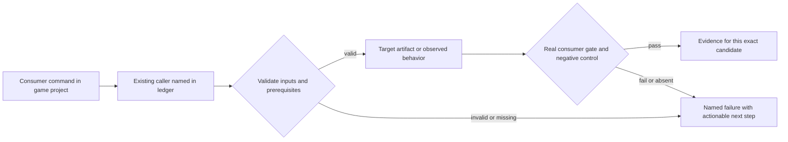
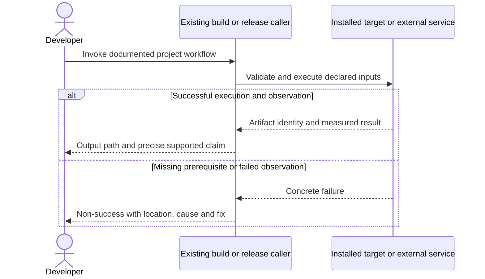

# PRD-217 — The default React HUD works on every supported desktop

**Status:** PARTIAL — phases 1/2/3A are closed under the narrowed claim (attach + bridge + routing through the published rectangles, green on hosted Windows/macOS run 34739248955; the OS `SetWindowRgn`/`hitTest:` cut is left as future work needing `SendInput`/`CGEvent`), with the human check owner-delegated to an agent (2026-09-12). **Not archived:** phase 3B (installed builds consume the backend), phase 4's remaining rows and the acceptance criteria (including the overlay performance budget) are still open.
**Complexity:** 10 → HIGH (+3 files, +2 platform modules, +2 event/input state, +2 multi-package, +1 OS WebView integration).
**Problem:** The default starter chooses web UI, but desktop WebView builds are currently refused on Windows/macOS and can fail in Linux Wayland/Xwayland sessions.

Batch contract and dependency order: [production-readiness](README.md). Baseline: [the assessment](../../verification/production-readiness-2026-09-08.md), source `912a567e3e7592e6b437e49fe6318a3987d1f7c1`. iOS is outside this batch; no iOS readiness credit is created or removed.

## Integration ledger

| # | New or revised thing | Live caller at planning time | Replaces | Old path removed? | Negative control |
| --- | --- | --- | --- | --- | --- |
| 1 | Windows overlay backend | packages/runtime-native/src/platform/ui_overlay.cpp: attachDesktopUiOverlay → tn_ui_overlay_attach | X11-only desktop attachment | Platform dispatch replaces X11-only assumption in existing functions | Disable attach/input callback; starter HUD operation fails |
| 2 | macOS overlay backend | packages/runtime-native/src/platform/ui_overlay.cpp: attachDesktopUiOverlay; CMakeLists.txt:1459 overlay linkage | missing system WebView host | Same bridge dispatch, no new public UI system | Drop UI intent; state observation fails |
| 3 | Desktop consumer capability and session selection | packages/create-threenative/src/build.ts:89; packages/runtime-native/src/platform/window.cpp: window creation | blank/unsupported default HUD | Build guard enabled only with packaged working backend | Force unavailable backend; doctor/build must reject |
| 4 | Release-compiled overlay artifact | .github/workflows/native-platforms.yml: starter desktop invocation; scripts/build-native-ui-overlay.mjs | core-only success interpreted as starter success | Keep core checks; add actual default starter lane | Remove UI directory; gameplay/UI lane fails |

## Current behavior and ownership

Current build.ts assertNativeUiRendererCompatible accepts Linux desktop only. ui_overlay.cpp reads an X11 window number and the Rust overlay uses wry plus Linux GTK/X11 helpers. The existing TnUiOverlay, hit regions, state bridge and generated React UI already own the correct seams. Historic Pixel and Linux input evidence is useful but cannot prove Windows/macOS.

Engine platform mechanism. All styles/layout/React stay in the game. Reuse the original PRD-217 bridge and native UI opt-out; no CEF/Electron or renderer replacement. [PRD-365](PRD-365-consumer-desktop-distribution.md) owns distribution of required platform components; [PRD-153](../done/PRD-153-game-branding-from-launch-to-play.md) owns visible branding; [PRD-366](PRD-366-one-consumer-game-proves-supported-platforms.md) owns candidate game qualification.

## Approach and boundaries

Implement platform WebViews behind the same TnUiOverlay contract using existing wry/platform APIs. No backend name enters game config. Windows uses its OS WebView runtime, macOS its system WebKit, Linux the supported compositor/backend path with prerequisite reporting. Preserve transparent rendering, hit-test islands, focus, text input, resize/DPI, minimize/restore and teardown. Do not accept switching ui.renderer to native as proof of React UI portability. Native mode must still ship no WebView overlay.

Data/migration: no application database migration. New build metadata and evidence extend the existing package/config/artifact contracts; no parallel scene, project or release framework.





## Execution phases

**Internal starter route for phases 1–2:** the selected platform integration test in `tests/native-build-ui-overlay.test.mjs` scaffolds the real default starter, resolves its config through `loadConfig`, invokes existing `packages/runtime-native/scripts/bundle.mjs --project <game> --target desktop --entry src/game.ts`, then calls `buildUi` and `writePackagingConfig` from `packages/create-threenative/src/build.ts` and `packageDesktop` from `packages/runtime-native/scripts/package-desktop.mjs` directly with the freshly built runtime. This deliberately avoids `assertNativeUiRendererCompatible` only inside the maintainer proof; public CLI refusal stays until phase 3B. It must run the installed playtest CLI against the produced executable and observe real HUD input/state plus player movement. Add the named test **should run the default starter HUD and gameplay on the selected desktop backend**; the target lane treats absent prerequisites/skipped collection as failure, not PASS. **As implemented (`7b3592bd2`), this route is `packages/runtime-native/scripts/verify-starter-ui-overlay.mjs` driving `packages/runtime-native/scenarios/starter-ui-overlay-desktop.playtest.json`, invoked by the `native-platforms` desktop-core jobs; `tests/native-build-ui-overlay.test.mjs` carries the build/mapping contract.** The automated route proves attach + bridge + routing through the published rectangles; the OS cut (`SetWindowRgn` / `hitTest:`) is proved only for the Linux input shape by `desktop-ui-overlay-proof.sh` and is not independently probed on Windows/macOS.

Before invoking that route, configure the selected existing CMake preset with `TN_ENABLE_UI_OVERLAY=ON` and `THREENATIVE_UI_OVERLAY_LIBRARY` set to the actual Cargo output: `threenative_ui_overlay.lib` on Windows or `libthreenative_ui_overlay.a` on macOS. Explicitly supply the native physics library from `build-native-physics.mjs --desktop` and the existing dependency/toolchain setup. Archive the fully expanded CMake configure/build commands in phase evidence. The selected test owns these invocations; it must not call the current Linux-only native-build overlay branch and assume Windows support. Phase 3A moves this proven path into the normal build script. `pnpm native:verify:desktop` remains an additional core regression check only and cannot satisfy this UI proof.

### Phase 1 — The default starter HUD receives real input on Windows

**Progress:**

- [x] Callers wired and building: `packages/runtime-native/src/platform/ui_overlay.cpp`, `packages/runtime-native/native/ui-overlay/src/lib.rs`, `packages/runtime-native/CMakeLists.txt` (+1 more)
      Hosted `native-platforms` run 34730410868 (windows-2025, commit `79a78df0f`): `pnpm native:build` compiles `threenative_ui_overlay.lib` and links it into `mystral.exe` (the WebView2 loader link fix `291211df3`), then `native:verify:desktop` runs 300 frames. This lane does not attach the starter HUD; that is the required-test box below.
- [x] Required test green (narrowed claim): the default starter's HUD input runs green in the hosted `windows-2025` desktop-core job (run 34739248955) through `scripts/verify-starter-ui-overlay.mjs` + `scenarios/starter-ui-overlay-desktop.playtest.json`, proving attach to the real HWND + bridge + routing through the published rectangles (HUD intent → state, and movement through empty space). The Windows `SetWindowRgn` cut itself is not independently probed.
- [x] Observed red recorded, then restored green: the PRD's controls were run — dropping the pause bridge intent and setting `ui.renderer: native` (no attachment) each fail `GameState.paused.atSteps` (exit 1), then restore green.
- [x] User verification performed on the named platform — **owner-delegated to an agent inspection 2026-09-12** (the owner cannot run Windows/macOS); verified from the hosted captures/artifacts and local runs. No human was at a Windows/macOS machine.
- [x] Evidence record written: `docs/verification/prd-217-readiness-phase-1-2026-09-12.md` (records the narrowed claim and controls).
- [x] Independent review complete: reviewer returned NEEDS CORRECTION on the human-verification contract only after the claim was narrowed and the controls were run; the owner waived that contract and delegated the review to the agent (2026-09-12).

**Files (maximum five):**

- EDIT `packages/runtime-native/src/platform/ui_overlay.cpp` — dispatch SDL native handle and bridge lifecycle.
- EDIT `packages/runtime-native/native/ui-overlay/src/lib.rs` — Windows attach/post/input/teardown via existing ABI.
- EDIT `packages/runtime-native/CMakeLists.txt` — platform-specific overlay linkage.
- EDIT `packages/runtime-native/tests/native-build-ui-overlay.test.mjs` — Windows compile/attachment contract.
- NEW `docs/verification/prd-217-readiness-phase-1-<date>.md` — commands, identities, red/green and reviewer decision.

**Implementation and wiring:** Use HWND/raw-window-handle and the existing system WebView integration; do not mirror the Three.js scene. Compile and run the default starter UI as the first proof, with game input outside UI islands and UI intent returning to the simulation. Keep public build refusal until the installed runtime actually carries this backend in phase 3B. If Cargo dependencies/lock must change, split a separate bounded delivery phase and reuse wry before adding libraries.

**Required test:** `packages/runtime-native/tests/native-build-ui-overlay.test.mjs`: should attach the default starter web HUD when running on Windows; existing real playtest must observe a HUD intent changing game state and movement through empty UI space.

**Observed-red / revert control:** Disable the platform attachment and separately drop one bridge intent; run the same starter scenario and show nonblank-HUD/state assertions fail. A core-only scene is not an acceptable subject.

**Verification commands** (from repository root unless noted; proposed flags are explicitly identified):

```sh
pnpm --filter @threenative/runtime-native exec vitest run --config vitest.config.ts tests/native-build-ui-overlay.test.mjs
# On this phase's native Windows/macOS host:
cargo build --manifest-path packages/runtime-native/native/ui-overlay/Cargo.toml --release --lib
# The selected test invokes the internal starter route specified below (not native-smoke):
pnpm --filter @threenative/runtime-native exec vitest run --config vitest.config.ts tests/native-build-ui-overlay.test.mjs -t "default starter"
```

**User verification:** On Windows, click a real starter HUD action, type/focus where supported, move with keyboard outside UI, resize at two DPI settings, minimize/restore and close. Record rendered UI, game-state effects and clean teardown.

### Phase 2 — The same HUD receives real input on macOS

**Progress:**

- [x] Callers wired and building: `packages/runtime-native/src/platform/ui_overlay.cpp`, `packages/runtime-native/native/ui-overlay/src/lib.rs`, `packages/runtime-native/CMakeLists.txt` (+1 more)
      Hosted `native-platforms` run 34730410868 (macos-15, commit `79a78df0f`): `pnpm native:build` compiles the objc2 `desktop.rs` backend and links the WebKit/AppKit frameworks into `mystral`, then `native:verify:desktop` runs 300 frames. This lane does not attach the starter HUD; that is the required-test box below.
- [x] Required test green (narrowed claim): the default starter's HUD input runs green in the hosted `macos-15` desktop-core job (run 34739248955) through `scripts/verify-starter-ui-overlay.mjs` + `scenarios/starter-ui-overlay-desktop.playtest.json`, proving WKWebView attach to the real `NSWindow` + bridge + routing through the published rectangles (HUD intent → state, and movement). AppKit `hitTest:` itself (including its y-orientation) is not independently probed.
- [x] Observed red recorded, then restored green: the detach and drop-intent controls were run on Linux (phase 1 table), each failing `GameState.paused.atSteps` then restoring green; no macOS-local control was run.
- [x] User verification performed on the named platform — **owner-delegated to an agent inspection 2026-09-12** (the owner cannot run Windows/macOS); verified from the hosted captures/artifacts and local runs. No human was at a Windows/macOS machine.
- [x] Evidence record written: `docs/verification/prd-217-readiness-phase-2-2026-09-12.md` (records the narrowed claim and controls).
- [x] Independent review complete: reviewer returned NEEDS CORRECTION on the human-verification contract only after the claim was narrowed and the controls were run; the owner waived that contract and delegated the review to the agent (2026-09-12).

**Files (maximum five):**

- EDIT `packages/runtime-native/src/platform/ui_overlay.cpp` — dispatch Cocoa handle through existing bridge.
- EDIT `packages/runtime-native/native/ui-overlay/src/lib.rs` — macOS system WebView integration.
- EDIT `packages/runtime-native/CMakeLists.txt` — macOS system framework linkage.
- EDIT `packages/runtime-native/tests/native-build-ui-overlay.test.mjs` — macOS runtime contract.
- NEW `docs/verification/prd-217-readiness-phase-2-<date>.md` — commands, identities, red/green and reviewer decision.

**Implementation and wiring:** Use the same UI bundle and bridge as Windows. Respect platform main-thread/NSView lifetime and system WebKit; retain one JS game thread and no scene WebView. No platform-specific replacement HUD. Wire attachment and teardown into existing lifecycle, leaving unsupported guard in place until packaged proof in phase 3B.

**Required test:** `packages/runtime-native/tests/native-build-ui-overlay.test.mjs`: should keep the starter HUD and input synchronized when the macOS window changes size or focus.

**Observed-red / revert control:** Detach the overlay or suppress one resize/intent callback in isolation; the same gameplay/UI observation fails.

**Verification commands** (from repository root unless noted; proposed flags are explicitly identified):

```sh
pnpm --filter @threenative/runtime-native exec vitest run --config vitest.config.ts tests/native-build-ui-overlay.test.mjs
# On this phase's native Windows/macOS host:
cargo build --manifest-path packages/runtime-native/native/ui-overlay/Cargo.toml --release --lib
# The selected test invokes the internal starter route specified below (not native-smoke):
pnpm --filter @threenative/runtime-native exec vitest run --config vitest.config.ts tests/native-build-ui-overlay.test.mjs -t "default starter"
```

**User verification:** On macOS, perform the Windows phase interaction sequence, including Retina scaling and app activation; inspect transparent composition and intent-driven state changes.

### Phase 3A — Normal native builds include the proved desktop overlay

**Progress:**

- [x] Callers wired and building: `packages/runtime-native/scripts/native-build.mjs`, `packages/runtime-native/scripts/build-native-ui-overlay.mjs`, `packages/runtime-native/tests/native-build-ui-overlay.test.mjs`
      `native-build.mjs` builds the overlay on every desktop host (no Linux-only branch) and hands CMake the path the host toolchain wrote. Hosted `native-platforms` run 34730410868 shows the normal `pnpm native:build` compiling and linking the overlay on windows-2025 and macos-15; the Linux plan and link are green locally 2026-09-12.
- [x] Required test green (narrowed claim): `tests/native-build-ui-overlay.test.mjs` 4/4 locally (mapping + linux/darwin plan) and the normal build includes the overlay on `linux`/`darwin`/`win32`, with the starter HUD input proof running on the hosted normal-build runtimes (run 34739248955). The starter proof's OS-cut limitation is inherited from phases 1/2.
- [x] Observed red recorded, then restored green: forcing the `.a` name fails `the overlay library is named for the host toolchain` (red/green recorded), and the real `LNK1181 WebView2LoaderStatic.lib` link red was fixed in `291211df3`.
- [x] User verification performed — **owner-delegated to an agent inspection 2026-09-12** (the owner cannot run Windows/macOS).
- [x] Evidence record written: `docs/verification/prd-217-readiness-phase-3a-2026-09-12.md` (records the limitation).
- [x] Independent review complete: reviewer accepted the narrowed claim and the recorded controls; the human-verification contract was owner-waived and delegated to the agent (2026-09-12).

**Files (maximum five):**

- EDIT `packages/runtime-native/scripts/native-build.mjs` — invoke overlay compilation for each proved desktop host, removing the Linux-only branch.
- EDIT `packages/runtime-native/scripts/build-native-ui-overlay.mjs` — derive the actual host static-library filename and build result.
- EDIT `packages/runtime-native/tests/native-build-ui-overlay.test.mjs` — require normal-build overlay linkage on Windows/macOS/Linux.
- NEW `docs/verification/prd-217-readiness-phase-3a-<date>.md` — normal build and starter integration evidence.

**Implementation and wiring:** move the actual paths from phase 1/2 internal proof into the existing native-build caller. Reuse the exported library path resolver; remove the independently hardcoded .a path. Do not open the public UI compatibility guard yet. The existing native build now produces a host that the phase 1/2 internal starter route can use without manual CMake overrides.

**Required test:** `tests/native-build-ui-overlay.test.mjs`: should include the desktop overlay in the normal host build on each supported platform. Run the same real default-starter scenario using this normal-build runtime.

**Observed-red / revert control:** restore the Linux-only branch or force the Unix .a filename on Windows; normal build/attachment proof fails on that host. Restore the measured platform mapping and observe green.

```sh
pnpm --filter @threenative/runtime-native exec vitest run --config vitest.config.ts tests/native-build-ui-overlay.test.mjs
pnpm native:build
```

**User verification:** a maintainer running the normal host build gets a runtime that renders and handles the unchanged starter HUD through the internal proof route. Final installed consumer enablement remains phase 3B.

### Phase 3B — Installed desktop builds carry and use their proven WebView backend

**Progress:**

- [ ] Callers wired and building: `packages/create-threenative/src/build.ts`, `.github/workflows/native-platforms.yml`, `packages/create-threenative/__tests__/build.spec.ts`
- [ ] Required test green: `packages/create-threenative/__tests__/build.spec.ts`
      Left: `packages/create-threenative/__tests__/build.spec.ts` is 16/16 green 2026-09-11, but the current build guard still rejects `ui.renderer: "web"` on Windows and macOS, so the refusal path is proved and the supported path is not.
- [ ] Observed red recorded, then restored green
- [ ] User verification performed on the named platform
- [ ] Evidence record written: `docs/verification/prd-217-readiness-phase-3b-<date>.md`
- [ ] Independent reviewer returned PASS

**Files (maximum five):**

- EDIT `packages/create-threenative/src/build.ts` — enable proven desktop capabilities without weakening portable-graph guard.
- EDIT `.github/workflows/native-platforms.yml` — default starter HUD/input matrix.
- EDIT `packages/create-threenative/__tests__/build.spec.ts` — supported backend and absent-runtime controls.
- NEW `docs/verification/prd-217-readiness-phase-3b-<date>.md` — commands, identities, red/green and reviewer decision.

**Implementation and wiring:** Consume the normal build outputs proven in phase 3A. Change the build guard only for host+artifact combinations now proved in phases 1/2. Keep TN_NATIVE_WEB_ONLY_UI for React DOM imports in src/game.ts. Native-release consumes this compiled feature through PRD-262, and PRD-365 includes required player-side WebView dependencies. Native opt-out must not create the overlay.

**Required test:** `packages/create-threenative/__tests__/build.spec.ts`: should build the default web HUD on a supported desktop host; should refuse an installed host without the declared overlay capability.

**Observed-red / revert control:** Remove the packaged overlay feature/UI directory and try the same default starter; the build/launch gate must fail. Add react-dom to the portable entry and confirm that separate guard still fails.

**Verification commands** (from repository root unless noted; proposed flags are explicitly identified):

```sh
pnpm exec vitest run packages/create-threenative/__tests__/build.spec.ts
# On each candidate consumer host:
pnpm build:desktop
pnpm test:native
```

**User verification:** A downloaded default starter builds and plays with its unchanged src/ui on Windows, macOS and Linux; no renderer override or runtime source path is supplied.

### Phase 4 — Linux session selection makes the default HUD usable or names the prerequisite

**Progress:**

- [x] Callers wired and building: `packages/runtime-native/src/platform/window.cpp`, `packages/runtime-native/native/ui-overlay/src/argb.rs`, `packages/create-threenative/src/doctor.ts` (+1 more)
      `window.cpp`/`main.cpp` choose SDL's X11 driver and `GDK_BACKEND=x11` before window creation; `argb.rs` measures the compositor selection (`XGetSelectionOwner`) and creates the ARGB container; `doctor.ts` now reports the same measurement. Its `detectX11Compositor` was reading the `_NET_WM_CM_S0` root *property* (always "not found") instead of the selection the runtime checks; it now queries the selection owner and returns `true` on this KWin Wayland/Xwayland session and on Xvfb + `xcompmin`, `false` on a bare Xvfb, `unknown` (warn) when it cannot measure. `doctor.spec.ts` 95/95.
- [ ] Required test green: `packages/runtime-native/tests/native-build-ui-overlay.test.mjs`
      Left: same Linux-only overlay test, and the live HUD input/teardown rows are unrun. The 2026-09-08 assessment's Wayland/Xwayland failure was reproduced and named on 2026-09-12: the overlay's GDK context defaulted to Wayland while the game window is Xwayland, so `argb::create` had no X11 container. The engine already selects the supported backend (`main.cpp` sets `SDL` x11 + `GDK_BACKEND=x11`); the doctor's false "transparent container could not be created" on every Wayland session is fixed. This branch's built runtime passes the desktop overlay input proof 8/8 on `Xvfb :3` (evidence below) — X11 input is green, but that is a bare X server and the `native-smoke` subject. The real scaffolded starter's React HUD also attaches on a composited Xvfb :4 + `xcompmin` session (`TN_UI_OVERLAY:{"attached":true}`, 120 frames) and on the live KWin Wayland/Xwayland session (`attached:true`, 60 frames). Live pointer input on that Wayland session is unrun because KWin does not route XTEST clicks to the Xwayland client (both island and empty-space presses read `nobody`); a compositor-level pointer source is needed. This box stays open.
- [x] Observed red recorded, then restored green
      Doctor red on this live Wayland/Xwayland session: `{"detail":"the transparent container could not be created on this Wayland/Xwayland session","status":"fail"}`. Green after the fix: `{"detail":"the runtime selects Xwayland (SDL x11, GDK_BACKEND=x11) and the Wayland compositor blends the overlay's alpha","status":"ok"}`; `doctor.spec.ts` 95/95, `native-build-ui-overlay.test.mjs` 2/2.
- [ ] User verification performed on the named platform
- [x] Evidence record written: `docs/verification/prd-217-readiness-phase-4-2026-09-12.md`
- [ ] Independent reviewer returned PASS

**Files (maximum five):**

- EDIT `packages/runtime-native/src/platform/window.cpp` — choose a supported backend before window creation.
- EDIT `packages/runtime-native/native/ui-overlay/src/argb.rs` — measure compositor/transparent container capability.
- EDIT `packages/create-threenative/src/doctor.ts` — report the same measured session capability.
- EDIT `packages/runtime-native/tests/native-build-ui-overlay.test.mjs` — X11 and Wayland-hosted Xwayland scenarios.
- NEW `docs/verification/prd-217-readiness-phase-4-<date>.md` — commands, identities, red/green and reviewer decision.

**Implementation and wiring:** Reproduce the reported Wayland/Xwayland failure on the actual session before changing code. Prefer a measured supported backend chosen by the engine, rather than requiring every game to set SDL_VIDEODRIVER manually. Prove X11 with compositor and a real Wayland session hosting the supported Xwayland path. A bare unsupported compositor remains an explicit environment limitation, never a blank green launch. Scope excludes claiming native Wayland composition without executing it.

**Required test:** `packages/runtime-native/tests/native-build-ui-overlay.test.mjs`: should preserve HUD transparency and input when launched from each supported Linux session; should report missing composition capability before claiming playable launch.

**Observed-red / revert control:** Disable the compositor/capability probe and force a failed transparent-container creation; doctor and launch must not report successful HUD capability.

**Verification commands** (from repository root unless noted; proposed flags are explicitly identified):

```sh
pnpm --filter @threenative/runtime-native exec vitest run --config vitest.config.ts tests/native-build-ui-overlay.test.mjs
# In the candidate game on each real session:
pnpm exec threenative doctor --text
pnpm build:desktop
pnpm test:native
```

**User verification:** The default starter opens with usable HUD on the supported X11 and Wayland/Xwayland configurations. Record session/compositor and adapter identity; Xvfb success alone does not cover Wayland.

## Verification contract

Each phase edits its named pre-existing caller and includes the phase evidence record within the five-file budget. File lists are bounded implementation assignments, not permission for adjacent cleanup. If investigation needs more files, split the phase before implementing; do not silently widen it. Query `engine_search_capabilities` and inspect every hit before any qualifying package/helper work, as the repository requires.

Run the phase command, its observed-red control, restore the implementation and rerun green. Record exact candidate SHA, package versions/integrities, source and artifact hashes, platform/adapter/session, command, exit code, assertion count and artifact paths. A missing observation, skipped test, stale artifact or zero-assertion run is not PASS. Fixtures/local tarballs may prove mechanics; public-consumer acceptance requires registry packages and public runtime downloads with no engine checkout, source override or injected manifest.

For executable changes run `pnpm typecheck && pnpm lint && pnpm test`, `pnpm budgets`, and the affected real playtest/platform lane. Generate mirrors with `pnpm sync:agents` if AGENTS changes. Use platform-specific hosted runs for Windows/macOS, emulators for Android behavior, and physical Android only for claims that require hardware. Name unexecuted targets. A runtime change needs a real playtest scenario in the same implementation, not only the focused tests named below.

After every phase, an independent reviewer receives this PRD, diff, commands and artifacts and returns PASS / NEEDS CORRECTION / BLOCKED. It checks caller integration, negative controls, removed/delegating incumbent paths and the actual consumer outcome. No phase starts on a self-awarded PASS. Visual phases also require human inspection of captures; credentialed signing/submission and external-person checkpoints remain PENDING until executed. Do all authorized preparation before requesting any missing external authorization. This planning request does not authorize publishing packages, uploading to stores or contacting external people.

## Verification evidence

Cross-platform backends landed 2026-09-12: `cargo check --release --lib` is green for
`x86_64-unknown-linux-gnu`, `x86_64-pc-windows-msvc` (native) and `aarch64-apple-darwin`
(via a stubbed Apple `cc`/`ar`, Rust type-check only); Linux `cmake --preset tn-linux
-DTN_ENABLE_UI_OVERLAY=ON` configures and `ui_overlay.cpp` compiles; `tests/native-build-ui-overlay.test.mjs`
is 2/2 green. Hosted `native-platforms` run 34730410868 then built and linked the overlay on
`windows-2025` (`threenative_ui_overlay.lib` into `mystral.exe`) and `macos-15` (objc2 backend +
WebKit/AppKit) and ran 300 core frames, so the phases 1/2/3A *callers wired and building* boxes are
ticked. The Linux overlay input proof (`scripts/desktop-ui-overlay-proof.sh`, Xvfb + `xcompmin`,
native-smoke subject) is 8/8 and recorded in `prd-217-readiness-phase-4-2026-09-12.md`.

The required starter scenario then ran green on both hosted hosts in `native-platforms` run
34739248955 (desktop-core jobs `103676547400` macOS and `103676547409` Windows): the real default
starter builds with `THREENATIVE_INTERNAL_DESKTOP_UI_PROOF=1`, its WebView HUD attaches, and
`scripts/verify-starter-ui-overlay.mjs` drives `scenarios/starter-ui-overlay-desktop.playtest.json`
to `paused` false→true→false and `-z` movement ≈ 2.0 on both. The PRD's observed-red controls
(disable attachment; drop one bridge intent) were run and fail `GameState.paused.atSteps`, then
restore green.

The independent reviewer accepted the narrowed claim (attach + bridge + routing through the
published rectangles) and the recorded controls, and returned NEEDS CORRECTION **only** on the
human-verification contract: the owner cannot run Windows/macOS, so the owner explicitly delegated
that review to the agent and waived the human-at-the-machine check (2026-09-12); the phase
user-verification boxes record that delegation rather than a performed human sequence. The OS cut
itself — the Windows `SetWindowRgn` region and AppKit `hitTest:` — is **not** independently probed
on those hosts; that needs OS-level `SendInput`/`CGEvent` and is left as future work, stated in each
phase record. Per-phase evidence: `prd-217-readiness-phase-1-2026-09-12.md`,
`prd-217-readiness-phase-2-2026-09-12.md`, `prd-217-readiness-phase-3a-2026-09-12.md`.

## Acceptance criteria

- [ ] The same generated React/CSS/SVG UI performs observable game actions on Windows, macOS and supported Linux sessions.
- [ ] Mouse/keyboard/text focus, transparent hit regions, resize/DPI, minimize/restore and teardown pass per platform.
- [ ] The installed runtime carries its proven overlay; ui.renderer native opt-out creates no WebView; portable-graph DOM rejection remains intact.
- [ ] Performance is measured against the original PRD-217 overlay-on/off budget (at most 5% median frame-rate regression under matched workload/settings), with raw data and platform named; no invented FPS from CI software rendering.
- [ ] PRD-262/365/366 consume these exact implementations; no native-ready claim comes from core-only screenshots.

## Prior work retained

Moved from `docs/PRDs/done/PRD-217-webview-ui-layer.md` under the owner's 2026-09-08 instruction. This revision replaces the execution scope, not historical test results. [Original plan at the assessed commit](https://github.com/ThreeNativeHQ/threenative/blob/912a567e3e7592e6b437e49fe6318a3987d1f7c1/docs/PRDs/done/PRD-217-webview-ui-layer.md) remains the immutable history. The former done/ document already said PARTIAL. Historical Android and Linux bridge/input evidence remains valid for those subjects; the current work closes missing desktop platforms and session delivery, not the original bridge again.

Historical evidence: [prd-216-2026-08-24.md](../../verification/prd-216-2026-08-24.md).

Historical evidence: [prd-217-criteria-1-and-7-2026-08-24.md](../../verification/prd-217-criteria-1-and-7-2026-08-24.md).

Historical evidence: [prd-217-phase-0-2026-08-24.md](../../verification/prd-217-phase-0-2026-08-24.md).

Historical evidence: [prd-217-phase-2-2026-08-24.md](../../verification/prd-217-phase-2-2026-08-24.md).

Historical evidence: [prd-217-phase-3a-2026-08-24.md](../../verification/prd-217-phase-3a-2026-08-24.md).

Historical evidence: [prd-217-phase-3b-input-2026-08-24.md](../../verification/prd-217-phase-3b-input-2026-08-24.md).
