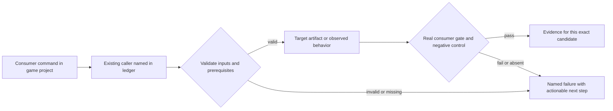
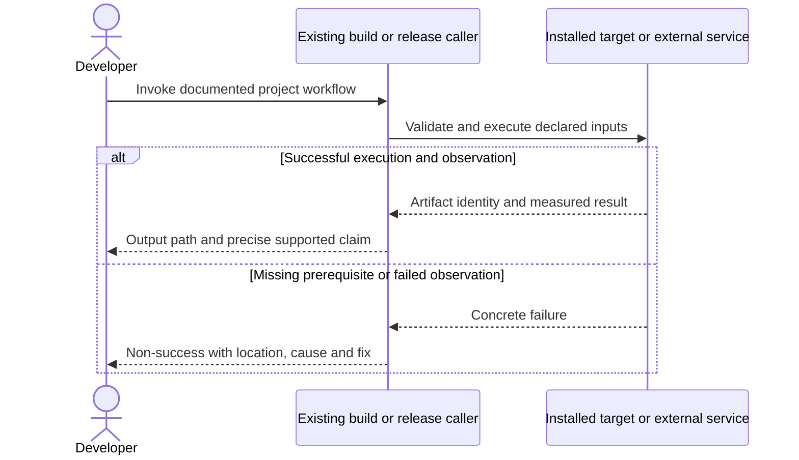

# PRD-221 — The default Android V8 distribution is 16 KB compatible

**Status:** PROPOSED — prior toolchain blocker retained as history and must be retried. Revised 2026-09-08; planning only. **A 16 KB environment is available locally as of 2026-09-11**: `system-images;android-36;google_apis_ps16k;x86_64` boots headless on KVM and reports `getconf PAGE_SIZE` 16384, so phase 3's observation does not require a flashed physical device. Prove it there before editing the hosted workflow.
**Complexity:** 8 → HIGH (+3 files, +2 native dependency integration, +2 multi-ABI release coordination, +1 upstream integration).
**Problem:** The default V8 shared library has documented 4 KB alignment, so successful execution on ordinary devices does not establish Android 16 KB compatibility.

Batch contract and dependency order: [production-readiness](README.md). Baseline: [the assessment](../../verification/production-readiness-2026-09-08.md), source `912a567e3e7592e6b437e49fe6318a3987d1f7c1`. iOS is outside this batch; no iOS readiness credit is created or removed.

## Integration ledger

| # | New or revised thing | Live caller at planning time | Replaces | Old path removed? | Negative control |
| --- | --- | --- | --- | --- | --- |
| 1 | Aligned V8 artifacts | packages/runtime-native/scripts/download-deps.mjs: Android V8 provisioner | 4 KB-only dependency | Replace original pin/provisioning route in place | Use old V8 library; LOAD alignment gate fails |
| 2 | Complete native library alignment gate | packages/runtime-native/scripts/package-android.mjs: prepareAndroidPrebuilts/packageAndroid | partial owned-library alignment proof | Existing checker covers all shipped ABIs/libraries | Omit an ABI or add a 4 KB .so; final package gate fails |
| 3 | Real 16 KB launch proof | .github/workflows/native-platforms.yml: Android emulator lane | 4 KB device success used as universal proof | Add environment-specific result to existing lane | Report 4096-byte pages as 16 KB; evidence validator rejects |

## Current behavior and ownership

The runtime contract identifies libv8android.so as the remaining misaligned input. The existing download-deps flow, per-ABI V8 snapshots and alignment checker are the reuse points. The prior plan allowed BLOCKED as an alternative completion outcome; this revision does not.

Engine native dependency layer. Owns aligned V8/runtime inputs and behavior parity. [PRD-212](PRD-212-published-install-builds-android.md) owns final APK/AAB validation and Android SDK/release mode; [PRD-262](PRD-262-the-runtime-native-prebuilt-release-exists.md) transports these exact binaries. No default-engine switch to QuickJS may satisfy this PRD.

## Approach and boundaries

Retry the previously missing V8 source/toolchain step and record the actual result. Prefer a maintained checksum-pinned compatible binary only after checking architecture, snapshot, pointer-compression ABI and native symbols; otherwise build reproducibly through download-deps using owned inputs. Keep V8 default and retain QuickJS as an explicitly measured alternative. Inspect every packaged .so, including transitive libraries, plus archive alignment; an ELF-only check is insufficient final-app proof. Verify current official Android requirements again at implementation.

Data/migration: no application database migration. New build metadata and evidence extend the existing package/config/artifact contracts; no parallel scene, project or release framework.





## Execution phases

### Phase 1 — Default V8 is provisioned with aligned libraries for both Android ABIs

**Progress:**

- [ ] Callers wired and building: `packages/runtime-native/scripts/download-deps.mjs`, `packages/runtime-native/android/app/build.gradle.kts`, `packages/runtime-native/tests/android-16kb-alignment.test.mjs`
      Left: `docs/verification/prd-221-readiness-phase-1-2026-09-10.md` reads **INCOMPLETE — implementation preparation, not Android 16 KB qualification**. Continue in PR #167, branch `codex/prd-221-android-v8-16kb`; slices #171, #172 and #173 are already included.
- [ ] Required test green: `packages/runtime-native/tests/android-16kb-alignment.test.mjs`
- [ ] Observed red recorded, then restored green
- [ ] User verification performed on the named platform
- [ ] Evidence record written: `docs/verification/prd-221-readiness-phase-1-<date>.md`
- [ ] Independent reviewer returned PASS

**Files (maximum five):**

- EDIT `packages/runtime-native/scripts/download-deps.mjs` — pin/provision compatible aligned V8 inputs.
- EDIT `packages/runtime-native/android/app/build.gradle.kts` — retain matching engine ABI/snapshot/STL staging.
- EDIT `packages/runtime-native/tests/android-16kb-alignment.test.mjs` — test actual provisioned library alignment.
- NEW `docs/verification/prd-221-readiness-phase-1-<date>.md` — commands, identities, red/green and reviewer decision.

**Implementation and wiring:** Recheck the old blocker, record upstream/source choice with license and reproducibility inputs, and integrate it into the existing provisioner. Keep arm64-v8a and x86_64 snapshots tied to their actual V8 artifacts. If source builds need another script, split the phase and name that script and caller before implementation. Missing source/toolchain remains a named pending dependency, never DONE.

**Required test:** `packages/runtime-native/tests/android-16kb-alignment.test.mjs`: should reject the old V8 binary when provisioning a 16 KB candidate; inspect actual LOAD segments on both supplied ABIs.

**Observed-red / revert control:** Feed the historical misaligned binary to the same provisioned-artifact check. Observe filename and alignment in red, then verify the replacement binary and matching startup snapshot.

**Verification commands** (from repository root unless noted; proposed flags are explicitly identified):

```sh
node packages/runtime-native/scripts/download-deps.mjs --android
pnpm --filter @threenative/runtime-native exec vitest run --config vitest.config.ts tests/android-16kb-alignment.test.mjs
```

**User verification:** Build the default V8 native Android host and boot a real-game candidate; log identifies V8 and matching ABI, rather than silently choosing QuickJS.

### Phase 2 — The packaged application rejects any misaligned native dependency

**Progress:**

- [ ] Callers wired and building: `packages/runtime-native/scripts/check-android-16kb-alignment.mjs`, `packages/runtime-native/scripts/package-android.mjs`, `packages/runtime-native/tests/android-packaging.integration.test.mjs`
- [ ] Required test green: `packages/runtime-native/tests/android-packaging.integration.test.mjs`
- [ ] Observed red recorded, then restored green
- [ ] User verification performed on the named platform
- [ ] Evidence record written: `docs/verification/prd-221-readiness-phase-2-<date>.md`
- [ ] Independent reviewer returned PASS

**Files (maximum five):**

- EDIT `packages/runtime-native/scripts/check-android-16kb-alignment.mjs` — complete library census and archive checks.
- EDIT `packages/runtime-native/scripts/package-android.mjs` — invoke validation on the produced artifact.
- EDIT `packages/runtime-native/tests/android-packaging.integration.test.mjs` — assert every shipped .so and ABI is inspected.
- NEW `docs/verification/prd-221-readiness-phase-2-<date>.md` — commands, identities, red/green and reviewer decision.

**Implementation and wiring:** Invoke validation from the live packager after artifact assembly and before reporting success. Inspect final APK and AAB-derived APKs for ELF and ZIP alignment using official Android tooling; never inspect only the build directory. Delegate shared logic to the existing checker. Preserve unstripped symbols as separate diagnostics, not copied credential-bearing build directories.

**Required test:** `packages/runtime-native/tests/android-packaging.integration.test.mjs`: should reject a completed Android artifact when any packaged native library has incompatible alignment; should reject an empty library census.

**Observed-red / revert control:** Insert a 4 KB-aligned fixture .so into an otherwise valid disposable package and omit one ABI result separately; each final-artifact check fails rather than ignoring the dependency.

**Verification commands** (from repository root unless noted; proposed flags are explicitly identified):

```sh
pnpm --filter @threenative/runtime-native exec vitest run --config vitest.config.ts tests/android-16kb-alignment.test.mjs tests/android-packaging.integration.test.mjs
# In the candidate game:
pnpm build:android
```

**User verification:** Inspect the final artifact report listing each library/ABI/alignment and artifact hash; no uninspected library is credited.

### Phase 3 — The real game launches on a verified 16 KB Android environment

**Progress:**

- [ ] Callers wired and building: `.github/workflows/native-platforms.yml`, `packages/runtime-native/tests/native-platform-workflow.test.mjs`
- [ ] Required test green: `packages/runtime-native/tests/native-platform-workflow.test.mjs`
- [ ] Observed red recorded, then restored green
- [ ] User verification performed on the named platform
- [ ] Evidence record written: `docs/verification/prd-221-readiness-phase-3-<date>.md`
- [ ] Independent reviewer returned PASS

**Files (maximum five):**

- EDIT `.github/workflows/native-platforms.yml` — run a 16 KB emulator and real game scenario.
- EDIT `packages/runtime-native/tests/native-platform-workflow.test.mjs` — require observed page size and selected target.
- NEW `docs/verification/prd-221-readiness-phase-3-<date>.md` — commands, identities, red/green and reviewer decision.

**Implementation and wiring:** Use the default starter with React UI, physics and assets, not a standalone V8 hello-world. Prove `getconf PAGE_SIZE` is 16384 on the selected emulator and record actual engine, ABI, package ID and APK hash. Take the local 16 KB AVD (`system-images;android-36;google_apis_ps16k;x86_64`) first and record that observation; the workflow edit then wires the same proof into the hosted lane rather than discovering it there. Run the existing Android playtest target; keep an ordinary 4 KB result separate. PRD-366 supplies physical performance proof.

**Required test:** `packages/runtime-native/tests/native-platform-workflow.test.mjs`: should reject 16 KB qualification when the observed page size is missing or 4096.

**Observed-red / revert control:** Substitute the 4 KB observation and then remove the gameplay assertion result; the existing lane must refuse both.

**Verification commands** (from repository root unless noted; proposed flags are explicitly identified):

```sh
pnpm --filter @threenative/runtime-native exec vitest run --config vitest.config.ts tests/native-platform-workflow.test.mjs
# In the selected emulator environment:
adb shell getconf PAGE_SIZE
```

**User verification:** Launch the default starter, interact with HUD and player, background/resume it and inspect logs for linker failures. Record 16 KB result and gameplay assertions together.

## Verification contract

Each phase edits its named pre-existing caller and includes the phase evidence record within the five-file budget. File lists are bounded implementation assignments, not permission for adjacent cleanup. If investigation needs more files, split the phase before implementing; do not silently widen it. Query `engine_search_capabilities` and inspect every hit before any qualifying package/helper work, as the repository requires.

Run the phase command, its observed-red control, restore the implementation and rerun green. Record exact candidate SHA, package versions/integrities, source and artifact hashes, platform/adapter/session, command, exit code, assertion count and artifact paths. A missing observation, skipped test, stale artifact or zero-assertion run is not PASS. Fixtures/local tarballs may prove mechanics; public-consumer acceptance requires registry packages and public runtime downloads with no engine checkout, source override or injected manifest.

For executable changes run `pnpm typecheck && pnpm lint && pnpm test`, `pnpm budgets`, and the affected real playtest/platform lane. Generate mirrors with `pnpm sync:agents` if AGENTS changes. Use platform-specific hosted runs for Windows/macOS, emulators for Android behavior, and physical Android only for claims that require hardware. Name unexecuted targets. A runtime change needs a real playtest scenario in the same implementation, not only the focused tests named below.

After every phase, an independent reviewer receives this PRD, diff, commands and artifacts and returns PASS / NEEDS CORRECTION / BLOCKED. It checks caller integration, negative controls, removed/delegating incumbent paths and the actual consumer outcome. No phase starts on a self-awarded PASS. Visual phases also require human inspection of captures; credentialed signing/submission and external-person checkpoints remain PENDING until executed. Do all authorized preparation before requesting any missing external authorization. This planning request does not authorize publishing packages, uploading to stores or contacting external people.

## Verification evidence

No implementation gate was run by this planning revision. Every new phase is **NOT RUN**. Write each phase to `docs/verification/prd-<id>-readiness-phase-<n>-<date>.md` (the evidence file listed in each phase); use the existing runtime performance ledger for new performance measurements. Fill actual results and non-test `file:line` callers at implementation time; a phase cannot close with placeholders. Acceptance boxes below remain unchecked until all phase checkpoints pass.

## Acceptance criteria

- [ ] Both shipped 64-bit ABIs use reproducible aligned V8 inputs with matching snapshot/STL/engine configuration.
- [ ] Every final packaged shared library and relevant APK archive alignment is checked; omission/corruption controls fail.
- [ ] A default-V8 starter executes gameplay on an observed 16384-byte Android environment.
- [ ] No switch to QuickJS, dismissed warning dialog or unchanged 4 KB execution substitutes for compatibility.
- [ ] Prior upstream/toolchain blocker is retried; unresolved prerequisites keep this PRD incomplete.

## Prior work retained

Moved from `docs/PRDs/BLOCKED/requires-v8-source-toolchain/PRD-221-android-v8-is-16kb-clean.md` under the owner's 2026-09-08 instruction. This revision replaces the execution scope, not historical test results. [Original plan at the assessed commit](https://github.com/ThreeNativeHQ/threenative/blob/912a567e3e7592e6b437e49fe6318a3987d1f7c1/docs/PRDs/BLOCKED/requires-v8-source-toolchain/PRD-221-android-v8-is-16kb-clean.md) remains the immutable history. The old decision memo is retained as evidence. The new acceptance bar requires an actual aligned artifact and run; filing BLOCKED is not an alternative success.
