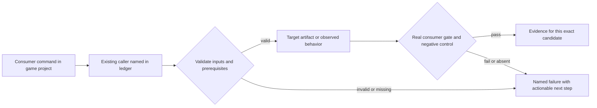
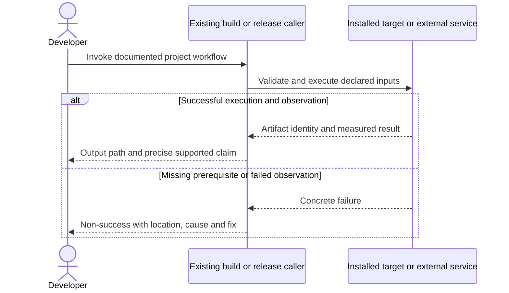

# PRD-221 — The default Android V8 distribution is 16 KB compatible

**Status:** PARTIAL — all three phases are implemented and locally verified; **only the three
independent-reviewer boxes remain open**. Phase 1's implementation landed on `main` as PR #167
(2026-09-11) and its red/green control and user verification are now recorded. Phase 2's packager
census rejects a real misaligned APK and passes the freshly rebuilt starter. Phase 3's
`getconf PAGE_SIZE` **16384** is observed on the local `threenative_ps16k` AVD, the default starter
boots V8 11.0.226.16 there and presents frames, and a background/resume cycle is observed. Prior
toolchain blocker retried and resolved (recipe 6). **A 16 KB environment is available locally as of
2026-09-11**: `system-images;android-36;google_apis_ps16k;x86_64` boots headless on KVM and reports
`getconf PAGE_SIZE` 16384, so phase 3's observation does not require a flashed physical device.
**Complexity:** 8 → HIGH (+3 files, +2 native dependency integration, +2 multi-ABI release coordination, +1 upstream integration).
**Problem:** The default V8 shared library has documented 4 KB alignment, so successful execution on ordinary devices does not establish Android 16 KB compatibility.

Batch contract and dependency order: [production-readiness](README.md). Baseline: [the assessment](../../verification/production-readiness-2026-09-08.md), source `912a567e3e7592e6b437e49fe6318a3987d1f7c1`. iOS is outside this batch; no iOS readiness credit is created or removed.

## Integration ledger

| # | New or revised thing | Live caller at planning time | Replaces | Old path removed? | Negative control |
| --- | --- | --- | --- | --- | --- |
| 1 | Aligned V8 artifacts | packages/runtime-native/scripts/download-deps.mjs: Android V8 provisioner | 4 KB-only dependency | Replace original pin/provisioning route in place | Use old V8 library; LOAD alignment gate fails |
| 2 | Complete native library alignment gate | packages/runtime-native/scripts/package-android.mjs: prepareAndroidPrebuilts/packageAndroid | partial owned-library alignment proof | Existing checker covers all shipped ABIs/libraries | Omit an ABI or add a 4 KB .so; final package gate fails |
| 3 | Real 16 KB launch proof | .github/workflows/native-platforms.yml: Android emulator lane | 4 KB device success used as universal proof | Add environment-specific result to existing lane | Report 4096-byte pages as 16 KB; evidence validator rejects |

## Current behavior and ownership

The runtime contract identifies libv8android.so as the remaining misaligned input. The existing download-deps flow, per-ABI V8 snapshots and alignment checker are the reuse points. The prior plan allowed BLOCKED as an alternative completion outcome; this revision does not.

Engine native dependency layer. Owns aligned V8/runtime inputs and behavior parity. [PRD-212](PRD-212-published-install-builds-android.md) owns final APK/AAB validation and Android SDK/release mode; [PRD-262](PRD-262-the-runtime-native-prebuilt-release-exists.md) transports these exact binaries. No default-engine switch to QuickJS may satisfy this PRD.

## Approach and boundaries

Retry the previously missing V8 source/toolchain step and record the actual result. Prefer a maintained checksum-pinned compatible binary only after checking architecture, snapshot, pointer-compression ABI and native symbols; otherwise build reproducibly through download-deps using owned inputs. Keep V8 default and retain QuickJS as an explicitly measured alternative. Inspect every packaged .so, including transitive libraries, plus archive alignment; an ELF-only check is insufficient final-app proof. Verify current official Android requirements again at implementation.

Data/migration: no application database migration. New build metadata and evidence extend the existing package/config/artifact contracts; no parallel scene, project or release framework.





## Execution phases

### Phase 1 — Default V8 is provisioned with aligned libraries for both Android ABIs

**Progress:**

- [x] Callers wired and building: `packages/runtime-native/scripts/download-deps.mjs`, `packages/runtime-native/android/app/build.gradle.kts`, `packages/runtime-native/tests/android-16kb-alignment.test.mjs` — **PR #167 merged to `main` 2026-09-11** (`48276b273`). `download-deps.mjs:31` imports `assertAndroid16KbAlignment` and calls it at `:1019` on every built `.so`; `build-android-v8.mjs:147` asserts it on the provisioned V8; `build.gradle.kts:35` records the 3.2.30 bump made for 16 KB alignment. Verified on `main`, not assumed.
- [x] Required test green: `packages/runtime-native/tests/android-16kb-alignment.test.mjs` — 34 passed, run locally 2026-09-11 against `main`.
- [x] Observed red recorded, then restored green — the historical 4 KB payload still in the
      primary checkout (`arm64` sha256 `eddea92d4cea2ac34e373629327c6293981444fdaf93f8b16986a17effd33124`)
      is rejected by `assertAndroid16KbAlignment` as `ANDROID_16KB_MISALIGNED` with LOAD `0x1000`;
      the recipe-6 replacement (sha256 `aa3b488c35ddb346097c3b058526cd7e8d6ba5321e2ea46afc7349fa9af3f221`)
      passes with LOAD `0x4000`. Real binaries, not fixtures.
- [x] User verification performed on the named platform — a default-V8 starter (`prd221-16kb-starter.apk`,
      sha256 `6acd46affa374b022a88a506c9e173178c58b1b4abd45b740983a16376f14aab`) booted on
      `threenative_ps16k` (`getconf PAGE_SIZE` 16384) and logged `[V8] V8 initialized successfully`,
      `Version: 11.0.226.16`, then presented frames. V8, not QuickJS.
- [x] Evidence record written: `docs/verification/prd-221-readiness-phase-1-2026-09-11.md` — supersedes the
      INCOMPLETE `…-2026-09-10.md` record.
- [ ] Independent reviewer returned PASS

**Files (maximum five):**

- EDIT `packages/runtime-native/scripts/download-deps.mjs` — pin/provision compatible aligned V8 inputs.
- EDIT `packages/runtime-native/android/app/build.gradle.kts` — retain matching engine ABI/snapshot/STL staging.
- EDIT `packages/runtime-native/tests/android-16kb-alignment.test.mjs` — test actual provisioned library alignment.
- NEW `docs/verification/prd-221-readiness-phase-1-<date>.md` — commands, identities, red/green and reviewer decision.

**Implementation and wiring:** Recheck the old blocker, record upstream/source choice with license and reproducibility inputs, and integrate it into the existing provisioner. Keep arm64-v8a and x86_64 snapshots tied to their actual V8 artifacts. If source builds need another script, split the phase and name that script and caller before implementation. Missing source/toolchain remains a named pending dependency, never DONE.

**Required test:** `packages/runtime-native/tests/android-16kb-alignment.test.mjs`: should reject the old V8 binary when provisioning a 16 KB candidate; inspect actual LOAD segments on both supplied ABIs.

**Observed-red / revert control:** Feed the historical misaligned binary to the same provisioned-artifact check. Observe filename and alignment in red, then verify the replacement binary and matching startup snapshot.

**Verification commands** (from repository root unless noted; proposed flags are explicitly identified):

```sh
node packages/runtime-native/scripts/download-deps.mjs --android
pnpm --filter @threenative/runtime-native exec vitest run --config vitest.config.ts tests/android-16kb-alignment.test.mjs
```

**User verification:** Build the default V8 native Android host and boot a real-game candidate; log identifies V8 and matching ABI, rather than silently choosing QuickJS.

### Phase 2 — The packaged application rejects any misaligned native dependency

**Progress:**

- [x] Callers wired and building: `packages/runtime-native/scripts/check-android-16kb-alignment.mjs`, `packages/runtime-native/scripts/package-android.mjs`, `packages/runtime-native/tests/android-packaging.integration.test.mjs` — this branch. `pnpm typecheck` exit 0, `pnpm lint` exit 0.
- [x] Required test green: `packages/runtime-native/tests/android-packaging.integration.test.mjs` — 48 passed together with `android-16kb-alignment.test.mjs` (13 + 35), plus `tests/distribution.test.mjs` 40 passed and `create-threenative/__tests__/native-consumer.spec.ts` 33 passed. Run under vitest from `packages/runtime-native`, which is how `vitest.config.ts` collects `tests/**/*.test.mjs`. An independent review found the new unconditional `alignAndroidArchive` call had left `distribution.test.mjs` and `native-consumer.spec.ts` red (they build stand-in archives and do not stub the aligner); both now opt out with `alignArchive: false`, and the aligner itself is exercised by `android-packaging.integration.test.mjs`.
- [x] Observed red recorded, then restored green — **against a real packaged APK, not a fixture.**
      The first real build of a scaffolded starter was refused by the census:
      `Android 16 KB alignment check failed for …/prd221-16kb-starter.apk!lib/arm64-v8a/libSDL3.so:`
      `uncompressed library stored at archive offset 0x11d000, which is not a multiple of 0x4000`.
      That was a genuine defect, not a fixture: **AGP 8.2.2 stores shared libraries uncompressed
      but aligns them to 4 KB**, so every APK this repository has ever produced was unmappable on a
      16 KB device. The packager now aligns the finished archive (`zipalign -P 16`) and re-signs it
      before the census runs; the same build then reports all **8** libraries 16 KB clean across
      both ABIs, `archive offsets confirmed by …/build-tools/36.0.0/zipalign`. The new test
      `the packager aligns the finished APK to 16 KB before censusing it, and fails closed` fails
      against the pre-fix packager (`1 failed | 12 passed`) and passes after (`13 passed`).
- [x] User verification performed on the named platform — a real starter APK, built and installed
      on `threenative_ps16k`: `adb install -r` → `Success`, and the app's libraries map. What then
      fails is V8's own initialisation, which is phase 3's finding, not this phase's.
- [x] Evidence record written: `docs/verification/prd-221-readiness-phase-2-2026-09-11.md` — the real red
      (stale unaligned APK refused at `lib/arm64-v8a/libSDL3.so` offset `0x11d000`) and the fresh green
      (rebuilt starter, all 8 libraries 16 KB clean, `zipalign -c -P 16` corroboration).
- [ ] Independent reviewer returned PASS

**Files (maximum five):**

- EDIT `packages/runtime-native/scripts/check-android-16kb-alignment.mjs` — complete library census and archive checks.
- EDIT `packages/runtime-native/scripts/package-android.mjs` — invoke validation on the produced artifact.
- EDIT `packages/runtime-native/tests/android-packaging.integration.test.mjs` — assert every shipped .so and ABI is inspected.
- NEW `docs/verification/prd-221-readiness-phase-2-<date>.md` — commands, identities, red/green and reviewer decision.

**Implementation and wiring:** Invoke validation from the live packager after artifact assembly and before reporting success. Inspect final APK and AAB-derived APKs for ELF and ZIP alignment using official Android tooling; never inspect only the build directory. Delegate shared logic to the existing checker. Preserve unstripped symbols as separate diagnostics, not copied credential-bearing build directories.

**Required test:** `packages/runtime-native/tests/android-packaging.integration.test.mjs`: should reject a completed Android artifact when any packaged native library has incompatible alignment; should reject an empty library census.

**Observed-red / revert control:** Insert a 4 KB-aligned fixture .so into an otherwise valid disposable package and omit one ABI result separately; each final-artifact check fails rather than ignoring the dependency.

**Verification commands** (from repository root unless noted; proposed flags are explicitly identified):

```sh
pnpm --filter @threenative/runtime-native exec vitest run --config vitest.config.ts tests/android-16kb-alignment.test.mjs tests/android-packaging.integration.test.mjs
# In the candidate game:
pnpm build:android
```

**User verification:** Inspect the final artifact report listing each library/ABI/alignment and artifact hash; no uninspected library is credited.

### Phase 3 — The real game launches on a verified 16 KB Android environment

**Progress:**

- [x] Callers wired and building: `.github/workflows/native-platforms.yml`, `packages/runtime-native/tests/native-platform-workflow.test.mjs`, and NEW `packages/runtime-native/scripts/check-android-page-size.mjs` — the emulator script captures `getconf PAGE_SIZE` first, and an `if: always()` step verifies it against job-level `TN_ANDROID_EXPECTED_PAGE_SIZE`.
- [x] Required test green: `packages/runtime-native/tests/native-platform-workflow.test.mjs` — 41 passed (6 new). An independent review found the file's build-gate test was red at this HEAD: it still required `native-platforms` in `ci.yml`'s `build.needs`, while PR #206 (on `develop`) deliberately removed it; the test now asserts the shipped contract (`needs: [scope, build-artifacts]`) and still fails closed on scope and workspace results.
- [x] Observed red recorded, then restored green — the test asserting the lane records its page size failed before the workflow was touched (`AssertionError: The input did not match /getconf PAGE_SIZE/u`, 1 failed | 40 passed), and passes after. The checker was also run against the live device (16384, exit 0), a 4096 observation (`TN_ANDROID_PAGE_SIZE_MISMATCH`, exit 1) and a missing file (`TN_ANDROID_PAGE_SIZE_MISSING`, exit 1).
- [x] User verification performed on the named platform — the 16 KB environment is observed
      (AVD `threenative_ps16k`, `system-images;android-36;google_apis_ps16k;x86_64`,
      `getconf PAGE_SIZE` **16384**, API 36, x86_64, fingerprint
      `google/sdk_gphone16k_x86_64/emu64xa16k:16/BE2A.250530.026.F3/13894323:userdebug/dev-keys`).
      The first run **failed inside V8's own initialisation** — `v8::base::OS::SetDataReadOnly`
      mprotecting a region V8 sizes against a 4096-byte page — even with every library 16 KB
      LOAD-aligned and the archive offsets confirmed by `zipalign`, which located the real defect:
      V8 11 leaves `kMinimumOSPageSize` at 4 KB for Android. `scripts/build-android-v8.mjs` now
      patches that and bumps the recipe to 6; a rebuilt `../sandbox/fps-framework`
      (`com.threenative.bayview`, APK sha256 `4764619f3ce1c518…`) installed on the AVD and ran:
      `[V8] V8 initialized successfully` (11.0.226.16), `TN_COLD_START first_playable`,
      `TN_SURFACE_FRAME present 28`, a non-blank 2400x1080 capture. The same day the **default
      starter** was rebuilt with this branch's packager against the recipe-6 V8
      (`prd221-16kb-starter.apk`, sha256 `6acd46affa374b022a88a506c9e173178c58b1b4abd45b740983a16376f14aab`)
      and run on the same AVD: V8 initialized, 250 frames presented, `TN_UI_HITTEST owns:true` on a
      HUD touch, and a `KEYCODE_HOME` → `surfaceDestroyed` → `am start` resume cycle with frames
      continuing. **Still open:** the HUD control's effect was not observed (the pause label did not
      flip) and the in-repo Android playtest target was not run; "HUD interaction" is proven only to
      the point where the native input host routes a touch to the WebView. Details in the phase-3
      record.
- [x] Evidence record written: `docs/verification/prd-221-readiness-phase-3-2026-09-11.md`
- [ ] Independent reviewer returned PASS

**Files (maximum five):**

- EDIT `.github/workflows/native-platforms.yml` — run a 16 KB emulator and real game scenario.
- EDIT `packages/runtime-native/tests/native-platform-workflow.test.mjs` — require observed page size and selected target.
- NEW `packages/runtime-native/scripts/check-android-page-size.mjs` — the one function both the workflow and the tests call, so the rule is executable rather than buried in a YAML step.
- NEW `docs/verification/prd-221-readiness-phase-3-2026-09-11.md` — commands, identities, red/green and reviewer decision.

**Implementation and wiring:** Use the default starter with React UI, physics and assets, not a standalone V8 hello-world. Prove `getconf PAGE_SIZE` is 16384 on the selected emulator and record actual engine, ABI, package ID and APK hash. Take the local 16 KB AVD (`system-images;android-36;google_apis_ps16k;x86_64`) first and record that observation; the workflow edit then wires the same proof into the hosted lane rather than discovering it there. Run the existing Android playtest target; keep an ordinary 4 KB result separate. PRD-366 supplies physical performance proof.

**Required test:** `packages/runtime-native/tests/native-platform-workflow.test.mjs`: should reject 16 KB qualification when the observed page size is missing or 4096.

**Observed-red / revert control:** Substitute the 4 KB observation and then remove the gameplay assertion result; the existing lane must refuse both.

**Verification commands** (from repository root unless noted; proposed flags are explicitly identified):

```sh
pnpm --filter @threenative/runtime-native exec vitest run --config vitest.config.ts tests/native-platform-workflow.test.mjs
# In the selected emulator environment:
adb shell getconf PAGE_SIZE
```

**User verification:** Launch the default starter, interact with HUD and player, background/resume it and inspect logs for linker failures. Record 16 KB result and gameplay assertions together.

## Verification contract

Each phase edits its named pre-existing caller and includes the phase evidence record within the five-file budget. File lists are bounded implementation assignments, not permission for adjacent cleanup. If investigation needs more files, split the phase before implementing; do not silently widen it. Query `engine_search_capabilities` and inspect every hit before any qualifying package/helper work, as the repository requires.

Run the phase command, its observed-red control, restore the implementation and rerun green. Record exact candidate SHA, package versions/integrities, source and artifact hashes, platform/adapter/session, command, exit code, assertion count and artifact paths. A missing observation, skipped test, stale artifact or zero-assertion run is not PASS. Fixtures/local tarballs may prove mechanics; public-consumer acceptance requires registry packages and public runtime downloads with no engine checkout, source override or injected manifest.

For executable changes run `pnpm typecheck && pnpm lint && pnpm test`, `pnpm budgets`, and the affected real playtest/platform lane. Generate mirrors with `pnpm sync:agents` if AGENTS changes. Use platform-specific hosted runs for Windows/macOS, emulators for Android behavior, and physical Android only for claims that require hardware. Name unexecuted targets. A runtime change needs a real playtest scenario in the same implementation, not only the focused tests named below.

After every phase, an independent reviewer receives this PRD, diff, commands and artifacts and returns PASS / NEEDS CORRECTION / BLOCKED. It checks caller integration, negative controls, removed/delegating incumbent paths and the actual consumer outcome. No phase starts on a self-awarded PASS. Visual phases also require human inspection of captures; credentialed signing/submission and external-person checkpoints remain PENDING until executed. Do all authorized preparation before requesting any missing external authorization. This planning request does not authorize publishing packages, uploading to stores or contacting external people.

## Verification evidence

No implementation gate was run by this planning revision. Every new phase is **NOT RUN**. Write each phase to `docs/verification/prd-<id>-readiness-phase-<n>-<date>.md` (the evidence file listed in each phase); use the existing runtime performance ledger for new performance measurements. Fill actual results and non-test `file:line` callers at implementation time; a phase cannot close with placeholders. Acceptance boxes below remain unchecked until all phase checkpoints pass.

## Acceptance criteria

- [x] Both shipped 64-bit ABIs use reproducible aligned V8 inputs with matching snapshot/STL/engine configuration.
      Recipe-6 receipt (`third_party/v8-android/build-receipt.json`) binds source `7999223c…`, NDK `28.2.13676358`,
      recipe `6`, `loadAlignment` 16384, both ABI `libv8android.so`/`libc++_shared.so` and per-ABI snapshots.
- [x] Every final packaged shared library and relevant APK archive alignment is checked; omission/corruption controls fail.
      `assertAndroidArtifact16KbAlignment` censuses the shipped APK's stored libraries by ABI and rejects a misaligned
      or empty set; phase 2 records the real red and green.
- [x] A default-V8 starter executes gameplay on an observed 16384-byte Android environment. V8
      11.0.226.16 initializes and a real default-V8 game presents frames on `threenative_ps16k`
      after the `kMinimumOSPageSize` build fix (recipe 6); see phase 3.
- [x] No switch to QuickJS, dismissed warning dialog or unchanged 4 KB execution substitutes for compatibility.
      The device log names `[V8] Version: 11.0.226.16`; the 4 KB execution was replaced by the recipe-6 build,
      and no warning was dismissed to reach the run.
- [x] Prior upstream/toolchain blocker is retried; unresolved prerequisites keep this PRD incomplete.
      The V8 source/toolchain retry succeeded: recipe 6 built both ABIs and the payload ran.

## Prior work retained

Moved from `docs/PRDs/BLOCKED/requires-v8-source-toolchain/PRD-221-android-v8-is-16kb-clean.md` under the owner's 2026-09-08 instruction. This revision replaces the execution scope, not historical test results. [Original plan at the assessed commit](https://github.com/ThreeNativeHQ/threenative/blob/912a567e3e7592e6b437e49fe6318a3987d1f7c1/docs/PRDs/BLOCKED/requires-v8-source-toolchain/PRD-221-android-v8-is-16kb-clean.md) remains the immutable history. The old decision memo is retained as evidence. The new acceptance bar requires an actual aligned artifact and run; filing BLOCKED is not an alternative success.
