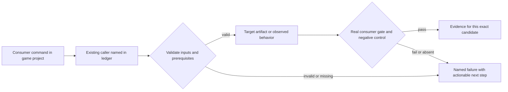
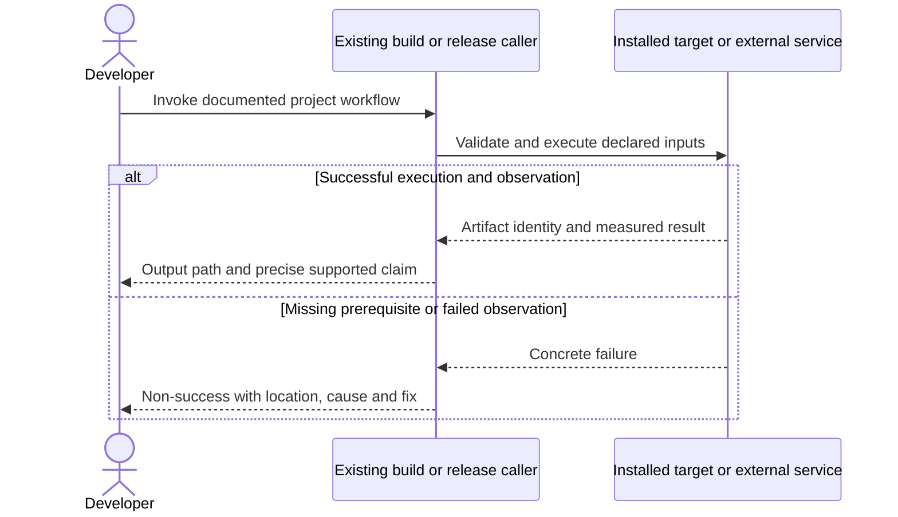

# PRD-262 — Matching public native runtime artifacts are available

**Status:** PARTIAL — Phase 1 (candidate manifest + atomic installs, PR #169) and Phase 2 (consumer builds without engine compilers, PR #182, merged 2026-09-11) are implemented, independently reviewed PASS, and CI-green. Final acceptance is owned downstream: PRD-078 hosted build proof, PRD-221 V8 inputs, and PRD-060 candidate staging/publication/promotion, against a pushed `runtime-native-v*` tag that does not yet exist.
**Complexity:** 8 → HIGH (+3 files, +2 multi-platform integration, +2 release-state coordination, +1 GitHub integration).
**Problem:** An installed runtime version has no downloadable prebuilt manifest, so public native builds fail before a game can ship.

Batch contract and dependency order: [production-readiness](README.md). Baseline: [the assessment](../../verification/production-readiness-2026-09-08.md), source `912a567e3e7592e6b437e49fe6318a3987d1f7c1`. iOS is outside this batch; no iOS readiness credit is created or removed.

## Integration ledger

| # | New or revised thing | Live caller at planning time | Replaces | Old path removed? | Negative control |
| --- | --- | --- | --- | --- | --- |
| 1 | Complete candidate manifest and binaries | .github/workflows/native-release.yml:305 publish; packages/runtime-native/scripts/install-prebuilt.mjs:73 releaseManifestUrl | HTTP 404/incomplete artifact cohort | Existing workflow generates lock, no hand-authored parallel manifest | Wrong checksum or missing ABI snapshot fails installation/build |
| 2 | Installed no-toolchain runtime proof | .github/workflows/native-release.yml:376 clean-consumer | source-checkout-only success | Packed mechanics retained; public proof delegated to PRD-060 | Mask CMake/NDK and delete prebuilt; build must fail instead of compile |
| 3 | Atomic install result | packages/runtime-native/scripts/install-prebuilt.mjs: install entry | unusable or stale success marker | Keep one install-status writer | Truncate download; no usable binary/ok marker remains |

## Current behavior and ownership

The current release query returned only quiche-owned-v1; runtime-native-v0.3.0/prebuilt-lock.json returned 404. Recent native CI is green on another SHA. Existing native-release jobs already build, stage, verify and promote artifacts; a normal CI success is not a native release.

Engine distribution layer. [PRD-078](PRD-078-toolchain-free-consumer-proof.md) owns repairs to exact-SHA hosted build execution. This PRD owns complete downloadable runtime inputs and no-toolchain packaging mechanics; [PRD-060](PRD-060-promoted-consumer-distribution.md) alone owns coordinated public npm/default-tag promotion.

## Approach and boundaries

Reuse native-release.yml, `PREBUILT_KEYS`, install-status/checksum logic and per-platform packagers. Build at the chosen candidate version; do not assume publishing the stale 0.3.0 source is safe. Generate artifact keys from supported matrix, including V8 runtime/library/STL/snapshots per Android ABI. Desktop claims are explicit OS+architecture rows; build each advertised row or narrow documentation before release. iOS remains a separate existing lane; do not weaken its unrelated gates. The non-iOS readiness conclusion consumes only named non-iOS evidence.

Release scope is declared, not assumed. `scripts/release-candidate-gate.ts` used to demand all
eight credentials and all six hosted capabilities unconditionally, so a repository holding only
`NPM_TOKEN` produced seven blockers and `BLOCKED` exit 2 on every candidate — measured on
2026-09-11: `gh secret list` returns `NPM_TOKEN` alone and
`repos/ThreeNativeHQ/threenative/actions/organization-secrets` returns `total_count: 0`. The
request now carries an optional `releaseScope: { platforms, signed }`; omitting it parses to the
historical every-platform signed set, so a stored request or candidate keeps working. An unsigned
release must say so, and the declaration is recorded in the candidate artifact. `npmPublish` stays
required at every scope.

What that narrowing does and does not guarantee, stated plainly because it is what the owner
approved. `platforms` is guarded: it must cover every platform whose binaries the release
publishes, derived from the `PREBUILT_ASSET_NAMES` key table, and an asset key matching no known
platform prefix is refused rather than silently uncovered. `signed` is **not** guarded — it is a
self-declaration by whoever dispatches the release, with no machine check behind it. Nor are the
hosted capabilities: `release-candidate.yml` derives credentials from `secrets.X != ''`, but its
capability booleans are operator-typed `workflow_dispatch` inputs. So after this change the only
machine-verified requirement standing between a commit and a published release is the presence of
`NPM_TOKEN`. The scope field is a record of what was claimed, not an enforcement of it: no
workflow, package or report generator reads it today.

The demand was also unbacked. Grepping the seven signing secret names across `.github/`, `scripts/`
and `packages/` returns exactly two files: `release-candidate.yml`, which reads them only to derive
availability booleans, and `native-platform-workflow.test.mjs`, which asserts that wiring.
`native-release.yml` contains no `codesign`, `signtool`, `notarytool`, `attest` or keystore step at
all. The gate was refusing to publish until credentials were present for signing operations that no
workflow, script or package in this repository performs. Signing remains PRD-060's to build; this
PRD stops blocking on evidence of a capability that does not yet exist.

Data/migration: no application database migration. New build metadata and evidence extend the existing package/config/artifact contracts; no parallel scene, project or release framework.





## Execution phases

### Phase 1 — A candidate consumer downloads every required runtime input

**Files (maximum five):**

- EDIT `.github/workflows/native-release.yml` — stage complete non-iOS build matrix and lock.
- EDIT `packages/runtime-native/scripts/install-prebuilt.mjs` — validate exact-version complete download.
- EDIT `packages/runtime-native/tests/distribution.test.mjs` — checksum and missing-key controls.
- NEW `docs/verification/prd-262-readiness-phase-1-<date>.md` — commands, identities, red/green and reviewer decision.

**Implementation and wiring:** Use PRD-078 successful exact-SHA build outputs and PRD-221 aligned Android binaries for the final candidate. Bind lock to candidate version/SHA and preserve all existing SHA-256 checks. Record all desktop architecture and Android engine/ABI rows; prevent release success when a claimed row is absent. Keep legacy explicit pins resolvable. PRD-060 integrates candidate exposure and final default promotion.

**Required test:** `packages/runtime-native/tests/distribution.test.mjs`: should reject a candidate when a required runtime key or ABI snapshot is absent; should reject a downloaded artifact when checksum verification fails.

**Observed-red / revert control:** Tamper a local downloaded candidate copy, not a public release; observe rejection. Remove one matrix output and verify lock/publication validation cannot accept a partial set.

**Verification commands** (from repository root unless noted; proposed flags are explicitly identified):

```sh
pnpm --filter @threenative/runtime-native exec vitest run --config vitest.config.ts tests/distribution.test.mjs
pnpm publish:check
```

**User verification:** On a clean host, the exact candidate URL returns the generated manifest and every claimed key downloads with matching hash; archive URL/status/hash without credentials.

### Phase 2 — An installed game builds native outputs without engine compilers

**Files (maximum five):**

- EDIT `.github/workflows/native-release.yml` — execute consumer matrix with masked native tools.
- EDIT `packages/runtime-native/scripts/package-desktop.mjs` — use installed prebuilt and fail cleanly.
- EDIT `packages/runtime-native/scripts/package-android.mjs` — use release inputs with SDK/JDK only.
- EDIT `packages/runtime-native/tests/distribution.test.mjs` — detect source fallback and partial download.
- NEW `docs/verification/prd-262-readiness-phase-2-<date>.md` — commands, identities, red/green and reviewer decision.

**Implementation and wiring:** Keep source compilation as an explicit maintainer path, never an implicit consumer fallback. Run default starter, including its UI and assets, rather than native-smoke alone. Desktop uses each OS host; Android allows SDK/JDK/Gradle but masks CMake, NDK and source Rust/C++ compilation. Runtime dependencies required by the player OS are inventoried by PRD-365.

**Required test:** `packages/runtime-native/tests/distribution.test.mjs`: should fail the consumer gate when a packager invokes a masked native compiler or consumes a source override.

**Observed-red / revert control:** Remove the prebuilt in a disposable consumer with compiler shims exiting 97; the command fails naming the prebuilt, and cannot repair itself using an engine source checkout.

**Verification commands** (from repository root unless noted; proposed flags are explicitly identified):

```sh
pnpm --filter @threenative/runtime-native exec vitest run --config vitest.config.ts tests/distribution.test.mjs
# In each prepared candidate game on its supported host:
pnpm build:desktop
pnpm build:android
```

**User verification:** An installed consumer produces desktop output and Android debug output from public runtime assets; no `.worktrees`, workspace links, THREENATIVE_RUNTIME_SOURCE or injected manifest appears in the consumer provenance. Real gameplay credit comes from PRD-366.

## Verification contract

Each phase edits its named pre-existing caller and includes the phase evidence record within the five-file budget. File lists are bounded implementation assignments, not permission for adjacent cleanup. If investigation needs more files, split the phase before implementing; do not silently widen it. Query `engine_search_capabilities` and inspect every hit before any qualifying package/helper work, as the repository requires.

Run the phase command, its observed-red control, restore the implementation and rerun green. Record exact candidate SHA, package versions/integrities, source and artifact hashes, platform/adapter/session, command, exit code, assertion count and artifact paths. A missing observation, skipped test, stale artifact or zero-assertion run is not PASS. Fixtures/local tarballs may prove mechanics; public-consumer acceptance requires registry packages and public runtime downloads with no engine checkout, source override or injected manifest.

For executable changes run `pnpm typecheck && pnpm lint && pnpm test`, `pnpm budgets`, and the affected real playtest/platform lane. Generate mirrors with `pnpm sync:agents` if AGENTS changes. Use platform-specific hosted runs for Windows/macOS, emulators for Android behavior, and physical Android only for claims that require hardware. Name unexecuted targets. A runtime change needs a real playtest scenario in the same implementation, not only the focused tests named below.

After every phase, an independent reviewer receives this PRD, diff, commands and artifacts and returns PASS / NEEDS CORRECTION / BLOCKED. It checks caller integration, negative controls, removed/delegating incumbent paths and the actual consumer outcome. No phase starts on a self-awarded PASS. Visual phases also require human inspection of captures; credentialed signing/submission and external-person checkpoints remain PENDING until executed. Do all authorized preparation before requesting any missing external authorization. This planning request does not authorize publishing packages, uploading to stores or contacting external people.

## Verification evidence

No implementation gate was run by this planning revision. Every new phase is **NOT RUN**. Write each phase to `docs/verification/prd-<id>-readiness-phase-<n>-<date>.md` (the evidence file listed in each phase); use the existing runtime performance ledger for new performance measurements. Fill actual results and non-test `file:line` callers at implementation time; a phase cannot close with placeholders. Acceptance boxes below remain unchecked until all phase checkpoints pass.

## Acceptance criteria

- [ ] Every advertised non-iOS runtime key exists at the selected version, carries generated checksum/provenance and is consumer-downloadable.
- [ ] Public consumers install without engine source and build on each declared desktop host and Android SDK/JDK-only host.
- [ ] Corrupt/missing artifacts fail without a stale success marker or silent native compiler fallback.
- [ ] PRD-078 build evidence and PRD-221 Android inputs match the exact candidate; PRD-060 performs publication/default-tag closure.
- [ ] No old statement about absent credentials or red CI is copied forward without a new attempted check.

## Prior work retained

Moved from `docs/PRDs/mobile/PRD-262-the-runtime-native-prebuilt-release-exists.md` under the owner's 2026-09-08 instruction. This revision replaces the execution scope, not historical test results. [Original plan at the assessed commit](https://github.com/ThreeNativeHQ/threenative/blob/912a567e3e7592e6b437e49fe6318a3987d1f7c1/docs/PRDs/mobile/PRD-262-the-runtime-native-prebuilt-release-exists.md) remains the immutable history. The original proposal pinned runtime 0.3.0 and stale red-main assumptions. Those are observations to recheck, not permanent requirements.
