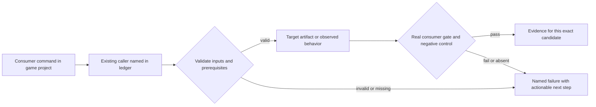
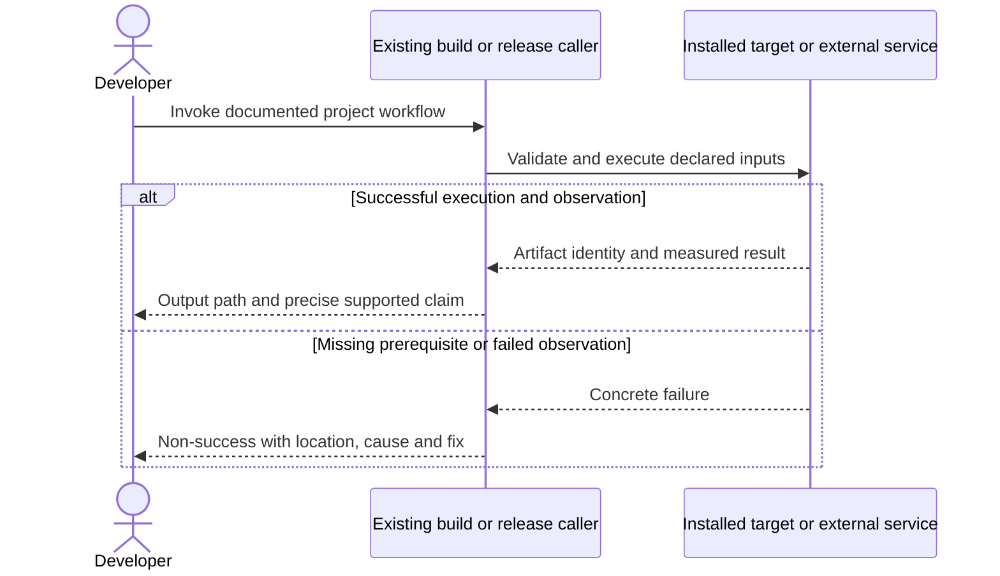

# PRD-264 — Doctor reports the actual consumer prerequisites and limits

**Status:** PARTIAL — scoped readiness and authoring diagnosis implemented; candidate verification and independent/public-consumer checkpoints tracked below. Updated 2026-09-11.
**Complexity:** 7 → HIGH (+2 files, +2 multi-package, +2 target/prerequisite state, +1 external tool probes).
**Problem:** A developer can see a target described as available because its packager exists while downloads, UI, signing or SDK prerequisites prevent the intended build.

Batch contract and dependency order: [production-readiness](README.md). Baseline: [the assessment](../../verification/production-readiness-2026-09-08.md), source `912a567e3e7592e6b437e49fe6318a3987d1f7c1`. iOS is outside this batch; no iOS readiness credit is created or removed.

## Integration ledger

| # | New or revised thing | Live caller at planning time | Replaces | Old path removed? | Negative control |
| --- | --- | --- | --- | --- | --- |
| 1 | Target-scoped prerequisite diagnosis | packages/create-threenative/src/threenative.ts: runDoctorCommand → diagnoseProject | target availability inferred from installed script | Existing doctor aggregation delegates to same requirements as build | Absent runtime download/JDK makes requested target non-success |
| 2 | Authoring/application prerequisites | packages/create-threenative/src/doctor.ts:427 probeMcpServer; :634 androidToolchainStatus | config-present means all tooling usable | Common server/probe definitions remain sole source | Missing Blender binary with live MCP transport cannot claim conversion ready |

## Current behavior and ownership

Published doctor correctly initialized three MCPs and caught the runtime 404, Linux overlay failure and unsupported JDK. It still described Android as available with a prerequisite warning. Current source adds Blender probing. A successful build-tool probe must not become a store-ready claim.

Engine developer-tool layer. Owns actionable diagnosis only; [PRD-196](../BLOCKED/requires-release-credentials/PRD-196-published-install-is-functional.md) repairs installation, [PRD-217](PRD-217-webview-ui-layer.md) repairs UI, [PRD-212](PRD-212-published-install-builds-android.md) supplies Android requirements and [PRD-365](PRD-365-consumer-desktop-distribution.md) supplies desktop distribution requirements. Doctor never installs external tools, changes keys or fabricates proof.

## Approach and boundaries

Keep `doctor` as the existing CLI command and reuse runtime install status, build/config validation, the common MCP table and playtest doctor delegation. Add optional `--target web|desktop|android` and `--mode debug|release` only to scope prerequisite diagnosis to the intended operation. Preserve legacy unscoped output. Report separate installed/configured/probed/buildable/verified facts in existing check details; do not introduce a second release gate or require iOS on a non-iOS task.

Data/migration: no application database migration. New build metadata and evidence extend the existing package/config/artifact contracts; no parallel scene, project or release framework.





## Execution phases

### 2026-09-11 implementation scope amendment

The current root/PRD instructions require results in this PRD rather than new routine evidence reports. The named evidence-file slot in each phase therefore becomes an edit to this PRD. No publishing, store upload, global editor configuration change or signing-key access is authorized or performed.

Before wiring the host table into TypeScript, split the prerequisite type work into **Phase 0** (five files): new `packages/core/mcp/install.d.mts`; remove the now-obsolete import suppression in `packages/core/__tests__/mcp-install.spec.ts`, `packages/create-threenative/__tests__/scaffold-mcp.spec.ts`, and `scripts/sync-mcp-configs.ts`; edit this PRD. These are type bindings only, not installer behavior changes.

Phase 1 retains its four implementation/test files plus this PRD (five). Phase 2 retains doctor, doctor tests, README and this PRD (four). No runtime, renderer, packaging, CI policy or release-gate behavior is changed. The branch-only verification workflow is temporary and must be absent from the final diff.

The existing native build callers produce debug packages and do not accept a release/signing mode. This PRD diagnoses that limitation, rather than implementing PRD-212/365 or inventing a release gate: native `doctor --mode release` fails explicitly; debug needs no signing credentials. Build execution, signing/submission and editor activation remain separate PENDING evidence. Independent review is not self-awarded.


### Phase 1 — Doctor predicts the requested build prerequisite failure

**Files (maximum five):**

- EDIT `packages/create-threenative/src/threenative.ts` — validate target/mode arguments and pass scoped request.
- EDIT `packages/create-threenative/src/doctor.ts` — derive requirements from build/runtime evidence.
- EDIT `packages/create-threenative/__tests__/doctor.spec.ts` — scoped target failure semantics.
- EDIT `packages/create-threenative/__tests__/cli.spec.ts` — doctor argument validation.
- EDIT this PRD — commands, identities, red/green and reviewer decision (current root evidence policy).

**Implementation and wiring:** For the requested target/mode, missing binary, overlay capability, supported SDK/JDK or signing prerequisite must prevent a buildable/ready result. A configured but unexecuted store upload is PENDING evidence, not an install prerequisite failure. Reuse PRD-212/365 mode semantics and preserve debug builds without signing keys. Runtime manifest lookup must retain bounded timeout/error status. Do not edit/read engine source as a consumer requirement.

**Required test:** `packages/create-threenative/__tests__/doctor.spec.ts`: should fail the requested Android release prerequisite check when the JDK or runtime artifact is missing; should not require iOS for an Android request.

**Observed-red / revert control:** Give doctor a present packager but HTTP404 runtime status and JDK26, then restore supported inputs. Verify non-success followed by correct buildable status; substitute absent signing for release-only red.

**Verification commands** (from repository root unless noted; scope flags are implemented):

```sh
pnpm exec vitest run packages/create-threenative/__tests__/doctor.spec.ts packages/create-threenative/__tests__/cli.spec.ts
# Implemented scope flags, in the game project:
pnpm exec threenative doctor --target android --mode release --text
```

**User verification:** The user receives one concrete cause/path/fix for the intended target. It does not advise pointing at an installed runtime package as a source checkout or imply a warning is a successful release.

### Phase 2 — Tool discovery explains external applications and editor setup

**Files (maximum five):**

- EDIT `packages/create-threenative/src/doctor.ts` — separate MCP transport and tool prerequisites.
- EDIT `packages/create-threenative/__tests__/doctor.spec.ts` — Blender/config/script-policy controls.
- EDIT `packages/create-threenative/README.md` — document exact game-only repair actions.
- EDIT this PRD — commands, identities, red/green and reviewer decision (current root evidence policy).

**Implementation and wiring:** Keep real transport probing from earlier work. Derive current required servers from core table. Distinguish server installed, config loaded by a supported editor, external Blender executable present, and operation executed. Show commands for missing prerequisites without modifying global configuration or silently installing applications. Preserve malformed/unwritable config and report the exact file. Document hosts that need manual global setup.

**Required test:** `packages/create-threenative/__tests__/doctor.spec.ts`: should report conversion unavailable when the Blender MCP starts but Blender is missing; should preserve malformed user config while reporting a repair location.

**Observed-red / revert control:** Remove Blender from the probe path while keeping its server bundle and remove one declared MCP entry separately; diagnostics must change and not claim a complete authoring toolchain.

**Verification commands** (from repository root unless noted; scope flags are implemented):

```sh
pnpm exec vitest run packages/create-threenative/__tests__/doctor.spec.ts
# In the installed game:
pnpm exec threenative doctor --text
```

**User verification:** Run in the game root with and without Blender; inspect actual editor tool discovery through PRD-196. Tool package installation and external app installation remain distinct.

## Verification contract

Each phase edits its named pre-existing caller and includes the phase evidence record within the five-file budget. File lists are bounded implementation assignments, not permission for adjacent cleanup. If investigation needs more files, split the phase before implementing; do not silently widen it. Query `engine_search_capabilities` and inspect every hit before any qualifying package/helper work, as the repository requires.

Run the phase command, its observed-red control, restore the implementation and rerun green. Record exact candidate SHA, package versions/integrities, source and artifact hashes, platform/adapter/session, command, exit code, assertion count and artifact paths. A missing observation, skipped test, stale artifact or zero-assertion run is not PASS. Fixtures/local tarballs may prove mechanics; public-consumer acceptance requires registry packages and public runtime downloads with no engine checkout, source override or injected manifest.

For executable changes run `pnpm typecheck && pnpm lint && pnpm test`, `pnpm budgets`, and the affected real playtest/platform lane. Generate mirrors with `pnpm sync:agents` if AGENTS changes. Use platform-specific hosted runs for Windows/macOS, emulators for Android behavior, and physical Android only for claims that require hardware. Name unexecuted targets. A runtime change needs a real playtest scenario in the same implementation, not only the focused tests named below.

After every phase, an independent reviewer receives this PRD, diff, commands and artifacts and returns PASS / NEEDS CORRECTION / BLOCKED. It checks caller integration, negative controls, removed/delegating incumbent paths and the actual consumer outcome. No phase starts on a self-awarded PASS. Visual phases also require human inspection of captures; credentialed signing/submission and external-person checkpoints remain PENDING until executed. Do all authorized preparation before requesting any missing external authorization. This planning request does not authorize publishing packages, uploading to stores or contacting external people.

## Verification evidence

Candidate branch: `codex/prd-264-doctor-readiness`, based on `7e6dffc1e7d67908d0ceb43388db45bb2d16964b`. No package was published and no release/store key was accessed.

- [x] Capability discovery: actual `engine_search_capabilities` queries for Android/JDK/runtime/signing and Blender/MCP/editor prerequisites; no matching build diagnostic capability. The returned unrelated asset-loader hit was inspected with `engine_capability_detail`; it does not replace this CLI layer.
- [x] Baseline: GitHub Actions run `34618594872` built the CLI dependency closure and passed the existing doctor/CLI tests (65 assertions/tests across two files).
- [x] Red before implementation: scoped/authoring/CLI cases produced 24 failures against the baseline; five installed-runtime-contract cases separately failed before their probe existed. Missing UI-entry and nested Blender-source controls failed before wiring the file checks.
- [x] Local restored-control verification: doctor/CLI tests pass, including missing runtime manifest/artifact (HTTP404), malformed release identity, timeout, JDK26, missing SDK/probe, debug versus unsupported release, absent desktop overlay, web isolation, config preservation, read-only editor config and nested/excluded Blender sources. Final counts and candidate CI are recorded in the PR.
- [ ] Full candidate `typecheck`, `lint`, `budgets`, package/unit and platform CI: not yet established at this revision; inspect the PR checks rather than inferring success from focused tests.
- [ ] Independent reviewer checkpoint: PENDING, not self-awarded.
- [ ] Public registry/no-source-override qualification of this exact candidate: PENDING a published candidate; local fixtures and build artifacts prove mechanics only.
- [ ] Actual editor tool discovery and conversion operation, native release signing and store submission: PENDING/not executed. Native release diagnosis intentionally reports the unsupported build path; no debug artifact is presented as release proof.

Live integration: `packages/create-threenative/src/threenative.ts:runDoctorCommand` validates the scope and passes it to both `readProject` and `diagnoseProject`; `doctor.ts:readBuildPrerequisites` invokes the existing build/config guards and installed-runtime contract; `doctor.ts:editorChecks` consumes core's host table without invoking installer writes. Unscoped `--capture` delegation and real MCP transport probes are retained. No renderer/runtime behavior or permanent CI workflow is changed.

The local source snapshot omitted non-development assets, so the broad core MCP suite's tracked-GPL-script check cannot be counted as a local pass. Candidate CI uses a real Git checkout and is the authority for that packaging assertion. Acceptance boxes below remain unchecked until the independent/public-consumer checkpoints are executed.

## Acceptance criteria

- [ ] The requested build target/mode cannot appear ready when a required download, SDK/JDK, UI runtime or signing prerequisite is missing.
- [ ] Doctor shares the build/config/runtime sources of truth and remains useful without engine source.
- [ ] MCP transport success is distinguished from external Blender availability, editor activation and actual operation proof.
- [ ] Unscoped doctor remains compatible; non-iOS target checks do not demand iOS evidence.
- [ ] Malformed inputs and missing observations fail honestly; documents name only flags implemented by these phases.

## Prior work retained

Moved from `docs/PRDs/done/PRD-264-doctor-answers-all-three-questions-a-game-author-has.md` under the owner's 2026-09-08 instruction. This revision replaces the execution scope, not historical test results. [Original plan at the assessed commit](https://github.com/ThreeNativeHQ/threenative/blob/912a567e3e7592e6b437e49fe6318a3987d1f7c1/docs/PRDs/done/PRD-264-doctor-answers-all-three-questions-a-game-author-has.md) remains the immutable history. The original completed transport/toolchain probes are retained. Only target/readiness semantics and the current four-server consumer experience need additional work.

Historical evidence: [doctor-2026-08-29](../../verification/doctor-2026-08-29.md).
