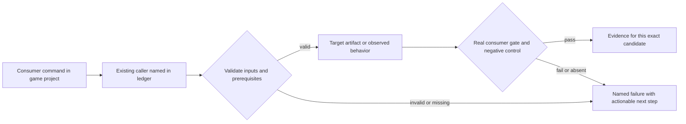
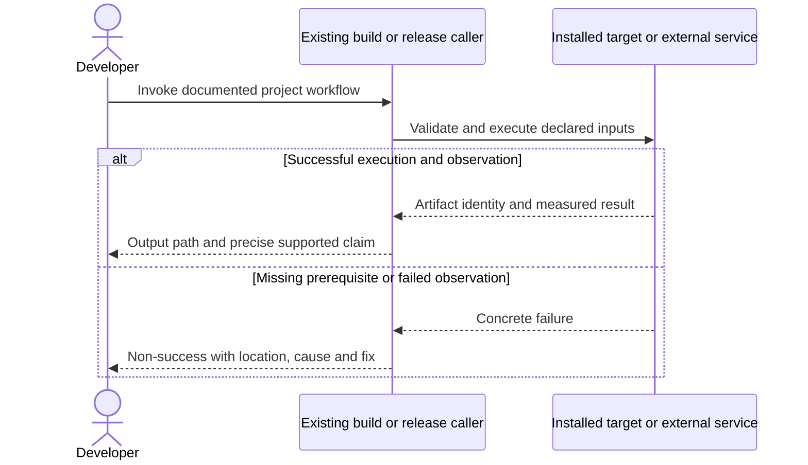

# PRD-365 — An installed game produces distributable desktop apps

**Status:** PARTIAL — historical phase-1 evidence retained; phase 1R fixes review-discovered integrity/identity/archive defects with local regression evidence, while full workspace/native revalidation and independent review remain open. Phases 2–3 NOT RUN. Revised 2026-09-12.
**Complexity:** 10 → HIGH (+3 files, +2 platform packaging module, +2 signing/container state, +2 multi-package, +1 OS tools).
**Problem:** The desktop command produces a host executable plus UI files, without a proved complete installed-app container, signing/notarization path or player-machine dependency story.

Batch contract and dependency order: [production-readiness](README.md). Baseline: [the assessment](../../verification/production-readiness-2026-09-08.md), source `912a567e3e7592e6b437e49fe6318a3987d1f7c1`. iOS is outside this batch; no iOS readiness credit is created or removed.

## Integration ledger

| # | New or revised thing | Live caller at planning time | Replaces | Old path removed? | Negative control |
| --- | --- | --- | --- | --- | --- |
| 1 | Platform desktop containers | packages/runtime-native/scripts/package-desktop.mjs:58 packageDesktop; create-threenative/src/build.ts desktop dispatch | bare executable treated as complete app | Debug retained; release delegates to one helper | Remove ui/DLL/app resource; installed artifact gate fails |
| 2 | OS resource and signing adapter | package-desktop.mjs: packageDesktop → proposed scripts/desktop-distribution.mjs | manual engine edits for packaging/signing | One helper owns container operations | Wrong signer or missing app icon is rejected |
| 3 | Clean-player artifact verification | packages/runtime-native/scripts/verify-starter-desktop.mjs: entry | developer-machine-only launch | Existing verifier takes released output | Mask build tree/developer PATH; unresolved dependency makes launch fail |

## Current behavior and ownership

packageDesktop runs the matching host runtime compile command and stages ui/ beside its output. It does not cross-compile arbitrary desktop OSes, embed all OS launcher metadata or validate a signed installed application. PRD-060 previously owned a broad desktop phase; that phase is sliced here, with promotion remaining in PRD-060.

Engine distribution mechanism; game identity/icon remains authored config. [PRD-217](PRD-217-webview-ui-layer.md) supplies functional overlays; [PRD-153](../done/PRD-153-game-branding-from-launch-to-play.md) validates appearance; [PRD-262](../done/PRD-262-the-runtime-native-prebuilt-release-exists.md) supplies prebuilt host inputs. A native package exists only in runtime-native; do not add a second desktop framework/package.

## Approach and boundaries

Use each native host: Windows x64, macOS supported architectures and Linux supported architectures as recorded in the manifest. Reuse `--mode release` introduced by PRD-212; keep debug raw executable behavior. Release output is a Windows ZIP containing signed executable/UI/runtime dependencies, a macOS .app inside a ZIP with system signing/notarization, and a Linux tar.gz containing executable/UI/shared dependencies plus .desktop/icon metadata. Prefer OS tools and a small helper imported by packageDesktop. No mandatory bespoke installer or store SDK. Document a downstream installer/store-depot recipe using these complete artifacts. Do not claim cross-compilation from Linux.

Data/migration: no application database migration. New build metadata and evidence extend the existing package/config/artifact contracts; no parallel scene, project or release framework.





## Execution phases

### Phase 1 — A game command creates a complete native desktop container

**Progress:**

- [x] Callers wired and building: `packages/create-threenative/src/build.ts`, `packages/runtime-native/scripts/package-desktop.mjs`, `packages/runtime-native/scripts/desktop-distribution.mjs` (+1 more)
  - `build --target desktop --mode release` reaches `packageDesktop`, which lazily imports the new helper and delegates the container; debug mode is byte-for-byte the old raw path. `pnpm exec tsc --noEmit -p tsconfig.json` clean.
- [x] Required test green: `packages/runtime-native/tests/distribution.test.mjs`
  - 47 passed (5 new) on linux-x64, exit 0. New rows: release container payload, relocation rejection (missing UI entry, missing dependency, tampered bytes), generic-icon brand rejection, per-platform metadata, dependency-tool census.
- [x] Observed red recorded, then restored green
  - Skipping dependency recording in `desktop-distribution.mjs` made the relocation row fail (`Tests 1 failed`); restoring the recording returned `Tests 1 passed`.
- [x] User verification performed on the named platform
  - On linux-x64 the `native-smoke` release container was unpacked to a path containing spaces and launched outside the project: `TN_NATIVE_SMOKE_READY:webgpu`, 4 textures, `Rendered 300 frames`, `TN_UI_OVERLAY:{"attached":true}`, the composited capture carrying the HUD plate/text, and window title/desktop entry matching the configured game identity. Full detail in the phase-1 record. macOS/Windows execution and signing remain phase 2/3.
- [x] Evidence record written: `docs/verification/prd-365-readiness-phase-1-2026-09-12.md`
  - Commands, the end-to-end archive hash, the observed red and the unrun gates are in the record.
- [x] Independent reviewer returned PASS
  - An independent read-only reviewer on a different model, given this phase, the diff at `264153102`, the test file and the evidence record, returned **PASS**; the findings and its non-blocking notes are in the phase-1 record. Full result: `docs/verification/prd-365-readiness-phase-1-2026-09-12.md`.

**Files (maximum five):**

- EDIT `packages/create-threenative/src/build.ts` — pass release mode to desktop packager.
- EDIT `packages/runtime-native/scripts/package-desktop.mjs` — delegate complete container packaging.
- NEW `packages/runtime-native/scripts/desktop-distribution.mjs` — OS container/resource operations only.
- EDIT `packages/runtime-native/tests/distribution.test.mjs` — inspect full container and reject missing payload.
- NEW `docs/verification/prd-365-readiness-phase-1-<date>.md` — commands, identities, red/green and reviewer decision.

**Implementation and wiring:** Build the default starter with custom app.id/name/version/icon through installed runtime inputs, then package executable, ui directory and required sidecars. Derive dependencies from the produced binary/package rather than hardcoded assumptions. For Windows embed executable icon/version resources with supported resource tooling; macOS .app receives Info.plist/icns and bundle-relative paths; Linux .desktop/icon paths refer to installed files. Preserve raw output for debug mode. The new helper is invoked by packageDesktop in this same phase and must be added to the tarball in phase 2 before any public-consumer completion.

**Required test:** `packages/runtime-native/tests/distribution.test.mjs`: should package all starter runtime and UI files when desktop release mode is selected; should reject a container whose runtime resources cannot be resolved after relocation.

**Observed-red / revert control:** Relocate the container, remove ui/index.html and one required native dependency separately, and restore the generic icon metadata. The corresponding archive/launch/branding gate must fail.

**Verification commands** (from repository root unless noted; proposed flags are explicitly identified):

```sh
pnpm --filter @threenative/runtime-native exec vitest run --config vitest.config.ts tests/distribution.test.mjs
# PROPOSED, on the target OS inside the game:
pnpm exec threenative build --target desktop --mode release
```

**User verification:** Unpack/move the application to a path containing spaces and launch it outside the project directory. HUD/assets work and OS identity reflects the game. This phase alone does not claim signed distribution.

### Phase 1R — Container integrity and OS identity review corrections

The original phase-1 checks above describe the candidate in its retained evidence record, not a fresh native verification of these corrections. This follow-up is bounded to `packages/runtime-native/scripts/desktop-distribution.mjs`, the new `packages/runtime-native/tests/desktop-container.test.mjs`, and this PRD. The existing `packageDesktop` delegation remains the caller; no public API or debug packaging route changes.

**Progress:**

- [x] Existing container staging/resolution exercised with the corrections.
  - Record the final executable on every platform, after Windows resource editing; require integrity records for declared executable/UI/dependencies/icon and reject malformed inventories or symlinks outside the root. Stage macOS `Contents/Info.plist` at the proper location, match its icon name, escape XML identity and distinguish authored-icon identity from converted-payload integrity. Preserve dependency paths with spaces. Build a fresh archive before replacing an existing output, avoiding stale ZIP members and preserving the prior artifact on failure.
- [ ] Required repository Vitest and workspace gates green for the correction.
  - NOT RUN here: pnpm/Vitest and the full workspace are unavailable. Run `pnpm --filter @threenative/runtime-native exec vitest run --config vitest.config.ts tests/desktop-container.test.mjs tests/distribution.test.mjs`, then the required workspace gates.
- [x] Observed red recorded, then restored green for the changed behavior.
  - Against parent `9234a5d70da07d2de66f6825e7ad70f190db19ce`, the initial 24-case set yielded 1 pass / 23 failures. The two archive cases then yielded 2 failures before the archive fix. Final result: 26 passed / 0 failed / 0 skipped.
- [ ] Current-candidate native game/HUD and supported-platform user verification.
  - Archive/layout checks below are not Windows/macOS execution, a ThreeNative game launch, signing or clean-player proof.
- [x] Bounded verification evidence recorded here (2026-09-12).
  - Linux Node 22.16.0 `node --test` adapter of the committed Vitest assertion bodies: only runner and temporary-directory imports changed; OS resource tools/archive transport are fixture boundaries in these unit tests. `node --check` and `git diff --check` pass. Separately, real Linux-host `tar`/`zip`/`unzip` create/rebuild/extract operations passed for all three platform layouts, with obsolete UI files absent after rebuilding and integrity checks green. A relocated `/bin/true` fixture launched from `/tmp`; this is not native-game evidence. Python `plistlib` parsed the generated macOS plist and recovered the authored `R&D <Orbit>` name.
- [ ] Independent reviewer returned PASS for this correction.
  - NOT RUN; the historical phase-1 reviewer did not review this follow-up.

### Phase 2 — Public packaging includes the new adapter and supports player dependencies

**Progress:**

- [ ] Callers wired and building: `packages/runtime-native/package.json`, `packages/runtime-native/scripts/verify-starter-desktop.mjs`, `packages/runtime-native/tests/starter-desktop.test.mjs` (+1 more)
- [ ] Required test green: `packages/runtime-native/tests/starter-desktop.test.mjs`
- [ ] Observed red recorded, then restored green
- [ ] User verification performed on the named platform
- [ ] Evidence record written: `docs/verification/prd-365-readiness-phase-2-<date>.md`
- [ ] Independent reviewer returned PASS

**Files (maximum five):**

- EDIT `packages/runtime-native/package.json` — ship imported distribution helper and required assets.
- EDIT `packages/runtime-native/scripts/verify-starter-desktop.mjs` — inspect/install/launch actual container.
- EDIT `packages/runtime-native/tests/starter-desktop.test.mjs` — clean player and missing dependency cases.
- EDIT `packages/runtime-native/README.md` — platform prerequisites and standard distribution recipe.
- NEW `docs/verification/prd-365-readiness-phase-2-<date>.md` — commands, identities, red/green and reviewer decision.

**Implementation and wiring:** Include the helper through existing package files rules and extracted-tarball checks. Run on clean player images without Node, engine source, SDK/NDK, Rust or CMake. Declare and satisfy OS WebView/native dependencies: Windows WebView2 availability must be detected with documented redistribution/prerequisite behavior; macOS uses system WebKit; Linux supported library/compositor requirements are explicit. Avoid bundling a browser engine. Test offline launch after installed prerequisites with networking disabled.

**Required test:** `packages/runtime-native/tests/starter-desktop.test.mjs`: should launch a relocated release starter without developer tools; should fail with an actionable prerequisite when the required player-side WebView runtime is absent.

**Observed-red / revert control:** Remove the shipped helper before packing to trigger unresolved import, then omit a required player dependency in an isolated clean image. Neither can receive PASS from a developer-machine run.

**Verification commands** (from repository root unless noted; proposed flags are explicitly identified):

```sh
pnpm --filter @threenative/runtime-native exec vitest run --config vitest.config.ts tests/starter-desktop.test.mjs tests/distribution.test.mjs
pnpm publish:check
```

**User verification:** A second clean OS user can unpack/install and play the artifact. Instructions list only normal player prerequisites; none asks for engine source or build compilers.

### Phase 3 — A developer signs and verifies distribution using external OS credentials

**Progress:**

- [ ] Callers wired and building: `packages/runtime-native/scripts/desktop-distribution.mjs`, `packages/runtime-native/scripts/package-desktop.mjs`, `packages/runtime-native/tests/distribution.test.mjs` (+1 more)
- [ ] Required test green: `packages/runtime-native/tests/distribution.test.mjs`
- [ ] Observed red recorded, then restored green
- [ ] User verification performed on the named platform
- [ ] Evidence record written: `docs/verification/prd-365-readiness-phase-3-<date>.md`
- [ ] Independent reviewer returned PASS

**Files (maximum five):**

- EDIT `packages/runtime-native/scripts/desktop-distribution.mjs` — sign/verify native containers with scoped inputs.
- EDIT `packages/runtime-native/scripts/package-desktop.mjs` — separate signed result from unsigned preparation.
- EDIT `packages/runtime-native/tests/distribution.test.mjs` — signature/notary failure contracts.
- EDIT `packages/runtime-native/README.md` — game-side signing and store/depot handoff.
- NEW `docs/verification/prd-365-readiness-phase-3-<date>.md` — commands, identities, red/green and reviewer decision.

**Implementation and wiring:** Use standard Windows signing and macOS codesign/notarytool/stapler outside game runtime; resolve non-secret identity/options through validated build inputs, secrets via OS keychain/credential mechanisms. No engine file needs editing. Unsigned preparation is named as such, never silently passed as signed release. Verify nested macOS code before notarization and staple/assess the actual output; Windows verifies timestamp/signature on the distributed executable. Linux archive includes integrity/license metadata plus the identity-bound archive/source/cohort attestation from the PRD-059 provenance chain, verified by PRD-060, and has a documented package/depot handoff, without pretending Authenticode/notarization applies to Linux.

**Required test:** `packages/runtime-native/tests/distribution.test.mjs`: should refuse signed desktop release when signing fails or notarization evidence belongs to a different artifact; actual signed subjects require credentialed verification in PRD-060.

**Observed-red / revert control:** Tamper with signed output and substitute another artifact hash/notary result. Verification must reject both; missing credentials remain PENDING for signing while unsigned preparation can proceed.

**Verification commands** (from repository root unless noted; proposed flags are explicitly identified):

```sh
pnpm --filter @threenative/runtime-native exec vitest run --config vitest.config.ts tests/distribution.test.mjs
# On macOS with the produced .app path:
codesign --verify --strict --deep <game.app>
spctl --assess --type execute <game.app>
```

**User verification:** On clean Windows/macOS user machines verify the actual downloaded artifact signature/trust and launch it. Do not bypass OS trust dialogs as the passing test. PRD-060 records authorized external signing/submission operations.

## Verification contract

Each phase edits its named pre-existing caller and includes the phase evidence record within the five-file budget. File lists are bounded implementation assignments, not permission for adjacent cleanup. If investigation needs more files, split the phase before implementing; do not silently widen it. Query `engine_search_capabilities` and inspect every hit before any qualifying package/helper work, as the repository requires.

Run the phase command, its observed-red control, restore the implementation and rerun green. Record exact candidate SHA, package versions/integrities, source and artifact hashes, platform/adapter/session, command, exit code, assertion count and artifact paths. A missing observation, skipped test, stale artifact or zero-assertion run is not PASS. Fixtures/local tarballs may prove mechanics; public-consumer acceptance requires registry packages and public runtime downloads with no engine checkout, source override or injected manifest.

For executable changes run `pnpm typecheck && pnpm lint && pnpm test`, `pnpm budgets`, and the affected real playtest/platform lane. Generate mirrors with `pnpm sync:agents` if AGENTS changes. Use platform-specific hosted runs for Windows/macOS, emulators for Android behavior, and physical Android only for claims that require hardware. Name unexecuted targets. A runtime change needs a real playtest scenario in the same implementation, not only the focused tests named below.

After every phase, an independent reviewer receives this PRD, diff, commands and artifacts and returns PASS / NEEDS CORRECTION / BLOCKED. It checks caller integration, negative controls, removed/delegating incumbent paths and the actual consumer outcome. No phase starts on a self-awarded PASS. Visual phases also require human inspection of captures; credentialed signing/submission and external-person checkpoints remain PENDING until executed. Do all authorized preparation before requesting any missing external authorization. This planning request does not authorize publishing packages, uploading to stores or contacting external people.

## Verification evidence

**Current correction:** phase 1R above records the new local evidence and unrun gates. The following phase-1 account is historical and must not be used to claim fresh full-suite/native/reviewer coverage of phase 1R.

The planning revision itself ran no implementation gate. **Phase 1 is implemented against local inputs and all six of its checkpoints are verified** — focused tests, observed red, linux-x64 user verification on a real release container, evidence record, and independent reviewer PASS. Commands, archive hashes, the observed red and the still-unrun gates (macOS/Windows execution, signing) are in `docs/verification/prd-365-readiness-phase-1-2026-09-12.md`. Phases 2 and 3 are **NOT RUN**. Write each remaining phase to `docs/verification/prd-<id>-readiness-phase-<n>-<date>.md` (the evidence file listed in each phase); use the existing runtime performance ledger for new performance measurements. Fill actual results and non-test `file:line` callers at implementation time; a phase cannot close with placeholders. Acceptance boxes below remain unchecked until all phase checkpoints pass.

## Acceptance criteria

- [ ] Each claimed desktop OS/architecture has a complete relocatable release container with working unchanged starter HUD/assets and game OS identity.
- [ ] Installed-player proof uses no Node/engine checkout/native build tools and includes offline launch plus documented system WebView/library prerequisites.
- [ ] Signed Windows and notarized macOS artifacts are verified on their real hosts; unsigned preparation never claims signed readiness.
- [ ] Debug raw executable behavior remains supported; no cross-OS compiler or new public command is invented.
- [ ] PRD-375 appearance and PRD-366 gameplay consume the same container hashes; public promotion remains PRD-060.
