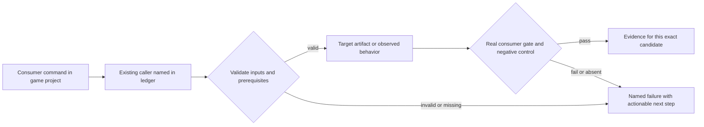
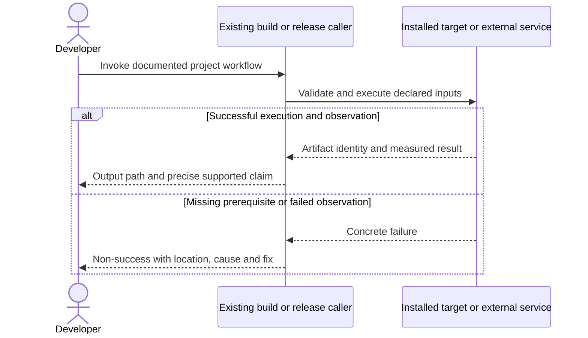

# PRD-366 — One installed consumer game proves the supported platform contract

**Status:** PROPOSED. Revised 2026-09-08; planning only.
**Complexity:** 8 → HIGH (+3 files, +2 multi-package, +2 lifecycle/proof state, +1 hosted/device integration).
**Problem:** Isolated engine feature tests and core smoke screenshots do not establish that a developer can build, customize and distribute a playable game using installed packages only.

Batch contract and dependency order: [production-readiness](README.md). Baseline: [the assessment](../../verification/production-readiness-2026-09-08.md), source `912a567e3e7592e6b437e49fe6318a3987d1f7c1`. iOS is outside this batch; no iOS readiness credit is created or removed.

## Integration ledger

| # | New or revised thing | Live caller at planning time | Replaces | Old path removed? | Negative control |
| --- | --- | --- | --- | --- | --- |
| 1 | Candidate game scenario gate | scripts/verify-registry-install.ts: verifyRegistryInstall; scripts/verify-template-playtests.ts: existing runner | web-build-only qualification | Extend existing harness, no new runner | Wrong state assertion or absent scenario fails |
| 2 | Distributed target gameplay evidence | .github/workflows/native-platforms.yml: starter/Android jobs → installed playtest CLI | core-only smoke used as full-game proof | Core gates remain narrow; add consumer subject | Delete UI/assets or change application ID; gate fails |
| 3 | Physical consumer qualification | packages/runtime-native/scripts/qualify-physical-mobile.mjs:759 scenario invocation | hardcoded native-smoke-only subject | Existing collector accepts declared consumer project/scenario | Supply emulator or wrong artifact SHA; physical gate rejects |

## Current behavior and ownership

The assessment built web output and reproduced a desktop prebuilt failure; it did not run new browser gameplay or native player/device flows. Existing golden-path, registry-install, template playtest and physical qualification harnesses provide the mechanism; no new test runner is needed.

Consumer verification, not new gameplay systems. [PRD-196](../BLOCKED/requires-release-credentials/PRD-196-published-install-is-functional.md) owns installation/MCP fixes; [PRD-217](PRD-217-webview-ui-layer.md) HUD; [PRD-212](../done/PRD-212-published-install-builds-android.md)/[PRD-365](PRD-365-consumer-desktop-distribution.md) artifacts; [PRD-153](../done/PRD-153-game-branding-from-launch-to-play.md) brand. Existing PRD-054 owns conformance, PRD-056 owns physical collector schema, PRD-058 owns performance/reliability mechanisms, PRD-080 owns stranger-test protocol. Consume their non-iOS evidence without declaring their iOS scope done.

## Approach and boundaries

Use a freshly scaffolded default starter with its real React UI, models, physics, audio and loading; extend only the consumer scenario to exercise save/relaunch and input as needed through existing capabilities. Start with that production subject, not native-smoke. Use an additional existing platformer reference for its device performance criterion and action-rpg for persistence if starter has no save feature; each additional proof remains separately identified and cannot replace default-starter HUD qualification. Enumerate supported exports/formats through capability and conformance manifests; unsupported browser/WASM/codecs fail early and are documented, never promised as “any game.”

Data/migration: no application database migration. New build metadata and evidence extend the existing package/config/artifact contracts; no parallel scene, project or release framework.





## Execution phases

### Phase 1 — The installed starter proves browser gameplay after a normal edit

**Progress:**

- [ ] Callers wired and building: `scripts/verify-registry-install.ts`, `scripts/__tests__/verify-registry-install.spec.ts`, `packages/create-threenative/templates/starter/playtests/production-readiness.playtest.json` (+1 more)
- [ ] Required test green: `scripts/__tests__/verify-registry-install.spec.ts`
- [ ] Observed red recorded, then restored green
- [ ] User verification performed on the named platform
- [ ] Evidence record written: `docs/verification/prd-366-readiness-phase-1-<date>.md`
- [ ] Independent reviewer returned PASS

**Files (maximum five):**

- EDIT `scripts/verify-registry-install.ts` — run candidate template gameplay after game-only edit.
- EDIT `scripts/__tests__/verify-registry-install.spec.ts` — non-vacuous external consumer assertions.
- NEW `packages/create-threenative/templates/starter/playtests/production-readiness.playtest.json` — observable real starter sequence.
- EDIT `scripts/verify-template-playtests.ts` — include new scenario through existing discovery.
- NEW `docs/verification/prd-366-readiness-phase-1-<date>.md` — commands, identities, red/green and reviewer decision.

**Implementation and wiring:** Scaffold from the exact candidate, install without workspace protocols, edit a game-owned movement/UI value, build and run actual browser gameplay against the built output. Verify input changes position, HUD action changes state, asset/physics/audio observation exists and scene can restart. Register using the existing playtest glob. Add one export/asset compatibility audit from existing capability/conformance inventory; do not infer that arbitrary Three.js/browser plugins work natively.

**Required test:** `scripts/__tests__/verify-registry-install.spec.ts`: should reject a consumer result when its real gameplay assertions are absent or false; production-readiness.playtest.json must exercise actual state transitions with nonzero assertions.

**Observed-red / revert control:** Change the expected player displacement/HUD state to a false value and remove the playtest bridge separately. The real installed runner exits nonzero; removing the scenario must also fail required coverage.

**Verification commands** (from repository root unless noted; proposed flags are explicitly identified):

```sh
pnpm exec vitest run scripts/__tests__/verify-registry-install.spec.ts
pnpm tsx scripts/verify-registry-install.ts
pnpm test:templates
```

**User verification:** Play the edited starter from a deployed production build at site root and a subpath. Inspect missing asset URLs, WebGPU adapter and WebGL2 fallback separately; a generated manifest is not an offline/PWA claim.

### Phase 2 — The same distributed game plays on desktop and Android

**Progress:**

- [ ] Callers wired and building: `.github/workflows/native-platforms.yml`, `packages/runtime-native/scripts/verify-starter-desktop.mjs`, `packages/runtime-native/tests/starter-desktop.test.mjs` (+1 more)
- [ ] Required test green: `packages/runtime-native/tests/starter-desktop.test.mjs`
- [ ] Observed red recorded, then restored green
- [ ] User verification performed on the named platform
- [ ] Evidence record written: `docs/verification/prd-366-readiness-phase-2-<date>.md`
- [ ] Independent reviewer returned PASS

**Files (maximum five):**

- EDIT `.github/workflows/native-platforms.yml` — consume final containers and Android artifacts.
- EDIT `packages/runtime-native/scripts/verify-starter-desktop.mjs` — invoke same consumer gameplay scenario.
- EDIT `packages/runtime-native/tests/starter-desktop.test.mjs` — artifact identity and false assertion controls.
- EDIT `scripts/verify-registry-install.ts` — record per-target consumer results.
- NEW `docs/verification/prd-366-readiness-phase-2-<date>.md` — commands, identities, red/green and reviewer decision.

**Implementation and wiring:** Use exact artifacts from PRD-212/365 and exact public candidate inputs from PRD-262/060. Run keyboard/mouse/gamepad where supported and Android touch; test menu action, movement, physics collision, audio event, scene restart, missing asset refusal and offline launch after packaging. Add real scenario coverage through the same installed playtest runner; no hardcoded pass strings. Record actual OS/architecture/session and fail if any required row is absent.

**Required test:** `packages/runtime-native/tests/starter-desktop.test.mjs`: should reject target qualification when the artifact hash/application ID differs from the built consumer; should reject a missing required gameplay row.

**Observed-red / revert control:** Substitute a native-smoke artifact or stale starter build, delete one asset/UI folder and inject a false state assertion; each must fail the target gate for its real cause.

**Verification commands** (from repository root unless noted; proposed flags are explicitly identified):

```sh
pnpm --filter @threenative/runtime-native exec vitest run --config vitest.config.ts tests/starter-desktop.test.mjs
# On each installed desktop game host; substitute actual executable path:
pnpm exec threenative-playtest playtests/production-readiness.playtest.json --target desktop --executable <game-executable>
# On the Android consumer/device lane:
pnpm exec threenative-playtest playtests/production-readiness.playtest.json --target android --device <serial>
```

**User verification:** Play the actual distributed game on Windows, macOS, supported Linux sessions and Android emulator. Background/resume and close/reopen it; inspect save persistence on the action-rpg subject where the starter has no save system.

### Phase 3 — Physical Android and release limitations are measured honestly

**Progress:**

- [ ] Callers wired and building: `packages/runtime-native/scripts/qualify-physical-mobile.mjs`, `packages/runtime-native/tests/physical-mobile-qualification.test.mjs`, `scripts/verify-registry-install.ts` (+1 more)
- [ ] Required test green: `packages/runtime-native/tests/physical-mobile-qualification.test.mjs`
- [ ] Observed red recorded, then restored green
- [ ] User verification performed on the named platform
- [ ] Evidence record written: `docs/verification/prd-366-readiness-phase-3-<date>.md`
- [ ] Independent reviewer returned PASS

**Files (maximum five):**

- EDIT `packages/runtime-native/scripts/qualify-physical-mobile.mjs` — accept declared consumer project/scenario instead of fixed fixture.
- EDIT `packages/runtime-native/tests/physical-mobile-qualification.test.mjs` — project/artifact/device identity controls.
- EDIT `scripts/verify-registry-install.ts` — include physical evidence identity in cohort result.
- EDIT `docs/CURRENT-CHALLENGES.md` — state observed limitations and supported envelope.
- NEW `docs/verification/prd-366-readiness-phase-3-<date>.md` — commands, identities, red/green and reviewer decision.

**Implementation and wiring:** Extend the existing physical collector with validated project/scenario inputs; retain its required evidence/provenance schema and default native-smoke compatibility. Do not remove PRD-056 prerequisite checks or count iOS as a required target for this non-iOS batch. Use actual signed Android artifact, correct applicationId and arm64 GPU device; record touch, back navigation, suspend/resume, cold restart, saves and telemetry. Measure the unmodified platformer reference against its existing performance budget, with default starter startup/steady-state recorded separately. Raw performance results update runtime-perf-state.md in a separate evidence-only checkpoint if the five-file budget is exhausted.

**Required test:** `packages/runtime-native/tests/physical-mobile-qualification.test.mjs`: should reject consumer qualification when device identity is an emulator or the scenario/project does not match the installed artifact.

**Observed-red / revert control:** Substitute an emulator identity, stale APK hash, absent lifecycle observation and false persisted-state assertion separately; collector rejects each rather than reusing a prior smoke record.

**Verification commands** (from repository root unless noted; proposed flags are explicitly identified):

```sh
pnpm --filter @threenative/runtime-native exec vitest run --config vitest.config.ts tests/physical-mobile-qualification.test.mjs
node packages/runtime-native/scripts/qualify-physical-mobile.mjs --help
```

**User verification:** Run the documented collector invocation on the selected physical phone after capturing its validated options from --help; archive exact expanded command. Measure sustained gameplay and background/resume on the artifact, not on a different installed package. Human inspection of input and performance traces remains required.

## Verification contract

Each phase edits its named pre-existing caller and includes the phase evidence record within the five-file budget. File lists are bounded implementation assignments, not permission for adjacent cleanup. If investigation needs more files, split the phase before implementing; do not silently widen it. Query `engine_search_capabilities` and inspect every hit before any qualifying package/helper work, as the repository requires.

Run the phase command, its observed-red control, restore the implementation and rerun green. Record exact candidate SHA, package versions/integrities, source and artifact hashes, platform/adapter/session, command, exit code, assertion count and artifact paths. A missing observation, skipped test, stale artifact or zero-assertion run is not PASS. Fixtures/local tarballs may prove mechanics; public-consumer acceptance requires registry packages and public runtime downloads with no engine checkout, source override or injected manifest.

For executable changes run `pnpm typecheck && pnpm lint && pnpm test`, `pnpm budgets`, and the affected real playtest/platform lane. Generate mirrors with `pnpm sync:agents` if AGENTS changes. Use platform-specific hosted runs for Windows/macOS, emulators for Android behavior, and physical Android only for claims that require hardware. Name unexecuted targets. A runtime change needs a real playtest scenario in the same implementation, not only the focused tests named below.

After every phase, an independent reviewer receives this PRD, diff, commands and artifacts and returns PASS / NEEDS CORRECTION / BLOCKED. It checks caller integration, negative controls, removed/delegating incumbent paths and the actual consumer outcome. No phase starts on a self-awarded PASS. Visual phases also require human inspection of captures; credentialed signing/submission and external-person checkpoints remain PENDING until executed. Do all authorized preparation before requesting any missing external authorization. This planning request does not authorize publishing packages, uploading to stores or contacting external people.

## Verification evidence

No implementation gate was run by this planning revision. Every new phase is **NOT RUN**. Write each phase to `docs/verification/prd-<id>-readiness-phase-<n>-<date>.md` (the evidence file listed in each phase); use the existing runtime performance ledger for new performance measurements. Fill actual results and non-test `file:line` callers at implementation time; a phase cannot close with placeholders. Acceptance boxes below remain unchecked until all phase checkpoints pass.

## Acceptance criteria

- [ ] A normal consumer edit builds and plays in a real browser and each claimed non-iOS native target with the same public candidate identity.
- [ ] HUD/input, asset decoding, physics/audio, scene restart, offline native launch and applicable save/lifecycle behaviors have nonzero real assertions plus false-value controls.
- [ ] Physical Android evidence uses the exact signed artifact and real hardware; emulator runs cannot provide physical performance credit.
- [ ] Unsupported codecs/browser globals/extensions and workload limits are explicitly inventoried; no absolute “any game” guarantee is made.
- [ ] External developer/player acceptance remains PRD-060/080; no template/build/unit pass silently substitutes for it.
