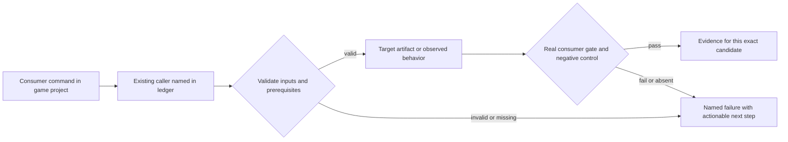
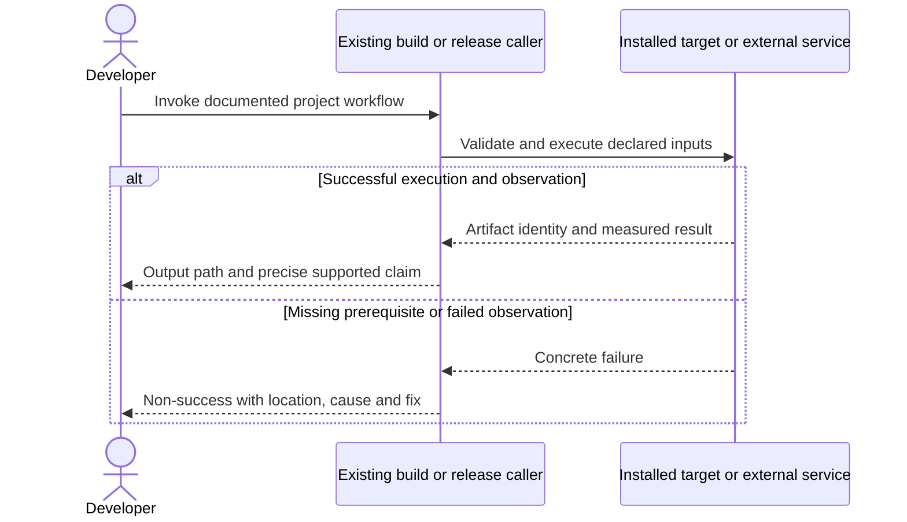

# PRD-374 — Doctor predicts the requested build's prerequisite failure

**Status:** PARTIAL — phases 1 and 2 implemented and locally verified (evidence
[phase 1](../../verification/prd-374-readiness-phase-1-2026-09-11.md),
[phase 2](../../verification/prd-374-readiness-phase-2-2026-09-11.md)). Both independent reviews
are the only open boxes; no acceptance box is ticked until they return PASS. Renumbered
2026-09-11. Phase 1's commits were replayed onto current `main` as a net diff after `main`
re-applied their base under different SHAs.

This work was drafted on 2026-09-08 as a rewrite of PRD-264, which un-filed that PRD from `done/`
and deleted its sixteen ticked boxes. The phases below were never part of PRD-264: it shipped
truthful *craft/test/ship* diagnosis, and these add target-scoped build-prerequisite prediction and
a separation between MCP transport, external Blender availability and editor activation.
[PRD-264](../done/PRD-264-doctor-answers-all-three-questions-a-game-author-has.md) is restored to
`done/` and re-verified on `main`; this PRD extends it and must not re-litigate its checks.
**Complexity:** 7 → HIGH (+2 files, +2 multi-package, +2 target/prerequisite state, +1 external tool probes).
**Problem:** A developer can see a target described as available because its packager exists while downloads, UI, signing or SDK prerequisites prevent the intended build.

Batch contract and dependency order: [production-readiness](README.md). Baseline: [the assessment](../../verification/production-readiness-2026-09-08.md), source `912a567e3e7592e6b437e49fe6318a3987d1f7c1`. iOS is outside this batch; no iOS readiness credit is created or removed.

## Integration ledger

| # | New or revised thing | Live caller at planning time | Replaces | Old path removed? | Negative control |
| --- | --- | --- | --- | --- | --- |
| 1 | Target-scoped prerequisite diagnosis | packages/create-threenative/src/threenative.ts: runDoctorCommand → diagnoseProject | target availability inferred from installed script | Existing doctor aggregation delegates to same requirements as build | Absent runtime download/JDK makes requested target non-success |
| 2 | Authoring/application prerequisites | packages/create-threenative/src/doctor.ts:427 probeMcpServer; :634 androidToolchainStatus | config-present means all tooling usable | Common server/probe definitions remain sole source | Missing Blender binary with live MCP transport cannot claim conversion ready |

## Current behavior and ownership

Published doctor correctly initialized three MCPs and caught the runtime 404, Linux overlay failure and unsupported JDK. It still described Android as available with a prerequisite warning. Current source adds Blender probing. A successful build-tool probe must not become a store-ready claim.

Engine developer-tool layer. Owns actionable diagnosis only; [PRD-196](../BLOCKED/requires-release-credentials/PRD-196-published-install-is-functional.md) repairs installation, [PRD-217](PRD-217-webview-ui-layer.md) repairs UI, [PRD-212](PRD-212-published-install-builds-android.md) supplies Android requirements and [PRD-365](PRD-365-consumer-desktop-distribution.md) supplies desktop distribution requirements. Doctor never installs external tools, changes keys or fabricates proof.

## Approach and boundaries

Keep `doctor` as the existing CLI command and reuse runtime install status, build/config validation, the common MCP table and playtest doctor delegation. Add **proposed** optional `--target web|desktop|android` and `--mode debug|release` only to scope prerequisite diagnosis to the intended operation. Preserve legacy unscoped output. Report separate installed/configured/probed/buildable/verified facts in existing check details; do not introduce a second release gate or require iOS on a non-iOS task.

Data/migration: no application database migration. New build metadata and evidence extend the existing package/config/artifact contracts; no parallel scene, project or release framework.





## Execution phases

### Phase 1 — Doctor predicts the requested build prerequisite failure

**Progress:**

- [x] Callers wired and building: `packages/create-threenative/src/threenative.ts`, `packages/create-threenative/src/doctor.ts`, `packages/create-threenative/__tests__/doctor.spec.ts` (+1 more) — the full commit list, which the fifth review found this box was omitting half of: `9d50cb878` (wiring; was `c9dd6288a` before the branch was rebuilt on current `main`, same net diff), `c037860f2` (review 1's four defects), `811eae6ef` (review 1's stale retention index and dead SHA), `6d3b1b4e8` (review 2's blocker), `7cc0b1890` (review 4: `available (linux-x64)` beside `not buildable`), `6fc5e50db` and `3b33d026c` (review 4: the exit code scoped to the requested target, and the unwrapped desktop probe key), `3513ee8ad` (the native entry as a prerequisite in both directions) and `6f4b344f4` (review 5's phase-2 defects). `pnpm typecheck` exit 0, `pnpm lint` exit 0, `pnpm budgets` exit 0.
- [x] Required test green: `packages/create-threenative/__tests__/doctor.spec.ts` — **89 passed** (68 when the phase first landed; the rest are the five review rounds' regression tests), plus `cli.spec.ts` 5 passed for the argument validation. Whole package **670 passed across 38 files**. Measured at this commit — every earlier number this line carried (84/665, then 87/668) was overtaken by the next round's tests, which is why it is re-measured rather than copied forward.
- [x] Observed red recorded, then restored green — `examples/abyss-framework` with JDK 26.0.2 and no install status: `requested build: not buildable — android release: …` exit 1; the same command with `JAVA_HOME=java-17-openjdk` and the four signing properties drops exactly those two blockers.
- [x] User verification performed on the named platform — linux-x64, real built CLI in three real
      projects. `examples/engine-load-test --target web` prints `✓ requested build: buildable — web`,
      and the unscoped report carries no `requested build` line at all. The **demotion** is observed
      in `../sandbox/prd221-16kb-starter`, a real scaffolded game whose runtime prebuilt 404s:
      unscoped it reads `✗ target desktop: unavailable — linux-x64: Prebuilt release manifest fetch
      failed … HTTP 404`, and under `--target web` the same line reads `!`. The third independent
      review corrected this box: the earlier evidence cited `engine-load-test`, whose desktop target
      is `unknown — no install status recorded` and therefore **already** `warn`, so that run showed
      no demotion and the record annotating it `(demoted from fail to warn)` was wrong.
- [x] Evidence record written: `docs/verification/prd-374-readiness-phase-1-2026-09-11.md`
- [ ] Independent reviewer returned PASS
      **Five reviews run, every one FAIL, every one acted on.** Review 1 found `pnpm budgets` red on the branch (a stale retention index) and a dead commit SHA; fixed in `811eae6ef`. Review 2 found the requested target line naming only *satisfied* facts (`not buildable — JDK 17.0.19 found; android-35 found`) while the real blocker sat on another line; fixed in `6d3b1b4e8`, pinned by `should name the blocker on the requested target line, not only satisfied probes`. Review 3 found a box ticked on a demotion that never happened — `engine-load-test`'s desktop target is already `warn`, so both forms print the identical line — and the record is corrected against a project that can show it. Review 4 found the same "available beside not buildable" defect **surviving on `--target desktop`**, whose line reads `available (linux-x64)` rather than `available — …` (`7cc0b1890`), and that the scoped exit code was never recorded (`6fc5e50db`, `3b33d026c`, `3513ee8ad`). Review 5 found **no code defect** — *"the implementation passes every check I could devise"*, six mutations all caught — and six documentation defects, corrected in this commit. **The box stays open until a review returns PASS.**

**Files (maximum five):**

- EDIT `packages/create-threenative/src/threenative.ts` — validate target/mode arguments and pass scoped request.
- EDIT `packages/create-threenative/src/doctor.ts` — derive requirements from build/runtime evidence.
- EDIT `packages/create-threenative/__tests__/doctor.spec.ts` — scoped target failure semantics.
- EDIT `packages/create-threenative/__tests__/cli.spec.ts` — doctor argument validation.
- NEW `docs/verification/prd-374-readiness-phase-1-<date>.md` — commands, identities, red/green and reviewer decision.

**Implementation and wiring:** For the requested target/mode, missing binary, overlay capability, supported SDK/JDK or signing prerequisite must prevent a buildable/ready result. A configured but unexecuted store upload is PENDING evidence, not an install prerequisite failure. Reuse PRD-212/365 mode semantics and preserve debug builds without signing keys. Runtime manifest lookup must retain bounded timeout/error status. Do not edit/read engine source as a consumer requirement.

**Required test:** `packages/create-threenative/__tests__/doctor.spec.ts`: should fail the requested Android release prerequisite check when the JDK or runtime artifact is missing; should not require iOS for an Android request.

**Observed-red / revert control:** Give doctor a present packager but HTTP404 runtime status and JDK26, then restore supported inputs. Verify non-success followed by correct buildable status; substitute absent signing for release-only red.

**Verification commands** (from repository root unless noted; proposed flags are explicitly identified):

```sh
pnpm exec vitest run packages/create-threenative/__tests__/doctor.spec.ts packages/create-threenative/__tests__/cli.spec.ts
# PROPOSED, in the installed game after this phase:
pnpm exec threenative doctor --target android --mode release --text
```

**User verification:** The user receives one concrete cause/path/fix for the intended target. It does not advise pointing at an installed runtime package as a source checkout or imply a warning is a successful release.

### Phase 2 — Tool discovery explains external applications and editor setup

**Progress:**

- [x] Callers wired and building: `packages/create-threenative/src/doctor.ts`, `packages/create-threenative/__tests__/doctor.spec.ts`, `packages/create-threenative/README.md` — `pnpm typecheck` exit 0, `pnpm lint` exit 0, `pnpm check:docs` exit 0, `pnpm budgets` exit 0 (red until the retention index was regenerated; the reviewer found it).
- [x] Required test green: `packages/create-threenative/__tests__/doctor.spec.ts` — **89 passed** (75 when the phase first landed, 68 before it), and the whole package **670 passed across 38 files**. Both named cases exist: conversion unavailable when the Blender MCP starts with Blender missing, and a malformed host config preserved while its exact path is reported.
- [x] Observed red recorded, then restored green — the three incumbent `blender` tests failed on the rename (`3 failed | 65 passed`); in a real project, `.vscode/mcp.json` made unreadable and `threenative-blender` deleted from `.zed/settings.json` gave `5 of 7 host configs are complete`, and `PATH=/usr/bin:/bin` **with `HOME` also scrubbed** gave `conversion is unavailable`. Restoring both returned the green text. The second independent review caught that `PATH` alone does not reproduce it: `resolveBlender` falls back to `$HOME/.local/bin/blender` (`packages/blender-mcp/src/detect.ts:104`), which is where Blender 5.2.0 lives on this machine, so the check stays `ok` until `HOME` is scrubbed too. **Round 5 adds two more, both observed red first:** the malformed-config rescue (`1 failed | 87 passed` on the new test, `88 passed` after the fix) and, on the real built CLI in a copy of `../sandbox/caravel` with `.mcp.json`, `.cursor/mcp.json` and `.gemini/settings.json` all corrupted, `✗ capability search: no readable server table: …` → `! capability search: …; Codex, VS Code, opencode, Zed carry the servers in a format only 'editor activation' reads` — the three corrupted files byte-identical afterwards. The unprobed-transport test was confirmed against its own mutation (`1 failed | 88 passed`, `89 passed` restored).
- [x] User verification performed on the named platform — linux-x64, real built CLI. The gap the independent review left open is closed: in `../sandbox/caravel`, a real game with `@threenative/core` installed, with Blender removed from both `PATH` and `HOME`, the four facts read separately in one real report — `model conversion: threenative-blender transport is up, but conversion is unavailable: No Blender 4.2 or newer was found … no bake manifest here, so no conversion is proven`, beside `editor activation: 7 of 7 host configs carry the servers … whether an editor loaded it is not observable from here` and `capability search: threenative-sculpt … transport initialized and advertised 5 tool(s)`. No `was not probed` line appears, so the separation is no longer fixture-only. The same project with Blender present reports `Blender 5.2.0 converts .fbx, .blend, .obj and .dae on this machine`.
- [x] Evidence record written: `docs/verification/prd-374-readiness-phase-2-2026-09-11.md`
- [ ] Independent reviewer returned PASS
      **Four reviews run.** Review 3 returned the first PASS this batch produced, on an earlier commit; rounds 1, 2 and 5 returned FAIL, all acted on. Review 1 found the severity inversion and the Cursor-only exit 1; review 2 (on the fixed code) confirmed those but found two more: every per-server message hardcoded `.mcp.json` while the summary named the host actually read, and `mcpConfig` took the first host that *parses* rather than the one carrying the servers — so a project with all seven configs wired but a user-owned `.mcp.json` reported `0 of 4 server(s) resolve` beside `7 of 7`. Both fixed in this commit, each with its own regression test, both observed red first. **A third review has not seen the fix**, so this box stays open. **Review 5 (this commit) found two more.** First, the same defect class as review 2's, surviving one branch over: `capabilitySearchChecks` gave the `missing` branch a "another host carries them" rescue and the `malformed` branch never got it, so three unreadable shape-verifiable configs hard-failed a project whose Codex, VS Code, opencode and Zed configs were fully wired — two checks contradicting each other about the same project. Second, nothing pinned `was not probed` versus `transport is up`: mutating the unprobed branch to claim a transport doctor never opened left 87 passed, 0 failed, and that is exactly the separation acceptance criterion 3 rests on. Both fixed in `6f4b344f4`. **The box stays open until a review returns PASS on this commit.**

**Files (maximum five):**

- EDIT `packages/create-threenative/src/doctor.ts` — separate MCP transport and tool prerequisites.
- EDIT `packages/create-threenative/__tests__/doctor.spec.ts` — Blender/config/script-policy controls.
- EDIT `packages/create-threenative/README.md` — document exact game-only repair actions.
- NEW `docs/verification/prd-374-readiness-phase-2-2026-09-11.md` — commands, identities, red/green and reviewer decision.

Five files used. The fifth is `packages/core/mcp/install.d.mts` (NEW), written after CI rejected
the alternative: doctor's `@ts-expect-error` import of the plain-JavaScript installer is a new
suppression-class finding, and `pnpm quality` fails closed on it, which failed both `budgets` and
`test-unit (2/3)` on PR #198. Typing the installer once — the pattern `servers.d.mts` already
establishes for `servers.mjs` — removes the directive from all five of its TypeScript consumers
rather than waiving it at one site. That touches three further files
(`packages/core/__tests__/mcp-install.spec.ts`, `packages/create-threenative/__tests__/scaffold-mcp.spec.ts`,
`scripts/sync-mcp-configs.ts`), each a one-line deletion of the directive the declaration makes
unnecessary; they are counted here rather than left unsaid. Commit `199aebed8`.

**Implementation and wiring:** Keep real transport probing from earlier work. Derive current required servers from core table. Distinguish server installed, config loaded by a supported editor, external Blender executable present, and operation executed. Show commands for missing prerequisites without modifying global configuration or silently installing applications. Preserve malformed/unwritable config and report the exact file. Document hosts that need manual global setup.

**Required test:** `packages/create-threenative/__tests__/doctor.spec.ts`: should report conversion unavailable when the Blender MCP starts but Blender is missing; should preserve malformed user config while reporting a repair location.

**Observed-red / revert control:** Remove Blender from the probe path while keeping its server bundle and remove one declared MCP entry separately; diagnostics must change and not claim a complete authoring toolchain.

**Verification commands** (from repository root unless noted; proposed flags are explicitly identified):

```sh
pnpm exec vitest run packages/create-threenative/__tests__/doctor.spec.ts
# In the installed game:
pnpm exec threenative doctor --text
```

**User verification:** Run in the game root with and without Blender; inspect actual editor tool discovery through PRD-196. Tool package installation and external app installation remain distinct.

## Verification contract

Each phase edits its named pre-existing caller and includes the phase evidence record within the five-file budget. File lists are bounded implementation assignments, not permission for adjacent cleanup. If investigation needs more files, split the phase before implementing; do not silently widen it. Query `engine_search_capabilities` and inspect every hit before any qualifying package/helper work, as the repository requires.

Run the phase command, its observed-red control, restore the implementation and rerun green. Record exact candidate SHA, package versions/integrities, source and artifact hashes, platform/adapter/session, command, exit code, assertion count and artifact paths. A missing observation, skipped test, stale artifact or zero-assertion run is not PASS. Fixtures/local tarballs may prove mechanics; public-consumer acceptance requires registry packages and public runtime downloads with no engine checkout, source override or injected manifest.

For executable changes run `pnpm typecheck && pnpm lint && pnpm test`, `pnpm budgets`, and the affected real playtest/platform lane. Generate mirrors with `pnpm sync:agents` if AGENTS changes. Use platform-specific hosted runs for Windows/macOS, emulators for Android behavior, and physical Android only for claims that require hardware. Name unexecuted targets. A runtime change needs a real playtest scenario in the same implementation, not only the focused tests named below.

After every phase, an independent reviewer receives this PRD, diff, commands and artifacts and returns PASS / NEEDS CORRECTION / BLOCKED. It checks caller integration, negative controls, removed/delegating incumbent paths and the actual consumer outcome. No phase starts on a self-awarded PASS. Visual phases also require human inspection of captures; credentialed signing/submission and external-person checkpoints remain PENDING until executed. Do all authorized preparation before requesting any missing external authorization. This planning request does not authorize publishing packages, uploading to stores or contacting external people.

## Verification evidence

No implementation gate was run by this planning revision. Every new phase is **NOT RUN**. Write each phase to `docs/verification/prd-<id>-readiness-phase-<n>-<date>.md` (the evidence file listed in each phase); use the existing runtime performance ledger for new performance measurements. Fill actual results and non-test `file:line` callers at implementation time; a phase cannot close with placeholders. Acceptance boxes below remain unchecked until all phase checkpoints pass.

## Acceptance criteria

**Each criterion below is verified on the real built CLI and the evidence is written beside it, but
every box stays unticked until both independent reviews return PASS** — this PRD's own rule at the
top of the file, and the fourth review was right to call ticking them a contradiction. Reviews have
found a real defect in every round so far, including one *after* these criteria first read as met.


- [ ] The requested build target/mode cannot appear ready when a required download, SDK/JDK, UI runtime or signing prerequisite is missing.
      All four classes observed on the real CLI in `../sandbox/prd221-16kb-starter`, a scaffolded
      game with no engine checkout: `doctor --target android --mode release` reports
      `✗ target android: not buildable — linux-x64: Prebuilt release manifest fetch failed … HTTP 404.;`
      `JDK 26.0.2 found; Android builds support JDK 17 only; release signing inputs are not set:`
      `ORG_GRADLE_PROJECT_threenativeKeystore, …` — download, JDK and signing in one line, blockers
      first. The UI-runtime class is the desktop overlay, pinned by
      `should block a requested desktop build on a failing overlay`, which now asserts the target
      line as well as the verdict.
- [ ] Doctor shares the build/config/runtime sources of truth and remains useful without engine source.
      Every run cited here is in a project outside this repository with no engine checkout
      (`../sandbox/prd221-16kb-starter`, `../sandbox/caravel`). The signing property names come
      from `ANDROID_RELEASE_SIGNING_ENV`, the host list from the installer's own `MCP_HOSTS`, and
      the runtime status from the packager's install record — read, never retyped.
- [ ] MCP transport success is distinguished from external Blender availability, editor activation and actual operation proof.
      Four separate facts in one real report (`../sandbox/caravel`, Blender removed from `PATH`
      *and* `HOME`): `capability search … transport initialized and advertised 5 tool(s)`;
      `editor activation: 7 of 7 host configs carry the servers … whether an editor loaded it is
      not observable from here`; `model conversion: threenative-blender transport is up, but
      conversion is unavailable: No Blender 4.2 or newer was found`; `no bake manifest here, so no
      conversion is proven`. Independently re-run by the phase-2 reviewer with `env -i`.
- [ ] Unscoped doctor remains compatible; non-iOS target checks do not demand iOS evidence.
      `doctor --target web` on linux-x64 prints `✓ requested build: buildable — web` while iOS
      stays in the report demoted to a warning
      (`! target ios: unavailable — iOS simulator packaging requires darwin-arm64; received
      linux-x64`), and the desktop 404 goes `✗` → `!` in the same run. **That run exits 0** — the
      number that matters, and the one the fourth review caught missing from this evidence: the
      same command exited 1 until the exit code itself was scoped, because `native runtime` and
      `desktop overlay` carried the same facts one level down and kept voting. Measured now in
      `../sandbox/prd221-16kb-starter`: `--target web` exit **0**, `--target desktop` exit **1**,
      unscoped exit **1**. The unscoped report is byte-unchanged and carries no `requested build`
      line, pinned by its own regression test.
- [ ] Malformed inputs and missing observations fail honestly; documents name only flags implemented by these phases.
      `--target bogus` exits 1, `--mode release` without a target exits 1, and `--target` with no
      value exits 1 — verified on the built CLI by two independent reviewers as well as here. A
      malformed host config is reported by exact path and left byte-identical (`md5sum -c`,
      phase-2 review). `cli.spec.ts` derives the advertised flag list from the real executable, so
      the documents cannot name a flag the binary does not ship.

## Prior work retained

Moved from `docs/PRDs/done/PRD-264-doctor-answers-all-three-questions-a-game-author-has.md` under the owner's 2026-09-08 instruction. This revision replaces the execution scope, not historical test results. [Original plan at the assessed commit](https://github.com/ThreeNativeHQ/threenative/blob/912a567e3e7592e6b437e49fe6318a3987d1f7c1/docs/PRDs/done/PRD-264-doctor-answers-all-three-questions-a-game-author-has.md) remains the immutable history. The original completed transport/toolchain probes are retained. Only target/readiness semantics and the current four-server consumer experience need additional work.

Historical evidence: [doctor-2026-08-29](../../verification/doctor-2026-08-29.md).
