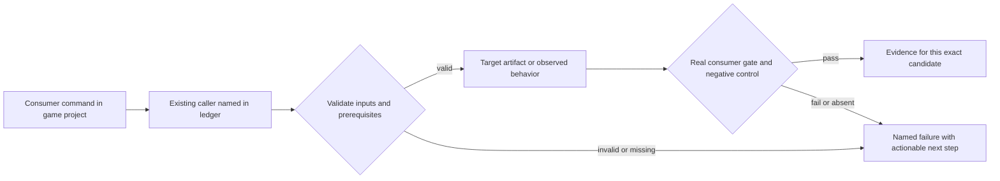
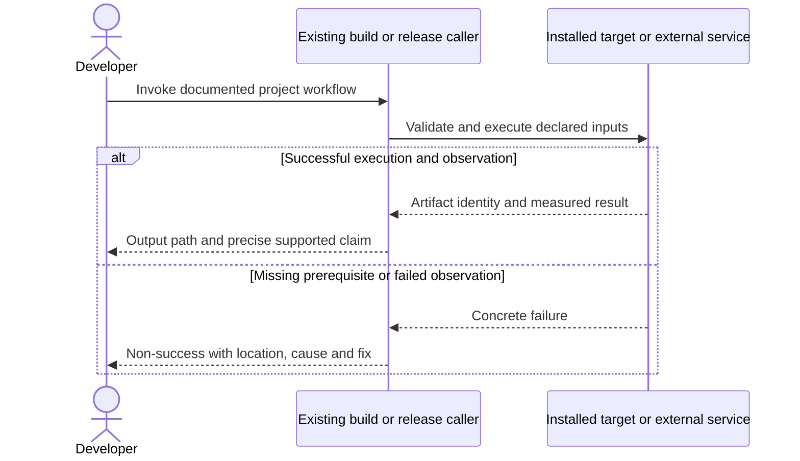

# PRD-153 — A consumer can brand launch, loading and packaged apps

**Status:** PARTIAL — phase 1 (Android release-artifact brand) landed and observed on the API 36 16 KB emulator; physical OEM appearance stays a separately named observation. Phase 2 (distributed desktop brand) now has a live caller — `verifyStarterContainer` and its CLI `--config` flag inspect the container's brand before anything launches — and real Windows PE resource inspection replacing the manifest-only false pass (evidence: [prd-375-readiness-phase-2-2026-09-15.md](../../verification/prd-375-readiness-phase-2-2026-09-15.md)). PRD-365's containers landed on `develop` (PR #224, `b66585f08`), so that blocker is gone. A real linux-x64 container built from a starter branded only in game files passes the shipped CLI end to end (300 frames, brand verified, exit 0) with three negative controls firing on the real artifact. What remains is Windows/macOS OS-launcher inspection and human capture on those hosts, a PRD-365 container `loading` record so a configured `bootSplash` can pass, and an independent reviewer PASS.
Renumbered 2026-09-11. Phase 1 evidence: [prd-375-readiness-phase-1-2026-09-12.md](../../verification/prd-375-readiness-phase-1-2026-09-12.md).

Drafted 2026-09-08 as a rewrite of PRD-153, which un-filed that PRD from `done/`. Its phase 1 was
PRD-153's own web branding and is already delivered — `web-brand.spec.ts` green, `branding.playtest.json`
tracked, re-confirmed by the readiness assessment — so it is dropped here rather than re-litigated.
What remains is what PRD-153 explicitly did not claim: the installed Android **release artifact** and
the **distributed desktop app** showing the developer brand.
[PRD-153](../done/PRD-153-game-branding-from-launch-to-play.md) is restored to `done/`; this PRD
extends it.
**Complexity:** 8 → HIGH (+3 files, +2 multi-package, +2 platform packaging, +1 OS appearance validation).
**Problem:** Game-owned branding controls exist, but their appearance on final distributed native artifacts has not been established for this release path.

Batch contract and dependency order: [production-readiness](README.md). Baseline: [the assessment](../../verification/production-readiness-2026-09-08.md), source `912a567e3e7592e6b437e49fe6318a3987d1f7c1`. iOS is outside this batch; no iOS readiness credit is created or removed.

## Integration ledger

| # | New or revised thing | Live caller at planning time | Replaces | Old path removed? | Negative control |
| --- | --- | --- | --- | --- | --- |
| 1 | Portable authored branding proof | packages/create-threenative/src/build.ts:314 resolvePackagingConfig; src/web-brand.ts: metadataLinks | web metadata proof treated as native proof | Existing adapters stay owners | Swap authored art for engine art; capture/artifact assertions fail |
| 2 | Live loading and handoff proof | packages/create-threenative/template-assets/loading.ts: createLoadingScreen; templates/starter scene entry | file-exists loading evidence | Retain generated render source | Disconnect loader or insert wrong-brand/blank handoff frame; scenario fails |
| 3 | OS launcher/app appearance | packages/runtime-native/scripts/package-android.mjs: packageAndroid; package-desktop.mjs: packageDesktop | SDL icon accepted as all desktop branding | Container mechanics delegated to PRD-365 | Remove embedded Windows/macOS icon resource; installed-artifact inspection fails |

## Current behavior and ownership

The report changed name/icon paths/theme color only in the installed game and verified web output. app.icon/app.icons/bootSplash and generated src/render/loading.ts already exist. Desktop staging currently proves a runtime SDL window icon, not executable/Finder/installed launcher metadata. Original PRD-153 closed with unverified device lanes.

Appearance stays game-generated source; native resource conversion/application is engine plumbing. [PRD-365](PRD-365-consumer-desktop-distribution.md) owns desktop containers/resource embedding; [PRD-212](../done/PRD-212-published-install-builds-android.md) owns signed Android packaging. This PRD owns the authored inputs, loading/handoff behavior and visible proof, avoiding duplicate packagers.

## Approach and boundaries

Reuse existing config loader, web-brand adapter, Android resources and generated loading implementation. Exercise custom artwork visibly distinct from the template and engine defaults. Treat static OS boot, HTML launch, live loading and playable frame separately. Do not introduce a new loading config/preset system. Test both missing asset rejection and changed pixels in the real artifact; metadata alone does not prove appearance.

Data/migration: no application database migration. New build metadata and evidence extend the existing package/config/artifact contracts; no parallel scene, project or release framework.





## Execution phases


### Phase 1 — The installed Android release carries the brand from launcher to gameplay

**Progress:**

- [x] Callers wired and building: `packages/runtime-native/scripts/package-android.mjs`, `packages/runtime-native/tests/android-packaging.integration.test.mjs`, `packages/create-threenative/__tests__/config.spec.ts`
      The branding render/install and config-validation callers already existed (PRD-153) and needed no production change; this phase's change is the missing release/AAB coverage in the integration test. Real builds: `threenative build --target android --allow-source-build` (debug, `BUILD SUCCESSFUL in 1m 48s`) and a release APK via the engine packager (`--mode release`, `BUILD SUCCESSFUL in 1m 36s`, 4 native libs 16 KB clean).
- [x] Required test green: `packages/runtime-native/tests/android-packaging.integration.test.mjs`
      36/36 passed 2026-09-12, including the release-APK brand, AAB brand and missing-variant tests.
- [x] Observed red recorded, then restored green
      Disconnected splash staging and a foreground/monochrome slot swap each made their test fail; restored. Separately, a non-alpha foreground was refused by config validation (`TN_CONFIG_BRAND_ANDROID_FOREGROUND_ALPHA_INVALID`) before Gradle.
- [x] User verification performed on the named platform
      API 36 16 KB AVD (`sdk_gphone16k_x86_64`), **release** APK (signed with the debug keystore, source build): OS splash (navy bg + authored red foreground + green branding image), live loading transition, App info launcher icon + label `PRD375 Brand`, playable starter frame, `TN_SURFACE_FRAME` present. Unobserved and named: physical OEM icon-mask appearance and the themed (monochrome) launcher icon.
- [x] Evidence record written: `docs/verification/prd-375-readiness-phase-1-2026-09-12.md`
- [x] Independent reviewer returned PASS
      Two fresh-eyes reviews (2026-09-12); the first returned NEEDS CORRECTION with seven findings, all fixed (distinct-variant assertions, AAB coverage, version/background assertions, honest evidence framing), and the second returned PASS.

**Files (maximum five):**

- EDIT `packages/runtime-native/scripts/package-android.mjs` — verified, no change required; the resource/handoff plumbing already carried the brand.
- EDIT `packages/runtime-native/tests/android-packaging.integration.test.mjs` — inspect final signed icon/splash/identity resources on the release APK and AAB.
- EDIT `packages/create-threenative/__tests__/config.spec.ts` — already covers invalid artwork refusal (config.spec.ts:424); unchanged.
- NEW `docs/verification/prd-375-readiness-phase-1-<date>.md` — commands, identities, red/green and reviewer decision.

**Implementation and wiring:** Consume PRD-212 release artifacts and PRD-221 aligned inputs. Inspect adaptive icon foreground/background/monochrome, label, application ID, version and boot splash from the final APK/AAB-derived installed app. Run actual launcher → OS splash → live loading → play on Android. Artwork/layout remains game input; invalid declared variants fail rather than silently reverting to defaults.

**Required test:** `packages/runtime-native/tests/android-packaging.integration.test.mjs`: should preserve custom icon and splash resources when packaging a signed consumer release; should reject a missing declared icon variant.

**Observed-red / revert control:** Remove adaptive XML or substitute splash/logo bytes in a disposable artifact; artifact inspector and visual comparison reject it. A valid app version alone cannot satisfy this gate.

**Verification commands** (from repository root unless noted; proposed flags are explicitly identified):

```sh
pnpm --filter @threenative/runtime-native exec vitest run --config vitest.config.ts tests/android-packaging.integration.test.mjs
pnpm exec vitest run packages/create-threenative/__tests__/config.spec.ts
```

**User verification:** Inspect launcher icon, themed icon where the emulator supports it, OS splash and the real loading transition. Physical OEM appearance is a separately named observation, not inferred from emulator pixels.

### Phase 2 — Distributed desktop apps display the developer brand

**Landing split:** `inspectContainerBrand(root, config, options)` is now called by
`verifyStarterContainer` in `packages/runtime-native/scripts/verify-starter-desktop.mjs`, before the
prerequisite check and the launch, and by that script's CLI through `--config <resolved config
json>`. Review of PR #255 found that the original export could accept missing splash evidence,
trust Windows manifest identity as PE evidence, and misread PRD-365's source-versus-converted-icon
hash contract; all three are corrected. Windows identity is now read out of the packaged
executable's own resource directory — `RT_GROUP_ICON`/`RT_ICON` and `RT_VERSION`/`VS_FIXEDFILEINFO`,
parsed with plain `fs` and `Buffer` and no new dependency — so a manifest and a sidecar PNG are no
longer accepted as evidence, and — after independent review — the PE version assertion is anchored
on the consumer config rather than on a container field the artifact could simply omit. macOS source provenance, payload integrity and plist linkage remain
proof of provenance, not of converted icon pixels. **Known limitation, carried forward and not
closed here:** an `.icns` whose payload is arbitrary bytes passes, because a PNG cannot be compared
byte-for-byte against the ICNS that `sips`/`iconutil` generate from it — independent review
confirmed this by passing a file whose whole content was a plain-text string. macOS icon *content*
stays unverified until a real `sips`/`iconutil` lane exists on a macOS host; only provenance and
payload integrity are claimed. PRD-365's writer emits no `loading` record, so a
configured `bootSplash` still reports missing evidence rather than a UI-only pass — and the real
container run confirmed the consequence: `TN_NATIVE_STARTER_CONTAINER_LOADING_MISSING` fires on any
container built from the scaffolded starter's own config, which declares `bootSplash` by default.
Emitting that record is container-writer work in `desktop-distribution.mjs`; on the owner's
2026-09-15 decision it is now done here under an explicitly widened file budget, so
`packageDesktopContainer` records `loading.bootSplash` as the authored colour plus the authored
image's hash, and records `{ bootSplash: null }` for a game that configures none — writing nothing
would leave a consumer unable to tell "no splash configured" from "evidence missing".
**Brand inspection is opt-in on the CLI, not default-on**, because the scaffold copies the engine's
own `template-assets/icon.png` to a starter's `public/icon.png`: a stock, unbranded starter would
fail `TN_NATIVE_STARTER_CONTAINER_ICON_ENGINE_DEFAULT` by design, and turning the check on by
default would red the existing starter lane rather than prove anything. Without `--config` the gate
prints `brand NOT inspected`; it never implies the identity was checked.

**Progress:**

- [x] Callers wired and building: `packages/runtime-native/scripts/verify-starter-desktop.mjs`, `packages/runtime-native/tests/starter-desktop.test.mjs`, `packages/create-threenative/README.md`
      `verifyStarterContainer` calls `inspectContainerBrand` after `resolveContainer` and before `assertPlayerPrerequisites`, records the result as `report.brand`, and the CLI reads the consumer config from `--config`. `packages/runtime-native/scripts/inspect-container-brand.mjs` now parses the packaged Windows `.exe`'s PE resource directory. Both READMEs name the `--config` recipe. `pnpm typecheck` exit 0 and `pnpm lint` exit 0 on this candidate (a stale post-merge install and stale `dist` had to be repaired with `pnpm install` + `pnpm build` first; neither is caused by this change).
- [x] Required test green: `packages/runtime-native/tests/starter-desktop.test.mjs`
      `pnpm --filter @threenative/runtime-native exec vitest run --config vitest.config.ts tests/starter-brand.test.mjs tests/starter-desktop.test.mjs`: **2 files, 91 tests passed**, exit 0 (64 before this change, 27 added). The wider desktop family — `desktop-container`, `desktop-release-transaction`, `distribution`, `starter-brand`, `starter-desktop`, `desktop-core-gate` — is **6 files, 200 passed**, exit 0.
- [x] Observed red recorded, then restored green
      This change, test-first: **12 failed / 42 passed (54)** in `tests/starter-brand.test.mjs` against the un-integrated inspector, then **78/78** across both files after implementing. Then, from independent review of `7bb0df3a6`: **4 failed / 55 passed (59)** on the reviewer's three repro inputs, then **2 files / 83 passed** after correcting them. A fourth check of the same shape, found by sweeping the file rather than by the reviewer — a missing PE `FileDescription` passing on `ProductName` alone — went **1 failed / 59 passed (60)**, then **2 files / 84 passed**. Historical test-first red: 10 failed / 19 passed, then 29/29. Review regressions: 25 failed / 2 passed, then 27/27; three further controls failed before correction, then 30/30. Record: `docs/verification/prd-375-readiness-phase-2-2026-09-15.md`.
- [ ] User verification performed on the named platform
      **linux-x64 done and owner-inspectable; Windows and macOS wired to CI, awaiting a run.** A real PRD-365 container was built from a starter branded only in game files (`orbit-brand.tar.gz` sha256 `1da75994…`) and the shipped CLI passed on it end to end: `starter desktop gate passed: 300 frames, 21910 colors, 337 asset pixels, brand Orbit Brand verified`, exit 0, with a non-blank 1280x720 capture (`e099b09d…`) inspected as the drawn starter scene. The real `.desktop` launcher entry is `desktop-file-validate`-clean and names `Orbit Brand`; three negative controls fire on the real artifact, the name control in 0.17 s, before any launch. Rebuilt since, with `bootSplash` **kept** — the arm a real scaffolded project produces, which only became possible once the container recorded its loading sequence — and with authored art a person can look at: a 256x256 amber ringed planet (`48b3782a…`) and a matching 1024x576 splash (`86b5578f…`), both visually inspected, replacing the first run's 1x1 PNG. Container `f93e0953…`; `--brand-only` exit 0 and the full launching gate exit 0, both against the stock config. The owner's launch command is in the evidence record. Windows and macOS are now wired into the existing `native-platforms` `desktop` matrix job through `--brand-only`, which needs no display and therefore also runs on the Windows leg that cannot launch. The box stays open because **that CI run has not happened yet** for this candidate, and because nothing has been opened from a real GUI file manager or Finder session.
- [x] Evidence record written: `docs/verification/prd-375-readiness-phase-2-2026-09-15.md`
- [ ] Independent reviewer returned PASS
      An independent review of `7bb0df3a6` returned **NEEDS CORRECTION** with three findings, all of the same false-pass shape — a check that retires itself when the artifact omits or duplicates the evidence it reads. Blocking: a container manifest omitting `app.version` silently retired the PE file-version check. Non-blocking: only the first `RT_GROUP_ICON` was inspected, and a truncated PE crashed with an unnamed `RangeError`. All three are fixed red-green (**4 failed / 55 passed**, then **83 passed**) and recorded in the evidence file with that provenance. Sweeping the same file for the same shape found a fourth, not reported by the reviewer: a missing PE `FileDescription` passed on `ProductName` alone (**1 failed / 59 passed**, then **84 passed**). The reviewer's remaining findings then arrived: a `--config` (and, worse, a `--container`) whose value was missing or an empty shell expansion silently turned the check off rather than failing — the `--container` case would have downgraded the two `native-platforms.yml` jobs to the developer-artifact path while still printing a pass. Every flag and value is now strict (**5 failed / 62 passed**, then **91 passed**). One reviewer finding is deliberately **not** fixed: macOS `.icns` payload content is unverifiable without a real `sips`/`iconutil` lane, and is named as a known limitation above rather than papered over. The box stays open until a re-review of the corrected head clears it; the container and visual acceptance on Windows/macOS also remain unverified.

**Review correction (2026-09-15):** same phase and existing file budget. Unsafe paths and escaping
symlinks, missing payload/source hashes, malformed config/platform/loading records, wrong launcher
icon links, desktop-action name confusion, duplicate/stale plist names and empty brand assertions
now fail. Relative authored assets resolve against `options.project`. Loading and web-entry checks
both run; UI existence cannot substitute for a configured splash. Existing fixtures now use the
producer's `{ sha256 }` inventory shape. No screenshot/runtime launch behavior was changed.

**Owner decision, 2026-09-15 — the file budget is widened for one file.** The gate as specified was
unreachable: `templates/starter/threenative.config.ts` sets `bootSplash`, and neither
`package-desktop.mjs` nor `desktop-distribution.mjs` contained a single occurrence of `loading`, so
every container derived from the stock template failed `TN_NATIVE_STARTER_CONTAINER_LOADING_MISSING`
and the real-container run had to strip `bootSplash` to go green — the check protected approximately
no real project. The owner chose to emit the record here rather than open a separate PR against
PRD-365's surface, which has landed on `develop` and is now just develop code. `EDIT
packages/runtime-native/scripts/desktop-distribution.mjs` is therefore a sixth file in this phase by
explicit decision, not scope creep.

**Files (maximum five, plus one by the owner decision above):**

- EDIT `packages/runtime-native/scripts/desktop-distribution.mjs` — record the configured loading sequence in the container manifest (owner-approved sixth file).
- EDIT `.github/workflows/native-platforms.yml` + NEW `.github/fixtures/prd-375-brand-icon.png` — inspect the brand of the real Windows and macOS containers the existing `desktop` matrix job already builds, per the owner's 2026-09-15 platform policy that Windows and iOS are evidenced through CI rather than a local host.
- EDIT `packages/runtime-native/scripts/verify-starter-desktop.mjs` — launch packaged app and inspect configured brand evidence.
- EDIT `packages/runtime-native/tests/starter-desktop.test.mjs` — wrong-resource and missing-brand controls.
- EDIT `packages/create-threenative/README.md` — point users to game-owned branding surfaces.
- NEW `docs/verification/prd-375-readiness-phase-2-<date>.md` — commands, identities, red/green and reviewer decision.

**Implementation and wiring:** Consume PRD-365 containers and their native icon resources; do not build another .app or Windows resource writer. Launch the installed Windows distribution, macOS .app and Linux launcher with distinctly branded artwork. Verify file-manager/launcher identity separately from runtime SDL title/icon. No claim of a nonexistent desktop OS splash: specify the platform-native launch surface and require the game loading sequence once rendering begins.

**Required test:** `packages/runtime-native/tests/starter-desktop.test.mjs`: should reject a distributed starter when the embedded application icon or runtime brand differs from its consumer config.

**Observed-red / revert control:** Remove icon resource/Info.plist entry/desktop metadata in isolated copies and substitute the engine icon. The relevant platform inspection fails even if the game frame renders.

**Verification commands** (from repository root unless noted; proposed flags are explicitly identified):

```sh
pnpm --filter @threenative/runtime-native exec vitest run --config vitest.config.ts tests/starter-desktop.test.mjs
# On each candidate consumer host:
pnpm build:desktop
pnpm test:native
```

**User verification:** Open the packaged app from its normal OS launcher/file manager, inspect name/icon and loading sequence; record captures and configuration/artifact hashes. Only game files were edited to customize it.

## Verification contract

Each phase edits its named pre-existing caller and includes the phase evidence record within the five-file budget. File lists are bounded implementation assignments, not permission for adjacent cleanup. If investigation needs more files, split the phase before implementing; do not silently widen it. Query `engine_search_capabilities` and inspect every hit before any qualifying package/helper work, as the repository requires.

Run the phase command, its observed-red control, restore the implementation and rerun green. Record exact candidate SHA, package versions/integrities, source and artifact hashes, platform/adapter/session, command, exit code, assertion count and artifact paths. A missing observation, skipped test, stale artifact or zero-assertion run is not PASS. Fixtures/local tarballs may prove mechanics; public-consumer acceptance requires registry packages and public runtime downloads with no engine checkout, source override or injected manifest.

For executable changes run `pnpm typecheck && pnpm lint && pnpm test`, `pnpm budgets`, and the affected real playtest/platform lane. Generate mirrors with `pnpm sync:agents` if AGENTS changes. Use platform-specific hosted runs for Windows/macOS, emulators for Android behavior, and physical Android only for claims that require hardware. Name unexecuted targets. A runtime change needs a real playtest scenario in the same implementation, not only the focused tests named below.

After every phase, an independent reviewer receives this PRD, diff, commands and artifacts and returns PASS / NEEDS CORRECTION / BLOCKED. It checks caller integration, negative controls, removed/delegating incumbent paths and the actual consumer outcome. No phase starts on a self-awarded PASS. Visual phases also require human inspection of captures; credentialed signing/submission and external-person checkpoints remain PENDING until executed. Do all authorized preparation before requesting any missing external authorization. This planning request does not authorize publishing packages, uploading to stores or contacting external people.

## Verification evidence

The original planning revision ran no implementation gates. Phase 1 retains its dated evidence; phase 2 has historical Vitest evidence and the isolated review-correction results above, not current full-workspace or OS acceptance. Write each phase to `docs/verification/prd-<id>-readiness-phase-<n>-<date>.md` (the evidence file listed in each phase); use the existing runtime performance ledger for new performance measurements. Fill actual results and non-test `file:line` callers at implementation time; a phase cannot close with placeholders. Acceptance boxes below remain unchecked until all phase checkpoints pass.

## Acceptance criteria

- [ ] App identity, platform icon variants, boot/HTML splash and live loading changes are made solely in consumer config/public assets/src/render.
- [ ] Web and final Android/desktop artifacts show distinct custom branding; SDL window-icon evidence is not substituted for installed-app metadata.
- [ ] Invalid declared assets and disconnected rendering/resource paths produce observed-red failures.
- [ ] Loading and playable-frame handoff remain nonblank and responsive within actual safe areas; progress is measured rather than fabricated.
- [ ] All target captures receive human inspection and same-artifact playback proof; iOS historical status is unchanged.

## Prior work retained

Moved from `docs/PRDs/done/PRD-153-game-branding-from-launch-to-play.md` under the owner's 2026-09-08 instruction. This revision replaces the execution scope, not historical test results. [Original plan at the assessed commit](https://github.com/ThreeNativeHQ/threenative/blob/912a567e3e7592e6b437e49fe6318a3987d1f7c1/docs/PRDs/done/PRD-153-game-branding-from-launch-to-play.md) remains the immutable history. Original completion at 930569b plus 620e464/a4a7db3 remains credited. This reopening is final non-iOS consumer-artifact appearance, not removal of the established app/icons/bootSplash API.

Historical evidence: [prd-153-154-integration-2026-08-19.md](../../verification/prd-153-154-integration-2026-08-19.md).
