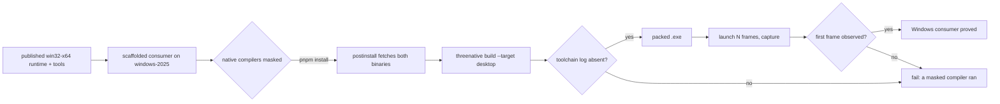

# PRD-376 — A Windows consumer installs the published runtime and builds a game that runs

**Status:** PARTIAL. Filed 2026-09-11. Phase 1 is proved on a hosted Windows runner (run 34736214113, SHA `d2463bc38`: `clean-consumer-windows` completed/success, every step green — install from the published win32-x64 runtime, desktop build with every native compiler masked, 300-frame launch and non-blank screenshot on D3D12/WARP). Two Phase 1 items remain open: the hosted *toolchain* negative controls and an independent review. Phase 2's rendering question is settled by that run (WARP presents).
**Complexity:** 4 → MEDIUM (+1 files, +2 a platform lane that does not exist, +1 hosted-runner and software-rasteriser integration). The code volume is small; the difficulty is that every assumption in the Linux lane — POSIX shims, `xvfb`, `install -m 0755`, a Vulkan ICD — is false on Windows.
**Problem:** PRD-262 publishes `threenative-runtime-win32-x64.exe` and `threenative-tools-win32-x64.exe`, but `clean-consumer` runs on `ubuntu-24.04` only, so no consumer has ever installed those assets and built a game with them.

Batch contract and dependency order: [production-readiness](README.md). Baseline: `993907cf0` on `fix/prd-262-publish-build-tool-helper`.

## Why this is not PRD-365 or PRD-366

[PRD-365](PRD-365-consumer-desktop-distribution.md) owns the release *container* — the ZIP, the embedded icon and version resources, WebView2 prerequisites, signing. [PRD-366](PRD-366-one-consumer-game-proves-supported-platforms.md) owns one real *game* proving the supported platforms. Both assume the Windows desktop build works and package or play its output. **Nothing owns proving it works.** This PRD is the prerequisite both are standing on, and it is deliberately narrow: install from the published cohort, build, run, stop.

## Current behavior and ownership

`native-release.yml:666` `clean-consumer` is `runs-on: ubuntu-24.04`. It masks native toolchains with POSIX shell shims written to a directory prepended to `PATH`, installs a software Vulkan ICD, builds `--target desktop`, and launches the packed game for 300 frames under `sh scripts/xvfb.sh`. Every one of those mechanisms is Linux-specific.

The Windows row builds and is published (`native-release.yml:303`, `PREBUILT_ASSET_NAMES.win32-x64`), and `platformKey` accepts `win32-x64`, so `installPrebuilt` will serve it. What is unproved is everything after the download.

Engine distribution layer. This PRD owns the Windows consumer proof only. It does not own signing (PRD-365), the release container (PRD-365), gameplay credit (PRD-366) or publication (PRD-060).

## Integration ledger

| # | New or revised thing | Live caller at planning time | Replaces | Old path removed? | Negative control |
| --- | --- | --- | --- | --- | --- |
| 1 | `clean-consumer-windows` job | `.github/workflows/native-release.yml:1391` `finalize` job's `needs:` (job defined at `:1206`) | nothing; the Windows claim was previously unproved | n/a, new coverage | Delete the installed `mystral-tools.exe` before the build; the job must fail naming it, not silently succeed |
| 2 | Windows toolchain mask (`.cmd` shims) | the new job's `Mask every native toolchain entry point` step, `.github/workflows/native-release.yml:1314` | the POSIX `printf`/`chmod` mask, which cannot run here | n/a, parallel lane for a different OS | Invoke `cl` directly in the job; the mask must record it and exit non-zero |
| 3 | `scripts/__tests__/native-release-proof.spec.ts` assertions for the Windows job | the spec is already collected by `pnpm exec vitest run`; Windows tests at `:639` | nothing | n/a | Rename the job in the workflow; the spec must go red (observed: 5 tests fail with "missing job clean-consumer-windows") |

## Approach and boundaries

Mirror `clean-consumer`'s *claims*, not its *mechanisms*. Reuse the same packed-tarball scaffold path and the same loopback proof-asset server so the two lanes prove the same thing about different platforms.

Windows specifics that must be solved rather than assumed:

- **Masking.** `cargo`, `cl`, `clang`, `cmake`, `link`, `ninja`, `rustc` are masked with `.cmd` shims that log their invocation and `exit 97`, in a directory prepended to `PATH`. MSVC is present on `windows-2025` images, so the mask must be proved to actually shadow it — see ledger row 2's control.
- **Rendering.** The runner has no GPU. Dawn's D3D12 backend can fall back to WARP, Microsoft's software rasteriser. This is the single biggest unknown in this PRD and Phase 2 exists to settle it; if WARP cannot present, Phase 2 narrows to a headless frame-count claim and says so rather than being marked done.
- **No `xvfb`.** Windows sessions on hosted runners have a desktop; the 300-frame launch runs directly.

**Do not** claim cross-compilation from Linux, add signing, or widen to macOS. macOS stays in `UNPUBLISHED_PREBUILT_KEYS` under PRD-262 until someone runs a downloaded prebuilt on real hardware; a Windows lane creates no evidence about it.

Data/migration: none. No new package; no new engine module. This is CI coverage plus the assertions that keep it honest.



## Execution phases

### Phase 1 — A Windows consumer builds the desktop target with every native compiler masked

**Phase checklist:**

- [x] Files wired — the new job exists and `finalize` lists it in `needs:` (`native-release.yml:1206`, `:1391`; also `cleanup-failed-release` at `:1413`)
- [x] Required test passing — the spec asserts the job, its runner, its mask, its helper assertion and the prepare-step files it builds (`pnpm exec vitest run scripts/__tests__/native-release-proof.spec.ts`: 43 passed; `ci-structure.spec.ts`: 108 passed; `native-platform-workflow.test.mjs` + `ios-packaging.test.mjs`: 55 passed earlier)
- [ ] Observed red — the hosted lane reached and fixed two real failures (run 34725179598: the full non-iOS cohort was demanded while `build-android` uploaded nothing; run 34730868090: the consumer build's config fell through to a repo-relative fixture), then went green on run 34736214113. The two Windows *toolchain* controls now run inline in the job (`Prove the mask shadows MSVC...`, `Prove a removed helper fails the build naming it...`). Run 34743159341 exercised the first control and failed it: a bare `cl` from Git Bash is not resolved through PATHEXT, so it reported 127 and the `-eq 97` assertion failed — the control now invokes `cmd.exe //c "cl /?"`, which is how a Windows build tool resolves the name. Hosted result on the next run closes this box.

**Hosted observation, run 34743159341 (SHA `87a4bac09`, 2026-09-13):** all real steps passed (install from the published win32-x64 row, masked desktop build, and the artifact upload); the job failed only in its first negative control, because the control called `cl` from Git Bash, which does not execute a `.cmd` shim by bare name and returned 127 rather than the shim's 97. Fixed by invoking through `cmd.exe`, the resolution path the mask is designed to intercept; the controls now also upload their logs and exit codes so a failure is inspectable from the artifact rather than only the run log.
- [ ] Independent review PASS
- [x] User verification — the job is green on a real hosted Windows runner (run 34736214113, SHA `d2463bc38`: `clean-consumer-windows` completed/success, every step green)

**Hosted observation, run 34725179598 (PR #223, 2026-09-12):** the job reached the runner and failed in `Serve same-run proof assets`, because `build-android`'s V8 source build hit its own 2h cap (exit 124) and uploaded no `runtime-android-*` assets, while the copied full-cohort check demanded every published non-iOS runtime. Fixed by serving only the win32 row the consumer installs (`pattern: runtime-win32-x64`, `PUBLISHED_PREBUILT_KEYS.filter(key => key.startsWith("win32-"))`).

**Hosted observation, run 34730868090 (PR #223, 2026-09-13, head `88c7e2c40`):** the win32-only serve fix passed (`build-android` completed on this run, and step 7 succeeded), and `clean-consumer-windows` progressed through install and scaffold to its first consumer build. It then failed at `Install and build without a native toolchain`: `failed to load config from ...\vite.config.ts` / `ENOENT: no such file or directory, open 'D:\a\packages\physics\__tests__\fixtures\physics-parity.scenario.json'`. The prepare step copied `vite.config.ts` but not the `physics-parity.scenario.json` fixture that config reads as a sibling, so the read fell through to the repository-relative `../../packages/physics/...` path, which does not exist outside the checkout. Fixed by copying the fixture in the Windows prepare step (matching `clean-consumer`'s step), pinned by a new spec test.

**Hosted proof, run 34736214113 (PR #223, 2026-09-13, SHA `d2463bc38`):** `clean-consumer-windows` completed/success, every step 1–16 green. `install-status.json.ok === true`; both `prebuilt/win32-x64/threenative-runtime.exe` and `mystral-tools.exe` were present **before** `build --target desktop`; the build ran with `cargo cl clang clang++ cmake c++ g++ gcc link ninja rustc` masked and left no toolchain-log entry; the packed `.exe` then rendered 300 frames — `TN_NATIVE_SMOKE_READY:webgpu`, `TN_NATIVE_SMOKE_FIRST_FRAME`, `TN_NATIVE_SMOKE_300_FRAMES:300`, `Rendered 300 frames in 16730ms` — binding `[WebGPU] Adapter: Microsoft Basic Render Driver / Vendor: microsoft / Backend: D3D12` (WARP software rasteriser, the honest answer on a GPU-less runner), with `inspectScreenshot` returning `{ height: 768, width: 1024 }`. Artifact `clean-consumer-windows-x64` uploaded (3601535 bytes).

**Files (maximum five):**

- EDIT `.github/workflows/native-release.yml` — add `clean-consumer-windows`; add it to `finalize`'s `needs:`.
- EDIT `scripts/__tests__/native-release-proof.spec.ts` — assert the job, runner, mask set and helper check.
- NEW `docs/verification/prd-374-windows-consumer-phase-1-<date>.md` — commands, identities, red/green, reviewer decision.

**Implementation and wiring:** Gate the job exactly as `clean-consumer` is gated, minus the Android `needs`. Reuse `Pack the exact scaffold consumer packages` and `Scaffold from local tarballs` verbatim in intent. Assert `install-status.json.ok === true` and that `prebuilt/win32-x64/mystral-tools.exe` exists **before** `build --target desktop`, so the published cohort — not the job — is what supplies the helper. Assert the toolchain log is absent afterwards.

**Required test:** `scripts/__tests__/native-release-proof.spec.ts`: should run the Windows consumer on a Windows runner with `cl`, `cmake`, `rustc` and `ninja` masked; should assert the installed helper before the desktop build, never place one.

**Observed-red / revert control:** In a scratch branch, (a) call `cl` in the job and confirm exit 97 is recorded and the job fails; (b) delete `prebuilt/win32-x64/mystral-tools.exe` after install and confirm the build fails naming that path rather than falling back to a source build.

**Verification commands:**

```sh
pnpm exec vitest run scripts/__tests__/native-release-proof.spec.ts
# and the hosted run itself, which is the only thing that proves the claim:
gh run view <id> --json jobs --jq '.jobs[] | select(.name=="clean-consumer-windows") | .conclusion'
```

**User verification:** The job is green on `windows-2025`, its log shows the runtime and helper arriving from the release manifest, and no `TN_TOOLCHAIN_LOG` file exists at the end.

### Phase 2 — The packed Windows game launches and renders

**Phase checklist:**

- [x] Files wired — the launch step runs in the same job and `finalize` depends on its result
- [x] Required test passing — the spec asserts the frame count and the first-frame marker (41 passed locally)
- [ ] Observed red — a build with no renderer reaches no first frame and fails the step. The control now runs inline in the job (`Prove a renderer that never presents fails the marker assertion`): the stub entry starts and exits 0, and the step's own `TN_NATIVE_SMOKE_FIRST_FRAME` grep is asserted to fail. The hosted result of that step on the next `clean-consumer-windows` run closes this box.
- [ ] Independent review PASS
- [x] User verification — the hosted run's launch step passed with a non-blank capture (`inspectScreenshot` `{ height: 768, width: 1024 }`); run 34736214113, SHA `d2463bc38`. A human eye on the artifact starter capture is a separate open item below.

**Hosted proof, run 34736214113 (SHA `d2463bc38`):** the launch step recorded `Rendered 300 frames in 16730ms`, markers `TN_NATIVE_SMOKE_READY:webgpu` / `TN_NATIVE_SMOKE_FIRST_FRAME` / `TN_NATIVE_SMOKE_300_FRAMES:300`, and `[WebGPU] Adapter: Microsoft Basic Render Driver / Vendor: microsoft / Backend: D3D12` — WARP, the software rasteriser this PRD predicted. The capture artifact is in `clean-consumer-windows-x64`.

**Files (maximum five):**

- EDIT `.github/workflows/native-release.yml` — launch the packed executable, capture, assert markers.
- EDIT `scripts/__tests__/native-release-proof.spec.ts` — assert the launch step and its markers.
- NEW `docs/verification/prd-374-windows-consumer-phase-2-<date>.md` — evidence, including the capture.

**Implementation and wiring:** Launch the packed `.exe` with `--screenshot` and `--frames`, then require `TN_NATIVE_SMOKE_READY` and `TN_NATIVE_SMOKE_FIRST_FRAME` in the log, matching the Linux lane's assertions. Record the adapter the runtime reports: a run that does not name its adapter may be a software rasteriser, and this lane almost certainly **is** WARP — say so in the evidence rather than implying hardware.

**Proof subject:** the default starter, including its UI and assets — not `native-smoke`. The Linux lane already made that choice and a weaker subject here would make the two lanes incomparable.

**Observed-red / revert control:** Point the launch at a build produced with the renderer disabled; the step must fail on the missing first-frame marker rather than passing on a process that exited 0.

**If WARP cannot present:** narrow the phase to a headless frame-count claim, mark the capture criterion **not met**, and file the GPU-backed Windows launch as its own blocked item. Do not tick a box on a run that produced no frame.

**Verification commands:**

```sh
pnpm exec vitest run scripts/__tests__/native-release-proof.spec.ts
gh run download <id> --name windows-consumer-capture
```

**User verification:** A human looks at the capture and sees the starter, not a black frame. Per the repository's visual rule, a fresh reviewer judges the capture; gates alone do not clear it.

## Verification contract

Each phase edits its named pre-existing caller and includes its evidence record within the five-file budget. Run the phase command, its observed-red control, restore and rerun green. Record the exact SHA, run id, job conclusion, adapter string, command, exit code, assertion count and artifact paths. A missing observation, skipped test, stale artifact or zero-assertion run is not PASS.

**This PRD cannot be closed from a Linux machine.** Every claim it makes is about a hosted Windows runner, and the honest local gate is `pnpm exec vitest run scripts/__tests__/native-release-proof.spec.ts` — which proves the workflow says what it should, never that it works. Name the hosted run id or the phase is unverified.

For executable changes run `pnpm typecheck && pnpm lint && pnpm exec vitest run` and `pnpm budgets`. Note that `pnpm test` aborts inside `runtime-native` on pre-existing unbuilt-executable reds on any machine with no compiled native host.

After every phase, an independent reviewer receives this PRD, the diff, the commands and the artifacts and returns PASS / NEEDS CORRECTION / BLOCKED. No phase starts on a self-awarded PASS.

## Acceptance criteria

Consumer-scoped: each one is false for a build a user could not tell apart from today's.

- [ ] A scaffolded consumer on a Windows host installs `@threenative/runtime-native` and receives both `threenative-runtime-win32-x64.exe` and `mystral-tools.exe` from the published release, with `install-status.json.ok === true`. — PROVED on run 34736214113 (SHA `d2463bc38`): step `Install and build without a native toolchain` passed both `test -s` checks on the two `prebuilt/win32-x64/*.exe` files and the `install-status.json.ok === true` assertion. Box left open pending independent review.
- [ ] That consumer runs `threenative build --target desktop` to completion with `cl`, `cmake`, `rustc` and `ninja` masked, and no masked compiler is invoked. — PROVED on run 34736214113: the build completed and `test ! -e "$TN_TOOLCHAIN_LOG"` passed with all eleven compilers masked. Box left open pending independent review.
- [ ] Removing the installed helper makes the build fail naming `prebuilt/win32-x64/mystral-tools.exe`, with no silent source-build fallback. — NOT RUN: needs a scratch hosted branch that deletes the helper post-install.
- [ ] The packed Windows executable launches and reports its first rendered frame, with the adapter it used recorded verbatim. — PROVED on run 34736214113: `TN_NATIVE_SMOKE_FIRST_FRAME` and `TN_NATIVE_SMOKE_300_FRAMES:300`, `Rendered 300 frames in 16730ms`, adapter recorded as `Microsoft Basic Render Driver` / `microsoft` / `D3D12`. Box left open pending independent review.
- [ ] A human has looked at a capture from that launch and confirmed it shows the starter. — NOT YET: the `clean-consumer-windows-x64` artifact (3601535 bytes, `threenative-consumer.png` 1024×768) exists but no human has inspected it.
- [ ] The `clean-consumer-windows` job is in `finalize`'s `needs:`, so a Windows regression fails the release rather than being advisory. — PROVED by the spec (`native-release-proof.spec.ts`) and the workflow wiring at `native-release.yml:1393`. Box left open pending independent review.

## Prior work retained

None; this PRD is new. The gap it closes was found on 2026-09-11 while narrowing PRD-262's published cohort: Windows was added to the published set on the reasoning that SmartScreen warns rather than refuses, which makes shipping it safe — but nothing had ever installed and built from it. See [PRD-262](../done/PRD-262-the-runtime-native-prebuilt-release-exists.md) and [`docs/RELEASE-SIGNING.md`](../../RELEASE-SIGNING.md).
