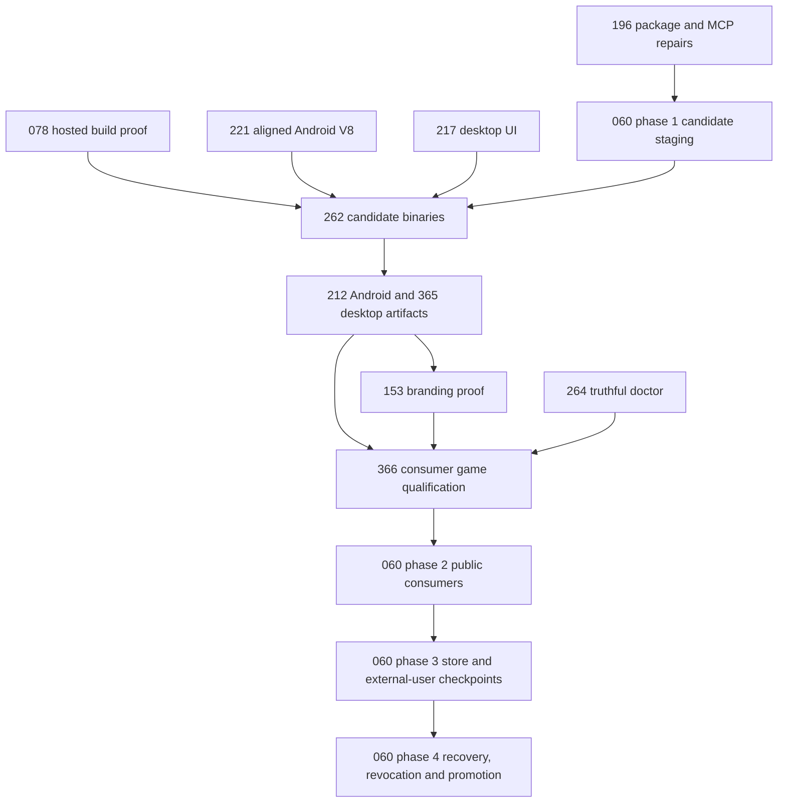

# Production readiness — install, author, build and distribute

**Start PRD-196 phase 1, PRD-078 phase 1, PRD-221 phase 1 and PRD-217 phase 1 in parallel.** Use the phase schedule below; whole PRDs are not independent work units. This batch closes the [2026-09-08 assessment](../../verification/production-readiness-2026-09-08.md): a developer installs public packages, gets the authoring tools, changes game files and branding, then builds playable web, desktop and Android artifacts without engine source.

**Status: PLANNED.** Nine existing PRDs were moved here and revised; two are new. No implementation or release readiness is claimed by filing the plans. Source baseline: `912a567e3e7592e6b437e49fe6318a3987d1f7c1`. iOS is excluded from this batch's acceptance; existing iOS implementations, simulator gates and unclosed external PRD criteria are preserved.

## Owners and order

| PRD | Outcome owned here | Origin / current status | Prerequisites for final acceptance |
| --- | --- | --- | --- |
| [PRD-196](../BLOCKED/requires-release-credentials/PRD-196-published-install-is-functional.md) | Complete public package/cohort installation and automatic MCP toolchain | Moved from done/; PARTIAL | None for repairs; 060 for final public cohort |
| [PRD-078](PRD-078-toolchain-free-consumer-proof.md) | Current exact-candidate hosted runtime build proof | Moved from BLOCKED/; PARTIAL | Current candidate CI; do not reuse old failure diagnosis |
| [PRD-221](../done/PRD-221-android-v8-is-16kb-clean.md) | Aligned default V8 and real 16 KB Android execution | DONE — all phases and acceptance verified, reviewer PASS | — |
| [PRD-217](PRD-217-webview-ui-layer.md) | Default React HUD on Windows/macOS/Linux sessions | Moved from done/ (already PARTIAL); PARTIAL | None for platform implementation |
| [PRD-374](../done/PRD-374-doctor-predicts-the-requested-build-prerequisite.md) | Target-scoped build prerequisite prediction; Blender/editor separation | NOT STARTED | Extends done [PRD-264](../done/PRD-264-doctor-answers-all-three-questions-a-game-author-has.md); consumes contracts from 196/212/217/365 |
| [PRD-212](PRD-212-published-install-builds-android.md) | SDK-current signed Android APK/AAB from game project | Moved from mobile/; PARTIAL | 221 inputs; 262 downloaded artifacts |
| [PRD-365](PRD-365-consumer-desktop-distribution.md) | Complete desktop containers and signing/notarization | NEW; PROPOSED | 217 overlays; 212 mode parsing; 262 binaries |
| [PRD-375](PRD-375-release-artifacts-carry-the-game-brand.md) | Android release artifact and distributed desktop app carry the brand | NOT STARTED | 212/365 final artifacts; 217 UI |
| [PRD-262](PRD-262-the-runtime-native-prebuilt-release-exists.md) | Complete version-matched downloadable runtime assets | Moved from mobile/; PARTIAL, phases 1-3 landed | 078 hosted proof; 196 package contents; 221/217 final inputs |
| [PRD-366](PRD-366-one-consumer-game-proves-supported-platforms.md) | Actual consumer game and physical Android qualification | NEW; PROPOSED | 196/212/217/221/262/365; 153 captures |
| [PRD-376](PRD-376-windows-consumer-builds-and-runs.md) | A Windows consumer installs the published runtime, builds and runs | NEW; PROPOSED | 262 publishes the win32-x64 cohort; prerequisite for 365 and 366 |
| [PRD-060](PRD-060-promoted-consumer-distribution.md) | Public candidate verification, recovery, promotion, stores and outside users | Moved from BLOCKED/; PROPOSED | All applicable owner results; external credentials/people only at their checkpoint |
| [PRD-378](../done/PRD-378-one-local-command-publishes-every-package.md) | One local `pnpm` command publishes the npm cohort and the host native runtime | DONE — all phases and acceptance verified, reviewer PASS | — |

Dependencies in the table are acceptance dependencies, not a prohibition on preparing tests/configuration earlier. Candidate production is deliberately split from final public proof: PRD-060 phase 1 stages, PRD-262 supplies downloads, PRD-366 qualifies, then PRD-060 phases 2–3 verify public consumers and obtain credentialed/external-user evidence before phase 4 promotes. Do not create an all-phases dependency cycle by requiring final promotion before candidate testing.

## Execution order and parallel work

Use four implementation lanes initially: packages (196), hosted releases (078), Android (221), and desktop UI (217). The schedule is dependency-driven: start a ready phase as soon as its predecessor passes review and releases its files; do not wait for every lane to finish a row. Reserve independent review capacity for each handoff. With fewer workers, prioritize 196 plus the native lane with the longest observed build/provisioning delay; no duration estimates exist yet.

| Order | Work that can overlap | Handoff required before proceeding |
| --- | --- | --- |
| 1. Repair foundations | 196 phases 1–5 in sequence; 078 phase 1; 221 phases 1–2; 217 phases 1 → 2 → 3A. These four lanes have disjoint declared implementation files. | 078 releases its workflow test before 221 phase 3. Keep Windows/macOS UI edits sequential because they share the bridge, linkage and tests. Hosted proof here is preliminary if later repairs change the candidate SHA. |
| 2. Establish build contracts | After 221 phase 2, run 212 phases 1 → 2 → 3. After 212 phase 2, start 365 phase 1 while Android phase 3 finishes. Run 221 phase 3 after 078. A free lane can prepare 153 phase 1 after 196's template/package changes settle. | After 365 phase 1 and 221 phase 3, run 217 phase 3B → 4. Then run 264 phases 1 → 2 once 196's MCP, 212's mode/SDK and 365's packaging contracts are available. 365 phases 2–3 wait for 212 phase 3 to release the runtime README. |
| 3. Integrate distribution and prepare the candidate | After 078's workflow handoff, implement 262 phase 1's download/lock mechanics alongside disjoint work in order 2. Run 262 phase 2 after 212 and 365 release both packagers and distribution tests. Follow with 153 phase 2 → 3. Prepare 366 phase 1 after 196 phase 5; its browser/scenario work can overlap native packaging and branding work on disjoint files. | Integrate all package/runtime/template repairs, including 264 and any branding fixes. Hand the release workflow from 262 to 060 phase 1, after 196 phase 4's release-script handoff. Recalculate the complete cohort, freeze the candidate identity, and rerun 078 on that exact candidate before producing 262's final downloads. Actual staging/publication requires its existing authorization checkpoint. |
| 4. Qualify the same candidate | Rerun 196 install/MCP proof, 212 Android artifact proof, 365 desktop artifact proof and 264 diagnostics against the staged cohort. Execute platform checks on separate hosts in parallel, including 221's 16 KB proof, 217's HUD checks and 153's brand captures. Then finish 366 phases 1 → 2 → 3. | All observations must identify the same candidate and applicable final artifact hashes. 366 phase 2 waits for 153 phase 3's desktop-verifier handoff; phase 3 follows the playable-artifact proof. Any repair changes the candidate: rebuild/restage and rerun affected evidence before advancing. |
| 5. Verify public consumers and promote | 060 phase 2 → phase 3 → phase 4. Within phase 2, template/package-manager/target consumers can run in parallel. Within phase 3, authorized store, desktop-signing and outside-user observations can run independently on the qualified artifacts. | Phase 4 waits for every applicable owner result and external checkpoint. Recovery/revocation/promotion share one serialized release owner. Preparation may overlap earlier work; final public acceptance cannot. |

Orders 2–3 include implementation and intermediate mechanics proof, not final acceptance. In particular, 212/365 can implement against local inputs before 262 publishes downloads, and 262 can implement staging before 060 executes candidate staging. Their final consumer gates run in order 4. This is how the acceptance dependencies avoid becoming implementation deadlocks.

### Shared-file handoffs: never edit these concurrently

Paths below are relative to `packages/create-threenative/` or `packages/runtime-native/` where indicated. A handoff includes the corresponding tests and a reviewed integrated change; separate worktrees do not remove this constraint.

| Shared surface | Implementation ownership order |
| --- | --- |
| Scaffold `src/build.ts`, `__tests__/build.spec.ts` | 212 phase 2 → 365 phase 1 → 217 phase 3B |
| Runtime `android/app/build.gradle.kts` | 221 phase 1 → 212 phases 1–3 |
| Runtime `scripts/package-android.mjs`, `tests/android-packaging.integration.test.mjs` | 221 phase 2 → 212 phases 2–3 → 262 phase 2 → 153 phase 2 |
| Runtime `scripts/package-desktop.mjs`, `tests/distribution.test.mjs` | 365 phases 1–3 → 262 phases 1–2 where files overlap; 262 phase 1 may precede 365 phase 1 if it hands off the test first |
| Scaffold `src/doctor.ts` | 212 phase 1 → 217 phase 4 → 264 phases 1–2 |
| `.github/workflows/native-release.yml` | 078 phase 1 → 262 phases 1–2 → 060 phases 1–4 |
| `.github/workflows/native-platforms.yml`; runtime `tests/native-platform-workflow.test.mjs` | Workflow: 221 phase 3 → 217 phase 3B → 366 phase 2. Workflow test: 078 phase 1 → 221 phase 3 |
| `scripts/release.ts`, its test, `.github/workflows/npm-release.yml` | 196 phase 4 → 060 phases 1–4 |
| `scripts/verify-registry-install.ts` and its test | 196 phases 2–3 and 5 → 366 phases 1–3 → 060 phase 2 |
| Runtime desktop verifier and its test; package READMEs | Desktop verifier: 365 phase 2 → 153 phase 3 → 366 phase 2. Runtime README: 212 phase 3 → 365 phases 2–3. Scaffold README: 196 phase 2 → 264 phase 2 → 153 phase 3 |

Before assigning a phase, check its full declared file set against active owners, including template-regeneration fan-out. Reserve a device/GPU host for one measurement at a time; parallelize independent hosts, not competing performance runs. Prepare 366's scenario once and reuse that game for branding and qualification, retaining each owner's required assertions. Prioritize a ready dependency feeding candidate production over optional preparation, and release workers while hosted builds run.

The final evidence path is: integrated repairs → 060 phase 1 candidate staging with current 078 proof → 262 exact-candidate downloads → artifact/branding/doctor proof → 366 qualification → 060 phases 2 → 3 → 4. The diagram shows this acceptance path, not permission to edit all upstream owners simultaneously.

## Every assessment gap has an owner

| Assessment detail | Implementation owner | Evidence that closes it |
| --- | --- | --- |
| Public versions lag source; package helper imports unpublished siblings; sandbox package completeness | PRD-196 | Extracted tarballs resolve; coherent cohort; sandbox native/MCP proof kept distinct from public consumer gate |
| npm/pnpm installation, sharp/libvips and Node minimum friction | PRD-196 | Clean minimum-version and package-manager matrix; reproduced environment error and repair; audit reachability triage |
| MCPs auto-installed/configured; Blender application prerequisite; editor trust | PRD-196 + PRD-374 | All server transports plus real operations; actual editor discovery; missing external app/config tests |
| Runtime manifest HTTP404 and source-checkout workaround | PRD-078 + PRD-262 | Hosted exact-SHA run including all four original Android physics negative controls, downloadable complete lock, installed no-compiler consumer |
| Windows/macOS default HUD rejected; Linux session overlay failure | PRD-217 | Real same-UI input, resize/focus, transparent composition and packaged backend per OS/session |
| Android target SDK35 and debug-only output | PRD-212 | Current SDK and explicit release APK/AAB; real signer/non-debuggable metadata and failure controls |
| Android default V8 16 KB gap | PRD-221 | Both ABI binaries, all packaged libraries and ZIP alignment, observed 16 KB execution |
| Desktop raw binary/UI directory; OS dependency and signing gaps | PRD-365 | Relocatable complete containers, clean player machine, signature/notarization and offline launch |
| User app name/ID/version/icon/splash/loading customization | PRD-375 + PRD-365 resource mechanics | Game-only edits change both artifact resources and observed launcher-to-game sequence |
| Web deployment/subpaths/fallback; unsupported codecs/browser globals; “any game” | PRD-366 | Built browser gameplay at root/subpath, compatibility census and explicit supported envelope |
| Physics/audio/input/save/lifecycle and physical performance unproved for final game | PRD-366 | Exact artifact scenario results, target identity, real Android device and performance evidence |
| Store validation, public defaults, N-1/recovery, stranger developer/player | PRD-060 | Server-side Android validation, signed desktop handoff, default-install proof, promoted revocation/deprecation, Linux identity-bound attestation and recorded external experience |

## Execution contract

1. Run one bounded phase at a time for each shared file. `src/build.ts` is owned in order by PRD-212 mode parsing, PRD-365 desktop dispatch and PRD-217 phase 3B capability enablement; reconcile before candidate builds. Workflow/release edits use PRD-078 → PRD-262 → PRD-060 ownership. Shared-file phases cannot run concurrently.
2. Every phase lists at most four implementation files plus one evidence record, an existing caller, a user outcome and observed-red control. Fan-out changes to package manifests/templates must be split into named at-most-five-file phases before implementation. The published package/runtime cohort is the final proof subject; local tarballs are only intermediate mechanics evidence.
3. All gate results start NOT RUN. Run focused and full required checks, real target playtests, caller census and an independent reviewer after each implementation phase. Visual and external checkpoints supplement automation; credentials or an outside person are requested only after a concrete reviewable result is prepared.
4. Preserve evidence and original fixes. Historical plans remain available at the linked baseline commit; moving from done/ reopens only the listed release gaps. Old BLOCKED reasons are history until attempted again. Publishing a candidate npm cohort under a non-default dist-tag, with its matching public runtime assets, is authorized (owner decision, 2026-09-11). Store upload and contacting others remain unauthorized.
5. Finish only with checked acceptance across owners and a current same-candidate public report. A PRD that finishes ahead of its siblings is archived on its own, in the commit that finishes it, matching [`docs/PRDs/AGENTS.md`](../AGENTS.md) (owner decision, 2026-09-11 — the previous batch-archive rule made `done/` unreachable for every PRD while PRD-060 waits on store credentials and an outside person). Do not call an unsupported feature/target ready to close a checklist.

## Existing specialist contracts retained

[PRD-054 conformance](../BLOCKED/requires-parity-rerun/PRD-054-write-once-run-anywhere.md),
[PRD-056 physical collectors](../BLOCKED/requires-physical-device/PRD-056-physical-mobile-qualification.md),
[PRD-058 reliability/performance](../BLOCKED/requires-physical-proof/PRD-058-performance-reliability-observability.md),
[PRD-059 provenance/SBOM](../BLOCKED/requires-hosted-run/PRD-059-native-dependency-provenance-sbom.md) and
[PRD-080 stranger protocol](../BLOCKED/requires-external-person/PRD-080-five-minute-stranger-test.md)
remain their own implementation contracts. This batch consumes their applicable non-iOS observations and does not rewrite or close unrelated requirements. PRD-119's existing publisher and PRD-048's installed packagers are reused, not replaced with competing systems.

## Plan validation

Pending: independent plan review, relocation-link repair and required documentation checks. Implementation gates remain NOT RUN even when plan checks pass.

Execution-order revision checks (2026-09-08): the six required prose-lane Vitest suites passed (`Test Files 6 passed (6)`, `Tests 134 passed (134)`). The full `pnpm check:docs` gate failed before link validation because the working tree already lacked tracked `NATIVE-STABILIZATION-TASKLIST.md` (`ENOENT`); that unrelated deletion was preserved. This is not a full documentation-gate PASS.

**Next action (under two minutes): open PRD-196 phase 1 and inspect its three-file package-boundary slice.**