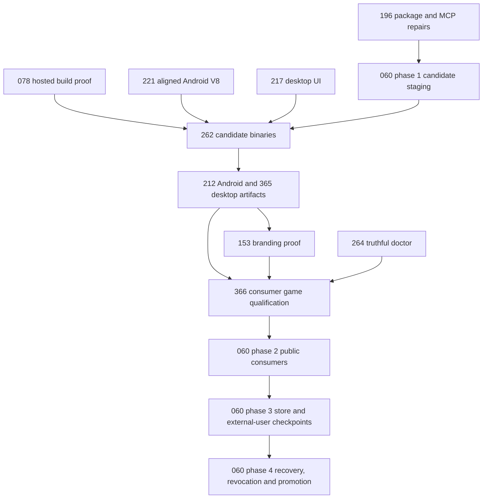

# Production readiness — install, author, build and distribute

**Start with PRD-196 phase 1.** This batch closes the [2026-09-08 assessment](../../verification/production-readiness-2026-09-08.md): a developer installs public packages, gets the authoring tools, changes game files and branding, then builds playable web, desktop and Android artifacts without engine source.

**Status: PLANNED.** Nine existing PRDs were moved here and revised; two are new. No implementation or release readiness is claimed by filing the plans. Source baseline: `912a567e3e7592e6b437e49fe6318a3987d1f7c1`. iOS is excluded from this batch's acceptance; existing iOS implementations, simulator gates and unclosed external PRD criteria are preserved.

## Owners and order

| PRD | Outcome owned here | Origin / current status | Prerequisites for final acceptance |
| --- | --- | --- | --- |
| [PRD-196](PRD-196-published-install-is-functional.md) | Complete public package/cohort installation and automatic MCP toolchain | Moved from done/; PARTIAL | None for repairs; 060 for final public cohort |
| [PRD-078](PRD-078-toolchain-free-consumer-proof.md) | Current exact-candidate hosted runtime build proof | Moved from BLOCKED/; PARTIAL | Current candidate CI; do not reuse old failure diagnosis |
| [PRD-221](PRD-221-android-v8-is-16kb-clean.md) | Aligned default V8 and real 16 KB Android execution | Moved from BLOCKED/; PROPOSED | Recheck upstream/toolchain access |
| [PRD-217](PRD-217-webview-ui-layer.md) | Default React HUD on Windows/macOS/Linux sessions | Moved from done/ (already PARTIAL); PARTIAL | None for platform implementation |
| [PRD-264](PRD-264-doctor-answers-all-three-questions-a-game-author-has.md) | Truthful target/tool/signing prerequisite diagnosis | Moved from done/; PARTIAL | Consumes contracts from 196/212/217/365 |
| [PRD-212](PRD-212-published-install-builds-android.md) | SDK-current signed Android APK/AAB from game project | Moved from mobile/; PARTIAL | 221 inputs; 262 downloaded artifacts |
| [PRD-365](PRD-365-consumer-desktop-distribution.md) | Complete desktop containers and signing/notarization | NEW; PROPOSED | 217 overlays; 212 mode parsing; 262 binaries |
| [PRD-153](PRD-153-game-branding-from-launch-to-play.md) | Custom brand in launcher, splash, loading and game | Moved from done/; PARTIAL | 212/365 final artifacts; 217 UI |
| [PRD-262](PRD-262-the-runtime-native-prebuilt-release-exists.md) | Complete version-matched downloadable runtime assets | Moved from mobile/; PROPOSED | 078 hosted proof; 196 package contents; 221/217 final inputs |
| [PRD-366](PRD-366-one-consumer-game-proves-supported-platforms.md) | Actual consumer game and physical Android qualification | NEW; PROPOSED | 196/212/217/221/262/365; 153 captures |
| [PRD-060](PRD-060-promoted-consumer-distribution.md) | Public candidate verification, recovery, promotion, stores and outside users | Moved from BLOCKED/; PROPOSED | All applicable owner results; external credentials/people only at their checkpoint |

Dependencies in the table are acceptance dependencies, not a prohibition on preparing tests/configuration earlier. Candidate production is deliberately split from final public proof: PRD-060 phase 1 stages, PRD-262 supplies downloads, PRD-366 qualifies, then PRD-060 phases 2–3 verify public consumers and obtain credentialed/external-user evidence before phase 4 promotes. Do not create an all-phases dependency cycle by requiring final promotion before candidate testing.

## Every assessment gap has an owner

| Assessment detail | Implementation owner | Evidence that closes it |
| --- | --- | --- |
| Public versions lag source; package helper imports unpublished siblings; sandbox package completeness | PRD-196 | Extracted tarballs resolve; coherent cohort; sandbox native/MCP proof kept distinct from public consumer gate |
| npm/pnpm installation, sharp/libvips and Node minimum friction | PRD-196 | Clean minimum-version and package-manager matrix; reproduced environment error and repair; audit reachability triage |
| MCPs auto-installed/configured; Blender application prerequisite; editor trust | PRD-196 + PRD-264 | All server transports plus real operations; actual editor discovery; missing external app/config tests |
| Runtime manifest HTTP404 and source-checkout workaround | PRD-078 + PRD-262 | Hosted exact-SHA run including all four original Android physics negative controls, downloadable complete lock, installed no-compiler consumer |
| Windows/macOS default HUD rejected; Linux session overlay failure | PRD-217 | Real same-UI input, resize/focus, transparent composition and packaged backend per OS/session |
| Android target SDK35 and debug-only output | PRD-212 | Current SDK and explicit release APK/AAB; real signer/non-debuggable metadata and failure controls |
| Android default V8 16 KB gap | PRD-221 | Both ABI binaries, all packaged libraries and ZIP alignment, observed 16 KB execution |
| Desktop raw binary/UI directory; OS dependency and signing gaps | PRD-365 | Relocatable complete containers, clean player machine, signature/notarization and offline launch |
| User app name/ID/version/icon/splash/loading customization | PRD-153 + PRD-365 resource mechanics | Game-only edits change both artifact resources and observed launcher-to-game sequence |
| Web deployment/subpaths/fallback; unsupported codecs/browser globals; “any game” | PRD-366 | Built browser gameplay at root/subpath, compatibility census and explicit supported envelope |
| Physics/audio/input/save/lifecycle and physical performance unproved for final game | PRD-366 | Exact artifact scenario results, target identity, real Android device and performance evidence |
| Store validation, public defaults, N-1/recovery, stranger developer/player | PRD-060 | Server-side Android validation, signed desktop handoff, default-install proof, promoted revocation/deprecation, Linux identity-bound attestation and recorded external experience |

## Execution contract

1. Run one bounded phase at a time for each shared file. `src/build.ts` is owned in order by PRD-212 mode parsing, PRD-365 desktop dispatch and PRD-217 phase 3B capability enablement; reconcile before candidate builds. Workflow/release edits use PRD-078 → PRD-262 → PRD-060 ownership. Shared-file phases cannot run concurrently.
2. Every phase lists at most four implementation files plus one evidence record, an existing caller, a user outcome and observed-red control. Fan-out changes to package manifests/templates must be split into named at-most-five-file phases before implementation. The published package/runtime cohort is the final proof subject; local tarballs are only intermediate mechanics evidence.
3. All gate results start NOT RUN. Run focused and full required checks, real target playtests, caller census and an independent reviewer after each implementation phase. Visual and external checkpoints supplement automation; credentials or an outside person are requested only after a concrete reviewable result is prepared.
4. Preserve evidence and original fixes. Historical plans remain available at the linked baseline commit; moving from done/ reopens only the listed release gaps. Old BLOCKED reasons are history until attempted again. Nothing here authorizes publication, store upload or contacting others.
5. Finish only with checked acceptance across owners and a current same-candidate public report. Keep this batch together until all included PRDs complete, then move the batch to done/ under the repository lifecycle rules. Do not call an unsupported feature/target ready to close a checklist.

## Existing specialist contracts retained

[PRD-054 conformance](../BLOCKED/requires-parity-rerun/PRD-054-write-once-run-anywhere.md),
[PRD-056 physical collectors](../BLOCKED/requires-physical-device/PRD-056-physical-mobile-qualification.md),
[PRD-058 reliability/performance](../BLOCKED/requires-physical-proof/PRD-058-performance-reliability-observability.md),
[PRD-059 provenance/SBOM](../BLOCKED/requires-hosted-run/PRD-059-native-dependency-provenance-sbom.md) and
[PRD-080 stranger protocol](../BLOCKED/requires-external-person/PRD-080-five-minute-stranger-test.md)
remain their own implementation contracts. This batch consumes their applicable non-iOS observations and does not rewrite or close unrelated requirements. PRD-119's existing publisher and PRD-048's installed packagers are reused, not replaced with competing systems.

## Plan validation

Pending: independent plan review, relocation-link repair and required documentation checks. Implementation gates remain NOT RUN even when plan checks pass.

**Next action (under two minutes): open PRD-196 phase 1 and inspect its three-file package-boundary slice.**
