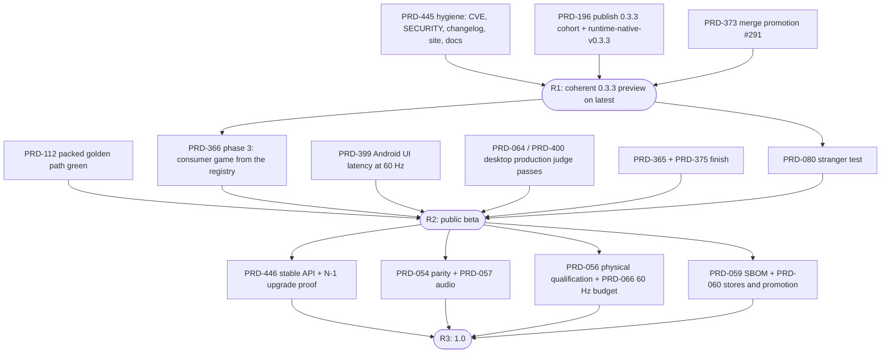

# Release readiness — 2026-09-23

**Verdict: not ready for a production (1.0) release.** ThreeNative is *already public* as an
alpha: the repository is public under MIT and `@threenative/*@0.3.2` is the npm `latest`. By the
project's own bar it does not currently qualify even as that alpha: `pnpm alpha:bar` prints
**"0 of 7 rows unmeasured, 2 failed, 1 deferred. Not alpha."** The shortest honest path is three
rungs, and only the first can land this week.

**Supported targets (owner, 2026-09-23): web, Windows, macOS, Linux and Android. iOS is not
supported** — not in R1, R2 or 1.0, and not as a "preview". Every rung below means every supported
target, and no public text may claim iOS until a later decision adds it.

| Rung | What you may tell the public | Ready? | Gap |
| --- | --- | --- | --- |
| **R1 — coherent 0.3.3 preview** | "Alpha. Install it, build web games, try native." | **No, days away** | Unpublished cohort, stale security/challenge docs, one high CVE, red site deploy, promotion PR stuck |
| **R2 — public beta (public announcement)** | "Ship one game to web, Windows, macOS, Linux and Android from installed packages." | **No, weeks away** | Consumer-game qualification, packed golden path, Android UI latency, desktop perf judge, stranger test |
| **R3 — production 1.0** | "Build your game on this; the API is stable." | **No** | All four Charter success criteria, a stable-API contract, parity, physical-device and store qualification |

This document is a dated inspection and a plan. It ticks no PRD box and claims no gate it did not
run. It follows the [2026-09-08 assessment](../../verification/production-readiness-2026-09-08.md)
and the [execution strategy of 2026-09-11](EXECUTION-STRATEGY-2026-09-11.md).

## What was measured today

Checkout `develop` at `436ee3053`, clean tree. Every row below was run in this inspection unless
marked *read*.

| Check | Result |
| --- | --- |
| `gh repo view` | Public, MIT license |
| `npm view <pkg> dist-tags` for all 11 packages | `latest` is 0.3.2 (core, physics, ui, assets, playtest, runtime-native), 0.2.5 (create-threenative); source is at **0.3.3 / 0.2.6, unpublished** |
| `pnpm alpha:bar` | A1 **fail** (unpublished workspace versions), A2–A5 pass, A6 deferred (stranger), A7 **fail** (`docs/verification/alpha-bar.md` does not match the run) |
| `pnpm publish:check` | **70 findings**: 69 template pins to the unpublished 0.3.3 cohort, plus no `runtime-native-v0.3.3` prebuilt release |
| `gh release list` | `runtime-native-v0.3.2` and `v0.3.1` exist, both marked **pre-release** |
| `gh run list --branch main` | CI **success** on `d3e6b7deb`; `site` deploy **failed** (Cloudflare deploy step, exit 1, cause not investigated) |
| `gh pr view 291` (develop → main promotion) | Draft, checks pending on the head; `origin/main` and `origin/develop` have diverged 8/8 |
| `pnpm audit --prod --audit-level high` | **1 high**: `sharp <0.35.4` (GHSA-rgj7-g3m4-5g8c) via `@threenative/assets` → `@gltf-transform/functions` → `ndarray-pixels` |
| `SECURITY.md` (read) | Lists `0.2.x` as the only supported version while 0.3.x ships |
| `CHANGELOG.md` (read) | Last released section is `0.2.0`; 0.3.x has no entry |
| `CURRENT-CHALLENGES.md` (read) | Last reviewed 2026-09-02; its Android-CI row was already superseded on 2026-09-08 |
| `.runtime/prd064/production/production-evidence.json` (read; another lane's run, 18:22 today) | Desktop 1920×1080 production profile **BLOCKED**: `TN_PROD_PLAYTEST_FAILED`, `TN_PROD_MARKER_MISSING`, `TN_PROD_PERFORMANCE_BUDGET`, `TN_PROD_STARTUP_BUDGET`, samples incomplete |
| `collectLoc()` from `scripts/count-loc.ts` | Abyss port **441** lines against vanilla **473** — shorter than vanilla, but over the Charter's 400-line bar |
| `pnpm prd:progress` (release PRDs) | See the owner table below |
| PRD census | 160 PRD files open outside `done/`, 272 done; 21 in `BLOCKED/`, 9 of those without phase boxes |

Not run: `pnpm typecheck && pnpm lint && pnpm test`, playtests, template gates, any native or
device lane. Those belong to the phases below, not to an inspection.

## What is already done

The 2026-09-08 assessment named five release blockers. Four are closed with evidence, which is the
real progress of the last two weeks:

- Public runtime binaries exist and a consumer builds without a compiler —
  [PRD-262](../done/PRD-262-the-runtime-native-prebuilt-release-exists.md),
  [PRD-078](../done/PRD-078-toolchain-free-consumer-proof.md),
  [PRD-376](../done/PRD-376-windows-consumer-builds-and-runs.md).
- The default React HUD runs on Windows, macOS and Linux —
  [PRD-217](../done/PRD-217-webview-ui-layer.md).
- Android emits a signed release APK/AAB at the current target SDK, 16 KB clean —
  [PRD-212](../done/PRD-212-published-install-builds-android.md),
  [PRD-221](../done/PRD-221-android-v8-is-16kb-clean.md).
- One local command publishes the cohort; doctor predicts target prerequisites —
  [PRD-378](../done/PRD-378-one-local-command-publishes-every-package.md),
  [PRD-374](../done/PRD-374-doctor-predicts-the-requested-build-prerequisite.md).
- Verification fails closed on an empty assertion set (alpha row A3), and a measured paired round
  exists (A4).

The fifth — source and published artifacts diverged — is open again, because the cohort was bumped
to 0.3.3 and not released.

## Blockers, ranked by rung

### R1 — a coherent public preview

1. **The 0.3.3 cohort is not published.** Owner: [PRD-196](../BLOCKED/requires-release-credentials/PRD-196-published-install-is-functional.md)
   (0/30 phase boxes). Publishing a candidate under a non-default dist-tag is already authorized
   (owner decision, 2026-09-11); promoting it to `latest` is not.
2. **The promotion PR is stuck.** #291 waits on checks, and its body describes a squash-versus-merge
   conflict that the root `AGENTS.md` already settles: main accepts merge commits only. Owner:
   [PRD-373](PRD-373-selective-ci-and-develop-promotion.md) (18/20 phase boxes, 1/5 acceptance).
3. **Security and honesty debt a stranger sees first**: the high `sharp` advisory, `SECURITY.md`
   naming the wrong supported line, no 0.3.x changelog, stale `CURRENT-CHALLENGES.md` and
   `alpha-bar.md`, and a red site deploy on `main`. No PRD owned these. **New:
   [PRD-445](PRD-445-public-release-hygiene.md).**

### R2 — a public beta that ships a game

1. **One consumer game, installed from the registry, on every supported target.** Owner:
   [PRD-366](PRD-366-one-consumer-game-proves-supported-platforms.md) — phase 3 open, 0/5 acceptance.
2. **The packed golden path is red.** The 7-template packed gate fails on `action-rpg`
   ("Execution context was destroyed"). Owner:
   [PRD-112](../BLOCKED/requires-packed-gate/PRD-112-golden-path-from-packed-artifacts.md) and
   its [repair](../BLOCKED/requires-packed-gate/PRD-112-repair-golden-path-contract.md).
3. **Native React UI misses its latency bound on a 60 Hz phone.** Real Pixel 8, p95 55.35 ms against
   50 ms; it passes only on the 120 Hz panel, and that run was below the battery floor. Owner:
   [PRD-399](PRD-399-playable-dev-distributables.md) (5/18 boxes).
4. **The desktop production-performance judge is BLOCKED today** (six `TN_PROD_*` codes, above).
   Owners: [PRD-064](../native/PRD-064-tier-1-native-reliability.md) (no phase boxes — cannot report
   progress), [PRD-400](../performance/PRD-400-the-frame-gets-cheaper-one-measured-cost-at-a-time.md)
   (1/17), [PRD-358](../performance/PRD-358-cross-platform-performance-regression-ci.md) (6/18).
5. **Nobody outside the project has used it** (alpha row A6, Charter criterion 4). Owner:
   [PRD-080](../BLOCKED/requires-external-person/PRD-080-five-minute-stranger-test.md). Needs you to
   pick a build and find one person; everything else is ready once R1 ships.

Also in R2, nearly done and worth finishing rather than re-planning:
[PRD-365](PRD-365-consumer-desktop-distribution.md) desktop containers (23/24 phase boxes, 19/24
acceptance) and [PRD-375](PRD-375-release-artifacts-carry-the-game-brand.md) branding (11/12, 3/5).

### R3 — production 1.0

1. **The Charter's four success criteria.** (1) Abyss port at 441 lines against a 400-line bar.
   (2) One codebase on a physical phone by playtest — [PRD-056](../BLOCKED/requires-physical-device/PRD-056-physical-mobile-qualification.md)
   0/42 boxes. (3) Mobile frame budget on real hardware — met at 120 Hz (63–72 fps, Bayview), not on
   the 60 Hz baseline; [PRD-066](../performance/PRD-066-android-device-frame-rate.md). (4) The stranger
   test, above.
2. **No stable-API or upgrade contract exists.** Nothing defines the public surface, the deprecation
   window, or proves a game on version N-1 upgrades to N. **New:
   [PRD-446](PRD-446-stable-api-and-upgrade-contract.md).**
3. **Web/native parity is not proven.** [PRD-054](../BLOCKED/requires-parity-rerun/PRD-054-write-once-run-anywhere.md):
   browser 66/1/0, desktop 65/1/1, Android 0/0/67 blocked. Audio parity is at its review cap —
   [PRD-057](../BLOCKED/review-cap/PRD-057-native-audio-parity.md) (0/56).
4. **Supply chain and distribution.** SBOM/provenance —
   [PRD-059](../BLOCKED/requires-hosted-run/PRD-059-native-dependency-provenance-sbom.md) (0/36);
   store validation, signing hand-off, N-1 recovery and promotion —
   [PRD-060](PRD-060-promoted-consumer-distribution.md) (0/24) and its
   [BLOCKED twin](../BLOCKED/requires-release-credentials/PRD-060-promoted-consumer-distribution.md) (10/54).
5. **iOS is not a supported target** (decision 2). [PRD-065](../BLOCKED/requires-ios-ecossystem/PRD-065-ios-evidence-lane.md)
   (3/15) and iOS rows in other PRDs block nothing; the public README still claims iOS, which
   [PRD-445](PRD-445-public-release-hygiene.md) removes.

## The critical path

**Order of work.** R1 is roughly three days of local work plus a publish: PRD-445 and PRD-373 run in
parallel with the PRD-196 cohort cut; publish under a candidate dist-tag, run PRD-196's
installed-consumer gates against it, then move `latest`. R2's five lanes are independent and can run
in parallel once R1 lands — PRD-112 and PRD-064 are local, PRD-399 needs the Pixel, PRD-080 needs
you. R3 starts only after R2; do not open R3 lanes early, because each one reads the published
cohort that R1 and R2 fix.

## Decisions only you can make

1. **Which rung is "releasing to the public"?** **Decided (owner, 2026-09-23): announce at R2.**
   R1 ships quietly so the npm `latest` stops lying; nothing is announced while the installed golden
   path is red on one template and no outsider has touched it.
2. **iOS?** **Decided (owner, 2026-09-23): not supported.** Supported targets are web, Windows,
   macOS, Linux and Android. iOS is not labelled a preview and is claimed nowhere.
3. **Charter criterion 1: 441 lines against 400.** Recommendation: treat it as work (cut 41 lines
   from the port or the API it calls) inside R3, not a Charter amendment — the Charter forbids
   routing around a cap.
4. **Scope freeze.** Recommendation: approve that only the PRDs named in this document block a
   release. The other ~140 open PRDs are post-launch; a lane that picks one up says so in its PR.
5. **Desktop signing in the beta.** ThreeNative needs no certificate of its own; signing is per
   developer, per game. Recommendation: the beta ships "bring your own certificate" proven with test
   credentials on CI (PRD-365 phase 3), not a signed ThreeNative binary.

## Housekeeping found while inspecting

These fold into [PRD-445](PRD-445-public-release-hygiene.md):

- PRD-060 exists twice, with different titles and progress
  ([here](PRD-060-promoted-consumer-distribution.md) and
  [in BLOCKED](../BLOCKED/requires-release-credentials/PRD-060-promoted-consumer-distribution.md)).
- `PRD-375-release-artifacts-carry-the-game-brand.md` carries the heading "PRD-153".
- Release-blocking PRDs without phase boxes cannot report progress: PRD-054, PRD-058, PRD-064,
  PRD-066 and PRD-112-repair.

**Next action (under two minutes):** answer decisions 3–5, then open
[PRD-445](PRD-445-public-release-hygiene.md) phase 1 — the `sharp` bump is the first box.
