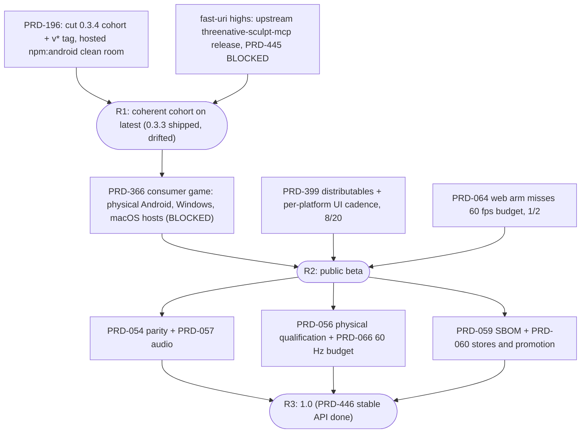

# Release readiness — 2026-09-23

## Status 2026-10-02

**The 0.3.4 cohort is published; `alpha:bar` A1 passes (6 of 7, A6 deferred).** `runtime-native-v0.3.4`
is a finalized release (promotions #385, #386, #387 merged). On npm: `core`, `physics`, `playtest`,
`runtime-native`, `ui` 0.3.4; `assets` 0.3.5; `raw-unreal`, `ueformat`, `threenative-blender-mcp` 0.1.4;
`threenative-engine-mcp` 0.2.4; `@threenative/metahuman` 0.1.0 (new); `create-threenative` 0.2.8.
`scripts/verify-registry-install.ts` against the registry passes 22/22 (npm and pnpm, including
`doctor`, `native`, `android`, `mcp`).

What it took, so the next cut does not repeat it:

- **The hosted `npm-release` run cannot publish.** Its N-1 upgrade proof asserts frame time and
  visuals, which fail on the runner's SwiftShader adapter (run 36969644927). The cohort was published
  locally with `pnpm release --skip-gates --yes` on a GPU host, behind a load gate (frame p95 read 34 to
  112 ms against the 33 ms budget while other lanes ran; it passed once load stayed under 8). The gate
  was not changed. PRD-196's last box (hosted `clean-room` run) stays open for the same reason.
- **`doctor` demanded one version across all `@threenative` packages**, but the cohort ships `assets`
  at 0.3.5 on purpose, so the registry clean-room failed on `npm:doctor`. It now compares the
  major.minor series (`d43e0016e`); that needed `create-threenative` 0.2.8, published by hand with
  `pnpm --filter create-threenative publish` because `pnpm release` refuses a partial cohort.
- **`publish:check` refused the scaffolder tarball**: `templates/rain/tools/verify-noise-volume.mjs`
  imported a `.js` name for a shipped `.ts` file (`6c8858d74`).
- Native consumer proof fixes landed on `develop`: software-adapter declaration on the hosted emulator,
  iOS no longer gates `finalize`, and a retry for dropped adb logcat transports.

The local publish carries no npm provenance (not CI). The Android registry proof needs JDK 17 and
`ANDROID_HOME`; the default JDK 27 on the operator machine fails Gradle.

**Still open:** a `develop` to `main` promotion carrying the doctor and rain fixes, PRD-064's web
60 fps arm, PRD-366 physical devices, PRD-399, the `fast-uri` highs (no fixed upstream release), and
a way to run the upgrade proof on hosted CI (a GPU lane, or a deliberate software-adapter design).

## Status 2026-10-01

Inspected on `develop` at `ffe9986f5` (`origin/develop` fetched 2026-10-01). Only the rows in
[What was measured 2026-10-01](#what-was-measured-2026-10-01) were run; nothing below ticks a box.

**R1 shipped, then drifted.** `0.3.3` is still `latest`=`next` on npm (`create-threenative`
`0.2.6`, published 2026-09-25, with `runtime-native-v0.3.3`). Source has since moved to an
unpublished `0.3.4` cohort (`assets` 0.3.5, `create-threenative` 0.2.7) plus a new, never-published
`@threenative/metahuman`, so `alpha:bar` A1 and `publish:check` are red again. The `sharp` high is
gone; two new highs (`fast-uri` via `threenative-sculpt-mcp` → MCP SDK → `ajv`) replaced it.

**The three PRDs still in `critical/`:**

| PRD | Progress (`pnpm prd:progress`) | What is left |
| --- | --- | --- |
| [PRD-196](../done/PRD-196-published-install-is-functional.md) published install | 32/33 phase boxes, 12/12 acceptance, `prd:75%` | One hosted proof: a `v*` tag push whose `clean-room` job reports `pass npm:android`. Also: published `create-threenative@0.2.6` lacks the `sharp` override, so its `npm` install fails at `sharp@0.34.5`; fixed in source, needs a republish |
| [PRD-064](critical/PRD-064-tier-1-native-reliability.md) desktop judge | 1/2 boxes, `prd:50%` | Phase 4 web/native parity box. PR #361 (2026-09-30) fixed the profiler (headed WebGPU, no marker server, unresolvable intervals) and measured on the RTX 2080 host: native 174.06 fps, p99 17.3 ms, no slower than web on all four legs, cold start p95 1,803 ms, distinct identities. **The web arm misses its budget** (35.6 fps mean, p99 110.4 ms vs ≥ 60 fps / ≤ 33 ms): Tier 1 not reached. The PRD file does not record this run yet |
| [PRD-399](critical/PRD-399-playable-dev-distributables.md) playable distributables | 8/20 boxes, 1/6 phases, `prd:25%` | Bundle carry and generated commands (Phase 1, partial); per-platform UI cadence (Phase 2); Windows/macOS/Linux distributions (Phase 3); Linux, macOS and Android final artifacts (Phase 4); release flow, immutable candidate and docs (Phase 5). Pixel 8 child-window fixture passed 2026-09-27 at p95 55.78 ms (bound 66.7 ms) |

**Filed elsewhere since the last status:** [PRD-446](../done/PRD-446-stable-api-and-upgrade-contract.md)
stable API and N-1 upgrade is **done** (14/14, PR #367). [PRD-366](../BLOCKED/requires-physical-device/PRD-366-one-consumer-game-proves-supported-platforms.md)
(all boxes ticked; physical Android, Windows and macOS registry hosts, a republished cohort) and
[PRD-445](../BLOCKED/requires-release-credentials/PRD-445-public-release-hygiene.md) (20/20; an
upstream `threenative-sculpt-mcp` release and three owner calls) remain BLOCKED. PRD-112, PRD-365,
PRD-373 and PRD-375 are done.

**Decisions applied:** iOS unsupported; no PRD-080 stranger test; per-developer signing; 60 Hz UI bound
`max(50 ms, 4 panel frames)` with in-frame behind the off flag. **Completion scope:** R3 production
1.0 is in scope, not only the R2 beta.

**Verdict: not ready for a production (1.0) release.** ThreeNative is *already public* as an
alpha: the repository is public under MIT and `@threenative/*@0.3.3` is the npm `latest`. By the
project's own bar it does not currently qualify even as that alpha: on 2026-10-01 `pnpm alpha:bar`
still prints **"0 of 7 rows unmeasured, 2 failed, 1 deferred. Not alpha."** (A1: the source cohort
moved past what is published; A7: `alpha-bar.md` is stale). The shortest honest path is three rungs.

**Supported targets (owner, 2026-09-23): web, Windows, macOS, Linux and Android. iOS is not
supported** — not in R1, R2 or 1.0, and not as a "preview". Every rung below means every supported
target, and no public text may claim iOS until a later decision adds it.

| Rung | What you may tell the public | Ready? | Gap |
| --- | --- | --- | --- |
| **R1 — coherent 0.3.3 preview** | "Alpha. Install it, build web games, try native." | **Shipped 2026-09-25, drifted since** | Source at an unpublished 0.3.4 cohort plus `@threenative/metahuman`; two `fast-uri` highs; published `create-threenative@0.2.6` npm install fails on `sharp`; stale `alpha-bar.md` |
| **R2 — public beta (public announcement)** | "Ship one game to web, Windows, macOS, Linux and Android from installed packages." | **No, weeks away** | PRD-196's hosted Android clean room, PRD-366 hardware, PRD-399 distributables (8/20), PRD-064 web budget miss |
| **R3 — production 1.0** | "Build your game on this; the API is stable." | **No** | Physical-phone playtest and 60 Hz frame budget, parity, physical-device and store qualification (stable API done, PRD-446) |

This document is a dated inspection and a plan. It ticks no PRD box and claims no gate it did not
run. It follows the [2026-09-08 assessment](../../verification/production-readiness-2026-09-08.md).
**The PRDs blocking R1 and R2 — the public beta — live in [`critical/`](critical/) or in their
explicit `BLOCKED/` folders when only external work remains.** PRD-365 and PRD-375 are now in
`done/`; PRD-445 moved to `BLOCKED/requires-release-credentials/` on 2026-09-25.
The 1.0 PRDs under R3 stay in their own folders; independent work can proceed now, and the
final 1.0 qualification depends on the immutable R2 consumer cohort.

## What was measured 2026-10-01

Checkout `develop` at `ffe9986f5`, clean tree. Every row was run today unless marked *read*.

| Check | Result |
| --- | --- |
| `npm view @threenative/core dist-tags` / `create-threenative` | `latest`=`next`=`0.3.3` / `0.2.6`; 0.3.3 published 2026-09-25 |
| `pnpm alpha:bar` | A1 **fail** (`@threenative/metahuman` absent from the registry; unpublished `assets` 0.3.5, `core`/`physics`/`playtest`/`runtime-native` 0.3.4, `raw-unreal` 0.1.4, …), A2–A5 pass, A6 deferred, A7 **fail** (`alpha-bar.md` stale) |
| `pnpm publish:check` | **70 findings**: templates pin the unpublished 0.3.4 cohort and `create-threenative@0.2.7`; no `runtime-native-v0.3.4` prebuilt release |
| `gh release list` | `runtime-native-v0.3.3` (pre-release, 2026-09-25) is the newest runtime release; `ci-v8-android` cache added 2026-09-28 |
| `pnpm audit --prod --audit-level high` | **2 high**: `fast-uri` GHSA-qw65-cvwx-89v3 and GHSA-58mr-gqgx-xq4g via `@threenative/core` → `threenative-sculpt-mcp` → `@modelcontextprotocol/sdk` → `ajv`; `sharp` no longer listed |
| `git rev-list --left-right --count origin/main...origin/develop` | 12 / 64: `main` holds 12 commits not on `develop`, `develop` is 64 ahead |
| `pnpm prd:progress` (critical PRDs) | PRD-196 32/33 + 12/12, PRD-064 1/2, PRD-399 8/20 |

Not run: `gh run list` and `gh pr list` (`api.github.com` unreachable from this host during the
inspection), so `main` CI, the `site` deploy and the promotion PR are unverified today. No
typecheck, lint, test, playtest or device lane.

## What was measured 2026-09-23

Checkout `develop` at `436ee3053`, clean tree. Every row below was run in this inspection unless
marked *read*.

| Check | Result |
| --- | --- |
| `gh repo view` | Public, MIT license |
| `npm view <pkg> dist-tags` for all 11 packages | `latest` is 0.3.2 (core, physics, ui, assets, playtest, runtime-native), 0.2.5 (create-threenative); source is at **0.3.3 / 0.2.6, unpublished** |
| `pnpm alpha:bar` | A1 **fail** (unpublished workspace versions), A2–A5 pass, A6 deferred (stranger), A7 **fail** (`docs/verification/alpha-bar.md` does not match the run) |
| `pnpm publish:check` | **70 findings**: 69 template pins to the unpublished 0.3.3 cohort, plus no `runtime-native-v0.3.3` prebuilt release |
| `gh release list` | `runtime-native-v0.3.2` and `v0.3.1` exist, both marked **pre-release** |
| `gh run list --branch main` | CI **success** on `d3e6b7deb`; `site` deploy **failed** (Cloudflare deploy step, exit 1, cause not investigated) |
| `gh pr view 291` (develop → main promotion) | Draft, checks pending on the head; `origin/main` and `origin/develop` have diverged 8/8 |
| `pnpm audit --prod --audit-level high` | **1 high**: `sharp <0.35.4` (GHSA-rgj7-g3m4-5g8c) via `@threenative/assets` → `@gltf-transform/functions` → `ndarray-pixels` |
| `SECURITY.md` (read) | Lists `0.2.x` as the only supported version while 0.3.x ships |
| `CHANGELOG.md` (read) | Last released section is `0.2.0`; 0.3.x has no entry |
| `CURRENT-CHALLENGES.md` (read) | Last reviewed 2026-09-02; its Android-CI row was already superseded on 2026-09-08 |
| `.runtime/prd064/production/production-evidence.json` (read; another lane's run, 18:22 today) | Desktop 1920×1080 production profile **BLOCKED**: `TN_PROD_PLAYTEST_FAILED`, `TN_PROD_MARKER_MISSING`, `TN_PROD_PERFORMANCE_BUDGET`, `TN_PROD_STARTUP_BUDGET`, samples incomplete |
| `pnpm prd:progress` (release PRDs) | See the owner table below |
| PRD census | 160 PRD files open outside `done/`, 272 done; 21 in `BLOCKED/`, 9 of those without phase boxes |

Not run: `pnpm typecheck && pnpm lint && pnpm test`, playtests, template gates, any native or
device lane. Those belong to the phases below, not to an inspection.

## What is already done

The 2026-09-08 assessment named five release blockers. Four are closed with evidence, which is the
real progress of the last two weeks:

- Public runtime binaries exist and a consumer builds without a compiler —
  [PRD-262](../done/PRD-262-the-runtime-native-prebuilt-release-exists.md),
  [PRD-078](../done/PRD-078-toolchain-free-consumer-proof.md),
  [PRD-376](../done/PRD-376-windows-consumer-builds-and-runs.md).
- The default React HUD runs on Windows, macOS and Linux —
  [PRD-217](../done/PRD-217-webview-ui-layer.md).
- Android emits a signed release APK/AAB at the current target SDK, 16 KB clean —
  [PRD-212](../done/PRD-212-published-install-builds-android.md),
  [PRD-221](../done/PRD-221-android-v8-is-16kb-clean.md).
- One local command publishes the cohort; doctor predicts target prerequisites —
  [PRD-378](../done/PRD-378-one-local-command-publishes-every-package.md),
  [PRD-374](../done/PRD-374-doctor-predicts-the-requested-build-prerequisite.md).
- Verification fails closed on an empty assertion set (alpha row A3), and a measured paired round
  exists (A4).

The fifth — source and published artifacts diverged — is open again, because the cohort was bumped
to 0.3.3 and not released.

## Blockers, ranked by rung

### R1 — a coherent public preview

1. **~~The 0.3.3 cohort is not published.~~ Published 2026-09-25** (`latest`=`next`=`0.3.3`).
   **New drift (2026-10-01):** source is at an unpublished 0.3.4 cohort plus `@threenative/metahuman`,
   and the published `create-threenative@0.2.6` npm install fails on `sharp@0.34.5` (fixed in
   source). Both close with the next cohort cut. Owner: [PRD-196](../done/PRD-196-published-install-is-functional.md)
   (32/33 phase boxes, 12/12 acceptance).
2. **~~The promotion PR is stuck.~~** Promotions #291/#312 and #301/#303 merged; owner
   [PRD-373](../done/PRD-373-selective-ci-and-develop-promotion.md) is done. `develop` is now 64
   commits ahead of `origin/main`; a new promotion is due with the next cohort.
3. **Security and honesty debt a stranger sees first.** [PRD-445](../BLOCKED/requires-release-credentials/PRD-445-public-release-hygiene.md)
   closed its boxes (20/20; `sharp`, `SECURITY.md`, changelog, site deploy). **New (2026-10-01):**
   two `fast-uri` highs through `threenative-sculpt-mcp`, the same upstream release PRD-445 is
   blocked on, and `alpha-bar.md` is stale again (A7).

### R2 — a public beta that ships a game

1. **One consumer game, installed from the registry, on every supported target.** Owner:
   [PRD-366](../BLOCKED/requires-physical-device/PRD-366-one-consumer-game-proves-supported-platforms.md)
   — all 19 phase boxes and 3 acceptance boxes ticked (2026-09-28); blocked on a physical Android
   device, Windows and macOS hosts with registry access, and a republished cohort (R6).
2. **The packed golden path is green (closed 2026-09-27).** The ten-template packed gate and its
   mutated-package negative control pass. Owner:
   [PRD-112](../done/PRD-112-golden-path-from-packed-artifacts.md) and
   its [repair](../done/PRD-112-repair-golden-path-contract.md).
3. **Final cross-platform React UI qualification is open.** The approved 60 Hz Android bound is
   four panel frames (~66.7 ms); an unplugged Pixel 8 fixture passed at p95 55.78 ms on 2026-09-27.
   This does not qualify the immutable consumer cohort or the other supported platforms. Owner:
   [PRD-399](critical/PRD-399-playable-dev-distributables.md) (8/20 boxes).
4. **The desktop production judge now runs; the web arm misses its budget.** PR #304 (2026-09-25)
   stopped the judge failing healthy runs; PR #361 (2026-09-30) made the web arm measure real
   WebGPU. Measured: native 174 fps / p99 17.3 ms, no slower than web, cold start p95 1,803 ms;
   web 35.6 fps / p99 110.4 ms against ≥ 60 fps / ≤ 33 ms. Tier 1 not reached. Owner:
   [PRD-064](critical/PRD-064-tier-1-native-reliability.md) (1/2 boxes). Related, not release-blocking: [PRD-400](../performance/PRD-400-the-frame-gets-cheaper-one-measured-cost-at-a-time.md) (1/17), [PRD-358](../performance/PRD-358-cross-platform-performance-regression-ci.md) (6/18).

Also in R2, nearly done and worth finishing rather than re-planning:
[PRD-365](../done/PRD-365-consumer-desktop-distribution.md) desktop containers is **done** (closed
2026-09-27, 24/24 phase boxes and 20/20 acceptance — the public-registry consumer launch in its last
box), and [PRD-375](../done/PRD-375-release-artifacts-carry-the-game-brand.md) branding closed 2026-09-27
(18/18 phase boxes, 5/5 acceptance, owner-confirmed on the operator-backed Linux container).

### R3 — production 1.0 (after the beta; not in `critical/`)

1. **Proof on real hardware.** One codebase on a physical phone by playtest — [PRD-056](../BLOCKED/requires-physical-device/PRD-056-physical-mobile-qualification.md)
   0/42 boxes. Mobile frame budget on real hardware — met at 120 Hz (63–72 fps, Bayview), not on
   the 60 Hz baseline; [PRD-066](../performance/PRD-066-android-device-frame-rate.md).
2. **The stable-API contract is met.** [PRD-446](../done/PRD-446-stable-api-and-upgrade-contract.md)
   (14/14 phase, 4/4 acceptance) guards published symbols with a committed snapshot and a breaking
   note, ships the deprecation policy, and proves an N-1 starter/platformer upgrade before any
   cohort moves `latest`.
3. **Web/native parity is not proven.** [PRD-054](../BLOCKED/requires-parity-rerun/PRD-054-write-once-run-anywhere.md):
   browser 66/1/0, desktop 65/1/1, Android 0/0/67 blocked. Audio parity is at its review cap —
   [PRD-057](../BLOCKED/review-cap/PRD-057-native-audio-parity.md) (0/56).
4. **Supply chain and distribution.** SBOM/provenance —
   [PRD-059](../BLOCKED/requires-hosted-run/PRD-059-native-dependency-provenance-sbom.md) (0/36);
   store validation, signing hand-off, N-1 recovery and promotion —
   [PRD-060](PRD-060-promoted-consumer-distribution.md) (0/24; the duplicate BLOCKED file carrying
   its implemented Phase 1 exact-candidate preflight was removed by PRD-445 Phase 3).
5. **iOS is not a supported target** (decision 2). [PRD-065](../BLOCKED/requires-ios-ecossystem/PRD-065-ios-evidence-lane.md)
   (3/15) and iOS rows in other PRDs block nothing; the public README still claims iOS, which
   [PRD-445](../BLOCKED/requires-release-credentials/PRD-445-public-release-hygiene.md) removes.

## The critical path

```mermaid
flowchart TD
    C["PRD-196: cut 0.3.4 cohort + v* tag, hosted npm:android clean room"] --> R1
    H["fast-uri highs: upstream threenative-sculpt-mcp release, PRD-445 BLOCKED"] --> R1
    R1(["R1: coherent cohort on latest (0.3.3 shipped, drifted)"])
    R1 --> Q["PRD-366 consumer game: physical Android, Windows, macOS hosts (BLOCKED)"]
    Q --> R2
    L["PRD-399 distributables + per-platform UI cadence, 8/20"] --> R2
    J["PRD-064 web arm misses 60 fps budget, 1/2"] --> R2
    R2(["R2: public beta"])
    R2 --> W["PRD-054 parity + PRD-057 audio"]
    R2 --> M["PRD-056 physical qualification + PRD-066 60 Hz budget"]
    R2 --> X["PRD-059 SBOM + PRD-060 stores and promotion"]
    W --> V(["R3: 1.0 (PRD-446 stable API done)"])
    M --> V
    X --> V
```

**Order of work (2026-10-01).** Done since 2026-09-23: PRD-112, PRD-365, PRD-373, PRD-375,
PRD-446, the 0.3.3 publish, and PRD-445's boxes. Next: cut the 0.3.4 cohort (it re-greens A1 and
`publish:check`, ships the `sharp` override, and its `v*` tag push is PRD-196's last box), then
promote `develop` to `main`. In parallel: PRD-399's Phase 1 and Linux lanes are local; PRD-064
needs the web arm to reach 60 fps on the judge host (a performance problem, not a judge bug). PRD-366
and the R3 hardware lanes wait on devices and hosts. The stranger test (PRD-080) gates nothing.

## Decisions only you can make

1. **Which rung is "releasing to the public"?** **Decided (owner, 2026-09-23): announce at R2.**
   R1 ships quietly so the npm `latest` stops lying; nothing is announced while the installed golden
   path is red on one template and no outsider has touched it.
2. **iOS?** **Decided (owner, 2026-09-23): not supported.** Supported targets are web, Windows,
   macOS, Linux and Android. iOS is not labelled a preview and is claimed nowhere.
3. **Scope freeze.** **Decided (owner, 2026-09-23): only the PRDs named in this document block a
   release.** The other open PRDs are post-launch and cannot hold up the beta.
4. **Desktop signing.** **Decided (owner, 2026-09-23): each developer signs their own game** with
   their own certificate; ThreeNative ships no certificate of its own. The framework's job is that
   `threenative build --mode release` signs with the developer's credentials, proven with test
   credentials on Windows and macOS CI ([PRD-365](../done/PRD-365-consumer-desktop-distribution.md) phase 3).

## Housekeeping found while inspecting

These fold into [PRD-445](../BLOCKED/requires-release-credentials/PRD-445-public-release-hygiene.md):

- PRD-060 exists twice, with different titles and progress
  ([here](PRD-060-promoted-consumer-distribution.md) and its former
  BLOCKED duplicate). **Resolved 2026-09-23** by PRD-445 Phase 3: the BLOCKED duplicate was deleted, its landed Phase 1 folded into the survivor.
- `PRD-375-release-artifacts-carry-the-game-brand.md` carries the heading "PRD-153". **Resolved**
  (checked 2026-10-01: the heading reads PRD-375).
- Release-blocking PRDs without phase boxes cannot report progress: PRD-054, PRD-058, PRD-064,
  PRD-066 and PRD-112-repair. **Resolved** (checked 2026-10-01: all carry boxes; PRD-112-repair is done).
- **New (2026-10-01):** PRD-064's status line still reads 2026-09-25 and does not record PR #361's
  2026-09-30 desktop-pair measurement.

**Next action (under two minutes):** promote `develop` to `main` (merge commit) so `main` carries the
doctor and rain fixes; the cohort itself is published (see Status 2026-10-02).
