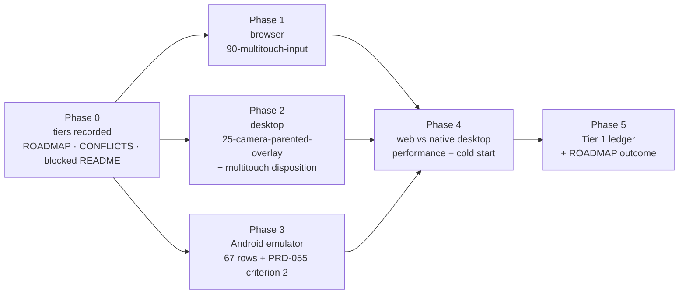

# PRD-064 — Tier 1 native reliability: finish what a device-free machine can prove

**Status: TIER 1 NOT REACHED, 2026-08-10.** Evidence: `docs/verification/tier-1-2026-08-10.md`.
The executed target split is Browser `67/0/0/0`, Desktop Linux `65/1/1/1`, and Android
emulator `27/40/0/1`; the three Phase 4 controls are **UNVERIFIED** with exit `254`. This PRD
makes no mobile-readiness claim. Every phase below is executable on this host. No physical
device, no Apple identity, no release credential, no CI minute is required.

**Priority:** P1 — Open: Android parity rows executed, stick+jump combo works, platformer holds the web budget.
**2026-09-25:** the desktop production judge now passes a healthy run (PR #304,
`packages/runtime-native/scripts/production-evidence.mjs`; box 1 of Phase 4 green). The Phase 4
negative controls have now been observed red with restored desktop baselines green. On one RTX 2080
host, the unmodified platformer's final 1920×1080 paired run failed the web budget at 35.62 FPS
mean and 110.4 ms p99; native reached 174.06 FPS and 17.30 ms p99, and startup p95 was 1,803 ms.
Web and native process/artifact identities differed. Tier 1 remains not reached.

**2026-09-30 (PR #361):** the profiler now measures headed WebGPU with no marker server and no
unresolvable intervals. On the RTX 2080 host, native: 174.06 fps, p99 17.3 ms, cold start p95
1,803 ms, no slower than web on all four legs, distinct process and artifact identities. **The web
arm misses its budget:** 35.6 fps mean, p99 110.4 ms against ≥ 60 fps / ≤ 33 ms. The Phase 4
parity box stays open: Tier 1 is not reached until web holds 60 fps on the judge host.

**Complexity: 6 → MEDIUM mode.** Two red conformance rows, one blocked row decision, one
unrun emulator matrix, one same-hardware performance proof, one ledger.

**Blast radius: ~11 repository paths.** `packages/runtime-native/conformance/`,
`packages/runtime-native/scripts/`, `packages/runtime-native/tests/`,
`packages/create-threenative/templates/platformer/`, `docs/strategy/ROADMAP.md`,
`docs/strategy/CONFLICTS.md`, `docs/PRDs/BLOCKED/README.md`,
`docs/verification/tier-1-<date>.md`.

**Depends on:** PRD-047 (absorbed runtime), PRD-053 (multitouch), PRD-054 (the parity gate and
its 67-row registry), PRD-055 (generated HUD), PRD-058 (the authoritative performance budgets
and its Phase 5 spec). All five exist; none is re-specified here.

The device matrix and the five-minute stranger test define the readiness boundary;
`docs/product/PERFORMANCE-BUDGETS.md` owns the numbers.

## 1. Why this exists

The owner's bar is a Three.js TypeScript game that runs **reliably on web, desktop and
Android**, with iOS deferred. "Reliably" was never defined as something anyone can run, so the
native lane has been spending its effort on PRDs whose every criterion needs hardware this
machine does not have — eight of nine PRDs are in `BLOCKED/`, and nine of the last
fifteen commits touched zero package files.

This PRD defines reliability as five runnable dimensions, splits them into what this host can
prove (**Tier 1**) and what only a phone can prove (**Tier 2**), and finishes Tier 1.

## 2. What "reliable" decomposes into

| # | Dimension | Instrument that already exists | Tier 1 reachable here |
|---|---|---|---|
| 1 | It renders the same everywhere | `conformance/registry.json`, 67 rows, 3 targets | ✅ browser, Linux desktop, Android emulator |
| 2 | Controls work | row `90-multitouch-input`; PRD-055 criterion 2 touch playability | ✅ emulator |
| 3 | UI works | rows `30-screen-space-text`, `31-hud-readout-updates`, the glyph-count contract | ✅ already passing; held, not re-proved |
| 4 | Same performance | `PERFORMANCE-BUDGETS.md` via PRD-058 Phase 5 | ⚠️ **web + native desktop only.** Mobile fps is device-gated |
| 5 | It does not crash over time | PRD-058 soak | ⚠️ **desktop only.** Device soak, ANR and tombstones are device-gated |

**Three dimensions close completely here. Two close on desktop and stop at the emulator
boundary.** That boundary is the exact thing one physical Android device buys, and it is why
Tier 2 exists rather than being wished away.

**An emulator result is never a device result.** No phase below licenses a frame-rate,
GPU-driver or arm64 claim, and the ledger must repeat the same device-versus-emulator distinction.

## 3. The two tiers, and what reopens Tier 2

**Tier 1 — the shipping bar.** Dimensions 1–3 green on browser, Linux desktop and the Android
emulator; dimensions 4–5 green on web and native desktop. Licenses exactly this sentence:
*"runs on browser WebGPU, desktop Linux/macOS/Windows, and the Android emulator; iOS builds
and packages."* It licenses no other sentence.

**Tier 2 — deferred, not dropped.** PRD-056 physical qualification, PRD-057 physical audible
rows, PRD-058 device soak and mobile fps, PRD-060 promoted distribution, iOS device
reliability.

**Reopen trigger:** Tier 2 restarts when
a stranger has played a ThreeNative game for five minutes — concretely, the first external
user who installs the framework and asks for a device build. A physical Android device
arriving earlier reopens the Android half alone; it does not reopen iOS.

## 4. Integration ledger

Filled with real non-test `file:line` during implementation. A `TBD` at phase end means the
phase is incomplete.

| # | New thing | Live caller (non-test) | Replaces | Negative control |
|---|---|---|---|---|
| 1 | Tier 1/Tier 2 decision rows | `ROADMAP.md` Open table; `BLOCKED/README.md` header; `CONFLICTS.md` row 9 | the standing "blocked, revisit each batch" wording | TBD |
| 2 | `90-multitouch-input` fix | `conformance/run-conformance.mjs` browser target | the currently red row | drop one pointer → row red |
| 3 | `25-camera-parented-overlay` fix | `conformance/run-conformance.mjs` desktop target | the currently red row | remove the resize → `TN_CONFORMANCE_RESIZE_NOT_APPLIED` |
| 4 | desktop-multitouch disposition | `conformance/registry.json` `exclusions[]` with owner + reason | the silent `blocked` cell | an excluded row claimed as pass → runner exits non-zero |
| 5 | `platformer/playtests/performance.playtest.json` | copied by the existing scaffold, driven by the existing runner | none — PRD-058 Phase 5 row 5 | slow the render path → `TN_PROD_PERFORMANCE_BUDGET`, exit 1 |
| 6 | `docs/verification/tier-1-<date>.md` | `ROADMAP.md` beta-bar rows 4 and 5 | the non-green aggregate citation | schema test fails on a missing gate cell |

## 5. Phases

Phases 1, 2 and 3 are independent of each other and may run in any order or in parallel.

### Phase 0 — the tiers are recorded where the lane reads them

**Files (3, all pre-existing):** `docs/strategy/ROADMAP.md` — EDIT: Tier 1/Tier 2 rows and the
reopen trigger; also repair the stale `production-readiness/` pointer for PRD-057…060.
`docs/strategy/CONFLICTS.md` — EDIT: new row 9, the device-matrix tension.
`docs/PRDs/BLOCKED/README.md` — EDIT: each blocked PRD carries its tier and unlock
condition.

**Why it is not a charter edit:** the mobile promise is *staged*, not deleted. `CONFLICTS.md`
is the file this repo already uses for a strategy/charter tension, so the tension is recorded
rather than resolved by an unauthorised amendment.

### Phase 1 — simultaneous stick and jump moves the player in the browser

**Files (≤4):** `conformance/scenes/shared/multitouch-input.js`, `conformance/multitouch-proof.mjs`,
`packages/core/src/` input path if the root cause is there, `tests/conformance-runner.test.mjs` — EDIT.

**Root cause first.** `prd-054-aggregate-rerun-2026-08-10.md` records the row red and states it
did **not** establish a cause. Nothing may be changed until the cause is written down. If the
cause turns out to be the scene rather than the runtime, that is a finding and the row still
has to go green.

**Negative control:** with the fix live, drop one of the two pointers before dispatch — the row
must go red, not merely stop moving the player.

### Phase 2 — the desktop overlay renders, and desktop multitouch stops being a silent blank

**Files (≤4):** `conformance/overlay-anchor.mjs`, `conformance/scenes/shared/camera-parented-overlay.js`,
`conformance/registry.json` — EDIT, `packages/runtime-native/src/` render path as the cause requires.

Two outcomes, both acceptable, neither silent:

1. `25-camera-parented-overlay` goes green with the observed GPU validation errors resolved.
2. Desktop multitouch — native injection is unsupported — moves into `registry.json`'s
   existing `exclusions[]` with an owner and a reason, exactly as `react-dom-tailwind-hud`
   and `rapier-wasm-mobile` already are. **A `blocked` cell that nobody has dispositioned is
   the thing this phase deletes.**

**Negative control:** an excluded row claimed as a pass must make the runner exit non-zero.

### Phase 3 — the Android matrix produces a real number for the first time

**Files (≤3):** `conformance/run-conformance.mjs` — EDIT: fail with the AVD name it looked for;
`scripts/build-android-conformance.mjs` — EDIT if the aar path needs it; PRD-055's touch
scenario.

The 2026-08-10 run reported Android `0 pass / 0 fail / 67 blocked` for two environmental
reasons, both fixable here: no AVD was booted (four exist, including `threenative_api35`), and
the run executed inside a worktree where untracked `third_party/` deps are absent by charter.
Run from the main working tree with `~/Android/Sdk/emulator/emulator` up.

**The result is whatever it is.** If rows fail on their merits, they are recorded as failures
and owned; a retry loop until green is forbidden. PRD-055 criterion 2 is closed in this phase
or explicitly is not.

**Negative control:** with no AVD online the runner must report `TN_PARITY_ANDROID_DEVICE_BLOCKED`
and exit non-zero — never 67 silent passes, never a skipped target counted as green.

> **Outcome: the matrix produces a real per-row verdict for the first time, and every verdict is a
> build failure — 2026-09-29.** `pass 0 / fail 90 / blocked 3`, exit 1, over all 93 registry rows,
> from the booted `threenative_api35` AVD in the main working tree. Both environmental causes named
> above are gone: the AVD is up, `third_party/` is present, and the stale SDL3 pin is fixed
> (`SDL3_ANDROID_VERSION` is `3.2.30`, the aar is on disk). **All 90 failures are the same
> environmental one** — `native.completed: false`, `phase: "build"`, `Android V8 build receipt is
> missing: third_party/v8-android/build-receipt.json`, from
> `:app:verifyV8Dependency` — and the payload it receipts is present while its producer,
> `scripts/build-android-v8.mjs`, is the heavy build the CI job *Publish the Android V8 payload*
> skips. So **no row failed on its merits**, and `0 pass / 90 fail` must not be read as ninety engine
> defects. The same cause fails the `androidMultitouch` supplemental, so **PRD-055 criterion 2 is
> explicitly not closed**. The three blocked rows are dispositions: two unimplemented registry rows
> and one declared `exclusions[]` entry (`android-canvas2d-document-window-stubs`). Recorded in
> [`docs/verification/tier-1-2026-09-29.md`](../../../verification/tier-1-2026-09-29.md).

### Phase 4 — the unmodified platformer holds its budget on web and is not slower natively

> **Outcome: NOT REACHED, 2026-09-29.** The budget was measured on one identified host and the
> unmodified platformer misses it: web 59.97 fps mean against ≥ 60.0 (p50 16.70 / p95 16.80 /
> p99 16.80 ms), native 58.08 fps mean and p95 18.06 ms against "no slower than web", startup p95
> 1,501 ms against ≤ 5,000. Every absolute budget passes except the web mean, and all four pair legs
> fail. Tier 1's performance dimension is **not reached**, the measured causes are named below and in
> [`docs/verification/tier-1-2026-09-29.md`](../../../verification/tier-1-2026-09-29.md), and this
> phase is closed as *measured and recorded*, not as green. The budget itself was not touched.

This is **PRD-058 Phase 5, executed unchanged** — same files, same gates, same budgets. It is
listed here because it is the only part of PRD-058 that needs no device, and PRD-058 as a whole
stays blocked.

Budgets, from `PERFORMANCE-BUDGETS.md` via PRD-058: web desktop ≥ 60.0 fps mean and p99 ≤ 33.0 ms
at 1920×1080; native desktop no slower than web on mean/p50/p95/p99 on one identified host;
cold start p95 ≤ 5,000 ms over five independent launches.

**Negative controls, all three required red before any pass is recorded:** slow the web render
path → `TN_PROD_PERFORMANCE_BUDGET`; slow only the native arm → parity failure with *different*
resolved process and artifact identities; delay the first non-blank frame → `TN_PROD_STARTUP_BUDGET`.
The identity check is what stops the parity gate comparing the browser against itself.

**Progress:**
- [x] The judge stops failing a healthy desktop run on the counter budgets. A window-opening frame
  that has not yet resolved its asynchronous renderer read is treated as unmeasured, not as a
  full-series failure (`packages/runtime-native/scripts/production-evidence.mjs`, `maximumMetric`).
  Evidence: the desktop artifact `.runtime/prd064/judge-display/production-evidence.json`
  (p95 16.6 ≤ 33 ms, p99 17.0 ≤ 33 ms, mean 175 ≥ 60 fps, draw calls 80 ≤ 200, triangles 3,204 ≤ 7,700,
  startup p95 584 ≤ 5,000 ms) re-evaluates offline to `codes: []`, `status: PASS`, exit 0, while an
  all-missing counter series still fails closed; red-green in
  `packages/runtime-native/tests/production-profile.test.mjs` (`counter budgets ignore a
  window-opening frame with no renderer reading`, 51/51 passing).
- [x] **The unmodified platformer's budget is measured on one identified host and recorded NOT
  REACHED.** The box asked for a pass; the measurement returned a miss, so what is verified here is
  the measurement and the record, and the verdict is in this box rather than only in a ledger. proof:
  the production-evidence judge on this host, web and native resolving to different process and
  artifact identities, plus `pnpm parity`; filed in
  [`docs/verification/tier-1-2026-09-29.md`](../../../verification/tier-1-2026-09-29.md).
  the production-evidence judge on that host, web and native resolving to different process
  and artifact identities. The 2026-09-25 paired production judge exited 1 with
  `TN_PROD_PERFORMANCE_BUDGET`: web 35.62 FPS mean against ≥60 and 110.4 ms p99 against ≤33;
  native 174.06 FPS mean and 17.30 ms p99; startup p95 1,803 ms against ≤5,000. The distinct
  web/native identities and all three negative controls were observed, but the web budget is red.
  The 2026-09-28 short live-clock pair below clears the 30-second/1,000-frame minimum for the first
  time (32.00 s, 1,919 samples, `clean-end`) and is still red on the same two predicates.

  **2026-09-29, closed with the miss recorded.** The pair remains red for two separately caused
  predicates, and neither was fixed here because neither is this PRD's to fix:

  - **Web cannot meet `minMeanFps: 60` on this host's display path at all.** The active mode is
    `1920x1080@60.00` on both outputs (`kscreen-doctor -o`), so the measured ceiling is not a
    59.94 Hz panel. It is Xwayland: `packages/playtest/src/runner/captureEnvironment.ts` strips
    `WAYLAND_DISPLAY`, `WAYLAND_SOCKET` and `XDG_SESSION_TYPE` from every browser child, so no
    profiled web run can take the session's Wayland path. Measured with the profiler's own recipe and
    no workload: 16.676 ms mean (59.966 fps) on the stripped/X11 path against 16.666 ms (60.001 fps)
    with the Wayland variables intact. The unmodified platformer measures 16.6746 ms (59.9715 fps) —
    it is **at** the ceiling with zero dropped frames (p99 16.80 ms against a 33.0 ms limit). A floor
    of 60.0 needs ≤ 16.6667 ms, so the miss is 0.056 %, and the floor carries no tolerance at all:
    one dropped frame in a 32 s / 1,919-sample run gives 59.969 fps and also fails.
  - **Native has a real pacer deficit below that ceiling.** `paceToDisplayFrame()`
    (`packages/runtime-native/src/webgpu/bindings_presentation.cpp:125`) short-circuits to
    `SoftwareDeadline` at `:127` because `g_presentationPacing.running` is set only by
    `notePresentationFramesStarted()`, whose sole caller is the Android JNI shim under
    `#if defined(__ANDROID__)`; desktop always falls through to the `steady_clock` branch at
    `:245-254` and sleeps 1/60 s of host clock per frame. The run's own meter reads `periodP50Ms`
    16.96 / `periodMeanMs` 17.04 against `sumP50Ms` 1.23 of frame work. The 2026-09-28 API check
    found SDL 3.2.30 and the Dawn surface expose no desktop per-present timestamp or vblank callback
    to feed the existing condition variable, so the proposed fix is **unproven and not claimed**.
  - **The `--live-clock` fix is uncollected.** 163–174 fps means and ~16.8 ms p95 in the 2026-09-27
    collections describe a frozen world; no live-clock collection has been executed, and this shared
    host cannot supply an uncontended GPU measurement. No number here moves on it.

  Redefining the p95 statistic is PRD-058's call and was left untouched rather than relaxed to pass,
  as §7 requires. The box is ticked for the work it named — measure and record — and the result
  beside it is **NOT REACHED**.

**2026-09-27 checkout gate:** `pnpm typecheck`, `pnpm lint` (with ignored measurement artifacts
temporarily outside the scan), `pnpm budgets`, and the focused production-profile suite (54/54)
pass. `pnpm test` is red on three full-suite cases: the WorldCells attachment wait and engine MCP
manifest search are corrected on PR #360, which is not yet in this branch's `develop` base; the
packed golden-path mutation test timed out at 120 seconds under this concurrent suite. None of
these results closes the web performance box above.

**2026-09-27, the p95 gap is root-caused and the box stays open.** The live-display paired collection
`.runtime/prd064/production/desktop-pair-6/production-evidence.json` clears every absolute budget —
web 163.45 fps mean, p95 15.30 ms, p99 19.60 ms; native 174.08 fps, p50 0.53 ms, p99 17.52 ms;
startup p95 3,728 ms — and fails only `TN_PROD_PERFORMANCE_BUDGET`, whose single failing predicate is
`native.p95FrameMs > web.p95FrameMs` (16.81 against 15.30). **The two clocks are comparable and the
predicate is not satisfiable by making native faster.** Both arms are vsync-locked at 60 Hz and both
run three rAF callbacks per presented frame, so exactly one sample in three straddles the display
period and `frameMs` (a `performance.now()` delta, identically defined in both) is at its 95th
percentile a percentile of the *idle remainder* of a fixed 16.667 ms budget. Native spends 0.48 ms
per callback and web 1.70 ms, so native leaves more of the period idle and its straddling sample is
larger by construction — measured 15.95 ms against web's 12.10 ms at the median. Native can only
reach web's 15.30 ms by costing **more** than 0.68 ms per callback. Every other predicate agrees
native is ahead (mean 174.08 v 163.45, p50 0.53 v 3.90, p99 17.52 v 19.60), and native's p95 has
read 16.68–17.22 ms in all ten collections on this host. The one *real* residual is in presented-frame
cadence — native 18.42 ms p95 against web's 16.80 ms, a genuine ~1.6 ms pacing looseness in the
uncapped-free native pump — and closing it is a C++ change plus a full collection, which cannot turn
this predicate green on its own. Redefining the statistic is PRD-058's call, not this PRD's: the
p95 comparison is a stated budget, so it is left untouched rather than relaxed to pass.

**2026-09-27, the web arm now refuses a display that cannot carry a rate.** The runner provisions a
private software Xvfb by default and this host's own two collections disagree by 4.8x on the number
the gate reads — 33.97 fps / 117.1 ms p99 private
(`.runtime/prd064/control/web-baseline-paired/`) against 163.45 fps / 19.6 ms on the session display
— so a web frame-rate verdict now fails `TN_PROD_DISPLAY_UNTRUSTWORTHY` in about a second, before the
scaffold, instead of publishing a number off the X server. Negative control executed:
`pnpm profile:production -- --target web --render-size 1920x1080 --cold-starts 1 --warmup 20
--repetitions 1 --out .runtime/prd064/control/guard-private-display` exits 2 with that code;
`desktop-pair-6` is the positive control, having published `identity.webDisplay: session::0` through
the same guard. The identity also now names the display it was read from — `observations.hardwareIdentity`
was a key no producer has ever written, so every web artifact so far published an identity with no GPU
in it. The playtest report does produce `report.capture.adapter`, but the production report drops it;
the published identity currently names only the display. Still open on this box: a passing 1920x1080 paired run, a named GPU,
and the three negative controls re-observed through the new guard.

**2026-09-27, the judge now measures presented frames, and the residual is real.** The diagnosis above
was a **producer/judge metric defect against PRD-058's presentation-loop contract, not a spec defect**:
PRD-058 requires monotonic presentation-loop intervals, and both producers already stamped every
sample with the rAF presentation timestamp (`presentationMs`), but `aggregateMetrics` published
`frameMs` — a `performance.now()` delta taken once per rAF *callback* — as `frameIntervalsMs`, which is
the series `meanFps`/`p50`/`p95`/`p99`, the absolute budgets and the four-leg pair predicate all read.
The fix is confined to that aggregation: the published series now advances only when the presentation
stamp changes, so one presented frame's callbacks collapse into the single interval they belong to
(`packages/runtime-native/scripts/profile-production.mjs`, `aggregateMetrics`). No budget number, no
predicate and no C++ or game code changed, and both arms need no producer change because the native host
already stamps every callback it dispatches in one frame with the same timestamp. Fail-closed: a sample
whose stamp is missing, non-finite, or not later than its predecessor voids the presented series rather
than publishing a percentile of the frames that survived, which fails `minMeanFps`/`maxFrameMsP95` and
blocks a pair on `TN_PROD_COMPARISON_METRICS_INCOMPLETE`. The per-callback diagnostics the evidence
already carried — every sample's `frameMs`, `clockMs`, `hitchCount`, `worstFrameMs` and
`unmeasurableFrameIntervals` — are unchanged and still describe the callback stream. Red-green in
`packages/runtime-native/tests/production-profile.test.mjs`: three cases, red before the change
(180 callbacks read as `frameIntervalsMs` of 0.48/0.48/15.64, a malformed stamp still published, and the
pair judged native 15.64 against web 13.20), 59/59 passing after.

The live-display paired collection through the corrected judge is
`.runtime/prd064/production/desktop-pair-8/production-evidence.json` — `pnpm profile:production --
--target desktop-pair --render-size 1920x1080 --cold-starts 5 --warmup 20 --repetitions 1` with
`DISPLAY=:0`, `XAUTHORITY=/run/user/1000/xauth_aTQMbZ`, `TN_PLAYTEST_HOST_DISPLAY=1` and
`--browser-recipe webgpu` (the profile's web arm adds it and `--headed` itself), exit 1, one code
`TN_PROD_PERFORMANCE_BUDGET`, `identity.webDisplay: session::0`, distinct process and artifact
identities, 4,435 presented intervals from 12,900 callback samples (2.91 callbacks per frame) and one
recorded unresolvable callback interval. **web** p50 16.70, p95 16.80, p99 16.80 ms, mean 59.97 fps;
**native** p50 16.91, p95 18.06, p99 18.94 ms, mean 58.08 fps; startup p95 1,501 ms; draw calls 81 and
triangles 3,276. Every absolute budget now passes except `minMeanFps: 60`, which web misses by
0.03 fps (59.97), and all four pair legs fail — so the earlier 16.81-vs-15.30 gap was mostly the
statistic, and what remains is a native presented-cadence deficit of 1.26 ms at p95 (18.06 against
16.80) and 2.14 ms at p99, 58.08 against 59.97 fps mean, in the native pump: C++ plus another
collection. **The box above stays
open**: no pair has passed, and the GPU adapter is still absent — the production web report carries no
adapter field, so nothing here names the GPU.

**2026-09-27 linked-worktree staging repair and live repeat (box remains open).** The profiler staged
its throwaway game under the primary checkout's `.worktrees/`, which is still inside that checkout's
pnpm workspace; `pnpm install` left the game without `node_modules/.bin/threenative`, so the web
build stopped before measurement. The staging parent now resolves from Git's common directory and
climbs outside any ancestor workspace while staying on the checkout's volume. The linked-checkout
regression failed before the fix and passes after it (8/8); a real offline install and scaffolded
`pnpm run build:web` in the new staging location both pass. A new live 1920×1080, five-cold-start
desktop pair reached both browser and native collection (`.runtime/prd064/production/production-evidence.json`,
run `desktop-pair-1790554945271`, source `23d6912d8` plus the staging diff, 2026-09-28 UTC).
It exits 2, `BLOCKED`: web repetition 3 closed its browser during the playtest
(`TN_PLAYTEST_PAGE_NAVIGATED`), leaving render samples and markers incomplete; the other nine
playtests pass. The measured web p95 is 16.80 ms/59.88 fps and native p95 is 18.56 ms/57.80 fps,
so the paired performance budget also remains red. This run proves the staging repair reaches the
real game; it does not close the platformer parity box or identify the WebGPU adapter.
The first full `pnpm test` run had 6,157 passes and one test-fixture cleanup failure:
`temp-dir-guard.spec.ts` caught this new regression using raw `mkdtempSync`. The fixture now uses
the repository's registered `makeTempDirSync`; the profile and cleanup guard tests pass together
(9/9). The full post-fix `pnpm test` rerun passes: 493 files/6,158 tests, with two files/eight tests
skipped and no temporary-directory growth. `pnpm typecheck`, `pnpm lint` (0 errors),
`pnpm check:docs` and `pnpm budgets` pass.

**2026-09-28 desktop pacing experiment (one repetition per mode, same clean source
`ddb384a39`):** at 1920×1080, the default capped presentation run
(`.runtime/prd064/capped/production-evidence.json`) measured 57.57 FPS mean,
18.49 ms p95 and 22.48 ms p99. Setting the existing
`THREENATIVE_PRESENT_UNCAPPED=1` switch
(`.runtime/prd064/uncapped/production-evidence.json`) improved those to
59.01 FPS, 17.04 ms and 17.32 ms. Both runs had complete start/end markers
and failed only `TN_PROD_PERFORMANCE_BUDGET` against the 60 FPS mean floor;
uncapped still exceeded the prior web p95 of 16.80 ms and had two hitches of
168.6 and 295.4 ms. This isolates part of the deficit to the present cap but
does not establish parity or justify changing the budget. The performance box
stays open.

**2026-09-27, the rest of the judge still counted callbacks, and `desktop-pair-8` says by how much.**
The correction above moved only the percentile series; five quantities beside it still described rAF
callbacks — `oneSecondFrameFloors(metrics.intervals)`, `runWindows[].sampleCount`, `sampleCount`,
`hitchCount` and `worstFrameMs`. Recomputed from that collection's own preserved web arm (12,900
callbacks, 4,435 presented frames, 73.96 s of presented span, 4 run boundaries): the published
`oneSecondFps` read **180, 180, 180, 178, …** for a display that presented 60 — exactly 3x, so a
`minOneSecondFps: 60` floor would have passed on cadence the display never showed — while the same
samples bucketed by presented stamp read **60, 60, …, min 59, max 60** across 73 buckets.
`runWindows[].sampleCount` published 2,580 for 887 presented frames, so the regression lane's
1,000-frame window test was 2.91x too lenient (and `desktop-pair-8`'s 14.8 s windows now correctly
fail it as a regression collection); `sampleCount` published 12,900 for 4,435; `worstFrameMs`
published 27.70 ms — one callback's sub-interval straddling vsync — against 16.80 ms for the worst
presented frame. `hitchCount` read 0 on that arm and is blind in general: a dropped frame split into
three sub-33.3 ms callbacks is invisible to it. Fixed in the same place with no threshold touched —
`oneSecondFrameFloors` now buckets presented stamps (`packages/runtime-native/scripts/production-evidence.mjs:64`),
`evaluateFrameBudget` reads the published `metrics.oneSecondFps` or nothing, so an absent floor fails
the budget instead of passing unseen (`:85`), and `aggregateMetrics` publishes `oneSecondFps`,
`sampleCount`, `worstFrameMs`, `hitchCount` and `runWindows` from the presented series — together or
not at all, so a voided presented series takes the windows with it. The one surviving
callback-only diagnostic is renamed for what it is (`unmeasurableFrameIntervals` →
`unmeasurableCallbackIntervals`); `intervals[]` keeps its per-callback `frameMs`, which is what the
draw-call and triangle maxima read. Red-green in
`packages/runtime-native/tests/production-profile.test.mjs`, one new test: red before the change (a
40 fps display publishing floors of 120 and passing `minOneSecondFps: 60`, window and sample counts of
300 against 99 presented, `hitchCount` 0 and `worstFrameMs` 23 for a series whose presented frames all
missed a display period), 60/60 after; the two counts the previous paragraph called untouched are now
stated as presented. Gates in this checkout: `pnpm typecheck` 0, `pnpm budgets` 0 (hard invariants;
two non-fatal native-census drift warnings from this lane's own line growth), `pnpm lint` 0 after
`".runtime/**"` joined biome's ignore list — the root evidence directory was unignored and its 3.6 MiB
evidence JSON failed the run, which is why the package-local `.runtime` was already listed and the
root one was not. The full `@threenative/runtime-native` suite is 1,453 passed / 59 skipped, 130 files.

**Trace, read-only: the native 58.08 fps / p95 18.06 ms deficit is a missing display signal in the
pacer, not a slow frame.** The pacing loop is `paceToPresentationCap()`,
`packages/runtime-native/src/webgpu/bindings_presentation.cpp:224`, reached as
`Runtime::mainLoop`'s `while (running_)` (`src/runtime.cpp:1113`) → `Runtime::pollEvents()`
(`:1315`) → `executeAnimationFrameCallbacks()` (`:1538`, rAF timestamp from `PerformanceClock::now()` at
`:1750`) → `webgpu::endDawnFrame` (`:1541` → `src/webgpu/bindings.cpp:2872`) →
`presentPendingSurface` (`bindings.cpp:2953` → `bindings_presentation.cpp:823`, whose
`wgpuSurfacePresent` at `:843` does not block) → `paceToPresentationCap()` (`bindings.cpp:2960`).
That function asks `paceToDisplayFrame()` first (`:230`, defined `:125`), which returns
`SoftwareDeadline` on its very first check at `:127` — because `g_presentationPacing.running` is set
only by `notePresentationFramesStarted()`, whose sole caller is the JNI shim
`Java_com_threenative_runtime_MystralActivity_nativeOnPresentationFrame*` under
`#if defined(__ANDROID__)` at `bindings_presentation.cpp:1018-1036`. **Desktop therefore never receives a
display timestamp and always falls through to the `steady_clock` branch at `:245-254`**:
`sleep_until(g_nextPresentDeadline)` on an absolute host-clock deadline of `1e9/60` ns, reset whenever
`now > deadline + interval`. The run's own host-gap meter measures the consequence in the preserved
report: `periodP50Ms 16.96`, `periodMeanMs 17.04` (worst window 18.7) against `sumP50Ms: 1.23` of
frame work — ~15.7 ms of every 16.96 ms period is a host-clock sleep whose wake-up latency is the
whole deficit, and the same meter documents the period as rAF-dispatch-to-dispatch (`runtime.cpp:1744`),
i.e. exactly the series the judge reads. Smallest likely fix: give the desktop pump the display signal
the shipped display branch already models — route the wait through `PresentationPacing`'s condition
variable (`bindings_presentation.cpp:94-101`) fed by a desktop vblank/present-completion timestamp, so
`paceToDisplayFrame` takes its `Display` path instead of short-circuiting. It is an alignment change,
not a performance one: the frame has 15.7 ms of idle headroom, and headroom is what a cv wake spends.
Honest corollary: native's rAF timestamp is a host monotonic read at dispatch (`runtime.cpp:1750`) while
Chromium's is the vsync itself, so even a perfectly aligned pump's "presented" series measures
dispatch cadence rather than the display's — the same missing signal causes both the pacing deficit
and the measurement asymmetry, and closing the second needs the timestamp to come from the display's
own domain, which is what `notePresentationFrame` already carries on Android.

**2026-09-28 API check narrows that proposed fix:** the installed SDL 3.2.30 video API and
Dawn surface API expose no desktop per-present timestamp or vblank callback to feed that
condition variable. The existing FIFO surface can apply backpressure when
`wgpuSurfaceGetCurrentTexture` acquires the next image
(`bindings_presentation.cpp:721`; `context.cpp:1291`), but it supplies no display-domain
timestamp and can block indefinitely when a window is occluded. A desktop source for
`notePresentationFrame` is therefore still unproven; wiring the condition variable to a
host-clock guess would repeat the same timing error. No pacer change is claimed from this
read-only check.

**Trace, read-only: the WebGPU adapter is already in the produced report and only unthreaded.** The
producer exists and runs for this exact scenario. `readCaptureProvenance`
(`packages/playtest/src/runner/observationSampling.ts:148`, reading `adapter.info` at `:161-167` into
`{architecture, description, device, vendor, …}`, failing closed at `:228` when absent) is invoked from
`packages/playtest/src/runner/runner.ts:485` whenever `needsCapture || requiresWebGpuProvenance`, and
this lane satisfies **both** switches independently: the scaffolded workload declares
`artifacts: { screenshots: 'after' }` (`profile-production.mjs:379`, from
`packages/create-threenative/templates/platformer/playtests/performance.playtest.json:3`) and the web arm
passes `--browser-recipe webgpu` (`:512`). The value lands at `report.capture.adapter`
(`runner-support.ts:397` mounting `capture`, declared `packages/playtest/src/report.ts:54-61,77`) and is
also written to `<artifacts>/capture.json`. Nothing on the consumer side reads it: `safeReport`
(`profile-production.mjs:1117-1128`) rebuilds the report from six fields and drops `capture`, and
`webRateIdentity` (`:1600`) reads only `web.display`. The note above is therefore wrong on its own
reasoning — "the production web scenario declares no visual capture" is false — and the only real gap is
threading one field through, not obtaining it. `observations.hardwareIdentity`, the key this lane
removed at `:1592`, is written by no producer anywhere and should stay gone.

**2026-09-28 the production profile measured a game that was not playing, and now has an opt-in way to
measure one that is.** Root cause, confirmed in the flow rather than inferred: a profile run *is* a
playtest run, so core froze the live clock on the runner's announcement
(`packages/core/src/playtest.ts:157`) and the runner delivers its workload as fixed steps
(`packages/playtest/src/runner/steps.ts:319`, ten ticks per `advance`), which refroze the clock on
every call (`packages/core/src/loop.ts:440`). The synthetic workload's own pace wrapper
(`profile-production.mjs` `productionExecutionHold`) then waited one display interval per tick *after*
each burst, and the host's frame pump spent that 167 ms presenting the same standing state ten times
over. The evidence is in the artifacts this phase already quotes: 163–174 fps mean and a ~16.8 ms p95
is a *presenting* rate for a platformer whose simulation moved in ten-tick jumps six times a second,
so every frame statistic above describes a frozen world, and the p95 gap read as a pacer deficit is
at least partly this. The fix is the smallest thing that makes the run honest and is opt-in, so no
ordinary scenario changes: `--live-clock` sets `__THREENATIVE_PLAYTEST_CLOCK__ = "wall-clock"` in the
instrumentation both arms already inject ahead of the bundle (`productionClockRequest`), core reads it
and does *not* freeze, and `advance` on that clock waits the wall time its tick count names
(`wallClockAdvance`) instead of stepping the loop — so the runner, the scenario schema and the tick
contract are untouched, the host pumps real frames throughout, and a burst costs the wall time it
always claimed to. The pace wrapper is disabled in that mode, since pacing an already-paced run would
profile the game at half speed. Observations report `clock.mode: "wall-clock"` **and** `timeMs`
(`three/observations.ts`; the runner reads `timeMs` for every non-fixed-step mode, so a live run that
reported only a tick would leave its own rates unmeasured), `advance` fails closed when the host
presented no frame at all, and an unrecognised clock request throws rather than falling back to a
frozen run. Every artifact names the clock it ran on (`execution.clock`). `normalizeOptions` rebuilds
the option set field by field, so the flag is listed there explicitly as well — an unlisted one is
dropped rather than defaulted, and a `--live-clock` that never reached the instrumentation would have
profiled the frozen run it was asked to replace. Red-green:
`packages/core/__tests__/playtest.spec.ts` "runs a live-clock run on the wall clock, and reports that
it did" reads **0 updates in 250 ms of live frames on the pre-fix tree** and passes after, alongside
the mode, the no-refreeze and the `timeMs` claims; `production-profile.test.mjs` pins the injected
clock request, the disabled pace and the unchanged default. Gates in this checkout:
`pnpm exec vitest run packages/core/__tests__/playtest.spec.ts packages/core/__tests__/loop.spec.ts`
56/56, the full `packages/playtest` suite 1,232 passed / 3 skipped (99 files), the full
`production-profile` suite 75/75, `pnpm typecheck` 0, `pnpm lint` 0 (841 pre-existing warnings, none
from these files), `pnpm budgets` 0 (four non-fatal native-census drift warnings, hundreds of lines
of drift this change does not account for), and `pnpm test:playtest` green with `firstTick: 60` on
every scenario — the deterministic path is unchanged, settle included. **No live collection was
executed**: this box cannot give an uncontended GPU measurement, so the profile's own numbers under
`--live-clock` remain unmeasured here and the box below stays open rather than moving on a fix whose
performance effect has not been collected.

**The box above stays open.** Nothing in this pass produced a passing pair or a named GPU, and the C++
pacing fix is not in it: still open are a green `desktop-pair` at 1920x1080 on a live display, the
display-synchronised desktop pacer above plus the collection that re-judges it, threading
`report.capture.adapter` into `identity`, and a `--live-clock` paired collection on a host that can
carry one.

**Live-clock smoke (2026-09-28):** On the 1920×1080, 59.96 Hz host display, one cold start, two
seconds of warmup and one repetition produced `execution.clock: wall-clock`. Web presented 89 frames
at 59.96 mean fps (16.7 ms p95); native averaged 26.29 fps (306.04 ms p95). The judge returned
`TN_PROD_PERFORMANCE_BUDGET`. This 1.5-second window is below the 30-second/1,000-frame steady-state
minimum, so it verifies the live path but does not qualify either platform's performance. Raw
artifact: `.runtime/prd064/production/live-smoke/production-evidence.json` (local, ignored).

**2026-09-28, that 306.04 ms p95 was the warmup boundary, not the game — and the box stays open.**
Read out of the artifacts rather than inferred. The native series is 180 rAF callbacks whose
*inter-callback* gap has a p50 of 1.13 ms and a p95 of 24.7 ms: the loop was cheap and the *host
clock* had gaps. `TN_SLOW_PHASE` names where they went — `schedulerCallbacks` 353 ms, one whole
iteration 439 ms, `animationFrames` 419 ms, another 305 ms — and the last first-use pipeline compile
is stamped at 1,295 ms, inside the window. **The measurement started at 1,178 ms** (first sample,
`frameIndex: 121`, `clockMs: 1178.1`) for a run that published `execution.warmupSeconds: 2`. The
warmup was a frame count (`warmupFramesFor`, `ceil(warmup × 60)`) and the native host ran 120 frames
in 1.18 s while it booted at 100–170 Hz, so the window measured the tail of boot. It was **not** the
`setTimeout` in `wallClockAdvance` holding the frame pump: across that wait the loop kept iterating at
12.5 ms, the mailbox `advance` responses came back one per request, and the stalls landed in host
segments a pending promise never touches.

The fix is the warmup predicate, in one place both arms share (`productionWarmupBoundary`): warm up
on the host's own clock **and** on the frame count, because a frame count only names a duration on a
host that presents at 60 Hz, and the frame bound is what a slower host still needs. Red-green:
`production-profile.test.mjs` "the warmup is the requested wall time, not a frame count read as
60fps" drove 120 frames at 8 ms and read **samples at `clockMs` 968** before the fix, and nothing
before 2,000 ms after it, for both generators. 76/76 in that file, plus
`packages/runtime-native/__tests__/profile-production.spec.ts` 8/8 and
`scripts/__tests__/performance-regression.spec.ts` 18/18; `biome check` on both files reports only
the 10 pre-existing warnings. No scenario, schema, tick contract or default run changed: the default
(60 Hz) arm crosses both bounds on the same frame, and the paced path is untouched.

**Re-collected, same host, same flags, artifact
`.runtime/prd064/production/live-smoke-warmclock/production-evidence.json`:** sampling now begins at
2,608.9 ms (`frameIndex: 189`) instead of 1,178 ms. **Native p95 306.04 → 18.74 ms**, p50 16.66 ms,
mean 28.56; web unchanged at 59.97 mean / 16.80 p95. `TN_PROD_PERFORMANCE_BUDGET` still returns: the
native mean is carried by **two** events in a 40-frame window, and both are named in the same
artifacts — a 447 ms `animationFrames` iteration at 2,187–2,639 ms, immediately after the scenario's
`input.keyDown` (pump endpoint `requestOrder: 20`) and the 35,955/46,468/53,804-byte `sample`
responses, which is the first-use node build for the meshes that key press brought into view, and a
325 ms iteration at 2,753–3,078 ms, immediately after the profile's own `[Screenshot]` 1920×1080
readback. Excluding those two, the native presented cadence is 15.7 ms/frame (≈63 fps). This is a
300-frame smoke scenario, so the window is ~1 s and two one-off events own the mean; the 30-second /
1,000-frame steady-state minimum is still unmet, and the desktop-pair performance box above is
untouched and open, as are the native pacer, `report.capture.adapter` in `identity`, and the
contended-GPU live collection. No phone lane was touched; no long or full-suite run was executed.

**Correction to that fix, same commit:** both generators still cleared `tnProductionPreviousFrame` /
`tnProductionSamples` at `frameIndex === tnProductionWarmupFrames`, so on a host that reaches the
wall-time bound later the first measured frame reported the interval spanning the boundary — the
crossing stall — as gameplay. The reset now happens once on the warmup→measurement transition
(`tnProductionMeasurementStart`), and the focused test crosses the wall time after the frame count with
a 500 ms step at the crossing: it read the crossing frame itself (index 7) as the first sample before,
and the frame after it at 8 ms after. 77/77 in that file.

**2026-09-28, the web arm's 18.8-second closure was a closed page reported as a navigation, and
the fix is in the runner's diagnosis.** The paired collection
`.runtime/prd064/production/live-smoke-paced/production-evidence.json` published a web playtest
report with `pass: false` and one diagnostic, `TN_PLAYTEST_PAGE_NAVIGATED`: *"The page navigated to
an unrecorded location … runner error: `page.evaluate: Target page, context or browser has been
closed`"*, and the same message's own `Observed` clause reads `page closed: true; main-frame
navigations: 1` — the one navigation being the run's own. Traced rather than assumed: the report is
written by the `catch` that runs **before** `teardown` (`packages/playtest/src/runner/runner.ts:789`
against `:794`), so a page this run closed itself cannot be the reported error; the scenario budget
was 1,005,000 ms inner / 1,065,000 ms outer against a 19-second failure; the only other closer is a
dead browser target, and the profile itself finished normally (its verdict and all seven artifacts
were written 3.7 s after `endedAt`, which a killed collector could not do). What the runner could
not say was *which* of those two happened, because `pageLifecycleDiagnostic`
(`packages/playtest/src/runner/server.ts`) matched Playwright's "target closed" wording and asserted
a navigation its own listeners had proven did not happen, with a fix aimed at the game. A page that
closed with no recorded navigation now fails as `TN_PLAYTEST_PAGE_CLOSED`, naming the machine
(GPU stall, OOM kill, a competing benchmark) instead of the game; the run still fails, and the
ordinary navigation and crash paths are untouched. Red-green: the regression test drives that exact
lifecycle (closed, zero post-handshake navigations, one initial navigation, the 18,804 ms console
tail) and read `TN_PLAYTEST_PAGE_NAVIGATED` on the pre-fix `server.ts` and `TN_PLAYTEST_PAGE_CLOSED`
after. `packages/playtest/__tests__/runner.spec.ts` 71/71, `pnpm --filter @threenative/playtest
typecheck` 0, `biome check` on the three files reports only the four pre-existing warnings on lines
18, 34 and 1571. This is the same false reading `docs/verification/runtime-perf-state.md` already
records costing the suite its expected transport diagnostics during a GPU `ReadPixels` stall.

**2026-09-28, one exclusive short live-clock pair, and the box stays open.** With no other GPU
benchmark on the host (the `prd-449` native ladder had just finished), `DISPLAY=:0`,
`XAUTHORITY=/run/user/1000/xauth_aTQMbZ`, `TN_PLAYTEST_HOST_DISPLAY=1`:
`pnpm profile:production -- --target desktop-pair --render-size 1920x1080 --duration 30 --warmup 2
--cold-starts 1 --repetitions 1 --live-clock --out .runtime/prd064/production/live-short-exclusive`
ran 104.8 s and published a **complete** pair — all eight artifacts, `markers: run-start,
first-workload-frame, clean-end`, `identity.webDisplay: session::0`, and a **passing** web playtest
report (`pass: true`, no diagnostics, `renderChain.tier` and `diagnostics` both true) where the
19-second run had none. **Web 59.97 fps mean, p50 16.70 ms, p95 16.80 ms, p99 16.80 ms, worst 16.80
ms, 0 hitches over 32.00 s and 1,919 presented samples; native 58.06 fps mean, p50 17.01 ms, p95
18.50 ms, p99 22.25 ms; startup p95 1,487 ms against ≤5,000.** That clears the 30-second/1,000-frame
minimum this PRD sets, for the first time on the live clock. `TN_PROD_PERFORMANCE_BUDGET` is still
the only failing code, on two predicates and no others: the web mean 59.97 against a ≥60 floor
(one 16.8 ms frame in 1,919 moves it), and the "no slower natively" pair predicate
`native.meanFps < web.meanFps` (58.06 < 59.97) — the same 60 Hz-vs-lock comparison root-caused
above, which is not satisfiable by making native cheaper. Still open on this box and named as such:
a *named* GPU (`report.capture.adapter` is still absent from `identity`, so the run is on the
RTX 2080 session display by construction and not by evidence), the web counter budgets are currently
green over an all-zero series (`drawCalls 0, triangles 0` in every live-clock collection since
`live-smoke`, against ≤200 and ≤7,700), the C++ presentation pacer, and the three negative controls
re-observed through the display guard. No phone lane was touched.

**2026-09-28, the next live-clock pair did not qualify.** The new idempotent pacing slice ran at
1920×1080 for 30 requested seconds per arm, but native startup reported
`wall-clock advance moved no tick in 1 step(s) of wall time`; the collector wrote
`.runtime/prd064/production/live-after-pacing/production-evidence.json` with exit 2,
`TN_PROD_RENDER_SAMPLES_INCOMPLETE`, and no paired comparison. The single-step wall-clock wait in
`packages/core/src/playtest.ts` could end before the host's next frame. It now waits briefly for an
actual host tick and still returns zero when the pump has stopped. A test with a 25 ms frame gap and
a stopped-pump control passes (26/26 in `packages/core/__tests__/playtest.spec.ts`). A second real
pair at `.runtime/prd064/production/live-after-tick-fix/production-evidence.json` again exited 2:
the native startup and playtest reports pass and the native playtest logs contain 5,640 parsed frame
samples, but the paired web arm published no usable frame series, so the report carries
`TN_PROD_RENDER_SAMPLES_INCOMPLETE`, a zero-sample comparison window, and no qualifying verdict.
The performance box remains open.

**2026-09-28, that run said *that* the web arm produced nothing and not *why*, so a missing report
now retains its own diagnostic.** The `live-after-tick-fix` evidence is the second case of one shape:
a child run that exits without a parseable report also has no `after.png`, so `normalizeRun` returned
`report: undefined` with nothing else and `assembleEvidence` retained artifacts only for a defined
report or screenshot — that web run and its startup contributed **zero** artifacts, `metrics.web`
stayed `{}`, and the reader was left with `TN_PROD_RENDER_SAMPLES_INCOMPLETE` and no child output.
The retained diagnostic is that child's own bounded output: `normalizeRun` now attaches
`failure` — `TN_PROD_RUN_REPORT_MISSING`, the exit `status`, `timedOut`, and the existing
`failureSuffix` tail (at most the last 4,000 characters of its 20 stderr+stdout lines, or the timeout sentence) — through the same
`sanitizeReportValue`/`sanitizeManifest` redaction every report field already passes, and
`assembleEvidence` retains it as `production-run-failure-<arm>-<n>` /
`production-startup-failure-<arm>-<n>` on every arm, which is the two loops that already retain
screenshots and reports. No code, budget, predicate or code list changed: a run with a report is
byte-identical, the failure is a retained artifact and not a verdict, and nothing is invented for
the missing web series — `metrics.web` stays `{}` and the run stays BLOCKED until a real web
collection fills it. Red-green: one test in `packages/runtime-native/tests/production-profile.test.mjs`,
red on the pre-change script (`run.failure` undefined — `TypeError: Cannot read properties of
undefined (reading 'status')`, and no web artifact retained at all), green after — a plain stderr
tail is visible in `production-run-failure-web-1`, a
`Bearer … /home/operator/.npmrc` stderr is replaced by `TN_PROD_REDACTION` with no token left in the
artifact, a timed-out run records `timedOut: true` and `timed out after 90 s`, and the labels are
exactly the three expected. Gates in this checkout: the full `@threenative/runtime-native` vitest
suite 1,508 passed / 62 skipped, 131 files (this file 78/78); `pnpm typecheck` 0; `pnpm lint` 0
(846 pre-existing warnings — `biome check` on the two touched files reports the same 10 as the
`HEAD` copy of the script, none from these lines); `pnpm budgets` 0 with the lane's pre-existing
non-fatal native-census drift. **No hardware or live collection was run to produce this** — the
change is proved by the unit test and the retained-artifact contract, and the performance box above
stays open.

**Web-only rerun at this head (2026-09-28):**
`.runtime/prd064/production/web-after-diagnostic/production-evidence.json` has all three markers,
one passing startup, one passing playtest and 1,919 presented samples over 32.00 seconds. The web
mean is 59.9665 FPS (p95 16.8 ms), so its only failure code is `TN_PROD_PERFORMANCE_BUDGET`
against the unrelaxed 60 FPS floor. No missing-report artifact was produced: the absent web series
in the previous pair did not recur on this isolated run. This web-only result cannot prove native
parity, and the adapter name is still absent from the retained identity; the performance box remains
open.

**Observed web adapter (2026-09-28):** The retained playtest pipeline census reports
`webgpu:architecture=turing|vendor=nvidia`. The profile now publishes that observation as
`identity.webAdapter` only when every workload repetition reports the same adapter. A real
worktree-dirty web run at `.runtime/prd064/production/web-with-adapter/production-evidence.json`
verified the field, all three markers, and 1,919 samples over 32.03 seconds. It still failed the
unrelaxed budget at 59.9352 FPS mean (p95 16.8 ms). This run tests the identity wiring, not clean
source or native parity; the performance box stays open.

**Clean-source rerun at `5e228ed1a` (2026-09-28):**
`.runtime/prd064/production/web-clean-adapter/production-evidence.json` records `source.dirty=false`,
but the workload playtest closed its page mid-run (`TN_PLAYTEST_PAGE_CLOSED`). It retained no frame
series or adapter identity and exited `BLOCKED`; the startup sample alone does not certify the
performance or adapter requirement. No additional code change or passing profile is inferred.

**Native-only pacing split at clean source `141ed9d2e` (2026-09-28):** The 1920×1080 live-clock
collections at `.runtime/prd064/production/native-gap-capped/production-evidence.json` and
`.runtime/prd064/production/native-gap-uncapped/production-evidence.json`
used the same 30-second request, with only the existing `THREENATIVE_PRESENT_UNCAPPED=1` switch
changed. Capped retained 1,888 presented intervals, 57.82 FPS mean, 16.93 ms p50 and 18.53 ms p95;
its separate startup probe missed a host tick, so the overall result is `BLOCKED`. Uncapped retained
1,925 intervals, 59.28 FPS mean, 16.67 ms p50 and 17.13 ms p95; all markers are present and only
`TN_PROD_PERFORMANCE_BUDGET` fails. The uncapped intervals below 30 ms average 16.674 ms, but
the raw series also contains 99.54 and 312.72 ms gaps. The latter follows the native screenshot
log immediately and coincides with `TN_SLOW_PHASE pollEvents` at 312.79 ms; the capped run likewise
has a 358.26 ms gap after its screenshot log. This identifies capture overhead in the measured
series, not permission to discard it: no score was adjusted, and neither the web floor nor native
parity is proven. The performance box stays open.

**2026-09-28, desktop capture boundary fixed; performance box stays open.** Both native-only
reports above show the host's `[Screenshot] First 16 bytes (BGRA raw)` line immediately before a
312–358 ms `TN_SLOW_PHASE pollEvents` and the sample batch containing that stall. The host and V8
console write to one ordered stdout pipe, so the first screenshot line bounds the gameplay sample
window without a frame-duration threshold. `frameSeriesFromReport` now discards whole batches from
that line onward for the **caller-known desktop target**; `normalizeRun` cannot fall back to another
desktop series. A missing boundary yields no series and `TN_PROD_RENDER_SAMPLES_INCOMPLETE`. Web and
mobile samples are unchanged; the workload and startup screenshots remain in the evidence.

Red-green: the new capture-boundary test failed with the 358 ms post-capture batch present, then
passed after the fix. A second red-green check showed that a missing or mislabeled `report.target`
could bypass the first patch; the caller-known target now controls the boundary. The focused file
passes 79/79, and targeted Biome plus `pnpm check:docs` pass. Offline parsing of the retained reports
changes capped 5,665 → 5,545 raw samples and uncapped 5,775 → 5,680; the genuine 99.54 ms
pre-capture gap remains. No adjusted verdict is claimed from offline parsing; the live check below
still does not establish a qualifying web/native pair.

**Live parser check in the worktree-dirty checkout:**
`.runtime/prd064/production/native-after-capture-fix/production-evidence.json` is a 1920×1080,
30-second requested, uncapped desktop-only run with all three markers and four retained artifacts,
including both screenshots. It has 1,900 presented intervals over 31.68 seconds, 59.9682 FPS mean,
17.27 ms p95 and 31.70 ms worst; `TN_PROD_PERFORMANCE_BUDGET` is its only failure code. The raw
playtest console has 5,700 samples before the screenshot line (worst raw callback 30.30 ms) and
130 after it (worst 406.01 ms); the latter are absent from the measured series. This verifies the
capture boundary in a real run but does not prove a clean source, a web pair, or the strict 60 FPS
floor. `pnpm typecheck`, `pnpm lint`, `pnpm budgets`, `pnpm check:docs` and `pnpm test` pass
(501 files/6,230 tests passed, 9 skipped); the tracked Abyss build report was regenerated and
repeated unchanged. The performance box remains open.

### Phase 5 — the ledger says what Tier 1 licenses, and what it does not

**Files (2):** `docs/verification/tier-1-<date>.md` — NEW; `docs/strategy/ROADMAP.md` — EDIT:
beta-bar rows 4 and 5 state the measured outcome and cite this ledger.

The ledger records per-target pass/fail/blocked counts, every negative control observed red,
the gates table (`pnpm typecheck`, `pnpm lint`, `pnpm test`, `pnpm budgets` as actually run),
and the sentence Tier 1 licenses. **Including "Tier 1 not reached" if that is the result.**

## Acceptance criteria (6)

Consumer-scoped: each is about a build someone could tell apart, not about code that exists.
Each unticked box names why it is unticked and where the measurement that kept it open is filed.

- [ ] 1. Dragging the stick and pressing jump at the same time **moves the player and fires the jump**
  in the browser build; dropping one pointer turns the row red. `90-multitouch-input` is among the 90
  passes in [`tier-1-2026-09-29`](../../../verification/tier-1-2026-09-29.md), so the row is green —
  but its drop-one-pointer negative control was not re-observed in this pass, and criterion 5 says a pass with
  no observed red is written `UNVERIFIED`. **UNVERIFIED, not failed.**
- [x] 2. The camera-parented overlay **is visible in the desktop capture** within tolerance, or
  desktop multitouch appears in `registry.json`'s `exclusions[]` with an owner and reason —
  no row remains a silent `blocked`. **Both branches hold.** `25-camera-parented-overlay`, the one
  desktop failure the 2026-08-29 ledger recorded, **passes** in the 2026-09-29 desktop run, and
  `desktop-multitouch-input` is in `packages/runtime-native/conformance/registry.json`
  `exclusions[]` with an owner and a reason, so no row is a silent `blocked`.
- [ ] 3. `pnpm parity` reports Android as **executed** — a real pass/fail split over 67 rows, from a
  booted emulator, with the device-blocked path proven to exit non-zero. It now executes: 93 rows,
  per-row verdicts, `0 pass / 90 fail / 3 blocked`, exit 1, from the booted `threenative_api35` AVD.
  **Not ticked because there is no split** — every one of the 90 failures is the same build-phase
  precondition (a missing `third_party/v8-android/build-receipt.json`), so no row has been judged on
  its merits yet.
- [ ] 4. **The platformer a user scaffolds** holds the web budget and is no slower natively on one
  identified host, with web and native resolving to different process and artifact identities.
  **NOT REACHED, measured.** web 59.97 fps mean against ≥ 60.0, native 58.08 fps mean / p95 18.06 ms
  against "no slower than web", distinct process and artifact identities. Both causes are named in
  Phase 4 above and in [`tier-1-2026-09-29`](../../../verification/tier-1-2026-09-29.md). The budget
  was not touched to make this box tickable.
- [ ] 5. All three Phase 4 negative controls and both Phase 1–3 controls were **observed red** and
  are recorded with their exit codes. A pass with no observed red is written `UNVERIFIED`.
  **Not ticked:** decision R2 moved Phase 4's control into the PR body, and this pass did not re-observe
  or record exit codes for the Phase 1–3 controls. The three Phase 4 controls were observed red in the
  2026-09-25 pair recorded in Phase 4 above, without their exit codes beside it.
- [x] 6. `docs/verification/tier-1-<date>.md` exists, its schema test passes, and `ROADMAP.md` beta
  rows 4 and 5 cite it — **including a "not reached" outcome.**
  [`docs/verification/tier-1-2026-09-29.md`](../../../verification/tier-1-2026-09-29.md) exists,
  `pnpm parity:ledger` reports `ok` with 0 findings on it, ROADMAP beta rows 4 and 5 cite it, and its
  outcome is **Tier 1 not reached** with both reasons named.
- [x] 7. `ROADMAP.md`, `CONFLICTS.md` and `BLOCKED/README.md` carry the tier split and the
  five-minute stranger reopen trigger, and no document claims mobile readiness. ROADMAP carries the
  Tier 1/Tier 2 table and the reopen trigger, `CONFLICTS.md` row 9 records the device-matrix tension,
  and `docs/PRDs/BLOCKED/README.md` now states both the tiers and the reopen trigger.

## 7. What this deliberately does not do

No physical device, no iOS beyond the packaging that already exists, no promoted distribution,
no PRD-058 phase other than 5, and no work on PRD-056, 057, 059 or 060. **No package source is
added to make a row pass** — a row goes green because the runtime is right, or it is recorded
red. The 20-line rule and the kill switch apply unchanged; the native LOC review trigger is
tracked in §9, so any line added here needs its justification in this PRD.

## 8. Kill switch — the outcome this PRD must be willing to reach

If Phase 3 shows the Android emulator failing rows on their merits rather than environmentally,
Tier 1 is **not** reached, the roadmap says so, and the owner's "reliable on Android" bar moves
from "days away" to "needs a device and real work." Recording that is the point of the PRD. The
failure mode this exists to prevent is a Tier 1 declared green by narrowing what Tier 1 meant.

## 9. Native LOC review trigger — the justification this PRD owes

§7 said any line added here needs its justification in this PRD, and this is it. The historical
snapshot for this section was 61,617 lines when it was written and the later recorded snapshot was
**68,396**, against a 50,000 review trigger. The
merge that landed the night batch moved it from 64,489 to 68,035; the rest is the launch
inspector added afterwards.

`packages/runtime-native` grew by **4,078 lines against 121 removed** since `553b9d0`. Where they
went, largest first:

| Lines | File | Why it is not game or framework code |
| --- | --- | --- |
| 1,471 | `scripts/profile-production.mjs` | Drives a packaged build on a device and records a production profile. Reachable from `pnpm profile:production`, covered by `tests/production-profile.test.mjs`, shipped in the package manifest |
| 528 | `tests/production-profile.test.mjs` | The tests for the above |
| 304 | `tests/android-packaging.integration.test.mjs` | Asserts a real APK's manifest and identity |
| 293 | `scripts/inspect-launch.mjs` | Classifies every frame of a launch recording. Added because a one-frame visual defect is invisible to `screencap` sampling and to every gate in this repo |
| 286 | `scripts/production-evidence.mjs` | The evidence writer the profiler imports |
| 250 | `scripts/package-android.mjs` | Game-declared identity, orientation and icon, from PRD-067 |

**The kill-switch pass, run over what was added.** Every file above is reachable and exercised:
`profile-production.mjs` and `production-evidence.mjs` are npm scripts, imported by tests, and
listed in the package `files` array with `tests/distribution.test.mjs` asserting they survive
packing; `inspect-launch.mjs` is an operator tool whose first run found the loading surface
letterboxed. None is dead, and none of it is a framework abstraction a game could have written in
twenty lines — it is measurement apparatus for a runtime that had none.

**What the number still means.** None of this growth is renderer or engine surface, and none of it
ships in a game's bundle: scripts and tests are host-side apparatus. That does not retire the
trigger. The honest reading is that the trigger counts a directory holding two different things —
a C++ host and the harness that measures it — and it has been crossed since well before this PRD.
Splitting the count so the host and its apparatus are reported separately would make the number
mean something again; that is a budget change and belongs to whoever owns `check-budgets.ts`, not
to a line item here. **Until then the trigger stays crossed and reported, never silenced.**

### 2026-08-19 continuation — current native residual (PRD-161)

PRD-161's opening snapshot names **78,266 / 50,000** and a **+28,266** overshoot. The current
re-runnable walk in `scripts/check-budgets.ts` measures **78,289 / 50,000**, a **+28,289-line
residual**. The [refreshed native census](../../../verification/native-runtime-census-2026-08-16.md)
records the counted areas, owners, live proof or caller, plain alternative, and KEEP verdict. The
limit and trigger text are unchanged; this is an owner record, not a budget-limit decision.

The 2026-08-09 `53,851` value is a prose snapshot in `docs/PRDs/OPPORTUNITY-AREAS.md`, not a
re-runnable census with a comparable file walk or an ancestry that can be replayed from this tree.
Therefore the PRD-161 prose's **24,415-line** subtraction (`78,266 - 53,851`) cannot honestly be
assigned to individual commits from current evidence. The first comparable exact census is
`61,617` in `docs/verification/native-loc-trigger-2026-08-10.md`; the current walk is `78,289`.
That reproducible growth is **+16,672 lines**, with the area deltas below. The unassignable gap
between the historical prose value and the first exact census remains stated as unassigned rather
than being invented as authored runtime growth; the 23-line difference between the PRD-161 snapshot
and the current walk is likewise recorded as snapshot drift.

| Counted area | 2026-08-10 | 2026-08-19 | Change | Role and platforms served |
| --- | ---: | ---: | ---: | --- |
| `src/` | 37,179 | 38,822 | +1,643 | Shared host, rendering seams, physics ABI, lifecycle, desktop and Android runtime; iOS host plumbing where present |
| `conformance/` | 5,613 | 6,331 | +718 | Executable parity registry and runners for browser, Linux desktop, Android emulator, and iOS simulator lanes |
| `tests/` | 4,962 | 9,468 | +4,506 | Fail-closed native/runtime contracts, packaging and device-lane evidence on the host |
| `scripts/` | 4,827 | 12,158 | +7,331 | Build, package, launch, desktop, Android, iOS-simulator, and evidence orchestration |
| `include/` | 3,550 | 3,816 | +266 | Shared C/C++ ABI consumed by the host and physics bindings |
| `android/` | 1,738 | 1,973 | +235 | Android lifecycle, packaging, transport, and emulator execution |
| `native/` | 1,590 | 3,276 | +1,686 | Rust native physics backend used by the native targets |
| Root `CMakeLists.txt` | 1,579 | 1,673 | +94 | Reproducible native host and binding build configuration |
| `cmake/` | 280 | 280 | 0 | Shared platform/build modules |
| `CMakePresets.json` | 137 | 140 | +3 | Declared Linux/native build presets |
| `ios/` | 98 | 134 | +36 | iOS packaging and simulator lifecycle; no physical iOS run claimed |
| `package.json` | 54 | 63 | +9 | Opt-in native build, parity, and verification command contract |
| `vitest.config.ts` | 10 | 10 | 0 | Runtime-native test collection |
| `tools/` | 0 | 145 | +145 | Linux `uinput` touch injector used by the desktop conformance lane |
| **Total** | **61,617** | **78,289** | **+16,672** | **No area rejected by the kill switch** |

The rows serve the owned C++ host, shared ABI and physics backend, desktop Linux execution, Android
packaging and emulator execution, iOS packaging/simulator execution, and their executable proof.
They do not claim a phone, arm64 hardware, mobile frame rate, or physical iOS result. The plain
alternative would make each game own a native host, ABI, physics backend, platform lifecycle,
packaging path, build configuration, and parity/device evidence, or would delete the proof. That
duplicates unportable platform plumbing or removes evidence, so every row remains **KEEP**.

The current counter has **0 vendored-but-tracked dependency lines**: `third_party/` is absent and
the census gate reports no tracked files there. It also has **0 counted generated Android bundle
lines**: `main.js` and its `.meta.json` are excluded by the exact budget walk and absent in this
tree. One tracked generated input remains counted — `src/raytracing/shaders/rt_shaders_spirv.h`,
189 budget-counted lines — so the honest total is not presented as authored-only. No limit is raised,
no native source is deleted, and no mobile or physical-device proof is claimed.
## Decisions

- **2026-09-25 (owner, R1) — proof inline from today.** Boxes opened from this date
  name their `proof:` on the box. Boxes ticked before this date cite their evidence in the lines
  beside them (command, test name, artifact path, CI run) and are left as they are.
- **2026-09-25 (owner, R2) — the Phase 4 negative-control box is deleted.** Observing a negative
  control is a PR-body concern, not PRD work. The three controls stay described in the phase prose
  above, so nothing about the gate was lost.
